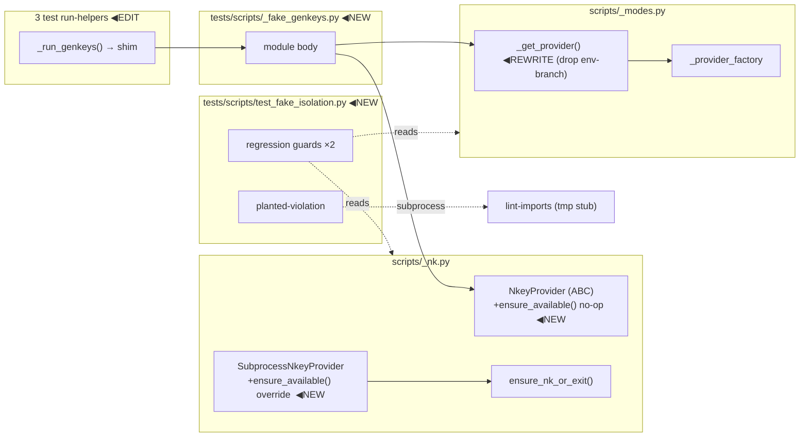

## Summary

Relocate the nkey fake-injection seam out of `scripts/_modes.py` into a `tests/`-resident
shim, then delete the `NKEY_PROVIDER=="fake"` env-branch and the `.importlinter`
`ignore_imports` exemption — making a prod→`tests.fakes` import structurally impossible (CI-enforced).

## Architecture

### Data flow (config → loader → runtime injection)

```mermaid
flowchart TD
    subgraph cfg["build config"]
        IL[".importlinter<br/>tests-fakes-isolation<br/>forbidden: tests (was tests.fakes)<br/>ignore_imports: REMOVED"]
    end
    subgraph prod["scripts/ (production)"]
        MAIN["gen_nkeys.py::main(argv)<br/>sys.path += repo-root"]
        GETP["_modes._get_provider()<br/>p = _provider_factory()<br/>p.ensure_available()"]
        FACT["_provider_factory<br/>= SubprocessNkeyProvider"]
        SUB["SubprocessNkeyProvider<br/>ensure_available()→ensure_nk_or_exit()"]
        MAIN --> GETP --> FACT --> SUB
    end
    subgraph test["tests/ (test-only DI seam)"]
        SHIM["_fake_genkeys.py<br/>sys.path += repo-root<br/>_modes._provider_factory = FakeNkeyProvider<br/>→ main()"]
        MP["in-process: monkeypatch.setattr<br/>(_modes,_provider_factory,Fake)"]
        FAKE["FakeNkeyProvider<br/>inherits no-op ensure_available()"]
    end
    SHIM -.overrides.-> FACT
    MP -.overrides.-> FACT
    SHIM -.selects.-> FAKE
    IL -.lint-imports gate.-> prod
    style prod fill:#1b2a1b
    style test fill:#2a1b2a
    style cfg fill:#2a2a1b
```

### File × Function map

## Agents

| Agent instance | Tasks | Files | Subject |
|----------------|-------|-------|---------|
| backend-dev-A | T1, T2 | `scripts/_nk.py`, `scripts/_modes.py` | provider |
| tester-A | T3, T4, T5, T6 | `tests/scripts/_fake_genkeys.py` (new), 3 run-helpers, `test_genkeys_modes.py` in-process | test-injection |
| devops-A | T7 | `.importlinter` | import-contract |
| tester-B | T8, T9 | `tests/scripts/test_fake_isolation.py` (new), audit grep | verify, audit |

## Wave Structure

3 waves, max 2 parallel agents. Elapsed ~1 session vs ~1.5 sequential. Wave 1 is the
atomic Slice-1 change (prod + tests land together to stay green).

| Wave | Trigger | Agents | Tasks |
|------|---------|--------|-------|
| 1 | start | 2 ∥ | backend-dev-A: T1→T2 · tester-A: T3→T4→T5 ; then tester-A: T6 (RED-GATE, after T1–T5) |
| 2 | Wave 1 green | 1 | devops-A: T7 |
| 3 | Wave 2 green | 1 | tester-B: T8 · T9 |

> Slice-1 coupling: backend-dev-A (scripts/) and tester-A (tests/) edit disjoint files →
> parallel-safe. The worktree only goes green once BOTH finish (T6 barrier). The Slice-1
> commit covers all of T1–T5. T7 (Slice 2) must commit **after** Slice 1 — removing the
> exemption while `_modes.py` still imports `tests.fakes` fails the pre-commit `import-layers` hook.

### Budget — per task

| Task | Items | Class | Est. ops | Split? |
|------|-------|-------|----------|--------|
| T1 add ensure_available | 1 ABC + 1 override | bounded | 3 | — |
| T2 rewrite _get_provider | 1 fn + import cleanup | judgmental | 5 | — |
| T3 write shim | 1 new file | judgmental | 5 | — |
| T4 migrate 3 run-helpers | 3 files | judgmental | 6 | — |
| T5 migrate 2 in-process tests | 2 edits | judgmental | 4 | — |
| T6 RED-GATE pytest tests/scripts | 1 run | bounded | 2 | — |
| T7 .importlinter edit + lint-imports | 1 file | bounded | 3 | — |
| T8 verify-tests (3) | 1 new file | judgmental | 8 | — |
| T9 audit grep + PR log | scan | judgmental | 5 | — |

**Total estimated ops: ~41**

### Budget — per agent instance

| Instance | Tasks | Σ ops | Subjects | Split? |
|----------|-------|-------|----------|--------|
| backend-dev-A | T1, T2 | 8 | provider | — |
| tester-A | T3, T4, T5, T6 | 17 | test-injection | — (|tasks|=4 ≤ 4, 1 subject) |
| devops-A | T7 | 3 | import-contract | — |
| tester-B | T8, T9 | 13 | verify, audit | — (2 subjects ≤ 2) |

No splits required. (tester split A/B deliberately keeps each instance ≤ 2 subjects.)

## Consistency Report

13 / 13 spec criteria covered. 0 untraced tasks. 0 exemptions.

| Spec criterion (SC) | Task(s) |
|---|---|
| SC1 `_modes.py` no NKEY_PROVIDER/env/tests.fakes | T2 |
| SC2 `_get_provider` pure dispatch | T2 |
| SC3 `ensure_available()` concrete no-op + Subprocess override + nk-absent exit | T1 |
| SC4 shim exists (sys.path + factory + delegate) | T3 |
| SC5 3 run-helpers use shim, no env | T4 |
| SC6 2 in-process tests use `setattr` | T5 |
| SC7 no NKEY_PROVIDER/LYRA_TEST_MODE under `tests/scripts/` | T4, T5, T6 |
| SC8 `.importlinter` no ignore_imports, forbidden=tests | T7 |
| SC9 planted-violation fails lint-imports | T8 |
| SC10 regression guards unconditional + in default run | T8 |
| SC11 no new fakes in prod paths | T9 |
| SC12 lint-imports 0 + pytest green | T6, T7, T8 (+ /validate) |
| SC13 PR audit log + retired-debt note | T9 |

## Micro-Tasks

### Slice V1 — Relocate injection seam (Wave 1, atomic)

**T1** — Add `ensure_available()` to provider hierarchy · `scripts/_nk.py` · backend-dev-A · subject: provider · SC3 · GREEN · diff 2
- Add concrete no-op to ABC: `def ensure_available(self) -> None: return None` (NOT `@abstractmethod`).
- Override in `SubprocessNkeyProvider`: `def ensure_available(self) -> None: ensure_nk_or_exit()`.
- Verify: `grep -A1 "def ensure_available" scripts/_nk.py` shows both; `uv run pyright scripts/_nk.py` clean.

**T2** — Rewrite `_get_provider()`, delete env-branch · `scripts/_modes.py` · backend-dev-A · subject: provider · SC1,SC2 · GREEN · diff 3
- New body: `provider = _provider_factory(); provider.ensure_available(); return provider`.
- Delete the `if env_provider == "fake": …` block, the lazy `from tests.fakes…` import, the `LYRA_TEST_MODE` check.
- Drop now-unused imports from `_modes.py` (`ensure_nk_or_exit` — moved into `SubprocessNkeyProvider`; keep `os`/`sys` only if still used elsewhere — check).
- Verify: `grep -c "NKEY_PROVIDER\|env_provider\|tests.fakes" scripts/_modes.py` → `0`; `uv run pyright scripts/_modes.py` clean.

**T3** — Create subprocess DI shim · `tests/scripts/_fake_genkeys.py` (new) · tester-A · subject: test-injection · SC4 · GREEN · diff 3
- `sys.path.insert(0, str(Path(__file__).resolve().parents[2]))` BEFORE any `scripts`/`tests` import (mirror `gen_nkeys.py:14-17`).
- `import scripts._modes as _modes` ; `from scripts.gen_nkeys import main` ; `from tests.fakes.nkey_provider import FakeNkeyProvider`.
- `_modes._provider_factory = FakeNkeyProvider` ; `if __name__ == "__main__": main()`.
- Verify: `cd <repo> && python tests/scripts/_fake_genkeys.py genkeys --help` exits 0 (resolves imports, no nk needed).

**T4** — Migrate 3 subprocess run-helpers → shim · `tests/scripts/test_file_modes.py`, `test_genkeys_modes.py`, `test_genkeys_modes_add_identity.py` · tester-A · subject: test-injection · SC5 · REFACTOR · diff 2
- In each `_run_genkeys`: swap `"scripts/gen_nkeys.py"` → `"tests/scripts/_fake_genkeys.py"`; delete the `run_env["NKEY_PROVIDER"]` + `run_env["LYRA_TEST_MODE"]` lines.
- Verify: `grep -c "NKEY_PROVIDER" tests/scripts/test_file_modes.py tests/scripts/test_genkeys_modes_add_identity.py` → `0` each.

**T5** — Migrate 2 in-process tests → `setattr` DI · `tests/scripts/test_genkeys_modes.py` · tester-A · subject: test-injection · SC6 · REFACTOR · diff 2
- In the `_mode_full_provision` (~:541) and `_mode_regenerate` (~:778) cases: replace `monkeypatch.setenv("NKEY_PROVIDER","fake")` + `monkeypatch.setenv("LYRA_TEST_MODE","1")` with `monkeypatch.setattr(_modes, "_provider_factory", FakeNkeyProvider)` (import `_modes` + `FakeNkeyProvider`).
- Verify: `grep -c "NKEY_PROVIDER\|LYRA_TEST_MODE" tests/scripts/test_genkeys_modes.py` → `0`.

**T6** — RED-GATE: Slice 1 green · tester-A · subject: test-injection · SC7,SC12 · RED-GATE · diff 1 · blockedBy T1,T2,T3,T4,T5
- Verify: `uv run pytest tests/scripts/ -q` exit 0; `grep -rc "NKEY_PROVIDER\|LYRA_TEST_MODE" tests/scripts/ | grep -v ':0'` empty.

### Slice V2 — Seal the contract (Wave 2)

**T7** — Remove exemption + broaden forbidden · `.importlinter` · devops-A · subject: import-contract · SC8 · REFACTOR · diff 2 · blockedBy T6
- In `[importlinter:contract:tests-fakes-isolation]`: delete the entire `ignore_imports = …` block; change `forbidden_modules` from `tests.fakes` to `tests`.
- Verify: `uv run lint-imports` exit 0; `awk '/tests-fakes-isolation/,/^\[/' .importlinter | grep -c ignore_imports` → `0`.

### Slice V3 — Prove + audit (Wave 3)

**T8** — Verify-tests · `tests/scripts/test_fake_isolation.py` (new) · tester-B · subject: verify · SC9,SC10 · GREEN · diff 4 · blockedBy T7
- Test (a) prod-path guard: read `scripts/_modes.py`; assert no `NKEY_PROVIDER`, `env_provider`, `tests.fakes`.
- Test (b) contract guard: parse `.importlinter`; assert `tests-fakes-isolation` has no `ignore_imports` and `forbidden_modules` includes `tests`.
- Test (c) planted-violation: build `tmp_path` stub (`scripts/{__init__,_violation}.py` with `from tests.fakes import nkey_provider`; `tests/{__init__}.py`, `tests/fakes/__init__.py`); write `tmp_path/.importlinter` with `root_packages = scripts, tests` ONLY, `source_modules = scripts`, `forbidden_modules = tests`; `subprocess.run(["lint-imports","--config",str(p/".importlinter")], cwd=tmp_path, env={**os.environ, "PYTHONPATH": ""})`; assert returncode ≠ 0 and `_violation` in output.
- All three unconditional (no `@skip`/`xfail`).
- Verify: `uv run pytest tests/scripts/test_fake_isolation.py -q` exit 0 (3 passed).

**T9** — Fakes/stubs audit + PR log · audit grep · tester-B · subject: audit · SC11,SC13 · GREEN · diff 3 · blockedBy T7
- `grep -rilE 'fake|mock|stub' src/ scripts/ --include='*.py'`; classify each hit (test-double vs legitimate domain term).
- Produce the PR-body audit table: every fake/mock/stub + location + verdict (in prod-importable path? Y/N); note the retired `scripts._modes -> tests.fakes.nkey_provider` quality-debt entry. Save to `artifacts/plans/1093-audit-log.md` for the /pr step to inline.
- Verify: audit table exists; 0 hits classified as "test-double in prod path".

## Task Seeding Blueprint

<!-- Used by /implement to seed TaskCreate calls. T-numbers ref this list, not session IDs.
     Seed in wave order; within a wave all rows are parallel (∥) unless chained (T1→T2). -->

### Wave 1 — no deps, 2 agents ∥

| Task | Agent instance | blockedBy | Subject |
|------|---------------|-----------|---------|
| T1 | backend-dev-A | — | provider |
| T2 | backend-dev-A | T1 | provider |
| T3 | tester-A | — | test-injection |
| T4 | tester-A | T3 | test-injection |
| T5 | tester-A | T3 | test-injection |
| T6 | tester-A | T1,T2,T3,T4,T5 | test-injection |

### Wave 2 — after Wave 1 green, 1 agent

| Task | Agent instance | blockedBy | Subject |
|------|---------------|-----------|---------|
| T7 | devops-A | T6 | import-contract |

### Wave 3 — after Wave 2 green, 1 agent

| Task | Agent instance | blockedBy | Subject |
|------|---------------|-----------|---------|
| T8 | tester-B | T7 | verify |
| T9 | tester-B | T7 | audit |

## Reference Patterns

- `scripts/gen_nkeys.py:14-17` — the `sys.path` repo-root bootstrap the shim (T3) mirrors.
- `scripts/gen_nkeys.py:298` — `main(argv)` the shim delegates to.
- `tests/scripts/conftest.py:11` — existing `FakeNkeyProvider` re-export (import convention).
- `tests/scripts/test_genkeys_modes.py:33-46` — existing `_run_genkeys` shape (T4 edits in place).

## Task IDs

<!-- Generated by /plan. Used by /implement to resume tasks on session restart.
     These are kind:"plan-task" session tasks, distinct from the kind:"dev-pipeline" tasks. -->
- T1: 13 — provider (ensure_available hook) · Wave 1 · backend-dev-A
- T2: 14 — provider (_get_provider rewrite) · Wave 1 · backend-dev-A · blockedBy T1
- T3: 15 — test-injection (shim) · Wave 1 · tester-A
- T4: 16 — test-injection (3 run-helpers) · Wave 1 · tester-A · blockedBy T3
- T5: 17 — test-injection (2 in-process) · Wave 1 · tester-A · blockedBy T3
- T6: 18 — RED-GATE (Slice 1 green) · Wave 1 · tester-A · blockedBy T1,T2,T3,T4,T5
- T7: 19 — import-contract (.importlinter) · Wave 2 · devops-A · blockedBy T6
- T8: 20 — verify (verify-tests) · Wave 3 · tester-B · blockedBy T7
- T9: 21 — audit (fakes/stubs + PR log) · Wave 3 · tester-B · blockedBy T7
