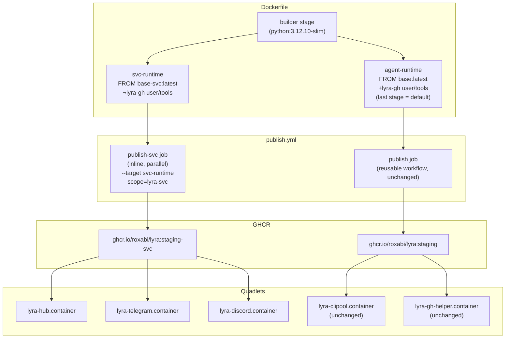
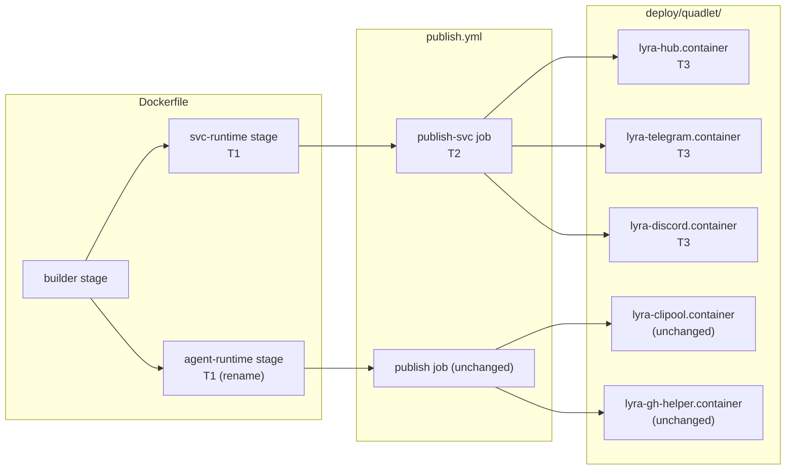

## Summary

Split the lyra Dockerfile into two named runtime stages (`svc-runtime` + `agent-runtime`),
add a parallel CI job to publish `:staging-svc`, and flip hub/telegram/discord Quadlets to the
slim tag. 3 tasks, 2 agents, 2 waves. All changes are infra/deploy only — no Python code touched.

## Architecture

### Data flow



### File × function map



## Agents

| Agent instance | Tasks | Files | Subjects |
|---|---|---|---|
| devops-A | T1, T2 | `Dockerfile`, `.github/workflows/publish.yml` | dockerfile, ci |
| devops-B | T3 | `deploy/quadlet/lyra-{hub,telegram,discord}.container` | quadlets |

## Wave Structure

2 waves, max 2 parallel agents. Elapsed ~15 min vs ~20 min sequential.

| Wave | Trigger | Agents | Tasks |
|---|---|---|---|
| 1 | start | 2 ∥ | devops-A: T1 · devops-B: T3 |
| 2 | T1 done | 1 | devops-A: T2 |

### Budget — per task

| Task | Description | Class | Est. ops | Split? |
|---|---|---|---|---|
| T1 | Dockerfile: rename + add svc-runtime stage | bounded | 5 | — |
| T2 | publish.yml: add publish-svc inline job | judgmental | 8 | — |
| T3 | 3 Quadlet Image= flips | trivial | 4 | — |

**Total estimated ops: 17**

### Budget — per agent instance

| Instance | Tasks | Σ ops | Subjects | Split? |
|---|---|---|---|---|
| devops-A | T1, T2 | 13 | dockerfile, ci | — |
| devops-B | T3 | 4 | quadlets | — |

## Micro-Tasks

### Slice S1 — Dockerfile split

**T1** `[devops-A · Wave 1 · parallel-safe: Y · RED · difficulty: 2]`
Rename `runtime` → `agent-runtime` in `Dockerfile`; insert `svc-runtime` stage before it.

- **File:** `Dockerfile`
- **Description:**
  1. Rename the banner comment and `AS runtime` → `AS agent-runtime` on line 21
  2. Insert a new `svc-runtime` stage (before `agent-runtime`):
     - `FROM ghcr.io/roxabi/base-svc:latest AS svc-runtime`
     - `USER root` + `useradd -u 1500 -m lyra` (same as agent-runtime)
     - `COPY --from=builder --chown=lyra:lyra /app /app`
     - `WORKDIR /app` + `ENV PATH="/app/.venv/bin:$PATH"` + `USER lyra`
     - `HEALTHCHECK` identical to agent-runtime
     - Omit: socat install, lyra-gh user (1501), lyra-tokenuser group, gh-token COPY blocks,
       `LYRA_GH_BIN` env, `/usr/bin/gh` move
  3. Keep `agent-runtime` as the **last** stage so the reusable workflow builds it by default
- **Verify:** `grep -E "^FROM.*(svc-runtime|agent-runtime)" Dockerfile`
- **Expected:** two lines: `FROM ghcr.io/roxabi/base-svc:latest AS svc-runtime` and `FROM ghcr.io/roxabi/base:latest AS agent-runtime`
- **Time:** 5 min
- **Spec trace:** SC-1, SC-2, B1, B2

---

### Slice S2 — CI publish job

<!-- RED-GATE S1: T1 must be merged before T2 can land on staging -->

**T2** `[devops-A · Wave 2 · parallel-safe: N · RED · difficulty: 3 · blockedBy: T1]`
Add `publish-svc` inline job to `.github/workflows/publish.yml`.

- **File:** `.github/workflows/publish.yml`
- **Description:** Add a second top-level job `publish-svc` that runs in parallel with the
  existing `publish` job (no `needs:`):
  ```yaml
  publish-svc:
    runs-on: ubuntu-latest
    permissions:
      contents: read
      packages: write
    steps:
      - uses: actions/checkout@v4
      - uses: docker/setup-buildx-action@v3
      - uses: docker/login-action@v3
        with:
          registry: ghcr.io
          username: ${{ github.actor }}
          password: ${{ secrets.GITHUB_TOKEN }}
      - uses: docker/build-push-action@v5
        with:
          context: .
          target: svc-runtime
          push: true
          tags: ghcr.io/roxabi/lyra:staging-svc
          cache-from: type=gha,scope=lyra-svc
          cache-to: type=gha,mode=max,scope=lyra-svc
  ```
  Note: this job triggers on the same `on:` events as `publish` (push to staging / lyra/v* tags).
  Only push to staging is fully tested; release-tag svc variant is out of scope for this issue.
- **Verify:** `python3 -c "import yaml; j=yaml.safe_load(open('.github/workflows/publish.yml'))['jobs']; print(list(j.keys()))"`
- **Expected:** `['publish', 'publish-svc']`
- **Time:** 8 min
- **Spec trace:** SC-5, B3, B4

---

### Slice S3 — Quadlet flip

**T3** `[devops-B · Wave 1 · parallel-safe: Y · RED · difficulty: 1]`
Flip `Image=` tag in hub, telegram, and discord Quadlet files.

- **Files:** `deploy/quadlet/lyra-hub.container`, `deploy/quadlet/lyra-telegram.container`,
  `deploy/quadlet/lyra-discord.container`
- **Description:** Change `Image=ghcr.io/roxabi/lyra:staging` →
  `Image=ghcr.io/roxabi/lyra:staging-svc` in all three files. Verify clipool and gh-helper are
  untouched.
- **Verify:** `grep "Image=" deploy/quadlet/lyra-hub.container deploy/quadlet/lyra-telegram.container deploy/quadlet/lyra-discord.container deploy/quadlet/lyra-clipool.container deploy/quadlet/lyra-gh-helper.container`
- **Expected:**
  ```
  deploy/quadlet/lyra-hub.container:Image=ghcr.io/roxabi/lyra:staging-svc
  deploy/quadlet/lyra-telegram.container:Image=ghcr.io/roxabi/lyra:staging-svc
  deploy/quadlet/lyra-discord.container:Image=ghcr.io/roxabi/lyra:staging-svc
  deploy/quadlet/lyra-clipool.container:Image=ghcr.io/roxabi/lyra:staging
  deploy/quadlet/lyra-gh-helper.container:Image=ghcr.io/roxabi/lyra:staging
  ```
- **Time:** 3 min
- **Spec trace:** SC-6, SC-7, B5, B6

## Consistency Report

| Metric | Value |
|---|---|
| Spec success criteria covered | 7/10 |
| Uncovered criteria | SC-3 (binary check), SC-4 (size), SC-8 (cold-pull), SC-9 (healthcheck), SC-10 (smoke test) |
| Untraced micro-tasks | 0 |

SC-3/SC-4/SC-8/SC-9/SC-10 are **post-deploy validation criteria** (run after CI pushes the image
to GHCR) — not implementable as code tasks. They are verified manually or in CI after the PR
merges.

## Task Seeding Blueprint

<!-- Used by /implement to seed TaskCreate calls on session start. -->

### Wave 1 — no deps, 2 agents ∥

| Task | Agent instance | blockedBy | Subject |
|---|---|---|---|
| T1 | devops-A | — | dockerfile |
| T3 | devops-B | — | quadlets |

### Wave 2 — after T1, 1 agent

| Task | Agent instance | blockedBy | Subject |
|---|---|---|---|
| T2 | devops-A | T1 | ci |

## Task IDs

<!-- Generated by /plan. Used by /implement to resume tasks on session restart. -->
- T1: 10 — dockerfile
- T2: 12 — ci
- T3: 11 — quadlets
