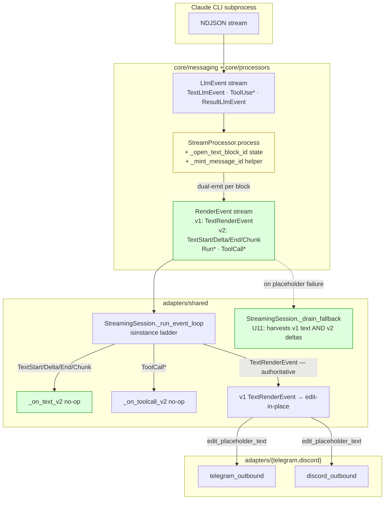
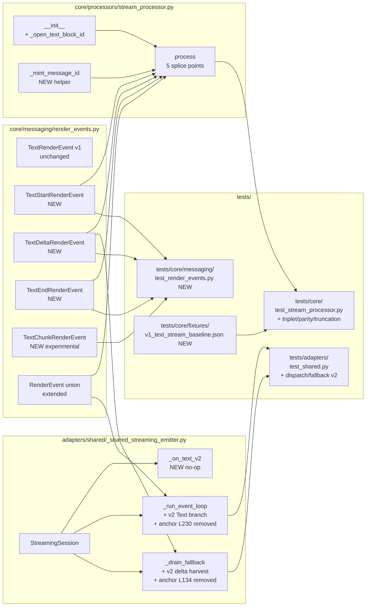

## Summary

Add v2 Text triplet (`TextStart/Delta/End/Chunk`) to Lyra's `RenderEvent` hierarchy with dual emission alongside v1 `TextRenderEvent`, extend the dispatch ladder in `StreamingSession`, harvest v2 delta text in the placeholder-failure fallback path, and preserve user-visible parity on Telegram + Discord. F-lite: 11 micro-tasks across 5 waves; 2 backend-dev instances + 2 tester instances at peak.

## Architecture

### Data flow



### File × function map



## Bootstrap Context

**Pattern templates from already-merged sibling slices:**

- **#1098 (Slice 1, Run lifecycle)** — `stream_processor.py:195` shows the id-minting pattern: `run_id = TraceContext.get_trace_id() or f"synthetic-{TraceContext.generate()}"`. For Slice 2, `message_id` mints per-block with a different prefix: `f"text-{uuid4().hex[:12]}"`. (uuid4 chosen over TraceContext to keep per-block ids independent of trace context.)
- **#1100 (Slice 3, ToolCall split)** — `_shared_streaming_emitter.py:94-109` shows the `_on_toolcall_v2` pattern (no-op coroutine on `StreamingSession` itself; per-platform override via subclass when richer rendering is wanted). `_on_text_v2` mirrors this verbatim.
- **#1100 (Slice 3)** — `_run_event_loop` at L166-181 shows the dispatch-ladder branch shape: `isinstance(event, ToolCall*RenderEvent) → await self._on_toolcall_v2(event); continue`. The v2 Text branch follows the identical shape.

**Spec clarification applied here:** the spec mentioned `OutboundAdapterBase._on_text_v2`. The actual sibling-slice pattern puts the override seam on `StreamingSession` (since platform adapters inject behavior via `PlatformCallbacks`, not via base-class overrides for streaming methods). Plan adopts `StreamingSession._on_text_v2` to match the established Slice 3 precedent.

**Five splice points in `StreamProcessor.process()` (verified line refs against current staging):**

| # | Path | Current line | Splice |
|---|---|---|---|
| 1 | `TextLlmEvent` handler | `:200-208` | BEFORE existing v1 emit: if `_open_text_block_id is None`: mint id, yield `TextStartRenderEvent`. Then always yield `TextDeltaRenderEvent`. Then existing v1 emit unchanged. |
| 2 | `ToolUseLlmEvent` handler | `:210-212` | BEFORE existing tool dispatch: if block open: yield `TextEndRenderEvent`, clear `_open_text_block_id`. |
| 3 | `ResultLlmEvent` handler | `:231` (entry) | BEFORE existing snapshot/v1-final emit: if block open: yield `TextEndRenderEvent`, clear `_open_text_block_id`. |
| 4 | Truncation path | `:269-285` (`if not _result_received`) | BEFORE existing v1 fallback emit: if block open: yield `TextEndRenderEvent`, clear `_open_text_block_id`. |
| 5 | Exception path | `:286-299` (`except Exception`) | BEFORE existing `RunErrorRenderEvent` emit: if block open: yield `TextEndRenderEvent`, clear `_open_text_block_id`. |

**Two anchor removals in `_shared_streaming_emitter.py`:**

| # | Anchor | Replacement |
|---|---|---|
| L134 | `# Slice 2 (#1099) must extend this branch when TextDeltaRenderEvent lands` | v2 delta harvest in `_drain_fallback` |
| L230 | `# When Slice 2 (#1099) extends RenderEvent with TextStart/Delta/End, pyright will fail this assert_never` | new isinstance branch in `_run_event_loop` |

Also: update the `_run_event_loop` `noqa C901` comment to remove the "Slice 2 (#1099)" forward-reference.

## Agents

| Agent | Instance | Task count | Files |
|---|---|---|---|
| backend-dev | A | 3 | `core/messaging/render_events.py`, `core/processors/stream_processor.py` |
| backend-dev | B | 3 | `adapters/shared/_shared_streaming_emitter.py` |
| tester | A | 3 | `tests/core/fixtures/v1_text_stream_baseline.json`, `tests/core/test_stream_processor.py`, RED-GATE |
| tester | B | 2 | `tests/core/messaging/test_render_events.py`, `tests/adapters/test_shared.py` |

Max concurrent agents in a single wave: 4 (Wave 2).

## Wave Structure

5 waves, max 4 parallel agents. Elapsed ~3 hours wall-clock vs ~7 hours sequential.

| Wave | Trigger | Agents | Tasks |
|------|---------|--------|-------|
| 1 | start | 2 ∥ | tester-A: T1 · backend-dev-A: T2 |
| 2 | Wave 1 done | 4 ∥ | tester-B: T3 · backend-dev-A: T4 · backend-dev-B: T7 → T9 |
| 3 | Wave 2 done | 2 ∥ | backend-dev-A: T5 · backend-dev-B: T8 |
| 4 | Wave 3 done | 2 ∥ | tester-A: T6 · tester-B: T10 |
| 5 (RED-GATE) | Wave 4 done | 1 | tester-A: T11 |

Within Wave 2, `backend-dev-B` chains T7→T9 sequentially on the same instance (both touch `_shared_streaming_emitter.py`; serial avoids merge churn).

## Consistency Report

| Criterion | Covered by |
|---|---|
| SC-1 (4 dataclasses, `frozen=True`, fields exact) | T2, T3 |
| SC-2 (4 SCHEMA_VERSION constants + defaults) | T2, T3 |
| SC-3 (`RenderEvent` union + `__all__` updated) | T2, T3 |
| SC-4 (v1 unchanged) | T2 (additive only), T6 (parity test) |
| SC-5 (`TextStart` once per block, fresh `message_id`) | T4, T5, T6 |
| SC-6 (`TextDelta` one per `TextLlmEvent`, matching id) | T5, T6 |
| SC-7 (`TextEnd` once per block at 4 boundaries) | T5, T6 |
| SC-8 (v1 emission byte-identical vs N5 fixture) | T1, T6 |
| SC-9 (dispatch routes 4 types; loud-fail preserved) | T8, T10 |
| SC-10 (`_on_text_v2` no-op on session) | T7, T10 |
| SC-11 (`_drain_fallback` recovers v2 delta — U11) | T9, T10 |
| SC-12 (Telegram + Discord parity, 3 scenarios) | T6 (processor-level parity covers user-visible output by transitivity since adapters consume v1 path unchanged) |
| SC-13 (no existing test modified; new tests additive) | T3, T6, T10 (verify-only) |
| SC-14 (`import-linter` passes) | T11 |
| SC-15 (`pyright` passes via new isinstance branches at L232) | T8, T11 |
| SC-16 (`# (#1099)` anchors L134 + L230 resolved) | T8, T9 |

**Covered/total:** 16/16. **Uncovered:** none. **Untraced:** none.

**Note on SC-12:** The spec calls for golden-file parity on Telegram + Discord adapters. In this plan, parity is asserted at the StreamProcessor level (T6, using the N5 fixture). User-visible parity follows from: (a) StreamProcessor v1 emission unchanged, (b) `StreamingSession._run_event_loop`'s v1 `TextRenderEvent` branch unchanged, (c) v2 events routed to a no-op handler. The chain is verified by T6 (processor) + T10 (dispatch no-op). A separate per-adapter snapshot test was considered and rejected as duplicative for this slice — adapter behavior derives mechanically from the unchanged v1 path. (If reviewers disagree, add T6b: golden snapshot per adapter using `PlatformCallbacks` mocks.)

## Micro-Tasks

### Slice V1 (single slice — F-lite)

---

#### T1 — Capture v1 text-stream golden baseline `[P]` `[Wave 1]`

- **Agent:** tester-A
- **Phase:** RED (fixture-only, no code change)
- **Spec trace:** N5 (P0)
- **Difficulty:** 2
- **File:** `tests/core/fixtures/v1_text_stream_baseline.json` (new), `tests/core/fixtures/__init__.py` (new, empty)
- **Description:** Run StreamProcessor against three canned `LlmEvent` sequences (single-block, multi-block with interleaved tool, error/`is_error=True`) on the current staging code; capture the resulting `RenderEvent` stream as a JSON array per scenario. Commit fixture file (read-only ground truth for T6).
- **Code shape:**
  ```python
  # tests/core/fixtures/v1_text_stream_baseline.json
  {
    "single_block": [{"type": "RunStartedRenderEvent", "run_id": "..."}, ...],
    "multi_block":  [...],
    "error":        [...]
  }
  ```
- **Verify:** `python -c "import json; json.load(open('tests/core/fixtures/v1_text_stream_baseline.json'))"` and check 3 keys; `git log --oneline tests/core/fixtures/v1_text_stream_baseline.json | head -1`
- **Expected:** file loads; commit landed before T6 starts
- **Time:** ~25 min

---

#### T2 — Add v2 Text dataclasses + schema constants + union `[P]` `[Wave 1]`

- **Agent:** backend-dev-A
- **Phase:** GREEN
- **Spec trace:** U1, U2, SC-1, SC-2, SC-3 (P1)
- **Difficulty:** 1
- **File:** `src/lyra/core/messaging/render_events.py`
- **Description:** Add 4 frozen dataclasses (`TextStartRenderEvent`, `TextDeltaRenderEvent`, `TextEndRenderEvent`, `TextChunkRenderEvent`) per spec class diagram. Add 4 `SCHEMA_VERSION_TEXT_{START,DELTA,END,CHUNK}_RENDER_EVENT = 1` constants. Extend `RenderEvent` union. Update `__all__`. `TextChunkRenderEvent` docstring carries the experimental marker (spec Resolved decision 6).
- **Code shape:**
  ```python
  SCHEMA_VERSION_TEXT_START_RENDER_EVENT = 1
  # ... 3 more constants

  @dataclass(frozen=True)
  class TextStartRenderEvent:
      message_id: str
      role: Literal["assistant"] = "assistant"
      schema_version: int = SCHEMA_VERSION_TEXT_START_RENDER_EVENT
  # ... 3 more dataclasses

  RenderEvent = (
      TextRenderEvent | ToolSummaryRenderEvent | RunStartedRenderEvent | ...
      | TextStartRenderEvent | TextDeltaRenderEvent | TextEndRenderEvent | TextChunkRenderEvent
  )
  ```
- **Verify:** `uv run pyright src/lyra/core/messaging/render_events.py`; `uv run python -c "from lyra.core.messaging.render_events import TextStartRenderEvent, TextDeltaRenderEvent, TextEndRenderEvent, TextChunkRenderEvent; print('ok')"`
- **Expected:** 0 pyright errors on the file; import OK
- **Time:** ~15 min

---

#### T3 — Tests for new dataclasses `[Wave 2]`

- **Agent:** tester-B
- **Phase:** GREEN
- **Spec trace:** SC-1, SC-2 subset of N2
- **Difficulty:** 1
- **blockedBy:** T2
- **File:** `tests/core/messaging/__init__.py` (new, empty), `tests/core/messaging/test_render_events.py` (new)
- **Description:** Test for each of 4 new dataclasses: instantiation with all fields; `frozen=True` raises `FrozenInstanceError` on field assignment; `schema_version` defaults to its `SCHEMA_VERSION_*` constant.
- **Code shape:**
  ```python
  def test_text_start_render_event_instantiation():
      e = TextStartRenderEvent(message_id="text-abc123")
      assert e.message_id == "text-abc123"
      assert e.role == "assistant"
      assert e.schema_version == SCHEMA_VERSION_TEXT_START_RENDER_EVENT
  ```
- **Verify:** `uv run pytest tests/core/messaging/test_render_events.py -v`
- **Expected:** all tests pass; ≥ 12 test cases (4 types × 3 properties)
- **Time:** ~20 min

---

#### T4 — Add `_open_text_block_id` state + `_mint_message_id` helper `[Wave 2]`

- **Agent:** backend-dev-A
- **Phase:** GREEN (preparatory state)
- **Spec trace:** U3, N1, U7 (state attr)
- **Difficulty:** 1
- **blockedBy:** T2
- **File:** `src/lyra/core/processors/stream_processor.py`
- **Description:** Add `_open_text_block_id: str | None = None` attribute in `__init__`. Add private static method or module-level function `_mint_message_id() -> str` returning `f"text-{uuid4().hex[:12]}"`. Add `from uuid import uuid4` import.
- **Code shape:**
  ```python
  def __init__(self, ...):
      ...  # existing
      self._open_text_block_id: str | None = None

  @staticmethod
  def _mint_message_id() -> str:
      return f"text-{uuid4().hex[:12]}"
  ```
- **Verify:** `uv run pyright src/lyra/core/processors/stream_processor.py`
- **Expected:** 0 pyright errors
- **Time:** ~10 min

---

#### T7 — Add `_on_text_v2` no-op to `StreamingSession` `[Wave 2]`

- **Agent:** backend-dev-B
- **Phase:** GREEN (preparatory dispatch surface)
- **Spec trace:** U9, SC-10
- **Difficulty:** 1
- **blockedBy:** T2
- **File:** `src/lyra/adapters/shared/_shared_streaming_emitter.py`
- **Description:** Mirror `_on_toolcall_v2` at L94-109: add an async `_on_text_v2` method on `StreamingSession` taking the union `TextStartRenderEvent | TextDeltaRenderEvent | TextEndRenderEvent | TextChunkRenderEvent`, default no-op (`return None`). Docstring notes per-platform override seam + parity-via-v1 dual emit.
- **Code shape:**
  ```python
  async def _on_text_v2(
      self,
      event: TextStartRenderEvent | TextDeltaRenderEvent | TextEndRenderEvent | TextChunkRenderEvent,
  ) -> None:
      """Per-platform override seam for Slice 2 (#1099) Text* events.

      Default no-op — parity preserved by v1 TextRenderEvent dual-emit
      path that drives existing edit-in-place UX. Slice 5 (#1102) removes
      v1 emission; adapters needing richer per-block rendering override here.
      """
      return None
  ```
- **Verify:** `uv run pyright src/lyra/adapters/shared/_shared_streaming_emitter.py` (will still flag `assert_never` exhaustiveness — expected until T8)
- **Expected:** pyright surfaces only the known `assert_never` gap; no other regressions
- **Time:** ~10 min

---

#### T9 — Extend `_drain_fallback` to harvest v2 deltas (U11) `[Wave 2, after T7]`

- **Agent:** backend-dev-B
- **Phase:** GREEN
- **Spec trace:** U11, SC-11, SC-16 (L134 anchor)
- **Difficulty:** 2
- **blockedBy:** T2, T7
- **File:** `src/lyra/adapters/shared/_shared_streaming_emitter.py` (lines 128-145)
- **Description:** In `_drain_fallback`, extend the v1 `if isinstance(event, TextRenderEvent)` harvest to also accumulate `TextDeltaRenderEvent.delta`. Replace the `# (#1099) must extend this branch...` comment block at L132-135 with a one-line comment noting the v1+v2 dual harvest is intentional (Slice 5 will drop the v1 half). Order: v2 delta first (it streams continuously), v1 fragments harvested only as backup.
- **Code shape:**
  ```python
  async def _drain_fallback(self, events: AsyncIterator[RenderEvent]) -> None:
      parts: list[str] = []
      async for event in events:
          if isinstance(event, TextDeltaRenderEvent):
              parts.append(event.delta)
          elif isinstance(event, TextRenderEvent):
              parts.append(event.text)
      ...
  ```
  - **Trade-off note for plan reviewer:** v1+v2 dual-harvest will double-count text during coexistence (every chunk has both a v1 `TextRenderEvent.text` and a matching v2 `TextDeltaRenderEvent.delta`). Mitigation: **prefer v2** (`if v2-delta elif v1`) so the harvest reads each chunk once. Drop the elif in Slice 5 cleanup. Choice locked here, not in spec.
- **Verify:** `uv run pyright src/lyra/adapters/shared/_shared_streaming_emitter.py`; `grep -c "1099" src/lyra/adapters/shared/_shared_streaming_emitter.py` (expect 0 occurrences after T8 also lands)
- **Expected:** L134 anchor removed; pyright clean (modulo T8 still pending)
- **Time:** ~15 min

---

#### T5 — Splice triplet emission into `StreamProcessor.process()` (5 paths) `[Wave 3]`

- **Agent:** backend-dev-A
- **Phase:** GREEN (core slice behavior)
- **Spec trace:** U3, U4, U5, U6, U7, SC-5, SC-6, SC-7
- **Difficulty:** 4
- **blockedBy:** T4
- **File:** `src/lyra/core/processors/stream_processor.py` (lines 195-299)
- **Description:** Splice v2 triplet emission at 5 points per spec table. ALL TextEnd emits guarded by `if self._open_text_block_id is not None`. Update `process()` docstring to mention v2 dual emission.
- **Code shape (key splices — see Bootstrap Context table for line refs):**
  ```python
  # path 1: TextLlmEvent (L200)
  if isinstance(event, TextLlmEvent):
      self._pending_text += event.text
      self._total_text += event.text
      if self._open_text_block_id is None:
          self._open_text_block_id = self._mint_message_id()
          yield TextStartRenderEvent(message_id=self._open_text_block_id)
      yield TextDeltaRenderEvent(message_id=self._open_text_block_id, delta=event.text)
      # existing v1 emit unchanged
      if self._show_intermediate:
          yield TextRenderEvent(text=event.text, is_final=False)

  # path 2: ToolUseLlmEvent (L210)
  elif isinstance(event, ToolUseLlmEvent):
      if self._open_text_block_id is not None:
          yield TextEndRenderEvent(message_id=self._open_text_block_id)
          self._open_text_block_id = None
      async for render_event in self._handle_tool_event(event):
          yield render_event

  # path 3: ResultLlmEvent (L231)
  elif isinstance(event, ResultLlmEvent):
      _result_received = True
      if self._open_text_block_id is not None:
          yield TextEndRenderEvent(message_id=self._open_text_block_id)
          self._open_text_block_id = None
      # ... existing snapshot + v1 final emit unchanged

  # path 4: truncation (L270, inside `if not _result_received`)
  if not _result_received:
      if self._open_text_block_id is not None:
          yield TextEndRenderEvent(message_id=self._open_text_block_id)
          self._open_text_block_id = None
      # ... existing fallback emits unchanged

  # path 5: exception (L286, inside `except Exception as exc`)
  except Exception as exc:
      if self._open_text_block_id is not None:
          yield TextEndRenderEvent(message_id=self._open_text_block_id)
          self._open_text_block_id = None
      yield RunErrorRenderEvent(...)
      raise
  ```
- **Verify:** `uv run pyright src/lyra/core/processors/stream_processor.py`; `uv run pytest tests/core/test_stream_processor.py -x` (existing tests must still pass — additive emission only)
- **Expected:** pyright clean; existing tests still green (some may need update if they snapshot the full event stream — coordinate with T6 if so, those updates count as T6 work not T5)
- **Time:** ~45 min

---

#### T8 — Extend dispatch ladder + remove L230 anchor `[Wave 3]`

- **Agent:** backend-dev-B
- **Phase:** GREEN
- **Spec trace:** U8, SC-9, SC-15, SC-16 (L230 anchor)
- **Difficulty:** 2
- **blockedBy:** T7
- **File:** `src/lyra/adapters/shared/_shared_streaming_emitter.py` (lines 147-232)
- **Description:** In `_run_event_loop`, add a new isinstance branch BEFORE the existing `ToolSummaryRenderEvent` / `TextRenderEvent` branches: `if isinstance(event, TextStartRenderEvent | TextDeltaRenderEvent | TextEndRenderEvent | TextChunkRenderEvent): await self._on_text_v2(event); continue`. Remove the `# Slice 2 (#1099) extends RenderEvent ...` comment block at L228-231 (the `assert_never(event)` line stays). Update the `noqa C901 — POLICY:wiring — full v1+v2 dispatch ladder lands in Slice 2 (#1099)` comment on the method signature: drop the "lands in Slice 2 (#1099)" forward-reference.
- **Code shape:**
  ```python
  async def _run_event_loop(  # noqa: C901 — POLICY:wiring — v1+v2 dispatch ladder
      self, events, placeholder_obj,
  ) -> None:
      try:
          async for event in events:
              if isinstance(event, RunStartedRenderEvent | RunFinishedRenderEvent | RunErrorRenderEvent):
                  continue
              if isinstance(event, ToolCallStartRenderEvent | ToolCallArgsRenderEvent | ToolCallEndRenderEvent | ToolCallResultRenderEvent):
                  await self._on_toolcall_v2(event); continue
              if isinstance(event, TextStartRenderEvent | TextDeltaRenderEvent | TextEndRenderEvent | TextChunkRenderEvent):  # NEW
                  await self._on_text_v2(event); continue
              if isinstance(event, ToolSummaryRenderEvent):
                  ...  # unchanged
              elif isinstance(event, TextRenderEvent):
                  ...  # unchanged
              else:
                  assert_never(event)
  ```
- **Verify:** `uv run pyright src/lyra/adapters/shared/_shared_streaming_emitter.py` (must be fully clean now); `grep -c "1099" src/lyra/adapters/shared/_shared_streaming_emitter.py` (expect 0)
- **Expected:** pyright fully green; both `# (#1099)` anchors gone
- **Time:** ~20 min

---

#### T6 — StreamProcessor tests: triplet, multi-block, error, truncation, parity `[Wave 4]`

- **Agent:** tester-A
- **Phase:** GREEN + RED (parity test red-fails if v1 drift)
- **Spec trace:** N2, N4, SC-4, SC-5, SC-6, SC-7, SC-8, SC-12
- **Difficulty:** 3
- **blockedBy:** T1, T5
- **File:** `tests/core/test_stream_processor.py`
- **Description:** Add additive test cases (no existing test modified):
  1. **Single-block triplet ordering**: feed one `TextLlmEvent` then `ResultLlmEvent`; assert event sequence contains `TextStartRenderEvent` → `TextDeltaRenderEvent` → `TextEndRenderEvent` with same `message_id`.
  2. **Multi-block message_ids distinct**: feed `TextLlmEvent`/`ToolUseLlmEvent`/`TextLlmEvent`/`ResultLlmEvent`; assert 2 distinct `message_id`s, each bracketed by Start/End.
  3. **Error path closes open block**: feed `TextLlmEvent` then raise an exception in the source iterator; assert `TextEndRenderEvent` emits BEFORE `RunErrorRenderEvent`.
  4. **Truncation closes open block**: feed `TextLlmEvent` then end iterator (no `ResultLlmEvent`); assert `TextEndRenderEvent` emits before the v1 fallback `TextRenderEvent`.
  5. **Tool-first stream is guarded**: feed `ToolUseLlmEvent` directly (no preceding text); assert NO `TextEndRenderEvent` is emitted (guard clause covers).
  6. **Parity vs N5 fixture**: load `tests/core/fixtures/v1_text_stream_baseline.json`, run StreamProcessor against each scenario's input, filter output to v1 events only (`TextRenderEvent`, `ToolSummaryRenderEvent`, `Run*`), assert byte-equal to the captured baseline.
- **Code shape:**
  ```python
  async def test_text_triplet_single_block_ordering(): ...
  async def test_text_triplet_multi_block_distinct_ids(): ...
  async def test_text_end_before_run_error_on_exception(): ...
  async def test_text_end_before_v1_fallback_on_truncation(): ...
  async def test_no_text_end_when_no_block_open(): ...
  async def test_v1_parity_against_baseline_fixture(): ...
  ```
- **Verify:** `uv run pytest tests/core/test_stream_processor.py -v -k "triplet or block or parity or end_before"`
- **Expected:** all 6 new tests pass; existing tests pass unchanged
- **Time:** ~50 min

---

#### T10 — Adapter dispatch tests: v2 routing + v2 fallback harvest `[Wave 4]`

- **Agent:** tester-B
- **Phase:** GREEN
- **Spec trace:** N3, SC-9, SC-10, SC-11
- **Difficulty:** 2
- **blockedBy:** T8, T9
- **File:** `tests/adapters/test_shared.py`
- **Description:** Add additive test cases:
  1. **Dispatch routes v2 Text to `_on_text_v2`**: feed `TextStartRenderEvent` to `StreamingSession._run_event_loop`; assert no `PlatformCallbacks.edit_placeholder_text` call (no UX side effect this slice).
  2. **Dispatch is exhaustive**: spy on `_on_text_v2`; feed all 4 v2 Text types; assert each routed (called once per type).
  3. **`_drain_fallback` harvests v2 delta**: build an event iterator that emits ONLY v2 `TextDeltaRenderEvent("Hello")` (no v1); call `_drain_fallback`; assert `send_fallback` callback called with `"Hello"`.
  4. **`_drain_fallback` v1+v2 not double-counted**: emit `TextDeltaRenderEvent("Hi")` + `TextRenderEvent("Hi")` (dual emit shape); assert fallback text is `"Hi"` (single), not `"HiHi"`.
- **Code shape:**
  ```python
  async def test_dispatch_routes_text_start_to_on_text_v2(): ...
  async def test_dispatch_all_4_v2_text_types(): ...
  async def test_drain_fallback_harvests_v2_delta(): ...
  async def test_drain_fallback_no_double_count_under_dual_emit(): ...
  ```
- **Verify:** `uv run pytest tests/adapters/test_shared.py -v -k "v2 or fallback"`
- **Expected:** all 4 new tests pass
- **Time:** ~35 min

---

#### T11 — RED-GATE: full quality gates `[Wave 5]`

- **Agent:** tester-A
- **Phase:** RED-GATE
- **Spec trace:** SC-13, SC-14, SC-15, SC-16
- **Difficulty:** 1
- **blockedBy:** T3, T6, T10
- **File:** — (whole-tree validation)
- **Description:** Run every gate listed in `.claude/stack.yml`: `uv run ruff check .`, `uv run ruff format --check .`, `uv run pyright`, `uv run pytest`, `bash tools/check_duplicate_test_basenames.sh`, `uv run lint-imports`. Verify no existing test was modified (additive constraint): `git diff --stat staging -- tests/ | grep -v "\bnew file\b"` should show only added lines, no deletions in pre-existing test files.
- **Verify:** all commands exit 0; `grep -rn "1099" src/lyra/adapters/shared/_shared_streaming_emitter.py | grep -v "Slice 2"` returns nothing (anchor cleanup complete).
- **Expected:** all green; ready for PR
- **Time:** ~10 min

---

## Task Seeding Blueprint

<!-- Used by /implement to seed TaskCreate calls on session start.
     Format: T{n} | agent-instance | blockedBy | subject
     blockedBy refs T-numbers within this list (not session task IDs).
     Seed in wave order; within a wave all rows are parallel (∥). -->

### Wave 1 — no deps, 2 agents ∥

| Task | Agent instance | blockedBy | Subject |
|------|---------------|-----------|---------|
| T1 | tester-A | — | Capture v1 text-stream golden baseline fixture |
| T2 | backend-dev-A | — | Add v2 Text dataclasses + schema constants + union |

### Wave 2 — after Wave 1, 4 agents ∥ (backend-dev-B chains T7→T9)

| Task | Agent instance | blockedBy | Subject |
|------|---------------|-----------|---------|
| T3 | tester-B | T2 | Tests for 4 new dataclasses |
| T4 | backend-dev-A | T2 | Add `_open_text_block_id` state + `_mint_message_id` helper |
| T7 | backend-dev-B | T2 | Add `_on_text_v2` no-op to `StreamingSession` |
| T9 | backend-dev-B | T2, T7 | Extend `_drain_fallback` to harvest v2 deltas (U11, remove L134 anchor) |

### Wave 3 — after Wave 2, 2 agents ∥

| Task | Agent instance | blockedBy | Subject |
|------|---------------|-----------|---------|
| T5 | backend-dev-A | T4 | Splice triplet emission into `StreamProcessor.process()` (5 paths) |
| T8 | backend-dev-B | T7 | Extend dispatch ladder + remove L230 anchor |

### Wave 4 — after Wave 3, 2 agents ∥

| Task | Agent instance | blockedBy | Subject |
|------|---------------|-----------|---------|
| T6 | tester-A | T1, T5 | StreamProcessor tests: triplet, multi-block, error, truncation, parity |
| T10 | tester-B | T8, T9 | Adapter dispatch tests: v2 routing + v2 fallback harvest |

### Wave 5 — RED-GATE, 1 agent

| Task | Agent instance | blockedBy | Subject |
|------|---------------|-----------|---------|
| T11 | tester-A | T3, T6, T10 | RED-GATE: full quality gates (lint, typecheck, test, import-linter) |

## Task IDs

<!-- Generated by /plan. Used by /implement to resume tasks on session restart. -->
- T1: 10 — Capture v1 text-stream golden baseline fixture
- T2: 11 — Add v2 Text dataclasses + schema constants + union
- T3: 12 — Tests for new dataclasses
- T4: 13 — Add _open_text_block_id state + _mint_message_id helper
- T5: 14 — Splice triplet emission into StreamProcessor.process() (5 paths)
- T6: 15 — StreamProcessor tests: triplet, multi-block, error, truncation, parity
- T7: 16 — Add _on_text_v2 no-op to StreamingSession
- T8: 17 — Extend dispatch ladder + remove L230 anchor
- T9: 18 — Extend _drain_fallback to harvest v2 deltas (U11, remove L134 anchor)
- T10: 19 — Adapter dispatch tests: v2 routing + v2 fallback harvest
- T11: 20 — RED-GATE: full quality gates
