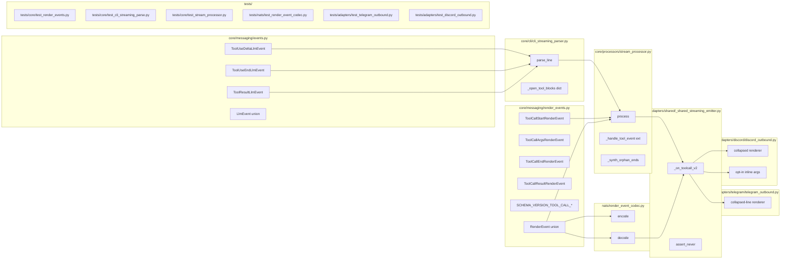

## Summary

Slice 3 of umbrella #1096. Add 4 streamed `ToolCall*` RenderEvents + 3 new
`LlmEvent` types; instrument `cli_streaming_parser` to forward
`input_json_delta` / `content_block_stop` / `tool_result`; wire
`StreamProcessor` to emit v2 events while keeping v1 `ToolSummaryRenderEvent`
dual-emit; render the new events in Telegram (collapsed, parity) and Discord
(opt-in args streaming). Schema bump only — no v1 deletion this slice (Slice 5
removes).

## Architecture

### Data flow

```mermaid
flowchart TD
  subgraph cli[core/cli/cli_streaming_parser.py]
    P[parse_line]
    P --> T1[ToolUseLlmEvent\nstart, input={}]
    P --> T2[ToolUseDeltaLlmEvent\npartial_json]
    P --> T3[ToolUseEndLlmEvent]
    P --> T4[ToolResultLlmEvent\ncontent, is_error]
  end

  subgraph proc[core/processors/stream_processor.py]
    SP[process]
    DEDUPE[_seen_tool_ids dedupe]
    ORPHAN[orphan-end synthesis at ResultLlmEvent]
    SP --> DEDUPE
    SP --> ORPHAN
  end

  subgraph events[core/messaging/]
    EVT[events.py — LlmEvent union widened]
    REND[render_events.py — RenderEvent union widened]
  end

  subgraph adp[adapters/]
    SE[shared/_shared_streaming_emitter.py\n_on_toolcall_v2]
    TG[telegram/telegram_outbound.py\ncollapsed line]
    DC[discord/discord_outbound.py\ncollapsed | streaming]
  end

  subgraph nats[nats/render_event_codec.py]
    ENC[encode]
    DEC[decode + check_schema_version]
  end

  T1 --> SP
  T2 --> SP
  T3 --> SP
  T4 --> SP
  SP -->|ToolCallStart/Args/End/Result| SE
  SP -.->|ToolSummaryRenderEvent v1 dual-emit| SE
  SE --> TG
  SE --> DC
  SP --> ENC
  DEC --> SE

  classDef new fill:#e0f7e0,stroke:#2e7d32
  class T2,T3,T4,DEDUPE,ORPHAN new
```

### File × Function map



## Bootstrap Context

From spec §CLI subprocess instrumentation:
- Existing parser handles only `text_delta` deltas + post-hoc `assistant`-message
  full content blocks. Adding 3 new wire shapes:
  `input_json_delta`, `content_block_stop`, user-message `tool_result`.
- Existing `ToolUseLlmEvent` is reused for the `content_block_start` start signal
  (same as today, just dedupe vs. post-hoc emission).
- `StreamProcessor.process()` currently has `else:  # ResultLlmEvent` at
  `stream_processor.py:128` — must be widened to explicit dispatch on the new
  LlmEvent variants (architect-flagged in spec review).
- `_shared_streaming_emitter.py` already has `assert_never(event)` final branch
  (Slice 1 precedent at `_shared_streaming_emitter.py:198`). Adding the
  `_on_toolcall_v2` branch BEFORE assert_never is the contract.
- Existing `ToolSummaryRenderEvent` emission is in
  `stream_processor.py:131,156,302-310` — preserved verbatim (dual-emit).

## Agents

| Agent instance | Task count | Files |
|---|---|---|
| backend-dev-A | 6 | core/messaging/{render_events,events}.py, nats/render_event_codec.py |
| backend-dev-B | 5 | core/cli/cli_streaming_parser.py, core/processors/stream_processor.py |
| backend-dev-C | 4 | adapters/shared/_shared_streaming_emitter.py, adapters/telegram/telegram_outbound.py, adapters/discord/discord_outbound.py |
| tester-A | 5 | tests/core/test_render_events.py, tests/core/test_cli_streaming_parse.py, tests/core/test_stream_processor.py |
| tester-B | 3 | tests/nats/test_render_event_codec.py, tests/adapters/test_telegram_outbound.py, tests/adapters/test_discord_outbound.py |
| devops-A | 1 | tools/file_exemptions.txt (if needed) |

Total: 24 micro-tasks across 6 agent instances, 5 waves.

## Wave Structure

5 waves, max 4 parallel agents. Elapsed ~3 sessions vs ~7 sequential.

| Wave | Trigger | Agents | Tasks |
|------|---------|--------|-------|
| 1 | start | 2 ∥ | tester-A: T1 (RED schema-tests) · backend-dev-A: T2→T3 (RenderEvent + LlmEvent dataclasses + unions) |
| 2 | Wave 1 done | 4 ∥ | tester-A: T4 (RED parser-tests) · backend-dev-B: T5→T6 (parser deltas+stop+tool_result, orphan tracker) · tester-B: T7 (RED codec-tests) · backend-dev-A: T8→T9 (codec encode + decode + schema floor) |
| 3 | Wave 2 done | 2 ∥ | tester-A: T10 (RED stream_processor-tests) · backend-dev-B: T11→T12→T13 (SP dispatch widening + dedupe + orphan synthesis + dual-emit preservation) |
| 4 | Wave 3 done | 3 ∥ | backend-dev-C: T14→T15 (shared dispatch _on_toolcall_v2 skeleton + assert_never update) · tester-B: T16 (RED adapter-tests) · backend-dev-C: T17→T18 (Telegram collapsed renderer + Discord collapsed + opt-in flag) |
| 5 | Wave 4 done | 2 ∥ | tester-A: T19 (parity snapshot test) · tester-B: T20→T21 (Discord flag-on/off tests) · devops-A: T22 (file_exemptions if needed) · backend-dev-C: T23 (CHANGELOG) · backend-dev-A: T24 (REFACTOR pass) |

## Consistency Report

| | Total | Covered | Uncovered |
|---|---|---|---|
| Spec acceptance criteria | 13 | 13 | 0 |
| Affordances U1-U9, N1-N2, S1 | 12 | 12 | 0 |
| Sub-slices 3a-3e | 5 | 5 | 0 |

All spec criteria mapped. No exemptions.

## Micro-Tasks

### Slice 3a — Schemas (Wave 1)

#### T1 — RED: schema export + frozen tests `[P]` `[tester-A]`
- File: `tests/core/test_render_events.py`, `tests/core/test_events.py` (new)
- Spec trace: SC-1, SC-2
- Phase: RED
- Snippet:
  ```python
  def test_toolcall_render_events_exported():
      from lyra.core.messaging.render_events import (
          ToolCallStartRenderEvent, ToolCallArgsRenderEvent,
          ToolCallEndRenderEvent, ToolCallResultRenderEvent,
          SCHEMA_VERSION_TOOL_CALL_START_RENDER_EVENT,
          # ... etc
      )
      assert ToolCallStartRenderEvent.__dataclass_params__.frozen
      e = ToolCallArgsRenderEvent(tool_call_id="x", delta="y")
      assert e.schema_version == 1

  def test_new_llm_events_exported():
      from lyra.core.messaging.events import (
          ToolUseDeltaLlmEvent, ToolUseEndLlmEvent, ToolResultLlmEvent,
      )
      assert ToolUseDeltaLlmEvent.__dataclass_params__.frozen
  ```
- Verify: `uv run pytest tests/core/test_render_events.py tests/core/test_events.py -k toolcall -x`
- Expected: 4 RED failures (imports do not yet exist)
- Time: 4 min · Difficulty: 1

#### T2 — GREEN: 4 ToolCall* RenderEvents + SCHEMA_VERSION constants `[backend-dev-A]`
- File: `src/lyra/core/messaging/render_events.py`
- Spec trace: SC-1, U1, N1
- Blocked by: T1 (RED gate)
- Phase: GREEN
- Snippet:
  ```python
  SCHEMA_VERSION_TOOL_CALL_START_RENDER_EVENT = 1
  SCHEMA_VERSION_TOOL_CALL_ARGS_RENDER_EVENT = 1
  SCHEMA_VERSION_TOOL_CALL_END_RENDER_EVENT = 1
  SCHEMA_VERSION_TOOL_CALL_RESULT_RENDER_EVENT = 1

  @dataclass(frozen=True)
  class ToolCallStartRenderEvent:
      tool_call_id: str
      tool_name: str
      schema_version: int = SCHEMA_VERSION_TOOL_CALL_START_RENDER_EVENT

  @dataclass(frozen=True)
  class ToolCallArgsRenderEvent:
      tool_call_id: str
      delta: str
      schema_version: int = SCHEMA_VERSION_TOOL_CALL_ARGS_RENDER_EVENT

  @dataclass(frozen=True)
  class ToolCallEndRenderEvent:
      tool_call_id: str
      schema_version: int = SCHEMA_VERSION_TOOL_CALL_END_RENDER_EVENT

  @dataclass(frozen=True)
  class ToolCallResultRenderEvent:
      tool_call_id: str
      content: str
      is_error: bool = False
      schema_version: int = SCHEMA_VERSION_TOOL_CALL_RESULT_RENDER_EVENT

  RenderEvent = (
      TextRenderEvent | ToolSummaryRenderEvent
      | RunStartedRenderEvent | RunFinishedRenderEvent | RunErrorRenderEvent
      | ToolCallStartRenderEvent | ToolCallArgsRenderEvent
      | ToolCallEndRenderEvent | ToolCallResultRenderEvent
  )

  __all__ = [..., "ToolCallStartRenderEvent", ...]
  ```
- Verify: `uv run pytest tests/core/test_render_events.py -x`
- Expected: T1 RED-half goes GREEN
- Time: 6 min · Difficulty: 2

#### T3 — GREEN: 3 new LlmEvents + LlmEvent union widening `[backend-dev-A]`
- File: `src/lyra/core/messaging/events.py`
- Spec trace: SC-2, U2
- Blocked by: T2 (chained on same agent — keeps the `__all__` edits adjacent in time)
- Phase: GREEN
- Snippet:
  ```python
  @dataclass(frozen=True)
  class ToolUseDeltaLlmEvent:
      tool_id: str
      partial_json: str

  @dataclass(frozen=True)
  class ToolUseEndLlmEvent:
      tool_id: str

  @dataclass(frozen=True)
  class ToolResultLlmEvent:
      tool_id: str
      content: str
      is_error: bool = False

  LlmEvent = (
      TextLlmEvent | ToolUseLlmEvent | ToolUseDeltaLlmEvent
      | ToolUseEndLlmEvent | ToolResultLlmEvent | ResultLlmEvent
  )
  ```
- Verify: `uv run pytest tests/core/test_events.py -x && uv run pyright src/lyra/core/messaging/`
- Expected: T1 RED-half goes GREEN, pyright clean
- Time: 5 min · Difficulty: 2

### Slice 3b — CLI parser (Wave 2)

#### T4 — RED: parser parses input_json_delta + content_block_stop + tool_result `[P]` `[tester-A]`
- File: `tests/core/test_cli_streaming_parse.py`
- Spec trace: SC-3, U3
- Blocked by: T3 (needs new LlmEvent imports)
- Phase: RED
- Snippet:
  ```python
  def test_parse_input_json_delta():
      p = CliStreamingParser("pool-1")
      p.parse_line('{"type":"stream_event","event":{"type":"content_block_start","index":1,"content_block":{"type":"tool_use","id":"toolu_AB","name":"Read","input":{}}}}')
      events = p.parse_line('{"type":"stream_event","event":{"type":"content_block_delta","index":1,"delta":{"type":"input_json_delta","partial_json":"{\\"x\\":1}"}}}')
      assert any(isinstance(e, ToolUseDeltaLlmEvent) and e.tool_id == "toolu_AB"
                 and e.partial_json == '{"x":1}' for e in events)

  def test_parse_content_block_stop():
      # tracks _open_tool_blocks; emits ToolUseEndLlmEvent
      ...

  def test_parse_tool_result_user_message():
      events = p.parse_line('{"type":"user","message":{"content":[{"type":"tool_result","tool_use_id":"toolu_AB","content":"ok","is_error":false}]}}')
      assert any(isinstance(e, ToolResultLlmEvent) and e.tool_id == "toolu_AB"
                 and e.content == "ok" and e.is_error is False for e in events)

  def test_parse_content_block_stop_unknown_index_silent():
      # text block stop should not emit anything
      ...
  ```
- Verify: `uv run pytest tests/core/test_cli_streaming_parse.py -k "tool_result or input_json_delta or content_block_stop" -x`
- Expected: 4 RED failures
- Time: 8 min · Difficulty: 2

#### T5 — GREEN: parser tracks _open_tool_blocks, emits 3 new LlmEvents `[backend-dev-B]`
- File: `src/lyra/core/cli/cli_streaming_parser.py`
- Spec trace: SC-3, U3
- Blocked by: T4 (RED gate)
- Phase: GREEN
- Snippet:
  ```python
  # In __init__:
  self._open_tool_blocks: dict[int, str] = {}

  # In parse_line, content_block_start branch (existing):
  if cb.get("type") == "tool_use":
      tool_id = cb.get("id", "")
      if tool_id and (idx := event_data.get("index")) is not None:
          self._open_tool_blocks[idx] = tool_id
      self._pending.append(ToolUseLlmEvent(...))

  # New content_block_delta input_json_delta:
  elif delta.get("type") == "input_json_delta":
      idx = event_data.get("index")
      if idx in self._open_tool_blocks and (pj := delta.get("partial_json", "")):
          self._pending.append(ToolUseDeltaLlmEvent(
              tool_id=self._open_tool_blocks[idx], partial_json=pj))

  # New content_block_stop:
  elif event_type == "content_block_stop":
      idx = event_data.get("index")
      if idx in self._open_tool_blocks:
          self._pending.append(ToolUseEndLlmEvent(
              tool_id=self._open_tool_blocks.pop(idx)))

  # New user-message tool_result:
  elif msg_type == "user":
      blocks = data.get("message", {}).get("content", [])
      for b in blocks:
          if b.get("type") == "tool_result":
              content = b.get("content", "")
              if isinstance(content, list):
                  content = "".join(
                      blk.get("text", f"[{blk.get('type','?')}]")
                      for blk in content)
              self._pending.append(ToolResultLlmEvent(
                  tool_id=b.get("tool_use_id", ""),
                  content=str(content),
                  is_error=bool(b.get("is_error", False))))
  ```
- Verify: `uv run pytest tests/core/test_cli_streaming_parse.py -x`
- Expected: T4 RED-set goes GREEN
- Time: 10 min · Difficulty: 3

#### T6 — REFACTOR: parser fixture for full tool-using turn `[backend-dev-B]`
- File: `tests/core/fixtures/cli_tool_using_turn.ndjson` (new) + `tests/core/test_cli_streaming_parse.py`
- Spec trace: S1 in spec breadboard
- Blocked by: T5
- Phase: REFACTOR
- Verify: `uv run pytest tests/core/test_cli_streaming_parse.py -k "fixture_full_turn" -x`
- Expected: fixture replays into expected LlmEvent sequence verbatim
- Time: 6 min · Difficulty: 2

### Slice 3d — NATS codec (Wave 2, parallel with 3b)

#### T7 — RED: codec encode/decode + schema floor for 4 ToolCall* events `[P]` `[tester-B]`
- File: `tests/nats/test_render_event_codec.py`
- Spec trace: SC-7, U9, N2
- Blocked by: T2 (needs new RenderEvent imports)
- Phase: RED
- Verify: `uv run pytest tests/nats/test_render_event_codec.py -k toolcall -x`
- Expected: 4–8 RED failures (round-trip + schema floor)
- Time: 6 min · Difficulty: 2

#### T8 — GREEN: codec encode/decode for 4 ToolCall* events `[backend-dev-A]`
- File: `src/lyra/nats/render_event_codec.py`
- Spec trace: SC-7, U9
- Blocked by: T7 (RED gate)
- Phase: GREEN
- Snippet (encode + decode pattern matches Slice 1 precedent for run_started/run_finished — same file):
  ```python
  # encode dispatch:
  elif isinstance(event, ToolCallStartRenderEvent):
      return _wrap("tool_call_start", {
          "tool_call_id": event.tool_call_id,
          "tool_name": event.tool_name,
          "schema_version": event.schema_version,
      })
  # ... same for args / end / result

  # decode dispatch:
  elif event_type == "tool_call_start":
      check_schema_version("tool_call_start", payload.get("schema_version", 0),
          floor=SCHEMA_VERSION_TOOL_CALL_START_RENDER_EVENT)
      return ToolCallStartRenderEvent(...)
  ```
- Update `is_terminal` only if needed (no — these are not terminal).
- Verify: `uv run pytest tests/nats/test_render_event_codec.py -x`
- Expected: T7 GREEN
- Time: 8 min · Difficulty: 3

#### T9 — REFACTOR: file_length check + noqa updates `[backend-dev-A]`
- File: `src/lyra/nats/render_event_codec.py` (+ `tools/file_exemptions.txt` if needed)
- Blocked by: T8
- Phase: REFACTOR
- Verify: `pre-commit run --all-files`
- Expected: file-length + C901 budgets respected (extend `# noqa: C901` if dispatch ladder pushes the function over)
- Time: 3 min · Difficulty: 1

### Slice 3c — StreamProcessor (Wave 3)

#### T10 — RED: ToolCall* emission order, dedupe, orphan synthesis, dual-emit `[P]` `[tester-A]`
- File: `tests/core/test_stream_processor.py`
- Spec trace: SC-4, SC-5, SC-6, SC-7-extra (explicit dispatch)
- Blocked by: T6, T8 (parser + codec must be in place so SP tests can import / mock the new flow)
- Phase: RED
- Snippet:
  ```python
  class TestToolCallLifecycle:
      async def test_emission_order(self):
          # input: ToolUse(start) → ToolUseDelta(2x) → ToolUseEnd → ToolResult → Result
          # expect: ToolCallStart → ToolCallArgs(2x) → ToolCallEnd → ToolCallResult
          #         + ToolSummaryRenderEvent dual-emit (is_complete=True at result)
          ...

      async def test_tool_call_id_consistency(self):
          # all 4 events for same call share tool_call_id verbatim
          ...

      async def test_dedupe_post_hoc_tool_use_event(self):
          # parser emits ToolUseLlmEvent(tool_id=X) twice (start + post-hoc)
          # SP emits ToolCallStart only once
          ...

      async def test_orphan_end_synthesis(self):
          # ToolUse(start) then ResultLlmEvent without ToolUseEnd
          # SP synthesizes ToolCallEnd at result time + WARN log
          ...

      async def test_dual_emit_preserved(self):
          # ToolSummaryRenderEvent still emitted at result with is_complete=True
          ...

      async def test_explicit_dispatch_no_silent_drop(self):
          # ToolUseDeltaLlmEvent injected but not reaching ResultLlmEvent path:
          # process() must dispatch it explicitly, not absorb in else-branch
          ...
  ```
- Verify: `uv run pytest tests/core/test_stream_processor.py -k toolcall -x`
- Expected: 6 RED failures
- Time: 12 min · Difficulty: 3

#### T11 — GREEN: SP `process()` widened dispatch — no bare-else `[backend-dev-B]`
- File: `src/lyra/core/processors/stream_processor.py`
- Spec trace: SC-7-extra (architect-flagged), U4
- Blocked by: T10 (RED gate)
- Phase: GREEN
- Snippet:
  ```python
  async for event in events:
      if isinstance(event, TextLlmEvent):
          self._pending_text += event.text
      elif isinstance(event, ToolUseLlmEvent):
          async for re in self._handle_tool_event(event):
              yield re
      elif isinstance(event, ToolUseDeltaLlmEvent):
          async for re in self._handle_tool_delta(event):
              yield re
      elif isinstance(event, ToolUseEndLlmEvent):
          async for re in self._handle_tool_end(event):
              yield re
      elif isinstance(event, ToolResultLlmEvent):
          async for re in self._handle_tool_result(event):
              yield re
      elif isinstance(event, ResultLlmEvent):
          _result_received = True
          # ... existing logic preserved (snapshot dual-emit, error path, final TextRenderEvent)
          for re in self._synth_orphan_tool_ends():
              yield re
      else:
          assert_never(event)
  ```
- Verify: `uv run pytest tests/core/test_stream_processor.py -k toolcall -x && uv run pyright src/lyra/core/processors/`
- Expected: T10 partial GREEN, pyright clean
- Time: 12 min · Difficulty: 4

#### T12 — GREEN: dedupe + ToolCall* emission + orphan synthesis `[backend-dev-B]`
- File: `src/lyra/core/processors/stream_processor.py`
- Spec trace: SC-4, SC-5, SC-6, U4, resolved decisions 2 & 3
- Blocked by: T11
- Phase: GREEN
- Snippet:
  ```python
  # In __init__:
  self._seen_tool_ids: set[str] = set()
  self._open_tool_call_ids: set[str] = set()  # for orphan synthesis

  async def _handle_tool_event(self, event: ToolUseLlmEvent):
      if event.tool_id in self._seen_tool_ids:
          log.debug("dedupe ToolUseLlmEvent tool_id=%s", event.tool_id)
          return
      self._seen_tool_ids.add(event.tool_id)
      self._open_tool_call_ids.add(event.tool_id)
      yield ToolCallStartRenderEvent(tool_call_id=event.tool_id, tool_name=event.tool_name)
      # existing accumulator + ToolSummary emission preserved
      self._accumulate(event)
      if self._should_emit() and self._has_any_tool_events():
          yield self._emit_snapshot()

  async def _handle_tool_delta(self, event: ToolUseDeltaLlmEvent):
      yield ToolCallArgsRenderEvent(tool_call_id=event.tool_id, delta=event.partial_json)

  async def _handle_tool_end(self, event: ToolUseEndLlmEvent):
      self._open_tool_call_ids.discard(event.tool_id)
      yield ToolCallEndRenderEvent(tool_call_id=event.tool_id)

  async def _handle_tool_result(self, event: ToolResultLlmEvent):
      yield ToolCallResultRenderEvent(
          tool_call_id=event.tool_id, content=event.content, is_error=event.is_error)

  def _synth_orphan_tool_ends(self):
      for tid in list(self._open_tool_call_ids):
          log.warning("orphan ToolCallEnd synthesis tool_id=%s", tid)
          yield ToolCallEndRenderEvent(tool_call_id=tid)
      self._open_tool_call_ids.clear()
  ```
- Verify: `uv run pytest tests/core/test_stream_processor.py -k toolcall -x`
- Expected: T10 GREEN
- Time: 14 min · Difficulty: 4

#### T13 — RED-GATE: pyright + import-linter clean across all SP changes `[backend-dev-B]`
- File: — (verify only)
- Blocked by: T12
- Phase: RED-GATE
- Verify: `uv run pyright && uv run lint-imports`
- Expected: 0 errors
- Time: 2 min · Difficulty: 1

### Slice 3e — Adapters (Wave 4)

#### T14 — GREEN: shared dispatch _on_toolcall_v2 skeleton + assert_never `[backend-dev-C]`
- File: `src/lyra/adapters/shared/_shared_streaming_emitter.py`
- Spec trace: SC-8, U6 (skeleton in 3a deferred to here in same PR)
- Blocked by: T2 (RenderEvents exist)
- Phase: GREEN
- Snippet:
  ```python
  elif isinstance(event, (
      ToolCallStartRenderEvent, ToolCallArgsRenderEvent,
      ToolCallEndRenderEvent, ToolCallResultRenderEvent,
  )):
      await self._on_toolcall_v2(event)
  elif isinstance(event, TextRenderEvent):
      ...
  else:
      assert_never(event)

  async def _on_toolcall_v2(self, event):
      # default no-op; subclasses (telegram/discord) override
      pass
  ```
- Verify: `uv run pyright src/lyra/adapters/shared/`
- Expected: assert_never branch satisfied
- Time: 6 min · Difficulty: 2

#### T15 — RED: adapter parity tests (Telegram collapsed, Discord collapsed/streaming) `[P]` `[tester-B]`
- File: `tests/adapters/test_telegram_outbound.py`, `tests/adapters/test_discord_outbound.py`
- Spec trace: SC-9, SC-10
- Blocked by: T14
- Phase: RED
- Verify: `uv run pytest tests/adapters/ -k toolcall -x`
- Expected: 4–6 RED failures
- Time: 8 min · Difficulty: 3

#### T16 — GREEN: Telegram collapsed-line renderer for ToolCall* `[backend-dev-C]`
- File: `src/lyra/adapters/telegram/telegram_outbound.py`
- Spec trace: SC-9, U7
- Blocked by: T15
- Phase: GREEN
- Snippet:
  ```python
  async def _on_toolcall_v2(self, event):
      # collapse to one summary line per call_id; ignore Args/Start; show on Result
      if isinstance(event, ToolCallResultRenderEvent):
          icon = "❌" if event.is_error else "✅"
          line = f"{icon} tool {event.tool_call_id[-8:]}: {event.content[:80]}"
          await self._append_summary_line(line)
      # Start/Args/End → no-op (parity with v1 ToolSummary)
  ```
- Verify: `uv run pytest tests/adapters/test_telegram_outbound.py -k toolcall -x`
- Expected: Telegram parity tests GREEN
- Time: 8 min · Difficulty: 3

#### T17 — GREEN: Discord collapsed + opt-in args streaming `[backend-dev-C]`
- File: `src/lyra/adapters/discord/discord_outbound.py` + `src/lyra/adapters/discord/discord_config.py`
- Spec trace: SC-10, U8, resolved decision 7
- Blocked by: T16 (chained on same agent for renderer-pattern reuse)
- Phase: GREEN
- Snippet:
  ```python
  STREAM_TOOL_ARGS = os.getenv("LYRA_DISCORD_TOOLCALL_STREAM_ARGS", "").lower() == "true"

  async def _on_toolcall_v2(self, event):
      if not STREAM_TOOL_ARGS:
          # parity with Telegram: collapse to result line
          if isinstance(event, ToolCallResultRenderEvent):
              await self._append_summary_line(...)
          return
      # streaming mode: render Start/Args/Result as inline tool card
      if isinstance(event, ToolCallStartRenderEvent):
          ...
  ```
- Verify: `uv run pytest tests/adapters/test_discord_outbound.py -k toolcall -x`
- Expected: Discord parity + streaming-on tests GREEN
- Time: 10 min · Difficulty: 3

### Slice 3-final — Polish (Wave 5)

#### T18 — REFACTOR: end-to-end parity snapshot test `[P]` `[tester-A]`
- File: `tests/core/test_stream_processor.py` or new `tests/integration/test_toolcall_v2_parity.py`
- Spec trace: SC-9 + SC-10 (parity acceptance)
- Blocked by: T16, T17
- Phase: REFACTOR
- Verify: `uv run pytest -k parity -x`
- Expected: snapshot of full tool-using turn matches v1 baseline byte-for-byte (Telegram); v2 events delivered alongside
- Time: 8 min · Difficulty: 3

#### T19 — REFACTOR: Discord flag-on/off snapshot tests `[P]` `[tester-B]`
- File: `tests/adapters/test_discord_outbound.py`
- Spec trace: SC-10
- Blocked by: T17
- Phase: REFACTOR
- Verify: `uv run pytest tests/adapters/test_discord_outbound.py -k stream_args -x`
- Expected: flag OFF = parity, flag ON = inline args appear
- Time: 5 min · Difficulty: 2

#### T20 — REFACTOR: file_exemptions audit `[P]` `[devops-A]`
- File: `tools/file_exemptions.txt`
- Blocked by: T12, T17
- Phase: REFACTOR
- Verify: `pre-commit run --all-files`
- Expected: any file growing past 300 LOC has exemption row + reason
- Time: 3 min · Difficulty: 1

#### T21 — REFACTOR: CHANGELOG entry `[P]` `[backend-dev-C]`
- File: `CHANGELOG.md`
- Spec trace: SC-13
- Blocked by: T18
- Phase: REFACTOR
- Snippet:
  ```markdown
  ## Unreleased
  - feat(render-events): add streamed `ToolCall{Start,Args,End,Result}`
    lifecycle events (slice 3 of #1096). `ToolSummaryRenderEvent` is
    dual-emitted for v1 adapters; sunset planned in slice 5 (#1102).
  - feat(llm-events): add `ToolUseDeltaLlmEvent`, `ToolUseEndLlmEvent`,
    `ToolResultLlmEvent` (CLI parser instrumentation for `--include-partial-messages`).
  - feat(adapters): Discord opt-in inline tool-args streaming via
    `LYRA_DISCORD_TOOLCALL_STREAM_ARGS=true` (default off, Telegram
    collapsed-line for parity).
  ```
- Time: 3 min · Difficulty: 1

#### T22 — REFACTOR: REFACTOR pass on SP + parser (extract magic strings to constants) `[backend-dev-A]`
- File: `src/lyra/core/cli/cli_streaming_parser.py`, `src/lyra/core/processors/stream_processor.py`
- Blocked by: T13, T17
- Phase: REFACTOR
- Verify: `uv run pytest -x && uv run pyright`
- Expected: all green; magic strings (`"input_json_delta"`, `"tool_result"`) lifted to module-level constants
- Time: 5 min · Difficulty: 2

#### T23 — RED-GATE: full test suite + import-linter + coverage `[P]` `[tester-A]`
- Blocked by: T18, T19, T20, T21, T22
- Phase: RED-GATE
- Verify: `bun run test && uv run lint-imports && bun run test:coverage`
- Expected: 0 failures, coverage ≥ baseline
- Time: 5 min · Difficulty: 1

## Task Seeding Blueprint

<!-- Used by /implement to seed TaskCreate calls on session start.
     Format: T{n} | agent-instance | blockedBy | subject
     blockedBy refs T-numbers within this list (not session task IDs).
     Agent instances are named (tester-A/B, backend-dev-A/B/C, devops-A)
     so parallel tasks map to distinct spawned agents.
     Seed in wave order; within a wave all rows are parallel (∥). -->

### Wave 1 — no deps, 2 agents ∥

| Task | Agent instance | blockedBy | Subject |
|------|---------------|-----------|---------|
| T1 | tester-A | — | RED: schema export + frozen tests for 4 RenderEvents + 3 LlmEvents |
| T2 | backend-dev-A | — | GREEN: 4 ToolCall* RenderEvents + SCHEMA_VERSION constants + RenderEvent union widening |
| T3 | backend-dev-A | T2 | GREEN: 3 new LlmEvents + LlmEvent union widening |

### Wave 2 — after Wave 1, 4 agents ∥

| Task | Agent instance | blockedBy | Subject |
|------|---------------|-----------|---------|
| T4 | tester-A | T3 | RED: parser parses input_json_delta + content_block_stop + tool_result |
| T5 | backend-dev-B | T4 | GREEN: parser tracks _open_tool_blocks, emits 3 new LlmEvents |
| T6 | backend-dev-B | T5 | REFACTOR: parser fixture for full tool-using turn |
| T7 | tester-B | T2 | RED: codec encode/decode + schema floor for 4 ToolCall* events |
| T8 | backend-dev-A | T7 | GREEN: codec encode/decode for 4 ToolCall* events |
| T9 | backend-dev-A | T8 | REFACTOR: file_length check + noqa updates on codec |

### Wave 3 — after Wave 2, 2 agents ∥

| Task | Agent instance | blockedBy | Subject |
|------|---------------|-----------|---------|
| T10 | tester-A | T6,T8 | RED: ToolCall* emission order + dedupe + orphan + dual-emit + explicit-dispatch |
| T11 | backend-dev-B | T10 | GREEN: SP `process()` widened dispatch — no bare-else |
| T12 | backend-dev-B | T11 | GREEN: dedupe + ToolCall* emission + orphan synthesis |
| T13 | backend-dev-B | T12 | RED-GATE: pyright + import-linter clean across SP changes |

### Wave 4 — after Wave 3, 3 agents ∥

| Task | Agent instance | blockedBy | Subject |
|------|---------------|-----------|---------|
| T14 | backend-dev-C | T2 | GREEN: shared dispatch `_on_toolcall_v2` skeleton + assert_never widened |
| T15 | tester-B | T14 | RED: adapter parity tests (Telegram collapsed, Discord collapsed/streaming) |
| T16 | backend-dev-C | T15 | GREEN: Telegram collapsed-line renderer for ToolCall* |
| T17 | backend-dev-C | T16 | GREEN: Discord collapsed + opt-in args streaming flag |

### Wave 5 — after Wave 4, polish ∥

| Task | Agent instance | blockedBy | Subject |
|------|---------------|-----------|---------|
| T18 | tester-A | T16,T17 | REFACTOR: end-to-end parity snapshot test |
| T19 | tester-B | T17 | REFACTOR: Discord flag-on/off snapshot tests |
| T20 | devops-A | T12,T17 | REFACTOR: file_exemptions audit |
| T21 | backend-dev-C | T18 | REFACTOR: CHANGELOG entry |
| T22 | backend-dev-A | T13,T17 | REFACTOR: extract parser/SP magic strings to constants |
| T23 | tester-A | T18,T19,T20,T21,T22 | RED-GATE: full suite + lint-imports + coverage gate |

## Task IDs

<!-- Generated by /plan. Used by /implement to resume tasks on session restart. -->

- T1: 30 — RED: schema + frozen tests for ToolCall* + new LlmEvents
- T2: 31 — GREEN: 4 ToolCall* RenderEvents + SCHEMA_VERSION constants + union widening
- T3: 32 — GREEN: 3 new LlmEvents + LlmEvent union widening
- T4: 33 — RED: parser parses input_json_delta + content_block_stop + tool_result
- T5: 34 — GREEN: parser tracks _open_tool_blocks, emits 3 new LlmEvents
- T6: 35 — REFACTOR: parser fixture for full tool-using turn
- T7: 36 — RED: codec encode/decode + schema floor for 4 ToolCall*
- T8: 37 — GREEN: codec encode/decode for 4 ToolCall* events
- T9: 38 — REFACTOR: codec file_length / noqa updates
- T10: 39 — RED: SP emission order, dedupe, orphan, dual-emit, explicit-dispatch
- T11: 40 — GREEN: SP process() widened dispatch (no bare-else)
- T12: 41 — GREEN: SP dedupe + ToolCall* emission + orphan synthesis + dual-emit
- T13: 42 — RED-GATE: pyright + import-linter clean across SP changes
- T14: 43 — GREEN: shared adapter dispatch _on_toolcall_v2 + assert_never widened
- T15: 44 — RED: adapter parity tests (Telegram collapsed, Discord collapsed/streaming)
- T16: 45 — GREEN: Telegram collapsed-line renderer for ToolCall*
- T17: 46 — GREEN: Discord collapsed + opt-in args streaming flag
- T18: 47 — REFACTOR: end-to-end parity snapshot test
- T19: 48 — REFACTOR: Discord flag on/off snapshot tests
- T20: 49 — REFACTOR: file_exemptions audit
- T21: 50 — REFACTOR: CHANGELOG entry
- T22: 51 — REFACTOR: lift parser/SP magic strings to constants
- T23: 52 — RED-GATE: full suite + lint-imports + coverage
