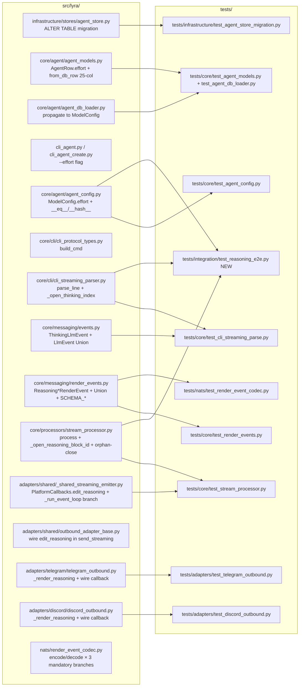

## Summary

Plumb Anthropic CLI `--effort` extended-thinking events (`content_block.type=="thinking"` + `delta.type=="thinking_delta"`) through `cli_streaming_parser → ThinkingLlmEvent → StreamProcessor → ReasoningStart/Delta/End → PlatformCallbacks.edit_reasoning → adapters`. Source-signal-based 1:1 mapping; no positional heuristic.

Adds a DB-resident `effort` field on `AgentRow` (option 1 backfill: `NULL` = thinking off, deterministic), an `effort` field on `ModelConfig` (with `__eq__`/`__hash__` propagation for CliPool guards), a typed Reasoning render-event family, and extends `PlatformCallbacks` with `edit_reasoning` to bypass the unreachable `StreamingSession._on_*` subclass seam (DEBT precedent: `_on_text_v2` / `_on_toolcall_v2`). ~340 LOC across 18 micro-tasks.

## Architecture

### Data flow

```mermaid
flowchart TD
  subgraph db[infrastructure/stores/]
    M[agent_store migration\n+effort TEXT NULL col]
    AR[AgentRow.effort\nstr|None]
    M --> AR
  end

  subgraph cfg[core/agent/]
    AL[agent_db_loader\npropagate to ModelConfig]
    MC[ModelConfig.effort\nLiteral|None + __eq__/__hash__]
    AR --> AL --> MC
  end

  subgraph cli[core/cli/]
    CP[cli_protocol_types.build_cmd\n--effort flag if not None]
    PA[cli_streaming_parser.parse_line]
    PA_S[_open_thinking_index state]
    PA --> PA_S
  end

  subgraph evts[core/messaging/events.py]
    TLE[ThinkingLlmEvent\ntext: str]
    LU[LlmEvent Union widen]
  end

  subgraph rend[core/messaging/render_events.py]
    RS[ReasoningStartRenderEvent]
    RD[ReasoningDeltaRenderEvent]
    RE[ReasoningEndRenderEvent]
    SC[SCHEMA_VERSION_REASONING_*]
    RU[RenderEvent Union widen]
  end

  subgraph proc[core/processors/stream_processor.py]
    SP[process loop]
    SP_S[_open_reasoning_block_id state]
    SP_OC[orphan-close on exception/truncation]
    SP --> SP_S
    SP --> SP_OC
  end

  subgraph emit[adapters/shared/_shared_streaming_emitter.py]
    PCB[PlatformCallbacks.edit_reasoning\nNEW callable]
    EM2[isinstance branch in _run_event_loop]
    OAB[OutboundAdapterBase.send_streaming\nwires edit_reasoning into PlatformCallbacks]
    EM2 --> PCB
    OAB --> PCB
  end

  subgraph adp[adapters/]
    TG[telegram_outbound._render_reasoning\ndim italic + throttle + truncate]
    DC[discord_outbound._render_reasoning\nparity with Telegram]
  end

  subgraph codec[nats/render_event_codec.py]
    NE[encode/decode\nmandatory branches × 3]
  end

  subgraph mgr[cli_agent.py]
    AC[lyra agent create/patch\n--effort flag default medium]
  end

  MC --> CP
  CP --> PA
  PA --> TLE
  TLE --> SP
  SP --> RS
  SP --> RD
  SP --> RE
  RS --> EM2
  RD --> EM2
  RE --> EM2
  PCB --> TG
  PCB --> DC
  RS --> NE
  RD --> NE
  RE --> NE
  AC -.writes.-> AR
```

### File × Function map



## Bootstrap Context

From spec verification (live trace 2026-05-13) + 3-agent review (architect + devops + backend-dev):

- **Source signal confirmed live.** `claude --print --output-format stream-json --verbose --include-partial-messages --effort high` emits `content_block_start(thinking)` → N × `content_block_delta(thinking_delta)` → `content_block_stop` for index 0, then text content blocks for the final answer at index 1.
- **Parser drop site:** `cli_streaming_parser.py:178-220`. `content_block_start` branch handles only `tool_use`; `content_block_delta` branch handles only `text_delta`/`input_json_delta`. Thinking arms are a 3-branch additive change, no existing path modified.
- **Pre-existing patterns to mirror:**
  - Open-block index tracking: `_open_tool_blocks: dict[int, str]` at `cli_streaming_parser.py:80` → mirror as `_open_thinking_index: int | None`.
  - StreamProcessor orphan-close: `_synth_orphan_tool_ends()` at `stream_processor.py:312-330` → same WARN-log-then-emit pattern.
  - StreamProcessor block-id minting: `_mint_text_block_id()` (Slice 2 #1099) → reuse same uuid7 pattern.
  - Dispatch ladder: `_shared_streaming_emitter._run_event_loop` at `_shared_streaming_emitter.py:147-198` → add `Reasoning*` branch BEFORE `else: assert_never(event)`.
  - Callback seam: `PlatformCallbacks.edit_trace` at `_shared_streaming_emitter.py:54` — typed callable wired from `OutboundAdapterBase.send_streaming`. **Mirror this pattern for `edit_reasoning`.** Subclass overrides on `StreamingSession` (the `_on_text_v2` / `_on_toolcall_v2` shape) are documented DEBT — Telegram/Discord inherit `OutboundAdapterBase`, not `StreamingSession`, so subclass overrides are unreachable. Slice 5 (#1102) will migrate the existing DEBT to the same callback pattern this slice establishes.
- **`ModelConfig` is a Pydantic BaseModel with manual `__eq__`/`__hash__`** (`agent_config.py:87,102`) — CliPool's "model_config mismatch" guard (`cli_pool.py:145-152`) depends on these. Adding `effort` without updating both methods → silent guard miss → wrong process reused after config change.
- **`AgentRow` is 24 columns today** (`agent_models.py:27`). Adding `effort TEXT NULL` bumps to 25. `from_db_row` tuple unpack updates accordingly.
- **Codec is explicit if-chain** (`render_event_codec.py:68-97`). New event types **require** 3 branches in `encode()` + 3 in `decode()` (not auto-dispatched). Follow Slice 3 precedent (lines 87-94 / 193-244).
- **`build_cmd` (not `build_command`)** is the actual function name at `cli_protocol_types.py:45`.
- **D2 default = `"medium"` at CLI creation only.** Runtime default = `None` (omit flag). Migration backfills existing rows with `NULL` ⇒ no retroactive token cost. `lyra agent create` defaults to `"medium"` for new agents; operator may pass `--effort none` (CLI sentinel) → stored `NULL` → flag omitted.
- **Atomic-merge constraints:**
  1. T5 (RenderEvent Union widen) + T9 (dispatch branch) must ship in same PR — `assert_never(event)` in `_run_event_loop` trips otherwise.
  2. T2 (LlmEvent Union widen) + T3 (SP placeholder branch) must ship in same PR — `assert_never` on LlmEvent dispatch.

## Agents

| Agent instance | Task count | Files |
|---|---|---|
| backend-dev-A | 6 | infrastructure/stores/agent_store.py, core/agent/agent_models.py, core/agent/agent_db_loader.py, core/agent/agent_config.py, cli_agent.py, core/cli/cli_protocol_types.py, core/messaging/events.py, core/messaging/render_events.py, nats/render_event_codec.py |
| backend-dev-B | 2 | core/cli/cli_streaming_parser.py, core/processors/stream_processor.py |
| backend-dev-C | 3 | adapters/shared/_shared_streaming_emitter.py, adapters/shared/outbound_adapter_base.py, adapters/telegram/telegram_outbound.py, adapters/discord/discord_outbound.py |
| tester-A | 4 | tests/core/test_cli_streaming_parse.py, tests/core/test_render_events.py, tests/core/test_stream_processor.py, tests/core/test_agent_config.py |
| tester-B | 3 | tests/adapters/test_telegram_outbound.py, tests/adapters/test_discord_outbound.py, tests/nats/test_render_event_codec.py, tests/integration/test_reasoning_e2e.py |

Total: **18 micro-tasks** across 5 agent instances, 6 waves.

## Wave Structure

6 waves, max 4 parallel agents. Elapsed ~3.5 sessions vs ~9 sequential.

| Wave | Trigger | Agents | Tasks |
|------|---------|--------|-------|
| 0 | start | 2 ∥ | backend-dev-A: T0a→T0b (DB migration + AgentRow + ModelConfig + loader + CLI flags + TOML seed) · tester-B: T4 (capture live thinking fixture, runs in parallel — no code deps) |
| 1 | Wave 0 done | 1 | backend-dev-A: T1→T2→T3 (build_cmd --effort flag + ThinkingLlmEvent + SP placeholder) |
| 2 | Wave 1 done | 4 ∥ | backend-dev-A: T5 (Reasoning*RenderEvent + Union widen) · backend-dev-B: T6 (parser thinking) · tester-A: T7 (parser RED tests using T4 fixture) · tester-A: T8 (render_events type tests) |
| 3 | Wave 2 done | 4 ∥ | backend-dev-C: T9 (dispatch ladder branch — ATOMIC with T5) · backend-dev-C: T9.5 (PlatformCallbacks.edit_reasoning + send_streaming wire) · backend-dev-B: T10 (SP emit + orphan-close + log.debug) · tester-A: T11 (SP RED tests) |
| 4 | Wave 3 done | 2 ∥ | backend-dev-C: T12 (telegram + discord _render_reasoning wired via callback) · tester-B: T13 (adapter integration tests incl. show_intermediate=false gate) |
| 5 | Wave 4 done | 2 ∥ | backend-dev-A: T14 (codec mandatory branches × 3 + schema floor) · tester-B: T15 (e2e fixture replay) |

PR packaging (3 PRs):

- **PR-A (foundation + atomic types + dispatch + callback seam)**: T0a, T0b, T1, T2, T3, T4, T5, T6, T7, T8, T9, T9.5
  - Includes DB migration (backward-compatible: NULL backfill); types widen pyright cleanly via T3 placeholder + T9 branch; callback infra ready for T12.
- **PR-B (StreamProcessor wiring + tests)**: T10, T11
  - Replaces T3 placeholder with real Reasoning emission; full SP test coverage.
- **PR-C (adapter rendering + codec + e2e)**: T12, T13, T14, T15
  - Adapters wire `edit_reasoning` callback; codec mandatory branches; e2e replay.

## Consistency Report

- **Affordances covered:** U1–U25 + N1 (26 total) → all mapped to ≥1 task. Tracing: U1+U2 → T0b+T1; U3+U4 → T2+T3; U5–U9 → T6; U10–U15 → T10; U16–U18 → T5; U19+U20 → T9+T9.5; U21–U23 → T12; U24 → T14; U25 → T10.
- **Success criteria covered:** 18/18.
- **Test/code parity:** 10 implementation tasks (T0a, T0b, T1, T2, T3, T5, T6, T9, T9.5, T10, T12, T14) ⊆ 8 test tasks (T4, T7, T8, T11, T13, T15 + T0a/T0b inline DB tests).
- **Atomic-merge enforced:** T5+T9 flagged in PR-A. T2+T3 ship together within PR-A.
- **No DEBT introduced; one DEBT mitigation pattern established** (`PlatformCallbacks.edit_reasoning` via T9.5) that Slice 5 (#1102) can use to migrate the existing `_on_text_v2` / `_on_toolcall_v2` DEBT.

## Micro-Tasks

### Wave 0 — DB foundation + fixture capture (T0a, T0b, T4)

#### T0a — DB migration: add `effort` column to `agents` table

- **Agent:** backend-dev-A
- **Phase:** GREEN
- **Difficulty:** 2/5
- **Spec trace:** U1, U2; SC-1
- **Files:** `src/lyra/infrastructure/stores/agent_store.py` (CREATE TABLE DDL + migration step), `tests/infrastructure/test_agent_store_migration.py` (new)
- **Skeleton:**
  ```python
  # In agent_store.py — add to CREATE TABLE:
  effort TEXT NULL,

  # Migration step (idempotent ALTER TABLE):
  await db.execute("ALTER TABLE agents ADD COLUMN effort TEXT NULL")
  # Guard via PRAGMA table_info('agents') to skip if already present.
  ```
- **Verify:** `uv run pytest tests/infrastructure/test_agent_store_migration.py -x -v`
- **Expected:** Migration applies cleanly to a fresh DB and to an existing 24-col DB; rerunning is a no-op; pre-existing rows have `effort IS NULL` after migration.
- **Time:** 10 min

#### T0b — `AgentRow.effort` + `ModelConfig.effort` + loader + CLI flag + TOML seed

- **Agent:** backend-dev-A
- **Phase:** GREEN
- **Difficulty:** 3/5
- **Spec trace:** U1, U2; SC-1, SC-2
- **Files:**
  - `src/lyra/core/agent/agent_models.py` — `AgentRow.effort: str | None = None`; `from_db_row` 25-element tuple unpack
  - `src/lyra/core/agent/agent_db_loader.py` — propagate `row.effort` → `ModelConfig(effort=...)`
  - `src/lyra/core/agent/agent_config.py` — `ModelConfig.effort: Literal["low","medium","high","xhigh","max"] | None = None`; update **both** `__eq__` (line 87) and `__hash__` (line 102) to include `effort`
  - `src/lyra/cli_agent.py` / `cli_agent_create.py` — `--effort` flag on `agent create` (default `"medium"`) and `agent patch` (no default); sentinel `"none"` → stored `NULL`
  - `src/lyra/agents/*.toml` — optional `effort` key (TOML schema bump, document in `docs/agent-management.md`)
  - `tests/core/test_agent_models.py` + `tests/core/test_agent_config.py` — `__eq__`/`__hash__` parity tests for `effort`
- **Skeleton:**
  ```python
  # agent_models.py
  @dataclass
  class AgentRow:
      ...
      effort: str | None = None  # NULL ⇒ no extended thinking
      # from_db_row updated to unpack 25-tuple

  # agent_config.py
  class ModelConfig(BaseModel):
      ...
      effort: Literal["low","medium","high","xhigh","max"] | None = None

      def __eq__(self, other):
          if not isinstance(other, ModelConfig): return NotImplemented
          return (... existing fields ..., self.effort) == (... other fields ..., other.effort)

      def __hash__(self):
          return hash((... existing fields ..., self.effort))

  # cli_agent.py — agent create
  @app.command()
  def create(..., effort: str = typer.Option("medium", "--effort", help="low|medium|high|xhigh|max|none")):
      stored_effort = None if effort.lower() == "none" else effort
      ...
  ```
- **Verify:** `uv run pytest tests/core/test_agent_models.py tests/core/test_agent_config.py -x -v && uv run lyra agent create test_agent --backend cli --model claude-haiku-4-5 --effort high && uv run lyra agent show test_agent | grep effort`
- **Expected:** `__eq__` distinguishes configs that differ only in `effort`; `agent create` writes `"high"` to DB; `agent show` displays it; `--effort none` writes NULL.
- **Time:** 25 min

#### T4 — Capture live CLI thinking fixture (sanitized)

- **Agent:** tester-B
- **Phase:** RED-prep (fixture setup, not a failing test)
- **Difficulty:** 2/5
- **Spec trace:** SC-19, SC-20
- **Files:** `tests/data/cli_traces/thinking_high_effort.ndjson` (new)
- **Skeleton:** run `claude --print --output-format stream-json --verbose --include-partial-messages --effort high --model claude-haiku-4-5 "What is 17 * 23? Think step by step."` and save the NDJSON lines. **Sanitize before commit:** strip `session_id` and `cost_usd` from the trailing `result` envelope (replace with placeholders `"REDACTED"`/`0.0`). Trim to a small turn (~10 lines) covering: 1 content_block_start(thinking), 3-4 thinking_delta, 1 signature_delta, 1 content_block_stop, 1 content_block_start(text), 2 text_delta, 1 content_block_stop, 1 (sanitized) result.
- **Verify:** `cat tests/data/cli_traces/thinking_high_effort.ndjson | jq -r '.event.type // .type' | sort | uniq -c && ! grep -E 'session_id":"sess_|cost_usd":[0-9]' tests/data/cli_traces/thinking_high_effort.ndjson`
- **Expected:** Event type counts as expected; no real `session_id` or non-zero `cost_usd` left in the fixture.
- **Time:** 8 min

### Wave 1 — Wire-format + LlmEvent (T1, T2, T3)

#### T1 — `build_cmd` `--effort` flag append

- **Agent:** backend-dev-A
- **Phase:** GREEN
- **Difficulty:** 1/5
- **Spec trace:** SC-2; U2
- **Files:** `src/lyra/core/cli/cli_protocol_types.py` (function name is `build_cmd` at line 45)
- **Skeleton:**
  ```python
  # cli_protocol_types.py — inside build_cmd, after streaming flag:
  if model_config.effort is not None:
      cmd.extend(["--effort", model_config.effort])
  ```
- **Verify:** `uv run pytest tests/core/test_cli_protocol_types.py -k effort -x -v`
- **Expected:** Tests asserting both default (`None`, no flag) and set (`"high"`, flag present) cases pass.
- **Time:** 5 min

#### T2 — `ThinkingLlmEvent` dataclass + Union widen

- **Agent:** backend-dev-A
- **Phase:** GREEN
- **Difficulty:** 1/5
- **Spec trace:** SC-3; U3, U4
- **Files:** `src/lyra/core/messaging/events.py`
- **Skeleton:**
  ```python
  @dataclass(frozen=True)
  class ThinkingLlmEvent:
      """A chunk of extended-thinking text from the LLM (Slice 4 of #1096).

      Emitted by cli_streaming_parser on Anthropic CLI thinking_delta events
      (content_block.type == "thinking" + delta.type == "thinking_delta"
      under --effort low|medium|high|xhigh|max).
      """
      text: str

  LlmEvent = (
      TextLlmEvent
      | ThinkingLlmEvent      # ← new
      | ToolUseLlmEvent
      | ToolUseDeltaLlmEvent
      | ToolUseEndLlmEvent
      | ToolResultLlmEvent
      | ResultLlmEvent
  )
  __all__ = [..., "ThinkingLlmEvent"]
  ```
- **Verify:** `uv run pyright src/lyra/core/messaging/events.py && uv run pytest tests/core/test_events.py -x`
- **Expected:** pyright clean; existing events tests still green.
- **Time:** 3 min

#### T3 — StreamProcessor `assert_never` placeholder for `ThinkingLlmEvent`

- **Agent:** backend-dev-A
- **Phase:** GREEN (temporary; T10 supersedes)
- **Difficulty:** 1/5
- **Spec trace:** (pyright safety; flows from U4 LlmEvent Union widen)
- **Files:** `src/lyra/core/processors/stream_processor.py`
- **Skeleton:** add `elif isinstance(event, ThinkingLlmEvent): pass  # TODO(T10): emit Reasoning*` above the `assert_never` final arm. **T10 must replace this branch with the real handler — not augment it.**
- **Verify:** `uv run pyright src/lyra/core/processors/stream_processor.py`
- **Expected:** pyright clean; existing stream_processor tests unchanged.
- **Time:** 2 min

### Wave 2 — Render-event types + parser (T5, T6, T7, T8)

#### T5 — `Reasoning*RenderEvent` dataclasses + schema constants + Union widen

- **Agent:** backend-dev-A
- **Phase:** GREEN
- **Difficulty:** 2/5
- **Spec trace:** SC-7, SC-8, SC-9; U16, U17, U18
- **Files:** `src/lyra/core/messaging/render_events.py`
- **Skeleton:**
  ```python
  SCHEMA_VERSION_REASONING_START_RENDER_EVENT = 1
  SCHEMA_VERSION_REASONING_DELTA_RENDER_EVENT = 1
  SCHEMA_VERSION_REASONING_END_RENDER_EVENT = 1

  @dataclass(frozen=True)
  class ReasoningStartRenderEvent:
      message_id: str
      schema_version: int = SCHEMA_VERSION_REASONING_START_RENDER_EVENT

  @dataclass(frozen=True)
  class ReasoningDeltaRenderEvent:
      message_id: str
      delta: str
      schema_version: int = SCHEMA_VERSION_REASONING_DELTA_RENDER_EVENT

  @dataclass(frozen=True)
  class ReasoningEndRenderEvent:
      message_id: str
      schema_version: int = SCHEMA_VERSION_REASONING_END_RENDER_EVENT

  RenderEvent = (
      ... existing ...
      | ReasoningStartRenderEvent
      | ReasoningDeltaRenderEvent
      | ReasoningEndRenderEvent
  )
  __all__ = [..., "ReasoningStartRenderEvent", "ReasoningDeltaRenderEvent",
             "ReasoningEndRenderEvent", "SCHEMA_VERSION_REASONING_START_RENDER_EVENT",
             "SCHEMA_VERSION_REASONING_DELTA_RENDER_EVENT",
             "SCHEMA_VERSION_REASONING_END_RENDER_EVENT"]
  ```
- **Verify:** `uv run pyright src/lyra/core/messaging/render_events.py`
- **Expected:** clean. **⚠ Atomic-merge:** ships in same PR as T9 (dispatch branch) — `assert_never(event)` in `_run_event_loop` trips otherwise.
- **Time:** 5 min

#### T6 — Parser thinking-block recognition

- **Agent:** backend-dev-B
- **Phase:** GREEN
- **Difficulty:** 3/5
- **Spec trace:** SC-4, SC-5, SC-6; U5, U6, U7, U8, U9
- **Files:** `src/lyra/core/cli/cli_streaming_parser.py`
- **Skeleton:**
  ```python
  _BLOCK_TYPE_THINKING = "thinking"
  _DELTA_THINKING = "thinking_delta"
  _DELTA_SIGNATURE = "signature_delta"

  # in __init__
  self._open_thinking_index: int | None = None

  # in parse_line, inside content_block_start branch:
  elif cb.get("type") == _BLOCK_TYPE_THINKING:
      idx = event_data.get("index")
      if isinstance(idx, int):
          self._open_thinking_index = idx
      # no event emitted on start — emission happens on first delta

  # in parse_line, inside content_block_delta branch:
  elif delta_type == _DELTA_THINKING:
      idx = event_data.get("index")
      thinking = delta.get("thinking", "")
      if isinstance(idx, int) and idx == self._open_thinking_index and thinking:
          self._pending.append(ThinkingLlmEvent(text=thinking))
  elif delta_type == _DELTA_SIGNATURE:
      pass  # API-replay metadata; no user-facing render

  # in parse_line, content_block_stop branch — ADD AS SEPARATE GUARD,
  # not nested in the existing `if idx in self._open_tool_blocks:` check:
  if isinstance(idx, int) and idx == self._open_thinking_index:
      self._open_thinking_index = None
  ```
- **Verify:** `uv run pytest tests/core/test_cli_streaming_parse.py -k thinking -x -v`
- **Expected:** all thinking tests in T7 pass.
- **Time:** 12 min

#### T7 — Parser RED tests (thinking-block lifecycle)

- **Agent:** tester-A
- **Phase:** RED → becomes GREEN once T6 merges
- **Difficulty:** 3/5
- **Spec trace:** SC-4, SC-5, SC-6
- **Files:** `tests/core/test_cli_streaming_parse.py`
- **Skeleton:** 4 tests:
  1. `test_thinking_delta_emits_thinking_llm_event` — feed the captured fixture (T4) line-by-line, assert N `ThinkingLlmEvent`s in order with correct text content.
  2. `test_signature_delta_ignored` — feed a synthetic line `{"event":{"type":"content_block_delta","index":0,"delta":{"type":"signature_delta","signature":"…"}}}` and assert zero events in queue.
  3. `test_content_block_stop_closes_thinking_state` — after open+delta+stop, assert `parser._open_thinking_index is None`.
  4. `test_thinking_interleaved_with_tool_use` — open thinking (idx 0), 2 thinking_deltas, stop, open tool_use (idx 1, with id), input_json_delta, stop — assert events: 2 Thinking + 1 ToolUse + 1 ToolUseDelta + 1 ToolUseEnd in correct order.
- **Verify:** `uv run pytest tests/core/test_cli_streaming_parse.py -k thinking -x -v`
- **Expected:** all 4 pass after T6 lands.
- **Time:** 15 min

#### T8 — Render-event type tests (frozen / exports / union)

- **Agent:** tester-A
- **Phase:** RED → GREEN after T5
- **Difficulty:** 1/5
- **Spec trace:** SC-7, SC-8, SC-9
- **Files:** `tests/core/test_render_events.py`
- **Skeleton:** 3 tests:
  1. `test_reasoning_events_frozen` — assert `dataclasses.is_dataclass` + `frozen=True` for each Reasoning event; `with pytest.raises(FrozenInstanceError): instance.message_id = "x"`.
  2. `test_reasoning_events_in_union` — assert `ReasoningStartRenderEvent in typing.get_args(RenderEvent)` (×3).
  3. `test_reasoning_constants_exported` — assert `SCHEMA_VERSION_REASONING_*` are in `render_events.__all__` and equal `1`.
- **Verify:** `uv run pytest tests/core/test_render_events.py -k reasoning -x -v`
- **Expected:** all 3 pass after T5.
- **Time:** 8 min

### Wave 3 — Dispatch + callback seam + StreamProcessor (T9, T9.5, T10, T11)

#### T9 — Dispatch ladder `_run_event_loop` Reasoning branch

- **Agent:** backend-dev-C
- **Phase:** GREEN
- **Difficulty:** 2/5
- **Spec trace:** SC-14; U19
- **Files:** `src/lyra/adapters/shared/_shared_streaming_emitter.py`
- **Skeleton:**
  ```python
  # In _run_event_loop, BEFORE assert_never(event):
  if isinstance(
      event,
      ReasoningStartRenderEvent
      | ReasoningDeltaRenderEvent
      | ReasoningEndRenderEvent,
  ):
      # Slice 4 (#1101): typed reasoning events. Routed through
      # PlatformCallbacks.edit_reasoning (see T9.5). Default callback
      # is no-op.
      await self._cb.edit_reasoning(self._trace_obj, event)
      continue
  ```
- **Verify:** `uv run pyright src/lyra/adapters/shared/_shared_streaming_emitter.py && uv run pytest tests/adapters/test_shared_streaming_emitter.py -x`
- **Expected:** pyright clean; existing tests untouched.
- **Time:** 4 min
- **⚠ Atomic-merge:** ships in same PR as T5 + T9.5.

#### T9.5 — Extend `PlatformCallbacks` with `edit_reasoning` + wire from `OutboundAdapterBase.send_streaming`

- **Agent:** backend-dev-C
- **Phase:** GREEN
- **Difficulty:** 3/5
- **Spec trace:** SC-15, SC-16; U20, U21, U22
- **Files:**
  - `src/lyra/adapters/shared/_shared_streaming_emitter.py` — add field to `PlatformCallbacks` dataclass (next to `edit_trace` at line 54)
  - `src/lyra/adapters/shared/outbound_adapter_base.py` (or wherever `send_streaming` constructs `PlatformCallbacks`) — wire new callback through
- **Skeleton:**
  ```python
  # _shared_streaming_emitter.py — extend PlatformCallbacks
  @dataclass(frozen=True)
  class PlatformCallbacks:
      ... existing fields ...
      edit_trace: Callable[[Any, ToolSummaryRenderEvent], Awaitable[None]]
      edit_reasoning: Callable[
          [Any, ReasoningStartRenderEvent | ReasoningDeltaRenderEvent | ReasoningEndRenderEvent],
          Awaitable[None],
      ] = _default_no_op_edit_reasoning  # module-level no-op coroutine

  async def _default_no_op_edit_reasoning(
      trace_obj: Any,
      event: ReasoningStartRenderEvent | ReasoningDeltaRenderEvent | ReasoningEndRenderEvent,
  ) -> None:
      """Default — adapters that haven't opted in render nothing for reasoning."""

  # outbound_adapter_base.py — in send_streaming:
  callbacks = PlatformCallbacks(
      ... existing ...,
      edit_reasoning=self._render_reasoning,  # if adapter defines it, else default
  )
  ```
- **Verify:** `uv run pyright src/lyra/adapters/shared/_shared_streaming_emitter.py src/lyra/adapters/shared/outbound_adapter_base.py`
- **Expected:** clean. Default no-op preserves prior behavior. Telegram/Discord pick up `_render_reasoning` via T12 — until then, default fires.
- **Time:** 12 min
- **Long-term note:** This pattern is the migration path for the existing `_on_text_v2` / `_on_toolcall_v2` DEBT — Slice 5 (#1102) will collapse those into callbacks `edit_text` / `edit_toolcall` following the same shape.

#### T10 — StreamProcessor: emit Reasoning + orphan-close + observability

- **Agent:** backend-dev-B
- **Phase:** GREEN (supersedes T3 placeholder — remove the placeholder branch)
- **Difficulty:** 4/5
- **Spec trace:** SC-10, SC-11, SC-12, SC-13, SC-18; U10, U11, U12, U13, U14, U15, U25
- **Files:** `src/lyra/core/processors/stream_processor.py`
- **Skeleton:**
  ```python
  # in __init__
  self._open_reasoning_block_id: str | None = None

  # helper at module top (mirror _mint_text_block_id)
  def _mint_reasoning_block_id() -> str:
      return str(uuid7())

  # in process(), REPLACE the T3 `elif isinstance(event, ThinkingLlmEvent): pass`
  # placeholder with:
  elif isinstance(event, ThinkingLlmEvent):
      if self._open_reasoning_block_id is None:
          self._open_reasoning_block_id = _mint_reasoning_block_id()
          log.debug("reasoning block opened", extra={"message_id": self._open_reasoning_block_id})
          yield ReasoningStartRenderEvent(message_id=self._open_reasoning_block_id)
      yield ReasoningDeltaRenderEvent(
          message_id=self._open_reasoning_block_id,
          delta=event.text,
      )

  # Add a _close_reasoning_if_open() helper:
  def _close_reasoning_if_open(self):
      if self._open_reasoning_block_id is not None:
          log.debug("reasoning block closed", extra={"message_id": self._open_reasoning_block_id})
          yield ReasoningEndRenderEvent(message_id=self._open_reasoning_block_id)
          self._open_reasoning_block_id = None

  # Invoke _close_reasoning_if_open() at the TOP of every non-Thinking branch:
  # TextLlmEvent, ToolUseLlmEvent, ToolUseDeltaLlmEvent, ToolUseEndLlmEvent,
  # ToolResultLlmEvent, ResultLlmEvent. (Architect feedback B: don't skip
  # ToolUseDelta/End/Result branches even if Anthropic wire contract
  # makes it impossible in practice — guard defensively for future drivers.)

  # in except Exception block (orphan-close): synth ReasoningEnd if open.
  # in `if not _result_received:` block (truncated-stream orphan-close): synth ReasoningEnd if open.
  # Use log.warning for orphan-close paths.
  ```
- **Verify:** `uv run pytest tests/core/test_stream_processor.py -k reasoning -x -v`
- **Expected:** all 8 tests in T11 pass.
- **Time:** 22 min

#### T11 — StreamProcessor RED tests

- **Agent:** tester-A
- **Phase:** RED → GREEN after T10
- **Difficulty:** 3/5
- **Spec trace:** SC-10, SC-11, SC-12, SC-13, SC-18
- **Files:** `tests/core/test_stream_processor.py`
- **Skeleton:** 8 tests:
  1. `test_thinking_emits_reasoning_triplet_with_consistent_message_id` — drive `[Thinking("a"), Thinking("b"), Text("c"), Result]`; assert 1 Start, 2 Deltas, 1 End with same message_id, then Text + Result flow.
  2. `test_reasoning_closes_on_text_transition` — `[Thinking, Thinking, Text, Result]`; assert ReasoningEnd fires BEFORE TextStart.
  3. `test_reasoning_closes_on_tool_transition` — `[Thinking, ToolUse, ToolResult, Result]`; assert ReasoningEnd fires BEFORE ToolCallStart.
  4. `test_reasoning_closes_on_result_transition` — `[Thinking, Result]` (no text); assert ReasoningEnd fires BEFORE final TextRenderEvent.
  5. `test_reasoning_closes_on_tool_delta_transition` — `[Thinking, ToolUseDelta, ToolUseEnd, Result]` (hypothetical future driver); assert ReasoningEnd fires BEFORE ToolCallArgs (architect feedback B).
  6. `test_reasoning_orphan_close_on_exception` — stream raises mid-thinking; assert orphan ReasoningEnd before RunErrorRenderEvent + log.warning fired.
  7. `test_reasoning_orphan_close_on_truncated_stream` — stream ends without ResultLlmEvent mid-thinking; assert orphan ReasoningEnd + log.warning.
  8. `test_reasoning_log_debug_observability` — assert exactly one `"reasoning block opened"` + one `"reasoning block closed"` per block via `caplog`.
- **Verify:** `uv run pytest tests/core/test_stream_processor.py -k reasoning -x -v`
- **Expected:** all 8 pass after T10.
- **Time:** 28 min

### Wave 4 — Adapter rendering (T12, T13)

#### T12 — Telegram + Discord `_render_reasoning` (callback-wired)

- **Agent:** backend-dev-C
- **Phase:** GREEN
- **Difficulty:** 3/5
- **Spec trace:** SC-15, SC-16; U21, U22, U23
- **Files:** `src/lyra/adapters/telegram/telegram_outbound.py`, `src/lyra/adapters/discord/discord_outbound.py`
- **Skeleton (Telegram, Discord mirrors):**
  ```python
  # In OutboundAdapterBase.send_streaming, pass self._render_reasoning into PlatformCallbacks.
  # On the adapter class:

  def __init__(...):
      ...
      self._reasoning_accum: str = ""
      self._last_reasoning_edit: float | None = None

  async def _render_reasoning(
      self,
      trace_obj: Any,
      event: ReasoningStartRenderEvent | ReasoningDeltaRenderEvent | ReasoningEndRenderEvent,
  ) -> None:
      # show_intermediate=false gate (D6 / spec):
      if not self._show_intermediate:
          return

      if isinstance(event, ReasoningStartRenderEvent):
          if trace_obj is None:
              # lazy placeholder send (same pattern as edit_trace)
              try:
                  trace_obj, _ = await self._send_trace_placeholder()
              except Exception:
                  log.exception("Failed to send trace placeholder — reasoning will not render")
                  return
              self._trace_obj = trace_obj
          self._reasoning_accum = ""
      elif isinstance(event, ReasoningDeltaRenderEvent):
          self._reasoning_accum += event.delta
          truncated = self._reasoning_accum
          if len(truncated) > 120:
              truncated = truncated[:117] + "…"
          now = time.monotonic()
          if (
              self._last_reasoning_edit is None
              or (now - self._last_reasoning_edit) >= STREAMING_EDIT_INTERVAL
          ):
              await self._edit_trace_with_text(trace_obj, dim_italic(truncated))
              self._last_reasoning_edit = now
      elif isinstance(event, ReasoningEndRenderEvent):
          # Final flush — guaranteed last edit
          if self._reasoning_accum and trace_obj is not None:
              truncated = self._reasoning_accum
              if len(truncated) > 120:
                  truncated = truncated[:117] + "…"
              await self._edit_trace_with_text(trace_obj, dim_italic(truncated))
  ```
  `dim_italic()` per platform: Telegram italic + grey-text proxy; Discord italic + smaller-text via Markdown.
- **Verify:** `uv run pytest tests/adapters/test_telegram_outbound.py tests/adapters/test_discord_outbound.py -k reasoning -x -v`
- **Expected:** all tests in T13 pass.
- **Time:** 22 min

#### T13 — Adapter integration tests

- **Agent:** tester-B
- **Phase:** RED → GREEN after T12
- **Difficulty:** 3/5
- **Spec trace:** SC-15, SC-16
- **Files:** `tests/adapters/test_telegram_outbound.py`, `tests/adapters/test_discord_outbound.py`
- **Skeleton:** 8 tests (4 per platform):
  1. `test_reasoning_lazy_placeholder` — `send_trace_placeholder` called exactly once on first ReasoningStart.
  2. `test_reasoning_throttle_bound` — drive 20 ReasoningDelta events over 2s simulated window; assert API edit count `≤ ceil(2.0 / STREAMING_EDIT_INTERVAL) + 1`.
  3. `test_reasoning_truncation` — single ReasoningDelta(delta="x" * 200); final text length `== 118` ending with `"…"`.
  4. `test_reasoning_show_intermediate_false_noop` — drive full Reasoning triplet with `show_intermediate=false`; assert zero API calls (architect feedback D).
- **Verify:** `uv run pytest tests/adapters/test_{telegram,discord}_outbound.py -k reasoning -x -v`
- **Expected:** all 8 pass.
- **Time:** 22 min

### Wave 5 — Schema floor + e2e (T14, T15)

#### T14 — Codec mandatory branches + schema floor

- **Agent:** backend-dev-A
- **Phase:** GREEN
- **Difficulty:** 2/5
- **Spec trace:** SC-17; U24
- **Files:** `src/lyra/nats/render_event_codec.py`, `tests/nats/test_render_event_codec.py`
- **Skeleton:**
  - Codec is **explicit if-chain** (`render_event_codec.py:68-97`). MUST add 3 branches in `encode()` and 3 in `decode()` following the Slice 3 precedent at lines 87-94 / 193-244.
  - `encode()`: 3 new `isinstance(event, Reasoning{Start,Delta,End}RenderEvent)` branches returning `{"event_type": "reasoning_start", "schema_version": ..., "message_id": ..., ...}`.
  - `decode()`: 3 new string-keyed branches mapping `"reasoning_start"` / `"reasoning_delta"` / `"reasoning_end"` → dataclass instantiation.
  - Schema floor: `check_schema_version` rejects `schema_version > 1` for each new type.
  - Test: 3 roundtrip tests + 1 floor-reject test = 4 tests.
- **Verify:** `uv run pytest tests/nats/test_render_event_codec.py -k reasoning -x -v`
- **Expected:** 4 tests pass; `TypeError` on encode of unknown type still raised for non-Reasoning unknowns.
- **Time:** 12 min

#### T15 — E2E integration test using recorded CLI fixture

- **Agent:** tester-B
- **Phase:** RED-GATE (final)
- **Difficulty:** 4/5
- **Spec trace:** SC-19, SC-20
- **Files:** `tests/integration/test_reasoning_e2e.py` (new)
- **Skeleton:**
  ```python
  # Replay captured NDJSON fixture (T4) through full pipeline:
  # parser → SP → dispatch ladder → adapter spy (FakePlatformCallbacks).

  async def test_full_pipeline_emits_reasoning_then_text():
      fixture_lines = Path("tests/data/cli_traces/thinking_high_effort.ndjson").read_text().splitlines()
      parser = CliStreamingParser(pool_id="test")
      llm_events = list(_replay(parser, fixture_lines))

      sp = StreamProcessor(config=..., show_intermediate=True)
      render_events = [re async for re in sp.process(_iter(llm_events))]

      starts = [e for e in render_events if isinstance(e, ReasoningStartRenderEvent)]
      deltas = [e for e in render_events if isinstance(e, ReasoningDeltaRenderEvent)]
      ends = [e for e in render_events if isinstance(e, ReasoningEndRenderEvent)]
      assert len(starts) == 1 and len(ends) == 1 and len(deltas) >= 3
      assert starts[0].message_id == deltas[0].message_id == ends[0].message_id

  async def test_effort_none_emits_no_reasoning():
      # Synthetic stream without ThinkingLlmEvent (effort=None case);
      # assert no Reasoning* events.
      ...

  async def test_callback_invoked_through_dispatch():
      # Wire fake PlatformCallbacks with spy edit_reasoning; replay fixture;
      # assert spy called for each Reasoning* event.
      ...
  ```
- **Verify:** `uv run pytest tests/integration/test_reasoning_e2e.py -x -v`
- **Expected:** all 3 pass.
- **Time:** 28 min

## Rollout Notes

- **Coordinated deploy required** (Makefile `full-deploy`): `lyra-hub` + `lyra-telegram` + `lyra-discord` + `lyra-clipool` restart together. `LlmEvent` widening crosses the clipool process boundary.
- **`effort` change on a live agent does NOT auto-apply.** CliPool's mismatch guard (`cli_pool.py:145-152`) logs a warning and **continues with the old process**. To apply: `lyra pool reset` (or restart the daemon). Document in release notes.
- **Existing agents:** `NULL` after migration → flag omitted → no token cost change. Operators opt in per-agent via `lyra agent patch <name> --effort medium`.
- **New agents:** `lyra agent create` defaults to `effort="medium"` (+30-50% tokens) — operators may pass `--effort none` to disable at creation time.

## Task Seeding Blueprint

<!-- Used by /implement to seed TaskCreate calls on session start.
     Format: T{n} | agent-instance | blockedBy | subject
     blockedBy refs T-numbers within this list. -->

### Wave 0 — start, 2 agents ∥

| Task | Agent instance | blockedBy | Subject |
|------|---------------|-----------|---------|
| T0a | backend-dev-A | — | DB migration: add effort column to agents table |
| T0b | backend-dev-A | T0a | AgentRow.effort + ModelConfig.effort + __eq__/__hash__ + loader + lyra agent create/patch --effort flag + TOML seed |
| T4 | tester-B | — | Capture live CLI thinking fixture (sanitized) |

### Wave 1 — after Wave 0, 1 agent

| Task | Agent instance | blockedBy | Subject |
|------|---------------|-----------|---------|
| T1 | backend-dev-A | T0b | build_cmd --effort flag append |
| T2 | backend-dev-A | T1 | ThinkingLlmEvent dataclass + LlmEvent Union widen |
| T3 | backend-dev-A | T2 | StreamProcessor placeholder branch (pyright safety, T10 supersedes) |

### Wave 2 — after Wave 1, 4 agents ∥

| Task | Agent instance | blockedBy | Subject |
|------|---------------|-----------|---------|
| T5 | backend-dev-A | T3 | Reasoning*RenderEvent + schema constants + Union widen |
| T6 | backend-dev-B | T2 | Parser thinking-block recognition |
| T7 | tester-A | T4, T2 | Parser RED tests using T4 fixture (4 tests) |
| T8 | tester-A | T5 | Render-event type tests (3 tests) |

### Wave 3 — after Wave 2, 4 agents ∥ — ATOMIC PR with T5

| Task | Agent instance | blockedBy | Subject |
|------|---------------|-----------|---------|
| T9 | backend-dev-C | T5 | Dispatch ladder Reasoning branch (ATOMIC w/ T5) |
| T9.5 | backend-dev-C | T9 | PlatformCallbacks.edit_reasoning + send_streaming wire |
| T10 | backend-dev-B | T5, T6 | StreamProcessor emit + orphan-close + log.debug (supersedes T3 placeholder) |
| T11 | tester-A | T10 | StreamProcessor RED tests (8 tests) |

### Wave 4 — after Wave 3, 2 agents ∥

| Task | Agent instance | blockedBy | Subject |
|------|---------------|-----------|---------|
| T12 | backend-dev-C | T9.5 | Telegram + Discord _render_reasoning (callback-wired) |
| T13 | tester-B | T12 | Adapter integration tests (8 tests incl. show_intermediate=false gate) |

### Wave 5 — after Wave 4, 2 agents ∥

| Task | Agent instance | blockedBy | Subject |
|------|---------------|-----------|---------|
| T14 | backend-dev-A | T5 | Codec mandatory branches × 3 + schema floor (4 tests) |
| T15 | tester-B | T13, T14 | E2E integration test using recorded fixture (RED-GATE final) |

## Task IDs

<!-- Generated by /plan. Used by /implement to resume tasks on session restart. -->

- T0a: 12 — DB migration: add effort column to agents table
- T0b: 13 — AgentRow.effort + ModelConfig.effort + loader + CLI flags + TOML seed
- T4: 14 — Capture sanitized live CLI thinking fixture
- T1: 15 — build_cmd --effort flag append
- T2: 16 — ThinkingLlmEvent dataclass + LlmEvent Union widen
- T3: 17 — StreamProcessor placeholder branch for ThinkingLlmEvent (pyright safety)
- T5: 18 — Reasoning*RenderEvent dataclasses + schema constants + Union widen
- T6: 19 — Parser thinking-block recognition
- T7: 20 — Parser RED tests (thinking-block lifecycle, 4 tests)
- T8: 21 — Render-event type tests (3 tests — frozen / exports / union)
- T9: 22 — Dispatch ladder Reasoning branch (ATOMIC w/ T5)
- T9.5: 23 — PlatformCallbacks.edit_reasoning + wire from OutboundAdapterBase.send_streaming
- T10: 24 — StreamProcessor emit Reasoning + orphan-close + log.debug (supersedes T3)
- T11: 25 — StreamProcessor RED tests (8 tests)
- T12: 26 — Telegram + Discord _render_reasoning (callback-wired)
- T13: 27 — Adapter integration tests (8 tests, 4 per platform)
- T14: 28 — Codec mandatory branches × 3 + schema floor
- T15: 29 — E2E integration test using recorded CLI fixture (RED-GATE final)
