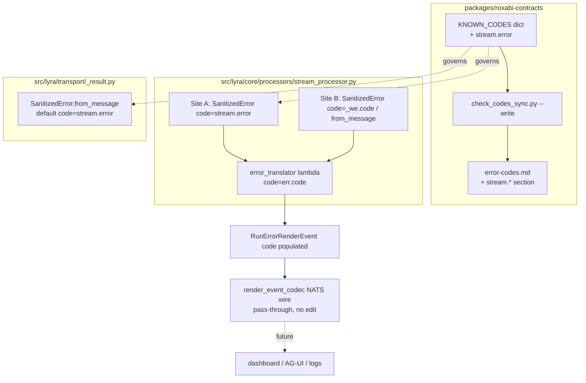
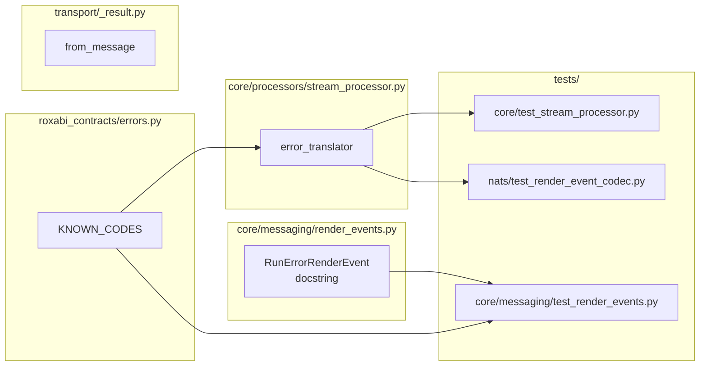

## Summary

Stop discarding `err.code` in the `StreamProcessor` error translator and register the one
unregistered code (`stream.error`) in the canonical `KNOWN_CODES` registry, so
`RunErrorRenderEvent.code` is populated from the existing taxonomy instead of always `None`.

## Architecture

### Data flow



### File × Function map



## Agents

| Agent instance | Tasks | Files |
|----------------|-------|-------|
| backend-dev-A | T1, T2, T3 | `errors.py`, `error-codes.md`, `render_events.py`, `docs/architecture/messaging.md` |
| tester-A | T4, T5 | `tests/core/test_stream_processor.py`, `tests/nats/test_render_event_codec.py`, `tests/core/messaging/test_render_events.py` |
| backend-dev-B | T6 | `stream_processor.py`, `transport/_result.py` |

## Wave Structure

3 waves, max 2 parallel agents. Elapsed ~½ day vs ~1 day sequential.

| Wave | Trigger | Agents | Tasks |
|------|---------|--------|-------|
| 1 | start | 1 | backend-dev-A: T1 |
| 2 | Wave 1 done | 2 ∥ | backend-dev-A: T2→T3 · tester-A: T4, T5 (RED) |
| 3 | Wave 2 done | 1 | backend-dev-B: T6 (GREEN) → RED-GATE: full suite |

### Budget — per task

| Task | Items | Class | Est. ops | Split? |
|------|-------|-------|----------|--------|
| T1 register stream.error | 1 | bounded | 3 | — |
| T2 regen error-codes.md | 1 | trivial | 2 | — |
| T3 docstring + messaging.md | 2 | bounded | 5 | — |
| T4 emit-path tests (RED) | 3 | judgmental | 8 | — |
| T5 codec + membership tests (RED) | 2 | judgmental | 7 | — |
| T6 translator + comment (GREEN) | 2 | bounded | 5 | — |

**Total estimated ops: 30**

### Budget — per agent instance

| Instance | Tasks | Σ ops | Subjects | Split? |
|----------|-------|-------|----------|--------|
| backend-dev-A | T1, T2, T3 | 10 | taxonomy, docs | — |
| tester-A | T4, T5 | 15 | emit, codec | — |
| backend-dev-B | T6 | 5 | emit | — |

All instances under caps (≤4 tasks, ≤50 ops, ≤2 subjects).

## Consistency Report

Spec criteria covered: 8/8.

| SC | Task |
|----|------|
| SC-1 translator builds code=err.code, no code=None | T6 |
| SC-2 stream.error registered + doc regen + codes-sync passes | T1, T2 |
| SC-3 Site A → code=="stream.error" | T4 |
| SC-4 Site B + WorkerError → code==we.code | T4 |
| SC-5 Site B no WorkerError → code=="stream.error" | T4 |
| SC-6 emittable codes ⊆ KNOWN_CODES | T5 |
| SC-7 docstring refs KNOWN_CODES + messaging.md note | T3 |
| SC-8 codec round-trips non-None and None code | T5 |

Untraced tasks: none. Exemptions: none.

## Micro-Tasks

### Slice S1 — register taxonomy + docs

**T1 — Register `stream.error` in KNOWN_CODES** · backend-dev-A · subject: taxonomy · GREEN · diff 2 · SC-2
- File: `packages/roxabi-contracts/src/roxabi_contracts/errors.py`
- Add a `# --- stream ---` section with:
  ```python
  "stream.error": CodeMeta(
      domain="stream",
      default_retryable=False,
      description="Unhandled exception during hub-side stream processing "
      "(StreamProcessor), or an un-categorized soft error.",
  ),
  ```
- Verify: `grep -q '"stream.error"' packages/roxabi-contracts/src/roxabi_contracts/errors.py`
- Expected: match.

**T2 — Regenerate `error-codes.md`** · backend-dev-A · subject: taxonomy · GREEN · diff 1 · SC-2 · blockedBy T1
- File: `packages/roxabi-contracts/docs/error-codes.md` (generated)
- Verify: `uv run python packages/roxabi-contracts/scripts/check_codes_sync.py --write && grep -q '## stream' packages/roxabi-contracts/docs/error-codes.md`
- Expected: `## stream.*` section present; codes-sync clean.

**T3 — Docstring + messaging.md note** · backend-dev-A · subject: docs · REFACTOR · diff 2 · SC-7 · blockedBy T1
- Files: `src/lyra/core/messaging/render_events.py` (RunErrorRenderEvent docstring ~172-178), `docs/architecture/messaging.md`
- render_events.py: replace the "reserved for a future taxonomy … Slice 1 always passes `None`" lines with: `code` is a key from `roxabi_contracts.errors.KNOWN_CODES` (e.g. `stream.error`, `cli.auth`); `None` only for historical/pre-taxonomy events.
- messaging.md: one sentence under the NATS render-event / Registered event families section that `run_error` events carry a populated `code` from `KNOWN_CODES`.
- Verify: `! grep -q 'future taxonomy' src/lyra/core/messaging/render_events.py && grep -qi 'KNOWN_CODES' docs/architecture/messaging.md`
- Expected: both true.

**RED-GATE S1:** `uv run python packages/roxabi-contracts/scripts/check_codes_sync.py` exits 0.

### Slice S2 — propagate code + tests

**T4 — Emit-path tests (RED)** · tester-A · subject: emit · RED · diff 3 · SC-3,4,5 · blockedBy T1
- File: `tests/core/test_stream_processor.py`
- Add tests driving `StreamProcessor.process`:
  - infra exception → terminal `RunErrorRenderEvent.code == "stream.error"`.
  - soft error with `WorkerError(code=...)` (e.g. `cli.auth`) → `code == "cli.auth"`.
  - soft error, no WorkerError (error_text only → `from_message`) → `code == "stream.error"`.
- Verify: `uv run pytest tests/core/test_stream_processor.py -k code -q` (expect FAIL pre-T6)
- Expected: tests collected, fail on `code is None` (RED).

**T5 — Codec round-trip + membership tests (RED)** · tester-A · subject: codec · RED · diff 3 · SC-6,8 · blockedBy T1
- Files: `tests/nats/test_render_event_codec.py`, `tests/core/messaging/test_render_events.py`
- codec: encode→decode a `RunErrorRenderEvent(code="stream.error")` preserves `code`; a `code=None` event decodes without error.
- membership: assert the set of codes the translator can emit (`stream.error` + representative WorkerError codes) ⊆ `KNOWN_CODES`.
- Verify: `uv run pytest tests/nats/test_render_event_codec.py tests/core/messaging/test_render_events.py -k 'code or known_codes' -q`
- Expected: collected; codec non-None case fails pre-T6 only if it asserts populated emit (membership passes immediately after T1).

**T6 — Propagate `err.code` (GREEN)** · backend-dev-B · subject: emit · GREEN · diff 2 · SC-1 · blockedBy T4, T5
- Files: `src/lyra/core/processors/stream_processor.py` (translator lambda ~224), `src/lyra/transport/_result.py` (~42)
- stream_processor.py: `RunErrorRenderEvent(run_id=run_id, message=err.message, code=err.code)`.
- _result.py: brief comment at `from_message` default noting `stream.error` is its registry-valid fallback (ref KNOWN_CODES).
- Verify: `! grep -n 'code=None' src/lyra/core/processors/stream_processor.py && uv run pytest tests/core/test_stream_processor.py tests/nats/test_render_event_codec.py -q`
- Expected: no `code=None` at emit site; T4/T5 tests now GREEN.

**RED-GATE S2:** `uv run pytest tests/core tests/nats packages/roxabi-contracts -q` green.

## Task Seeding Blueprint

<!-- Used by /implement to seed TaskCreate calls. T{n} | agent-instance | blockedBy | subject. -->

### Wave 1 — no deps, 1 agent

| Task | Agent instance | blockedBy | Subject |
|------|---------------|-----------|---------|
| T1 | backend-dev-A | — | taxonomy |

### Wave 2 — after T1, 2 agents ∥

| Task | Agent instance | blockedBy | Subject |
|------|---------------|-----------|---------|
| T2 | backend-dev-A | T1 | taxonomy |
| T3 | backend-dev-A | T1 | docs |
| T4 | tester-A | T1 | emit |
| T5 | tester-A | T1 | codec |

### Wave 3 — after T4, T5, 1 agent

| Task | Agent instance | blockedBy | Subject |
|------|---------------|-----------|---------|
| T6 | backend-dev-B | T4, T5 | emit |

## Task IDs

<!-- Generated by /plan. Used by /implement to resume tasks on session restart. -->
- T1: 12 — taxonomy
- T2: 13 — taxonomy
- T3: 14 — docs
- T4: 15 — emit
- T5: 16 — codec
- T6: 17 — emit
