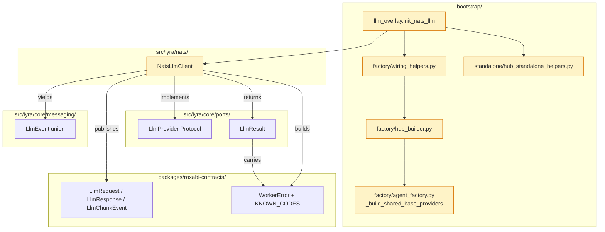
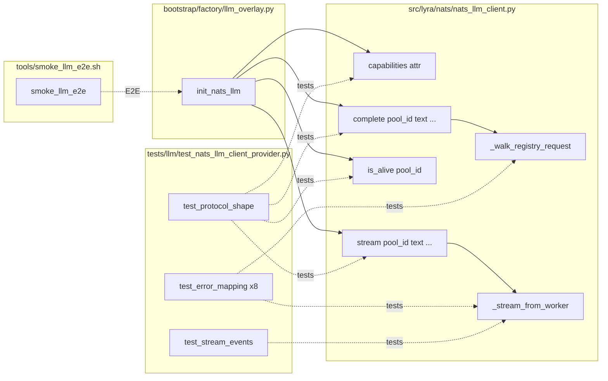

## Summary

Make `NatsLlmClient` satisfy the `LlmProvider` protocol (capabilities + complete + is_alive + stream-with-LlmEvent), wire canonical `WorkerError` codes on all error paths, swap it into `init_nats_llm` and the 4 wiring sites, then prove the swap with a scripted M₁ smoke and a ≥2-week soak gate before deletion (deferred PR).

## Architecture

### Data flow

### File × function map

## Bootstrap context

Spec uncovered 3 grounded findings during drafting (frame had stale `on_intermediate` parameter; `LlmResult.worker_error` is an ADR-066 field that must be populated; canonical `LlmChunkEvent` cannot carry tool-use frames, frame inversion accepted). Reference impl `src/lyra/llm/drivers/nats_driver.py` already uses canonical subjects post-#1121 but ad-hoc JSON payloads; `NatsLlmClient` already uses canonical Pydantic envelopes, just lacks the `LlmProvider` surface.

## Agents

| Agent | Task count | Files |
|---|---|---|
| tester-A | 2 | `tests/llm/test_nats_llm_client_provider.py` |
| backend-dev-A | 10 | `src/lyra/nats/nats_llm_client.py`, `src/lyra/bootstrap/factory/llm_overlay.py`, `wiring_helpers.py`, `hub_builder.py`, `agent_factory.py`, `hub_standalone_helpers.py` |
| devops-A | 8 | `tools/smoke_llm_e2e.sh`, `docs/ops/deploy-smoke-canary.md`, local boot verification, M₁ smoke run |

## Wave Structure

8 waves, max 3 parallel agents (in Wave 5 only). Elapsed ~1 day vs ~2 days sequential.

| Wave | Trigger | Agents | Tasks |
|------|---------|--------|-------|
| 1 | start | tester-A | T1→T7 (RED tests V1 + V2) |
| 2 | Wave 1 done | backend-dev-A | T2→T3→T4→T5→T6 (V1 GREEN + GATE) |
| 3 | Wave 2 done | backend-dev-A | T8→T9→T10 (V2 GREEN + GATE) |
| 4 | Wave 3 done | backend-dev-A | T11→T12 (V3 overlay + wiring) |
| 5 | Wave 4 done | devops-A (3 ∥) | T13 ∥ T14 ∥ T15 (local mode-boot triplet) |
| 6 | Wave 5 done | devops-A | T16 (V3 GATE) |
| 7 | Wave 6 done | devops-A | T17→T18 (smoke script + docs) |
| 8 | Wave 7 done | devops-A | T19→T20 (M₁ smoke + V4 GATE) |

### Budget

| Task | Items | Class | Est. ops | Split? |
|------|-------|-------|----------|--------|
| T1 RED tests V1 (protocol shape, 3 paths) | 1 | judgmental | 5 | — |
| T7 RED tests V2 (8 error rows + 3 stream paths) | 1 | judgmental | 6 | — |
| T2-T5 V1 impl (capabilities, is_alive, complete, stream) | 4 | bounded | 10 | — |
| T6 V1 GATE | 1 | trivial | 2 | — |
| T8-T9 V2 impl (complete + stream error mapping) | 2 | bounded | 6 | — |
| T10 V2 GATE | 1 | trivial | 2 | — |
| T11-T12 bootstrap migration | 2 | bounded | 4 | — |
| T13-T15 local mode-boot triplet | 3 | bounded | 6 | — |
| T16 V3 GATE | 1 | trivial | 2 | — |
| T17 smoke script | 1 | bounded | 3 | — |
| T18 docs cross-ref | 1 | trivial | 2 | — |
| T19 M₁ smoke run + ACL grep | 1 | judgmental | 5 | — |
| T20 V4 GATE | 1 | trivial | 2 | — |

**Total estimated ops: ~55.** No splits required (heaviest task = 6 ops).

## Consistency Report

- Spec acceptance criteria covered: 16/16
- Untraced micro-tasks: 0
- Exemptions: 0

| Spec criterion | Traced to |
|---|---|
| `capabilities` class attr | T2, T1 |
| `complete()` signature + LlmResult | T4, T1 |
| `is_alive(pool_id)` | T3, T1 |
| `stream()` yields LlmEvent | T5, T1 |
| `isinstance(client, LlmProvider)` True | T1 |
| Pyright clean at `_build_shared_base_providers` | T12, T16 |
| Every error path populates `worker_error` | T8, T9, T7 |
| `init_nats_llm` returns `NatsLlmClient \| None` | T11 |
| 4 wiring sites compile clean | T12 |
| `lyra start` reaches steady state (local) | T13 |
| `lyra hub` reaches steady state (local) | T14 |
| `lyra adapter telegram` reaches steady state (local) | T15 |
| Test file (a)–(d) requirements | T1, T7 |
| `uv run pytest` passes | T6, T10, T16 |
| `tools/smoke_llm_e2e.sh` exists + green on M₁ | T17, T19 |
| Zero `Permissions Violation` on M₁ | T19 |
| `NatsLlmDriver` source remains in tree | (negative assertion — T11 keeps file) |

## Micro-Tasks

### Slice V1 — Protocol conformance

**T1** [RED] [tester-A] [Difficulty: 3]
Create `tests/llm/test_nats_llm_client_provider.py` with failing tests for `LlmProvider` protocol shape: `isinstance(client, LlmProvider)`, `capabilities == {"streaming": True, "auth": "nats"}`, presence of `complete`/`is_alive`/`stream` with correct signatures, `stream()` yields `LlmEvent` union. Use a mock `nats.aio.client.Client` fixture from `tests/llm/conftest.py` pattern. Reference shape from `tests/llm/test_nats_driver.py` if present, else mirror `tests/llm/drivers/`.
- **Verify:** `uv run pytest tests/llm/test_nats_llm_client_provider.py -k protocol -x` exits non-zero (RED state expected)
- **Spec trace:** SC-1, SC-2, SC-3, SC-4, SC-5
- **Phase:** RED · **Slice:** V1

**T2** [GREEN] [backend-dev-A] [Difficulty: 1]
Add `capabilities: dict[str, Any] = {"streaming": True, "auth": "nats"}` as a class attribute on `NatsLlmClient` in `src/lyra/nats/nats_llm_client.py`.
- **Verify:** `uv run python -c "from lyra.nats.nats_llm_client import NatsLlmClient; print(NatsLlmClient.capabilities)"`
- **Expected:** `{'streaming': True, 'auth': 'nats'}`
- **Spec trace:** SC-1 · **Phase:** GREEN · **Slice:** V1

**T3** [GREEN] [backend-dev-A] [Difficulty: 1]
Add `def is_alive(self, pool_id: str) -> bool` to `NatsLlmClient`. Delegate to existing `is_available()`: return `self._nc.is_connected and self._registry.any_alive()`. Discard `pool_id` (see `nats_driver.py:132` `del pool_id`).
- **Verify:** Re-run `uv run pytest tests/llm/test_nats_llm_client_provider.py -k is_alive -x`
- **Spec trace:** SC-3 · **Phase:** GREEN · **Slice:** V1

**T4** [GREEN] [backend-dev-A] [Difficulty: 4]
Refactor `generate()` → `complete(pool_id, text, model_cfg, system_prompt, *, messages: list[dict] | None = None) -> LlmResult`. Apply the text-folding rule from spec (`if messages is None or empty → [{"role":"user","content":text}]`; if last message content == text → pass through; else append). Map `model_cfg.model/max_tokens/temperature` → `LlmRequest`. Echo outbound `LlmRequest.trace_id` into `LlmResult.session_id`. Discard `pool_id`. Keep the old `generate()` as a thin private helper `_legacy_generate()` if any test in `nats/` depends on it — else delete cleanly.
- **Verify:** `uv run pytest tests/llm/test_nats_llm_client_provider.py -k complete -x`
- **Spec trace:** SC-2 · **Phase:** GREEN · **Slice:** V1

**T5** [GREEN] [backend-dev-A] [Difficulty: 4]
Refactor `stream(...)` → `(pool_id, text, model_cfg, system_prompt, *, messages: list[dict] | None = None) -> AsyncIterator[LlmEvent]`. Same payload mapping as T4. Iterate `LlmChunkEvent` from `_stream_from_worker`. Yield `TextLlmEvent(text=delta)` per non-empty `chunk.delta`. Terminal `ResultLlmEvent(is_error=False, duration_ms=chunk.duration_ms or 0, cost_usd=None)` on `chunk.done=True`. Import `LlmEvent`/`TextLlmEvent`/`ResultLlmEvent` from `lyra.core.messaging.events`.
- **Verify:** `uv run pytest tests/llm/test_nats_llm_client_provider.py -k stream -x`
- **Spec trace:** SC-4 · **Phase:** GREEN · **Slice:** V1

**T6** [RED-GATE] [backend-dev-A] [Difficulty: 1]
Verify V1 complete: `uv run pyright src/lyra/nats/nats_llm_client.py` exits 0 AND `uv run pytest tests/llm/test_nats_llm_client_provider.py -x` exits 0.
- **Verify:** both commands exit 0
- **Spec trace:** SC-1, SC-2, SC-3, SC-4, SC-5 · **Phase:** RED-GATE · **Slice:** V1

### Slice V2 — Error envelope

**T7** [RED] [tester-A] [Difficulty: 4]
Extend `tests/llm/test_nats_llm_client_provider.py` with failing tests for the 8-row error-mapping table. One parametrized test per row asserting `LlmResult.worker_error.code` ∈ `KNOWN_CODES`, correct `retryable`, and `ResultLlmEvent.worker_error` for the streaming variants. Cover: `transport.timeout`, `transport.no_responders`, `transport.parse`, `transport.contract_mismatch`, `worker.capacity` (circuit open), `transport.error` (payload too large), `worker_error` propagation verbatim, `worker.internal` fallback for legacy error-only replies.
- **Verify:** `uv run pytest tests/llm/test_nats_llm_client_provider.py -k error -x` exits non-zero
- **Spec trace:** SC-7 · **Phase:** RED · **Slice:** V2

**T8** [GREEN] [backend-dev-A] [Difficulty: 3]
Implement error-envelope mapping in `_walk_registry_request` (complete path) and `complete()` return. Build `WorkerError(code, message, retryable, detail=None)` using canonical codes per spec table. Set `LlmResult(error=msg, retryable=worker_error.retryable, worker_error=worker_error)`. Propagate `resp.worker_error` verbatim when present. Reference `nats_driver.py:170-264` for the populate pattern.
- **Verify:** `uv run pytest tests/llm/test_nats_llm_client_provider.py -k "error and complete" -x`
- **Spec trace:** SC-7 · **Phase:** GREEN · **Slice:** V2

**T9** [GREEN] [backend-dev-A] [Difficulty: 3]
Implement error-envelope mapping in `_stream_from_worker` (stream path). On error chunk / timeout / parse failure, yield terminal `ResultLlmEvent(is_error=True, duration_ms=…, error_text=msg, worker_error=…, cost_usd=None)` then return. Propagate `chunk.worker_error` verbatim when present.
- **Verify:** `uv run pytest tests/llm/test_nats_llm_client_provider.py -k "error and stream" -x`
- **Spec trace:** SC-7 · **Phase:** GREEN · **Slice:** V2

**T10** [RED-GATE] [backend-dev-A] [Difficulty: 1]
Verify V2: all 8 error-mapping tests pass, pyright clean.
- **Verify:** `uv run pytest tests/llm/test_nats_llm_client_provider.py -x && uv run pyright src/lyra/nats/`
- **Spec trace:** SC-7 · **Phase:** RED-GATE · **Slice:** V2

### Slice V3 — Bootstrap migration + local mode-boot

**T11** [GREEN] [backend-dev-A] [Difficulty: 2]
Switch `src/lyra/bootstrap/factory/llm_overlay.py:init_nats_llm` to return `NatsLlmClient | None`. Replace `from lyra.llm.drivers.nats_driver import NatsLlmDriver` → `from lyra.nats.nats_llm_client import NatsLlmClient`. Instantiate `NatsLlmClient(nc=nc)` and call `await client.start()`. Update log line text. **Keep `NatsLlmDriver` source file untouched in tree.**
- **Verify:** `uv run pyright src/lyra/bootstrap/factory/llm_overlay.py`
- **Spec trace:** SC-8 · **Phase:** GREEN · **Slice:** V3

**T12** [GREEN] [backend-dev-A] [Difficulty: 3]
Update type annotations in the 4 wiring sites to accept `NatsLlmClient | None` (was `NatsLlmDriver | None`). **Keep parameter name `nats_llm_driver` unchanged** to preserve rollback simplicity. Files: `bootstrap/factory/wiring_helpers.py:50,64,239,243,355` · `bootstrap/factory/hub_builder.py:43,161,176` · `bootstrap/factory/agent_factory.py:27,51,206` · `bootstrap/standalone/hub_standalone_helpers.py:26,114`. Update related docstrings (`NatsLlmDriver` → `NatsLlmClient` references).
- **Verify:** `uv run pyright src/lyra/bootstrap/`
- **Spec trace:** SC-9 · **Phase:** GREEN · **Slice:** V3

**T13** [P] [GREEN] [devops-A] [Difficulty: 2]
Local mode-boot — `lyra start`. Start a local NATS broker (`nats-server -DV` or embedded via `lyra start` itself), `export NATS_URL=nats://127.0.0.1:4222`, run `uv run lyra start --dry-run` (or equivalent fastest-boot path that reaches `startup-notify`). Confirm no `LlmProvider`-related exception in logs, then SIGINT cleanly.
- **Verify:** exit code 0 from clean SIGINT shutdown; no `Traceback` lines in stderr from `lyra` namespace
- **Spec trace:** SC-10 · **Phase:** GREEN · **Slice:** V3

**T14** [P] [GREEN] [devops-A] [Difficulty: 2]
Local mode-boot — `lyra hub`. Same procedure as T13 with `uv run lyra hub`. Confirm hub subscribes to canonical subjects + reaches steady state.
- **Verify:** exit code 0 from clean SIGINT; no Traceback in `lyra` namespace
- **Spec trace:** SC-11 · **Phase:** GREEN · **Slice:** V3

**T15** [P] [GREEN] [devops-A] [Difficulty: 2]
Local mode-boot — `lyra adapter telegram`. Same procedure with `uv run lyra adapter telegram`. Use a dummy bot token if needed (TELEGRAM_BOT_TOKEN env). Skip actual Telegram connection by using `--dry-run` or mocking auth.
- **Verify:** exit code 0 from clean SIGINT; no Traceback in `lyra` namespace
- **Spec trace:** SC-12 · **Phase:** GREEN · **Slice:** V3

**T16** [RED-GATE] [devops-A] [Difficulty: 2]
Verify V3: `uv run pyright` (repo-wide) exits 0 AND T13/T14/T15 all reached steady state.
- **Verify:** `uv run pyright` repo-wide exits 0
- **Spec trace:** SC-6, SC-9, SC-10, SC-11, SC-12 · **Phase:** RED-GATE · **Slice:** V3

### Slice V4 — Scripted M₁ smoke + soak gate

**T17** [GREEN] [devops-A] [Difficulty: 3]
Author `tools/smoke_llm_e2e.sh`. Bash script with strict mode (`set -euo pipefail`). Accepts `NATS_URL` env (default `nats://roxabituwer:4222`), publishes a minimal canonical `LlmRequest` JSON to `lyra.llm.generate.request` via `nats req` (nats CLI). Asserts a `LlmResponse` reply with `ok=true` within 30s. Exit 0 on success, 1 on any failure with stderr message. Document required deps (`nats` CLI, `jq`).
- **Verify:** `tools/smoke_llm_e2e.sh --help` returns usage; `shellcheck tools/smoke_llm_e2e.sh` clean
- **Spec trace:** SC-15 · **Phase:** GREEN · **Slice:** V4

**T18** [GREEN] [devops-A] [Difficulty: 1]
Add a "LLM E2E smoke" subsection to `docs/ops/deploy-smoke-canary.md` linking to `tools/smoke_llm_e2e.sh` with a usage example (env vars, expected output, troubleshooting on `Permissions Violation`).
- **Verify:** `grep "smoke_llm_e2e.sh" docs/ops/deploy-smoke-canary.md` returns ≥1 match
- **Spec trace:** SC-15 · **Phase:** GREEN · **Slice:** V4

**T19** [GREEN] [devops-A] [Difficulty: 4]
Run `tools/smoke_llm_e2e.sh` against M₁ (`roxabituwer`) with the canonical `HarnessCLI → hub → llmCLI worker → LiteLLM → llama-server` path live. Capture: (a) script exit code, (b) NATS server log lines from the test window grepped for `Permissions Violation` (expect zero hits), (c) hub log excerpt showing a successful `LlmResponse` round-trip. Paste all three into the PR body.
- **Verify:** exit code 0 from script; `grep -c "Permissions Violation"` over capture window = 0
- **Spec trace:** SC-15, SC-16 · **Phase:** GREEN · **Slice:** V4

**T20** [RED-GATE] [devops-A] [Difficulty: 1]
Verify V4: T17/T18/T19 all green; PR body contains the 3 captured artifacts from T19; `NatsLlmDriver` source file still present at `src/lyra/llm/drivers/nats_driver.py`.
- **Verify:** `test -f src/lyra/llm/drivers/nats_driver.py` exits 0
- **Spec trace:** SC-15, SC-16, SC-17 · **Phase:** RED-GATE · **Slice:** V4

## Task Seeding Blueprint

<!-- Used by /implement to seed TaskCreate calls on session start. -->

### Wave 1 — no deps, 1 agent

| Task | Agent instance | blockedBy | Subject |
|------|---------------|-----------|---------|
| T1 | tester-A | — | RED tests V1 — protocol shape (capabilities, complete, is_alive, stream) |
| T7 | tester-A | T1 | RED tests V2 — 8 error-mapping rows + stream paths |

### Wave 2 — after Wave 1, 1 agent

| Task | Agent instance | blockedBy | Subject |
|------|---------------|-----------|---------|
| T2 | backend-dev-A | T1 | Add capabilities class attr on NatsLlmClient |
| T3 | backend-dev-A | T2 | Add is_alive(pool_id) method |
| T4 | backend-dev-A | T3 | Refactor generate→complete with text-folding + trace_id echo |
| T5 | backend-dev-A | T4 | Refactor stream to yield LlmEvent union |
| T6 | backend-dev-A | T5 | V1 GATE — pyright clean + V1 tests green |

### Wave 3 — after Wave 2, 1 agent

| Task | Agent instance | blockedBy | Subject |
|------|---------------|-----------|---------|
| T8 | backend-dev-A | T6, T7 | Error envelope mapping in _walk_registry_request |
| T9 | backend-dev-A | T8 | Error envelope mapping in _stream_from_worker |
| T10 | backend-dev-A | T9 | V2 GATE — 8 error tests green + pyright clean |

### Wave 4 — after Wave 3, 1 agent

| Task | Agent instance | blockedBy | Subject |
|------|---------------|-----------|---------|
| T11 | backend-dev-A | T10 | Switch init_nats_llm to return NatsLlmClient \| None |
| T12 | backend-dev-A | T11 | Update 4 wiring sites — keep nats_llm_driver param name |

### Wave 5 — after Wave 4, 3 agents ∥

| Task | Agent instance | blockedBy | Subject |
|------|---------------|-----------|---------|
| T13 | devops-A | T12 | Local mode-boot — lyra start |
| T14 | devops-A | T12 | Local mode-boot — lyra hub |
| T15 | devops-A | T12 | Local mode-boot — lyra adapter telegram |

### Wave 6 — after Wave 5, 1 agent

| Task | Agent instance | blockedBy | Subject |
|------|---------------|-----------|---------|
| T16 | devops-A | T13, T14, T15 | V3 GATE — pyright clean repo-wide + 3 boots green |

### Wave 7 — after Wave 6, 1 agent

| Task | Agent instance | blockedBy | Subject |
|------|---------------|-----------|---------|
| T17 | devops-A | T16 | Author tools/smoke_llm_e2e.sh |
| T18 | devops-A | T17 | Add smoke section to docs/ops/deploy-smoke-canary.md |

### Wave 8 — after Wave 7, 1 agent

| Task | Agent instance | blockedBy | Subject |
|------|---------------|-----------|---------|
| T19 | devops-A | T18 | Run smoke on M₁ + capture exit/log/ACL grep |
| T20 | devops-A | T19 | V4 GATE — smoke green + NatsLlmDriver still in tree |

## Task IDs

<!-- Generated by /plan. Used by /implement to resume tasks on session restart. -->
- T1: 12 — RED tests V1 — protocol shape
- T2: 13 — Add capabilities class attr
- T3: 14 — Add is_alive(pool_id)
- T4: 15 — Refactor generate→complete
- T5: 16 — Refactor stream to yield LlmEvent
- T6: 17 — V1 GATE
- T7: 18 — RED tests V2 — 8 error rows
- T8: 19 — Error mapping (complete path)
- T9: 20 — Error mapping (stream path)
- T10: 21 — V2 GATE
- T11: 22 — Switch init_nats_llm
- T12: 23 — Update 4 wiring sites
- T13: 24 — Local mode-boot — lyra start
- T14: 25 — Local mode-boot — lyra hub
- T15: 26 — Local mode-boot — lyra adapter telegram
- T16: 27 — V3 GATE
- T17: 28 — Author tools/smoke_llm_e2e.sh
- T18: 29 — Docs cross-ref
- T19: 30 — M₁ smoke run + capture
- T20: 31 — V4 final GATE
