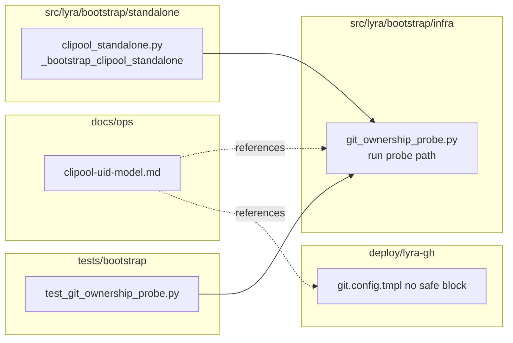

## Summary

Delete the path-based `[safe] directory` wildcard from the clipool's baked git config, add a startup ownership probe in the clipool standalone bootstrap that fails the unit fast if the `keep-id` user-namespace ever stops doing its job, and document the trust model in `docs/ops/`.

## Architecture

```mermaid
flowchart TD
    subgraph host[Host]
        FS[~/projects/lyra/.git uid 1000]
    end
    subgraph pod[lyra-gh.pod]
        UserNS["UserNS=keep-id:uid=1500,gid=1500"]
    end
    subgraph container[lyra-clipool container]
        Exec[Exec: lyra adapter clipool]
        Boot[clipool_standalone._bootstrap]
        Probe[git_ownership_probe.run]
        Worker[CliPoolNatsWorker]
        Cfg[/etc/lyra/git.config.tmpl no safe block]
    end
    FS -- bind mount --> UserNS
    UserNS --> container
    Exec --> Boot
    Boot --> Probe
    Probe -- exit 0 --> Worker
    Probe -- non-zero --> Fail[systemd marks unit failed]
    Worker --> Cfg
```



## Agents

| Agent instance | Tasks | Files |
|---|---|---|
| backend-dev-A | T1, T3 | `src/lyra/bootstrap/infra/git_ownership_probe.py`, `src/lyra/bootstrap/standalone/clipool_standalone.py` |
| devops-A | T2 | `deploy/lyra-gh/git.config.tmpl` |
| doc-writer-A | T4 | `docs/ops/clipool-uid-model.md` |
| tester-A | T5, T6 | `tests/bootstrap/test_git_ownership_probe.py`, RED-GATE |

## Wave Structure

3 waves, max 3 parallel agents. Elapsed ~1 working session vs ~2 sequential.

| Wave | Trigger | Agents | Tasks |
|------|---------|--------|-------|
| 1 | start | 3 ∥ | backend-dev-A: T1 · devops-A: T2 · doc-writer-A: T4 |
| 2 | T1 done | 1 | backend-dev-A: T3 |
| 3 | T3 done | 1 | tester-A: T5 → T6 (RED-GATE) |

### Budget

| Task | Items | Class | Est. ops | Split? |
|------|-------|-------|----------|--------|
| T1 probe module + tests | 1 file (~60 LOC) | bounded | 4 | — |
| T2 remove [safe] block | 1 file edit (2 lines) | trivial | 2 | — |
| T3 wire probe into clipool bootstrap | 1 file edit (~5 LOC) | bounded | 3 | — |
| T4 trust-model doc | 1 file new (~80 LOC) | bounded | 3 | — |
| T5 unit tests for probe | 1 file new (~80 LOC) | bounded | 4 | — |
| T6 RED-GATE: full pytest + manual smoke | — | bounded | 4 | — |

**Total estimated ops: ~20.** Well under 50 threshold; no splits needed.

## Consistency Report

| SC | Coverage |
|---|---|
| SC-1 (no `[safe]` in tmpl) | T2 |
| SC-2 (unit invokes probe before worker loop) | T3 — bootstrap is the unit's entrypoint via `Exec=lyra adapter clipool` |
| SC-3 (probe script exists) | T1 |
| SC-4 (trust-model doc) | T4 |
| SC-5 (M₂ smoke: rev-parse exits 0) | T6 manual |
| SC-6 (M₂ smoke: no `[safe]` in container) | T6 manual |
| SC-7 (M₂ smoke: probe logs OK) | T6 manual |
| SC-8 (negative test: no `keep-id` → probe fails) | T6 manual |

All SCs covered. T6 has both pytest (covers SC-3 behavior) and manual smoke (SCs 5–8 are runtime/operator-visible per spec, not CI-gated).

## Bootstrap Context

Probe lives in `src/lyra/bootstrap/infra/git_ownership_probe.py` per `src/lyra/bootstrap/CLAUDE.md`: "Bootstrap = orchestration only. No business logic — all domain behaviour lives in `core/`." A startup invariant check is orchestration; placement in `infra/` matches `embedded NATS, health, lockfile, startup notify`.

Probe contract (sketch):

```python
def run_git_ownership_probe(repo_path: str | None = None) -> None:
    """Run `git rev-parse HEAD` on a known bind-mounted repo.

    If the call fails with "dubious ownership" stderr (or any non-zero exit),
    log the verbatim stderr at ERROR level and raise SystemExit(1) so
    systemd marks the unit failed.

    Path resolution: arg → env LYRA_OWNERSHIP_PROBE_PATH → default
    /home/lyra/projects/lyra. Absent path → fail-fast (same loud-regression).
    """
```

Called from `_bootstrap_clipool_standalone` before NATS URL check:

```python
async def _bootstrap_clipool_standalone(raw_config: dict) -> None:
    run_git_ownership_probe()  # NEW — first line, before any NATS work
    nats_url = os.environ.get("NATS_URL")
    ...
```

## Task Seeding Blueprint

<!-- Used by /implement to seed TaskCreate calls on session start. -->

### Wave 1 — no deps, 3 agents ∥

| Task | Agent instance | blockedBy | Subject |
|------|---------------|-----------|---------|
| T1 | backend-dev-A | — | Write `src/lyra/bootstrap/infra/git_ownership_probe.py` with `run_git_ownership_probe(repo_path: str \| None = None)` — runs `git rev-parse HEAD` via subprocess, env-overridable target, fails fast on non-zero exit or "dubious ownership" stderr. Log info on success, error verbatim on failure. Match existing infra module style. |
| T2 | devops-A | — | Edit `deploy/lyra-gh/git.config.tmpl`: delete the `[safe]` section header line and the `directory = /home/lyra/projects/*` line. Leave surrounding comments intact. |
| T4 | doc-writer-A | — | Write `docs/ops/clipool-uid-model.md`: trust model = `keep-id:uid=1500,gid=1500` from `lyra-gh.pod`; **no** `safe.directory` wildcards baked; startup probe in `git_ownership_probe.py` is the regression catch; references to ADR-053 (uid stability) + the pod file + bootstrap module. ~80 lines max. |

### Wave 2 — after T1 done, 1 agent

| Task | Agent instance | blockedBy | Subject |
|------|---------------|-----------|---------|
| T3 | backend-dev-A | T1 | Edit `src/lyra/bootstrap/standalone/clipool_standalone.py`: add `from lyra.bootstrap.infra.git_ownership_probe import run_git_ownership_probe` and call it as the first statement inside `_bootstrap_clipool_standalone` (before any NATS work). |

### Wave 3 — after T3 done, 1 agent

| Task | Agent instance | blockedBy | Subject |
|------|---------------|-----------|---------|
| T5 | tester-A | T3 | Write `tests/bootstrap/test_git_ownership_probe.py`: unit tests for `run_git_ownership_probe` — mock subprocess to cover (a) success exit 0 no warning → returns silently, (b) success but "dubious ownership" in stderr → SystemExit, (c) non-zero exit → SystemExit, (d) missing target path → SystemExit, (e) env-override resolves before default. Use `pytest.raises(SystemExit)` for failure cases. |
| T6 | tester-A | T5 | RED-GATE: run `uv run pytest tests/bootstrap/test_git_ownership_probe.py -v` (must pass), then `uv run pytest tests/bootstrap/` for regressions, then verify static SCs: `! grep -E "^\[safe\]\|^[[:space:]]*directory[[:space:]]*=" deploy/lyra-gh/git.config.tmpl` (must succeed = 0 hits) and `grep -q "run_git_ownership_probe" src/lyra/bootstrap/standalone/clipool_standalone.py` (must succeed). Manual smoke (SC-5..8) is operator-run post-deploy, not CI-gated — note in PR body. |

## Micro-Tasks (consolidated for /implement)

**Note on worktrees:** per memory `feedback_dev_always_worktree.md`, /implement uses an isolated worktree at `.claude/worktrees/1149-safe-directory-idmap/`. Parallel agents in Wave 1 share the worktree but touch disjoint files (T1: src/, T2: deploy/, T4: docs/) — per memory `feedback_parallel_fixers_need_isolated_worktrees.md`, the worktree-isolation rule kicks in for ≥2 parallel **code-editing** agents on **overlapping** files; here the files are disjoint so a single worktree is fine. Pre-commit ruff (memory `feedback_pre_commit_ruff_contaminates_shared_worktree.md`) only fires on commit — Wave 1 doesn't commit until convergence, so risk is low.

### Slice V1 (single slice)

#### T1 [P] — Write probe module · `backend-dev-A`

**File:** `src/lyra/bootstrap/infra/git_ownership_probe.py` (NEW)

**Snippet shape:**

```python
"""Startup git ownership probe — fails fast if uid mapping is broken."""
from __future__ import annotations
import logging
import os
import subprocess
import sys

DEFAULT_PROBE_PATH = "/home/lyra/projects/lyra"
PROBE_ENV_VAR = "LYRA_OWNERSHIP_PROBE_PATH"

log = logging.getLogger(__name__)


def run_git_ownership_probe(repo_path: str | None = None) -> None:
    target = repo_path or os.environ.get(PROBE_ENV_VAR) or DEFAULT_PROBE_PATH
    # ... subprocess.run(["git", "-C", target, "rev-parse", "HEAD"], ...)
    # On non-zero exit OR "dubious ownership" in stderr:
    #   log.error("clipool ownership probe failed: %s", stderr)
    #   sys.exit(1)
    # On success:
    #   log.info("clipool git ownership probe OK (target=%s)", target)
```

**Verify:** `uv run pyright src/lyra/bootstrap/infra/git_ownership_probe.py` exits 0.
**Time:** 5–8 min. **Difficulty:** 2. **Phase:** GREEN. **Spec trace:** SC-3.

#### T2 [P] — Remove [safe] block · `devops-A`

**File:** `deploy/lyra-gh/git.config.tmpl`

**Edit:** delete lines `[safe]` and `    directory = /home/lyra/projects/*`. Preserve other config sections (`[user]`, `[credential]`, `[init]`, `[url ...]`).

**Verify:** `! grep -E "^\[safe\]|^[[:space:]]*directory[[:space:]]*=" deploy/lyra-gh/git.config.tmpl` exits 0 (no match).
**Time:** 2 min. **Difficulty:** 1. **Phase:** GREEN. **Spec trace:** SC-1.

#### T3 — Wire probe into bootstrap · `backend-dev-A` (after T1)

**File:** `src/lyra/bootstrap/standalone/clipool_standalone.py`

**Edit:** add import + call at top of `_bootstrap_clipool_standalone`.

```python
from lyra.bootstrap.infra.git_ownership_probe import run_git_ownership_probe

async def _bootstrap_clipool_standalone(raw_config: dict) -> None:
    """Wire a standalone CliPoolNatsWorker connected to NATS."""
    run_git_ownership_probe()
    nats_url = os.environ.get("NATS_URL")
    ...
```

**Verify:** `grep -q "run_git_ownership_probe" src/lyra/bootstrap/standalone/clipool_standalone.py` exits 0 AND `uv run pyright src/lyra/bootstrap/standalone/clipool_standalone.py` exits 0.
**Time:** 3 min. **Difficulty:** 1. **Phase:** GREEN. **Spec trace:** SC-2.

#### T4 [P] — Trust-model doc · `doc-writer-A`

**File:** `docs/ops/clipool-uid-model.md` (NEW)

**Sections:** (1) What the trust grant is — `keep-id:uid=1500,gid=1500` on `lyra-gh.pod`; (2) Why no `safe.directory` wildcards — the userns is already the boundary; (3) Regression catch — `git_ownership_probe.py` runs at clipool startup; (4) Why idmap is not used — rootless Podman limitation (cite Podman #24918); (5) Cross-refs to `ADR-053`, `deploy/quadlet/lyra-gh.pod`, `src/lyra/bootstrap/infra/git_ownership_probe.py`.

**Verify:** `test -f docs/ops/clipool-uid-model.md && grep -c "keep-id" docs/ops/clipool-uid-model.md` ≥ 1.
**Time:** 10 min. **Difficulty:** 2. **Phase:** GREEN. **Spec trace:** SC-4.

#### T5 — Probe unit tests · `tester-A` (after T3)

**File:** `tests/bootstrap/test_git_ownership_probe.py` (NEW)

**Cases:**
- `test_success_returns_silently` — mock subprocess returncode=0, no stderr → no raise.
- `test_dubious_ownership_stderr_exits` — subprocess returncode=0 but stderr contains "dubious ownership" → SystemExit(1).
- `test_non_zero_exit_exits` — subprocess returncode≠0 → SystemExit(1).
- `test_missing_target_path_exits` — repo_path points to nonexistent dir → SystemExit(1).
- `test_env_override_resolves_before_default` — `LYRA_OWNERSHIP_PROBE_PATH` set → that path is used over default.
- `test_explicit_arg_resolves_before_env` — explicit `repo_path=` wins over env.

**Verify:** `uv run pytest tests/bootstrap/test_git_ownership_probe.py -v` exits 0 with ≥6 passing tests.
**Time:** 10 min. **Difficulty:** 2. **Phase:** RED→GREEN. **Spec trace:** SC-3.

#### T6 — RED-GATE: full verify · `tester-A` (after T5)

**Verify (all must pass):**

1. `uv run pytest tests/bootstrap/test_git_ownership_probe.py -v` exits 0.
2. `uv run pytest tests/bootstrap/ -v` exits 0 (no regressions).
3. `uv run pyright src/lyra/bootstrap/infra/git_ownership_probe.py src/lyra/bootstrap/standalone/clipool_standalone.py` exits 0.
4. `uv run ruff check src/lyra/bootstrap/infra/git_ownership_probe.py src/lyra/bootstrap/standalone/clipool_standalone.py tests/bootstrap/test_git_ownership_probe.py` exits 0.
5. `! grep -E "^\[safe\]|^[[:space:]]*directory[[:space:]]*=" deploy/lyra-gh/git.config.tmpl` exits 0.
6. `grep -q "run_git_ownership_probe" src/lyra/bootstrap/standalone/clipool_standalone.py` exits 0.
7. `test -f docs/ops/clipool-uid-model.md` exits 0.

**Manual smoke (recorded in PR body, not CI-gated):** the four SCs from the spec's smoke-test block — operator runs once on M₂ post-redeploy.

**Time:** 5 min. **Difficulty:** 1. **Phase:** RED-GATE. **Spec trace:** SC-1..4 (static) + SC-5..8 (smoke, manual).

## Task IDs

<!-- Generated by /plan. Used by /implement to resume tasks on session restart. -->
- T1: 13 — Write git ownership probe module
- T2: 14 — Remove [safe] block from git.config.tmpl
- T3: 15 — Wire probe into clipool bootstrap
- T4: 16 — Write trust-model doc
- T5: 17 — Probe unit tests
- T6: 18 — RED-GATE: full verify
