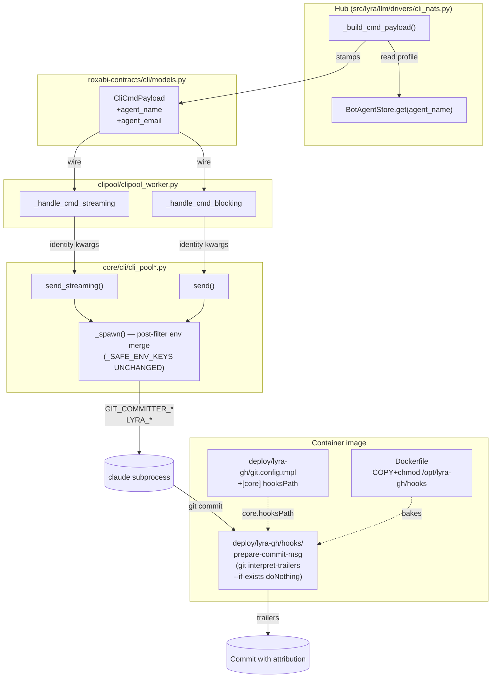
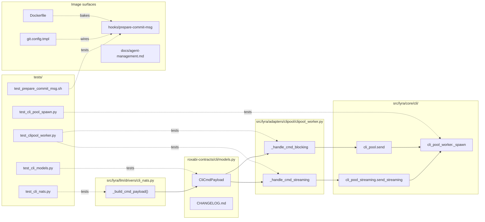

## Summary

Plumb `agent_name` + `agent_email` from hub → NATS envelope → clipool worker → `CliPool._spawn`, where they merge (alongside `LYRA_SESSION_ID`/`LYRA_AGENT`) into the Claude subprocess env via an explicit post-filter codepath (the existing `_SAFE_ENV_KEYS` allowlist stays untouched). Bake a `prepare-commit-msg` hook into the container image that appends two trailers via `git interpret-trailers --if-exists doNothing`. Result: every commit carries per-session committer identity + trailers; `git push` auth unchanged.

## Architecture





## Bootstrap Context

Read before editing:
- `src/lyra/core/cli/cli_pool_worker.py:36-128` — `_SAFE_ENV_KEYS` rationale + `_spawn` env construction.
- `src/lyra/adapters/clipool/clipool_worker.py:200-310` — `_handle_cmd_streaming` / `_handle_cmd_blocking` dispatch into pool.
- `src/lyra/llm/drivers/cli_nats.py:212-260` — `_build_cmd_payload()` is the hub-side publish call site (corrects the spec's earlier guess of `cli_nats_driver.py`).
- `packages/roxabi-contracts/CLAUDE.md` — additive-only minor bump rules; `model_config = ConfigDict(extra="ignore")` is forward-compat.
- `deploy/lyra-gh/git.config.tmpl` — currently no `[core]` section; needs adding.
- `deploy/CLAUDE.md` — ReadOnly=true; hooks must be image-baked.

## Agents

| Agent | Instance | Task count | Files |
|---|---|---|---|
| backend-dev | A | 5 | roxabi-contracts/cli/models.py, CHANGELOG.md, cli_pool*.py, clipool_worker.py, llm/drivers/cli_nats.py |
| devops | A | 3 | deploy/lyra-gh/hooks/prepare-commit-msg (new), deploy/lyra-gh/git.config.tmpl, Dockerfile |
| doc-writer | A | 1 | docs/agent-management.md |
| tester | A | 5 | tests/ for contracts, pool, worker, driver, hook |

## Wave Structure

4 waves, max 3 parallel agents. Elapsed ~1.5 days vs ~4 days sequential.

| Wave | Trigger | Agents | Tasks |
|------|---------|--------|-------|
| 1 | start | 3 ∥ | backend-dev-A: T1 · devops-A: T7 → T8 → T9 · doc-writer-A: T10 |
| 2 | Wave 1 done | 3 ∥ | backend-dev-A: T2 → T3 → T4 · tester-A: T5 · tester-A: T11 (hook smoke) |
| 3 | Wave 2 done | 2 ∥ | backend-dev-A: T6 · tester-A: T12 (V2 RED-GATE) |
| 4 | Wave 3 done | 1 | tester-A: T13 (V3 RED-GATE) → T14 (E2E SC#6) |

### Budget

| Task | Items | Class | Est. ops | Split? |
|------|-------|-------|----------|--------|
| T1 contract fields + CHANGELOG | 2 | bounded | 4 | — |
| T2 CliPool.send/send_streaming signatures | 2 | judgmental | 6 | — |
| T3 `_spawn` post-filter env merge | 1 | judgmental | 6 | — |
| T4 worker wires identity through | 2 | bounded | 4 | — |
| T5 contract tests | 1 | bounded | 3 | — |
| T6 hub publish (cli_nats `_build_cmd_payload`) | 1 | judgmental | 6 | — |
| T7 prepare-commit-msg hook script | 1 | bounded | 4 | — |
| T8 `[core] hooksPath` in git.config.tmpl | 1 | trivial | 2 | — |
| T9 Dockerfile COPY + chmod | 1 | bounded | 3 | — |
| T10 docs/agent-management.md update | 1 | bounded | 4 | — |
| T11 hook smoke test | 1 | judgmental | 6 | — |
| T12 V2 env-merge tests | 3 | judgmental | 9 | — |
| T13 V3 hub publish test | 1 | bounded | 4 | — |
| T14 E2E `git log` AC SC#6 | 1 | judgmental | 8 | — |

**Total estimated ops: 69**

No task exceeds 50 ops; no split required.

## Consistency Report

| Spec criterion | Covered by |
|---|---|
| SC1 fields exist + CHANGELOG | T1, T5 |
| SC2 hub stamps envelope | T6, T13 |
| SC3 4 env vars present when pair set | T3, T12 |
| SC4 no injection when partial | T3, T12 |
| SC5 trailers + `--amend` no dup | T7, T11 |
| SC6 E2E `git log` line | T14 |
| SC7 push auth unchanged (inspection) | — (asserted, no test) |
| SC8 `_SAFE_ENV_KEYS` unchanged | T3, T12 |
| SC9 older-hub forward-compat | T5, T12 |
| SC10 docs updated | T10 |

Untraced criteria: SC7 is intentionally inspection-only per spec. All other 9 criteria mapped.
Exemptions: none.

## Micro-Tasks

### V1 — Contract bump

#### T1 [GREEN] [P] — Add optional identity fields to CliCmdPayload + CHANGELOG entry

- **File:** `packages/roxabi-contracts/src/roxabi_contracts/cli/models.py`, `packages/roxabi-contracts/CHANGELOG.md`
- **Code skeleton:**
  ```python
  class CliCmdPayload(ContractEnvelope):
      pool_id: str
      lyra_session_id: str
      text: str
      model_cfg: dict
      system_prompt: str
      resume_session_id: str | None = None
      stream: bool = True
      agent_name: str | None = None
      agent_email: str | None = None
  ```
  CHANGELOG: minor bump entry under "Unreleased" or next minor section.
- **Verify:** `cd packages/roxabi-contracts && uv run python -c "from roxabi_contracts.cli.models import CliCmdPayload; CliCmdPayload(pool_id='p', lyra_session_id='s', text='t', model_cfg={}, system_prompt='')"`
- **Expected:** no exception; default values None for new fields.
- **Time:** 4 min · **Agent:** backend-dev-A · **Slice:** V1 · **Phase:** GREEN · **Difficulty:** 1
- **Spec trace:** SC1

#### T5 [RED-GATE] — Contract validation tests pass

- **File:** `packages/roxabi-contracts/tests/cli/test_models.py` (or existing test file for cli envelope)
- **Code:** Two cases: envelope without new fields validates and defaults to None; envelope with `agent_name="X"`/`agent_email="x@y"` round-trips.
- **Verify:** `cd packages/roxabi-contracts && uv run pytest tests/cli/test_models.py -q`
- **Expected:** new tests pass; existing CliCmdPayload tests still pass.
- **Time:** 3 min · **Agent:** tester-A · **Slice:** V1 · **Phase:** RED-GATE · **Difficulty:** 1
- **Spec trace:** SC1, SC9

### V2 — Plumb identity to subprocess env

#### T2 [GREEN] — Extend CliPool.send / send_streaming signatures with identity kwargs

- **File:** `src/lyra/core/cli/cli_pool.py`, `src/lyra/core/cli/cli_pool_streaming.py`
- **Code skeleton:** add `agent_name: str | None = None, agent_email: str | None = None, lyra_session_id: str | None = None` to both `send()` and `send_streaming()`; propagate to `self._spawn(...)`.
- **Verify:** `uv run pyright src/lyra/core/cli/`
- **Expected:** typecheck passes.
- **Time:** 6 min · **Agent:** backend-dev-A · **Slice:** V2 · **Phase:** GREEN · **Difficulty:** 2
- **Spec trace:** S2 (breadboard)
- **Depends on:** T1

#### T3 [GREEN] — `_spawn` explicit post-filter env merge gated on identity pair; _SAFE_ENV_KEYS untouched

- **File:** `src/lyra/core/cli/cli_pool_worker.py`
- **Code skeleton:**
  ```python
  async def _spawn(
      self, pool_id, model_config, system_prompt="",
      agent_name=None, agent_email=None, lyra_session_id=None,
  ):
      ...
      env = {k: v for k, v in os.environ.items() if k in _SAFE_ENV_KEYS}
      env["HOME"] = str(Path.home())
      if agent_name and agent_email:  # pair gate — partial → no injection
          env["GIT_COMMITTER_NAME"] = agent_name
          env["GIT_COMMITTER_EMAIL"] = agent_email
          env["LYRA_AGENT"] = agent_name
          if lyra_session_id:
              env["LYRA_SESSION_ID"] = lyra_session_id
  ```
  Add a brief comment: "Post-filter merge — not via _SAFE_ENV_KEYS (allowlist is for inherited env)."
- **Verify:** `uv run pyright src/lyra/core/cli/cli_pool_worker.py`
- **Expected:** typecheck passes.
- **Time:** 6 min · **Agent:** backend-dev-A · **Slice:** V2 · **Phase:** GREEN · **Difficulty:** 2
- **Spec trace:** S3 (breadboard), SC3, SC4, SC8
- **Depends on:** T2

#### T4 [GREEN] — Worker passes envelope identity into pool calls

- **File:** `src/lyra/adapters/clipool/clipool_worker.py`
- **Code:** in `_handle_cmd_streaming` and `_handle_cmd_blocking`, change `self._pool.send_streaming(cmd.pool_id, cmd.text, model_cfg, cmd.system_prompt)` → `self._pool.send_streaming(cmd.pool_id, cmd.text, model_cfg, cmd.system_prompt, agent_name=cmd.agent_name, agent_email=cmd.agent_email, lyra_session_id=cmd.lyra_session_id)`. Same for `send`.
- **Verify:** `uv run pyright src/lyra/adapters/clipool/clipool_worker.py`
- **Expected:** typecheck passes.
- **Time:** 4 min · **Agent:** backend-dev-A · **Slice:** V2 · **Phase:** GREEN · **Difficulty:** 1
- **Spec trace:** S1 (breadboard)
- **Depends on:** T2

#### T12 [RED-GATE] — V2 env-merge tests pass

- **File:** new test file under `tests/cli_pool/` (e.g. `test_cli_pool_identity.py`) — follow existing naming under `tests/`.
- **Tests:**
  1. `_spawn` with both `agent_name="X"`+`agent_email="x@y"`+`lyra_session_id="S"` → captured subprocess env has all 4 vars with correct values.
  2. `_spawn` with `agent_name="X"`, `agent_email=None` → none of the 4 vars present.
  3. `_spawn` with `agent_name=None`, `agent_email=None`, `lyra_session_id="S"` → none of the 4 vars present (pair-gate; trailer-only mode rejected).
  4. Assert `_SAFE_ENV_KEYS` set contains no `GIT_*` or `LYRA_*` keys.
- **Verify:** `uv run pytest tests/cli_pool/test_cli_pool_identity.py -q`
- **Expected:** 4 tests pass.
- **Time:** 9 min · **Agent:** tester-A · **Slice:** V2 · **Phase:** RED-GATE · **Difficulty:** 3
- **Spec trace:** SC3, SC4, SC8
- **Depends on:** T3, T4

### V3 — Hub publish stamps envelope

#### T6 [GREEN] — `_build_cmd_payload` resolves agent profile + stamps identity

- **File:** `src/lyra/llm/drivers/cli_nats.py`
- **Code:** in `_build_cmd_payload()` (line 246-260), accept the agent's name from the existing driver state (driver already knows the agent — check the surrounding class wiring; if not directly available, plumb from the caller). Look up email via the agent store / auth.db loader; if email missing, log `WARN agent <name> missing email — fallback identity` and pass `agent_name=None, agent_email=None`. Otherwise stamp both fields.
- **Verify:** `uv run pyright src/lyra/llm/drivers/cli_nats.py`
- **Expected:** typecheck passes.
- **Time:** 6 min · **Agent:** backend-dev-A · **Slice:** V3 · **Phase:** GREEN · **Difficulty:** 3
- **Spec trace:** N2 (breadboard), SC2
- **Depends on:** T1

#### T13 [RED-GATE] — V3 hub publish test passes

- **File:** `tests/llm/drivers/test_cli_nats.py` (or existing test file for this driver — locate first).
- **Test:** stub `BotAgentStore` returning agent name `X` with email `x@y`; invoke `_build_cmd_payload`; assert resulting `CliCmdPayload.agent_name == "X"` and `agent_email == "x@y"`. Second test case: agent profile with no email → both fields are `None`, warning log captured.
- **Verify:** `uv run pytest tests/llm/drivers/test_cli_nats.py -q`
- **Expected:** 2 new tests pass.
- **Time:** 4 min · **Agent:** tester-A · **Slice:** V3 · **Phase:** RED-GATE · **Difficulty:** 2
- **Spec trace:** SC2
- **Depends on:** T6

### V4 — Container image: hook + hooksPath + Dockerfile + docs

#### T7 [GREEN] [P] — `prepare-commit-msg` hook script

- **File:** `deploy/lyra-gh/hooks/prepare-commit-msg` (new, executable)
- **Code skeleton:**
  ```sh
  #!/usr/bin/env bash
  # Appends Lyra-Session-Id and Lyra-Agent trailers when env vars are set.
  # --if-exists doNothing → idempotent on git commit --amend.
  set -eu
  COMMIT_MSG_FILE="$1"
  [ -n "${LYRA_SESSION_ID:-}" ] && [ -n "${LYRA_AGENT:-}" ] || exit 0
  git interpret-trailers --in-place \
      --if-exists doNothing \
      --trailer "Lyra-Session-Id: ${LYRA_SESSION_ID}" \
      --trailer "Lyra-Agent: ${LYRA_AGENT}" \
      "$COMMIT_MSG_FILE"
  ```
- **Verify:** `bash -n deploy/lyra-gh/hooks/prepare-commit-msg && shellcheck deploy/lyra-gh/hooks/prepare-commit-msg`
- **Expected:** no syntax errors; shellcheck clean.
- **Time:** 4 min · **Agent:** devops-A · **Slice:** V4 · **Phase:** GREEN · **Difficulty:** 1
- **Spec trace:** S4 (breadboard), SC5

#### T8 [GREEN] [P] — `[core] hooksPath` in `git.config.tmpl`

- **File:** `deploy/lyra-gh/git.config.tmpl`
- **Code:** append:
  ```
  [core]
      hooksPath = /opt/lyra-gh/hooks
  ```
- **Verify:** `grep -F 'hooksPath = /opt/lyra-gh/hooks' deploy/lyra-gh/git.config.tmpl`
- **Expected:** one match.
- **Time:** 2 min · **Agent:** devops-A · **Slice:** V4 · **Phase:** GREEN · **Difficulty:** 1
- **Spec trace:** S5 (breadboard)

#### T9 [GREEN] — Dockerfile COPY + chmod for `/opt/lyra-gh/hooks/`

- **File:** `Dockerfile`
- **Code:** add (locate the existing `lyra-gh` provisioning block first):
  ```dockerfile
  COPY --chown=root:lyra-tokenuser deploy/lyra-gh/hooks/ /opt/lyra-gh/hooks/
  RUN chmod 0755 /opt/lyra-gh/hooks/prepare-commit-msg
  ```
  Match the chown group used by the surrounding `COPY` lines for `lyra-gh/`. If the surrounding group is different, use it instead and document the choice.
- **Verify:** `grep -F '/opt/lyra-gh/hooks/' Dockerfile`
- **Expected:** ≥2 matches (COPY + chmod).
- **Time:** 3 min · **Agent:** devops-A · **Slice:** V4 · **Phase:** GREEN · **Difficulty:** 2
- **Spec trace:** S5 (breadboard)
- **Depends on:** T7

#### T10 [GREEN] [P] — `docs/agent-management.md` update

- **File:** `docs/agent-management.md`
- **Code:** new subsection documenting (a) per-session committer behavior, (b) two trailers `Lyra-Session-Id`, `Lyra-Agent`, (c) example `git log --format='%cn|%ce|%(trailers)'` query, (d) note that GitHub App push identity is unchanged.
- **Verify:** `grep -F 'Lyra-Session-Id' docs/agent-management.md`
- **Expected:** ≥1 match.
- **Time:** 4 min · **Agent:** doc-writer-A · **Slice:** V4 · **Phase:** GREEN · **Difficulty:** 1
- **Spec trace:** SC10

#### T11 [RED-GATE] — Hook smoke test (local) produces trailers; `--amend` does not duplicate

- **File:** new test `tests/deploy/test_prepare_commit_msg.sh` (or existing deploy test pattern — check first).
- **Test:** in a temp git repo, copy `deploy/lyra-gh/hooks/prepare-commit-msg` to `.git/hooks/`, set `LYRA_SESSION_ID=abc LYRA_AGENT=X`, run `git commit --allow-empty -m "x"`, assert `git log -1 --format='%(trailers)'` contains both lines. Run `git commit --amend --no-edit` → assert trailer count still 1 of each.
- **Verify:** `bash tests/deploy/test_prepare_commit_msg.sh`
- **Expected:** exit 0; both trailer assertions hold.
- **Time:** 6 min · **Agent:** tester-A · **Slice:** V4 · **Phase:** RED-GATE · **Difficulty:** 2
- **Spec trace:** SC5
- **Depends on:** T7

### V5 — End-to-end attribution check

#### T14 [VERIFY] — End-to-end SC#6 `git log` line

- **File:** `tests/integration/test_clipool_identity_e2e.py` (new) or extend existing clipool integration test.
- **Test:** boot CliPool with stubbed Claude subprocess (or use the test double in `roxabi_contracts` testing extra) that emits a script invoking `git commit --allow-empty -m "x"` in a temp git repo whose `core.hooksPath` points at `deploy/lyra-gh/hooks/`. Drive the path with `agent_name="X"`, `agent_email="x@y"`, `lyra_session_id="S"`. Assert `git log -1 --format='%cn|%ce|%(trailers:key=Lyra-Session-Id,valueonly)|%(trailers:key=Lyra-Agent,valueonly)' == "X|x@y|S|X"`.
- **Verify:** `uv run pytest tests/integration/test_clipool_identity_e2e.py -q`
- **Expected:** test passes.
- **Time:** 8 min · **Agent:** tester-A · **Slice:** V5 · **Phase:** VERIFY · **Difficulty:** 3
- **Spec trace:** SC6
- **Depends on:** T4, T7, T11

## Task Seeding Blueprint

<!-- Used by /implement to seed TaskCreate calls on session start.
     Format: T{n} | agent-instance | blockedBy | subject
     blockedBy refs T-numbers within this list. Same agent-instance = same session. -->

### Wave 1 — no deps, 3 agents ∥

| Task | Agent instance | blockedBy | Subject |
|------|---------------|-----------|---------|
| T1 | backend-dev-A | — | Add agent_name/agent_email to CliCmdPayload + CHANGELOG entry |
| T7 | devops-A | — | Write prepare-commit-msg hook script |
| T8 | devops-A | T7 | Add [core] hooksPath to git.config.tmpl |
| T9 | devops-A | T7 | Dockerfile COPY + chmod for /opt/lyra-gh/hooks |
| T10 | doc-writer-A | — | docs/agent-management.md committer + trailers section |

### Wave 2 — after Wave 1, 3 agents ∥

| Task | Agent instance | blockedBy | Subject |
|------|---------------|-----------|---------|
| T2 | backend-dev-A | T1 | Extend CliPool.send/send_streaming with identity kwargs |
| T3 | backend-dev-A | T2 | _spawn explicit post-filter env merge (pair gate, _SAFE_ENV_KEYS untouched) |
| T4 | backend-dev-A | T2 | Worker wires cmd.agent_name/email/session_id to pool calls |
| T5 | tester-A | T1 | Contract validation tests (with/without new fields) |
| T11 | tester-A | T7 | Hook smoke test — trailers appear; --amend no dup |

### Wave 3 — after Wave 2, 2 agents ∥

| Task | Agent instance | blockedBy | Subject |
|------|---------------|-----------|---------|
| T6 | backend-dev-A | T1, T3 | _build_cmd_payload resolves agent profile + stamps envelope |
| T12 | tester-A | T3, T4 | V2 env-merge tests (pair-present, partial, _SAFE_ENV_KEYS unchanged) |

### Wave 4 — after Wave 3, 1 agent

| Task | Agent instance | blockedBy | Subject |
|------|---------------|-----------|---------|
| T13 | tester-A | T6 | Hub publish test — envelope carries identity from BotAgentStore |
| T14 | tester-A | T4, T7, T11, T6 | E2E SC#6 — git log format check |

## Task IDs

<!-- Generated by /plan. Used by /implement to resume tasks on session restart. -->
- T1: 12 — Add agent_name/agent_email to CliCmdPayload + CHANGELOG entry
- T2: 13 — Extend CliPool.send/send_streaming signatures with identity kwargs
- T3: 14 — _spawn explicit post-filter env merge (pair gate, _SAFE_ENV_KEYS untouched)
- T4: 15 — Worker wires cmd.agent_name/email/session_id to pool calls
- T5: 16 — Contract validation tests (with/without new fields)
- T6: 17 — _build_cmd_payload resolves agent profile + stamps envelope
- T7: 18 — Write prepare-commit-msg hook script
- T8: 19 — Add [core] hooksPath line to git.config.tmpl
- T9: 20 — Dockerfile COPY + chmod for /opt/lyra-gh/hooks/
- T10: 21 — docs/agent-management.md committer + trailers section
- T11: 22 — Hook smoke test: trailers appear; --amend no dup
- T12: 23 — V2 env-merge tests (pair-present, partial, _SAFE_ENV_KEYS unchanged)
- T13: 24 — Hub publish test: envelope carries identity from BotAgentStore
- T14: 25 — E2E SC#6: git log shows X|x@y|S|X from full path
