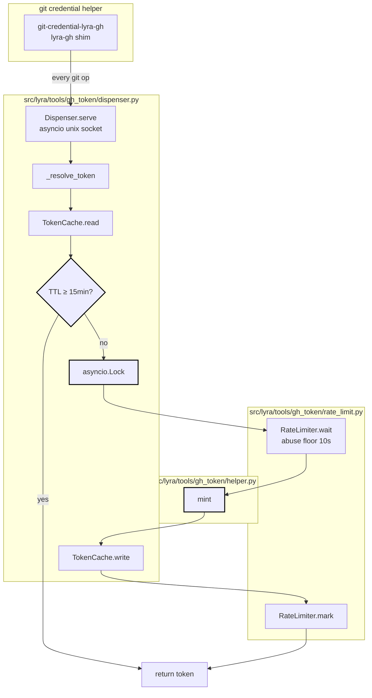
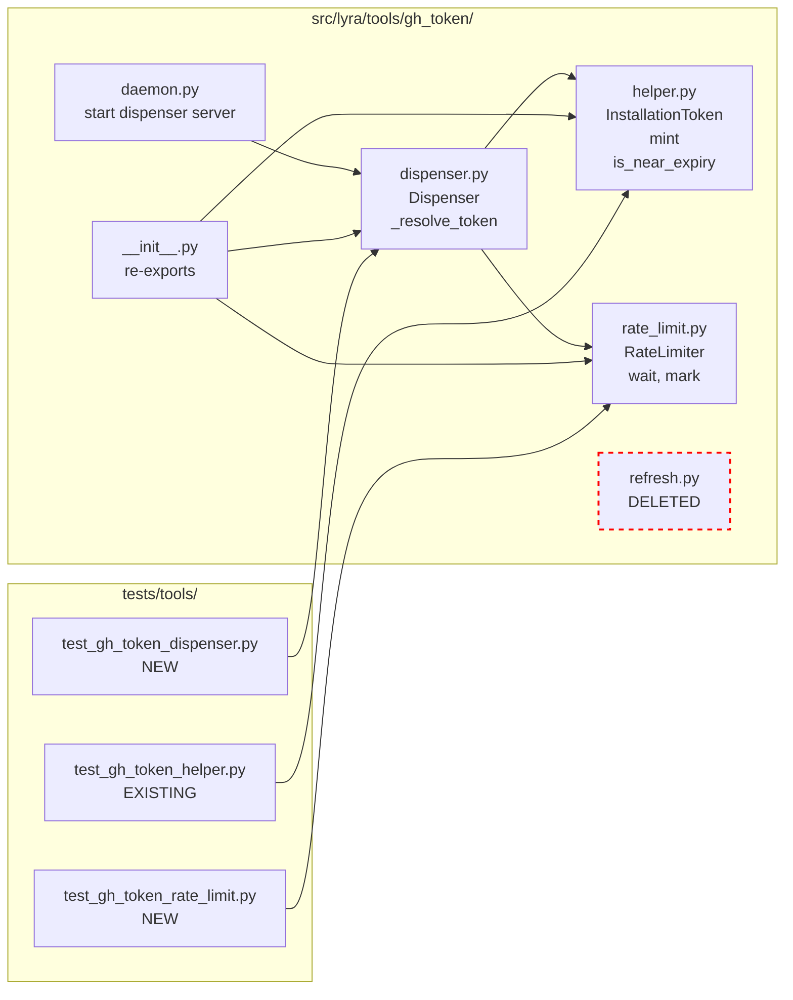

## Summary

Replace the background `refresh_loop` with a lazy TTL check on the dispenser read path. Every `_resolve_token()` mints synchronously under an `asyncio.Lock` when the cached token has <15 min TTL remaining. `refresh.py` is deleted, `rate_limit.py` is repurposed as a 10s abuse floor with a warning log when it stalls.

## Architecture

### Data flow



### File × function map



## Agents

| Agent | Tasks | Files |
|---|---|---|
| backend-dev | T2, T5, T6, T8 | `dispenser.py`, `rate_limit.py`, `daemon.py`, `__init__.py`, `helper.py` (docstring), `refresh.py` (delete) |
| tester | T1, T3, T4, T7 | `tests/tools/test_gh_token_dispenser.py` (new), `tests/tools/test_gh_token_rate_limit.py` (new), verification commands |

## Wave Structure

1 wave, sequential. Slices have logical ordering (S1 stops calling `mint_capped` before S3 deletes it). Parallelizing T1↔T4 saves <2 min on an F-lite refactor — not worth context fragmentation.

| Wave | Trigger | Agents | Tasks |
|------|---------|--------|-------|
| 1 | start | 1 (sequential pair) | tester-A: T1→T3 · backend-dev-A: T2 · tester-A: T4 · backend-dev-A: T5→T6 · tester-A: T7 · backend-dev-A: T8 |

### Budget

| Task | Items | Class | Est. ops | Split? |
|------|-------|-------|----------|--------|
| T1 RED dispenser tests | 1 new file, 4 test cases | bounded | 3 | — |
| T2 GREEN dispenser impl | 1 file, ~40 LOC diff | judgmental | 4 | — |
| T3 RED-GATE S1 verify | pytest run | trivial | 1 | — |
| T4 RED rate_limit tests | 1 new file, 2 test cases | bounded | 2 | — |
| T5 GREEN rate_limit impl | 1 file, ~10 LOC diff | bounded | 2 | — |
| T6 GREEN delete refresh + wiring | 4 files, deletion + strip | judgmental | 4 | — |
| T7 RED-GATE S3 verify | grep + smoke test | trivial | 2 | — |
| T8 REFACTOR ruff/pyright | tree-wide check | bounded | 2 | — |

**Total estimated ops: 20**

## Consistency Report

7/7 spec success criteria covered:

| SC# | Criterion (abbreviated) | Verified by |
|---|---|---|
| 1 | `_resolve_token()` returns ≥15min TTL | T3 (parametrized cold/near/fresh tests) |
| 2 | Concurrent reads → 1 mint | T3 (N=10 lock test) |
| 3 | Cold read after restart mints | T3 (cold cache test) |
| 4 | `refresh.py` deleted | T7 (`git ls-files` empty) |
| 5 | No remaining import of refresh symbols | T7 (`grep -r` empty) |
| 6 | Rate limiter ≥10s spacing | T4/T5 (caplog + time-skip test) |
| 7 | Daemon no `refresh_loop` task | T7 (smoke test, one server task) |

3/3 spec slices covered (S1 → T1/T2/T3, S2 → T4/T5, S3 → T6/T7, all → T8).

Untraced: none. Exemptions: none.

## Micro-Tasks

### Slice S1 — Dispenser TTL invariant

**T1 [RED] tester** — *Difficulty 2*
- File: `tests/tools/test_gh_token_dispenser.py` (new)
- Code shape:
  ```python
  async def test_resolve_token_cold_cache_mints(monkeypatch, freezer): ...
  async def test_resolve_token_near_expiry_remints(monkeypatch, freezer): ...
  async def test_resolve_token_fresh_returns_cached(monkeypatch, freezer): ...
  async def test_concurrent_near_expiry_mints_once(monkeypatch, freezer): ...
  ```
- Verify: `uv run pytest tests/tools/test_gh_token_dispenser.py -v`
- Expected: 4 tests FAIL (not implemented yet) — confirms RED
- Trace: SC-1, SC-2, SC-3
- Time: 5 min

**T2 [GREEN] backend-dev** — *Difficulty 3*
- Files: `src/lyra/tools/gh_token/dispenser.py`
- Changes:
  - Add `MIN_TOKEN_TTL_SECONDS = 900` constant
  - `_resolve_token()`: read cache → if token absent OR `(token.expires_at - now).total_seconds() < MIN_TOKEN_TTL_SECONDS` → enter lock → re-check inside lock → call `mint()` directly → write cache → `_rate_limiter.mark()` → return
  - Drop import of `mint_capped` from `refresh.py`; import `mint` from `helper.py` directly
  - Drop the existing `is_near_expiry(now, 300)` forced-mint branch (subsumed by the new check)
- Verify: `uv run pytest tests/tools/test_gh_token_dispenser.py -v`
- Expected: 4 tests PASS
- Trace: SC-1, SC-2, SC-3
- Time: 8 min

**T3 [RED-GATE] tester** — *Difficulty 1*
- Verify:
  - `uv run pytest tests/tools/test_gh_token_dispenser.py -v` → 4 passed
  - `uv run pytest tests/tools/test_gh_token_helper.py -v` → still passes (no regression)
- Expected: green; if not, return to T2
- Time: 2 min

### Slice S2 — Rate limiter as abuse floor

**T4 [RED] tester** — *Difficulty 2*
- File: `tests/tools/test_gh_token_rate_limit.py` (new)
- Code shape:
  ```python
  async def test_min_interval_is_10s(): ...
  async def test_wait_logs_warning_when_actually_sleeps(caplog): ...
  ```
- Verify: `uv run pytest tests/tools/test_gh_token_rate_limit.py -v`
- Expected: 2 tests FAIL — confirms RED
- Trace: SC-6
- Time: 4 min

**T5 [GREEN] backend-dev** — *Difficulty 2*
- File: `src/lyra/tools/gh_token/rate_limit.py`
- Changes:
  - Default `min_interval_s = 10.0` (was 45.0)
  - `wait()`: compute `remaining`; if `remaining > 0` → `logger.warning("RateLimiter abuse floor stalled %ss", remaining)` then `await asyncio.sleep(remaining)`
  - Module docstring: rewrite as "abuse floor" (catches pathological mint churn) not "mint cadence brake"
- Verify: `uv run pytest tests/tools/test_gh_token_rate_limit.py -v`
- Expected: 2 tests PASS
- Trace: SC-6
- Time: 4 min

### Slice S3 — Delete refresh.py + wiring

**T6 [GREEN] backend-dev** — *Difficulty 3*
- Files:
  - `src/lyra/tools/gh_token/refresh.py` — **DELETE**
  - `src/lyra/tools/gh_token/daemon.py` — remove `disable_refresh` config field + the `asyncio.create_task(refresh_loop(...))` block (around line 139); drop unused `refresh_loop` import
  - `src/lyra/tools/gh_token/__init__.py` — remove `mint_capped` and `refresh_loop` from `__all__` and from re-exports
  - `src/lyra/tools/gh_token/helper.py` — drop the `mint_capped` / `refresh_loop` reference in the module docstring (line 9)
- Verify:
  - `grep -r "gh_token.refresh\|mint_capped\|refresh_loop" src/` → empty
  - `grep -r "gh_token.refresh\|mint_capped\|refresh_loop" tests/` → empty (or only false positives we accept)
  - `uv run pyright src/lyra/tools/gh_token/` → clean
- Expected: all greps empty, pyright clean
- Trace: SC-4, SC-5
- Time: 6 min

**T7 [RED-GATE] tester** — *Difficulty 2*
- Verify:
  - `git ls-files src/lyra/tools/gh_token/refresh.py` → empty
  - `grep -rE "gh_token\.refresh|mint_capped|refresh_loop" src/ tests/` → empty
  - Daemon smoke test: instantiate `Dispenser`, call `serve()`, assert exactly one asyncio task (the server) exists, not two
- Expected: all green
- Trace: SC-4, SC-5, SC-7
- Time: 4 min

### Cross-cutting

**T8 [REFACTOR] backend-dev** — *Difficulty 1*
- Verify:
  - `uv run ruff check src/lyra/tools/gh_token/ tests/tools/test_gh_token_*.py` → clean
  - `uv run ruff format --check src/lyra/tools/gh_token/ tests/tools/test_gh_token_*.py` → clean
  - `uv run pyright src/lyra/tools/gh_token/` → clean
  - `uv run pytest tests/tools/test_gh_token_*.py -v` → all green
- Time: 3 min

## Task Seeding Blueprint

<!-- Used by /implement to seed TaskCreate calls on session start.
     Format: T{n} | agent-instance | blockedBy | subject
     blockedBy refs T-numbers within this list. -->

### Wave 1 — sequential, 1 active agent at a time

| Task | Agent instance | blockedBy | Subject |
|------|---------------|-----------|---------|
| T1 | tester-A | — | RED: write dispenser invariant tests (cold/near/fresh/concurrent) |
| T2 | backend-dev-A | T1 | GREEN: dispenser 15min TTL invariant + asyncio.Lock + sync mint |
| T3 | tester-A | T2 | RED-GATE S1: dispenser tests pass |
| T4 | tester-A | T3 | RED: write rate_limit abuse-floor + warning-log tests |
| T5 | backend-dev-A | T4 | GREEN: rate_limit default 10s + warning log + docstring |
| T6 | backend-dev-A | T5 | GREEN: delete refresh.py + strip daemon wiring + __init__ exports + helper docstring |
| T7 | tester-A | T6 | RED-GATE S3: grep empty + daemon smoke test |
| T8 | backend-dev-A | T7 | REFACTOR: ruff + pyright clean across touched files |

## Task IDs

<!-- Generated by /plan. Used by /implement to resume tasks on session restart. -->
<!-- TaskCreate seeding deferred to /implement; IDs populated then. -->
- T1: (pending) — RED: write dispenser invariant tests
- T2: (pending) — GREEN: dispenser TTL invariant + lock
- T3: (pending) — RED-GATE S1: dispenser tests pass
- T4: (pending) — RED: rate_limit tests
- T5: (pending) — GREEN: rate_limit abuse floor
- T6: (pending) — GREEN: delete refresh.py + wiring
- T7: (pending) — RED-GATE S3: grep + smoke
- T8: (pending) — REFACTOR: ruff + pyright
