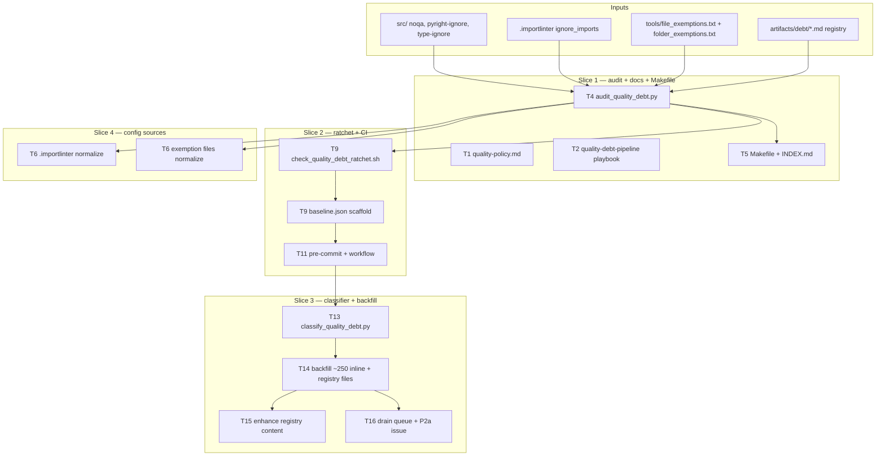
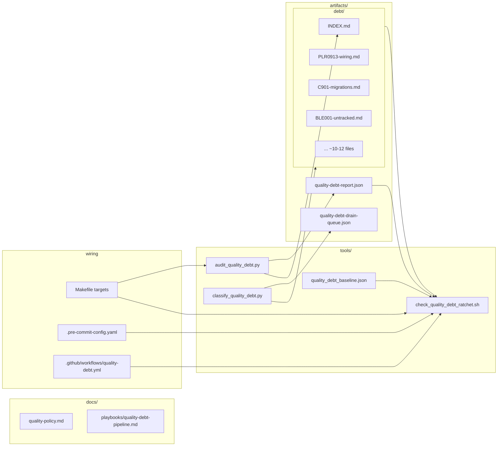

## Summary

F-lite tooling-only slice. Ship audit tool + ratchet gate + classifier + file-based debt registry + policy doc + playbook + drain queue + one P2a issue. Zero runtime code touched. Pre-commit + new dedicated CI workflow enforce the gate (soft via `cutover_date`, auto-promotes to hard after merge+7d). One PR, ~4 commits matching the 4 slices.

**Spec correction:** spec referenced `lefthook.yml`. Project actually uses **pre-commit** (`.pre-commit-config.yaml`). Plan uses the correct framework — pattern matches existing `tools/check_*.sh` hooks.

## Architecture





## Agents

| Agent instance | Role | Task count | Files |
|---|---|---|---|
| `devops-A` | tooling + CI wiring (primary track) | 10 | `tools/audit_*`, `tools/check_*`, `tools/classify_*`, `tools/quality_debt_baseline.json`, `Makefile`, `.pre-commit-config.yaml`, `.github/workflows/quality-debt.yml`, `artifacts/debt/INDEX.md`, src/ backfill (script-driven), P2a issue file |
| `devops-B` | S4 config sources (parallel track) | 1 | `.importlinter`, `tools/file_exemptions.txt`, `tools/folder_exemptions.txt` |
| `doc-writer-A` | policy doc + registry file content | 2 | `docs/quality-policy.md`, `artifacts/debt/*.md` (Pattern + Drain plan + Notes) |
| `doc-writer-B` | playbook (parallel to policy doc) | 1 | `docs/playbooks/quality-debt-pipeline.md` |
| `tester-A` | RED tests for each slice | 4 | `tests/tools/test_audit_quality_debt.py`, `tests/tools/test_ratchet.py`, `tests/tools/test_classifier.py`, integration RED-GATEs |

Total: **18 tasks**. devops-A is the serial spine (most chained); doc-writers + tester + devops-B run parallel.

## Wave Structure

8 waves, max 4 parallel agents. Elapsed ~3 sessions vs ~12 sequential.

| Wave | Trigger | Agents | Tasks |
|------|---------|--------|-------|
| 1 | start | 4 ∥ | doc-writer-A: T1 · doc-writer-B: T2 · tester-A: T3 · tester-A: T7 (chained T3→T7) |
| 2 | Wave 1 done | 1 | devops-A: T4 |
| 3 | T4 done | 3 ∥ | devops-A: T5→T8 · devops-B: T6 · tester-A: T10 |
| 4 | T7+T4 done | 1 | devops-A: T9 |
| 5 | T9 done | 1 | devops-A: T11→T12 |
| 6 | T10+T12 done | 1 | devops-A: T13 |
| 7 | T13 done | 2 ∥ | devops-A: T14→T16→T17 · doc-writer-A: T15 (after T14) |
| 8 | T17 done | 1 | devops-A: T18 |

## Consistency Report

| Metric | Value |
|---|---|
| Spec ACs covered | 25/25 |
| Untraced tasks | 0 |
| Spec sections referenced | Goal, Expected Behavior (3 flows), Breadboard (N1-6 + T1-5), POLICY vocab, Classification + Cap, Slices, Success Criteria, Decisions Resolved |
| Exemptions | None — slice scope matches spec exactly |

Each AC traces to ≥1 task via spec_trace metadata (`SC-N`). RED-GATE sentinels close each slice.

## Micro-Tasks

### Wave 1 — start, 4 ∥

**T1 [P]** — Write `docs/quality-policy.md` · doc-writer-A · SC-9 · Slice S1 · Phase GREEN · Diff 2
- File: `docs/quality-policy.md` (new)
- Content per spec § "POLICY Vocabulary" + § "Expected Behavior" + § Playbook scope:
  - Grammar definition (POLICY:`<tag>`, DEBT:`<slug>`)
  - Initial POLICY vocab table (9 tags)
  - DEBT rules (registry file required, status: open required)
  - "Adding an exception" how-to (decision tree: refactor → POLICY → DEBT)
  - **Error message catalog** (one line per failure mode)
  - **Cutover migration note** (what happens to in-flight PRs during 7-day soft window)
  - **"Transient drain entries" framing** (registry files = drain targets, not permanent backlog)
  - **DEBT lifecycle edge cases** (drained reintroduction, file rename, status transitions)
  - Quarterly audit cadence
  - Registry conventions (filename slug pattern, frontmatter schema)
- Verify: `test -f docs/quality-policy.md && grep -q "Adding an exception" docs/quality-policy.md`
- Expected: exit 0
- Estimate: 30 min
- Ref: spec § "POLICY Vocabulary", § "Playbook scope §1-3"

**T2 [P]** — Write `docs/playbooks/quality-debt-pipeline.md` · doc-writer-B · SC-10 · Slice S1 · Phase GREEN · Diff 3
- File: `docs/playbooks/quality-debt-pipeline.md` (new)
- All 8 sections per spec § "Playbook scope":
  - §1 Intent · §2 Pre-flight · §3 Steps (with rationale: warn-gate before backfill)
  - §4 POLICY tag cookbook (tag → rule → example with path:line citations from current lyra audit)
  - §5 Classification heuristics (rule → fix_class with rationale + counter-examples)
  - §6 Anti-patterns — **closed-issue-stale-comment** (cite `pyproject.toml:123` Wave-4 incident: #411 CLOSED, suppressions persist, comment lies, nothing flagged), **GitHub-issue-as-debt-tracker** (recreates the smell, rejected), **auto-fix everything big-bang** (RC-7 falsification gap, rejected)
  - §7 Re-run recipe (how to apply on a new debt category)
  - §8 Generalization notes (what's lyra-specific vs. liftable to dev-core in phase 2)
- Verify: `test -f docs/playbooks/quality-debt-pipeline.md && for s in "Intent" "Pre-flight" "Steps" "POLICY tag cookbook" "Classification heuristics" "Anti-patterns" "Re-run recipe" "Generalization"; do grep -q "$s" docs/playbooks/quality-debt-pipeline.md || { echo "missing: $s"; exit 1; }; done`
- Expected: exit 0
- Estimate: 45 min
- Ref: spec § "Playbook scope"

**T3 [P]** — Audit script unit tests (RED) · tester-A · SC-1, SC-2 · Slice S1 · Phase RED · Diff 3
- File: `tests/tools/test_audit_quality_debt.py` (new)
- Cases:
  - Parses `# noqa: BLE001 — POLICY:boundary` → bucket=POLICY, tag=boundary
  - Parses `# noqa: BLE001 — DEBT:foo` → bucket=DEBT, tag=foo
  - Parses bare `# noqa: BLE001` → bucket=UNTAGGED
  - Parses all 6 sources (noqa, pyright-ignore, type-ignore, importlinter ignore_imports, file_exemptions.txt, folder_exemptions.txt)
  - Emits JSON matching documented schema (validates against inline schema dict)
  - Detects DEBT slug referencing missing registry file → flagged in `stale_references`
  - Detects DEBT slug referencing registry with status=drained → flagged
  - Exit code: 0 when zero UNTAGGED, non-zero otherwise
- Verify: `uv run pytest tests/tools/test_audit_quality_debt.py -v 2>&1 | grep -E "^(PASSED|FAILED)" | wc -l` returns ≥8
- Expected: tests fail (RED — audit_quality_debt.py doesn't exist yet)
- Estimate: 30 min
- Ref: spec § "Tools T1", § "Inputs N1-N6", § Data Model

**T7 [P, chained T3→T7 same agent]** — Ratchet script tests (RED) · tester-A · SC-15, SC-16, SC-17 · Slice S2 · Phase RED · Diff 3
- File: `tests/tools/test_ratchet.py` (new)
- Cases:
  - Soft mode (today < cutover_date) prints warnings, exits 0
  - Hard mode (today >= cutover_date) on violation exits 1
  - `RATCHET_MODE=soft` env override forces soft even after cutover
  - `RATCHET_MODE=hard` env override forces hard before cutover
  - Untagged site present → violation (rule a)
  - `(rule, DEBT:slug)` count above baseline → violation (rule b)
  - DEBT slug referencing missing/drained registry → violation (rule c)
  - Baseline `generated_by != "make quality-debt-rebaseline"` → fails to load
  - **Zero `gh` API calls** (verified via mock: assert no `gh` subprocess invoked)
- Verify: `uv run pytest tests/tools/test_ratchet.py -v 2>&1 | grep -E "^(PASSED|FAILED)" | wc -l` returns ≥9
- Expected: tests fail (RED)
- Estimate: 30 min
- Ref: spec § "Tools T2", § "Cutover behavior"

### Wave 2 — after Wave 1, 1 agent

**T4** — Implement `tools/audit_quality_debt.py` (GREEN) · devops-A · SC-1, SC-2, SC-3, SC-4, SC-5 · Slice S1 · Phase GREEN · Diff 4
- File: `tools/audit_quality_debt.py` (new, ≤300 lines)
- Reads source via `QG_*` env (matches existing `tools/check_*.sh` pattern)
- Parses 6 sources via regex (per spec § Breadboard N1-N6)
- Reads `artifacts/debt/*.md` frontmatter for registry state
- Detects stale_references (DEBT slug in src/ → no/drained registry entry)
- Emits `artifacts/quality-debt-report.json` matching schema
- Stdout summary table grouped by (rule, bucket, slug)
- Exit non-zero if any UNTAGGED OR any stale_references in `src/`
- Verify: `uv run pytest tests/tools/test_audit_quality_debt.py -v` all pass
- Expected: all RED tests pass; `uv run python tools/audit_quality_debt.py --help` works
- Estimate: 60 min
- Ref: spec § "Tools T1", § Data Model

### Wave 3 — after T4, 3 ∥

**T5** — Makefile targets + INDEX.md scaffold (chained T5→T8) · devops-A · SC-1, SC-6 · Slice S1 · Phase GREEN · Diff 2
- Files: `Makefile` (modify), `artifacts/debt/INDEX.md` (new)
- Add targets: `quality-debt-report`, `quality-debt-rebaseline`, `quality-debt-classify`
- Add `.PHONY:` entries
- `artifacts/debt/INDEX.md`: scaffold table header (auto-populated by T4 on `make quality-debt-report`)
- Verify: `make -n quality-debt-report && make -n quality-debt-rebaseline && make -n quality-debt-classify && test -f artifacts/debt/INDEX.md`
- Expected: exit 0
- Estimate: 15 min

**T6 [P]** — S4: normalize `.importlinter` + exemption files · devops-B · SC-4, SC-5 · Slice S4 · Phase GREEN · Diff 2
- Files: `.importlinter` (modify ~22 lines), `tools/file_exemptions.txt` (modify 10 entries), `tools/folder_exemptions.txt` (modify 4 entries)
- Convert each existing reference to `DEBT:<slug>` grammar
- `.importlinter ignore_imports`: append `  # DEBT:importlinter-adr048-transition` to each line
- `tools/file_exemptions.txt`: convert `# <lines> lines — <issue> <desc>` to `# DEBT:file-exemptions — <desc>` (preserve line counts inline)
- `tools/folder_exemptions.txt`: same pattern → `DEBT:folder-exemptions`
- Verify: `grep -c "DEBT:" .importlinter` returns ≥22; `grep -c "DEBT:" tools/file_exemptions.txt` returns ≥10
- Expected: counts match
- Estimate: 20 min
- Note: registry files for these slugs created in T14 (classifier auto-creates)
- Ref: spec § "Inputs N4-N6"

**T8 [chained T5→T8]** — RED-GATE S1 · devops-A · SC-1, SC-2, SC-6, SC-9, SC-10 · Slice S1 · Phase RED-GATE · Diff 2
- Verify all S1 deliverables exist and audit runs:
  - `test -f tools/audit_quality_debt.py`
  - `test -f docs/quality-policy.md`
  - `test -f docs/playbooks/quality-debt-pipeline.md`
  - `test -d artifacts/debt && test -f artifacts/debt/INDEX.md`
  - `make quality-debt-report` runs (may exit non-zero, expected since no backfill yet)
  - `make -n quality-debt-rebaseline` parses
  - `uv run pytest tests/tools/test_audit_quality_debt.py` all pass
- Expected: all checks pass; audit report exists at `artifacts/quality-debt-report.json`
- Estimate: 10 min

**T10 [P, chained T3→T10 same agent as T3, T7]** — Classifier unit tests (RED) · tester-A · SC-11, SC-12 · Slice S3 · Phase RED · Diff 3
- File: `tests/tools/test_classifier.py` (new)
- Cases:
  - BLE001 at top-level CLI function → suggests POLICY:boundary
  - B008 at `typer.Option(` → suggests POLICY:typer-default
  - PLR0913 on bootstrap/factory/wiring/ funcs → suggests POLICY:wiring
  - C901 on `_atomic_table_copy` style funcs → suggests POLICY:migration-sequence
  - F401 in `__init__.py` → flagged as `needs_review` (multi-tag ambiguity)
  - Classification ratio `classified / (total - needs_review) >= 0.80`
  - `--apply` writes inline tag suffixes, creates registry files for DEBT clusters
  - `--apply` produces non-empty drain queue with cap ≤30 `easy` entries
- Verify: `uv run pytest tests/tools/test_classifier.py -v 2>&1 | grep -E "^(PASSED|FAILED)" | wc -l` returns ≥8
- Expected: tests fail (RED)
- Estimate: 30 min
- Ref: spec § "Classification + Cap", § "Tools T3"

### Wave 4 — after T7, T4, 1 agent

**T9** — Implement `tools/check_quality_debt_ratchet.sh` + baseline scaffold · devops-A · SC-13, SC-14, SC-15, SC-16, SC-19 · Slice S2 · Phase GREEN · Diff 4
- Files: `tools/check_quality_debt_ratchet.sh` (new), `tools/quality_debt_baseline.json` (new initial)
- Logic:
  - Runs T1 (audit) → reads `artifacts/quality-debt-report.json`
  - Compares against `tools/quality_debt_baseline.json`
  - Validates baseline `generated_by == "make quality-debt-rebaseline"` else fail
  - Computes mode: `today < cutover_date → soft`, else `hard`. `RATCHET_MODE` env overrides.
  - Three checks: (a) any UNTAGGED in src/, (b) any `(rule, slug)` count > baseline, (c) any DEBT slug refs missing/drained registry
  - Soft mode: print warnings, exit 0. Hard mode: exit 1 on any violation.
  - Zero `gh` calls (registry is local-only)
- Initial baseline: `{"generated_by": "make quality-debt-rebaseline", "cutover_date": "<today+7d>", "counts": {}}`
- Verify: `uv run pytest tests/tools/test_ratchet.py -v` all pass
- Expected: all RED tests pass
- Estimate: 45 min
- Ref: spec § "Tools T2", § "Cutover behavior"

### Wave 5 — after T9, 1 agent

**T11** — Pre-commit + dedicated CI workflow (chained T11→T12) · devops-A · SC-20, SC-21 · Slice S2 · Phase GREEN · Diff 2
- Files: `.pre-commit-config.yaml` (modify), `.github/workflows/quality-debt.yml` (new)
- `.pre-commit-config.yaml` — add hook entry mirroring existing pattern:
  ```yaml
  - id: check-quality-debt-ratchet
    name: check-quality-debt-ratchet
    entry: tools/check_quality_debt_ratchet.sh
    language: system
    pass_filenames: false
    stages: [pre-push]
  ```
- `.github/workflows/quality-debt.yml` — new workflow on `pull_request: [opened, synchronize, reopened]`:
  - Setup: uv, Python 3.12, checkout
  - Steps: `make quality-debt-report` → `tools/check_quality_debt_ratchet.sh` (no `RATCHET_MODE` set; uses computed mode)
  - CI never sets `RATCHET_MODE`
- Verify: `pre-commit run check-quality-debt-ratchet --all-files` exits as expected (soft mode pre-cutover); `actionlint .github/workflows/quality-debt.yml` clean
- Estimate: 20 min

**T12 [chained T11→T12]** — RED-GATE S2 · devops-A · SC-13, SC-15, SC-16, SC-17, SC-18, SC-20, SC-21 · Slice S2 · Phase RED-GATE · Diff 2
- Create throwaway commit with bare `# noqa: BLE001` in test fixture → run ratchet → confirms soft mode warns + exits 0
- Override via `RATCHET_MODE=hard tools/check_quality_debt_ratchet.sh` → confirms exits 1
- Revert throwaway commit
- Verify all S2 deliverables:
  - `test -f tools/check_quality_debt_ratchet.sh && test -x tools/check_quality_debt_ratchet.sh`
  - `test -f tools/quality_debt_baseline.json && jq -e '.generated_by == "make quality-debt-rebaseline"' tools/quality_debt_baseline.json`
  - `test -f .github/workflows/quality-debt.yml`
  - `grep -q check-quality-debt-ratchet .pre-commit-config.yaml`
  - Zero `gh` references in ratchet script: `! grep -q "^[[:space:]]*gh " tools/check_quality_debt_ratchet.sh`
- Expected: all checks pass
- Estimate: 15 min

### Wave 6 — after T10 and T12, 1 agent

**T13** — Implement `tools/classify_quality_debt.py` (GREEN) · devops-A · SC-11 · Slice S3 · Phase GREEN · Diff 4
- File: `tools/classify_quality_debt.py` (new, ≤300 lines)
- Reads `artifacts/quality-debt-report.json` (UNTAGGED rows)
- Rule-based classifier: maps (rule, path_pattern, line_context) → suggested POLICY tag or DEBT slug
- For F401 sites needing AST inspection: emits `fix_class: needs_review` (excluded from 80% denominator)
- `--apply` flag:
  - Edits inline comment suffix in src/ files (preserves existing comment content)
  - Auto-creates `artifacts/debt/<slug>.md` skeleton for each new DEBT cluster (frontmatter + ## Pattern / ## Sites / ## Drain plan / ## Notes stub bodies)
  - Updates `artifacts/debt/INDEX.md` table
  - Writes `artifacts/quality-debt-drain-queue.json` with REFACTOR-NOW entries (cap 30 `easy`)
- `--dry-run` (default): produces TSV preview
- Verify: `uv run pytest tests/tools/test_classifier.py -v` all pass; `uv run python tools/classify_quality_debt.py --dry-run | head` shows table
- Expected: all RED tests pass; classification ratio in report ≥ 0.80
- Estimate: 60 min
- Ref: spec § "Classification + Cap", § "Tools T3"

### Wave 7 — after T13, 2 ∥

**T14 [chained T13→T14→T16→T17 devops-A]** — Run classifier `--apply`: backfill src/ tags + create registry files · devops-A · SC-3, SC-7, SC-8, SC-11, SC-25 · Slice S3 · Phase GREEN · Diff 3
- Run `uv run python tools/classify_quality_debt.py --apply`
- Outputs:
  - ~250 inline comment edits across `src/lyra/` (and packages/* if classifier reaches them — confirm scope)
  - ~10–12 registry files in `artifacts/debt/` with `status: open` and stub bodies
  - `artifacts/debt/INDEX.md` updated
  - `artifacts/quality-debt-drain-queue.json` written, non-empty, ≤30 `easy` REFACTOR-NOW entries
- Verify:
  - `make quality-debt-report; echo $?` → exit 0
  - `git diff --stat src/lyra/ | tail -1` shows only comment-line changes (no semantic edits)
  - `ls artifacts/debt/*.md | wc -l` ≥10
  - `jq 'length' artifacts/quality-debt-drain-queue.json` > 0
- Expected: classifier completes; report exits 0; no runtime code touched
- Estimate: 30 min (mostly classifier runtime + visual diff check)

**T15 [P, after T14]** — Enhance registry file content · doc-writer-A · SC-8 · Slice S3 · Phase REFACTOR · Diff 3
- File: `artifacts/debt/*.md` (~10-12 files — fill stub bodies)
- For each registry file:
  - `## Pattern` — describe what the pattern is and why it's debt vs POLICY (1–3 paragraphs)
  - `## Sites` — either inline list of `path:line` or note "see artifacts/quality-debt-report.json"
  - `## Drain plan` — concrete refactor recipe (e.g., "extract config dataclass per DI pattern in `bootstrap/config.py`", "replace BLE001 with `except (NetworkError, TimeoutError)`")
  - `## Notes` — history, related work, why not POLICY, lifecycle remarks
- Verify: `for f in artifacts/debt/*.md; do [[ "$f" == *INDEX.md ]] && continue; grep -q "## Pattern" "$f" && grep -q "## Drain plan" "$f" || { echo "stub: $f"; exit 1; }; done`
- Expected: every non-INDEX file has filled sections (no stub placeholders)
- Estimate: 60 min (15-20 min × 4 batches of ~3 files)

**T16 [chained T14→T16, devops-A]** — File P2a drain epic + final drain queue commit · devops-A · SC-12, SC-13 · Slice S3 · Phase GREEN · Diff 1
- Action 1: file P2a GH issue via `dev-core:issue-triage`:
  - Title: `"Quality-debt drain pass — REFACTOR-NOW + first DEBT batch (P2a)"`
  - Body: references #1162, lists drain queue items, references registry files
  - Set `--blocked-by 1162`
  - Set `--size M --priority Medium`
- Action 2: ensure `artifacts/quality-debt-drain-queue.json` is committed (T14 wrote it; this step confirms)
- Action 3: update P2a issue number into all registry files' `drain_slice:` frontmatter field (sed pattern)
- Verify: `gh issue view <P2a-N> --json state,projectItems` shows OPEN + blocked-by 1162; `grep -l "drain_slice: P2a" artifacts/debt/*.md` returns ≥10 files
- Estimate: 10 min

**T17 [chained T16→T17, devops-A]** — RED-GATE S3 · devops-A · SC-3, SC-7, SC-8, SC-11, SC-12, SC-13 · Slice S3 · Phase RED-GATE · Diff 2
- Verify all S3 deliverables:
  - `make quality-debt-report` exits 0
  - All inline DEBT slugs resolve to existing `artifacts/debt/<slug>.md` with `status: open`
  - `artifacts/quality-debt-drain-queue.json` non-empty
  - P2a issue OPEN with `blocked-by: 1162`
  - All registry files have populated bodies (T15 done)
  - INDEX.md auto-populated
  - Drain queue cap respected: `jq '[.[] | select(.fix_class == "easy")] | length' artifacts/quality-debt-drain-queue.json` ≤ 30
- Verify command: see acceptance script in spec
- Expected: all checks pass
- Estimate: 15 min

### Wave 8 — after T17, 1 agent

**T18 [chained T17→T18, devops-A + tester-A]** — Full rebaseline + final RED-GATE · devops-A · SC-22, SC-23, SC-24 · Slice S2/S4 · Phase RED-GATE · Diff 3
- Run `make quality-debt-rebaseline` → produces final baseline JSON
- Validate baseline contents: `generated_by`, `cutover_date` (today+7d), per-(rule, bucket, slug) counts populated
- Run full pre-commit suite: `pre-commit run --all-files` — all existing gates green (lint, typecheck, test, import-layers, file-length, folder-size, duplicate-test-basenames)
- Re-run full test suite: `uv run pytest -x` clean
- Validate **no runtime code touched**: `git diff src/lyra/ | grep -v '^[+-][[:space:]]*#' | grep -E '^[+-][^+-]' | head` shows zero non-comment changes (allow comment-suffix additions)
- Validate **zero gh in ratchet hot path**: `! grep -E "^[^#]*\\bgh\\b" tools/check_quality_debt_ratchet.sh`
- Verify all 25 spec ACs marked done in spec via cross-reference
- Estimate: 30 min

## Task Seeding Blueprint

<!-- Used by /implement to seed TaskCreate calls.
     blockedBy refs T-numbers within this list. -->

### Wave 1 — no deps, 4 ∥

| Task | Agent instance | blockedBy | Subject |
|------|---------------|-----------|---------|
| T1 | doc-writer-A | — | Write docs/quality-policy.md |
| T2 | doc-writer-B | — | Write docs/playbooks/quality-debt-pipeline.md |
| T3 | tester-A | — | Audit script unit tests (RED) |
| T7 | tester-A | T3 | Ratchet script tests (RED) |

### Wave 2 — after Wave 1, 1 agent

| Task | Agent instance | blockedBy | Subject |
|------|---------------|-----------|---------|
| T4 | devops-A | T3 | Implement tools/audit_quality_debt.py |

### Wave 3 — after T4, 3 ∥

| Task | Agent instance | blockedBy | Subject |
|------|---------------|-----------|---------|
| T5 | devops-A | T4 | Makefile targets + artifacts/debt/INDEX.md scaffold |
| T6 | devops-B | T4 | S4: normalize .importlinter + exemption files |
| T8 | devops-A | T5 | RED-GATE S1 |
| T10 | tester-A | T7 | Classifier unit tests (RED) |

### Wave 4 — after T7+T4, 1 agent

| Task | Agent instance | blockedBy | Subject |
|------|---------------|-----------|---------|
| T9 | devops-A | T7, T8 | Implement check_quality_debt_ratchet.sh + baseline scaffold |

### Wave 5 — after T9, 1 agent

| Task | Agent instance | blockedBy | Subject |
|------|---------------|-----------|---------|
| T11 | devops-A | T9 | Pre-commit + .github/workflows/quality-debt.yml |
| T12 | devops-A | T11 | RED-GATE S2 |

### Wave 6 — after T10+T12, 1 agent

| Task | Agent instance | blockedBy | Subject |
|------|---------------|-----------|---------|
| T13 | devops-A | T10, T12 | Implement classify_quality_debt.py |

### Wave 7 — after T13, 2 ∥

| Task | Agent instance | blockedBy | Subject |
|------|---------------|-----------|---------|
| T14 | devops-A | T13 | Run classifier --apply: backfill + registry files |
| T15 | doc-writer-A | T14 | Enhance registry file bodies |
| T16 | devops-A | T14 | File P2a issue + final drain queue commit |
| T17 | devops-A | T15, T16, T6 | RED-GATE S3 |

### Wave 8 — after T17, 1 agent

| Task | Agent instance | blockedBy | Subject |
|------|---------------|-----------|---------|
| T18 | devops-A | T17 | Full rebaseline + final RED-GATE |

## Task IDs

<!-- Generated by /plan. Used by /implement to resume tasks on session restart. -->

| T# | Task ID | Subject |
|----|---------|---------|
| T1 | 12 | Write docs/quality-policy.md |
| T2 | 13 | Write docs/playbooks/quality-debt-pipeline.md |
| T3 | 14 | Audit script unit tests (RED) |
| T4 | 16 | Implement tools/audit_quality_debt.py (GREEN) |
| T5 | 17 | Makefile targets + artifacts/debt/INDEX.md scaffold |
| T6 | 18 | S4 — normalize .importlinter + exemption files |
| T7 | 15 | Ratchet script tests (RED) |
| T8 | 19 | RED-GATE S1 |
| T9 | 21 | Implement check_quality_debt_ratchet.sh + baseline scaffold (GREEN) |
| T10 | 20 | Classifier unit tests (RED) |
| T11 | 22 | Pre-commit + .github/workflows/quality-debt.yml |
| T12 | 23 | RED-GATE S2 |
| T13 | 24 | Implement classify_quality_debt.py (GREEN) |
| T14 | 25 | Run classifier --apply: backfill src/ tags + create registry files |
| T15 | 26 | Enhance registry file content |
| T16 | 27 | File P2a drain epic + final drain queue commit |
| T17 | 28 | RED-GATE S3 |
| T18 | 29 | Full rebaseline + final RED-GATE (all 25 ACs) |
