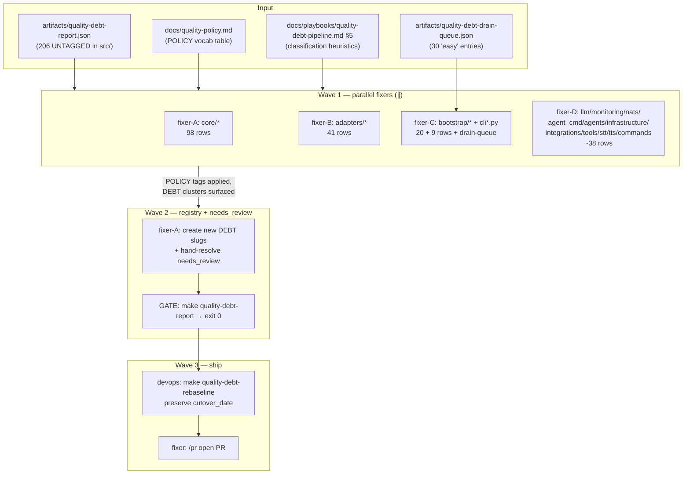
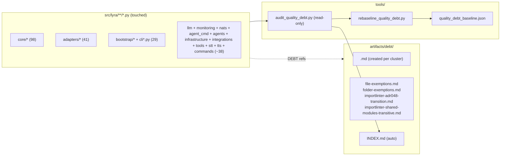

## Summary

Drive `make quality-debt-report` to exit 0 in `src/` by classifying every UNTAGGED row as POLICY (existing vocab) or DEBT (new registry slug), with parallel fixer agents working disjoint directory clusters in isolated worktrees. Final step rebaselines and ships.

## Architecture





## Bootstrap Context

- **Spec** approved 2026-05-11: `artifacts/specs/1163-quality-debt-drain-spec.mdx` (3 slices, 8 binary criteria).
- **Predecessor PR** #1162 (commit `59eb57a0`) shipped the invariant infra + hotfix `6cae765f` (audit exit-code semantics: scanner non-zero exit ≠ "found violations").
- **Cutover deadline** in baseline JSON: 2026-05-18. Today: 2026-05-11. Soft mode currently active (CI warns, never blocks).
- **Existing POLICY vocab** (`docs/quality-policy.md`): `boundary`, `typer-default`, `decorator-registered`, `re-export`, `module-level-patch`, `wiring`, `migration-sequence`, `protocol-private`, `defensive-narrow`.
- **Existing DEBT slugs** (4, all `status: open`, drain_slice=#1163): `file-exemptions`, `folder-exemptions`, `importlinter-adr048-transition`, `importlinter-shared-modules-transitive`.
- **Worktree convention**: `.claude/worktrees/1163-quality-debt-drain-*` (one per parallel fixer, `isolation: "worktree"` on each Agent call — memory `feedback_parallel_fixers_need_isolated_worktrees`).
- **Pre-commit/CI**: `.pre-commit-config.yaml` runs ruff format + audit; if `uv.lock` regen trips, `UV_FROZEN=1` before push.

## Agents

| Agent instance | Task count | Files / scope |
|---|---|---|
| fixer-A (Wave 1) | T1 | `src/lyra/core/**` (98 UNTAGGED rows) |
| fixer-B (Wave 1) | T2 | `src/lyra/adapters/**` (41 rows) |
| fixer-C (Wave 1) | T3 | `src/lyra/bootstrap/**`, `src/lyra/cli*.py`, drain-queue entries, malformed `wiring--` fix (~29 rows + 30 queue entries) |
| fixer-D (Wave 1) | T4 | `src/lyra/{llm,monitoring,nats,agent_cmd,agents,infrastructure,integrations,tools,stt,tts,commands}/**` (~38 rows) |
| fixer-A (Wave 2) | T6 | `artifacts/debt/<new>.md` registry files + hand-resolve `needs_review` rows surfaced by Wave 1 |
| devops (Wave 3) | T8 | `make quality-debt-rebaseline` |
| fixer-A (Wave 3) | T9 | `/pr` open PR |

Always-on: **tester** is not assigned distinct tasks (this issue ships configuration-style edits and registry files, not new code paths). The audit + ratchet themselves are the test harness.

## Wave Structure

3 waves, max 4 parallel agents. Elapsed ~1 day vs ~3 sequential.

| Wave | Trigger | Agents | Tasks |
|------|---------|--------|-------|
| 1 | start | 4 ∥ | fixer-A: T1 · fixer-B: T2 · fixer-C: T3 · fixer-D: T4 |
| 1-gate | Wave 1 done | 1 | T5 (RED-GATE verify) |
| 2 | T5 green | 1 | fixer-A: T6→T7 |
| 2-gate | Wave 2 done | 1 | T8 (RED-GATE verify) |
| 3 | T8 green | 1 | devops: T9 · fixer-A: T10 |

## Consistency Report

Spec criteria → tasks:

| SC | Criterion | Tasks |
|----|-----------|-------|
| SC-1 | `make quality-debt-report` exits 0 | T5, T8 (verify gates) |
| SC-2 | All 30 drain-queue entries processed | T3 (fixer-C scope includes the queue) |
| SC-3 | Drained slugs status flipped | T6 (registry pass) |
| SC-4 | No tests/fixtures/tools mutated (except baseline) | Guardrail in every T1–T7 prompt |
| SC-5 | New DEBT:`<slug>` has matching registry file | T6 |
| SC-6 | New POLICY:`<tag>` references vocab | T1–T4 (per-task guardrail) |
| SC-7 | Malformed `wiring--` eliminated | T3 (fixer-C scope) |
| SC-8 | Pre-push + CI green; audit invariant preserved | T5, T8 (verify) + T10 (/pr) |

Covered: 8/8. Untraced: 0. Uncovered: 0. No exemptions.

## Micro-Tasks

### Slice V1 + V2 (interleaved per spec) — Wave 1

#### T1 [P] — fixer-A — core cluster (~98 UNTAGGED)

- **Files:** `src/lyra/core/**/*.py` only. Read-only references: `docs/quality-policy.md`, `docs/playbooks/quality-debt-pipeline.md` §5 heuristics, `artifacts/quality-debt-report.json`.
- **Expected shape per site:**
  ```python
  # before
  except Exception as e:  # noqa: BLE001
  # after (existing vocab)
  except Exception as e:  # noqa: BLE001 — POLICY:boundary
  # or (new DEBT slug)
  except Exception as e:  # noqa: BLE001 — DEBT:core-untracked-broad
  ```
- **Verify:** `make quality-debt-report 2>&1 | grep "^core" || true` (informational); also `python3 -c "import json; d=json.load(open('artifacts/quality-debt-report.json')); print(len([r for r in d['rows'] if r['bucket']=='UNTAGGED' and r['path'].startswith('src/lyra/core/')]))"` returns 0.
- **Expected output:** 0 UNTAGGED in `src/lyra/core/` after task; report of new slugs needed handed to T6.
- **Time estimate:** 60–90 min.
- **Spec trace:** SC-1, SC-5, SC-6.
- **Phase:** GREEN.
- **Difficulty:** 4.

#### T2 [P] — fixer-B — adapters cluster (~41 UNTAGGED)

- **Files:** `src/lyra/adapters/**/*.py`. Read-only refs as T1.
- **Heuristics:** BLE001 in adapter entry points → POLICY:boundary; PLR0913 in factory/wiring helpers → POLICY:wiring; C901 in dispatcher → POLICY:wiring or DEBT; PLR2004 (magic numbers) → likely DEBT clusters; I001 (import sort) → refactor (re-sort imports, no tag).
- **Verify:** UNTAGGED count under `src/lyra/adapters/` = 0.
- **Time estimate:** 45–60 min.
- **Spec trace:** SC-1, SC-5, SC-6.
- **Phase:** GREEN.
- **Difficulty:** 4.

#### T3 [P] — fixer-C — bootstrap + cli*.py + drain-queue + wiring-- fix

- **Files:** `src/lyra/bootstrap/**/*.py`, `src/lyra/cli*.py` (cli.py, cli_agent.py, cli_agent_create.py, cli_ops.py, cli_setup.py, cli_voice_smoke.py), drain-queue entries (`artifacts/quality-debt-drain-queue.json` 30 entries).
- **Sub-steps:**
  1. Walk drain-queue: each entry is in this scope. For each, tag inline `POLICY:wiring` | `POLICY:typer-default` | `POLICY:boundary` per the existing vocab. Refactor only if trivial (no extracted dataclass — preserve as POLICY:wiring per #1162 convention).
  2. Walk remaining UNTAGGED rows in scope (~29). Apply heuristics: BLE001 in cli → POLICY:boundary; C901 in bootstrap_stores → POLICY:migration-sequence; F401 in `__init__.py` → POLICY:re-export; E402 → POLICY:module-level-patch.
  3. Fix the malformed `PLR0913 POLICY wiring--` tag (replace `wiring--` with `wiring`).
  4. Regenerate the drain-queue: re-run audit or hand-edit `artifacts/quality-debt-drain-queue.json` to remove processed entries.
- **Verify:** UNTAGGED in `src/lyra/bootstrap/`, `src/lyra/cli*.py` = 0; `grep -rn "wiring--" src/` returns nothing; drain-queue file shows ≤0 'easy' entries.
- **Time estimate:** 60–75 min.
- **Spec trace:** SC-1, SC-2, SC-6, SC-7.
- **Phase:** GREEN.
- **Difficulty:** 4.

#### T4 [P] — fixer-D — remaining clusters (~38 UNTAGGED)

- **Files:** `src/lyra/{llm,monitoring,nats,agent_cmd,agents,infrastructure,integrations,tools,stt,tts,commands}/**/*.py`. `src/lyra/tools/` is **inside** `src/` and is in scope — distinct from top-level `tools/` (out of scope).
- **Heuristics:** pyright suppressions (`reportUnnecessaryIsInstance`, `reportUnreachable`, `reportUnusedClass`) in nats codecs → POLICY:defensive-narrow or POLICY:protocol-private; `F401` in `__init__.py` → POLICY:re-export; PLR0913 in llm builders → POLICY:wiring or DEBT.
- **Verify:** UNTAGGED across these clusters = 0.
- **Time estimate:** 45–60 min.
- **Spec trace:** SC-1, SC-5, SC-6.
- **Phase:** GREEN.
- **Difficulty:** 4.

#### T5 — RED-GATE — Wave 1 verify

- **Description:** Run `make quality-debt-report`. Capture (a) residual UNTAGGED count, (b) any new DEBT slugs without registry files yet, (c) any `needs_review` cases flagged by Wave 1 fixers.
- **Files touched:** none (read-only verify).
- **Verify:** `make quality-debt-report; echo $?` exits 1 only if scanner crashes; report content tells the verdict. Expect UNTAGGED low double digits (residual: cases that need new DEBT slugs).
- **Expected output:** machine-readable summary of needs_review + new DEBT clusters → input for T6.
- **Time estimate:** 5 min.
- **Spec trace:** SC-1, SC-8.
- **Phase:** RED-GATE.
- **Difficulty:** 1.

### Slice V2 (registry expansion) — Wave 2

#### T6 — fixer-A — create new DEBT registry files + tag remaining UNTAGGED

- **Files:** `artifacts/debt/<new-slug>.md` (one per cluster surfaced by T5), edits to source files for the still-UNTAGGED sites to point at the new slugs.
- **Per slug file:**
  ```
  ---
  slug: <slug>
  status: open
  created: 2026-05-11
  drain_slice: "#1163"
  parent_slice: "#1162"
  rules: [<rule(s)>]
  sites: see artifacts/quality-debt-report.json
  fix_class: easy|medium|hard
  ---

  # <slug>

  ## Pattern
  <what the pattern is and why it is debt rather than POLICY>

  ## Sites
  <path:line list, or "see report">

  ## Drain plan
  <how to fix>

  ## Notes
  Created 2026-05-11 in #1163 drain pass (P2a).
  ```
- **Verify:** every `DEBT:<slug>` in `src/` has a matching `artifacts/debt/<slug>.md` with `status: open` (audit re-run shows zero "DEBT references missing registry" errors).
- **Time estimate:** 30–45 min.
- **Spec trace:** SC-5.
- **Phase:** GREEN.
- **Difficulty:** 3.

#### T7 — RED-GATE — Wave 2 verify

- **Description:** Run `make quality-debt-report` → must show 0 UNTAGGED in src/, 0 stale_references, zero "missing registry" / "drained registry" errors.
- **Verify:**
  ```bash
  make quality-debt-report
  python3 -c "import json; d=json.load(open('artifacts/quality-debt-report.json')); untagged_src=[r for r in d['rows'] if r['bucket']=='UNTAGGED' and r['path'].startswith('src/')]; assert len(untagged_src)==0, f'{len(untagged_src)} UNTAGGED remain in src/: {untagged_src[:5]}'; print('OK')"
  ```
- **Expected output:** `OK`.
- **Time estimate:** 5 min.
- **Spec trace:** SC-1, SC-4 (re-asserts no test/fixture/tool mutation).
- **Phase:** RED-GATE.
- **Difficulty:** 1.

### Slice V3 — Wave 3 (ship)

#### T8 — devops — rebaseline

- **Description:** Run `make quality-debt-rebaseline` (no `--reset-cutover` flag — must preserve cutover_date=2026-05-18 per spec edge case).
- **Files touched:** `tools/quality_debt_baseline.json` (regenerated; spec carves this out from the "no tools/ mutation" guardrail).
- **Verify:**
  ```bash
  jq '.cutover_date, .generated_by' tools/quality_debt_baseline.json
  # expect: "2026-05-18", "make quality-debt-rebaseline"
  ```
- **Expected output:** cutover_date unchanged; `generated_by: "make quality-debt-rebaseline"` sentinel present.
- **Time estimate:** 5 min.
- **Spec trace:** SC-8.
- **Phase:** GREEN.
- **Difficulty:** 2.

#### T9 — fixer-A — open PR

- **Description:** Run `/pr` skill — auto-detects branch + issue. Title: `feat(quality): #1163 drain pass — POLICY/DEBT classification`.
- **Body must mention:** drain-queue cleared; new DEBT slugs created (list); `wiring--` typo fixed; baseline regenerated with cutover_date preserved.
- **Verify:** `gh pr view --json url,state,title` returns the new PR with state=OPEN and link to issue #1163.
- **Time estimate:** 10 min.
- **Spec trace:** SC-8.
- **Phase:** GREEN.
- **Difficulty:** 2.

## Task Seeding Blueprint

<!-- Used by /implement to seed TaskCreate calls on session start.
     Each row = one micro-task. blockedBy refs T-numbers within this list.
     Agents in Wave 1 MUST use isolation: "worktree" (memory: parallel-fixers). -->

### Wave 1 — no deps, 4 fixers ∥

| Task | Agent instance | blockedBy | Subject |
|------|---------------|-----------|---------|
| T1 | fixer-A | — | Tag UNTAGGED in src/lyra/core/** (98 rows) — POLICY/DEBT classification |
| T2 | fixer-B | — | Tag UNTAGGED in src/lyra/adapters/** (41 rows) — POLICY/DEBT classification |
| T3 | fixer-C | — | Walk drain-queue + tag UNTAGGED in src/lyra/bootstrap/** and src/lyra/cli*.py; fix wiring-- typo |
| T4 | fixer-D | — | Tag UNTAGGED across src/lyra/{llm,monitoring,nats,agent_cmd,agents,infrastructure,integrations,tools,stt,tts,commands}/** |

### Wave 1 gate — after Wave 1, 1 agent

| Task | Agent instance | blockedBy | Subject |
|------|---------------|-----------|---------|
| T5 | fixer-A | T1, T2, T3, T4 | RED-GATE: make quality-debt-report → capture residual + needs_review |

### Wave 2 — after T5, 1 agent

| Task | Agent instance | blockedBy | Subject |
|------|---------------|-----------|---------|
| T6 | fixer-A | T5 | Create new DEBT registry files + tag remaining UNTAGGED with DEBT:<slug> |

### Wave 2 gate — after T6, 1 agent

| Task | Agent instance | blockedBy | Subject |
|------|---------------|-----------|---------|
| T7 | fixer-A | T6 | RED-GATE: assert UNTAGGED in src/ = 0 |

### Wave 3 — after T7, sequential

| Task | Agent instance | blockedBy | Subject |
|------|---------------|-----------|---------|
| T8 | devops | T7 | make quality-debt-rebaseline (preserve cutover_date) |
| T9 | fixer-A | T8 | /pr open PR #1163 |

## Risks & Mitigations

| Risk | Mitigation |
|---|---|
| Parallel fixers contaminate each other's worktrees via shared ruff format | `isolation: "worktree"` per Agent call (memory `feedback_parallel_fixers_need_isolated_worktrees` validated 2× on #1162, #1166) |
| Fixer accidentally tags non-`src/` files (tests, fixtures, top-level `tools/`) | Each fixer prompt enumerates allowed paths; verify command checks UNTAGGED count is computed only against `src/` |
| Misclassification: POLICY tag applied where DEBT is correct | Heuristics are documented (`docs/playbooks/quality-debt-pipeline.md` §5); `needs_review` cluster surfaces ambiguous rows to T6 for hand resolution |
| New POLICY:`<new-tag>` added without docs/quality-policy.md row | T1–T4 prompts include: "if new pattern emerges, add row to docs/quality-policy.md in same commit" |
| `uv.lock` regen trips pre-commit | Set `UV_FROZEN=1` in operator shell before push |
| `make quality-debt-rebaseline` accidentally resets cutover_date | Verify in T8 — `jq` the JSON; if reset, restore the date and re-commit |
| Cutover deadline passes while PR open (2026-05-18) | If PR lingers past deadline, ratchet auto-flips to hard mode — drain must already pass; else use `--reset-cutover` per spec edge case in a dedicated commit |

## Task IDs

<!-- Generated by /plan. Used by /implement to resume tasks on session restart. -->
- T1: 12 — Tag UNTAGGED in src/lyra/core/** (98 rows)
- T2: 13 — Tag UNTAGGED in src/lyra/adapters/** (41 rows)
- T3: 14 — Drain-queue + bootstrap/** + cli*.py + wiring-- typo fix
- T4: 15 — Tag UNTAGGED in llm/monitoring/nats/agent_cmd/agents/infrastructure/integrations/tools/stt/tts/commands (~38)
- T5: 16 — RED-GATE Wave 1 verify (blockedBy T1,T2,T3,T4)
- T6: 17 — Create new DEBT registry files + tag remaining UNTAGGED (blockedBy T5)
- T7: 18 — RED-GATE UNTAGGED in src/ = 0 (blockedBy T6)
- T8: 19 — make quality-debt-rebaseline preserve cutover_date (blockedBy T7)
- T9: 20 — /pr open PR (blockedBy T8)
