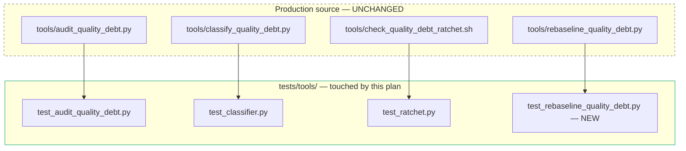
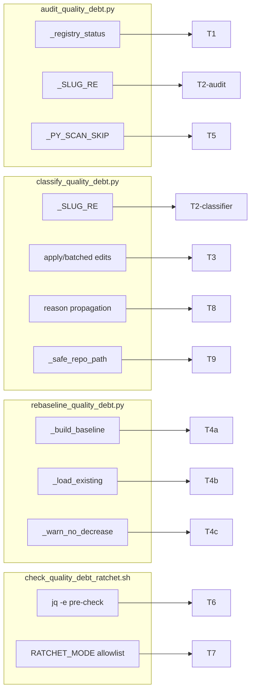

## Summary

Add 9 regression tests across 4 test files in `tests/tools/` (one new file), one commit per slice, single `tester-A` instance, three sequential waves matching the three spec slices.

## Architecture

### Test-to-source mapping



### Symbol × Test map



## Bootstrap Context

- **Source frame:** `artifacts/frames/1165-quality-debt-test-coverage-frame.mdx`
- **Spec:** `artifacts/specs/1165-quality-debt-test-coverage-spec.mdx`
- **Parent slice:** #1162 (quality-debt invariant)
- **Sibling:** #1163 (drain epic)
- **Reference test files for fixtures/patterns:** `tests/tools/test_audit_quality_debt.py`, `tests/tools/test_classifier.py`, `tests/tools/test_ratchet.py`
- **Verified source pins (from spec reviewers):**
  - `_registry_status` returns `"open"` on slug-regex failure or containment failure (`tools/audit_quality_debt.py:160-169`)
  - `_load_existing` returns `dict | None` — `None` for missing/malformed (`tools/rebaseline_quality_debt.py:27-33`)
  - `_safe_repo_path` is at `tools/classify_quality_debt.py:81`, exercised in apply path at `:400` and `:434`
  - `_SLUG_RE` duplicated: `audit:30`, `classifier:74` (both must be tested)

## Agents

| Agent | Instance | Task count | Files touched |
|-------|----------|-----------:|---------------|
| tester | tester-A | 13 (9 test impls + 3 slice gates + 1 final validate) | `tests/tools/test_audit_quality_debt.py`, `tests/tools/test_classifier.py`, `tests/tools/test_ratchet.py`, `tests/tools/test_rebaseline_quality_debt.py` (NEW) |

Single tester instance, sequential waves. Slices share no files but share the pre-commit hook surface; sequential keeps it boring.

## Wave Structure

4 waves, single agent. Elapsed ~30-45 min sequential (no meaningful parallel savings on 9 tests).

| Wave | Trigger | Agents | Tasks |
|------|---------|--------|-------|
| 1 | start | tester-A | T1 → T2a → T5 → T-GATE-1 (Slice 1: audit) |
| 2 | Wave 1 GATE green + commit | tester-A | T2b → T3 → T8 → T9 → T-GATE-2 (Slice 2: classifier) |
| 3 | Wave 2 GATE green + commit | tester-A | T4a → T4b → T4c → T6 → T7 → T-GATE-3 (Slice 3: ratchet + rebaseline) |
| 4 | Wave 3 GATE green + commit | tester-A | T-VALIDATE (final pytest sweep + diff-scope check) |

## Consistency Report

- **Spec criteria covered:** 12/12 (T1-T9 + pytest exits 0 + pre-commit/ratchet pass + diff-scope guard)
- **Untraced tasks:** 0 — every micro-task maps to a spec criterion or a gate
- **Uncovered criteria:** 0
- **Exemptions:** none

## Micro-Tasks

### Slice 1 — Audit hardening (Wave 1)

#### T1 — Path-traversal in `_registry_status`

- **File:** `tests/tools/test_audit_quality_debt.py`
- **Code shape:**
  ```python
  @pytest.mark.parametrize("bad_slug", ["../escape", "../../etc", "foo/bar", "Foo", "-leading", ""])
  def test_registry_status_rejects_malformed_or_traversal_slugs(tmp_path, bad_slug):
      result = _registry_status(tmp_path, bad_slug)
      assert result == "open"
  ```
- **Verify:** `uv run pytest tests/tools/test_audit_quality_debt.py::test_registry_status_rejects_malformed_or_traversal_slugs -v`
- **Expected:** GREEN
- **Time:** 3 min
- **Spec trace:** SC-T1
- **Slice:** V1 · **Phase:** RED→GREEN · **Difficulty:** 2

#### T2a — `_SLUG_RE` accept/reject (audit copy)

- **File:** `tests/tools/test_audit_quality_debt.py`
- **Code shape:**
  ```python
  @pytest.mark.parametrize("slug,expected", [
      ("valid-slug-1", True),
      ("a", True),
      ("Foo", False),
      ("a/b", False),
      ("-leading", False),
      ("", False),
  ])
  def test_audit_slug_regex(slug, expected):
      assert bool(_SLUG_RE.fullmatch(slug)) is expected
  ```
- **Verify:** `uv run pytest tests/tools/test_audit_quality_debt.py::test_audit_slug_regex -v`
- **Expected:** GREEN (6 parametrized cases)
- **Time:** 3 min
- **Spec trace:** SC-T2
- **Slice:** V1 · **Phase:** RED→GREEN · **Difficulty:** 1

#### T5 — `_PY_SCAN_SKIP` excludes `tests/` and `packages/`

- **File:** `tests/tools/test_audit_quality_debt.py`
- **Code shape:**
  ```python
  def test_py_scan_skips_tests_and_packages(tmp_path):
      # tmp tree: src/foo.py, tests/test_x.py, packages/y/z.py
      # write POLICY-tagged content in each
      # run the .py scan entry point
      # assert results contain src/foo.py path, not tests/ or packages/
  ```
- **Verify:** `uv run pytest tests/tools/test_audit_quality_debt.py::test_py_scan_skips_tests_and_packages -v`
- **Expected:** GREEN
- **Time:** 5 min
- **Spec trace:** SC-T5
- **Slice:** V1 · **Phase:** RED→GREEN · **Difficulty:** 3

#### T-GATE-1 — Slice 1 green-gate

- **Description:** Run `uv run pytest tests/tools/test_audit_quality_debt.py -v` → all GREEN. Commit slice 1 as `test(quality-debt): #1165 audit hardening (T1, T2a, T5)`.
- **Verify:** `git log -1 --format=%s` returns the commit subject
- **Time:** 2 min
- **Spec trace:** gate
- **Slice:** V1 · **Phase:** RED-GATE · **Difficulty:** 1

### Slice 2 — Classifier coverage (Wave 2)

#### T2b — `_SLUG_RE` accept/reject (classifier copy)

- **File:** `tests/tools/test_classifier.py`
- **Code shape:** mirror of T2a, importing from `tools.classify_quality_debt`
- **Verify:** `uv run pytest tests/tools/test_classifier.py::test_classifier_slug_regex -v`
- **Expected:** GREEN
- **Time:** 2 min
- **Spec trace:** SC-T2
- **Slice:** V2 · **Phase:** RED→GREEN · **Difficulty:** 1

#### T3 — Batched edits dedup

- **File:** `tests/tools/test_classifier.py`
- **Code shape:**
  ```python
  def test_apply_writes_once_for_multiple_policy_tags(tmp_path, monkeypatch):
      # create one file with 2 POLICY tags on different lines
      # mock or count write_text calls
      # run classifier --apply over that file
      # assert: write_text called exactly once, content reflects both edits
  ```
- **Verify:** `uv run pytest tests/tools/test_classifier.py::test_apply_writes_once_for_multiple_policy_tags -v`
- **Expected:** GREEN
- **Time:** 5 min
- **Spec trace:** SC-T3
- **Slice:** V2 · **Phase:** RED→GREEN · **Difficulty:** 3

#### T8 — `reason` field propagation

- **File:** `tests/tools/test_classifier.py`
- **Code shape:**
  ```python
  def test_drain_queue_carries_reason_field(tmp_path):
      # build a row that _classify_row tags with a known reason
      # serialize through to drain-queue output
      # assert: output JSON entry has reason == that known string
  ```
- **Verify:** `uv run pytest tests/tools/test_classifier.py::test_drain_queue_carries_reason_field -v`
- **Expected:** GREEN
- **Time:** 4 min
- **Spec trace:** SC-T8
- **Slice:** V2 · **Phase:** RED→GREEN · **Difficulty:** 2

#### T9 — `_safe_repo_path` containment in write path

- **File:** `tests/tools/test_classifier.py`
- **Code shape:**
  ```python
  def test_safe_repo_path_blocks_traversal(tmp_path):
      assert _safe_repo_path(tmp_path, "../escape") is None
      assert _safe_repo_path(tmp_path, "/abs/outside") is None
      assert _safe_repo_path(tmp_path, "valid/sub.py") is not None

  def test_apply_does_not_write_outside_root(tmp_path, monkeypatch):
      # craft an edit with a path escaping root
      # run apply path
      # assert: no file written outside root (write call count = 0 for offending row)
  ```
- **Verify:** `uv run pytest tests/tools/test_classifier.py::test_safe_repo_path_blocks_traversal tests/tools/test_classifier.py::test_apply_does_not_write_outside_root -v`
- **Expected:** GREEN
- **Time:** 5 min
- **Spec trace:** SC-T9
- **Slice:** V2 · **Phase:** RED→GREEN · **Difficulty:** 3

#### T-GATE-2 — Slice 2 green-gate

- **Description:** Run `uv run pytest tests/tools/test_classifier.py -v` → all GREEN. Commit as `test(quality-debt): #1165 classifier coverage (T2b, T3, T8, T9)`.
- **Verify:** `git log -1 --format=%s`
- **Time:** 2 min
- **Spec trace:** gate
- **Slice:** V2 · **Phase:** RED-GATE · **Difficulty:** 1

### Slice 3 — Ratchet + rebaseline (Wave 3)

#### T4a — `_build_baseline` structure

- **File:** `tests/tools/test_rebaseline_quality_debt.py` (NEW)
- **Code shape:**
  ```python
  def test_build_baseline_returns_expected_structure():
      report = {"counts_by_rule_bucket_slug": {"rule.X": {"DEBT": {"slug-1": 3}}}}
      out = _build_baseline(report)
      assert set(out.keys()) == {"generated_by", "generated_at", "cutover_date", "counts"}
      assert out["counts"] == report["counts_by_rule_bucket_slug"]

  def test_build_baseline_preserves_cutover_from_existing():
      existing = {"cutover_date": "2030-01-01", "counts": {}}
      out = _build_baseline({"counts_by_rule_bucket_slug": {}}, existing=existing)
      assert out["cutover_date"] == "2030-01-01"

  def test_build_baseline_resets_cutover_when_flag_set():
      existing = {"cutover_date": "2030-01-01", "counts": {}}
      out = _build_baseline({"counts_by_rule_bucket_slug": {}}, existing=existing, reset_cutover=True)
      assert out["cutover_date"] != "2030-01-01"
  ```
- **Verify:** `uv run pytest tests/tools/test_rebaseline_quality_debt.py -v -k build_baseline`
- **Expected:** GREEN (3 cases)
- **Time:** 5 min
- **Spec trace:** SC-T4a
- **Slice:** V3 · **Phase:** RED→GREEN · **Difficulty:** 2

#### T4b — `_load_existing` happy/missing/malformed

- **File:** `tests/tools/test_rebaseline_quality_debt.py`
- **Code shape:**
  ```python
  def test_load_existing_returns_dict_for_valid_file(tmp_path):
      p = tmp_path / "b.json"; p.write_text('{"k": 1}')
      assert _load_existing(p) == {"k": 1}

  def test_load_existing_returns_none_for_missing_file(tmp_path):
      assert _load_existing(tmp_path / "nope.json") is None

  def test_load_existing_returns_none_for_malformed_json(tmp_path):
      p = tmp_path / "bad.json"; p.write_text("not-json{")
      assert _load_existing(p) is None
  ```
- **Verify:** `uv run pytest tests/tools/test_rebaseline_quality_debt.py -v -k load_existing`
- **Expected:** GREEN (3 cases)
- **Time:** 3 min
- **Spec trace:** SC-T4b
- **Slice:** V3 · **Phase:** RED→GREEN · **Difficulty:** 1

#### T4c — `_warn_no_decrease`

- **File:** `tests/tools/test_rebaseline_quality_debt.py`
- **Code shape:**
  ```python
  def test_warn_no_decrease_warns_when_count_stagnant(capsys):
      new = {"counts": {"rule.X": {"DEBT": {"s": 3}}}}
      existing = {"counts": {"rule.X": {"DEBT": {"s": 3}}}}
      _warn_no_decrease(new, existing)
      captured = capsys.readouterr()
      assert "no decrease" in captured.err

  def test_warn_no_decrease_silent_when_decreased(capsys):
      new = {"counts": {"rule.X": {"DEBT": {"s": 1}}}}
      existing = {"counts": {"rule.X": {"DEBT": {"s": 3}}}}
      _warn_no_decrease(new, existing)
      assert capsys.readouterr().err == ""

  def test_warn_no_decrease_silent_when_no_existing(capsys):
      _warn_no_decrease({"counts": {}}, None)
      assert capsys.readouterr().err == ""
  ```
- **Verify:** `uv run pytest tests/tools/test_rebaseline_quality_debt.py -v -k warn`
- **Expected:** GREEN (3 cases)
- **Time:** 3 min
- **Spec trace:** SC-T4c
- **Slice:** V3 · **Phase:** RED→GREEN · **Difficulty:** 2

#### T6 — Ratchet `jq -e` malformed report

- **File:** `tests/tools/test_ratchet.py`
- **Code shape:** invoke `tools/check_quality_debt_ratchet.sh` via subprocess with a report missing required keys; assert exit ≠ 0 and stderr references schema/missing key
- **Verify:** `uv run pytest tests/tools/test_ratchet.py::test_ratchet_rejects_malformed_report -v`
- **Expected:** GREEN
- **Time:** 4 min
- **Spec trace:** SC-T6
- **Slice:** V3 · **Phase:** RED→GREEN · **Difficulty:** 2

#### T7 — `RATCHET_MODE` allowlist

- **File:** `tests/tools/test_ratchet.py`
- **Code shape:** invoke ratchet with `RATCHET_MODE=bogus`; assert exit ≠ 0 and stderr lists valid modes
- **Verify:** `uv run pytest tests/tools/test_ratchet.py::test_ratchet_rejects_invalid_mode -v`
- **Expected:** GREEN
- **Time:** 3 min
- **Spec trace:** SC-T7
- **Slice:** V3 · **Phase:** RED→GREEN · **Difficulty:** 1

#### T-GATE-3 — Slice 3 green-gate

- **Description:** Run `uv run pytest tests/tools/test_ratchet.py tests/tools/test_rebaseline_quality_debt.py -v` → all GREEN. Commit as `test(quality-debt): #1165 ratchet + rebaseline coverage (T4abc, T6, T7)`.
- **Verify:** `git log -1 --format=%s`
- **Time:** 2 min
- **Spec trace:** gate
- **Slice:** V3 · **Phase:** RED-GATE · **Difficulty:** 1

### Wave 4 — Final validation

#### T-VALIDATE — full pytest + diff-scope check

- **Description:** Run full tests/tools sweep + verify diff touches only tests/. Tasks:
  1. `uv run pytest tests/tools/ -v` exits 0
  2. `git diff staging...HEAD --name-only` → all paths start with `tests/tools/` (no `tools/` or other prod paths)
  3. Pre-commit hooks pass on the diff
- **Verify:**
  ```bash
  uv run pytest tests/tools/ -v && \
  ! git diff staging...HEAD --name-only | grep -v '^tests/tools/' && \
  pre-commit run --from-ref staging --to-ref HEAD
  ```
- **Expected:** all three commands exit 0
- **Time:** 3 min
- **Spec trace:** SC-pytest, SC-precommit, SC-diff-scope
- **Slice:** ALL · **Phase:** RED-GATE · **Difficulty:** 1

## Task Seeding Blueprint

<!-- Used by /implement to seed TaskCreate calls on session start.
     Format: T{n} | agent-instance | blockedBy | subject
     blockedBy refs T-numbers within this list (not session task IDs).
     Single tester-A instance for all waves — sequential within each wave. -->

### Wave 1 — no deps, 1 agent (tester-A)

| Task | Agent instance | blockedBy | Subject |
|------|---------------|-----------|---------|
| T1 | tester-A | — | Add path-traversal test for `_registry_status` |
| T2a | tester-A | T1 | Add `_SLUG_RE` parametrized test (audit copy) |
| T5 | tester-A | T2a | Add `_PY_SCAN_SKIP` exclusion test (tests/, packages/) |
| T-GATE-1 | tester-A | T1, T2a, T5 | Run slice 1 pytest + commit Slice 1 |

### Wave 2 — after Wave 1, 1 agent (tester-A)

| Task | Agent instance | blockedBy | Subject |
|------|---------------|-----------|---------|
| T2b | tester-A | T-GATE-1 | Add `_SLUG_RE` parametrized test (classifier copy) |
| T3 | tester-A | T2b | Add batched-edits dedup test (single write per file) |
| T8 | tester-A | T3 | Add `reason` field propagation test |
| T9 | tester-A | T8 | Add `_safe_repo_path` containment test + apply-path guard |
| T-GATE-2 | tester-A | T2b, T3, T8, T9 | Run slice 2 pytest + commit Slice 2 |

### Wave 3 — after Wave 2, 1 agent (tester-A)

| Task | Agent instance | blockedBy | Subject |
|------|---------------|-----------|---------|
| T4a | tester-A | T-GATE-2 | Create `test_rebaseline_quality_debt.py` + `_build_baseline` cases |
| T4b | tester-A | T4a | Add `_load_existing` happy/missing/malformed cases |
| T4c | tester-A | T4b | Add `_warn_no_decrease` warn/silent/none cases |
| T6 | tester-A | T4c | Add ratchet `jq -e` malformed-report test |
| T7 | tester-A | T6 | Add `RATCHET_MODE` allowlist test |
| T-GATE-3 | tester-A | T4a, T4b, T4c, T6, T7 | Run slice 3 pytest + commit Slice 3 |

### Wave 4 — after Wave 3, 1 agent (tester-A)

| Task | Agent instance | blockedBy | Subject |
|------|---------------|-----------|---------|
| T-VALIDATE | tester-A | T-GATE-3 | Run full tests/tools/ pytest + verify diff-scope + pre-commit |

## Task IDs

<!-- Generated by /plan. Used by /implement to resume tasks on session restart. -->
- T1: 12 — Add path-traversal test for `_registry_status`
- T2a: 13 — Add `_SLUG_RE` parametrized test (audit copy)
- T5: 14 — Add `_PY_SCAN_SKIP` exclusion test (tests/, packages/)
- T-GATE-1: 15 — Slice 1 green-gate + commit
- T2b: 16 — Add `_SLUG_RE` parametrized test (classifier copy)
- T3: 17 — Add batched-edits dedup test (single write per file)
- T8: 18 — Add `reason` field propagation test
- T9: 19 — Add `_safe_repo_path` containment test + apply-path guard
- T-GATE-2: 20 — Slice 2 green-gate + commit
- T4a: 21 — Create `test_rebaseline_quality_debt.py` + `_build_baseline` cases
- T4b: 22 — Add `_load_existing` happy/missing/malformed cases
- T4c: 23 — Add `_warn_no_decrease` warn/silent/none cases
- T6: 24 — Add ratchet `jq -e` malformed-report test
- T7: 25 — Add `RATCHET_MODE` allowlist test
- T-GATE-3: 26 — Slice 3 green-gate + commit
- T-VALIDATE: 27 — Final pytest sweep + diff-scope + pre-commit
