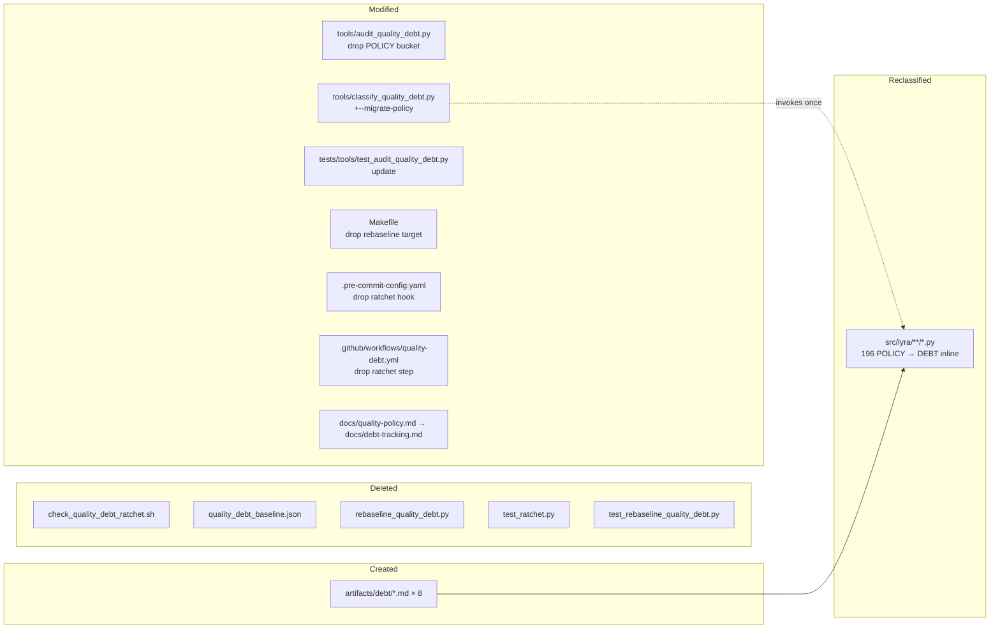

## Summary

Demolish the ratchet/baseline coercive layer (6 files + 3 config blocks deleted), simplify the audit tool to warn-only, rename the policy doc to a leaner debt-tracking doc, generate 8 cluster registry stubs, then bulk-migrate 196 inline POLICY markers in `src/lyra/` to DEBT slugs via an extended classifier — all behind 3 sequential slices A → B → C. No runtime code change.

## Architecture

```mermaid
flowchart TD
    subgraph Before
        SRC1[src/**/*.py<br/>POLICY+DEBT markers] --> AUDIT1[audit_quality_debt.py<br/>POLICY|DEBT|UNTAGGED]
        AUDIT1 --> RPT1[quality-debt-report.json]
        RPT1 --> RATCHET[check_quality_debt_ratchet.sh<br/>exit 1 on growth]
        BASE[quality_debt_baseline.json<br/>cutover_date] --> RATCHET
        RATCHET -.fails.-> PUSH[pre-push hook]
        RATCHET -.fails.-> CI[CI workflow]
    end

    subgraph After
        SRC2[src/**/*.py<br/>DEBT markers only] --> AUDIT2[audit_quality_debt.py<br/>DEBT|UNTAGGED, exit 0]
        AUDIT2 --> RPT2[quality-debt-report.json]
        AUDIT2 -.warns.-> STDERR[stderr only]
        RPT2 --> MAKE[make quality-debt-report<br/>informational]
        RPT2 -.future.-> PIPE[async drain pipeline]
        REG[artifacts/debt/*.md] --> AUDIT2
    end

    Before -.refactor.-> After

    style RATCHET fill:#f99
    style BASE fill:#f99
    style AUDIT2 fill:#9f9
```



## Agents

| Agent instance | Tasks | Files |
|---|---|---|
| devops-A | T1, T2, T3, T4, T5, T6, T7 (deletions + config edits + audit simplification) | tools/*, Makefile, .pre-commit-config.yaml, .github/workflows/quality-debt.yml |
| doc-writer-A | T8, T9 (doc rename + 8 registry stubs) | docs/, artifacts/debt/ |
| tester-A | T10, T13 (audit test update + report verification) | tests/tools/test_audit_quality_debt.py, ad-hoc bash verifications |
| devops-B | T11, T12, T14 (classifier --migrate-policy + bulk rewrite + close #1163) | tools/classify_quality_debt.py, src/lyra/** (annotations only), GitHub |

## Wave Structure

3 waves, max 3 parallel agents. Elapsed ~0.5 day vs ~1 day sequential.

| Wave | Trigger | Agents | Tasks |
|------|---------|--------|-------|
| 1 | start | 2 ∥ | devops-A: T1→T2→T3→T4→T5→T6 · doc-writer-A: T8→T9 |
| 2 | Wave 1 done | 2 ∥ | devops-A: T7 · tester-A: T10 |
| 3 | Wave 2 done | 3 ∥ then sequential | devops-B: T11→T12 · tester-A: T13 · devops-B: T14 |

## Consistency Report

- Spec criteria: 14 / Tasks covering: 14 ✓
- Untraced tasks: 0
- Slices: V1 (A) → V2 (B) → V3 (C); each task carries slice tag
- RED-GATE sentinels: G-A, G-B, G-C (one per slice, blocks slice completion until verification passes)

## Micro-Tasks

### Slice V1 — Decommission ratchet & baseline (devops-A + doc-writer-A)

**T1** — Delete `tools/check_quality_debt_ratchet.sh` `[P]`
- File: `tools/check_quality_debt_ratchet.sh`
- Verify: `! test -f tools/check_quality_debt_ratchet.sh`
- Expected: exit 0
- Agent: devops-A · Slice: V1 · Phase: REFACTOR · Difficulty: 1 · Time: 1 min · Trace: SC-1

**T2** — Delete `tools/quality_debt_baseline.json`
- File: `tools/quality_debt_baseline.json`
- Verify: `! test -f tools/quality_debt_baseline.json`
- Agent: devops-A · Slice: V1 · Phase: REFACTOR · Difficulty: 1 · Time: 1 min · Trace: SC-2

**T3** — Delete `tools/rebaseline_quality_debt.py` + its test
- Files: `tools/rebaseline_quality_debt.py`, `tests/tools/test_rebaseline_quality_debt.py`, `tests/tools/test_ratchet.py`
- Verify: `! test -f tools/rebaseline_quality_debt.py && ! test -f tests/tools/test_rebaseline_quality_debt.py && ! test -f tests/tools/test_ratchet.py`
- Agent: devops-A · Slice: V1 · Phase: REFACTOR · Difficulty: 1 · Time: 2 min · Trace: SC-3

**T4** — Remove `quality-debt-rebaseline` target from `Makefile`
- File: `Makefile`
- Edit: drop target block at lines ~326-333 + remove from `.PHONY` line 42
- Verify: `! grep -q "quality-debt-rebaseline" Makefile`
- Agent: devops-A · Slice: V1 · Phase: REFACTOR · Difficulty: 2 · Time: 3 min · Trace: SC-4

**T5** — Remove `check-quality-debt-ratchet` hook from `.pre-commit-config.yaml`
- File: `.pre-commit-config.yaml`
- Edit: drop the `- id: check-quality-debt-ratchet` block (~6 lines)
- Verify: `! grep -q "check-quality-debt-ratchet" .pre-commit-config.yaml`
- Agent: devops-A · Slice: V1 · Phase: REFACTOR · Difficulty: 2 · Time: 3 min · Trace: SC-5

**T6** — Strip ratchet step from `.github/workflows/quality-debt.yml`
- File: `.github/workflows/quality-debt.yml`
- Edit: drop "Run quality-debt ratchet" step + "Surface audit non-zero exit" warning step; keep `make quality-debt-report` as the only step in `ratchet` job; rename job `ratchet` → `audit`
- Verify: `! grep -q "ratchet" .github/workflows/quality-debt.yml`
- Agent: devops-A · Slice: V1 · Phase: REFACTOR · Difficulty: 3 · Time: 5 min · Trace: SC-6

**T8** — Rename + rewrite `docs/quality-policy.md` → `docs/debt-tracking.md` `[P]`
- Files: `docs/quality-policy.md` (delete), `docs/debt-tracking.md` (create)
- Content: 4 sections — `## Grammar`, `## Registry Conventions`, `## Adding a DEBT entry`, `## Workflow`; drop all POLICY vocabulary, cutover, ratchet, error catalog enforcement language
- Verify: `! test -f docs/quality-policy.md && test -f docs/debt-tracking.md && grep -qc "^## Grammar" docs/debt-tracking.md`
- Agent: doc-writer-A · Slice: V1 · Phase: REFACTOR · Difficulty: 3 · Time: 10 min · Trace: SC-11

**T9** — Create 8 cluster registry stubs in `artifacts/debt/`
- Files: `artifacts/debt/{boundary-broad-catch,wiring-bootstrap-deps,defensive-narrow-payloads,re-export-init,typer-default-option,migration-sequence-bootstrap,protocol-private-ducktyping,module-level-patch-fixtures}.md`
- Schema: frontmatter `slug`, `status: open`, `created: 2026-05-13`, `rules: [...]`; body `## Pattern`, `## Sites`, `## Drain plan`, `## Notes`
- Verify: `ls artifacts/debt/{boundary-broad-catch,wiring-bootstrap-deps,defensive-narrow-payloads,re-export-init,typer-default-option,migration-sequence-bootstrap,protocol-private-ducktyping,module-level-patch-fixtures}.md | wc -l` → 8
- Agent: doc-writer-A · Slice: V1 · Phase: REFACTOR · Difficulty: 3 · Time: 15 min · Trace: SC-10 (preparation)

### Slice V2 — Simplify audit tool + verify warn-only (devops-A + tester-A)

**T10** — RED: update `tests/tools/test_audit_quality_debt.py` for new semantics
- File: `tests/tools/test_audit_quality_debt.py`
- Edit: drop all POLICY-bucket test cases; add tests for (a) `bucket` field only takes `DEBT|UNTAGGED`, (b) audit exits 0 even with untagged markers, (c) UNTAGGED markers emit a stderr warning line
- Verify: `uv run pytest tests/tools/test_audit_quality_debt.py -x` → fails (RED, audit still emits POLICY)
- Agent: tester-A · Slice: V2 · Phase: RED · Difficulty: 3 · Time: 15 min · Trace: SC-7, SC-8

**T7** — GREEN: simplify `tools/audit_quality_debt.py`
- File: `tools/audit_quality_debt.py`
- Edit: remove POLICY bucket inference path; collapse `bucket` enum to `{DEBT, UNTAGGED}`; force `sys.exit(0)` at end (no error exits on findings); emit UNTAGGED warnings to stderr
- Verify: `uv run pytest tests/tools/test_audit_quality_debt.py -x` → green
- Agent: devops-A · Slice: V2 · Phase: GREEN · Difficulty: 4 · Time: 20 min · Trace: SC-7, SC-8

**G-B** — RED-GATE: V2 verification
- Action: `make quality-debt-report && python3 -c "import json,sys; d=json.load(open('artifacts/quality-debt-report.json')); buckets=set(r['bucket'] for r in d['rows']); print(buckets); sys.exit(0 if 'POLICY' not in buckets else 1)"`
- Expected: `{'UNTAGGED'}` (markers in src/ still POLICY-shaped but classified as UNTAGGED by new audit since POLICY bucket is gone — until V3) or `{'UNTAGGED', 'DEBT'}` (existing DEBT markers from #1162 stay); no `POLICY`
- Agent: tester-A · Slice: V2 · Phase: RED-GATE · Difficulty: 2 · Time: 3 min · Trace: SC-8

### Slice V3 — Reclassify markers + close superseded issue (devops-B + tester-A)

**T11** — Add `--migrate-policy` to `tools/classify_quality_debt.py`
- File: `tools/classify_quality_debt.py`
- Edit: add `--migrate-policy` flag; embed mapping `{boundary: boundary-broad-catch, wiring: wiring-bootstrap-deps, defensive-narrow: defensive-narrow-payloads, re-export: re-export-init, typer-default: typer-default-option, migration-sequence: migration-sequence-bootstrap, protocol-private: protocol-private-ducktyping, module-level-patch: module-level-patch-fixtures}`; for each POLICY:<tag> marker in src/lyra/, rewrite suffix as DEBT:<slug>; stderr-warn on any unmatched tag
- Verify: `uv run python tools/classify_quality_debt.py --migrate-policy --dry-run --root src/lyra | grep -c "POLICY:" ` → 196 (dry-run shows planned rewrites)
- Agent: devops-B · Slice: V3 · Phase: GREEN · Difficulty: 4 · Time: 25 min · Trace: SC-9

**T12** — Apply classifier rewrite to `src/lyra/`
- Files: `src/lyra/**/*.py` (annotation comments only)
- Action: `uv run python tools/classify_quality_debt.py --migrate-policy --apply --root src/lyra`
- Verify: `! grep -rE "POLICY:(boundary|wiring|defensive-narrow|re-export|typer-default|migration-sequence|protocol-private|module-level-patch)" src/lyra/`
- Agent: devops-B · Slice: V3 · Phase: GREEN · Difficulty: 3 · Time: 5 min · Trace: SC-9, SC-13

**T13** — Verify final audit report shape
- Action: `make quality-debt-report && python3 -c "import json,sys; d=json.load(open('artifacts/quality-debt-report.json')); rows=[r for r in d['rows'] if r['path'].startswith('src/lyra/')]; bad=[r for r in rows if r['bucket'] in ('POLICY','UNTAGGED')]; print('bad in src/lyra:',len(bad)); sys.exit(0 if not bad else 1)"`
- Expected: 0 POLICY + 0 UNTAGGED in `src/lyra/`; every DEBT slug references an existing `artifacts/debt/<slug>.md`
- Agent: tester-A · Slice: V3 · Phase: RED-GATE · Difficulty: 2 · Time: 5 min · Trace: SC-9, SC-10

**T14** — Close issue #1163 as superseded
- Action: `gh issue close 1163 --reason "not planned" --comment "Superseded by #1175 — manual drain epics replaced by future async pipeline. See artifacts/debt/ as the new input format."`
- Verify: `gh issue view 1163 --json state,stateReason --jq '.state + " " + .stateReason'` → `CLOSED NOT_PLANNED`
- Agent: devops-B · Slice: V3 · Phase: REFACTOR · Difficulty: 1 · Time: 1 min · Trace: SC-12

## Task Seeding Blueprint

<!-- Used by /implement to seed TaskCreate calls on session start. -->

### Wave 1 — no deps, 2 agents ∥

| Task | Agent instance | blockedBy | Subject |
|------|---------------|-----------|---------|
| T1 | devops-A | — | Delete tools/check_quality_debt_ratchet.sh |
| T2 | devops-A | T1 | Delete tools/quality_debt_baseline.json |
| T3 | devops-A | T2 | Delete tools/rebaseline_quality_debt.py + its tests + test_ratchet.py |
| T4 | devops-A | T3 | Remove quality-debt-rebaseline target from Makefile |
| T5 | devops-A | T4 | Remove check-quality-debt-ratchet hook from .pre-commit-config.yaml |
| T6 | devops-A | T5 | Strip ratchet step from .github/workflows/quality-debt.yml |
| T8 | doc-writer-A | — | Rename + rewrite docs/quality-policy.md → docs/debt-tracking.md |
| T9 | doc-writer-A | T8 | Create 8 cluster registry stubs in artifacts/debt/ |

### Wave 2 — after Wave 1, 2 agents ∥

| Task | Agent instance | blockedBy | Subject |
|------|---------------|-----------|---------|
| T10 | tester-A | T6,T9 | RED: update test_audit_quality_debt.py for warn-only + drop POLICY |
| T7 | devops-A | T10 | GREEN: simplify tools/audit_quality_debt.py (drop POLICY, exit 0, stderr warn) |
| G-B | tester-A | T7 | RED-GATE: verify report has no POLICY bucket |

### Wave 3 — after Wave 2, 1 agent then verify

| Task | Agent instance | blockedBy | Subject |
|------|---------------|-----------|---------|
| T11 | devops-B | G-B | Add --migrate-policy flag to classify_quality_debt.py |
| T12 | devops-B | T11 | Apply classifier rewrite to src/lyra/ (196 markers) |
| T13 | tester-A | T12 | Verify final audit report has 0 POLICY + 0 UNTAGGED in src/lyra/ |
| T14 | devops-B | T13 | Close issue #1163 as not_planned, comment referencing #1175 |

## Task IDs

<!-- Generated by /plan. Used by /implement to resume tasks on session restart. -->
- T1: 1 — Delete tools/check_quality_debt_ratchet.sh
- T2: 2 — Delete tools/quality_debt_baseline.json
- T3: 3 — Delete rebaseline tool + its tests + test_ratchet
- T4: 4 — Remove quality-debt-rebaseline target from Makefile
- T5: 5 — Remove check-quality-debt-ratchet hook from .pre-commit-config.yaml
- T6: 6 — Strip ratchet step from CI workflow
- T8: 7 — Rename + rewrite docs/quality-policy.md → docs/debt-tracking.md
- T9: 8 — Create 8 cluster registry stubs in artifacts/debt/
- T10: 9 — RED: update test_audit_quality_debt for warn-only + drop POLICY
- T7: 10 — GREEN: simplify tools/audit_quality_debt.py
- G-B: 11 — RED-GATE V2: verify report has no POLICY bucket
- T11: 12 — Add --migrate-policy flag to classify_quality_debt.py
- T12: 13 — Apply classifier rewrite to src/lyra/
- T13: 14 — Verify final audit report shape
- T14: 15 — Close issue #1163 as superseded
