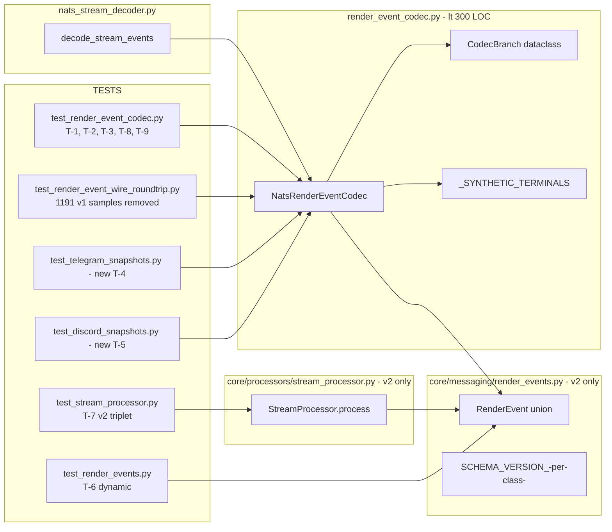

## Summary

Land Shape 2 (hardening-first, cutover-last) in **four CI-green commits** on
one PR: (1) test plumbing, (2) codec registry refactor + decoder fix + ADR-072,
(3) atomic v1 cutover across 7 enumerated consumer paths + the #1191 wire
test, (4) file-exemption removal + stale-exemption tooling. Single dedicated
worktree, no parallel agents (per memory `pre_commit_ruff_contaminates_shared_worktree`).

## Architecture

### Data flow — registry-driven encode/decode

```mermaid
flowchart TD
    subgraph SRC[Source]
      EVT[RenderEvent instance<br/>v2 triplet + Run + Reasoning + ToolCall]
      WIRE[NATS chunk<br/>event_type, payload, done, seq]
    end

    subgraph CODEC[src/lyra/nats/render_event_codec.py]
      REG[_registry: dict-Type-CodecBranch-]
      INV[_by_type_str: dict-str-Type-]
      SYN[_SYNTHETIC_TERMINALS frozenset<br/>stream_end, stream_error]
      ENC[encode-event-]
      DEC[decode-event_type, payload-]
      TERM[is_terminal-event_type-]
    end

    subgraph DECODER[src/lyra/adapters/nats/nats_stream_decoder.py]
      D1[event_type = chunk.get<br/>NO DEFAULT]
      D2{event_type is None?}
      D3{event_type == stream_error?}
      D4[codec.decode]
      OUT[yield RenderEvent]
    end

    EVT --> ENC
    ENC --> REG
    REG --> WIRE
    WIRE --> D1
    D1 --> D2
    D2 -- yes --> BRK1[log.warning + break]
    D2 -- no --> D3
    D3 -- yes --> BRK2[break]
    D3 -- no --> D4
    D4 --> DEC
    DEC --> SYN
    DEC --> INV
    DEC --> OUT

    style REG fill:#1a3a1a,stroke:#7fbf7f
    style SYN fill:#1a3a1a,stroke:#7fbf7f
    style D2 fill:#3a3a1a,stroke:#bfbf7f
    style D3 fill:#3a3a1a,stroke:#bfbf7f
```



### File × Function map (post-slice steady state)



## Bootstrap Context

Read these before writing any code:

- **Spec:** `artifacts/specs/1192-codec-registry-v2-cutover-spec.mdx` — all
  acceptance criteria + 2 deferred clarifications (χ-1 exception tuple,
  χ-2 ToolSummary wrapper shape — resolve inline in Slice 2).
- **Analysis:** `artifacts/analyses/1192-codec-registry-v2-cutover-analysis.mdx` —
  3 shapes considered, why Shape 2 won, risks table.
- **Panel consensus:** `artifacts/analyses/1190-codec-review-findings-consensus.mdx` —
  3-0 high-confidence verdict on the registry pattern + per-class try/except.
- **Sub-issue:** `gh issue view 1177` — 3 deferred items (S2, S3, N6) closing here.
- **Current codec:** `src/lyra/nats/render_event_codec.py` (412 LOC, exempted).
- **Current decoder:** `src/lyra/adapters/nats/nats_stream_decoder.py:122`
  (the `chunk.get("event_type", "text")` line that needs replacement).
- **Runbook insertion point:** `docs/ops/container-publishing.md` between line 178
  (end of `## M1 manual pull + restart`) and line 180 (`## M1 GHCR auth`).
- **#1191 wire test:** `tests/nats/test_render_event_wire_roundtrip.py` —
  drop v1 imports + samples in Slice 3 (architect-flagged file).

## Agents

| Agent | Tasks | Files |
|-------|-------|-------|
| backend-dev | 32 | codec, decoder, consumers, processor, tests |
| doc-writer | 6 | ADR-072, ADR-032 superseded banner, messaging.md, CHANGELOG, container-publishing.md |
| devops | 3 | file_exemptions tooling, stale-exemption gate |
| tester | 0 | (backend-dev writes tests inline per TDD; tester role merged) |

**Architect spot-review (not a task):** at the Slice 2 → Slice 3 boundary,
verify CI-green + import-layers gates before Slice 3 starts. Manual checkpoint;
no TaskCreate.

## Wave Structure

**4 waves = 4 slices = 4 commits. Sequential by construction** (each slice's
CI-green state depends on the prior). Single dedicated worktree, no parallel
agents.

| Wave | Trigger | Agents | Tasks |
|------|---------|--------|-------|
| 1 | start | backend-dev-A | T1→T2→T3→T4 (RED-GATE)→T5 (commit) |
| 2 | Wave 1 commit pushed CI-green | backend-dev-A, doc-writer-A | backend-dev-A: T6→T7→T8→T9→T10→T11→T12 · doc-writer-A: T13 · T14 (RED-GATE)→T15 (commit) |
| 3 | Wave 2 commit pushed CI-green + architect spot-review | backend-dev-A, doc-writer-A | backend-dev-A: T16→T17→T18→T19→T20→T21→T22→T23→T24→T25→T26→T27→T28→T29→T30→T31→T32 · doc-writer-A: T33→T34→T35→T36 · T37 (RED-GATE)→T38 (commit) |
| 4 | Wave 3 commit pushed CI-green | devops-A, backend-dev-A | devops-A: T39→T40→T41 · T42 (RED-GATE)→T43 (commit) |

Elapsed estimate: **5–7 working days** (matches spec appetite). Sequential
because of the no-parallel constraint; not faster than that.

### Budget

| Task batch | Items | Class | Est. ops | Split? |
|-----------|-------|-------|----------|--------|
| Wave 1 — snapshot + dynamic tests | 5 | bounded | 12 | — |
| Wave 2 — codec rewrite + tests + ADR | 10 | judgmental | 38 | — |
| Wave 3 — 9 consumer migrations + 5 tests + 5 atomic edits + 4 docs + gates | 23 | bounded (consumers) + judgmental (registry removal, dual-emit drop, ADR-032 banner) | 78 | NO — each task ≤ 8 ops; total OK |
| Wave 4 — exemption removal + tooling | 5 | bounded | 12 | — |

**Total estimated ops: ~140.** No single task exceeds 8 ops. Largest cluster
is Wave 3 (the v1 cutover atomic commit) — natural artifact of Shape 2's
"one big commit for the behavior change" design.

## Consistency Report

| Coverage | Count |
|---------|-------|
| Acceptance criteria in spec | 25 |
| Tasks tracing to ≥1 AC | 43 |
| AC traced by ≥1 task | 25 / 25 ✓ |
| Uncovered AC | 0 |
| Untraced tasks | 0 (every task has a `Spec trace`) |
| Exempt AC | 0 |

## Micro-Tasks

### Slice 1 — Test plumbing (commit 1)

#### T1 [P] Create `tests/adapters/test_telegram_snapshots.py`
- **File:** `tests/adapters/test_telegram_snapshots.py` (new)
- **Code shape:** 3 test cases — `test_single_block_snapshot`, `test_multi_block_snapshot`, `test_error_snapshot`. Each constructs an inbound dummy + an outbound chunks iterator over the v1+v2 dual-emit stream that currently flows, then asserts the user-visible telegram message body matches a frozen snapshot (use `syrupy` or `pytest`-style golden string; check repo for existing pattern).
- **Verify:** `uv run pytest tests/adapters/test_telegram_snapshots.py -v`
- **Expected:** 3 tests green
- **Time:** 8 min · **Difficulty:** 3 · **Agent:** backend-dev-A
- **Spec trace:** SC "uv run pytest tests/adapters/test_telegram_snapshots.py …" + T-4 affordance · **Phase:** RED-GATE prep · **Slice:** V1

#### T2 [P] Create `tests/adapters/test_discord_snapshots.py`
- **File:** `tests/adapters/test_discord_snapshots.py` (new)
- **Code shape:** same three scenarios as T1, parallel structure, discord embed body assertions.
- **Verify:** `uv run pytest tests/adapters/test_discord_snapshots.py -v`
- **Expected:** 3 tests green
- **Time:** 8 min · **Difficulty:** 3 · **Agent:** backend-dev-A
- **Spec trace:** T-5 affordance · **Phase:** RED-GATE prep · **Slice:** V1

#### T3 Rewrite `test_all_exports_complete` dynamically (N6)
- **File:** `tests/core/test_render_events.py`
- **Code shape:** replace hardcoded set literal with `expected = set(typing.get_args(RenderEvent))` and assert against `set(_mod.__all__) & {types_only}`. Read existing test body first.
- **Verify:** `uv run pytest tests/core/test_render_events.py::test_all_exports_complete`
- **Expected:** green; `grep -n "= {" tests/core/test_render_events.py | grep -i "renderevent"` shows zero hardcoded type set literals.
- **Time:** 5 min · **Difficulty:** 2 · **Agent:** backend-dev-A
- **Spec trace:** T-6 affordance + #1177 N6 · **Phase:** REFACTOR · **Slice:** V1

#### T4 [RED-GATE] Slice 1 full-suite gate
- **Verify:** `uv run pytest && uv run pyright && uv run lint-imports && uv run ruff check . && uv run ruff format --check .`
- **Expected:** all green
- **Time:** 3 min · **Difficulty:** 1 · **Agent:** backend-dev-A · **Phase:** RED-GATE · **Slice:** V1

#### T5 Commit 1 — test plumbing
- **Subject:** `test(render-events): adapter snapshot gates + dynamic exports (#1177 S3, N6)`
- **Staged files:** the 3 files from T1/T2/T3
- **Verify:** `git log -1 --stat` shows exactly these files; no `--no-verify`
- **Time:** 2 min · **Difficulty:** 1 · **Agent:** backend-dev-A · **Phase:** GREEN · **Slice:** V1

---

### Slice 2 — Codec registry + decoder fix + ADR-072 (commit 2)

#### T6 Write registry-completeness test (T-1)
- **File:** `tests/nats/test_render_event_codec.py`
- **Code shape:** new test class `TestRegistryCompleteness` with one test: `assert set(typing.get_args(RenderEvent)) == set(NatsRenderEventCodec()._registry.keys())`.
- **Verify:** `uv run pytest tests/nats/test_render_event_codec.py::TestRegistryCompleteness`
- **Expected:** RED (will fail until T10)
- **Time:** 4 min · **Difficulty:** 2 · **Agent:** backend-dev-A
- **Spec trace:** T-1 affordance · **Phase:** RED · **Slice:** V2

#### T7 Add decode-error abort tests (T-2)
- **File:** `tests/nats/test_render_event_codec.py`
- **Code shape:** new test class `TestDecodeErrorAbort` — one parametrized test per branch: malformed payload → `decode()` returns `None`, `log.exception` was called. Use `caplog` fixture.
- **Verify:** `uv run pytest tests/nats/test_render_event_codec.py::TestDecodeErrorAbort -v`
- **Expected:** RED (will fail until T10)
- **Time:** 6 min · **Difficulty:** 3 · **Agent:** backend-dev-A
- **Spec trace:** T-2 affordance + panel finding #4 · **Phase:** RED · **Slice:** V2

#### T8 Add decoder `None`-first ordering test (T-3)
- **File:** `tests/nats/test_render_event_codec.py` (or `tests/adapters/test_nats_stream_decoder.py` if test file pattern dictates)
- **Code shape:** three cases — chunk without `event_type` key → log.warning + break; chunk with `event_type="stream_error"` → break; chunk with valid event_type → decode.
- **Verify:** `uv run pytest -k "test_decode_missing_event_type_breaks_first"`
- **Expected:** RED (will fail until T11)
- **Time:** 5 min · **Difficulty:** 2 · **Agent:** backend-dev-A
- **Spec trace:** T-3 affordance · **Phase:** RED · **Slice:** V2

#### T9 Add synthetic-sentinel tests (T-8, T-9)
- **File:** `tests/nats/test_render_event_codec.py`
- **Code shape:** `test_is_terminal_synthetic_sentinels` asserts both `stream_end` and `stream_error` return `True` from `is_terminal()`. `test_decode_synthetic_sentinel_no_warning` calls `decode("stream_end", {})` with caplog → asserts no warning emitted.
- **Verify:** `uv run pytest -k "synthetic_sentinel"`
- **Expected:** RED until T10
- **Time:** 4 min · **Difficulty:** 2 · **Agent:** backend-dev-A
- **Spec trace:** T-8, T-9 affordances · **Phase:** RED · **Slice:** V2

#### T10 Rewrite codec to registry pattern (GREEN)
- **File:** `src/lyra/nats/render_event_codec.py`
- **Code shape:**
  1. Module-level `_SYNTHETIC_TERMINALS = frozenset({"stream_end", "stream_error"})`.
  2. `@dataclass(frozen=True)` `CodecBranch(event_type: str, encode_fn, decode_fn, schema_version: int, is_done_default: bool)`. `decode_fn: Callable[[dict], RenderEvent]` (no `None` return — `None` lives in surrounding `decode()` wrapper).
  3. `class NatsRenderEventCodec`: `__init__` builds `_registry` (one entry per **current** `RenderEvent` union member — includes `TextRenderEvent` + `ToolSummaryRenderEvent` for now; Slice 3 removes them); `_by_type_str` inverse map.
  4. `encode(event)` → `branch = _registry[type(event)]; return (branch.event_type, encode_fn(event), is_done)` where `is_done` is from `branch.is_done_default` or callable per branch (Text/Tool needs is_final/is_complete from the event).
  5. `decode(event_type, payload, counter)` → check `event_type in _SYNTHETIC_TERMINALS` first (return `None`), then `_by_type_str.get(event_type)` for the branch. Per-branch `try/except (TypeError, ValueError, KeyError, AttributeError)` wraps `branch.decode_fn(payload)` — log at exception level, return `None` on catch. Schema version check stays per-branch.
  6. `ToolSummaryRenderEvent` branch's `decode_fn` is hand-rolled (`FileEditSummary` + `SilentCounts` construction from `payload.get(...)`) — wrap inline within the per-branch try/except.
  7. `is_terminal(event_type)` → `event_type in _SYNTHETIC_TERMINALS` ∨ `_by_type_str.get(event_type)` has `is_done_default=True`.
  8. Drop `# pyright: ignore[reportUnreachable]`.
  9. χ-1 resolution: confirmed tuple `(TypeError, ValueError, KeyError, AttributeError)` — document choice in ADR-072 body (T13).
- **Verify:** `uv run pytest tests/nats/test_render_event_codec.py -v && uv run pyright src/lyra/nats/render_event_codec.py && wc -l src/lyra/nats/render_event_codec.py`
- **Expected:** all codec tests green (T6, T7, T9 turn GREEN); pyright clean; LOC report shown for ADR — Slice 2 may still be > 300, that's fine; Slice 4 verifies < 300 after Slice 3 strips v1.
- **Time:** 45 min · **Difficulty:** 5 · **Agent:** backend-dev-A
- **Spec trace:** C-1, C-2, C-3, C-4, C-5, R-6 affordances; SC LOC item (deferred to Slice 4); χ-1 + χ-2 resolutions · **Phase:** GREEN · **Slice:** V2

#### T11 Fix decoder `None`-first ordering (GREEN)
- **File:** `src/lyra/adapters/nats/nats_stream_decoder.py:112-128`
- **Code shape:**
  ```python
  event_type = chunk.get("event_type")  # NO DEFAULT
  if event_type is None:
      log.warning(
          "decode_stream_events: chunk missing event_type, terminating stream "
          "stream_id=%r seq=%r",
          stream_id, chunk.get("seq"),
      )
      break
  if event_type == "stream_error":
      break
  payload = chunk.get("payload", {})
  event = _codec.decode(event_type, payload, counter=counter)
  ```
  Strict 3-branch ladder; the `stream_error` check stays second.
- **Verify:** `uv run pytest tests/nats/test_render_event_codec.py::test_decode_missing_event_type_breaks_first && grep -E 'chunk\.get\("event_type", "text"\)' src/lyra/adapters/nats/nats_stream_decoder.py`
- **Expected:** test green; grep returns zero matches.
- **Time:** 10 min · **Difficulty:** 3 · **Agent:** backend-dev-A
- **Spec trace:** D-1 affordance · **Phase:** GREEN · **Slice:** V2

#### T12 Slice 2 internal verify (full suite + pyright + lint-imports)
- **Verify:** `uv run pytest && uv run pyright && uv run lint-imports && uv run ruff check . && uv run ruff format --check .`
- **Expected:** all green; **no new `pyright` warning** for the dropped `pyright: ignore[reportUnreachable]`.
- **Time:** 4 min · **Difficulty:** 1 · **Agent:** backend-dev-A · **Phase:** REFACTOR · **Slice:** V2

#### T13 [P with T12] Write ADR-072 — codec registry pattern
- **File:** `docs/architecture/adr/072-codec-registry-pattern.mdx` (new)
- **Code shape:** ADR template — Status: accepted; Context cites panel consensus + Slice 2 prod incident PR #1190; Decision: registry + per-class try/except + `_SYNTHETIC_TERMINALS` set; Consequences: pyright `reportUnreachable` no longer needed by construction, file < 300 LOC after Slice 3; Notes: documents the chosen exception tuple `(TypeError, ValueError, KeyError, AttributeError)` and the rationale for catching `AttributeError` (the `ToolSummaryRenderEvent` hand-rolled path's `SilentCounts(**dict)` failure surface). ≤ 200 lines.
- **Verify:** `wc -l docs/architecture/adr/072-codec-registry-pattern.mdx && head -10 docs/architecture/adr/072-codec-registry-pattern.mdx | grep "status: accepted"`
- **Expected:** ≤ 200 lines; status accepted.
- **Time:** 30 min · **Difficulty:** 3 · **Agent:** doc-writer-A
- **Spec trace:** O-2 affordance + ADR-072 SC · **Phase:** REFACTOR · **Slice:** V2

#### T14 [RED-GATE] Slice 2 commit-boundary gate
- **Verify:** `uv run pytest && uv run pyright && uv run lint-imports && uv run ruff check . && uv run ruff format --check .` AND `git diff --staged --name-only` shows ONLY the codec + decoder + test file + ADR-072 (no drift from other agents).
- **Expected:** all green; staged set scope intact.
- **Time:** 4 min · **Difficulty:** 1 · **Agent:** backend-dev-A · **Phase:** RED-GATE · **Slice:** V2

#### T15 Commit 2 — registry refactor + decoder fix + ADR-072
- **Subject:** `refactor(nats): codec registry pattern + decoder None-first ordering (#1190 panel)`
- **Body must state:** "no wire behavior change in this commit; registry holds both v1 + v2 entries; v1 removal is Slice 3" + before/after LOC `wc -l` numbers.
- **Verify:** `git log -1 --stat`
- **Time:** 3 min · **Difficulty:** 1 · **Agent:** backend-dev-A · **Phase:** GREEN · **Slice:** V2

---

### Slice 3 — v1 cutover atomic (commit 3)

**Architect spot-review gate** before this slice starts: verify Wave 2 commit
pushed green, lint-imports green, no broken imports anywhere.

#### T16 Rewrite stream_processor v2-triplet tests (T-7)
- **File:** `tests/core/test_stream_processor.py`
- **Code shape:** rewrite `test_text_only`, `test_single_edit`, `test_single_edit_no_intermediate` — drop `strip_run_lifecycle` filter; assert v2 triplet directly (`TextStart` → `TextDelta*` → `TextEnd`, message_id correlation).
- **Verify:** `uv run pytest tests/core/test_stream_processor.py::test_text_only tests/core/test_stream_processor.py::test_single_edit tests/core/test_stream_processor.py::test_single_edit_no_intermediate && grep -E "strip_run_lifecycle" tests/core/test_stream_processor.py | wc -l`
- **Expected:** RED (will fail until v1 deletion + dual-emit drop); grep should show usages elsewhere drop too — confirm grep count after T28 reflects only surviving uses.
- **Time:** 20 min · **Difficulty:** 4 · **Agent:** backend-dev-A
- **Spec trace:** T-7 affordance + #1177 S2 · **Phase:** RED · **Slice:** V3

#### T17 Remove v1 imports + samples from `test_render_event_wire_roundtrip.py`
- **File:** `tests/nats/test_render_event_wire_roundtrip.py` (architect-flagged at lines 44, 50, 71, 76, completeness guard 115, stale-check 135-138)
- **Code shape:** delete `TextRenderEvent` and `ToolSummaryRenderEvent` imports; delete their `_SAMPLE_BY_TYPE` entries; the completeness guard at line 115 will then pass against the smaller union after T29.
- **Verify:** `grep -nE "TextRenderEvent|ToolSummaryRenderEvent" tests/nats/test_render_event_wire_roundtrip.py`
- **Expected:** zero matches.
- **Time:** 5 min · **Difficulty:** 2 · **Agent:** backend-dev-A
- **Spec trace:** Slice 3 file list (architect addition) · **Phase:** RED · **Slice:** V3

#### T18 Drop dual-emit assertions in shared/emitter tests
- **Files:** `tests/adapters/test_shared.py` (drop `test_drain_fallback_v1_and_v2_both_contribute_in_dual_emit`), `tests/adapters/test_streaming_emitter_toolcall_v2.py` (drop v1 dual-emit assertions, keep v2 ToolCall test)
- **Verify:** `grep -nE "dual.emit" tests/adapters/test_shared.py tests/adapters/test_streaming_emitter_toolcall_v2.py`
- **Expected:** zero matches.
- **Time:** 8 min · **Difficulty:** 2 · **Agent:** backend-dev-A
- **Spec trace:** Slice 3 file list · **Phase:** RED · **Slice:** V3

#### T19 Migrate `_shared.py` (drop ToolSummary)
- **File:** `src/lyra/adapters/shared/_shared.py`
- **Code shape:** drop `from lyra.core.messaging.render_events import ToolSummaryRenderEvent`; delete `format_tool_summary_header` function (lines ~254-…).
- **Verify:** `grep -nE "ToolSummaryRenderEvent|format_tool_summary_header" src/lyra/adapters/shared/_shared.py`
- **Expected:** zero matches.
- **Time:** 4 min · **Difficulty:** 2 · **Agent:** backend-dev-A
- **Spec trace:** Slice 3 consumer #1 · **Phase:** REFACTOR · **Slice:** V3

#### T20 Migrate `_shared_streaming_state.py`
- **File:** `src/lyra/adapters/shared/_shared_streaming_state.py`
- **Code shape:** drop `TextRenderEvent` import; remove the v1 accumulator path (line 43) and `on_final_text` handler (line 150). Confirm v2 triplet path handles the cases.
- **Verify:** `grep -nE "TextRenderEvent" src/lyra/adapters/shared/_shared_streaming_state.py`
- **Expected:** zero matches.
- **Time:** 6 min · **Difficulty:** 3 · **Agent:** backend-dev-A
- **Spec trace:** Slice 3 consumer #2 · **Phase:** REFACTOR · **Slice:** V3

#### T21 Migrate `_shared_streaming_emitter.py`
- **File:** `src/lyra/adapters/shared/_shared_streaming_emitter.py`
- **Code shape:** drop `TextRenderEvent` + `ToolSummaryRenderEvent` imports; remove dual-emit branches at lines 188, 270; remove `ToolSummaryRenderEvent` recap branch at line 245. Update docstrings that reference v1 dual-emit (line 128-129, 153, 226).
- **Verify:** `grep -nE "TextRenderEvent|ToolSummaryRenderEvent|dual.emit" src/lyra/adapters/shared/_shared_streaming_emitter.py`
- **Expected:** zero matches.
- **Time:** 12 min · **Difficulty:** 4 · **Agent:** backend-dev-A
- **Spec trace:** Slice 3 consumer #3 · **Phase:** REFACTOR · **Slice:** V3

#### T22 Migrate `telegram_outbound.py`
- **File:** `src/lyra/adapters/telegram/telegram_outbound.py`
- **Code shape:** drop `ToolSummaryRenderEvent` import (line 29); delete `_format_tool_summary` (lines 163-…); remove `_edit_trace` overload at line 253. Confirm the snapshot test added in T1 still passes against post-removal output (snapshots may need re-recording — see Risks).
- **Verify:** `grep -nE "ToolSummaryRenderEvent|_format_tool_summary|_build_tool_embed" src/lyra/adapters/telegram/telegram_outbound.py && uv run pytest tests/adapters/test_telegram_snapshots.py`
- **Expected:** zero matches in source; if snapshot test fails, re-record (`pytest --snapshot-update` or equivalent — note in commit message).
- **Time:** 12 min · **Difficulty:** 3 · **Agent:** backend-dev-A
- **Spec trace:** Slice 3 consumer #4 · **Phase:** REFACTOR · **Slice:** V3

#### T23 Migrate `discord_outbound.py`
- **File:** `src/lyra/adapters/discord/discord_outbound.py`
- **Code shape:** same shape as T22 — drop `ToolSummaryRenderEvent` import (line 31); delete `_build_tool_embed` (lines 165-…); remove `_edit_trace` overload at line 257.
- **Verify:** `grep -nE "ToolSummaryRenderEvent|_build_tool_embed" src/lyra/adapters/discord/discord_outbound.py && uv run pytest tests/adapters/test_discord_snapshots.py`
- **Expected:** zero matches; snapshots green (re-record if necessary).
- **Time:** 12 min · **Difficulty:** 3 · **Agent:** backend-dev-A
- **Spec trace:** Slice 3 consumer #5 · **Phase:** REFACTOR · **Slice:** V3

#### T24 Migrate `pool_processor_streaming.py`
- **File:** `src/lyra/core/pool/pool_processor_streaming.py`
- **Code shape:** drop `TextRenderEvent` import (line 19); rewrite the `isinstance(event, TextRenderEvent)` capture path (line 40) to accumulate from `TextDeltaRenderEvent` deltas or `TextChunkRenderEvent` text.
- **Verify:** `grep -nE "TextRenderEvent" src/lyra/core/pool/pool_processor_streaming.py`
- **Expected:** zero matches (only `TextDelta` / `TextChunk` remain).
- **Time:** 10 min · **Difficulty:** 3 · **Agent:** backend-dev-A
- **Spec trace:** Slice 3 consumer #6 · **Phase:** REFACTOR · **Slice:** V3

#### T25 Migrate `outbound_tts.py`
- **File:** `src/lyra/core/hub/outbound/outbound_tts.py`
- **Code shape:** drop `TextRenderEvent` import (line 17); rewrite the v1 skip-for-voice path (line 107) to skip the v2 triplet types instead.
- **Verify:** `grep -nE "TextRenderEvent" src/lyra/core/hub/outbound/outbound_tts.py`
- **Expected:** zero matches.
- **Time:** 6 min · **Difficulty:** 2 · **Agent:** backend-dev-A
- **Spec trace:** Slice 3 consumer #7a · **Phase:** REFACTOR · **Slice:** V3

#### T26 Migrate `outbound_streaming.py`
- **File:** `src/lyra/core/hub/outbound/outbound_streaming.py`
- **Code shape:** drop `TextRenderEvent` import (line 17); switch terminus detection from `TextRenderEvent(is_final=True)` to `TextEndRenderEvent`.
- **Verify:** `grep -nE "TextRenderEvent" src/lyra/core/hub/outbound/outbound_streaming.py`
- **Expected:** zero matches.
- **Time:** 10 min · **Difficulty:** 3 · **Agent:** backend-dev-A
- **Spec trace:** Slice 3 consumer #7b · **Phase:** REFACTOR · **Slice:** V3

#### T27 Update `hub_protocol.py` docstring
- **File:** `src/lyra/core/hub/hub_protocol.py:53-54`
- **Code shape:** replace v1 docstring reference with v2 triplet wording. No code change.
- **Verify:** `grep -nE "ToolSummaryRenderEvent|TextRenderEvent\b" src/lyra/core/hub/hub_protocol.py`
- **Expected:** zero matches.
- **Time:** 3 min · **Difficulty:** 1 · **Agent:** backend-dev-A
- **Spec trace:** Slice 3 docstring · **Phase:** REFACTOR · **Slice:** V3

#### T28 Drop 5 dual-emit sites in `stream_processor.py`
- **File:** `src/lyra/core/processors/stream_processor.py`
- **Code shape:** delete every `yield TextRenderEvent(...)` line (5 sites: 266, 336, 365, 395, 402). Update the SC-7/χ-1 docstring comment at line 362-455 to remove the "dual-emit, kept until Slice 5" hedging. After delete, the union import drops `TextRenderEvent`.
- **Verify:** `grep -nE "TextRenderEvent" src/lyra/core/processors/stream_processor.py`
- **Expected:** zero matches.
- **Time:** 15 min · **Difficulty:** 4 · **Agent:** backend-dev-A
- **Spec trace:** Expected Behavior #5 + Slice 3 stream_processor entry · **Phase:** GREEN · **Slice:** V3

#### T29 Delete v1 classes + constants from `render_events.py`
- **File:** `src/lyra/core/messaging/render_events.py`
- **Code shape:** delete `class TextRenderEvent`, `class ToolSummaryRenderEvent`, `SCHEMA_VERSION_TEXT_RENDER_EVENT`, `SCHEMA_VERSION_TOOL_SUMMARY_RENDER_EVENT`. Shrink `RenderEvent` union. Drop names from `__all__`.
- **Verify:** `grep -nE "class TextRenderEvent|class ToolSummaryRenderEvent|SCHEMA_VERSION_TEXT_RENDER_EVENT|SCHEMA_VERSION_TOOL_SUMMARY_RENDER_EVENT" src/lyra/core/messaging/render_events.py`
- **Expected:** zero matches.
- **Time:** 10 min · **Difficulty:** 3 · **Agent:** backend-dev-A
- **Spec trace:** R-1, R-2, R-3, R-4 affordances · **Phase:** GREEN · **Slice:** V3

#### T30 **DELETE** `tool_recap_format.py`
- **File:** `src/lyra/core/messaging/tool_recap_format.py`
- **Code shape:** `git rm`
- **Verify:** `test ! -f src/lyra/core/messaging/tool_recap_format.py && grep -rE "tool_recap_format" src/ tests/`
- **Expected:** file absent; zero residual imports anywhere.
- **Time:** 3 min · **Difficulty:** 1 · **Agent:** backend-dev-A
- **Spec trace:** R-5 affordance · **Phase:** GREEN · **Slice:** V3

#### T31 Drop v1 re-exports from `__init__.py` chain
- **Files:** `src/lyra/core/messaging/__init__.py`, `src/lyra/core/__init__.py`
- **Code shape:** drop `TextRenderEvent`, `ToolSummaryRenderEvent`, and their `SCHEMA_VERSION_*` constants from both files' import lists and `__all__`.
- **Verify:** `grep -nE "TextRenderEvent|ToolSummaryRenderEvent" src/lyra/core/__init__.py src/lyra/core/messaging/__init__.py`
- **Expected:** zero matches.
- **Time:** 5 min · **Difficulty:** 2 · **Agent:** backend-dev-A
- **Spec trace:** Slice 3 __init__.py entries · **Phase:** GREEN · **Slice:** V3

#### T32 Remove v1 entries from codec registry
- **File:** `src/lyra/nats/render_event_codec.py`
- **Code shape:** drop the `TextRenderEvent` + `ToolSummaryRenderEvent` registry entries; drop their v1 schema version imports (`SCHEMA_VERSION_TEXT_RENDER_EVENT`, `SCHEMA_VERSION_TOOL_SUMMARY_RENDER_EVENT`). After this edit the registry completeness test (T6) still passes — it now compares against the smaller v2-only union. File should be under 300 LOC after this; record `wc -l` for the commit message.
- **Verify:** `uv run pytest tests/nats/test_render_event_codec.py::TestRegistryCompleteness && wc -l src/lyra/nats/render_event_codec.py`
- **Expected:** green; LOC ≤ 300 (record exact count).
- **Time:** 10 min · **Difficulty:** 3 · **Agent:** backend-dev-A
- **Spec trace:** Slice 3 codec entry + Slice 4 LOC pre-condition · **Phase:** GREEN · **Slice:** V3

#### T33 [P] Update ADR-032 — superseded banner
- **File:** `docs/architecture/adr/032-llmevent-streamprocessor-renderevent-hexagonal-streaming.mdx`
- **Code shape:** set frontmatter `status: superseded`; add a redirect banner at the top of the body pointing to ADR-072.
- **Verify:** `head -10 docs/architecture/adr/032-*.mdx | grep "status: superseded"`
- **Expected:** match.
- **Time:** 5 min · **Difficulty:** 1 · **Agent:** doc-writer-A
- **Spec trace:** O-3 affordance · **Phase:** REFACTOR · **Slice:** V3

#### T34 [P] Update `docs/architecture/messaging.md` with live registry pattern
- **File:** `docs/architecture/messaging.md`
- **Code shape:** add a new section describing the registry pattern (per ADR consolidation memory — domain page is SoT, not the ADR archive). 1–2 paragraphs + a link to ADR-072 for historical context.
- **Verify:** `grep -nE "registry|CodecBranch" docs/architecture/messaging.md`
- **Expected:** ≥ 1 match.
- **Time:** 15 min · **Difficulty:** 2 · **Agent:** doc-writer-A
- **Spec trace:** O-5 affordance · **Phase:** REFACTOR · **Slice:** V3

#### T35 [P] Add CHANGELOG coordinated-deploy entry
- **File:** `CHANGELOG.md`
- **Code shape:** new entry under the appropriate version section, naming hub + telegram + discord and linking to the runbook section (T36) and to ADR-072.
- **Verify:** `grep -nE "coordinated.deploy|Schema-floor" CHANGELOG.md | head -3`
- **Expected:** ≥ 1 match.
- **Time:** 6 min · **Difficulty:** 1 · **Agent:** doc-writer-A
- **Spec trace:** O-4 affordance · **Phase:** REFACTOR · **Slice:** V3

#### T36 [P] Add `## Schema-floor releases` section to container-publishing.md
- **File:** `docs/ops/container-publishing.md` — insert between line 178 (end of `## M1 manual pull + restart`) and line 180 (`## M1 GHCR auth`)
- **Code shape:**
  ```markdown
  ## Schema-floor releases

  When `SCHEMA_VERSION_RENDER` (or any other wire-protocol floor) is bumped,
  the hub and adapters must restart atomically. `podman auto-update` does
  not honor this — its per-container timers fire independently up to 5 min
  apart. Use this manual procedure instead:

  ```bash
  systemctl --user stop podman-auto-update.timer
  podman pull ghcr.io/roxabi/lyra:staging
  systemctl --user daemon-reload
  systemctl --user restart lyra-hub lyra-telegram lyra-discord
  systemctl --user start podman-auto-update.timer
  ```

  `lyra-clipool` is intentionally excluded — it sits on the LLM-driver path
  (`lyra.clipool.cmd`) and is not a RenderEvent receiver, so it does not
  participate in the schema-version handshake. Restart it on its own
  cadence per `## M1 manual pull + restart` if needed.
  ```
- **Verify:** `grep -nE "^## Schema-floor releases" docs/ops/container-publishing.md`
- **Expected:** 1 match.
- **Time:** 8 min · **Difficulty:** 2 · **Agent:** doc-writer-A
- **Spec trace:** O-1 affordance · **Phase:** REFACTOR · **Slice:** V3

#### T37 [RED-GATE] Slice 3 commit-boundary gate
- **Verify:** `uv run pytest && uv run pyright && uv run lint-imports && uv run ruff check . && uv run ruff format --check .` AND `grep -rEn "\bToolSummaryRenderEvent\b|isinstance\([^,]*,\s*TextRenderEvent\)|from .* import .*\bTextRenderEvent\b" src/ tests/` returns zero.
- **Expected:** all green; v1 grep counts zero.
- **Time:** 5 min · **Difficulty:** 2 · **Agent:** backend-dev-A · **Phase:** RED-GATE · **Slice:** V3

#### T38 Commit 3 — v1 cutover atomic
- **Subject:** `refactor(render-events): drop v1 TextRenderEvent + ToolSummaryRenderEvent, bump SCHEMA_VERSION_RENDER floor (#1192, closes #1177)`
- **Body must include:** explicit 7-consumer checklist (✓ each); the new `## Schema-floor releases` runbook reference; rollback note ("revert this commit drags Slice 2's commit; image-tag pin is the recommended prod rollback").
- **Verify:** `git log -1 --stat` shows all expected files; `gh issue view 1177 --json state` returns `OPEN` for now (closed by PR merge).
- **Time:** 5 min · **Difficulty:** 2 · **Agent:** backend-dev-A · **Phase:** GREEN · **Slice:** V3

---

### Slice 4 — File-exemption removal + stale-exemption tooling (commit 4)

#### T39 LOC pre-condition verification
- **Verify:** `wc -l src/lyra/nats/render_event_codec.py`
- **Expected:** ≤ 300. If > 300, **Slice 4 does not land** (per spec's stale-exemption SC); commit message of T43 documents the count.
- **Time:** 1 min · **Difficulty:** 1 · **Agent:** devops-A · **Phase:** REFACTOR · **Slice:** V4

#### T40 Add stale-exemption check (one-liner pytest OR script flag)
- **File:** `tests/tooling/test_file_exemptions.py` (new) — preferred path (pytest is already required gate). Alternative: `tools/check_file_length.sh --check-stale-exemptions`.
- **Code shape:** parametrize across each line in `tools/file_exemptions.txt`; for each exempted file, assert that `wc -l > MAX_LINES` (i.e. the exemption is still actively needed). The test fails if any file is exempted but the actual LOC is below the gate (stale exemption).
- **Verify:** `uv run pytest tests/tooling/test_file_exemptions.py`
- **Expected:** RED first (until T41 removes the stale exemption), then GREEN after T41.
- **Time:** 25 min · **Difficulty:** 3 · **Agent:** devops-A
- **Spec trace:** SC stale-exemption check · **Phase:** RED → GREEN · **Slice:** V4

#### T41 Remove `render_event_codec.py` line from `file_exemptions.txt`
- **File:** `tools/file_exemptions.txt`
- **Code shape:** delete the single line for `render_event_codec.py`.
- **Verify:** `grep -E "render_event_codec.py" tools/file_exemptions.txt`
- **Expected:** zero matches.
- **Time:** 2 min · **Difficulty:** 1 · **Agent:** devops-A
- **Spec trace:** F-1 affordance + LOC SC · **Phase:** GREEN · **Slice:** V4

#### T42 [RED-GATE] Slice 4 final gate
- **Verify:** `uv run pytest && uv run pyright && uv run lint-imports && uv run ruff check . && uv run ruff format --check . && bash tools/check_file_length.sh src/lyra/nats/render_event_codec.py`
- **Expected:** all green; check_file_length now polices the file at its standard 300-line gate without exemption.
- **Time:** 3 min · **Difficulty:** 1 · **Agent:** devops-A · **Phase:** RED-GATE · **Slice:** V4

#### T43 Commit 4 — exemption removal + stale-check
- **Subject:** `chore(tooling): drop render_event_codec.py file-exemption + add stale-exemption check`
- **Body:** before/after `wc -l` numbers proving the file is now under the 300-LOC budget without exemption.
- **Verify:** `git log -1 --stat`
- **Time:** 2 min · **Difficulty:** 1 · **Agent:** devops-A · **Phase:** GREEN · **Slice:** V4

---

## Task Seeding Blueprint

<!-- Used by /implement to seed TaskCreate calls on session start.
     Format: T{n} | agent-instance | blockedBy | subject
     blockedBy refs T-numbers within this list.
     Sequential — no parallel agents per spec implementation constraint.
     [P] markers indicate "could be parallel in principle, but executed
     sequentially in this slice due to single-worktree rule." -->

### Wave 1 — start, 1 agent (backend-dev-A)

| Task | Agent instance | blockedBy | Subject |
|------|---------------|-----------|---------|
| T1 | backend-dev-A | — | Create tests/adapters/test_telegram_snapshots.py |
| T2 | backend-dev-A | T1 | Create tests/adapters/test_discord_snapshots.py |
| T3 | backend-dev-A | T2 | Rewrite test_all_exports_complete dynamically (N6) |
| T4 | backend-dev-A | T3 | RED-GATE Slice 1 full-suite |
| T5 | backend-dev-A | T4 | Commit 1 — test plumbing |

### Wave 2 — after Wave 1 commit pushed CI-green, 2 agents (backend-dev-A, doc-writer-A)

| Task | Agent instance | blockedBy | Subject |
|------|---------------|-----------|---------|
| T6 | backend-dev-A | T5 | Registry-completeness test (RED) |
| T7 | backend-dev-A | T6 | Decode-error abort tests (RED) |
| T8 | backend-dev-A | T7 | Decoder None-first ordering test (RED) |
| T9 | backend-dev-A | T8 | Synthetic-sentinel tests T-8/T-9 (RED) |
| T10 | backend-dev-A | T9 | Rewrite codec to registry (GREEN) |
| T11 | backend-dev-A | T10 | Fix decoder line 122 ordering (GREEN) |
| T12 | backend-dev-A | T11 | Slice 2 internal verify |
| T13 | doc-writer-A | T10 | Write ADR-072 |
| T14 | backend-dev-A | T12, T13 | RED-GATE Slice 2 commit-boundary |
| T15 | backend-dev-A | T14 | Commit 2 — registry refactor |

### Wave 3 — after Wave 2 commit + architect spot-review, 2 agents (backend-dev-A, doc-writer-A)

| Task | Agent instance | blockedBy | Subject |
|------|---------------|-----------|---------|
| T16 | backend-dev-A | T15 | T-7 rewrite stream_processor v2-triplet tests (RED) |
| T17 | backend-dev-A | T16 | Remove v1 from test_render_event_wire_roundtrip.py (RED) |
| T18 | backend-dev-A | T17 | Drop dual-emit assertions in shared/emitter tests (RED) |
| T19 | backend-dev-A | T18 | Migrate _shared.py (drop ToolSummary) |
| T20 | backend-dev-A | T19 | Migrate _shared_streaming_state.py |
| T21 | backend-dev-A | T20 | Migrate _shared_streaming_emitter.py |
| T22 | backend-dev-A | T21 | Migrate telegram_outbound.py |
| T23 | backend-dev-A | T22 | Migrate discord_outbound.py |
| T24 | backend-dev-A | T23 | Migrate pool_processor_streaming.py |
| T25 | backend-dev-A | T24 | Migrate outbound_tts.py |
| T26 | backend-dev-A | T25 | Migrate outbound_streaming.py |
| T27 | backend-dev-A | T26 | Update hub_protocol.py docstring |
| T28 | backend-dev-A | T27 | Drop 5 dual-emit sites in stream_processor.py |
| T29 | backend-dev-A | T28 | Delete v1 classes from render_events.py |
| T30 | backend-dev-A | T29 | DELETE tool_recap_format.py |
| T31 | backend-dev-A | T30 | Drop v1 re-exports from __init__.py chain |
| T32 | backend-dev-A | T31 | Remove v1 entries from codec registry |
| T33 | doc-writer-A | T29 | ADR-032 superseded banner |
| T34 | doc-writer-A | T33 | docs/architecture/messaging.md registry pattern |
| T35 | doc-writer-A | T34 | CHANGELOG coordinated-deploy entry |
| T36 | doc-writer-A | T35 | container-publishing.md Schema-floor releases section |
| T37 | backend-dev-A | T32, T36 | RED-GATE Slice 3 commit-boundary |
| T38 | backend-dev-A | T37 | Commit 3 — v1 cutover atomic |

### Wave 4 — after Wave 3 commit pushed CI-green, 2 agents (devops-A, backend-dev-A)

| Task | Agent instance | blockedBy | Subject |
|------|---------------|-----------|---------|
| T39 | devops-A | T38 | LOC pre-condition verification |
| T40 | devops-A | T39 | Add stale-exemption check |
| T41 | devops-A | T40 | Remove render_event_codec.py from file_exemptions.txt |
| T42 | devops-A | T41 | RED-GATE Slice 4 final |
| T43 | devops-A | T42 | Commit 4 — exemption removal + stale-check |

## Task IDs

<!-- Generated by /plan during Step 6a. Used by /implement to resume tasks
     on session restart. -->

- T1: 13 — Create tests/adapters/test_telegram_snapshots.py
- T2: 14 — Create tests/adapters/test_discord_snapshots.py
- T3: 15 — Rewrite test_all_exports_complete dynamic (N6)
- T4: 16 — RED-GATE Slice 1 full-suite
- T5: 17 — Commit 1 — test plumbing
- T6: 18 — Registry-completeness test (RED)
- T7: 19 — Decode-error abort tests (RED)
- T8: 20 — Decoder None-first ordering test (RED)
- T9: 21 — Synthetic-sentinel tests T-8/T-9 (RED)
- T10: 22 — Rewrite codec to registry (GREEN)
- T11: 23 — Fix decoder None-first ordering (GREEN)
- T12: 24 — Slice 2 internal verify
- T13: 25 — Write ADR-072 — codec registry pattern
- T14: 26 — RED-GATE Slice 2 commit-boundary
- T15: 27 — Commit 2 — registry refactor
- T16: 28 — T-7 rewrite stream_processor v2-triplet tests (RED)
- T17: 29 — Remove v1 from test_render_event_wire_roundtrip.py (RED)
- T18: 30 — Drop dual-emit assertions in shared/emitter tests (RED)
- T19: 31 — Migrate _shared.py (drop ToolSummary)
- T20: 32 — Migrate _shared_streaming_state.py
- T21: 33 — Migrate _shared_streaming_emitter.py
- T22: 34 — Migrate telegram_outbound.py
- T23: 35 — Migrate discord_outbound.py
- T24: 36 — Migrate pool_processor_streaming.py
- T25: 37 — Migrate outbound_tts.py
- T26: 38 — Migrate outbound_streaming.py
- T27: 39 — Update hub_protocol.py docstring
- T28: 40 — Drop 5 dual-emit sites in stream_processor.py
- T29: 41 — Delete v1 classes from render_events.py
- T30: 42 — DELETE tool_recap_format.py
- T31: 43 — Drop v1 re-exports from __init__.py chain
- T32: 44 — Remove v1 entries from codec registry
- T33: 45 — ADR-032 superseded banner
- T34: 46 — messaging.md registry pattern live doc
- T35: 47 — CHANGELOG coordinated-deploy entry
- T36: 48 — container-publishing.md Schema-floor releases section
- T37: 49 — RED-GATE Slice 3 commit-boundary
- T38: 50 — Commit 3 — v1 cutover atomic
- T39: 51 — LOC pre-condition verification
- T40: 52 — Add stale-exemption check
- T41: 53 — Remove render_event_codec.py from file_exemptions.txt
- T42: 54 — RED-GATE Slice 4 final
- T43: 55 — Commit 4 — exemption removal + stale-check
