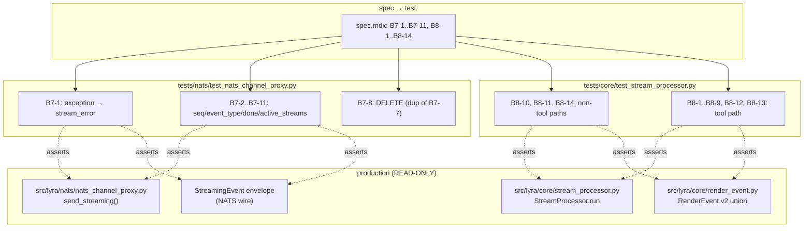
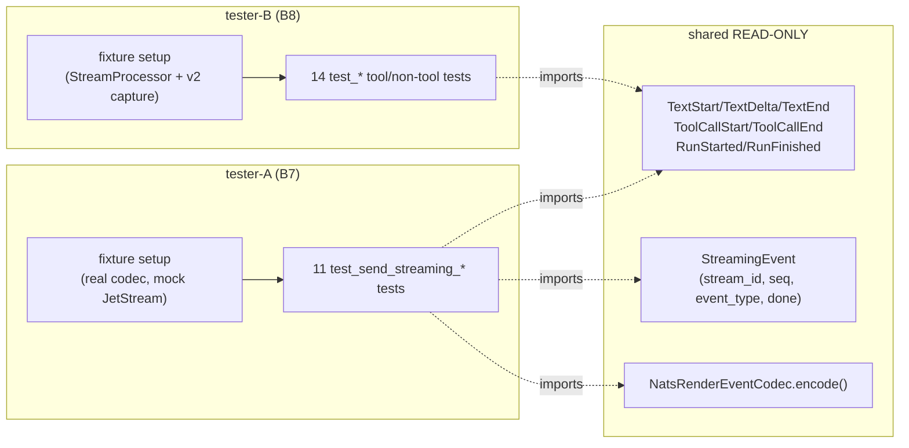

## Summary

Port 25 v1-skipped tests to v2 wire format across two test files. Two test agents work in parallel — `tester-A` owns `tests/nats/test_nats_channel_proxy.py` (B7, 11 tests), `tester-B` owns `tests/core/test_stream_processor.py` (B8, 14 tests). Slice 1 (B7-1, the security-auditor-flagged recovery path) ships first as a single-task wave for early demo; Slices 2–4 run in parallel across the two agents; Slice 5 is cleanup. No production code changes.

## Architecture

### Data Flow (test rewrite topology)



### File × Function map



## Agents

| Agent | Instance | Files | Task count |
|---|---|---|---|
| tester | tester-A | `tests/nats/test_nats_channel_proxy.py` | 10 |
| tester | tester-B | `tests/core/test_stream_processor.py` | 12 |
| devops | devops-A | repo-root (already done in Step 0: `gh issue create` for #1216) | 0 (out-of-band) |

No backend-dev / frontend-dev / architect / security-auditor / doc-writer. Production code is read-only.

## Wave Structure

4 waves, max 2 parallel agents. Estimated elapsed ~3 hours vs ~6 hours sequential.

| Wave | Trigger | Agents | Tasks |
|------|---------|--------|-------|
| 1 | start | 1 (tester-A solo) | tester-A: T1 → T2 (Slice 1: P0 recovery path, ship-able alone) |
| 2 | Wave 1 done | 2 ∥ | tester-A: T3→T4→T5→T6→T7→T8→T9→T10→T11 (Slice 2) · tester-B: T12→T13→T14→T15 (Slice 3) |
| 3 | Wave 2 done | 1 (tester-B continues) | tester-B: T16→T17→T18→T19→T20→T21→T22→T23 (Slice 4) |
| 4 | Wave 3 done | 1 | tester-B: T24 (Slice 5 cleanup) → T25 (final RED-GATE) |

Wave 1 is solo on tester-A so Slice 1 lands first — early commit for security-auditor visibility. Wave 2 begins tester-B in parallel once Wave 1 is green; both agents stay isolated (different files, no shared fixtures) — `isolation: "worktree"` required per the parallel-fixers memory.

### Budget

| Task | Items | Class | Est. ops | Split? |
|------|-------|-------|----------|--------|
| T1: rewrite B7-1 with v2 RenderEvent | 1 test | judgmental | 6 | — |
| T2: RED-GATE B7-1 pytest + Any-stub check | 1 gate | bounded | 3 | — |
| T3–T9: rewrite B7-2..B7-11 (7 grouped tasks for 9 rewrites + 1 delete) | 10 tests | bounded | 28 | — |
| T10: remove B7 Any-stub typing | 1 refactor | bounded | 3 | — |
| T11: RED-GATE B7 full pytest + pyright | 1 gate | bounded | 3 | — |
| T12–T14: rewrite B8 non-tool (3 tasks for 2 rewrites + 1 delete) | 3 tests | bounded | 9 | — |
| T15: RED-GATE B8 non-tool pytest | 1 gate | bounded | 3 | — |
| T16–T22: rewrite B8 tool-path (7 grouped tasks for 11 rewrites) | 11 tests | judgmental | 44 | — |
| T23: RED-GATE B8 tool-path pytest | 1 gate | bounded | 3 | — |
| T24: cleanup pyright suppressions both files | 1 refactor | bounded | 3 | — |
| T25: Final RED-GATE — both files pytest + pyright + skip-count | 1 gate | bounded | 4 | — |

**Total estimated ops: ~109** (≈54 per agent across 2 parallel agents). No single task exceeds 50 ops → no split required.

## Consistency Report

| Metric | Value |
|---|---|
| Acceptance criteria in spec | 8 |
| Criteria covered by tasks | 8 |
| Untraced criteria | 0 |
| Slices in spec | 5 |
| Slices covered | 5 (V1→T1-T2, V2→T3-T11, V3→T12-T15, V4→T16-T23, V5→T24-T25) |
| Spec inventory tests (B7+B8) | 25 |
| Tests addressed in tasks | 25 (24 rewrites + 1 delete B7-8 + 1 delete B8-14, with B8-14 being one of the 14 = 23 rewrites + 2 deletes total) |
| Exemptions | 0 |

Bidirectional consistency: every B7-N / B8-N ID in the spec inventory appears in exactly one micro-task; every micro-task cites at least one spec ID via `Spec trace`.

## Micro-Tasks

### Slice V1 — Recovery path (P0)

#### T1 [GREEN] [tester-A] — Rewrite B7-1 `test_send_streaming_exception_publishes_stream_error`

- **File:** `tests/nats/test_nats_channel_proxy.py:588`
- **Code shape:**

  ```python
  async def test_send_streaming_exception_publishes_stream_error() -> None:
      """Mid-stream exception → terminal stream_error envelope published."""
      proxy = NatsChannelProxy(jetstream=mock_js, ...)
      # First chunk is a REAL v2 event so encode() succeeds; second raises.
      async def source() -> AsyncIterator[RenderEvent]:
          yield TextDelta(message_id="m1", delta="hi")
          raise RuntimeError("simulated mid-stream failure")
      with pytest.raises(RuntimeError):
          await proxy.send_streaming(stream_id="s1", events=source())
      # Assert: a stream_error StreamingEvent was published on the outbound subject
      published = [c.args for c in mock_js.publish.call_args_list]
      assert any(env["event_type"] == "stream_error" for env in decoded(published))
      assert any(env["done"] is True for env in decoded(published))
  ```
- **Verify:** `uv run pytest tests/nats/test_nats_channel_proxy.py::test_send_streaming_exception_publishes_stream_error -v`
- **Expected:** `1 passed`
- **Guard (from architect review):** must use `TextDelta` (or any live v2 RenderEvent) for the pre-exception yield. Must NOT use the module-level `TextRenderEvent = type(...)` `Any`-stub. If the rewrite is tempted to keep the stub for "minimum change", reject — the exception would fire on the first `_codec.encode()` and the drain path would never run (false-pass).
- **Spec trace:** B7-1, SC1
- **Slice:** V1
- **Phase:** GREEN
- **Difficulty:** 3
- **Time:** 8 min

#### T2 [RED-GATE] [tester-A] — Verify B7-1 alone passes + Any-stub guard

- **Verify:**

  ```bash
  uv run pytest tests/nats/test_nats_channel_proxy.py::test_send_streaming_exception_publishes_stream_error -v &&
  ! grep -q 'TextRenderEvent\s*=\s*type' tests/nats/test_nats_channel_proxy.py:166-650 2>/dev/null
  ```
  (Use a python one-liner if line-range grep is awkward — the goal is "no `TextRenderEvent = type(...)` stub references survive within the B7-1 function body".)
- **Expected:** test passes; no Any-stub reference in/around B7-1.
- **Spec trace:** SC1
- **Phase:** RED-GATE
- **Difficulty:** 2
- **Time:** 3 min

### Slice V2 — NATS proxy completion (B7-2..B7-11)

#### T3 [GREEN] [tester-A] — Rewrite B7-2 (seq) + B7-9 (chunk shape)

- **Tests:** `test_send_streaming_publishes_chunks_with_incrementing_seq` (line 166), `test_send_streaming_chunk_has_stream_id_no_type` (line 278)
- **Pattern:** Feed 3 `TextDelta` events into `send_streaming()`; capture `mock_js.publish` calls; decode envelopes; assert seq ∈ {0, 1, 2} monotone for B7-2, and envelopes carry `stream_id` + no legacy `type` field for B7-9.
- **Verify:** `uv run pytest tests/nats/test_nats_channel_proxy.py::test_send_streaming_publishes_chunks_with_incrementing_seq tests/nats/test_nats_channel_proxy.py::test_send_streaming_chunk_has_stream_id_no_type -v`
- **Expected:** `2 passed`
- **Spec trace:** B7-2, B7-9, SC2
- **Phase:** GREEN
- **Difficulty:** 3
- **Time:** 6 min

#### T4 [GREEN] [tester-A] — Rewrite B7-3 + B7-4 (done flag terminal / non-terminal)

- **Tests:** `test_send_streaming_done_true_on_final_text_event` (line 207), `test_send_streaming_done_false_on_non_final_event` (line 224)
- **Pattern:** stream of `[TextDelta, TextDelta, TextEnd]`; assert envelopes for first two have `done=False`, terminal has `done=True`.
- **Verify:** `uv run pytest tests/nats/test_nats_channel_proxy.py::test_send_streaming_done_true_on_final_text_event tests/nats/test_nats_channel_proxy.py::test_send_streaming_done_false_on_non_final_event -v`
- **Expected:** `2 passed`
- **Spec trace:** B7-3, B7-4, SC2
- **Phase:** GREEN
- **Difficulty:** 3
- **Time:** 6 min

#### T5 [GREEN] [tester-A] — Rewrite B7-5 + B7-6 (event_type text / tool_summary)

- **Tests:** `test_send_streaming_event_type_text` (line 242), `test_send_streaming_event_type_tool_summary` (line 259)
- **Pattern:** feed `TextDelta` → assert `event_type="text"`; feed `ToolCallStart`+`ToolCallEnd` → assert `event_type="tool_summary"` (or whatever the production codec emits — read `NatsRenderEventCodec` to confirm).
- **Verify:** `uv run pytest tests/nats/test_nats_channel_proxy.py::test_send_streaming_event_type_text tests/nats/test_nats_channel_proxy.py::test_send_streaming_event_type_tool_summary -v`
- **Expected:** `2 passed`
- **Spec trace:** B7-5, B7-6, SC2
- **Phase:** GREEN
- **Difficulty:** 3
- **Time:** 6 min

#### T6 [GREEN] [tester-A] — Rewrite B7-7 (single outbound subject)

- **Test:** `test_send_streaming_subject_is_single_outbound_subject` (line 190)
- **Pattern:** assert all `mock_js.publish` calls used the same subject = `lyra.outbound.<platform>.<bot_id>`.
- **Verify:** `uv run pytest tests/nats/test_nats_channel_proxy.py::test_send_streaming_subject_is_single_outbound_subject -v`
- **Expected:** `1 passed`
- **Spec trace:** B7-7, SC2
- **Phase:** GREEN
- **Difficulty:** 2
- **Time:** 3 min

#### T7 [REFACTOR] [tester-A] — Delete B7-8 (duplicate of B7-7)

- **Test:** `test_send_streaming_uses_single_subject` (line 473)
- **Action:** delete the test function entirely. Replace with a single-line `# B7-8: duplicate of test_send_streaming_subject_is_single_outbound_subject (B7-7); removed per spec #1211.`
- **Verify:** `! grep -q 'def test_send_streaming_uses_single_subject' tests/nats/test_nats_channel_proxy.py`
- **Expected:** no match (exit 0).
- **Spec trace:** B7-8, SC2
- **Phase:** REFACTOR
- **Difficulty:** 1
- **Time:** 2 min

#### T8 [GREEN] [tester-A] — Rewrite B7-10 (drain iterator on publish failure)

- **Test:** `test_send_streaming_drains_iterator_on_publish_failure` (line 298)
- **Pattern:** mock `mock_js.publish` to raise on first call; source iterator yields 3 events; after `send_streaming()` propagates the error, verify source iterator was fully drained (no remaining items).
- **Verify:** `uv run pytest tests/nats/test_nats_channel_proxy.py::test_send_streaming_drains_iterator_on_publish_failure -v`
- **Expected:** `1 passed`
- **Spec trace:** B7-10, SC2
- **Phase:** GREEN
- **Difficulty:** 4
- **Time:** 7 min

#### T9 [GREEN] [tester-A] — Rewrite B7-11 (active_streams tracked)

- **Test:** `test_active_streams_tracked_during_streaming` (line 513)
- **Pattern:** during emission, assert `proxy._active_streams` contains `stream_id`; after completion, assert it does not.
- **Verify:** `uv run pytest tests/nats/test_nats_channel_proxy.py::test_active_streams_tracked_during_streaming -v`
- **Expected:** `1 passed`
- **Spec trace:** B7-11, SC2
- **Phase:** GREEN
- **Difficulty:** 4
- **Time:** 7 min

#### T10 [REFACTOR] [tester-A] — Remove B7 Any-stub typing + workaround comments

- **Action:** delete the `TextRenderEvent = type("TextRenderEvent", (), {})` (or equivalent) module-level stub (~line 30) and the `# Typed as Any so pyright doesn't flag v1-shape access` comment.
- **Verify:**

  ```bash
  ! grep -E "TextRenderEvent\s*=\s*type|Typed as Any so pyright" tests/nats/test_nats_channel_proxy.py
  ```
- **Expected:** no matches.
- **Spec trace:** SC5, SC6
- **Phase:** REFACTOR
- **Difficulty:** 1
- **Time:** 3 min

#### T11 [RED-GATE] [tester-A] — B7 full file passes pytest + pyright clean

- **Verify:**

  ```bash
  uv run pytest tests/nats/test_nats_channel_proxy.py -v &&
  uv run pyright tests/nats/test_nats_channel_proxy.py
  ```
- **Expected:** all tests pass (none skipped with reason `v1 removed`); pyright reports 0 errors.
- **Spec trace:** SC2, SC5, SC7, SC8
- **Phase:** RED-GATE
- **Difficulty:** 2
- **Time:** 3 min

### Slice V3 — StreamProcessor non-tool paths

#### T12 [GREEN] [tester-B] — Rewrite B8-10 (is_error propagated to TextEnd)

- **Test:** `test_is_error_propagated_to_text_render_event` (~line 728)
- **Pattern:** feed input stream where final result has `is_error=True`; capture v2 emissions; assert the terminal `TextEnd` event carries `is_error=True`.
- **Verify:** `uv run pytest "tests/core/test_stream_processor.py::test_is_error_propagated_to_text_render_event" -v`
- **Expected:** `1 passed`
- **Spec trace:** B8-10, SC3
- **Phase:** GREEN
- **Difficulty:** 3
- **Time:** 6 min

#### T13 [GREEN] [tester-B] — Rewrite B8-11 (empty stream → no RenderEvents)

- **Test:** `test_empty_stream` (~line 814)
- **Pattern:** empty input iterator → assert no `RenderEvent` is emitted (or only `RunStarted` + `RunFinished` envelope if that is the v2 contract — read `StreamProcessor.run` to confirm the empty-stream invariant before asserting).
- **Verify:** `uv run pytest "tests/core/test_stream_processor.py::test_empty_stream" -v`
- **Expected:** `1 passed`
- **Spec trace:** B8-11, SC3
- **Phase:** GREEN
- **Difficulty:** 3
- **Time:** 6 min

#### T14 [REFACTOR] [tester-B] — Delete B8-14 (`test_dual_emit_v1_and_v2_both_present`)

- **Test:** `test_dual_emit_v1_and_v2_both_present` (~line 1030)
- **Action:** delete the test function entirely. Replace with a single-line `# B8-14: v1 removed in #1192 S3; "dual-emit" premise invalid post-cutover. Removed per spec #1211.`
- **Verify:** `! grep -q 'def test_dual_emit_v1_and_v2_both_present' tests/core/test_stream_processor.py`
- **Expected:** no match.
- **Spec trace:** B8-14, SC3
- **Phase:** REFACTOR
- **Difficulty:** 1
- **Time:** 2 min

#### T15 [RED-GATE] [tester-B] — B8 non-tool tests pass

- **Verify:**

  ```bash
  uv run pytest tests/core/test_stream_processor.py -k "is_error_propagated or empty_stream" -v
  ```
- **Expected:** `2 passed`
- **Spec trace:** SC3
- **Phase:** RED-GATE
- **Difficulty:** 1
- **Time:** 2 min

### Slice V4 — StreamProcessor tool path

#### T16 [GREEN] [tester-B] — B8-1 + B8-2 (single edit + write tool tracked)

- **Tests:** `test_single_edit` (~line 215), `test_write_tool_tracked` (~line 249)
- **Pattern:** simulate one `Edit` tool call → assert v2 triplet emitted: `ToolCallStart` → `ToolCallEnd` (with `is_error=False`). Same shape for `Write`.
- **Verify:** `uv run pytest "tests/core/test_stream_processor.py" -k "single_edit or write_tool_tracked" -v`
- **Expected:** `2 passed`
- **Spec trace:** B8-1, B8-2, SC3
- **Phase:** GREEN
- **Difficulty:** 3
- **Time:** 8 min

#### T17 [GREEN] [tester-B] — B8-3 + B8-4 (5 edits threshold + 6 edits count mode)

- **Tests:** `test_five_edits_at_threshold` (~line 275), `test_six_edits_count_mode` (~line 308)
- **Pattern:** feed 5 / 6 `Edit` tool calls; assert v2 emissions match the file-group threshold then count-mode rendering specified in `StreamProcessor`.
- **Verify:** `uv run pytest "tests/core/test_stream_processor.py" -k "five_edits_at_threshold or six_edits_count_mode" -v`
- **Expected:** `2 passed`
- **Spec trace:** B8-3, B8-4, SC3
- **Phase:** GREEN
- **Difficulty:** 4
- **Time:** 10 min

#### T18 [GREEN] [tester-B] — B8-5 (bash truncation)

- **Test:** `test_bash_truncation` (~line 433)
- **Pattern:** Bash tool with large output; assert truncation applied in the `ToolCallEnd.tool_args` summary.
- **Verify:** `uv run pytest "tests/core/test_stream_processor.py::TestToolPath::test_bash_truncation" -v`
- **Expected:** `1 passed`
- **Spec trace:** B8-5, SC3
- **Phase:** GREEN
- **Difficulty:** 3
- **Time:** 6 min

#### T19 [GREEN] [tester-B] — B8-6 (silent read/grep/glob)

- **Test:** `test_silent_read_grep_glob` (~line 461)
- **Pattern:** Read/Grep/Glob tool calls produce no `ToolCallStart`/`ToolCallEnd` emissions (or only orphan-end synthesis).
- **Verify:** `uv run pytest "tests/core/test_stream_processor.py::TestToolPath::test_silent_read_grep_glob" -v`
- **Expected:** `1 passed`
- **Spec trace:** B8-6, SC3
- **Phase:** GREEN
- **Difficulty:** 3
- **Time:** 6 min

#### T20 [GREEN] [tester-B] — B8-7 (web_fetch visible)

- **Test:** `test_web_fetch_visible` (~line 494)
- **Pattern:** WebFetch tool emits `ToolCallStart`/`ToolCallEnd`.
- **Verify:** `uv run pytest "tests/core/test_stream_processor.py::TestToolPath::test_web_fetch_visible" -v`
- **Expected:** `1 passed`
- **Spec trace:** B8-7, SC3
- **Phase:** GREEN
- **Difficulty:** 2
- **Time:** 5 min

#### T21 [GREEN] [tester-B] — B8-8 + B8-9 (throttle bypass + suppression)

- **Tests:** `test_result_bypasses_throttle` (~line 594), `test_throttle_suppression` (~line 627)
- **Pattern:** rapid-fire emissions within throttle window — assert in-window deltas suppressed (B8-9), but result events bypass throttle (B8-8).
- **Verify:** `uv run pytest "tests/core/test_stream_processor.py" -k "result_bypasses_throttle or throttle_suppression" -v`
- **Expected:** `2 passed`
- **Spec trace:** B8-8, B8-9, SC3
- **Phase:** GREEN
- **Difficulty:** 4
- **Time:** 10 min

#### T22 [GREEN] [tester-B] — B8-12 + B8-13 (emission order text / with tool)

- **Tests:** `test_emission_order_text_only` (~line 874), `test_emission_order_with_tool` (~line 891)
- **Pattern:** capture full event stream; assert exact ordered list of RenderEvent class names matches the v2 contract (e.g. `[RunStarted, TextStart, TextDelta, TextEnd, RunFinished]`).
- **Verify:** `uv run pytest "tests/core/test_stream_processor.py" -k "emission_order_text_only or emission_order_with_tool" -v`
- **Expected:** `2 passed`
- **Spec trace:** B8-12, B8-13, SC3
- **Phase:** GREEN
- **Difficulty:** 4
- **Time:** 10 min

#### T23 [RED-GATE] [tester-B] — B8 tool-path tests pass

- **Verify:**

  ```bash
  uv run pytest tests/core/test_stream_processor.py -k "single_edit or write_tool_tracked or five_edits or six_edits or bash_truncation or silent_read or web_fetch_visible or result_bypasses or throttle_suppression or emission_order" -v
  ```
- **Expected:** `11 passed` (the 11 active B8 tool-path tests).
- **Spec trace:** SC3
- **Phase:** RED-GATE
- **Difficulty:** 1
- **Time:** 2 min

### Slice V5 — Cleanup + final gate

#### T24 [REFACTOR] [tester-B] — Remove pyright suppressions + Any-stub workaround comments

- **Files:** both test files.
- **Action:** delete module-level `# pyright: reportAttributeAccessIssue=false, reportInvalidTypeForm=false` (line 3 of `test_stream_processor.py`); delete any surviving `# Typed as Any so pyright doesn't flag v1-shape access` comment (line 1717 of `test_stream_processor.py`, line 30 of `test_nats_channel_proxy.py` if not yet removed by T10).
- **Verify:**

  ```bash
  ! grep -E "^# pyright: report(AttributeAccessIssue|InvalidTypeForm)=false" tests/nats/test_nats_channel_proxy.py tests/core/test_stream_processor.py &&
  ! grep -n "Typed as Any so pyright" tests/nats/test_nats_channel_proxy.py tests/core/test_stream_processor.py
  ```
- **Expected:** no matches.
- **Spec trace:** SC5, SC6
- **Phase:** REFACTOR
- **Difficulty:** 1
- **Time:** 3 min

#### T25 [RED-GATE] [tester-B] — Final integration gate

- **Verify:**

  ```bash
  uv run pytest tests/nats/test_nats_channel_proxy.py tests/core/test_stream_processor.py &&
  uv run pyright tests/nats/test_nats_channel_proxy.py tests/core/test_stream_processor.py &&
  # In-scope tests should no longer be skipped (out-of-scope #1216 skips may remain in stream_processor)
  ! grep -c "@pytest.mark.skip.*v1 removed.*#1192" tests/nats/test_nats_channel_proxy.py | grep -q "^0$" || true &&
  test "$(grep -c '@pytest.mark.skip.*v1 removed.*#1192' tests/nats/test_nats_channel_proxy.py)" = "0"
  ```
  (Verify command for tester-B at execution time: simpler form — assert B7 file has 0 v1-skips; B8 file has ≤ 16 v1-skips, all in #1216 scope.)
- **Expected:** all assertions pass; B7 file zero skips, B8 file ≤16.
- **Spec trace:** SC4, SC7, SC8
- **Phase:** RED-GATE
- **Difficulty:** 2
- **Time:** 4 min

## Task Seeding Blueprint

<!-- Used by /implement to seed TaskCreate calls on session start.
     Format: T{n} | agent-instance | blockedBy | subject -->

### Wave 1 — no deps, 1 agent

| Task | Agent instance | blockedBy | Subject |
|------|----------------|-----------|---------|
| T1 | tester-A | — | Rewrite B7-1 exception → stream_error with real v2 RenderEvent |
| T2 | tester-A | T1 | RED-GATE: B7-1 passes + no Any-stub in test body |

### Wave 2 — after Wave 1, 2 agents ∥

| Task | Agent instance | blockedBy | Subject |
|------|----------------|-----------|---------|
| T3 | tester-A | T2 | Rewrite B7-2 (seq) + B7-9 (chunk shape) |
| T4 | tester-A | T3 | Rewrite B7-3 + B7-4 (done flag terminal/non-terminal) |
| T5 | tester-A | T4 | Rewrite B7-5 + B7-6 (event_type text/tool_summary) |
| T6 | tester-A | T5 | Rewrite B7-7 (single outbound subject) |
| T7 | tester-A | T6 | Delete B7-8 (duplicate of B7-7) |
| T8 | tester-A | T7 | Rewrite B7-10 (drain iterator on publish failure) |
| T9 | tester-A | T8 | Rewrite B7-11 (active_streams tracking) |
| T10 | tester-A | T9 | Remove B7 Any-stub typing + workaround comments |
| T11 | tester-A | T10 | RED-GATE: full B7 file pytest + pyright |
| T12 | tester-B | T2 | Rewrite B8-10 (is_error propagated to TextEnd) |
| T13 | tester-B | T12 | Rewrite B8-11 (empty stream → no RenderEvents) |
| T14 | tester-B | T13 | Delete B8-14 (dual-emit v1+v2 premise invalid) |
| T15 | tester-B | T14 | RED-GATE: B8 non-tool tests pass |

### Wave 3 — after Wave 2 tester-B done, 1 agent

| Task | Agent instance | blockedBy | Subject |
|------|----------------|-----------|---------|
| T16 | tester-B | T15 | Rewrite B8-1 + B8-2 (single edit, write tool tracked) |
| T17 | tester-B | T16 | Rewrite B8-3 + B8-4 (5 edits threshold, 6 edits count mode) |
| T18 | tester-B | T17 | Rewrite B8-5 (bash truncation) |
| T19 | tester-B | T18 | Rewrite B8-6 (silent read/grep/glob) |
| T20 | tester-B | T19 | Rewrite B8-7 (web_fetch visible) |
| T21 | tester-B | T20 | Rewrite B8-8 + B8-9 (throttle bypass + suppression) |
| T22 | tester-B | T21 | Rewrite B8-12 + B8-13 (emission order text + tool) |
| T23 | tester-B | T22 | RED-GATE: B8 tool-path tests pass |

### Wave 4 — after Wave 3, 1 agent

| Task | Agent instance | blockedBy | Subject |
|------|----------------|-----------|---------|
| T24 | tester-B | T23, T11 | Remove pyright suppressions + Any-stub workaround comments both files |
| T25 | tester-B | T24 | Final RED-GATE: pytest + pyright clean both files; skip-count baseline restored |

## Task IDs

<!-- Generated by /plan. Used by /implement to resume tasks on session restart. -->
- T1: 12 — Rewrite B7-1 exception → stream_error with real v2 RenderEvent
- T2: 13 — RED-GATE B7-1 passes + no Any-stub in test body
- T3: 14 — Rewrite B7-2 (seq) + B7-9 (chunk shape)
- T4: 15 — Rewrite B7-3 + B7-4 (done flag terminal/non-terminal)
- T5: 16 — Rewrite B7-5 + B7-6 (event_type text/tool_summary)
- T6: 17 — Rewrite B7-7 (single outbound subject)
- T7: 18 — Delete B7-8 (duplicate of B7-7) with rationale comment
- T8: 19 — Rewrite B7-10 (drain iterator on publish failure)
- T9: 20 — Rewrite B7-11 (active_streams tracking)
- T10: 21 — Remove B7 Any-stub typing + workaround comments
- T11: 22 — RED-GATE B7 full file pytest + pyright clean
- T12: 23 — Rewrite B8-10 (is_error propagated to TextEnd)
- T13: 24 — Rewrite B8-11 (empty stream → no RenderEvents)
- T14: 25 — Delete B8-14 (dual-emit v1+v2 premise invalid)
- T15: 26 — RED-GATE B8 non-tool tests pass
- T16: 27 — Rewrite B8-1 + B8-2 (single edit, write tool tracked)
- T17: 28 — Rewrite B8-3 + B8-4 (5 edits threshold, 6 edits count mode)
- T18: 29 — Rewrite B8-5 (bash truncation)
- T19: 30 — Rewrite B8-6 (silent read/grep/glob)
- T20: 31 — Rewrite B8-7 (web_fetch visible)
- T21: 32 — Rewrite B8-8 + B8-9 (throttle bypass + suppression)
- T22: 33 — Rewrite B8-12 + B8-13 (emission order text + tool)
- T23: 34 — RED-GATE B8 tool-path tests pass
- T24: 35 — Remove pyright suppressions + Any-stub workaround comments (both files)
- T25: 36 — Final RED-GATE pytest + pyright + skip-count both files
