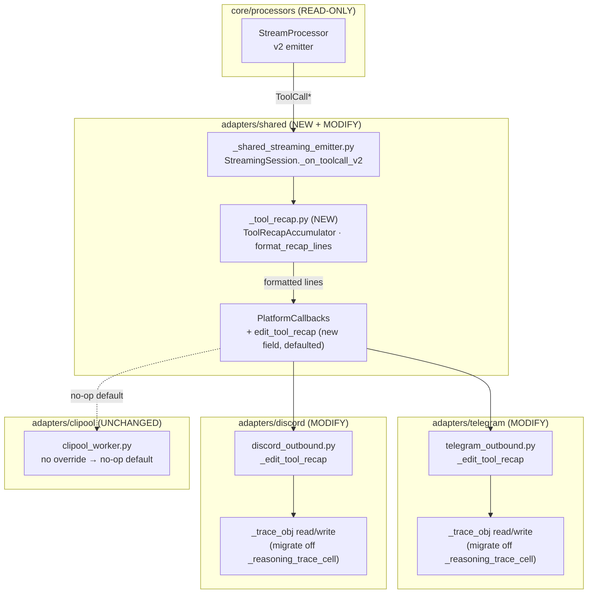
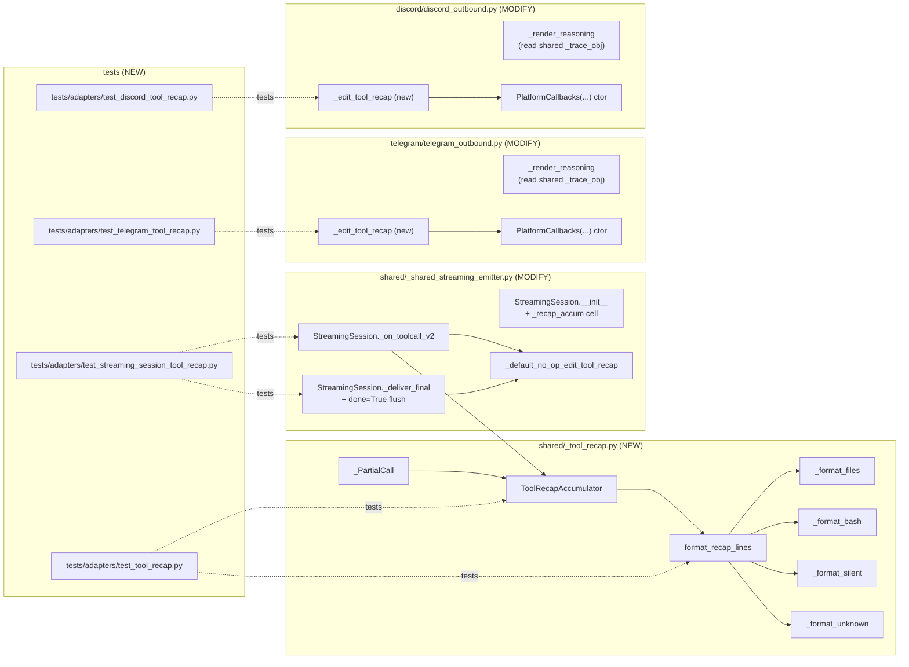

## Summary

Four-slice F-lite delivery. SL1 ships a pure, framework-free
`ToolRecapAccumulator` + `format_recap_lines` (the rebuild of the deleted
v1 `tool_recap_format.py`, including the lost #1209 unknown-tool feature).
SL2 wires `_on_toolcall_v2` to a defaulted `PlatformCallbacks.edit_tool_recap`
callback on `StreamingSession`. SL3 + SL4 light up Telegram and Discord
rendering in parallel (symmetric work, separate files). Total: 1 new
production module + 4 new test files + targeted edits to 3 existing
adapter files; no NATS / contract / schema changes.

## Architecture

### Data Flow



### File × Function Map



## Bootstrap Context

- Source spec: `artifacts/specs/1214-tool-recap-card-v2-spec.mdx` (approved
  2026-05-15, 11 binary SCs, 0 χ).
- Reference (deleted, recoverable from git): `tool_recap_format.py` at
  commit `e4d0a241^` — line-by-line template for `_format_files` /
  `_format_bash` / `_format_silent`; unknown-tool variant from commit
  `13a49d92`.
- Reference (legacy classifier): `stream_processor.py:480-534` —
  authoritative tool-name → bucket mapping (`edit`/`write` → files;
  `bash` → commands; `read`/`grep`/`glob` → silent counts; `web_fetch`
  vs `web_search` → separate buckets; `agent` → agent_calls; everything
  else → unknown_calls).
- DEBT #1102 status: children #1192 + #1191 both closed; #1102 itself
  still open but its acceptance criteria are met by the prior merges.
  This issue is *follow-up* to the v2 cutover. T10 will close #1102
  explicitly via `gh issue close 1102 --comment` since its acceptance
  is satisfied — the comment cites #1192/#1191 closure + #1214 as the
  follow-up that landed the missing user-facing piece.
- Discord embed parity: the deleted `_build_tool_embed` (in
  `discord_outbound.py` at `e4d0a241^:165-172`) used a `discord.Embed`
  with `title=header`, `description="\n".join(lines)`,
  `color=green if done else blue`. SL4 (T9) preserves this shape — the
  `_edit_tool_recap` callback splits `lines[0]` (header) into
  `embed.title` and the rest into `embed.description`. No new public
  helper needed.

## Agents

| Agent instance | Role | Slice ownership | File targets |
|----------------|------|-----------------|--------------|
| backend-dev-A | Production code (shared + telegram) | SL1, SL2, SL3 | `_tool_recap.py`, `_shared_streaming_emitter.py`, `telegram_outbound.py` |
| backend-dev-B | Production code (discord) | SL4 | `discord_outbound.py` |
| tester-A | Tests for shared + telegram | SL1, SL2, SL3 | `test_tool_recap.py`, `test_streaming_session_tool_recap.py`, `test_telegram_tool_recap.py` |
| tester-B | Tests for discord | SL4 | `test_discord_tool_recap.py` |

Rationale: 2 agents per domain in SL3/SL4 wave; backend-dev-A serializes
SL1→SL2→SL3 (shared streaming state + Telegram code share context). No
doc-writer needed — CHANGELOG bullet folded into backend-dev-B's SL4
work (single-line entry).

## Wave Structure

4 waves, max 4 parallel agents. Elapsed ~3 sessions vs ~6 sequential.

| Wave | Trigger | Agents | Tasks |
|------|---------|--------|-------|
| 1 | start | 1 ∥ (tester-A starts RED only) | tester-A: T1→T2 (write failing accumulator tests) |
| 2 | Wave 1 done | 1 ∥ | backend-dev-A: T3 (implement aggregator → green) |
| 3 | Wave 2 done | 2 ∥ | backend-dev-A: T4→T5→T5b (emitter + telegram + cell audit), tester-A: T6→T7→T8 (session + telegram tests RED then GREEN) |
| 4 | Wave 3 done | 2 ∥ | backend-dev-B: T9→T9b→T10 (discord + cell audit + changelog), tester-B: T11 (discord tests) |

### Budget

| Task | Items | Class | Est. ops | Split? |
|------|-------|-------|----------|--------|
| T1 RED tests for accumulator (9 SC slices × 1-2 ops) | 9 | bounded | 18 | — |
| T2 RED test for unknown-tool variant | 1 | bounded | 2 | — |
| T3 Implement accumulator + formatter | 1 | judgmental | 5 | — |
| T4 Wire `_on_toolcall_v2` + defaulted callback | 1 | judgmental | 4 | — |
| T5 Telegram `_edit_tool_recap` + ctor wiring | 1 | judgmental | 5 | — |
| T5b Telegram closure-cell migration audit (grep + replace) | 1 | bounded | 3 | — |
| T6 RED test for session callback wiring | 1 | bounded | 3 | — |
| T7 RED test for Telegram rendering | 1 | bounded | 3 | — |
| T8 GREEN regression test: text-only turn ⇒ no trace placeholder (Telegram) | 1 | bounded | 2 | — |
| T9 Discord `_edit_tool_recap` (embed parity) + ctor wiring | 1 | judgmental | 6 | — |
| T9b Discord closure-cell migration audit (grep + replace) | 1 | bounded | 3 | — |
| T10 CHANGELOG bullet + v1-symbol grep fixture + close #1102 | 3 | trivial | 4 | — |
| T11 RED test for Discord rendering + text-only regression | 1 | bounded | 3 | — |

**Total estimated ops: 62** — within budget; no force-splits.

## Consistency Report

| Metric | Value |
|--------|-------|
| Spec criteria covered | 11/11 |
| Untraced tasks | 0 |
| Exemptions | 0 |

Mapping:

| SC | Task | Slice |
|----|------|-------|
| SC1 (accumulator consumes synthetic stream) | T1, T3 | SL1 |
| SC2 (unknown tools `🔧 N toolname` sorted) | T2, T3 | SL1 |
| SC3 (empty accum → `[]`) | T1, T3 | SL1 |
| SC4 (callback ≥1 × streaming + 1 × done=True + ungraceful end) | T6, T4 | SL2 |
| SC5 (defaulted dataclass field) | T6, T4 | SL2 |
| SC6 (is_error counted identically) | T1, T3 | SL1 |
| SC7 (Telegram renders card) | T7, T5 | SL3 |
| SC8 (Discord renders card) | T11, T9 | SL4 |
| SC9 (text-only turn ⇒ no trace placeholder) | T8, T11 | SL3+SL4 |
| SC10 (no v1-symbol imports) | T10 | SL4 |
| SC11 (DEBT #1102 referenced + closed post-merge) | T10 (CHANGELOG mention + queued `gh issue close 1102`) | SL4 |

## Micro-Tasks

### Slice 1 — Pure aggregator + formatter

#### T1 — RED: accumulator + formatter unit tests [P]

- **Description:** Write failing tests for `ToolRecapAccumulator` against
  a synthetic stream of `ToolCall{Start,Args,End}RenderEvent` covering
  every tool family (`edit`, `write`, `bash`, `read`, `grep`, `glob`,
  `web_fetch`, `web_search`, `agent`) plus the empty-accum case + the
  `is_error=True` parity case. Assert `format_recap_lines` output in the
  canonical 8-step order from spec §"Canonical line order".
- **File:** `tests/adapters/test_tool_recap.py` (new)
- **Skeleton:**
  ```python
  def test_format_lines_files_bash_web_silent_canonical_order(): ...
  def test_format_lines_unknown_tool_sorted_alpha(): ...
  def test_format_lines_empty_accum_returns_empty_list(): ...
  def test_format_lines_is_error_result_counted_identically(): ...
  def test_files_collapse_threshold_three(): ...
  def test_bash_collapse_threshold_three(): ...
  def test_silent_counts_omitted_when_all_zero(): ...
  def test_web_fetch_and_web_search_in_separate_sections(): ...
  def test_done_true_emits_done_header_else_working(): ...
  ```
- **Verify:** `uv run pytest tests/adapters/test_tool_recap.py -x`
- **Expected:** `ImportError: cannot import name 'ToolRecapAccumulator'` (RED — module not yet created)
- **Time:** 25 min · **Difficulty:** 3 · **Agent:** tester-A
- **Phase:** RED · **Slice:** V1 · **Spec trace:** SC1, SC3, SC6

#### T2 — RED: unknown-tool variant [P]

- **Description:** Add a focused test for the lost-#1209 feature: a turn
  with 3 `todowrite` calls + 1 `ls` call + 0 known calls produces lines
  `["🔧 Done ✅", "🔧 1 ls", "🔧 3 todowrite"]` (alphabetical).
- **File:** `tests/adapters/test_tool_recap.py` (extend T1's file)
- **Verify:** `uv run pytest tests/adapters/test_tool_recap.py -k unknown -x`
- **Expected:** Test fails (RED) until T3 lands.
- **Time:** 5 min · **Difficulty:** 2 · **Agent:** tester-A
- **Phase:** RED · **Slice:** V1 · **Spec trace:** SC2

#### T3 — GREEN: implement `ToolRecapAccumulator` + `format_recap_lines`

- **Description:** Implement the module per spec §"Data Model" +
  §"Canonical line order". Reuse `FileEditSummary` + `SilentCounts` from
  `render_events.py`; store raw `int` counters internally and build the
  frozen `SilentCounts` only inside `format_recap_lines` (per architect
  review). Accumulate `_PartialCall(tool_name, args_buffer)` per
  `tool_call_id`; on `observe_end`, parse the accumulated args JSON
  (tolerant: `json.loads` failure → bucket the tool by name only, no
  arg-derived data → still counted) and route to the right bucket.
  Categorisation table follows `stream_processor._accumulate`
  (`stream_processor.py:506-534`). Implement helper formatters mirroring
  the recovered v1 file `tool_recap_format.py` (see Bootstrap Context).
- **File:** `src/lyra/adapters/shared/_tool_recap.py` (new, ~150 LOC)
- **Skeleton:**
  ```python
  from dataclasses import dataclass, field
  from lyra.core.messaging.render_events import (
      FileEditSummary, SilentCounts,
      ToolCallStartRenderEvent, ToolCallArgsRenderEvent,
      ToolCallEndRenderEvent,
  )

  @dataclass
  class _PartialCall:
      tool_name: str
      args_buffer: str = ""

  @dataclass
  class ToolRecapAccumulator:
      files: dict[str, FileEditSummary] = field(default_factory=dict)
      bash_commands: list[str] = field(default_factory=list)
      web_fetches: list[str] = field(default_factory=list)
      web_searches: list[str] = field(default_factory=list)
      agent_calls: list[str] = field(default_factory=list)
      unknown_calls: dict[str, int] = field(default_factory=dict)
      _silent_reads: int = 0
      _silent_greps: int = 0
      _silent_globs: int = 0
      _in_flight: dict[str, _PartialCall] = field(default_factory=dict)

      def observe_start(self, ev: ToolCallStartRenderEvent) -> None: ...
      def observe_args(self, ev: ToolCallArgsRenderEvent) -> None: ...
      def observe_end(self, ev: ToolCallEndRenderEvent) -> None: ...
      def snapshot_silent(self) -> SilentCounts: ...
      def has_any(self) -> bool: ...

  def format_recap_lines(
      accum: ToolRecapAccumulator, *, done: bool
  ) -> list[str]: ...
  ```
- **Verify:** `uv run pytest tests/adapters/test_tool_recap.py -x`
- **Expected:** all 9+ tests pass; `uv run ruff check src/lyra/adapters/shared/_tool_recap.py` clean
- **Time:** 35 min · **Difficulty:** 3 · **Agent:** backend-dev-A
- **Phase:** GREEN · **Slice:** V1 · **Spec trace:** SC1, SC2, SC3, SC6

#### T-GATE-V1 — RED-GATE: SL1 closure

- **Description:** Confirm SL1 success criteria all green; verify file
  length < 300 (per stack.yml quality gate); verify no v1 symbol
  imports.
- **Verify:** `uv run pytest tests/adapters/test_tool_recap.py -v && wc -l src/lyra/adapters/shared/_tool_recap.py && ! grep -rE 'ToolSummaryRenderEvent|tool_recap_format' src/lyra/adapters/shared/_tool_recap.py`
- **Expected:** all tests green, file < 300 lines, grep returns nothing
- **Time:** 3 min · **Difficulty:** 1 · **Agent:** backend-dev-A
- **Phase:** RED-GATE · **Slice:** V1

### Slice 2 — Emitter wiring

#### T4 — GREEN: wire `_on_toolcall_v2` + defaulted callback

- **Description:** In `_shared_streaming_emitter.py`:
  (a) Add `_default_no_op_edit_tool_recap` async function near the
      existing `_default_no_op_edit_reasoning` (line 43).
  (b) Add `edit_tool_recap: Callable[[Any, list[str], bool], Awaitable[None]] = field(default=_default_no_op_edit_tool_recap)`
      to `PlatformCallbacks` (after the `edit_reasoning` field at line 72).
  (c) Replace the stub `_on_toolcall_v2` (line 117) with: lazy
      placeholder creation via `_send_trace_placeholder` (only on first
      Start, writing to shared `self._trace_obj` cell — never overwrite
      a non-None cell), accumulator routing, debounced
      `edit_tool_recap` invocation at `STREAMING_EDIT_INTERVAL`.
  (d) In `_deliver_final` (line 294), after the text delivery block,
      add a best-effort `edit_tool_recap(self._trace_obj, lines,
      done=True)` if `had_tool_events` AND `self._trace_obj is not
      None`. Wrap in try/except logged at debug, matching the existing
      error-path discipline at line 325-328.
  (e) Store the per-session accumulator + last-edit timestamp on
      `StreamingSession.__init__` (line 107-115).
- **File:** `src/lyra/adapters/shared/_shared_streaming_emitter.py` (modify)
- **Skeleton (key changes):**
  ```python
  async def _default_no_op_edit_tool_recap(
      trace_obj: Any, lines: list[str], done: bool,
  ) -> None:
      """Default no-op — adapters that haven't opted in render nothing."""

  @dataclass
  class PlatformCallbacks:
      # … existing fields …
      edit_tool_recap: Callable[[Any, list[str], bool], Awaitable[None]] = field(
          default=_default_no_op_edit_tool_recap
      )

  class StreamingSession:
      def __init__(self, callbacks, outbound):
          # … existing …
          self._recap_accum = ToolRecapAccumulator()
          self._last_recap_edit: float | None = None

      async def _on_toolcall_v2(self, event):
          self._st.had_tool_events = True
          # route by event type
          if isinstance(event, ToolCallStartRenderEvent):
              self._recap_accum.observe_start(event)
              if self._trace_obj is None:
                  try:
                      self._trace_obj, _ = await self._cb.send_trace_placeholder()
                  except Exception:
                      log.exception("trace placeholder failed; recap will not render")
                      return
          elif isinstance(event, ToolCallArgsRenderEvent):
              self._recap_accum.observe_args(event)
          elif isinstance(event, ToolCallEndRenderEvent):
              self._recap_accum.observe_end(event)
          elif isinstance(event, ToolCallResultRenderEvent):
              return  # recap is input-only
          # debounced edit
          now = time.monotonic()
          if (
              self._last_recap_edit is None
              or (now - self._last_recap_edit) >= STREAMING_EDIT_INTERVAL
          ):
              lines = format_recap_lines(self._recap_accum, done=False)
              if lines and self._trace_obj is not None:
                  try:
                      await self._cb.edit_tool_recap(self._trace_obj, lines, False)
                  except Exception as exc:
                      log.debug("recap edit skipped: %s", exc)
              self._last_recap_edit = now

      async def _deliver_final(self, placeholder_obj):
          # … existing text delivery …
          if self._st.had_tool_events and self._trace_obj is not None:
              lines = format_recap_lines(self._recap_accum, done=True)
              try:
                  await self._cb.edit_tool_recap(self._trace_obj, lines, True)
              except Exception as exc:
                  log.debug("recap final edit skipped: %s", exc)
  ```
- **Verify:** `uv run pyright src/lyra/adapters/shared/_shared_streaming_emitter.py && uv run pytest tests/adapters/test_streaming_session.py -x`
- **Expected:** typecheck clean; existing streaming-session tests still pass (no regression)
- **Time:** 30 min · **Difficulty:** 4 · **Agent:** backend-dev-A
- **Phase:** GREEN · **Slice:** V2 · **Spec trace:** SC4, SC5

#### T6 — RED: session callback wiring tests [P]

- **Description:** New test file. Use a `FakeCallbacks` (or `Mock`)
  fixture; drive a synthetic event stream with 2 tool calls + a text
  delta + a `RunFinishedRenderEvent`. Assert:
  - `send_trace_placeholder` invoked exactly once.
  - `edit_tool_recap` invoked ≥1× with `done=False`.
  - `edit_tool_recap` invoked exactly once with `done=True`.
  - `edit_tool_recap` arg is a `list[str]` matching the expected card.
  - Text-only stream (no `ToolCall*` events) NEVER calls
    `send_trace_placeholder` (SC9 regression guard at the session
    layer).
  - Ungraceful end: drop the `RunFinishedRenderEvent`, simulate stream
    end-of-events; assert `done=True` edit still fires from
    `_deliver_final`.
- **File:** `tests/adapters/test_streaming_session_tool_recap.py` (new)
- **Verify:** `uv run pytest tests/adapters/test_streaming_session_tool_recap.py -v`
- **Expected:** RED before T4 lands; all green after.
- **Time:** 25 min · **Difficulty:** 3 · **Agent:** tester-A
- **Phase:** RED → GREEN · **Slice:** V2 · **Spec trace:** SC4, SC5, SC9

#### T-GATE-V2 — RED-GATE: SL2 closure

- **Verify:** `uv run pytest tests/adapters/test_streaming_session.py tests/adapters/test_streaming_session_tool_recap.py -x && uv run pyright src/lyra/adapters/shared/_shared_streaming_emitter.py`
- **Expected:** all green; defaulted-field construction in both adapters still compiles (no `TypeError: missing argument`).
- **Time:** 3 min · **Difficulty:** 1 · **Agent:** backend-dev-A
- **Phase:** RED-GATE · **Slice:** V2

### Slice 3 — Telegram rendering

#### T5 — GREEN: Telegram `_edit_tool_recap` + ctor wiring

- **Description:** In `telegram_outbound.py`:
  (a) Add `async def _edit_tool_recap(trace_obj, lines, done)`
      callback. Render the lines as joined MarkdownV2 text (newline-
      separated), escape via existing `_render_text` (line 277-289
      pattern), call `bot.edit_message_text` on `trace_obj.message_id`.
      Mirror the error-handling discipline used by
      `_edit_trace_with_text` (`telegram_outbound.py:288-289`).
  (b) Pass `edit_tool_recap=_edit_tool_recap` into the
      `PlatformCallbacks(...)` ctor (line 352-365).
  (c) Delete the dead no-op `_edit_trace` stub at line 243-246; the
      `edit_trace` callback wiring at line 356 is unchanged
      (still no-op for now — reasoning uses `edit_reasoning`, recap
      uses `edit_tool_recap`; `edit_trace` becomes vestigial but the
      field stays to avoid touching its consumers in this slice).
- **File:** `src/lyra/adapters/telegram/telegram_outbound.py` (modify)
- **Verify:** `uv run pyright src/lyra/adapters/telegram/telegram_outbound.py && uv run pytest tests/adapters/test_telegram_outbound_render.py tests/adapters/test_telegram_reasoning.py -x`
- **Expected:** typecheck clean; existing telegram tests still pass.
- **Time:** 20 min · **Difficulty:** 3 · **Agent:** backend-dev-A
- **Phase:** GREEN · **Slice:** V3 · **Spec trace:** SC7

#### T5b — REFACTOR: Telegram closure-cell migration audit

- **Description:** Audit and migrate every read/write of
  `_reasoning_trace_cell` in `telegram_outbound.py` to read/write
  `StreamingSession._trace_obj` instead. Per-platform closure cells
  predate the v2 wiring and now race with the new recap path that
  uses the shared session cell.
  (a) `grep -n '_reasoning_trace_cell\|_reasoning_accum_cell\|_last_reasoning_edit_cell' src/lyra/adapters/telegram/`
      — list every site (currently lines 273-275, 307, 312, 322-323,
      333-334, 340-341).
  (b) `_reasoning_trace_cell` → drop entirely; the callback already
      receives `trace_obj` from the StreamingSession via the
      `edit_reasoning` arg (`_shared_streaming_emitter.py:266`),
      which now points at `self._trace_obj`. The per-callback closure
      cell is dead state.
  (c) `_reasoning_accum_cell` + `_last_reasoning_edit_cell` are
      legitimately per-callback (no analogue exists on session) — keep,
      but add a one-line comment that they are closure-only by design
      (text accumulator + edit-throttle, NOT a placeholder ID).
  (d) Verify no test references the dropped cell.
- **File:** `src/lyra/adapters/telegram/telegram_outbound.py` (modify)
- **Verify:** `! grep -n '_reasoning_trace_cell' src/lyra/adapters/telegram/ && uv run pytest tests/adapters/test_telegram_reasoning.py tests/adapters/test_telegram_tool_recap.py -x`
- **Expected:** grep returns nothing; reasoning + recap tests all pass; placeholder slot is shared between paths.
- **Time:** 15 min · **Difficulty:** 3 · **Agent:** backend-dev-A
- **Phase:** REFACTOR · **Slice:** V3 · **Spec trace:** SC4 (shared-cell invariant)

#### T7 — RED: Telegram rendering tests [P]

- **Description:** New test file with `FakeBot` capturing `edit_message_text`
  calls. Drive a multi-tool turn through the real Telegram
  `PlatformCallbacks` (built via `_make_streaming_callbacks` with a
  stubbed `adapter`). Assert the captured edit text matches the
  expected card after MarkdownV2 escaping.
- **File:** `tests/adapters/test_telegram_tool_recap.py` (new)
- **Verify:** `uv run pytest tests/adapters/test_telegram_tool_recap.py -v`
- **Expected:** RED before T5 lands; all green after.
- **Time:** 20 min · **Difficulty:** 3 · **Agent:** tester-A
- **Phase:** RED → GREEN · **Slice:** V3 · **Spec trace:** SC7

#### T8 — REGRESSION: text-only turn does not send Telegram trace placeholder

- **Description:** Add a focused test in the same new file as T7: drive
  a text-only stream (no `ToolCall*`, no `Reasoning*`) and assert the
  fake's `bot.send_message` for the trace placeholder is never called
  AND the SC4 final `edit_tool_recap(done=True)` is NEVER invoked.
- **File:** `tests/adapters/test_telegram_tool_recap.py` (extend)
- **Verify:** `uv run pytest tests/adapters/test_telegram_tool_recap.py -k text_only -v`
- **Expected:** green after T5.
- **Time:** 8 min · **Difficulty:** 2 · **Agent:** tester-A
- **Phase:** GREEN · **Slice:** V3 · **Spec trace:** SC9

#### T-GATE-V3 — RED-GATE: SL3 closure

- **Verify:** `uv run pytest tests/adapters/test_telegram_outbound_render.py tests/adapters/test_telegram_reasoning.py tests/adapters/test_telegram_tool_recap.py -x && ! grep -rn '_reasoning_trace_cell' src/lyra/adapters/telegram/`
- **Expected:** full Telegram suite green; closure-cell audit shows no residual references.
- **Time:** 2 min · **Difficulty:** 1 · **Agent:** backend-dev-A
- **Phase:** RED-GATE · **Slice:** V3

### Slice 4 — Discord rendering + CHANGELOG

#### T9 — GREEN: Discord `_edit_tool_recap` (embed parity) + ctor wiring

- **Description:** Mirror T5 in `discord_outbound.py`, **preserving
  the pre-cutover embed shape** from `_build_tool_embed` at
  `e4d0a241^:165-172`:
  (a) Add `async def _edit_tool_recap(trace_obj, lines, done)`. Split
      lines: `title = lines[0]` (header — `🔧 Working…` or `🔧 Done ✅`),
      `description = "\n".join(lines[1:]) or "​"`,
      `color = discord.Color.green() if done else discord.Color.blue()`.
      Build `discord.Embed(title=title, description=description, color=color)`
      and call `trace_obj.edit(embed=embed)`. Wrap in try/except
      logged at debug, matching `_edit_trace_with_text` discipline
      at `discord_outbound.py:289`.
  (b) Pass `edit_tool_recap=_edit_tool_recap` into the
      `PlatformCallbacks(...)` ctor (line 354).
  (c) Delete the dead no-op `_edit_trace` stub at line 245-247.
- **File:** `src/lyra/adapters/discord/discord_outbound.py` (modify)
- **Verify:** `uv run pyright src/lyra/adapters/discord/discord_outbound.py && uv run pytest tests/adapters/test_discord_outbound.py -x`
- **Expected:** typecheck clean; existing discord tests still pass.
- **Time:** 25 min · **Difficulty:** 4 · **Agent:** backend-dev-B
- **Phase:** GREEN · **Slice:** V4 · **Spec trace:** SC8

#### T9b — REFACTOR: Discord closure-cell migration audit [P]

- **Description:** Mirror T5b for `discord_outbound.py`. Grep
  `_reasoning_trace_cell` / `_reasoning_accum_cell` /
  `_last_reasoning_edit_cell`; drop the placeholder cell, keep the
  text-accum + throttle cells with a one-line comment explaining
  scope.
- **File:** `src/lyra/adapters/discord/discord_outbound.py` (modify)
- **Verify:** `! grep -n '_reasoning_trace_cell' src/lyra/adapters/discord/ && uv run pytest tests/adapters/test_discord_outbound.py tests/adapters/test_discord_tool_recap.py -x`
- **Expected:** grep returns nothing; reasoning + recap tests all pass.
- **Time:** 15 min · **Difficulty:** 3 · **Agent:** backend-dev-B
- **Phase:** REFACTOR · **Slice:** V4 · **Spec trace:** SC4 (shared-cell invariant)

#### T11 — RED: Discord rendering + text-only regression [P]

- **Description:** Mirror T7 + T8 for Discord. Use the existing
  Discord fake harness pattern from `test_discord_outbound.py`. Assert
  `message.edit` captures the expected card text on a multi-tool
  turn; assert text-only turns never trigger the trace placeholder
  path.
- **File:** `tests/adapters/test_discord_tool_recap.py` (new)
- **Verify:** `uv run pytest tests/adapters/test_discord_tool_recap.py -v`
- **Expected:** RED before T9; green after.
- **Time:** 25 min · **Difficulty:** 3 · **Agent:** tester-B
- **Phase:** RED → GREEN · **Slice:** V4 · **Spec trace:** SC8, SC9

#### T10 — CHANGELOG + v1-symbol grep fixture + close #1102

- **Description:** Three atomic edits, then one out-of-tree action:
  (a) Add a CHANGELOG.md "Unreleased / Fixed" bullet citing the
      regression (blank recap card since #1192 slice 3) and the
      recovered #1209 feature; reference #1102 as adjacent v2-cutover
      context.
  (b) Add `tests/test_v1_symbols_absent.py` — a pytest module that
      greps `src/`, `tests/`, `packages/` for `ToolSummaryRenderEvent`
      and `tool_recap_format` and fails on any match. Test should use
      `subprocess.run(["git", "grep", ...])` from the repo root for
      speed.
  (c) Post-merge action (executed by the merging agent in `/cleanup`,
      NOT during code commit): run
      `gh issue close 1102 --comment "Acceptance met by #1192 (children
      #1192 and #1191 merged) and follow-up #1214 (this PR) which
      rebuilt the user-facing recap card on the v2 events."`
- **File:** `CHANGELOG.md` (modify), `tests/test_v1_symbols_absent.py` (new)
- **Verify:** `uv run pytest tests/test_v1_symbols_absent.py -v && grep -F '#1214' CHANGELOG.md`
- **Expected:** fixture passes (no matches); CHANGELOG bullet present. The `gh issue close 1102` step is queued for post-merge — recorded here for `/cleanup` to execute, not run by T10's agent.
- **Time:** 10 min · **Difficulty:** 2 · **Agent:** backend-dev-B
- **Phase:** GREEN · **Slice:** V4 · **Spec trace:** SC10, SC11

#### T-GATE-V4 — RED-GATE: SL4 closure

- **Verify:** `uv run pytest tests/adapters/test_discord_tool_recap.py tests/test_v1_symbols_absent.py -x && uv run ruff check . && uv run pyright`
- **Expected:** full test suite green; lint + typecheck clean.
- **Time:** 3 min · **Difficulty:** 1 · **Agent:** backend-dev-B
- **Phase:** RED-GATE · **Slice:** V4

## Task Seeding Blueprint

<!-- Used by /implement to seed TaskCreate calls on session start. -->

### Wave 1 — no deps, 1 agent

| Task | Agent instance | blockedBy | Subject |
|------|---------------|-----------|---------|
| T1 | tester-A | — | RED: accumulator + formatter unit tests |
| T2 | tester-A | — | RED: unknown-tool variant |

### Wave 2 — after Wave 1, 1 agent

| Task | Agent instance | blockedBy | Subject |
|------|---------------|-----------|---------|
| T3 | backend-dev-A | T1,T2 | GREEN: implement ToolRecapAccumulator + format_recap_lines |
| T-GATE-V1 | backend-dev-A | T3 | RED-GATE: SL1 closure |

### Wave 3 — after Wave 2, 2 agents ∥

| Task | Agent instance | blockedBy | Subject |
|------|---------------|-----------|---------|
| T6 | tester-A | T-GATE-V1 | RED: session callback wiring tests |
| T4 | backend-dev-A | T-GATE-V1 | GREEN: wire _on_toolcall_v2 + defaulted callback |
| T-GATE-V2 | backend-dev-A | T4,T6 | RED-GATE: SL2 closure |
| T7 | tester-A | T-GATE-V2 | RED: Telegram rendering tests |
| T5 | backend-dev-A | T-GATE-V2 | GREEN: Telegram _edit_tool_recap + ctor wiring |
| T5b | backend-dev-A | T5 | REFACTOR: Telegram closure-cell migration audit |
| T8 | tester-A | T5,T5b | REGRESSION: text-only turn no Telegram trace placeholder |
| T-GATE-V3 | backend-dev-A | T5,T5b,T7,T8 | RED-GATE: SL3 closure |

### Wave 4 — after Wave 3, 2 agents ∥

| Task | Agent instance | blockedBy | Subject |
|------|---------------|-----------|---------|
| T11 | tester-B | T-GATE-V3 | RED: Discord rendering + text-only regression |
| T9 | backend-dev-B | T-GATE-V3 | GREEN: Discord _edit_tool_recap (embed parity) + ctor wiring |
| T9b | backend-dev-B | T9 | REFACTOR: Discord closure-cell migration audit |
| T10 | backend-dev-B | T9,T9b | CHANGELOG + v1-symbol grep fixture + queue #1102 close |
| T-GATE-V4 | backend-dev-B | T9,T9b,T10,T11 | RED-GATE: SL4 closure |

## Task IDs

<!-- Generated by /plan. Used by /implement to resume tasks on session restart. -->
- T1: 12 — RED: accumulator + formatter unit tests
- T2: 13 — RED: unknown-tool variant test
- T3: 14 — GREEN: implement ToolRecapAccumulator + format_recap_lines
- T-GATE-V1: 15 — RED-GATE: SL1 closure
- T6: 16 — RED: session callback wiring tests
- T4: 17 — GREEN: wire _on_toolcall_v2 + defaulted edit_tool_recap callback
- T-GATE-V2: 18 — RED-GATE: SL2 closure
- T7: 19 — RED: Telegram rendering tests
- T5: 20 — GREEN: Telegram _edit_tool_recap + ctor wiring
- T5b: 21 — REFACTOR: Telegram closure-cell migration audit
- T8: 22 — REGRESSION: text-only turn no Telegram trace placeholder
- T-GATE-V3: 23 — RED-GATE: SL3 closure
- T11: 24 — RED: Discord rendering + text-only regression tests
- T9: 25 — GREEN: Discord _edit_tool_recap (embed parity) + ctor wiring
- T9b: 26 — REFACTOR: Discord closure-cell migration audit
- T10: 27 — CHANGELOG + v1-symbol grep fixture + queue #1102 close
- T-GATE-V4: 28 — RED-GATE: SL4 closure
