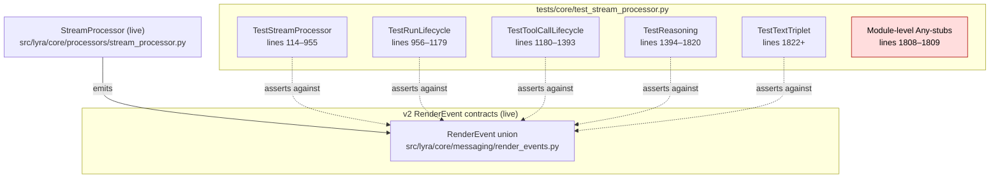
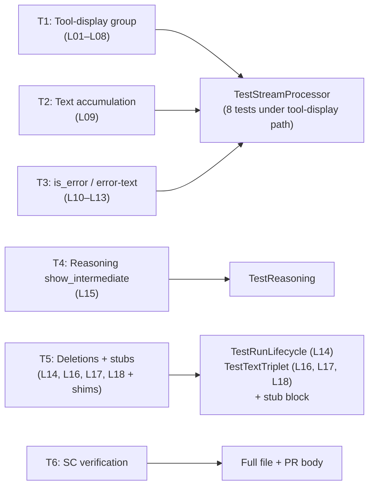

## Summary

Resolve every one of the 18 v1-skipped tests in `tests/core/test_stream_processor.py` (14 rewrites against v2 `RenderEvent` contracts + 4 deletions with documented rationale) and remove the two module-level `Any = type(...)` shims that kept them type-checking. Single-file, single-agent (tester), six grouped micro-tasks, sequential — no cross-file or cross-domain work.

## Architecture

### Test file structure (consumers of v2 RenderEvent)



### Rewrite-task × class × test mapping



## Bootstrap Context

### S1 gate artifacts (resolved in this plan)

**NC-1 (L09 `test_text_accumulation`) — RESOLVED: rewrite**

Anchor command: `grep -nE "test_text_(accumulation|triplet_single_block_ordering|triplet_multi_block_distinct_ids)" tests/core/test_stream_processor.py`

Result:
```
732:    async def test_text_accumulation(self) -> None:
1829:    async def test_text_triplet_single_block_ordering(self) -> None:
1860:    async def test_text_triplet_multi_block_distinct_ids(self) -> None:
```

L09 (skipped) asserts v1 `TextRenderEvent` accumulation: 3 intermediate `TextRenderEvent` chunks + 1 final with full concat text + `is_final=True`. The active `test_text_triplet_single_block_ordering` (line 1829) asserts the v2 triplet **ordering** (TextStart → TextDelta → TextEnd) and **shared message_id**, NOT delta-concat reconstruction. The active `test_text_triplet_multi_block_distinct_ids` (line 1860) asserts distinct message_ids across blocks separated by a tool call, NOT concat.

L09 covers a distinct property — that the sequence of `TextDeltaRenderEvent.delta` values, concatenated, reproduces the input. **Rewrite L09** with that v2 assertion.

**NC-2 (L07 `test_agent_calls_accumulation`) — RESOLVED: rewrite**

Anchor command: `grep -nE "agent_calls|sub_agent|nested_agent" src/lyra/core/processors/stream_processor.py`

Result:
```
157:        self._agent_calls: list[str] = []
532:                self._agent_calls.append(event.input.get("description", "agent"))
542:            or self._agent_calls
```

The agent-calls accumulation path is **live in v2** — `self._agent_calls` is initialized at line 157, populated when an agent invocation tool-use is seen (line 532), and consulted at line 542 in the rendering path. **Rewrite L07** targeting this accumulation behavior with v2 `ToolCallStartRenderEvent` / `ToolCallResultRenderEvent` assertions where appropriate.

**v1-residue audit (frame-level, S1 final gate) — PASS**

Anchor command: `grep -nE "dual_emit|v1_fallback|TextRenderEvent|ToolSummaryRenderEvent" src/lyra/core/processors/stream_processor.py`

Result: **no match**. Confirms no production code path emits v1 `TextRenderEvent` / `ToolSummaryRenderEvent` or branches on dual-emit / v1-fallback. Deletion of L16 (`test_dual_emit_v1_text_alongside_reasoning_delta`), L17 (`test_text_end_before_v1_fallback_on_truncation`), and L18 (`test_v1_parity_against_baseline_fixture`) forfeits no production-path regression coverage.

### Pattern references (read before each task)

| Group | Pattern test (active, in same file) | Lines |
|---|---|---|
| T1 — tool-display | `test_write_tool_tracked`, `test_five_edits_at_threshold`, `test_six_edits_count_mode`, `test_web_fetch_visible`, `test_bash_truncation`, `test_silent_read_grep_glob`, `test_throttle_suppression`, `test_result_bypasses_throttle` | 241–711 |
| T1 — agent-calls (L07) | live `_agent_calls` path | `src/lyra/core/processors/stream_processor.py:157,532,542` |
| T2 — text-delta | `test_text_triplet_single_block_ordering`, `test_text_triplet_multi_block_distinct_ids` | 1829–1893 |
| T3 — is_error / error-text | `test_is_error_propagated_to_text_render_event`, `test_is_error_run_error_carries_error_text` | 756–804 |
| T4 — reasoning | `test_thinking_emits_reasoning_triplet_with_consistent_message_id`, `test_reasoning_closes_on_*` | 1401–1820 |
| T5 — deletions | n/a (delete-only) | — |

## Agents

| Agent | Instance | Task count | Files |
|---|---|---|---|
| tester | tester-A | 6 (T1–T6) | `tests/core/test_stream_processor.py` only |

Single-instance — sequential. No parallelism: every task touches the same file. Worktree:`.claude/worktrees/1216-rewrite-leftover-v1-skipped-tests` (created by `/implement`).

## Wave Structure

6 waves, 1 agent. Elapsed ~45 min sequential.

| Wave | Trigger | Agents | Tasks |
|---|---|---|---|
| 1 | start | tester-A | T1 |
| 2 | T1 done | tester-A | T2 |
| 3 | T2 done | tester-A | T3 |
| 4 | T3 done | tester-A | T4 |
| 5 | T4 done | tester-A | T5 |
| 6 | T5 done | tester-A | T6 (RED-GATE) |

### Budget

| Task | Items | Class | Est. ops | Split? |
|---|---|---|---|---|
| T1 — Tool-display group rewrite | 8 tests | bounded | ~24 | — |
| T2 — Text accumulation rewrite | 1 test | bounded | ~3 | — |
| T3 — is_error / error-text rewrite | 4 tests | judgmental | ~20 | — |
| T4 — Reasoning rewrite | 1 test | bounded | ~3 | — |
| T5 — Deletions + shim removal | 5 edits | trivial | ~5 | — |
| T6 — SC verification + PR body draft | 7 commands + 1 doc | judgmental | ~6 | — |

**Total estimated ops: ~61** (single-agent serial; budget threshold-of-concern is per-task, none exceed 30)

## Consistency Report

- Covered SC: 8 / 8 (every spec criterion mapped to ≥1 micro-task)
- Uncovered SC: 0
- Untraced tasks: 0
- Exemptions: none

| SC | Owning task |
|---|---|
| `grep -c "@pytest.mark.skip" ... == 0` | T6 (verified across T1–T5 outputs) |
| `grep "TextRenderEvent: Any = type" ... == ∅` | T5, verified T6 |
| `grep "ToolSummaryRenderEvent: Any = type" ... == ∅` | T5, verified T6 |
| `uv run pytest tests/core/test_stream_processor.py -v` green | T6 |
| `uv run pyright tests/core/test_stream_processor.py` clean | T6 |
| PR body `## B8-10 Reconciliation` section | T6 (draft for PR body) |
| Deletion rationale on each deleted test | T5 (commit msg) + T6 (PR body) |
| No `# pyright: report*=false` added | T1–T6 (negative constraint, asserted in T6) |
| Total collected tests ≥ 73 | T6 |

## Micro-Tasks

### Slice V1 — Apply classifications

**T1 — Rewrite tool-display group (L01–L08)** [Agent: tester-A · Phase: RED · Difficulty: 3]

- Spec trace: SC-1, SC-4, SC-9
- Slice: V1
- Files: `tests/core/test_stream_processor.py` (lines ~207, 358, 385, 414, 560, 584, 610, 706 — the 8 skip blocks in tool-display section)
- Pattern refs: `test_write_tool_tracked` (line 241), `test_web_fetch_visible` (line 526), `test_throttle_suppression` (line 671)
- Description: For each of L01–L08, remove `@pytest.mark.skip` decorator, replace the v1 `TextRenderEvent`/`ToolSummaryRenderEvent` assertions with v2 `ToolCallStart/Args/End/ResultRenderEvent` + `TextChunk/Start/Delta/EndRenderEvent` equivalents. For L07 (`test_agent_calls_accumulation`), assert against the live `_agent_calls` path (see Bootstrap Context).
- Verify: `uv run pytest tests/core/test_stream_processor.py::TestStreamProcessor -v -k "single_edit_no_intermediate or two_files_no_group or three_files_group or eighty_tools_multi_file or web_search_visible or web_fetch_hidden_when_show_false or agent_calls_accumulation or throttle_pass_through"`
- Expected: 8 passed, 0 skipped, 0 failed
- Time: 8–10 min

**T2 — Rewrite text accumulation (L09)** [Agent: tester-A · Phase: RED · Difficulty: 2]

- Spec trace: SC-1, SC-4
- Slice: V1
- Files: `tests/core/test_stream_processor.py` (line 732)
- Pattern refs: `test_text_triplet_single_block_ordering` (line 1829) — for triplet shape; this test asserts a different property (delta-concat reconstruction)
- Description: Remove `@pytest.mark.skip`. Rewrite to assert that concatenating all `TextDeltaRenderEvent.delta` values in order reproduces the original input text. Drop reference to v1 `TextRenderEvent` and `is_final` attribute.
- Verify: `uv run pytest tests/core/test_stream_processor.py -v -k test_text_accumulation`
- Expected: 1 passed
- Time: 4–5 min

**T3 — Rewrite is_error / error-text group (L10–L13)** [Agent: tester-A · Phase: RED · Difficulty: 4]

- Spec trace: SC-1, SC-4
- Slice: V1
- Files: `tests/core/test_stream_processor.py` (lines 807, 827, 852, 900 — the 4 skip blocks in TestStreamProcessor's error / no-result section)
- Pattern refs: `test_is_error_propagated_to_text_render_event` (line 756), `test_is_error_run_error_carries_error_text` (line 789)
- Description: Rewrite each against the v2 contract that B8-10 ratifies (`is_error=True` → terminal `RunErrorRenderEvent`; per-block `TextEndRenderEvent.is_error` / `TextChunkRenderEvent.is_error` for soft error surfacing):
  - L10 (`test_is_error_false_propagated_to_text_render_event`): assert `is_error=False` ResultLlmEvent → `TextEndRenderEvent.is_error == False` (or `TextChunkRenderEvent.is_error == False`) AND terminal is `RunFinishedRenderEvent`.
  - L11 (`test_error_text_surfaces_when_no_streamed_text`): `is_error=True` + `error_text` + no preceding TextLlmEvent → `RunErrorRenderEvent.message == error_text`.
  - L12 (`test_streamed_text_preferred_over_error_text`): both streamed text and error_text present → streamed text in `TextEndRenderEvent`, error_text in `RunErrorRenderEvent.message`.
  - L13 (`test_no_result_event`): stream ending without `ResultLlmEvent` → terminal is `RunFinishedRenderEvent` (or `RunErrorRenderEvent` for the orphan-close branch — check live code for which); no v1 `TextRenderEvent` is generated.
- Verify: `uv run pytest tests/core/test_stream_processor.py -v -k "is_error_false_propagated or error_text_surfaces or streamed_text_preferred or no_result_event"`
- Expected: 4 passed
- Time: 8–10 min

**T4 — Rewrite reasoning show_intermediate=False (L15)** [Agent: tester-A · Phase: RED · Difficulty: 2]

- Spec trace: SC-1, SC-4
- Slice: V1
- Files: `tests/core/test_stream_processor.py` (line 1550)
- Pattern refs: `test_thinking_emits_reasoning_triplet_with_consistent_message_id` (line 1401), `test_reasoning_closes_on_text_transition` (line 1435)
- Description: Rewrite L15 (`test_show_intermediate_false_emits_no_reasoning_events`). Construct a `ToolDisplayConfig` (or equivalent) with `show_intermediate=False`, drive a `ThinkingLlmEvent` through the processor, assert zero `ReasoningStart/Delta/EndRenderEvent` emitted.
- Verify: `uv run pytest tests/core/test_stream_processor.py -v -k test_show_intermediate_false_emits_no_reasoning_events`
- Expected: 1 passed
- Time: 4–5 min

**T5 — Delete L14, L16, L17, L18 + module-level Any-stubs** [Agent: tester-A · Phase: REFACTOR · Difficulty: 2]

- Spec trace: SC-2, SC-3, SC-7
- Slice: V1
- Files: `tests/core/test_stream_processor.py` (lines 1134–1156 for L14, ~1578, ~1929, plus L18 location for v1_parity_against_baseline_fixture, and lines 1808–1809 for stubs)
- Description: Delete the 4 test functions in their entirety (including `@pytest.mark.skip` decorators and the explanatory comment block on L14). Delete the two module-level lines:
  ```python
  TextRenderEvent: Any = type("TextRenderEvent", (), {})
  ToolSummaryRenderEvent: Any = type("ToolSummaryRenderEvent", (), {})
  ```
  If those types are referenced anywhere else in the file after T1–T4 rewrites, the rewrites missed a spot — fail loudly and return to the appropriate Tx task.
- Verify:
  - `grep "TextRenderEvent: Any = type" tests/core/test_stream_processor.py` returns nothing
  - `grep "ToolSummaryRenderEvent: Any = type" tests/core/test_stream_processor.py` returns nothing
  - `grep -E "TextRenderEvent\b|ToolSummaryRenderEvent\b" tests/core/test_stream_processor.py` returns nothing (no remaining references)
  - `uv run pyright tests/core/test_stream_processor.py` → 0 errors
- Expected: all 4 grep commands return empty; pyright clean.
- Time: 5 min

**T6 — RED-GATE: full SC verification + PR body draft** [Agent: tester-A · Phase: RED-GATE · Difficulty: 3]

- Spec trace: SC-1, SC-4, SC-5, SC-6, SC-7, SC-8, SC-9
- Slice: V1
- Files: PR body (drafted in plan / passed to `/pr` step), `tests/core/test_stream_processor.py` (read-only verification)
- Description:
  1. Run all spec SC commands in order:
     ```bash
     grep -c "@pytest.mark.skip" tests/core/test_stream_processor.py            # → 0
     grep "TextRenderEvent: Any = type" tests/core/test_stream_processor.py      # → ∅
     grep "ToolSummaryRenderEvent: Any = type" tests/core/test_stream_processor.py  # → ∅
     uv run pytest tests/core/test_stream_processor.py -v                        # → 0 failures, 0 skipped for v1 reason
     uv run pyright tests/core/test_stream_processor.py                          # → 0 errors / 0 warnings
     uv run pytest --collect-only -q tests/core/test_stream_processor.py | tail -1  # → count ≥ 73
     grep -E "# pyright: report.*=false" tests/core/test_stream_processor.py    # → ∅
     ```
  2. Draft the PR body `## B8-10 Reconciliation` section (lifted from spec lines 128–148).
  3. Draft the `## Deletion rationale` section: one line per L14, L16, L17, L18 — each must name either (a) the removed v1 construct **or** (b) the contradicting active test (per spec SC-7).
- Verify: all 7 commands produce expected output; PR body draft contains both sections.
- Expected: all SC pass; PR body ready for `/pr` step.
- Time: 6–8 min

## Task Seeding Blueprint

<!-- Used by /implement to seed TaskCreate calls on session start.
     Format: T{n} | agent-instance | blockedBy | subject
     Sequential — every task blocks on the previous one. -->

### Wave 1 — start, 1 agent

| Task | Agent instance | blockedBy | Subject |
|---|---|---|---|
| T1 | tester-A | — | Rewrite tool-display group (L01–L08) against v2 RenderEvent |

### Wave 2 — after T1, 1 agent

| Task | Agent instance | blockedBy | Subject |
|---|---|---|---|
| T2 | tester-A | T1 | Rewrite text-delta accumulation (L09) |

### Wave 3 — after T2, 1 agent

| Task | Agent instance | blockedBy | Subject |
|---|---|---|---|
| T3 | tester-A | T2 | Rewrite is_error / error-text group (L10–L13) |

### Wave 4 — after T3, 1 agent

| Task | Agent instance | blockedBy | Subject |
|---|---|---|---|
| T4 | tester-A | T3 | Rewrite reasoning show_intermediate=False (L15) |

### Wave 5 — after T4, 1 agent

| Task | Agent instance | blockedBy | Subject |
|---|---|---|---|
| T5 | tester-A | T4 | Delete L14, L16, L17, L18 + remove module-level Any-stubs |

### Wave 6 — after T5, 1 agent

| Task | Agent instance | blockedBy | Subject |
|---|---|---|---|
| T6 | tester-A | T5 | RED-GATE — full SC verification + PR body draft |

## Task IDs

<!-- Generated by /plan. Used by /implement to resume tasks on session restart. -->
- T1: 12 — Rewrite tool-display group (L01–L08) against v2 RenderEvent
- T2: 13 — Rewrite text-delta accumulation (L09)
- T3: 14 — Rewrite is_error / error-text group (L10–L13)
- T4: 15 — Rewrite reasoning show_intermediate=False (L15)
- T5: 16 — Delete L14, L16, L17, L18 + remove module-level Any-stubs
- T6: 17 — RED-GATE — full SC verification + PR body draft
