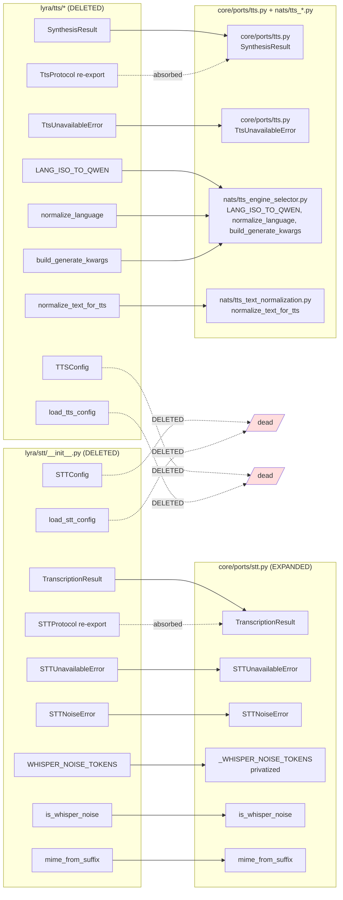

# Plan: STT/TTS Hexagonal Normalization

## Summary

Mechanical refactor walking spec §9's 12-commit sequence in an isolated worktree. Single `fixer` agent — ordering matters (ports → helpers → clients → consumers → deletes → config) and parallel fixers on a shared worktree race.

## Architecture

### Data flow — before vs after

```mermaid
flowchart TD
    subgraph Before["Before"]
        BS_init["lyra/stt/__init__.py"]
        BT_init["lyra/tts/__init__.py"]
        BT_es["lyra/tts/engine_selector.py"]
        BT_tn["lyra/tts/text_normalization.py"]
        BPS["core/ports/stt.py<br/>(stub + TYPE_CHECKING)"]
        BPT["core/ports/tts.py<br/>(stub + TYPE_CHECKING)"]
        BNS["nats/nats_stt_client.py"]
        BNT["nats/nats_tts_client.py"]
        BAg["agents/* + agent.py + middleware_stt.py + bootstrap/factory/*"]
        BTests["tests/tts/ + tests/agents/*"]

        BPS -.TYPE_CHECKING.-> BS_init
        BPT -.TYPE_CHECKING.-> BT_init
        BNS -.from lyra.stt.-> BS_init
        BNT -.from lyra.tts.-> BT_init
        BT_init --> BT_es
        BT_init --> BT_tn
        BAg -.from lyra.stt/tts.-> BS_init & BT_init
        BTests -.from lyra.stt/tts.-> BS_init & BT_init
    end

    subgraph After["After"]
        APS["core/ports/stt.py<br/>(self-contained: protocol + result + errors + helpers)"]
        APT["core/ports/tts.py<br/>(self-contained: protocol + result + error)"]
        ANS["nats/nats_stt_client.py<br/>+ _stt_result_from_wire"]
        ANT["nats/nats_tts_client.py<br/>+ _tts_result_from_wire"]
        AN_es["nats/tts_engine_selector.py<br/>(no TTSConfig, no loader)"]
        AN_tn["nats/tts_text_normalization.py"]
        AAg["agents/* + agent.py + middleware_stt.py + bootstrap/factory/*"]
        ATests["tests/agents/* (incl. test_voice_command.py)"]

        ANS --> APS
        ANT --> APT
        ANS --> AN_es
        ANT --> AN_es & AN_tn
        AAg --> APS & APT
        ATests --> APS & APT
    end

    style BS_init fill:#fdd
    style BT_init fill:#fdd
    style BT_es fill:#fdd
    style BT_tn fill:#fdd
    style BPS fill:#ffd
    style BPT fill:#ffd
    style APS fill:#dfd
    style APT fill:#dfd
    style AN_es fill:#dfd
    style AN_tn fill:#dfd
```

Red = deleted | Yellow = stub/incomplete | Green = self-contained/canonical.

### File × Symbol move map



## Agents

| Agent | Task count | Files |
|-------|-----------|-------|
| fixer | 13 | all `src/lyra/{stt,tts,core,nats,agents,bootstrap}/...` + tests + `.importlinter` + `tools/folder_exemptions.txt` + 3 `CLAUDE.md` |

Single-agent execution. `tester` not separately spawned — `T13` runs `pytest` as final gate inside fixer's session.

## Wave Structure

1 wave, 1 agent, sequential. Elapsed ~45–60 min for the full sequence vs same time (sequential by design).

| Wave | Trigger | Agents | Tasks |
|------|---------|--------|-------|
| 1 | start | 1 (fixer) | T0 → T1 → T2 → T3 → T4 → T5 → T6 → T7 → T8 → T9 → T10 → T11 → T12 → T13 |

### Budget

| Task | Items | Class | Est. ops | Split? |
|------|-------|-------|----------|--------|
| T0 precondition greps | 2 | trivial | 2 | — |
| T1 expand `core/ports/stt.py` | 1 file | judgmental | 5 | — |
| T2 expand `core/ports/tts.py` | 1 file | judgmental | 4 | — |
| T3 create `nats/tts_engine_selector.py` | 1 file | bounded | 3 | — |
| T4 create `nats/tts_text_normalization.py` | 1 file | trivial | 2 | — |
| T5 rewrite `nats/nats_stt_client.py` | 1 file | judgmental | 5 | — |
| T6 rewrite `nats/nats_tts_client.py` | 1 file | judgmental | 5 | — |
| T7 rewrite 6 other consumers | 6 files | bounded | 12 | — |
| T8 rewrite test files | ~10 files | bounded | 18 | — |
| T9 delete `stt/`, `tts/`, `tests/tts/` | 3 dirs | trivial | 3 | — |
| T10 update `.importlinter` + `folder_exemptions.txt` | 2 files | bounded | 4 | — |
| T11 update 3 `CLAUDE.md` files | 3 files | bounded | 6 | — |
| T12 run gates (`ruff --fix && pyright && pytest`) | — | bounded | 3 | — |
| T13 final verify (success-criteria greps) | — | bounded | 4 | — |

**Total estimated ops: ~76** — within single-agent budget (<120k token target).

## Consistency Report

- Spec success criteria: 19 binary checkboxes in §10 → all covered by T0–T13.
- T13 is the explicit verifier for SC-1 through SC-11 + SC-19 (the grep-style criteria).
- T12 covers SC-13 through SC-17 (lint/type/test/file-size/folder-size gates).
- T11 covers SC-18 (CLAUDE.md updates).
- No spec criterion left untraced. No micro-task without a spec trace.

## Micro-Tasks

### V1 — Hexagonal Normalization (single slice, atomic PR)

#### T0 — Precondition gate (RED-GATE)

- **Description:** Run the dead-code precondition greps from spec §9. Halt the entire plan if either returns hits.
- **Files:** none (read-only)
- **Verify:**
  ```sh
  grep -rnP "(?:^\s*(?:from|import)\s.*\b(TTSConfig|load_tts_config)\b)|(?:\b(TTSConfig|load_tts_config)\s*\()" src/ plugins/ | grep -v "engine_selector\.py\|tts/__init__\.py\|AgentTTSConfig"
  grep -rnP "(?:^\s*(?:from|import)\s.*\b(STTConfig|load_stt_config)\b)|(?:\b(STTConfig|load_stt_config)\s*\()" src/ plugins/ | grep -v "stt/__init__\.py\|AgentSTTConfig"
  ```
- **Expected output:** both commands return empty.
- **Time:** 1 min · **Difficulty:** 1 · **Spec trace:** §9 Precondition · **Phase:** RED-GATE

#### T1 — Expand `core/ports/stt.py`

- **Description:** Add `TranscriptionResult`, `STTUnavailableError`, `STTNoiseError`, `_WHISPER_NOISE_TOKENS`, `is_whisper_noise`, `mime_from_suffix`. Remove TYPE_CHECKING cross-reference to `lyra.stt`. DO NOT add `STTConfig` / `load_stt_config` (dead).
- **Files:** `src/lyra/core/ports/stt.py`
- **Verify:** `uv run pyright src/lyra/core/ports/stt.py 2>&1 | grep -E "error|warning" | wc -l`
- **Expected output:** `0`
- **Time:** 5 min · **Difficulty:** 2 · **Spec trace:** SC-4 · **Phase:** GREEN

#### T2 — Expand `core/ports/tts.py`

- **Description:** Add `SynthesisResult`, `TtsUnavailableError`. Remove TYPE_CHECKING cross-reference to `lyra.tts`. DO NOT add `TTSConfig` / `load_tts_config`.
- **Files:** `src/lyra/core/ports/tts.py`
- **Verify:** `uv run pyright src/lyra/core/ports/tts.py 2>&1 | grep -E "error|warning" | wc -l`
- **Expected output:** `0`
- **Time:** 4 min · **Difficulty:** 2 · **Spec trace:** SC-5 · **Phase:** GREEN

#### T3 — Create `nats/tts_engine_selector.py`

- **Description:** Copy `LANG_ISO_TO_QWEN`, `normalize_language`, `build_generate_kwargs` from `lyra/tts/engine_selector.py`. Omit `TTSConfig` and `load_tts_config` (dead).
- **Files:** `src/lyra/nats/tts_engine_selector.py`
- **Verify:** `uv run python -c "from lyra.nats.tts_engine_selector import build_generate_kwargs, normalize_language, LANG_ISO_TO_QWEN; print('ok')"`
- **Expected output:** `ok`
- **Time:** 4 min · **Difficulty:** 2 · **Spec trace:** SC-6 · **Phase:** GREEN

#### T4 — Create `nats/tts_text_normalization.py`

- **Description:** Copy `normalize_text_for_tts` verbatim from `lyra/tts/text_normalization.py`.
- **Files:** `src/lyra/nats/tts_text_normalization.py`
- **Verify:** `uv run python -c "from lyra.nats.tts_text_normalization import normalize_text_for_tts; print('ok')"`
- **Expected output:** `ok`
- **Time:** 2 min · **Difficulty:** 1 · **Spec trace:** SC-7 · **Phase:** GREEN

#### T5 — Rewrite `nats/nats_stt_client.py`

- **Description:** Rewrite import (`from lyra.stt import ...` → `from lyra.core.ports.stt import ...`). Add module-private `_stt_result_from_wire`. Replace ONLY the `result = TranscriptionResult(...)` block (current lines 235-239) + preceding asserts with `result = _stt_result_from_wire(resp)`. Leave `self._cb.record_success()` (current line 240) and everything after IN PLACE — it's the post-mapping success path. See spec §5 mapper signature.
- **Files:** `src/lyra/nats/nats_stt_client.py`
- **Verify:**
  ```sh
  grep -n "from lyra.stt import" src/lyra/nats/nats_stt_client.py
  grep -n "_stt_result_from_wire" src/lyra/nats/nats_stt_client.py
  grep -n "self._cb.record_success" src/lyra/nats/nats_stt_client.py
  ```
- **Expected output:** first grep empty; second grep ≥2 lines (def + call); third grep ≥1 line (preserved).
- **Time:** 8 min · **Difficulty:** 3 · **Spec trace:** SC-8 · **Phase:** GREEN

#### T6 — Rewrite `nats/nats_tts_client.py`

- **Description:** Rewrite import (`from lyra.tts import ...` → `from lyra.core.ports.tts import ...`). Add module-private `_tts_result_from_wire(resp, audio_bytes)`. Replace inline construction + asserts with `return _tts_result_from_wire(resp, audio_bytes)`. See spec §5.
- **Files:** `src/lyra/nats/nats_tts_client.py`
- **Verify:**
  ```sh
  grep -n "from lyra.tts import" src/lyra/nats/nats_tts_client.py
  grep -n "_tts_result_from_wire" src/lyra/nats/nats_tts_client.py
  ```
- **Expected output:** first grep empty; second grep ≥2 lines.
- **Time:** 8 min · **Difficulty:** 3 · **Spec trace:** SC-9 · **Phase:** GREEN

#### T7 — Rewrite other source consumers

- **Description:** Per spec §6 source table:
  - `core/hub/middleware/middleware_stt.py` — HOIST the lazy `from lyra.stt import STTNoiseError, STTUnavailableError` inside `except Exception` to a module-top import. Rewrite to `from lyra.core.ports.stt import ...`.
  - `core/agent/agent.py` — rewrite `from lyra.stt/tts import ...` → `from lyra.core.ports.{stt,tts} import ...`.
  - `agents/simple_agent.py` — same rewrite.
  - `agents/simple_agent_prompts.py` — TWO sites: the TYPE_CHECKING block AND the lazy import inside `_build_llm_text_from_audio`. Both rewrite.
  - `bootstrap/factory/agent_factory.py` — rewrite.
  - `bootstrap/factory/hub_builder.py` — rewrite.
- **Files:** 6 files in `src/lyra/`
- **Verify:** `grep -rnE "from lyra\.(stt|tts) import|import lyra\.(stt|tts)" src/lyra/ | grep -v "src/lyra/(stt|tts)/"`
- **Expected output:** empty.
- **Time:** 10 min · **Difficulty:** 2 · **Spec trace:** SC-10 · **Phase:** GREEN

#### T8 — Rewrite test files

- **Description:** Per spec §6 test table — rewrite ALL `from lyra.stt`/`from lyra.tts` imports in:
  `tests/fixtures/fake_drivers.py`, `tests/fixtures/test_fake_drivers.py`, `tests/core/test_audio_pipeline_tts.py`, `tests/core/hub/test_message_pipeline_stt.py`, `tests/core/test_hub_streaming.py`, `tests/agents/conftest.py`, 3× `tests/agents/test_simple_agent_stt_*.py`, `tests/nats/test_nats_stt_client.py`, `tests/nats/test_nats_tts_client.py`.

  Then MOVE `tests/tts/test_voice_command.py` → `tests/agents/test_voice_command.py` (verify no basename collision FIRST: `ls tests/agents/test_voice_command.py` should fail).
- **Files:** ~10 test files
- **Verify:**
  ```sh
  ! ls tests/agents/test_voice_command.py 2>/dev/null  # before move: must NOT exist
  # After all rewrites:
  grep -rnE "from lyra\.(stt|tts) import|import lyra\.(stt|tts)" tests/ | wc -l
  ```
- **Expected output:** post-rewrite grep count = `0`.
- **Time:** 12 min · **Difficulty:** 2 · **Spec trace:** SC-11, SC-18-test · **Phase:** GREEN

#### T9 — Delete old packages

- **Description:** Hard delete:
  - `src/lyra/stt/` (incl. `__init__.py`, `CLAUDE.md`)
  - `src/lyra/tts/` (incl. `__init__.py`, `engine_selector.py`, `text_normalization.py`)
  - `tests/tts/` (incl. `test_tts_config.py`, `conftest.py`, `__init__.py`)
- **Files:** 3 directories
- **Verify:** `! ls -d src/lyra/stt src/lyra/tts tests/tts 2>/dev/null`
- **Expected output:** all three `ls` calls fail (exit 2).
- **Time:** 1 min · **Difficulty:** 1 · **Spec trace:** SC-1, SC-2, SC-3 · **Phase:** GREEN

#### T10 — Update `.importlinter` + `tools/folder_exemptions.txt`

- **Description:**
  - `.importlinter`: remove `lyra.stt` and `lyra.tts` from `shared-modules-independence` and `shared-modules-upper-boundary` contracts. Drop the 3 transitive `ignore_imports` entries listed in spec §8 (`lyra.tts.engine_selector -> lyra.core.agent.agent_config`, `lyra.core.agent.agent -> lyra.stt`, `lyra.core.agent.agent -> lyra.tts`). KEEP `lyra.core.processors.processor_registry -> lyra.integrations.base` (unrelated).
  - `tools/folder_exemptions.txt`: append `src/lyra/nats  # issue #1221 — NATS subsystem owns transport + per-protocol client + per-protocol helper modules; pattern intentional, see ADR-049`.
- **Files:** `.importlinter`, `tools/folder_exemptions.txt`
- **Verify:**
  ```sh
  grep -E "lyra\.(stt|tts)" .importlinter
  grep "src/lyra/nats" tools/folder_exemptions.txt
  uv run lint-imports
  ```
- **Expected output:** first grep empty; second grep returns the new line; `lint-imports` exits 0.
- **Time:** 4 min · **Difficulty:** 2 · **Spec trace:** SC-12, SC-13 · **Phase:** GREEN

#### T11 — Update CLAUDE.md files

- **Description:**
  - Root `CLAUDE.md` hygiene table: DELETE the `src/lyra/stt/CLAUDE.md` row. (No `src/lyra/tts/CLAUDE.md` row exists.)
  - `src/lyra/core/CLAUDE.md`: update "Domain ports" section to reflect the expanded `ports/stt.py`/`ports/tts.py` (protocol + value object + errors + helpers, mirroring `ports/llm.py`).
  - `src/lyra/nats/CLAUDE.md`: add a line documenting the two new helper files (`tts_engine_selector.py`, `tts_text_normalization.py`) and the `_*_from_wire` mapper pattern.
- **Files:** `CLAUDE.md`, `src/lyra/core/CLAUDE.md`, `src/lyra/nats/CLAUDE.md`
- **Verify:**
  ```sh
  grep "src/lyra/stt/CLAUDE.md" CLAUDE.md
  grep "tts_engine_selector\|tts_text_normalization" src/lyra/nats/CLAUDE.md
  ```
- **Expected output:** first grep empty; second grep returns ≥1 line.
- **Time:** 6 min · **Difficulty:** 2 · **Spec trace:** SC-18 · **Phase:** GREEN

#### T12 — Run lint/type/test gates

- **Description:** Run `uv run ruff check --fix .`, `uv run pyright`, `uv run pytest`. Fix any type-narrowing complaints in the mappers with `cast(str, resp.field)` + a short comment per spec §9 commit 12. All tests must pass.
- **Verify:**
  ```sh
  uv run ruff check . && uv run pyright && uv run pytest
  ```
- **Expected output:** ruff: clean; pyright: 0 errors; pytest: all green.
- **Time:** 6 min (plus any pyright fixes) · **Difficulty:** 3 · **Spec trace:** SC-13, SC-14, SC-15, SC-16, SC-17 · **Phase:** REFACTOR

#### T13 — Final success-criteria verifier (RED-GATE)

- **Description:** Run the spec §10 grep-style success criteria as a final gate before opening the PR.
- **Verify:**
  ```sh
  # SC-1, SC-2, SC-3: directories must not exist
  ! ls -d src/lyra/stt src/lyra/tts tests/tts 2>/dev/null

  # SC-10: no imports from lyra.stt/tts anywhere
  grep -rnE "from lyra\.(stt|tts) import|import lyra\.(stt|tts)" src/ tests/ plugins/

  # SC-19: no back-compat shims in any __init__.py
  find src/lyra -name __init__.py | xargs grep -l "lyra\.\(stt\|tts\)" 2>/dev/null
  ```
- **Expected output:** all three checks pass (dirs absent; grep + find both empty).
- **Time:** 2 min · **Difficulty:** 1 · **Spec trace:** SC-1, SC-2, SC-3, SC-10, SC-19 · **Phase:** RED-GATE

---

## Task Seeding Blueprint

<!-- Used by /implement to seed TaskCreate calls. Sequential — single fixer instance walks all 14 tasks. -->

### Wave 1 — single agent, sequential

| Task | Agent instance | blockedBy | Subject |
|------|---------------|-----------|---------|
| T0 | fixer-A | — | Precondition: greps confirm no live callers of dead config |
| T1 | fixer-A | T0 | Expand core/ports/stt.py with TranscriptionResult + errors + helpers |
| T2 | fixer-A | T1 | Expand core/ports/tts.py with SynthesisResult + TtsUnavailableError |
| T3 | fixer-A | T2 | Create nats/tts_engine_selector.py (no dead TTSConfig) |
| T4 | fixer-A | T3 | Create nats/tts_text_normalization.py |
| T5 | fixer-A | T4 | Rewrite nats_stt_client.py with _stt_result_from_wire mapper |
| T6 | fixer-A | T5 | Rewrite nats_tts_client.py with _tts_result_from_wire mapper |
| T7 | fixer-A | T6 | Rewrite 6 other source consumers (hoist middleware import, etc.) |
| T8 | fixer-A | T7 | Rewrite ~10 test files + move tests/tts/test_voice_command.py |
| T9 | fixer-A | T8 | Delete src/lyra/stt/, src/lyra/tts/, tests/tts/ |
| T10 | fixer-A | T9 | Update .importlinter + tools/folder_exemptions.txt |
| T11 | fixer-A | T10 | Update root, core/, nats/ CLAUDE.md files |
| T12 | fixer-A | T11 | Run ruff + pyright + pytest gates |
| T13 | fixer-A | T12 | Final success-criteria verifier |

---

## Task IDs

<!-- Generated by /plan. Used by /implement to resume tasks on session restart. -->
- T0: 2 — Precondition greps confirm no live callers of dead config
- T1: 3 — Expand core/ports/stt.py with TranscriptionResult + errors + helpers
- T2: 4 — Expand core/ports/tts.py with SynthesisResult + TtsUnavailableError
- T3: 5 — Create nats/tts_engine_selector.py (no dead TTSConfig)
- T4: 6 — Create nats/tts_text_normalization.py
- T5: 7 — Rewrite nats_stt_client.py with _stt_result_from_wire mapper
- T6: 8 — Rewrite nats_tts_client.py with _tts_result_from_wire mapper
- T7: 9 — Rewrite 6 other source consumers (hoist middleware import, etc.)
- T8: 10 — Rewrite ~10 test files + move tests/tts/test_voice_command.py
- T9: 11 — Delete src/lyra/stt/, src/lyra/tts/, tests/tts/
- T10: 12 — Update .importlinter + tools/folder_exemptions.txt
- T11: 13 — Update root, core/, nats/ CLAUDE.md files
- T12: 14 — Run ruff + pyright + pytest gates
- T13: 15 — Final success-criteria verifier
