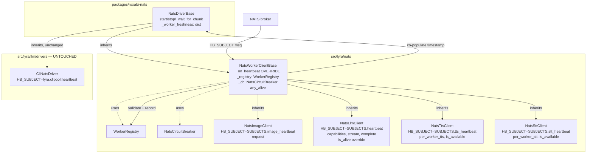
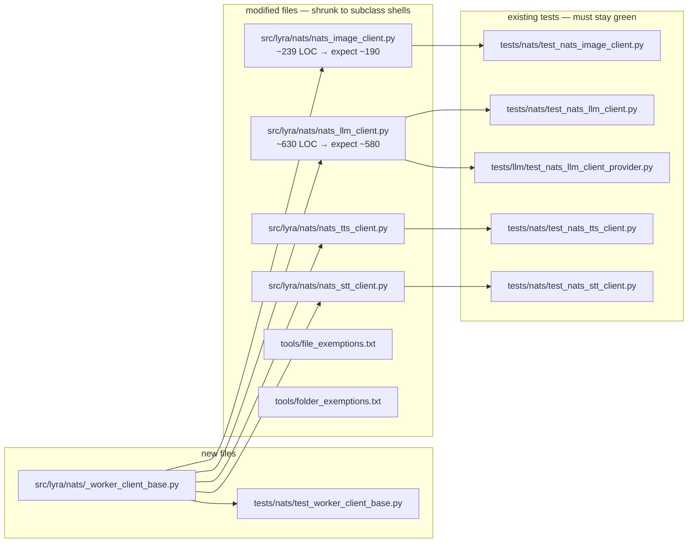

## Summary

Introduce `NatsWorkerClientBase` (Lyra-local, extends `NatsDriverBase`) in `src/lyra/nats/_worker_client_base.py`; migrate the 4 hub-side NATS clients (`Image` pilot, then `LLM`/`TTS`/`STT`) to subclass it; audit file/folder exemptions; full quality-gate sweep. Zero changes to `CliNatsDriver` or `roxabi-nats`/`roxabi-contracts`.

## Architecture

### Data flow (heartbeat lifecycle, post-refactor)



### File × Function map



## Bootstrap Context

Reference pattern (read once): `src/lyra/llm/drivers/cli_nats.py` — sole existing example of subclassing `NatsDriverBase`. Sets `HB_SUBJECT` class attr, calls `super().__init__(...)`, lets base `start()`/`stop()` own subscription. Does NOT override `_on_heartbeat` (uses base's timestamp-only path). Our `NatsWorkerClientBase` extends this exact pattern + overrides `_on_heartbeat` for rich-payload storage.

## Agents

| Agent | Instances | Tasks | Files |
|-------|-----------|-------|-------|
| backend-dev | A | T1, T3, T4, T5, T6 (5) | `src/lyra/nats/*.py` |
| tester | A | T2, T8 (2) | `tests/nats/test_worker_client_base.py`, full suite |
| devops | A | T7 (1) | `tools/file_exemptions.txt`, `tools/folder_exemptions.txt` |

Total: 3 agent instances, 8 micro-tasks.

## Wave Structure

5 waves, max 2 parallel agents (Wave 5). Elapsed ~1 working day vs ~1.5 sequential.

| Wave | Trigger | Agents | Tasks |
|------|---------|--------|-------|
| 1 | start | 1 | backend-dev-A: T1 |
| 2 | T1 done | 1 | tester-A: T2 |
| 3 | T2 GREEN | 1 | backend-dev-A: T3 (Image pilot — proves pattern) |
| 4 | T3 GREEN | 1 | backend-dev-A: T4 → T5 → T6 (LLM, TTS, STT sequential — same agent session) |
| 5 | T6 GREEN | 2 ∥ | devops-A: T7 · tester-A: T8 |

Sequential within Wave 4 — 3 small mechanically-similar migrations don't justify isolated-worktree overhead (per `feedback_parallel_fixers_need_isolated_worktrees`: triggers ≥2 ∥ code-editing agents on distinct files; single agent serial avoids it).

### Budget

| Task | Items | Class | Est. ops | Split? |
|------|-------|-------|----------|--------|
| T1 — base class | 1 file, ~100 LOC | judgmental | 6 | — |
| T2 — base tests | 1 file, ~4 test cases | judgmental | 6 | — |
| T3 — Image migration | 1 file edit | judgmental | 5 | — |
| T4 — LLM migration | 1 file edit + preserve is_alive | judgmental | 6 | — |
| T5 — TTS migration | 1 file edit | judgmental | 5 | — |
| T6 — STT migration | 1 file edit | judgmental | 5 | — |
| T7 — exemption audit | 2 file reads + edit | bounded | 3 | — |
| T8 — gate sweep | 5 gate commands | bounded | 3 | — |

**Total estimated ops: ~39** — under 50 threshold, no force-split.

## Consistency Report

| Metric | Value |
|---|---|
| Acceptance criteria covered | 8/8 |
| Affordances covered (N1-N7, S1-S4, T1) | 12/12 |
| Untraced micro-tasks | 0 |
| Exemptions | none |

## Micro-Tasks

### Slice V1 — Base class + tests

**T1** — Create `NatsWorkerClientBase`
- **File:** `src/lyra/nats/_worker_client_base.py` (new)
- **Agent:** backend-dev-A
- **Spec trace:** SC-1, N1-N7
- **Phase:** GREEN
- **Difficulty:** 3
- **Time:** 8–10 min
- **Description:** Write `NatsWorkerClientBase(NatsDriverBase)` with class attrs `LOG_PREFIX: str = ""`, `VALIDATE_WORKER_ID: Callable[[str], None]` (default = no-op lambda or required override). In `__init__`: call `super().__init__(...)`, instantiate `self._registry = WorkerRegistry()` + `self._cb = NatsCircuitBreaker()`. Override `_on_heartbeat(msg)`: JSON-decode, verify `worker_id` is non-empty `str` (drop with warning otherwise), call `self.VALIDATE_WORKER_ID(worker_id)` in `try/except ValueError`, then call `self._registry.record_heartbeat(data)` AND co-populate `self._worker_freshness[worker_id] = time.monotonic()`. Add public `any_alive() -> bool` delegating to `self._registry.any_alive()`. Use `LOG_PREFIX` in all log messages.
- **Code skeleton:**
  ```python
  from collections.abc import Callable
  import json, logging, time
  from roxabi_nats.circuit_breaker import NatsCircuitBreaker
  from roxabi_nats.driver_base import NatsDriverBase
  from lyra.nats.worker_registry import WorkerRegistry

  log = logging.getLogger(__name__)

  class NatsWorkerClientBase(NatsDriverBase):
      LOG_PREFIX: str = ""
      VALIDATE_WORKER_ID: Callable[[str], None] = staticmethod(lambda _wid: None)

      def __init__(self, nc, *, timeout: float = 30.0, max_total_duration: float | None = None) -> None:
          super().__init__(nc, timeout=timeout, max_total_duration=max_total_duration)
          self._registry = WorkerRegistry()
          self._cb = NatsCircuitBreaker()

      async def _on_heartbeat(self, msg) -> None:  # noqa: D401
          try:
              data = json.loads(msg.data.decode())
          except json.JSONDecodeError:
              log.warning("%s heartbeat JSON decode failed", self.LOG_PREFIX)
              return
          worker_id = data.get("worker_id")
          if not worker_id or not isinstance(worker_id, str):
              log.warning("%s heartbeat missing/invalid worker_id", self.LOG_PREFIX)
              return
          try:
              type(self).VALIDATE_WORKER_ID(worker_id)
          except ValueError as e:
              log.warning("%s heartbeat rejected worker_id=%r: %s", self.LOG_PREFIX, worker_id, e)
              return
          self._registry.record_heartbeat(data)
          self._worker_freshness[worker_id] = time.monotonic()

      def any_alive(self) -> bool:
          return self._registry.any_alive()
  ```
- **Verify:** `uv run ruff check src/lyra/nats/_worker_client_base.py && uv run pyright src/lyra/nats/_worker_client_base.py`
- **Expected:** ruff clean, pyright clean.

**T2** — Write tests for `NatsWorkerClientBase`
- **File:** `tests/nats/test_worker_client_base.py` (new)
- **Agent:** tester-A
- **Spec trace:** SC-1, SC-3, SC-5 (liveness parity)
- **Phase:** RED-GATE → GREEN
- **Difficulty:** 3
- **Time:** 8–10 min
- **Dependencies:** T1
- **Description:** Define a `FakeWorkerClient(NatsWorkerClientBase)` with `HB_SUBJECT = "test.hb"`, `LOG_PREFIX = "fake:"`, `VALIDATE_WORKER_ID = validate_worker_id` (import from `roxabi_contracts.llm`). Write tests:
  1. Valid heartbeat → `_registry.any_alive()` True AND `_worker_freshness` populated.
  2. Heartbeat with `worker_id` containing `*` / `.` / `>` → rejected (registry empty, freshness empty).
  3. Heartbeat with `worker_id = None` / `""` / non-string → rejected.
  4. Heartbeat with malformed JSON → silently dropped (no crash).
  5. **Liveness parity:** feed N heartbeats at known timestamps, assert `_any_worker_alive()` (inherited from base, reads `_worker_freshness`) AND `any_alive()` (N7, reads `_registry`) return the same bool for all (t < HB_TTL) and (t > HB_TTL) cases.
- **Verify:** `uv run pytest tests/nats/test_worker_client_base.py -v`
- **Expected:** 5 tests pass.

### Slice V2 — Pilot migration

**T3** — Migrate `NatsImageClient` to `NatsWorkerClientBase` (pilot)
- **File:** `src/lyra/nats/nats_image_client.py`
- **Agent:** backend-dev-A
- **Spec trace:** SC-2, SC-4, S4
- **Phase:** REFACTOR
- **Difficulty:** 2
- **Time:** 5–7 min
- **Dependencies:** T2 GREEN (pattern proven)
- **Description:** Change class declaration to `class NatsImageClient(NatsWorkerClientBase)`. Set class attrs: `HB_SUBJECT = SUBJECTS.image_heartbeat`, `LOG_PREFIX = "image_client:"`, `VALIDATE_WORKER_ID = staticmethod(validate_worker_id)` (import from `roxabi_contracts.image`). Remove local `_on_heartbeat`, `start`, `stop` methods (inherited). Remove local `self._registry = WorkerRegistry()` and `self._cb = NatsCircuitBreaker()` from `__init__` (inherited). Keep `request()` and all domain-specific logic untouched. Verify heartbeat block in file shrinks to ≤4 LOC (just the 3 class-attr lines + blank).
- **Verify:** `uv run pytest tests/nats/test_nats_image_client.py -v && grep -c "_on_heartbeat" src/lyra/nats/nats_image_client.py`
- **Expected:** all existing image tests pass; `grep -c "_on_heartbeat"` returns `0`.

### Slice V3 — Batch migration + cleanup

**T4** — Migrate `NatsLlmClient` (preserve `capabilities`, `is_alive(pool_id)` override)
- **File:** `src/lyra/nats/nats_llm_client.py`
- **Agent:** backend-dev-A
- **Spec trace:** SC-2, SC-4, S1
- **Phase:** REFACTOR
- **Difficulty:** 3
- **Time:** 6–8 min
- **Dependencies:** T3 GREEN
- **Description:** Same pattern as T3. Class attrs: `HB_SUBJECT = SUBJECTS.heartbeat`, `LOG_PREFIX = "llm_client:"`, `VALIDATE_WORKER_ID = staticmethod(validate_worker_id)` (from `roxabi_contracts.llm`). **Preserve:** `capabilities: dict[str, Any]` class attr or instance attr, the `is_alive(self, pool_id: str) -> bool` override (returns `self._nc.is_connected and self._registry.any_alive()`, ignoring `pool_id` via `del pool_id` to silence lint). Remove local `_on_heartbeat`, registry/cb init, start/stop overrides. Keep `stream`, `complete`, `_build_request`, `ordered_by_score`/`mark_stale` callsites unchanged.
- **Verify:** `uv run pytest tests/nats/test_nats_llm_client.py tests/llm/test_nats_llm_client_provider.py -v && grep -c "_on_heartbeat" src/lyra/nats/nats_llm_client.py`
- **Expected:** all LLM tests pass; `grep -c "_on_heartbeat"` returns `0`.

**T5** — Migrate `NatsTtsClient`
- **File:** `src/lyra/nats/nats_tts_client.py`
- **Agent:** backend-dev-A
- **Spec trace:** SC-2, SC-4, S2
- **Phase:** REFACTOR
- **Difficulty:** 2
- **Time:** 5–7 min
- **Dependencies:** T4 GREEN
- **Description:** Same pattern. Class attrs: `HB_SUBJECT = SUBJECTS.tts_heartbeat`, `LOG_PREFIX = "tts_client:"`, `VALIDATE_WORKER_ID = staticmethod(validate_worker_id)` (from `roxabi_contracts.voice`). Preserve `is_available()`, `per_worker_tts()`. Remove local heartbeat lifecycle.
- **Verify:** `uv run pytest tests/nats/test_nats_tts_client.py -v && grep -c "_on_heartbeat" src/lyra/nats/nats_tts_client.py`
- **Expected:** all TTS tests pass; grep returns `0`.

**T6** — Migrate `NatsSttClient`
- **File:** `src/lyra/nats/nats_stt_client.py`
- **Agent:** backend-dev-A
- **Spec trace:** SC-2, SC-4, S3
- **Phase:** REFACTOR
- **Difficulty:** 2
- **Time:** 5–7 min
- **Dependencies:** T5 GREEN
- **Description:** Same pattern. Class attrs: `HB_SUBJECT = SUBJECTS.stt_heartbeat`, `LOG_PREFIX = "stt_client:"`, `VALIDATE_WORKER_ID = staticmethod(validate_worker_id)` (from `roxabi_contracts.voice`). Preserve `is_available()`, `per_worker_stt()`. Remove local heartbeat lifecycle.
- **Verify:** `uv run pytest tests/nats/test_nats_stt_client.py -v && grep -c "_on_heartbeat" src/lyra/nats/nats_stt_client.py`
- **Expected:** all STT tests pass; grep returns `0`.

**T7** — Audit file/folder exemptions
- **Files:** `tools/file_exemptions.txt`, `tools/folder_exemptions.txt`
- **Agent:** devops-A
- **Spec trace:** SC-7 (gates pass)
- **Phase:** REFACTOR
- **Difficulty:** 1
- **Time:** 3–4 min
- **Dependencies:** T6 GREEN
- **Description:** Run `bash tools/check_file_length.sh src/lyra/nats/` and `bash tools/check_folder_size.sh src/lyra/nats/` (or whatever wrappers exist). If any of the 4 migrated client files dropped below the 300-line cap, remove their entry from `file_exemptions.txt`. Same for folder if `src/lyra/nats/` is no longer over the file-count cap. Do NOT add new exemptions — only remove obsolete ones.
- **Verify:** `git diff tools/*_exemptions.txt`
- **Expected:** either empty diff (no exemption was obsoleted) or removal-only lines (no additions).

**T8** — Full quality-gate sweep
- **Files:** N/A (validation only)
- **Agent:** tester-A
- **Spec trace:** SC-6, SC-7
- **Phase:** RED-GATE (final)
- **Difficulty:** 1
- **Time:** 3–5 min
- **Dependencies:** T6 GREEN (parallel with T7)
- **Description:** Run the full validation suite touching NATS/LLM code:
  ```bash
  uv run ruff check . && uv run ruff format --check .
  uv run pyright
  uv run pytest tests/nats/ tests/llm/ -v
  uv run lint-imports
  ```
  Plus confirm `git diff src/lyra/llm/drivers/cli_nats.py` is empty (SC-8).
- **Verify:** all commands exit 0; `git diff src/lyra/llm/drivers/cli_nats.py` returns empty.
- **Expected:** zero failures across all 5 gates; cli_nats.py untouched.

## Task Seeding Blueprint

<!-- Used by /implement to seed TaskCreate calls on session start. -->

### Wave 1 — start, 1 agent

| Task | Agent instance | blockedBy | Subject |
|------|---------------|-----------|---------|
| T1 | backend-dev-A | — | Create NatsWorkerClientBase in src/lyra/nats/_worker_client_base.py |

### Wave 2 — after T1, 1 agent

| Task | Agent instance | blockedBy | Subject |
|------|---------------|-----------|---------|
| T2 | tester-A | T1 | Write tests/nats/test_worker_client_base.py (5 tests) |

### Wave 3 — after T2 GREEN, 1 agent (pilot)

| Task | Agent instance | blockedBy | Subject |
|------|---------------|-----------|---------|
| T3 | backend-dev-A | T2 | Migrate NatsImageClient to subclass NatsWorkerClientBase (pilot) |

### Wave 4 — after T3 GREEN, 1 agent serial

| Task | Agent instance | blockedBy | Subject |
|------|---------------|-----------|---------|
| T4 | backend-dev-A | T3 | Migrate NatsLlmClient (preserve capabilities + is_alive override) |
| T5 | backend-dev-A | T4 | Migrate NatsTtsClient (preserve is_available) |
| T6 | backend-dev-A | T5 | Migrate NatsSttClient (preserve is_available) |

### Wave 5 — after T6 GREEN, 2 agents ∥

| Task | Agent instance | blockedBy | Subject |
|------|---------------|-----------|---------|
| T7 | devops-A | T6 | Audit + trim tools/file_exemptions.txt and tools/folder_exemptions.txt |
| T8 | tester-A | T6 | Full gate sweep (ruff + pyright + pytest + lint-imports + cli_nats diff) |

## Task IDs

<!-- Generated by /plan. Used by /implement to resume tasks on session restart. -->
- T1: 10 — Create NatsWorkerClientBase in src/lyra/nats/_worker_client_base.py
- T2: 11 — Write tests/nats/test_worker_client_base.py (5 tests)
- T3: 12 — Migrate NatsImageClient (pilot) to subclass NatsWorkerClientBase
- T4: 13 — Migrate NatsLlmClient (preserve capabilities + is_alive(pool_id) override)
- T5: 14 — Migrate NatsTtsClient (preserve is_available)
- T6: 15 — Migrate NatsSttClient (preserve is_available)
- T7: 16 — Audit + trim tools/file_exemptions.txt and tools/folder_exemptions.txt
- T8: 17 — Full quality-gate sweep (ruff + pyright + pytest + lint-imports + cli_nats diff)
