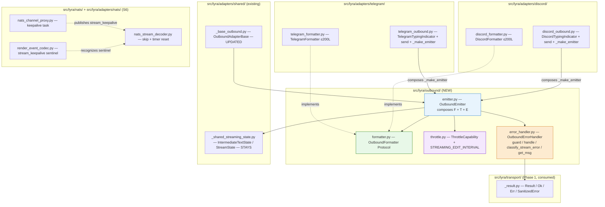
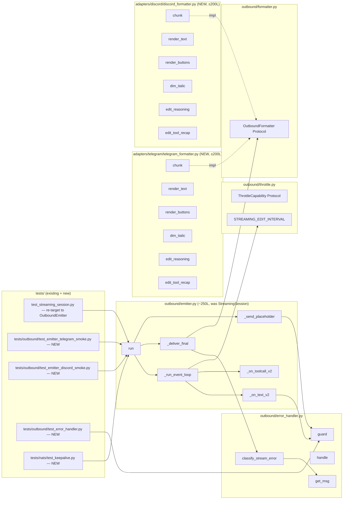

## Summary

Pivot outbound adapter layer from per-target axis to stage-axis composition. Create `src/lyra/outbound/{formatter,throttle,error_handler,emitter}.py`, migrate Telegram + Discord to compose stages, absorb #687 NATS keepalive, and add structural `.importlinter` layer rule.

## Architecture

### Data flow (config → load → compose → runtime)



### File × Function map



## Bootstrap Context

Parent epic #1277 (`artifacts/analyses/1277-stage-axis-refactor-strategy.mdx`) §5 prescribes the 3-layer composition pattern (domain → composed client → primitives). Phase 1 (#1278, closed) shipped `Result[T, E]`, `SanitizedError`, `WorkerPoolClient`, `NatsTransport` in `src/lyra/transport/` — direct templates for `OutboundErrorHandler` (mirrors `NatsTransport.sanitize()` discipline) and `OutboundEmitter` composition pattern (mirrors `WorkerPoolClient` constructor signature: explicit, public, keyword-friendly).

Reference patterns to follow:
- `src/lyra/transport/_result.py` — frozen dataclass Ok/Err/SanitizedError shape
- `src/lyra/transport/worker_pool_client.py` — composition constructor + no-second-layer invariant
- `tests/transport/` — boundary tests for sanitization (model for `tests/outbound/test_error_handler.py`)

Existing tests to preserve / re-target:
- `tests/adapters/test_streaming_session.py` (orchestrator behavior)
- `tests/adapters/test_streaming_session_tool_recap.py`
- `tests/adapters/test_streaming.py`
- `tests/adapters/test_streaming_emitter_toolcall_v2.py`
- `tests/adapters/test_telegram_outbound_render.py`, `test_telegram_outbound_send.py`
- `tests/adapters/test_discord_outbound.py`
- `tests/adapters/test_telegram_typing.py`, `test_discord_typing.py`
- `tests/adapters/test_base_outbound.py`
- `tests/adapters/test_nats_stream_decoder.py`
- `tests/nats/test_nats_channel_proxy.py`

## Agents

| Agent | Instance | Slices | Files |
|-------|----------|--------|-------|
| backend-dev | A | S1, S2, S3, S4 | `src/lyra/outbound/`, Telegram outbound, error handler, throttle |
| backend-dev | B | S5, S6 | Discord outbound, NATS keepalive (nats_channel_proxy, render_event_codec, nats_stream_decoder) |
| tester | A | all slices | New tests under `tests/outbound/`, `tests/nats/`; re-target existing tests |
| devops | A | S1, S7 | `.importlinter` (layer + forbidden contracts), `tools/file_exemptions.txt`, `tools/snapshots/` baseline |
| doc-writer | A | S7 | `src/lyra/outbound/CLAUDE.md` (new), `src/lyra/adapters/CLAUDE.md` (update) |

τ = F-lite. 2 parallel backend-dev instances target the wall-time reduction; doc-writer + devops run alongside in cleanup wave.

## Wave Structure

4 waves, max 3 parallel agents (backend-dev-A, backend-dev-B, tester-A). Elapsed ~5–7 days vs. ~10–12 days sequential.

| Wave | Trigger | Agents | Tasks |
|------|---------|--------|-------|
| 1 | start | 3 ∥ | backend-dev-A: T1→T2→T3→T4 (S1 scaffold) · backend-dev-B: T22→T23→T24 (S6 keepalive impl) · tester-A: T5 (S1 RED-GATE) + T25→T26 (S6 tests) |
| 2 | Wave 1 done | 2 ∥ | backend-dev-A: T6→T7→T8 (S2 error handler) · tester-A: T8b (S2 RED-GATE) |
| 3 | Wave 2 done | 2 ∥ | backend-dev-A: T9→T10→T11→T12 (S3 throttle) · tester-A: T12b (S3 RED-GATE) |
| 4 | Wave 3 done | 3 ∥ | backend-dev-A: T13→T14→T15→T16 (S4 Telegram) · backend-dev-B: T17→T18→T19→T20 (S5 Discord) · tester-A: T16b + T20b (S4 + S5 RED-GATE) |
| 5 | Wave 4 done | 2 ∥ | devops-A: T27→T28→T31 (S7 importlinter + snapshot + exemptions) · doc-writer-A: T29→T30 (S7 CLAUDE.md files) |

### Budget

| Task group | Items | Class | Est. ops | Split? |
|-----|------|-------|------|--------|
| S1 scaffold + relocate (T1–T5) | 5 | bounded | 12 | — |
| S2 error handler + guard migration (T6–T8b) | 4 | judgmental | 18 | — |
| S3 throttle + typing wrappers (T9–T12b) | 5 | bounded | 14 | — |
| S4 Telegram formatter + rewire (T13–T16b) | 5 | judgmental | 22 | — |
| S5 Discord formatter + rewire (T17–T20b) | 5 | judgmental | 22 | — |
| S6 NATS keepalive (T22–T26) | 5 | judgmental | 24 | — |
| S7 cleanup + docs + snapshots (T27–T31) | 5 | bounded | 14 | — |

**Total estimated ops: ~126** — distributed across 5 waves; max per-wave per-agent ≤ 25 ops (well under the 50-op force-split threshold).

## Consistency Report

- Slices covered: 7 / 7 (S1 scaffold + emitter relocate; S2 error handler; S3 throttle; S4 Telegram; S5 Discord; S6 keepalive; S7 cleanup)
- ACs covered: 22 / 22
- Breadboard affordances covered: N1–N8, S1–S3 — all referenced in micro-tasks below
- Uncovered: none
- Untraced: none
- Exemptions: none (no smart-splitting required at plan level; all tasks have explicit spec_trace)
- Open χ: 0 (all 3 resolved in spec)

## Micro-Tasks

Format: `T{n} | agent-instance | files | verify | difficulty | spec_trace`

### Slice 1 — Scaffold + Emitter Relocate

**T1** | backend-dev-A | `src/lyra/outbound/__init__.py` (NEW) | `python -c 'import lyra.outbound'` succeeds | 1/5 | SC-1 (N4)
- Create empty package marker

**T2** | backend-dev-A | `src/lyra/outbound/emitter.py` (NEW, relocated from `src/lyra/adapters/shared/_shared_streaming_emitter.py`) | `uv run pyright src/lyra/outbound/emitter.py` clean | 3/5 | SC-1 (N4)
- Move `StreamingSession` class verbatim → rename to `OutboundEmitter`
- Rename `PlatformCallbacks` import inside; keep dataclass intact at original path during S1 (will be split in S2/S3/S4)
- Preserve all internal helpers (`_on_text_v2`, `_on_toolcall_v2`, `_run_event_loop`, `_deliver_final`, `_send_placeholder`, `_drain_fallback`, etc.)
- Update `_default_no_op_*` callbacks references
- Code snippet:
  ```python
  # src/lyra/outbound/emitter.py
  class OutboundEmitter:
      """Platform-agnostic outbound streaming session (composes formatter + throttle + error_handler).
      Relocated from src/lyra/adapters/shared/_shared_streaming_emitter.StreamingSession.
      """
      def __init__(self, callbacks: PlatformCallbacks, outbound: OutboundMessage | None) -> None:
          # initial pre-S2 signature; S2 swaps in (formatter, typing, error_handler)
  ```

**T3** | backend-dev-A | `src/lyra/adapters/shared/_shared_streaming_emitter.py` (SHIM) | `grep "from lyra.outbound" src/lyra/adapters/shared/_shared_streaming_emitter.py` matches | 1/5 | SC-1 (N4)
- Replace file contents with `from lyra.outbound.emitter import OutboundEmitter as StreamingSession` + `from lyra.outbound.emitter import PlatformCallbacks`
- All existing imports continue to resolve via shim

**T4** | devops-A | `.importlinter` | `uv run lint-imports` green | 2/5 | SC-15 (importlinter structural)
- Insert `lyra.outbound` between `lyra.infrastructure` and `lyra.adapters` in `clean-architecture-layers` `layers =` stanza
- Code snippet:
  ```ini
  layers =
      lyra.bootstrap
      lyra.adapters
      lyra.outbound
      lyra.infrastructure
      lyra.llm | lyra.nats
      lyra.core
  ```
- Verify negative control: temporarily add `from lyra.adapters import discord` to a file in `outbound/`, run `lint-imports`, confirm fails; revert.

**T5 (RED-GATE)** | tester-A | `tests/adapters/test_streaming.py`, `test_streaming_session.py`, `test_streaming_emitter_toolcall_v2.py`, `test_streaming_session_tool_recap.py` | `uv run pytest tests/adapters/test_streaming*` green | 2/5 | SC-9 (existing tests preserved)
- Run full streaming test suite — all pass via shim (no test edits needed in S1)
- This is the slice RED-GATE: passing here proves the relocate is behaviorally invisible

### Slice 2 — OutboundErrorHandler + guard migration

**T6** | backend-dev-A | `src/lyra/outbound/error_handler.py` (NEW) | `uv run pyright src/lyra/outbound/error_handler.py` clean | 3/5 | SC-7 (N3 handle), SC-8 (guard)
- Create `OutboundErrorHandler` class with:
  ```python
  @dataclass(frozen=True)
  class _Context:
      context: str

  class OutboundErrorHandler:
      def __init__(self, get_msg: Callable[[str, str], str]) -> None:
          self._get_msg = get_msg

      def get_msg(self, key: str, fallback: str) -> str:
          return self._get_msg(key, fallback)

      def handle(self, exc: BaseException, *, context: str) -> SanitizedError:
          return SanitizedError(
              code=context,
              message=type(exc).__name__,  # never str(exc)
              retryable=False,
              detail=None,
          )

      async def guard(
          self,
          call: Callable[[], Awaitable[T]],
          *,
          context: str,
      ) -> Result[T, SanitizedError]:
          try:
              return Ok(await call())
          except Exception as exc:  # noqa: BLE001 — single catch site for all outbound boundaries
              log.debug("outbound boundary %s: %s", context, type(exc).__name__)
              return Err(self.handle(exc, context=context))

      def classify_stream_error(
          self,
          stream_error: Exception | None,
          *,
          had_tool_events: bool,
          final_text: str | None,
      ) -> str | None:
          # moved from _shared_streaming_state.classify_stream_error
          # signature loses msg_fn arg — uses self._get_msg
  ```
- Import `Result`, `Ok`, `Err`, `SanitizedError` from `lyra.transport._result`

**T7** | backend-dev-A | `src/lyra/outbound/emitter.py` | `grep -cE 'except Exception' src/lyra/outbound/emitter.py` ≤ 1 | 4/5 | SC-5, SC-6, SC-7 (broad-catch ≤5)
- Replace each `except Exception:  # noqa: BLE001` block in `OutboundEmitter` (13 sites listed in `_shared_streaming_emitter.py`) with `await self._handler.guard(lambda: self._cb.send_message(text), context="<site>")`
- Sites to migrate (from current `_shared_streaming_emitter.py`):
  - L146-149 `_ensure_trace_obj` trace placeholder failure
  - L196-198 `_maybe_emit_intermediate_recap` recap edit
  - L225-230 `_on_text_v2` intermediate edit
  - L256-260 `_drain_fallback` fallback send
  - L268-272 `_drain_fallback` fallback message_id
  - L344 `_run_event_loop` outer guard
  - L386-389 `_deliver_final` final recap edit
  - L411-414 `_deliver_final` error edit
  - L437-438 `run` peek error
- Add `self._handler: OutboundErrorHandler` to `OutboundEmitter.__init__`; for S2 it's still alongside the legacy `PlatformCallbacks`
- Update `_deliver_final` to use `self._handler.classify_stream_error` (and pass `self._handler.get_msg` where needed via `build_display_text`)

**T8** | backend-dev-A | `src/lyra/adapters/shared/_shared_streaming_state.py` | `grep "from lyra.outbound" src/lyra/adapters/shared/_shared_streaming_state.py` matches | 2/5 | SC-7 (classify migration)
- Add re-export shim: `from lyra.outbound.error_handler import classify_stream_error as _module_classify  # transitional`
- Keep `classify_stream_error` as a module-level function that delegates to the handler (for backwards compat during S2→S4; deleted in S7)

**T8b (RED-GATE)** | tester-A | `tests/outbound/test_error_handler.py` (NEW) | `uv run pytest tests/outbound/test_error_handler.py` green | 3/5 | SC-7 (sanitization, no str(exc) leak)
- New test file:
  - `test_handle_uses_type_name_only`: `handler.handle(httpx.ConnectError("server=10.0.0.5:4222 token=ABC"), context="test")` returns `SanitizedError(message="ConnectError", ...)` — assert `"10.0.0.5"` and `"token=ABC"` NOT in serialized form
  - `test_guard_returns_ok_on_success`: `await handler.guard(lambda: async_noop(), context="t")` returns `Ok(value)`
  - `test_guard_returns_err_on_exception`: `await handler.guard(lambda: async_raise(httpx.ConnectError("x")), context="t")` returns `Err(SanitizedError(message="ConnectError"))`
  - `test_classify_stream_error_timeout`: returns the timeout fallback string
  - `test_classify_stream_error_non_timeout_uses_type_name_only`: same hostname-leak check on the classified string

### Slice 3 — ThrottleCapability + emitter wiring

**T9** | backend-dev-A | `src/lyra/outbound/throttle.py` (NEW) | `uv run pyright src/lyra/outbound/throttle.py` clean | 2/5 | SC-1 (N2), SC-11 (debounce preserved)
- Define `ThrottleCapability` Protocol:
  ```python
  class ThrottleCapability(Protocol):
      edit_interval_s: float
      async def start_typing(self, scope_id: int) -> None: ...
      async def cancel_typing(self, scope_id: int) -> None: ...
  ```
- Move `STREAMING_EDIT_INTERVAL = 1.0` constant from `_shared_streaming_state.py` to here
- Add re-export shim in `_shared_streaming_state.py`: `STREAMING_EDIT_INTERVAL = throttle.STREAMING_EDIT_INTERVAL  # transitional`

**T10** | backend-dev-A | `src/lyra/outbound/emitter.py` | `OutboundEmitter.__init__` signature matches `(formatter, typing, error_handler, outbound)` | 3/5 | SC-1 (N4)
- Refactor constructor to keyword-only:
  ```python
  def __init__(
      self,
      *,
      formatter: OutboundFormatter,
      typing: ThrottleCapability,
      error_handler: OutboundErrorHandler,
      outbound: OutboundMessage | None,
  ) -> None:
      self._formatter = formatter
      self._typing = typing
      self._handler = error_handler
      self._outbound = outbound
      # …
  ```
- Replace `self._cb.start_typing` / `self._cb.cancel_typing` calls → `self._typing.start_typing(scope_id)` / `self._typing.cancel_typing(scope_id)`. Note signature change: typing methods are now async and take `scope_id` (was: 0-arg lambdas closed over scope_id). Adapter-side wrappers in T11 handle the conversion.
- Replace `STREAMING_EDIT_INTERVAL` import from `lyra.outbound.throttle` (not `_shared_streaming_state`)
- Keep `PlatformCallbacks` dataclass injection as a transitional path until S4/S5 swap-in: `OutboundEmitter` accepts EITHER the new 3-arg form OR the legacy callbacks (overloaded `__init__` or two factories: `from_callbacks(callbacks)` + `from_stages(formatter, typing, error_handler)`). The legacy path delegates to a thin adapter that wraps the dataclass back into Protocol shapes. Document in code comment.

**T11** | backend-dev-A | `src/lyra/adapters/telegram/telegram_outbound.py`, `src/lyra/adapters/discord/discord_outbound.py` | files contain `TelegramTypingIndicator` and `DiscordTypingIndicator` classes | 3/5 | SC-1 (N7, N8), SC-11
- Add `TelegramTypingIndicator` class to `telegram_outbound.py`:
  ```python
  class TelegramTypingIndicator:
      edit_interval_s: float = STREAMING_EDIT_INTERVAL
      def __init__(self, adapter: "TelegramAdapter") -> None:
          self._adapter = adapter
      async def start_typing(self, scope_id: int) -> None:
          self._adapter._start_typing(scope_id)
      async def cancel_typing(self, scope_id: int) -> None:
          self._adapter._cancel_typing(scope_id)
  ```
- Add `DiscordTypingIndicator` class to `discord_outbound.py` (analogous, wraps `adapter._start_typing`/`_cancel_typing`)
- Both wrap existing `_typing_worker` / `_discord_typing_worker` infrastructure (no behavior change)

**T12** | backend-dev-A | `src/lyra/adapters/shared/_base_outbound.py` | `send_streaming` builds OutboundEmitter via from_callbacks (legacy) for now | 2/5 | SC-1 (N4)
- Update import: `from lyra.outbound.emitter import OutboundEmitter`
- Replace `StreamingSession` construction with `OutboundEmitter.from_callbacks(self._make_streaming_callbacks(...), outbound)`
- ¬change abstract method signatures (S4/S5 will replace `_make_streaming_callbacks` with `_make_emitter`)

**T12b (RED-GATE)** | tester-A | full `tests/adapters/test_streaming*`, `test_telegram_typing.py`, `test_discord_typing.py` | `uv run pytest tests/adapters/test_streaming* tests/adapters/test_*typing*` green | 2/5 | SC-9, SC-11, SC-19
- All streaming + typing tests pass via legacy `from_callbacks` path
- Slice 3 RED-GATE: throttle Protocol introduced without breaking existing behavior

### Slice 4 — OutboundFormatter Protocol + Telegram migration

**T13** | backend-dev-A | `src/lyra/outbound/formatter.py` (NEW) | `uv run pyright src/lyra/outbound/formatter.py` clean | 3/5 | SC-1 (N1)
- Define `OutboundFormatter` Protocol with 7 methods:
  ```python
  class OutboundFormatter(Protocol):
      def placeholder_text(self) -> str: ...
      def chunk(self, text: str) -> list[str]: ...
      def render_text(self, text: str) -> list[str]: ...
      def render_buttons(self, buttons: Any) -> Any | None: ...
      def dim_italic(self, text: str) -> str: ...
      async def edit_reasoning(
          self, trace_obj: Any, event: ReasoningStart|Delta|End
      ) -> None: ...
      async def edit_tool_recap(
          self, trace_obj: Any, lines: list[str], done: bool
      ) -> None: ...
  ```
- Provide module-level `_default_no_op_edit_reasoning` and `_default_no_op_edit_tool_recap` (moved from `_shared_streaming_emitter.py`). Concrete formatter classes inherit defaults if they choose not to override.

**T14** | backend-dev-A | `src/lyra/adapters/telegram/telegram_formatter.py` (NEW, ≤200 LOC) | `wc -l < src/lyra/adapters/telegram/telegram_formatter.py` ≤ 200 | 4/5 | SC-2 (Telegram formatter ≤200L), SC-1 (N5)
- Create `TelegramFormatter` implementing `OutboundFormatter` Protocol
- Move logic from `telegram_outbound.build_streaming_callbacks` closures:
  - `_render_text` chunking (from `telegram_formatting`) → `chunk()` + `render_text()`
  - `_render_buttons` (from `telegram_formatting`) → `render_buttons()`
  - `_dim_italic` (from `telegram_outbound`) → `dim_italic()`
  - `_render_reasoning` closure (lines 307-355) → `edit_reasoning()` instance method
  - `_edit_tool_recap` closure (lines 270-291) → `edit_tool_recap()` instance method
  - `_placeholder_text` lookup → `placeholder_text()`
- Constructor: `def __init__(self, adapter: TelegramAdapter, chat_id: int, get_msg: Callable, …)` — captures the same context the closures had
- Code snippet skeleton (~120 LOC, well under target):
  ```python
  class TelegramFormatter:
      def __init__(self, adapter: TelegramAdapter, chat_id: int, get_msg, placeholder_text: str) -> None: ...
      def placeholder_text(self) -> str: return self._placeholder_text
      def chunk(self, text: str) -> list[str]: return _render_text(text) or [text]
      def render_text(self, text: str) -> list[str]: return _render_text(text)
      def render_buttons(self, buttons): return _render_buttons(buttons)
      def dim_italic(self, text: str) -> str: return f"*{text}*"
      async def edit_reasoning(self, trace_obj, event): ...  # (~30 LOC)
      async def edit_tool_recap(self, trace_obj, lines, done): ...  # (~15 LOC)
  ```

**T15** | backend-dev-A | `src/lyra/adapters/telegram/telegram_outbound.py` + `src/lyra/adapters/telegram/telegram.py` | `wc -l < src/lyra/adapters/telegram/telegram_outbound.py` < 200 (reduced from 369) | 4/5 | SC-1 (composes), SC-9
- Delete `build_streaming_callbacks` (212 LOC closure factory)
- Replace `TelegramAdapter._make_streaming_callbacks` → `_make_emitter(original_msg, outbound) → OutboundEmitter`:
  ```python
  def _make_emitter(self, original_msg, outbound) -> OutboundEmitter:
      meta = _validate_inbound(original_msg, "send_streaming")
      if meta is None:
          return _bad_message_emitter(self, outbound)  # 8-line noop variant
      chat_id, _, _ = meta
      placeholder_text = self._msg("stream_placeholder", "…")
      formatter = TelegramFormatter(self, chat_id=chat_id, get_msg=self._msg, placeholder_text=placeholder_text)
      typing = TelegramTypingIndicator(self)
      handler = OutboundErrorHandler(get_msg=self._msg)
      return OutboundEmitter(formatter=formatter, typing=typing, error_handler=handler, outbound=outbound)
  ```
- Keep `send()` (lines 120-160) unchanged — it doesn't go through the emitter
- Keep `_typing_worker` + `_typing_loop` (lines 52-117) — wrapped by `TelegramTypingIndicator`

**T16** | backend-dev-A | `src/lyra/adapters/shared/_base_outbound.py` | concrete `send_streaming` calls `_make_emitter` not `_make_streaming_callbacks` | 3/5 | SC-1 (N4)
- Update `OutboundAdapterBase`:
  ```python
  class OutboundAdapterBase(ABC):
      @abstractmethod
      def _make_emitter(self, original_msg, outbound) -> OutboundEmitter: ...

      async def send_streaming(self, original_msg, events, outbound=None):
          emitter = self._make_emitter(original_msg, outbound)
          await emitter.run(events)
  ```
- Remove `_make_streaming_callbacks` abstract method (S4 + S5 must both ship `_make_emitter` for this to compile — coordinate Wave 4)
- MRO: no `__init__` added (preserve Discord constraint)

**T16b (RED-GATE)** | tester-A | `tests/outbound/test_emitter_telegram_smoke.py` (NEW) + `tests/adapters/test_telegram_outbound_send.py` + `test_telegram_outbound_render.py` | `uv run pytest tests/outbound/test_emitter_telegram_smoke.py tests/adapters/test_telegram_*` green | 4/5 | SC-9, SC-10, SC-19
- New smoke test:
  ```python
  async def test_telegram_outbound_emitter_sends_three_chunks(mock_telegram_adapter, sample_outbound_msg):
      events = aiter([
          TextStartRenderEvent(),
          TextDeltaRenderEvent(delta="Hello"),
          TextDeltaRenderEvent(delta=" world"),
          TextEndRenderEvent(),
      ])
      emitter = mock_telegram_adapter._make_emitter(sample_inbound_msg, sample_outbound_msg)
      await emitter.run(events)
      assert mock_telegram_adapter.bot.send_message.call_count >= 1
      kwargs = mock_telegram_adapter.bot.send_message.call_args_list[0].kwargs
      assert kwargs["parse_mode"] == "MarkdownV2"
      assert kwargs.get("reply_to_message_id") is not None
  ```
- Re-run existing Telegram outbound tests; expected to pass with no edits (behavioral parity)

### Slice 5 — Discord migration (parallel with S4)

**T17** | backend-dev-B | `src/lyra/adapters/discord/discord_formatter.py` (NEW, ≤200 LOC) | `wc -l < src/lyra/adapters/discord/discord_formatter.py` ≤ 200 | 4/5 | SC-3 (Discord formatter ≤200L), SC-1 (N6)
- Create `DiscordFormatter` implementing `OutboundFormatter`
- Move logic from `discord_outbound.build_streaming_callbacks` closures:
  - `render_text` (from `discord_formatting`) → `chunk()` + `render_text()`
  - `render_buttons` (from `discord_formatting`) → `render_buttons()`
  - `_dim_italic` (lines 163-169) → `dim_italic()`
  - `_render_reasoning` closure (lines 300-346) → `edit_reasoning()` instance method
  - `_edit_tool_recap` closure (lines 283-298, uses `discord.Embed`) → `edit_tool_recap()` instance method
- Constructor captures `adapter`, `send_to_id`, `should_reply`, `reply_msg_id`, `get_msg`, `placeholder_text`

**T18** | backend-dev-B | `src/lyra/adapters/discord/discord_outbound.py` | `wc -l < src/lyra/adapters/discord/discord_outbound.py` < 200 (reduced from 361) | 4/5 | SC-1 (composes), SC-9
- Delete `build_streaming_callbacks` (210 LOC closure factory)
- Replace `DiscordAdapter._make_streaming_callbacks` → `_make_emitter`
- Keep `send()` (lines 110-160) — does not go through emitter
- Keep `_discord_typing_worker` (lines 48-108) — wrapped by `DiscordTypingIndicator`

**T19** | backend-dev-B | `src/lyra/adapters/discord/adapter.py` (DiscordAdapter class) | `DiscordAdapter._make_emitter` defined | 2/5 | SC-1
- Implement `_make_emitter(original_msg, outbound) → OutboundEmitter` mirror of Telegram pattern
- MRO check: confirm `DiscordAdapter.__init__` still flows to `discord.Client(intents=intents)` via `super().__init__(intents=intents)` — no changes needed but verify by smoke test
- Remove `_make_streaming_callbacks` (replaced by `_make_emitter`)

**T20** | backend-dev-B | `src/lyra/adapters/discord/discord_outbound.py` cleanup | Discord `send_streaming` no longer references `PlatformCallbacks` | 2/5 | SC-1
- Final pass: delete dead imports, ensure both formatter + typing wired

**T20b (RED-GATE)** | tester-A | `tests/outbound/test_emitter_discord_smoke.py` (NEW) + `tests/adapters/test_discord_outbound.py` + `test_discord_reasoning.py` + `test_discord_tool_recap.py` | `uv run pytest tests/outbound/test_emitter_discord_smoke.py tests/adapters/test_discord_*` green | 4/5 | SC-9, SC-11, SC-19
- New smoke test (Discord analogue of T16b)
- Re-run existing Discord outbound/reasoning/recap tests

### Slice 6 — #687 NATS keepalive (parallel with S1-S5)

**T22** | backend-dev-B | `src/lyra/nats/nats_channel_proxy.py` | `NatsChannelProxy.send_streaming` has a keepalive task started/cancelled with the events loop | 4/5 | SC-12 (keepalive every 30s)
- Add keepalive constants:
  ```python
  KEEPALIVE_INTERVAL_S = 30.0
  KEEPALIVE_EVENT_TYPE = "stream_keepalive"
  ```
- Wrap the `async for event in events:` loop in `send_streaming` with a parallel keepalive task:
  ```python
  async def _keepalive_loop(stream_id, last_publish, seq_alloc):
      while True:
          await asyncio.sleep(KEEPALIVE_INTERVAL_S)
          if time.monotonic() - last_publish[0] >= KEEPALIVE_INTERVAL_S:
              # publish stream_keepalive envelope
              ...
  ```
- Allocate seq from the same counter so ordering invariants hold
- Task cancelled on stream end, error, or publisher exception
- Log at DEBUG level only

**T23** | backend-dev-B | `src/lyra/nats/render_event_codec.py` | `_SYNTHETIC_TERMINALS` (or equivalent) recognizes `stream_keepalive` as non-terminal | 3/5 | SC-13 (codec sentinel)
- Add `stream_keepalive` to the codec's known sentinel set parallel to `stream_error`
- Decode logic: if `event_type == "stream_keepalive"` → return sentinel marker (NOT a render event), no error

**T24** | backend-dev-B | `src/lyra/adapters/nats/nats_stream_decoder.py` | `decode_stream_events` skips `stream_keepalive` chunks AND resets per-chunk timer | 4/5 | SC-13, SC-14
- Inside the per-chunk read loop, after decoding the envelope: if `event_type == "stream_keepalive"`, reset `_CHUNK_TIMEOUT_SECONDS` timer (e.g. `last_chunk_at = time.monotonic()`) but do NOT yield to caller
- Continue loop without raising or returning

**T25** | tester-A | `tests/nats/test_keepalive.py` (NEW) | `uv run pytest tests/nats/test_keepalive.py` green | 4/5 | SC-12, SC-13, SC-14, SC-20 (timer reset proof)
- `test_publishes_keepalive_during_idle`: mock NATS producer that idles for 90s; assert ≥3 `stream_keepalive` envelopes published; seq monotonic
- `test_decoder_skips_keepalive_no_yield`: feed decoder a stream of [real chunk, keepalive, keepalive, real chunk]; assert exactly 2 yields and no `StreamChunkTimeout` raised
- `test_dead_stream_no_keepalive_raises_timeout`: with override `_CHUNK_TIMEOUT_SECONDS=5`, no keepalives, no chunks → `StreamChunkTimeout` raised
- `test_keepalive_seq_does_not_corrupt_real_chunk_seq`: interleave keepalives + real chunks; assert real-chunk seq still monotonic from real-chunk consumer's perspective

**T26** | tester-A | `tests/nats/test_keepalive.py` (NEW, additional test) | old-adapter compat test green | 3/5 | SC-21 (old-adapter compat)
- `test_old_adapter_ignores_unknown_event_type`: simulate pre-PR adapter codec receiving a `stream_keepalive` chunk; assert no crash, logged as "unknown event_type" warning, decoder continues. (Implementation: patch the codec to its pre-PR shape, feed a keepalive envelope, assert behavior.)

### Slice 7 — Cleanup + Docs + Snapshots

**T27** | devops-A | `src/lyra/adapters/shared/_shared_streaming_emitter.py`, `_shared_streaming.py`, `_shared_streaming_state.py` shim entries | files deleted ∨ shim entries removed | 2/5 | SC-4 (shim deleted)
- Delete `src/lyra/adapters/shared/_shared_streaming_emitter.py` (was shim since S1; safe after S4+S5)
- Delete `_shared_streaming.py` if it became vestigial after S4+S5; otherwise keep with import-fix
- Remove the `classify_stream_error` re-export shim from `_shared_streaming_state.py` (S2 added it)
- Remove the `STREAMING_EDIT_INTERVAL` re-export shim from `_shared_streaming_state.py` (S3 added it)
- IntermediateTextState + StreamState stay (per resolved Open Q 2)

**T28** | devops-A | `.importlinter` | `forbidden` contract added for `adapters.shared._shared_streaming_emitter` | 2/5 | SC-16 (forbidden contract)
- Add new contract:
  ```ini
  [importlinter:contract:no-streaming-emitter-shim]
  name = adapters must not re-introduce the legacy streaming-emitter shim
  type = forbidden
  source_modules =
      lyra.adapters
  forbidden_modules =
      lyra.adapters.shared._shared_streaming_emitter
  ```

**T29** | doc-writer-A | `src/lyra/outbound/CLAUDE.md` (NEW) | file exists with required sections | 2/5 | SC-17 (CLAUDE.md content)
- Sections: Purpose, Layer contract (formatter/throttle/error_handler/emitter), Key invariants (no second CB layer, no `__init__` on OutboundAdapterBase, SanitizedError-only bus paths), Composition example, ADR pending — Phase 7 forward link
- Follow `src/lyra/transport/CLAUDE.md` shape

**T30** | doc-writer-A | `src/lyra/adapters/CLAUDE.md`, project `CLAUDE.md` | references updated; `PlatformCallbacks` line replaced with stage roster | 2/5 | SC-17 (CLAUDE.md updates)
- `src/lyra/adapters/CLAUDE.md`: replace `PlatformCallbacks contract` section heading with `OutboundFormatter / ThrottleCapability / OutboundErrorHandler stage contracts` + link to `src/lyra/outbound/CLAUDE.md`
- Project `CLAUDE.md`: add `src/lyra/outbound/CLAUDE.md` to the file table (alphabetical insertion after `src/lyra/nats/CLAUDE.md`)

**T31** | devops-A | `tools/snapshots/1279-outbound-baseline.txt` (NEW) + `tools/file_exemptions.txt` | snapshot file present; exemptions trimmed | 3/5 | SC-22 (6m baseline), SC-18 (exemptions)
- Generate snapshot:
  ```bash
  {
    echo "## Outbound bus-bound baseline — captured at merge of #1279"
    echo "### except (Exception|BaseException) count"
    grep -rnE 'except (Exception|BaseException)' src/lyra/outbound src/lyra/adapters/telegram/telegram_outbound.py src/lyra/adapters/discord/discord_outbound.py || true
    echo
    echo "### wc -l for new outbound files"
    wc -l src/lyra/outbound/*.py src/lyra/adapters/telegram/telegram_formatter.py src/lyra/adapters/discord/discord_formatter.py
    echo
    echo "### sibling-fix PRs since 2026-05-19 on outbound bus-bound classes"
    gh pr list --search 'in:title str(exc) OR boundary-broad-catch outbound' --state merged --limit 50 --json number,title,mergedAt
  } > tools/snapshots/1279-outbound-baseline.txt
  ```
- Commit the file in the same PR
- Remove `_shared_streaming_emitter.py`, `telegram_outbound.py`, `discord_outbound.py` from `tools/file_exemptions.txt` if they were exempted (verify by `grep ` first; if absent, no-op)
- Add `DEBT:enforcement-deferred` annotation to `src/lyra/outbound/CLAUDE.md` for pre-commit `str(exc)` check

## Task Seeding Blueprint

<!-- Used by /implement to seed TaskCreate calls on session start.
     Format: T{n} | agent-instance | blockedBy | subject
     blockedBy refs T-numbers within this list (not session task IDs).
     Agent instances are named so parallel tasks map to distinct spawned agents.
     Seed in wave order; within a wave all rows are parallel (∥). -->

### Wave 1 — no deps, 3 agents ∥

| Task | Agent instance | blockedBy | Subject |
|------|---------------|-----------|---------|
| T1 | backend-dev-A | — | Scaffold `src/lyra/outbound/__init__.py` |
| T2 | backend-dev-A | T1 | Relocate StreamingSession → `src/lyra/outbound/emitter.py` as OutboundEmitter |
| T3 | backend-dev-A | T2 | Add re-export shim at `_shared_streaming_emitter.py` |
| T4 | devops-A | T2 | Insert `lyra.outbound` into `.importlinter` layers stanza |
| T5 | tester-A | T3,T4 | S1 RED-GATE: existing streaming tests pass via shim |
| T22 | backend-dev-B | — | NatsChannelProxy.send_streaming keepalive task (30s) |
| T23 | backend-dev-B | T22 | Codec sentinel for stream_keepalive (parallel to stream_error) |
| T24 | backend-dev-B | T23 | nats_stream_decoder skip + timer reset |
| T25 | tester-A | T24 | tests/nats/test_keepalive.py — keepalive + decoder + dead-stream + seq tests |
| T26 | tester-A | T23 | tests/nats/test_keepalive.py — old-adapter compat test |

### Wave 2 — after T5, 2 agents ∥

| Task | Agent instance | blockedBy | Subject |
|------|---------------|-----------|---------|
| T6 | backend-dev-A | T5 | Create OutboundErrorHandler at `src/lyra/outbound/error_handler.py` (handle/guard/classify_stream_error/get_msg) |
| T7 | backend-dev-A | T6 | Migrate 13 broad-catch sites in emitter.py to `handler.guard(...)` |
| T8 | backend-dev-A | T6 | Add classify_stream_error re-export shim in `_shared_streaming_state.py` |
| T8b | tester-A | T6,T7 | S2 RED-GATE: tests/outbound/test_error_handler.py — sanitization + guard + classify |

### Wave 3 — after T8b, 2 agents ∥

| Task | Agent instance | blockedBy | Subject |
|------|---------------|-----------|---------|
| T9 | backend-dev-A | T8b | Create `src/lyra/outbound/throttle.py` — ThrottleCapability Protocol + STREAMING_EDIT_INTERVAL move |
| T10 | backend-dev-A | T9 | Refactor OutboundEmitter constructor to (formatter, typing, error_handler) keyword-only; legacy from_callbacks path |
| T11 | backend-dev-A | T9 | Add TelegramTypingIndicator and DiscordTypingIndicator classes |
| T12 | backend-dev-A | T10 | Update OutboundAdapterBase.send_streaming to construct OutboundEmitter |
| T12b | tester-A | T10,T11,T12 | S3 RED-GATE: streaming + typing tests pass via legacy from_callbacks path |

### Wave 4 — after T12b, 3 agents ∥

| Task | Agent instance | blockedBy | Subject |
|------|---------------|-----------|---------|
| T13 | backend-dev-A | T12b | Define OutboundFormatter Protocol with 7 methods at `src/lyra/outbound/formatter.py` |
| T14 | backend-dev-A | T13 | Create TelegramFormatter at `src/lyra/adapters/telegram/telegram_formatter.py` (≤200L) |
| T15 | backend-dev-A | T14 | Rewire TelegramAdapter._make_emitter; delete build_streaming_callbacks |
| T16 | backend-dev-A | T15,T19 | Update OutboundAdapterBase — replace _make_streaming_callbacks with _make_emitter |
| T16b | tester-A | T15 | S4 RED-GATE: tests/outbound/test_emitter_telegram_smoke.py + existing Telegram tests |
| T17 | backend-dev-B | T13 | Create DiscordFormatter at `src/lyra/adapters/discord/discord_formatter.py` (≤200L) |
| T18 | backend-dev-B | T17 | Rewire discord_outbound.py — delete build_streaming_callbacks |
| T19 | backend-dev-B | T18 | Update DiscordAdapter._make_emitter; verify MRO unchanged |
| T20 | backend-dev-B | T19 | discord_outbound.py final pass — delete dead imports |
| T20b | tester-A | T19 | S5 RED-GATE: tests/outbound/test_emitter_discord_smoke.py + existing Discord tests |

### Wave 5 — after T16, T20, T25, T26, 2 agents ∥

| Task | Agent instance | blockedBy | Subject |
|------|---------------|-----------|---------|
| T27 | devops-A | T16,T20 | Delete `_shared_streaming_emitter.py` + shim entries in `_shared_streaming_state.py` |
| T28 | devops-A | T27 | Add forbidden `.importlinter` contract for legacy shim path |
| T31 | devops-A | T16b,T20b,T25,T26 | Generate `tools/snapshots/1279-outbound-baseline.txt` (6m baseline) + trim exemptions |
| T29 | doc-writer-A | T16,T20 | Create `src/lyra/outbound/CLAUDE.md` (Purpose, contracts, invariants, ADR forward link) |
| T30 | doc-writer-A | T29 | Update `src/lyra/adapters/CLAUDE.md` and project `CLAUDE.md` references |

## Task IDs

<!-- Generated by /plan. Used by /implement to resume tasks on session restart. -->
- T1: 13 — Scaffold src/lyra/outbound/__init__.py
- T2: 14 — Relocate StreamingSession → emitter.py as OutboundEmitter
- T3: 15 — Add re-export shim at _shared_streaming_emitter.py
- T4: 16 — Insert lyra.outbound into .importlinter layers stanza
- T5: 17 — S1 RED-GATE: streaming tests pass via shim
- T6: 18 — Create OutboundErrorHandler at error_handler.py
- T7: 19 — Migrate 13 broad-catch sites in emitter.py to handler.guard(...)
- T8: 20 — Re-export classify_stream_error in _shared_streaming_state.py
- T8b: 21 — S2 RED-GATE: tests/outbound/test_error_handler.py
- T9: 22 — Create throttle.py with ThrottleCapability Protocol
- T10: 23 — Refactor OutboundEmitter constructor to keyword-only (formatter, typing, error_handler)
- T11: 24 — Add TelegramTypingIndicator and DiscordTypingIndicator classes
- T12: 25 — Update OutboundAdapterBase.send_streaming via from_callbacks
- T12b: 26 — S3 RED-GATE: streaming + typing tests pass
- T13: 27 — Define OutboundFormatter Protocol at formatter.py
- T14: 28 — Create TelegramFormatter (≤200 LOC)
- T15: 29 — Rewire TelegramAdapter._make_emitter
- T16: 30 — Update OutboundAdapterBase — _make_emitter
- T16b: 31 — S4 RED-GATE: Telegram smoke + existing Telegram tests
- T17: 32 — Create DiscordFormatter (≤200 LOC)
- T18: 33 — Rewire discord_outbound.py
- T19: 34 — Update DiscordAdapter._make_emitter; verify MRO
- T20: 35 — discord_outbound.py final pass
- T20b: 36 — S5 RED-GATE: Discord smoke + existing Discord tests
- T22: 37 — NatsChannelProxy.send_streaming keepalive task (30s)
- T23: 38 — Codec sentinel for stream_keepalive
- T24: 39 — nats_stream_decoder skip + timer reset
- T25: 40 — tests/nats/test_keepalive.py — core tests
- T26: 41 — tests/nats/test_keepalive.py — old-adapter compat test
- T27: 42 — Delete _shared_streaming_emitter.py shim + state shim entries
- T28: 43 — Add forbidden .importlinter contract
- T29: 44 — Create src/lyra/outbound/CLAUDE.md
- T30: 45 — Update adapters/CLAUDE.md and project CLAUDE.md
- T31: 46 — Generate tools/snapshots/1279-outbound-baseline.txt + trim exemptions
