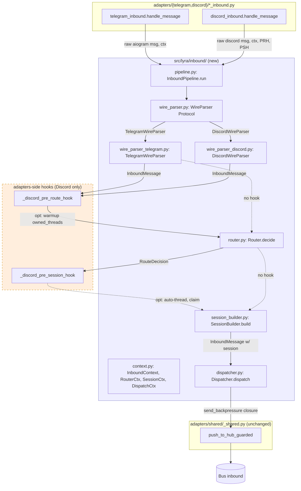
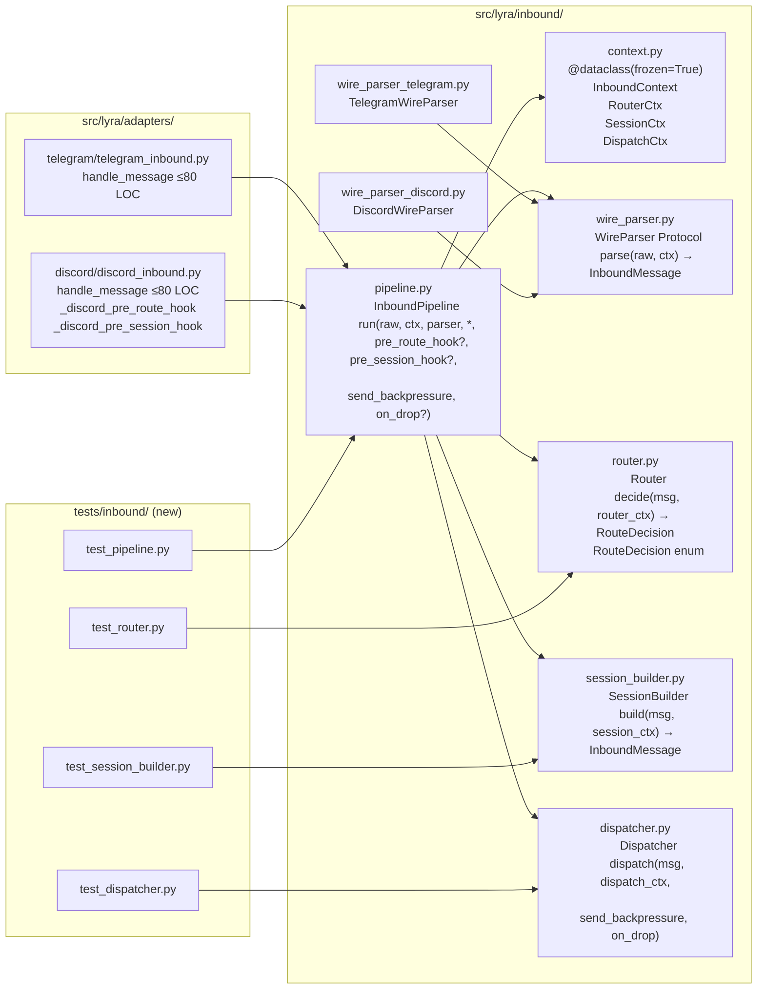

## Summary

Extract the inbound message pipeline (parse → optional pre_route_hook → route → optional pre_session_hook → session → dispatch) from per-platform adapter files into per-stage modules under `src/lyra/inbound/`. Six slices ship as one PR; intermediate slices tolerate a temporary wiring seam that Slice 6 drains.

## Architecture

### Data flow



### File × function map



## Agents

| Agent | Instance | Task count | Files (primary) |
|---|---|---|---|
| backend-dev | backend-dev-A | 22 | `src/lyra/inbound/*.py` (new), `src/lyra/adapters/{telegram,discord}/*_inbound.py` (modify), `src/lyra/adapters/discord/adapter.py` (touch for context build) |
| tester | tester-A | 9 (incl. 6 RED-GATE) | `tests/inbound/test_*.py` (new), regression gates |
| doc-writer | doc-writer-A | 5 | `src/lyra/inbound/CLAUDE.md` (new), `CLAUDE.md` (root, key files table), `src/lyra/adapters/CLAUDE.md` (cross-ref) |
| devops | devops-A | 1 | Run all quality gates (lint, typecheck, file-length, folder-size, import-layers, pytest) |

## Wave Structure

6 waves, max 3 parallel agents per wave (backend-dev-A + tester-A + doc-writer-A in slice 1; smaller fan-out subsequently). Sequential by slice (each depends on prior). Elapsed estimate: ~1–1.5 weeks vs ~2 weeks sequential single-agent. Slice boundaries are RED-GATEs.

| Wave | Trigger | Agents | Tasks |
|---|---|---|---|
| 1 | start | backend-dev-A · doc-writer-A · tester-A | backend-dev-A: T1→T2→T3→T4→T5→T6→T7 · doc-writer-A: T8→T9 · tester-A: T10 |
| 2 | Wave 1 done (skeleton compiles) | backend-dev-A · tester-A | backend-dev-A: T11→T13→T14 · tester-A: T12 [P] · tester-A: T15 |
| 3 | Wave 2 done (Dispatcher live) | backend-dev-A · tester-A | backend-dev-A: T16→T18→T19→T20 · tester-A: T17 [P] · tester-A: T21 |
| 4 | Wave 3 done (Router live) | backend-dev-A · tester-A | backend-dev-A: T22→T24→T25 · tester-A: T23 [P] · tester-A: T26 |
| 5 | Wave 4 done (SessionBuilder live) | backend-dev-A · tester-A | backend-dev-A: T27→T28→T29→T30→T31→T33→T34 · tester-A: T32 [P] · tester-A: T35 |
| 6 | Wave 5 done (Pipeline live) | backend-dev-A · doc-writer-A · devops-A · tester-A | backend-dev-A: T36→T37→T38 · doc-writer-A: T39→T40 · devops-A: T41 · tester-A: T42 |

### Budget

| Task | Items | Class | Est. ops | Split? |
|---|---|---|---|---|
| T1–T7 (skeleton stubs) | 7 | trivial | 14 | — |
| T8–T9 (CLAUDE.md + register) | 2 | bounded | 5 | — |
| T10 (RED-GATE skeleton) | 1 | bounded | 2 | — |
| T11 (Dispatcher impl) | 1 | judgmental | 5 | — |
| T12 (Dispatcher tests) | 1 | judgmental | 5 | — |
| T13–T14 (adapter wiring Dispatcher) | 2 | bounded | 5 | — |
| T15 (RED-GATE Dispatcher) | 1 | bounded | 3 | — |
| T16 (Router impl) | 1 | judgmental | 5 | — |
| T17 (Router tests) | 1 | judgmental | 5 | — |
| T18–T19 (adapter wiring Router) | 2 | bounded | 5 | — |
| T20 (pre_route_hook impl) | 1 | judgmental | 5 | — |
| T21 (RED-GATE Router) | 1 | bounded | 3 | — |
| T22 (SessionBuilder impl) | 1 | judgmental | 6 | — |
| T23 (SessionBuilder tests) | 1 | judgmental | 5 | — |
| T24–T25 (adapter wiring SessionBuilder) | 2 | bounded | 5 | — |
| T26 (RED-GATE SessionBuilder) | 1 | bounded | 3 | — |
| T27 (WireParser Protocol) | 1 | trivial | 2 | — |
| T28–T29 (Telegram + Discord parser impl) | 2 | bounded | 6 | — |
| T30 (pre_session_hook impl) | 1 | judgmental | 6 | — |
| T31 (InboundPipeline.run impl) | 1 | judgmental | 6 | — |
| T32 (Pipeline tests) | 1 | judgmental | 5 | — |
| T33–T34 (adapter wiring Pipeline) | 2 | bounded | 5 | — |
| T35 (RED-GATE Pipeline) | 1 | bounded | 3 | — |
| T36 (telegram_inbound shrink) | 1 | bounded | 3 | — |
| T37 (discord_inbound shrink) | 1 | bounded | 3 | — |
| T38 (DEBT carry-over audit) | 1 | judgmental | 5 | — |
| T39 (adapters/CLAUDE.md cross-ref) | 1 | bounded | 2 | — |
| T40 (inbound/CLAUDE.md final) | 1 | bounded | 3 | — |
| T41 (devops gates) | 1 | bounded | 3 | — |
| T42 (RED-GATE final) | 1 | bounded | 3 | — |

**Total estimated ops: ~135** (sustainable for F-lite; no task ≥ 50 ops → no force-split).

## Consistency Report

Spec has ~25 acceptance criteria across Structural, LOC, DEBT, Tests, Documentation. All criteria traced to ≥1 task:

| Criterion | Traced to task(s) |
|---|---|
| `src/lyra/inbound/` dir + files | T1–T7 |
| `WireParser` Protocol; impls in `inbound/` | T27, T28, T29 |
| `router.py` no platform imports | T16 |
| `session_builder.py` no platform imports + 3-case handling | T22 |
| `Dispatcher.dispatch` signature w/ `send_backpressure` per-call | T11 |
| Frozen ctx + mutable contents documented | T2, T40 |
| `telegram_inbound.handle_message` ≤ 80 LOC | T36, T42 |
| `discord_inbound.handle_message` ≤ 80 LOC | T37, T42 |
| Every file ≤ 300 LOC | T41, T42 |
| Folder ≤ 12 files | T41 |
| No `# noqa: C901`/`PLR0915` in inbound | T36, T37, T41 |
| `wiring-bootstrap-deps` noqa on `discord_inbound:29` removed | T37 |
| 3 `BLE001 — boundary-broad-catch` sites → 0 | T38 |
| 1 `TRY401 — boundary-broad-catch` site → 0 | T38 |
| `_shared.py` `push_to_hub_guarded` noqa NOT drained (documented) | T38 (audit doc) |
| Epic DEBT slug correction note | T38 |
| `test_router.py` | T17 |
| `test_session_builder.py` | T23 |
| `test_dispatcher.py` | T12 |
| `test_pipeline.py` | T32 |
| Existing integration tests pass | T15, T21, T26, T35, T42 |
| Smoke evidence attached to PR | T42 (smoke run + capture) |
| `src/lyra/inbound/CLAUDE.md` + root register | T8, T9, T40 |
| `src/lyra/adapters/CLAUDE.md` cross-ref | T39 |
| PR description references spec + correction | (delivered at /pr step, not micro-task) |

**Untraced criteria:** 0. **Exemptions:** 0.

## Bootstrap Context

- **Spec:** `artifacts/specs/1280-phase-3-inbound-stages-spec.mdx` (approved 2026-05-20)
- **Frame:** `artifacts/frames/1280-phase-3-inbound-stages-frame.mdx`
- **Strategy doc (SSoT):** `artifacts/analyses/1277-stage-axis-refactor-strategy.mdx`
- **Epic:** #1277 (stage-axis decomposition)
- **Reference pattern for `Protocol`:** `src/lyra/core/hub/hub_protocol.py` (ChannelAdapter, RoutingKey)
- **Reference pattern for store ports:** `src/lyra/core/stores/thread_store_protocol.py`
- **Reference for adapter CLAUDE.md style:** `src/lyra/adapters/CLAUDE.md`
- **NC2 refinement:** pipeline gains `pre_route_hook` (resolved during /plan, committed `a40dc78b`)

## Micro-Tasks

Format per task: `T{n} [Agent · Slice · Phase · Difficulty]` Description / File / Verify / Expected / Spec trace.

### Slice 1 — Skeleton (Wave 1)

#### T1 [backend-dev-A · V1 · GREEN · 1]
Create `src/lyra/inbound/__init__.py` — empty module marker.
- **File:** `src/lyra/inbound/__init__.py`
- **Code:** `""" Inbound pipeline stages (parse → route → session → dispatch)."""`
- **Verify:** `test -f src/lyra/inbound/__init__.py`
- **Expected:** file exists
- **Spec trace:** SC-structural-dir-exists

#### T2 [backend-dev-A · V1 · GREEN · 2]
Create `src/lyra/inbound/context.py` — define 4 frozen dataclasses with documented mutability contract.
- **File:** `src/lyra/inbound/context.py`
- **Code skeleton:** `@dataclass(frozen=True) RouterCtx { bot_id: str; owned_threads: set[int]; watch_channels: frozenset[int] | None }`, similar for `SessionCtx { turn_store, thread_store, thread_sessions_cache: dict[str, ThreadSession] }`, `DispatchCtx { inbound_bus, circuit_registry, outbound_listener, typing, msg_catalog }`, `InboundContext { router: RouterCtx; session: SessionCtx; dispatch: DispatchCtx }`. Module docstring documents the frozen-container/mutable-contents rule (NC4 resolution).
- **Verify:** `uv run python -c "from lyra.inbound.context import InboundContext, RouterCtx, SessionCtx, DispatchCtx"`
- **Expected:** no import error
- **Spec trace:** SC-context-dataclass

#### T3 [backend-dev-A · V1 · GREEN · 1]
Create `src/lyra/inbound/wire_parser.py` — `WireParser` Protocol stub (signature only, no impl).
- **File:** `src/lyra/inbound/wire_parser.py`
- **Code skeleton:** `class WireParser(Protocol): def parse(self, raw: Any, ctx: InboundContext) -> InboundMessage | None: ...`
- **Verify:** `uv run python -c "from lyra.inbound.wire_parser import WireParser"`
- **Expected:** no import error
- **Spec trace:** SC-wire-parser-protocol

#### T4 [backend-dev-A · V1 · GREEN · 2]
Create `src/lyra/inbound/router.py` — `Router` class stub + `RouteDecision` enum.
- **File:** `src/lyra/inbound/router.py`
- **Code skeleton:** `class RouteDecision(Enum): PROCESS = "process"; DROP = "drop"` and `class Router: def decide(self, msg: InboundMessage, ctx: RouterCtx) -> RouteDecision: raise NotImplementedError`
- **Verify:** `uv run python -c "from lyra.inbound.router import Router, RouteDecision"`
- **Expected:** no import error
- **Spec trace:** SC-router-protocol

#### T5 [backend-dev-A · V1 · GREEN · 1]
Create `src/lyra/inbound/session_builder.py` — `SessionBuilder` stub.
- **File:** `src/lyra/inbound/session_builder.py`
- **Code skeleton:** `class SessionBuilder: async def build(self, msg: InboundMessage, ctx: SessionCtx) -> InboundMessage: raise NotImplementedError`
- **Verify:** `uv run python -c "from lyra.inbound.session_builder import SessionBuilder"`
- **Expected:** no import error
- **Spec trace:** SC-session-builder

#### T6 [backend-dev-A · V1 · GREEN · 1]
Create `src/lyra/inbound/dispatcher.py` — `Dispatcher` stub.
- **File:** `src/lyra/inbound/dispatcher.py`
- **Code skeleton:** `class Dispatcher: async def dispatch(self, msg: InboundMessage, ctx: DispatchCtx, send_backpressure: Callable[[str], Awaitable[None]], on_drop: Callable[[], None] | None = None) -> None: raise NotImplementedError`
- **Verify:** `uv run python -c "from lyra.inbound.dispatcher import Dispatcher"`
- **Expected:** no import error
- **Spec trace:** SC-dispatcher-signature

#### T7 [backend-dev-A · V1 · GREEN · 2]
Create `src/lyra/inbound/pipeline.py` — `InboundPipeline` stub.
- **File:** `src/lyra/inbound/pipeline.py`
- **Code skeleton:** `class InboundPipeline: async def run(self, raw: Any, ctx: InboundContext, parser: WireParser, *, pre_route_hook: Callable[..., Awaitable[None]] | None = None, pre_session_hook: Callable[..., Awaitable[InboundMessage]] | None = None, send_backpressure: Callable[[str], Awaitable[None]], on_drop: Callable[[], None] | None = None) -> None: raise NotImplementedError`
- **Verify:** `uv run python -c "from lyra.inbound.pipeline import InboundPipeline"`
- **Expected:** no import error
- **Spec trace:** SC-pipeline-signature

#### T8 [doc-writer-A · V1 · GREEN · 2]
Create `src/lyra/inbound/CLAUDE.md` — initial invariants doc.
- **File:** `src/lyra/inbound/CLAUDE.md`
- **Content outline:** Purpose (stage-axis inbound pipeline per Phase 3 of Epic #1277). Pipeline shape: `parse → pre_route_hook(opt) → Router → [DROP|PROCESS] → pre_session_hook(opt) → SessionBuilder → Dispatcher`. Invariants: no `import discord`/`import aiogram` in generic stages (`router.py`, `session_builder.py`, `dispatcher.py`, `pipeline.py`); frozen contexts, mutable contents documented; hooks return updated `InboundMessage` (pre_session) or mutate `RouterCtx` (pre_route). What NOT to do: don't add platform-specific code to generic stages.
- **Verify:** `test -f src/lyra/inbound/CLAUDE.md && grep -q "Pipeline shape" src/lyra/inbound/CLAUDE.md`
- **Expected:** file exists with pipeline shape documented
- **Spec trace:** SC-inbound-CLAUDE-md

#### T9 [doc-writer-A · V1 · GREEN · 1]
Register `src/lyra/inbound/CLAUDE.md` in root `CLAUDE.md` "Key files" table.
- **File:** `CLAUDE.md` (root)
- **Edit:** add row `| src/lyra/inbound/CLAUDE.md | inbound pipeline stages (parser, router, session, dispatcher) |` to the table that lists `src/lyra/adapters/CLAUDE.md`.
- **Verify:** `grep -q "src/lyra/inbound/CLAUDE.md" CLAUDE.md`
- **Expected:** entry present
- **Spec trace:** SC-root-CLAUDE-registered

#### T10 [tester-A · V1 · RED-GATE · 2]
Skeleton compiles, no regression.
- **Verify:** `uv run ruff check src/lyra/inbound/ && uv run pyright src/lyra/inbound/ && uv run pytest -q`
- **Expected:** ruff + pyright pass; pytest still green (no behavior changed yet)
- **Spec trace:** SC-skeleton-no-regression

### Slice 2 — Dispatcher (Wave 2)

#### T11 [backend-dev-A · V2 · GREEN · 3]
Implement `Dispatcher.dispatch(msg, dispatch_ctx, send_backpressure, on_drop)`.
- **File:** `src/lyra/inbound/dispatcher.py`
- **Code shape:** call `push_to_hub_guarded(inbound_bus=ctx.inbound_bus, platform=Platform[msg.platform.upper()], msg=msg, circuit_registry=ctx.circuit_registry, on_drop=on_drop, send_backpressure=send_backpressure, get_msg=ctx.msg_catalog.get if ctx.msg_catalog else _default_get_msg, outbound_listener=ctx.outbound_listener)`. Also: extract typing-start into a helper if needed (`typing.start(scope_id, coro_factory)`) — but typing is currently called by the adapter pre-dispatch; for Slice 2, `Dispatcher` is dispatch-only and adapter still calls typing inline.
- **Verify:** `uv run pyright src/lyra/inbound/dispatcher.py`
- **Expected:** type-check passes
- **Spec trace:** SC-dispatcher-impl

#### T12 [tester-A · V2 · RED · 3] [P]
Add `tests/inbound/__init__.py` + `tests/inbound/test_dispatcher.py` (normal dispatch, circuit-open path, QueueFull path).
- **File:** `tests/inbound/test_dispatcher.py`
- **Code shape:** fixtures: fake `inbound_bus` (mock `put`), fake `circuit_registry` (mock `is_open`), fake `outbound_listener`. Tests: `test_dispatch_normal_enqueues`, `test_dispatch_circuit_open_calls_on_drop_and_backpressure`, `test_dispatch_queue_full_calls_on_drop_and_backpressure`.
- **Verify:** `uv run pytest tests/inbound/test_dispatcher.py -v`
- **Expected:** all 3 tests pass; failure of `Dispatcher.dispatch` is detected (RED until T11 lands; GREEN after)
- **Spec trace:** SC-test-dispatcher

#### T13 [backend-dev-A · V2 · REFACTOR · 2]
Update `src/lyra/adapters/telegram/telegram_inbound.py` to call `Dispatcher.dispatch` from `handle_message` (replace inline `push_to_hub_guarded` call; build `_tg_backpressure` closure inline). `_push_to_hub` helper deleted.
- **File:** `src/lyra/adapters/telegram/telegram_inbound.py`
- **Code shape:** at end of `handle_message`: build `_tg_backpressure` closure → call `await dispatcher.dispatch(hub_msg, ctx.dispatch, _tg_backpressure, on_drop=lambda: adapter._cancel_typing(msg.chat.id))`. Adapter constructs `dispatcher = Dispatcher()` once.
- **Verify:** `uv run pyright src/lyra/adapters/telegram/telegram_inbound.py && uv run pytest tests/adapters/test_telegram*.py -q`
- **Expected:** type-check passes; existing Telegram adapter tests still green
- **Spec trace:** SC-telegram-uses-dispatcher

#### T14 [backend-dev-A · V2 · REFACTOR · 2]
Update `src/lyra/adapters/discord/discord_inbound.py` to call `Dispatcher.dispatch` (same shape, with `_dc_backpressure = lambda text: source_message.reply(text)` closure). `_push_to_hub` helper deleted.
- **File:** `src/lyra/adapters/discord/discord_inbound.py`
- **Code shape:** at end of `handle_message`: build `_dc_backpressure` closure → call `await dispatcher.dispatch(hub_msg, ctx.dispatch, _dc_backpressure, on_drop=lambda: adapter._cancel_typing(send_to_id))`.
- **Verify:** `uv run pyright src/lyra/adapters/discord/discord_inbound.py && uv run pytest tests/adapters/test_discord*.py -q`
- **Expected:** type-check passes; existing Discord adapter tests still green
- **Spec trace:** SC-discord-uses-dispatcher

#### T15 [tester-A · V2 · RED-GATE · 3]
RED-GATE: Dispatcher live on both platforms, no regression.
- **Verify:** `uv run pytest -q && uv run ruff check`
- **Expected:** full test suite green; lint clean. Manual smoke: DM Telegram + DM Discord receive reply.
- **Spec trace:** SC-slice2-regression

### Slice 3 — Router (Wave 3)

#### T16 [backend-dev-A · V3 · GREEN · 3]
Implement `Router.decide(msg, router_ctx) -> RouteDecision`. Derives `is_dm`, `is_thread`, `_in_owned_thread`, `is_watch_channel` from `PlatformMeta` + `router_ctx`. Returns PROCESS for: DM, mention, in_owned_thread, watch_channel; DROP otherwise.
- **File:** `src/lyra/inbound/router.py`
- **Code shape:** branch on `isinstance(msg.platform_meta, TelegramMeta) | DiscordMeta`; for Telegram → DM if `not is_group`, mention if `msg.is_mention`; for Discord → DM if `guild_id is None`, thread membership via `router_ctx.owned_threads`, watch via `router_ctx.watch_channels`. The `isinstance` discriminator on PlatformMeta is allowed (PlatformMeta is in `lyra.core`, not platform-specific imports).
- **Verify:** `uv run pyright src/lyra/inbound/router.py && grep -E "import (discord|aiogram)" src/lyra/inbound/router.py | wc -l`
- **Expected:** type-check passes; grep returns `0`
- **Spec trace:** SC-router-no-platform-imports, SC-router-impl

#### T17 [tester-A · V3 · RED · 4] [P]
Add `tests/inbound/test_router.py` — 10+ cases.
- **File:** `tests/inbound/test_router.py`
- **Cases:** (Telegram) DM=PROCESS, group+mention=PROCESS, group+no_mention=DROP, group+is_mention=PROCESS; (Discord) DM=PROCESS, mention_outside_thread=PROCESS, mention_in_thread=PROCESS, in_owned_thread_no_mention=PROCESS, thread_not_owned=DROP, watch_channel=PROCESS, regular_channel_no_mention=DROP. Use frozen `RouterCtx` fixtures with `owned_threads={123, 456}` and `watch_channels=frozenset({789})`.
- **Verify:** `uv run pytest tests/inbound/test_router.py -v`
- **Expected:** all cases pass
- **Spec trace:** SC-test-router

#### T18 [backend-dev-A · V3 · REFACTOR · 2]
Telegram handler calls `Router.decide` — replace the `if isinstance(...TelegramMeta) and is_group and not is_mention: return` block.
- **File:** `src/lyra/adapters/telegram/telegram_inbound.py`
- **Code shape:** `if router.decide(hub_msg, ctx.router) is RouteDecision.DROP: return`. Replaces lines 71–76 of current file.
- **Verify:** `uv run pytest tests/adapters/test_telegram*.py -q`
- **Expected:** existing tests green
- **Spec trace:** SC-telegram-uses-router

#### T19 [backend-dev-A · V3 · REFACTOR · 3]
Discord handler calls `Router.decide` — replace `_is_dm`/`_is_mention`/`_in_owned_thread`/`_is_watch_channel`/`_should_process` block (lines 59–96).
- **File:** `src/lyra/adapters/discord/discord_inbound.py`
- **Code shape:** `if router.decide(hub_msg, ctx.router) is RouteDecision.DROP: return`. Note: Router cannot use `discord.Thread` type-check; replace with `isinstance(msg.platform_meta, DiscordMeta) and msg.platform_meta.thread_id is not None` for thread detection (DiscordMeta carries thread_id).
- **Verify:** `uv run pytest tests/adapters/test_discord*.py -q`
- **Expected:** existing tests green (note: cold-path thread membership covered next in T20)
- **Spec trace:** SC-discord-uses-router

#### T20 [backend-dev-A · V3 · GREEN · 3]
Implement `_discord_pre_route_hook(adapter, msg, ctx) -> None` — async, mutates `RouterCtx.owned_threads`. Moves the cold-path lazy `is_owned` warmup (current lines 70–87) into this hook. Hook runs *before* Router via `pipeline.run(...)`; for now (before pipeline lands in Slice 5), invoke hook inline in `discord_inbound.handle_message` right before `Router.decide`.
- **File:** `src/lyra/adapters/discord/discord_inbound.py`
- **Code shape:** `async def _discord_pre_route_hook(adapter, msg: InboundMessage, ctx: InboundContext) -> None:` — extract channel/thread ids from `msg.platform_meta` (DiscordMeta), check if it's a thread, not DM, not mention; if so, do `ctx.session.thread_store.is_owned(...)`; on True, `ctx.router.owned_threads.add(...)`. Catches and warns on exception (same as today).
- **Verify:** `uv run pytest tests/adapters/test_discord*.py -q` + smoke "revived old thread" flow (manual)
- **Expected:** existing tests green; cold-path still works
- **Spec trace:** SC-pre-route-hook, NC2-resolution

#### T21 [tester-A · V3 · RED-GATE · 3]
RED-GATE: Router live on both platforms, cold-path warmup preserved.
- **Verify:** `uv run pytest -q && uv run ruff check`
- **Expected:** full test suite green; smoke: Telegram group-no-mention drops; Discord routing cases work
- **Spec trace:** SC-slice3-regression

### Slice 4 — SessionBuilder (Wave 4)

#### T22 [backend-dev-A · V4 · GREEN · 4]
Implement `SessionBuilder.build(msg, session_ctx) -> InboundMessage`. Generic w/ branching on `session_ctx.thread_store is not None` and DM detection from PlatformMeta. Handles 4 paths: (a) both stores None → return msg unchanged (CLI/test); (b) turn_store only (Telegram) → fetch + inject session + closure; (c) turn_store + thread_store, DM (Discord) → DM priority via turn_store; (d) turn_store + thread_store, owned thread (Discord) → thread_store path.
- **File:** `src/lyra/inbound/session_builder.py`
- **Code shape:** see today's logic in `telegram_inbound.py` lines 79–111 and `discord_inbound.py` lines 157–241. Unify, using `isinstance(msg.platform_meta, TelegramMeta | DiscordMeta)` to discriminate; build session_update_fn closure with appropriate write-through (turn_store.start_session for DM, persist_thread_session for owned thread).
- **Verify:** `uv run pyright src/lyra/inbound/session_builder.py && grep -E "import (discord|aiogram)" src/lyra/inbound/session_builder.py | wc -l`
- **Expected:** type-check passes; grep returns `0`
- **Spec trace:** SC-session-builder-impl, NC3-resolution

#### T23 [tester-A · V4 · RED · 4] [P]
Add `tests/inbound/test_session_builder.py`.
- **File:** `tests/inbound/test_session_builder.py`
- **Cases:** both_stores_None_returns_unchanged, turn_store_only_telegram_dm, turn_store_only_telegram_group_mention, turn_store+thread_store_discord_dm_priority, turn_store+thread_store_discord_owned_thread, turn_store+thread_store_discord_no_session_yet.
- **Verify:** `uv run pytest tests/inbound/test_session_builder.py -v`
- **Expected:** all cases pass
- **Spec trace:** SC-test-session-builder

#### T24 [backend-dev-A · V4 · REFACTOR · 2]
Telegram handler delegates to `SessionBuilder.build` — replace lines 79–111.
- **File:** `src/lyra/adapters/telegram/telegram_inbound.py`
- **Verify:** `uv run pytest tests/adapters/test_telegram*.py -q`
- **Expected:** green; DM session continuity verified
- **Spec trace:** SC-telegram-uses-session-builder

#### T25 [backend-dev-A · V4 · REFACTOR · 3]
Discord handler delegates to `SessionBuilder.build` — replace lines 157–241.
- **File:** `src/lyra/adapters/discord/discord_inbound.py`
- **Verify:** `uv run pytest tests/adapters/test_discord*.py -q`
- **Expected:** green; thread session restore verified
- **Spec trace:** SC-discord-uses-session-builder

#### T26 [tester-A · V4 · RED-GATE · 3]
RED-GATE: SessionBuilder live on both platforms.
- **Verify:** `uv run pytest -q && uv run ruff check && uv run pyright`
- **Expected:** all gates green; smoke: DM continuity preserved; Discord owned-thread session restored on bot restart
- **Spec trace:** SC-slice4-regression

### Slice 5 — WireParser + Pipeline (Wave 5)

#### T27 [backend-dev-A · V5 · GREEN · 1]
Define `WireParser` Protocol body (signature already in stub from T3 — finalize).
- **File:** `src/lyra/inbound/wire_parser.py`
- **Code shape:** `class WireParser(Protocol): def parse(self, raw: Any, ctx: InboundContext) -> InboundMessage | None: ...`. `None` allowed for "filter early" (bot author).
- **Verify:** `uv run pyright src/lyra/inbound/wire_parser.py`
- **Expected:** type-check passes
- **Spec trace:** SC-wire-parser-protocol

#### T28 [backend-dev-A · V5 · GREEN · 3]
Implement `TelegramWireParser` in `wire_parser_telegram.py`. Wraps existing `telegram_normalize` / `adapter.normalize(msg)` call. Handles bot-author filter (returns None) and basic shape.
- **File:** `src/lyra/inbound/wire_parser_telegram.py`
- **Code shape:** `class TelegramWireParser: def __init__(self, adapter: "TelegramAdapter"): self._adapter = adapter; def parse(self, raw: Any, ctx: InboundContext) -> InboundMessage | None: if not raw.from_user or raw.from_user.is_bot: return None; return self._adapter.normalize(raw, trust_level=TrustLevel.PUBLIC, is_admin=False)`. Note: `TYPE_CHECKING` import for `TelegramAdapter` to avoid platform leak.
- **Verify:** `uv run pyright src/lyra/inbound/wire_parser_telegram.py`
- **Expected:** type-check passes
- **Spec trace:** SC-telegram-parser

#### T29 [backend-dev-A · V5 · GREEN · 3]
Implement `DiscordWireParser` in `wire_parser_discord.py`. Similar shape, calls `adapter.normalize(msg, thread_id=..., channel_id=..., trust_level=PUBLIC)`. Note: parser only handles the "text path" — audio short-circuit + voice cmd short-circuit stay in `discord_inbound.handle_message` BEFORE the pipeline call.
- **File:** `src/lyra/inbound/wire_parser_discord.py`
- **Code shape:** parser filters bot author, then calls `adapter.normalize(...)` with current channel/thread resolution. Thread auto-create logic does NOT belong here (it's `pre_session_hook`).
- **Verify:** `uv run pyright src/lyra/inbound/wire_parser_discord.py`
- **Expected:** type-check passes
- **Spec trace:** SC-discord-parser

#### T30 [backend-dev-A · V5 · GREEN · 4]
Implement `_discord_pre_session_hook(adapter, msg, ctx) -> InboundMessage`. Auto-thread creation (mention/watch + create_thread), thread claim (mention in existing thread). Returns updated `InboundMessage` with `DiscordMeta.thread_id` set so downstream uses correct send_to_id.
- **File:** `src/lyra/adapters/discord/discord_inbound.py`
- **Code shape:** move lines 98–155 of current `discord_inbound.py` into `_discord_pre_session_hook(adapter, msg, ctx)`. Mutates `ctx.router.owned_threads.add(...)` on claim/create. Returns `dataclasses.replace(msg, platform_meta=dataclasses.replace(msg.platform_meta, thread_id=...))` if thread was created.
- **Verify:** `uv run pytest tests/adapters/test_discord*.py -q`
- **Expected:** green
- **Spec trace:** SC-pre-session-hook, NC1-resolution

#### T31 [backend-dev-A · V5 · GREEN · 4]
Implement `InboundPipeline.run(...)` orchestrating parse → pre_route_hook(opt) → Router → [DROP|PROCESS] → pre_session_hook(opt) → SessionBuilder → Dispatcher.
- **File:** `src/lyra/inbound/pipeline.py`
- **Code shape:**
```python
async def run(self, raw, ctx, parser, *, pre_route_hook=None,
              pre_session_hook=None, send_backpressure, on_drop=None) -> None:
    msg = parser.parse(raw, ctx)
    if msg is None: return
    if pre_route_hook is not None: await pre_route_hook(msg, ctx)
    if self._router.decide(msg, ctx.router) is RouteDecision.DROP: return
    if pre_session_hook is not None: msg = await pre_session_hook(msg, ctx)
    msg = await self._session_builder.build(msg, ctx.session)
    await self._dispatcher.dispatch(msg, ctx.dispatch, send_backpressure, on_drop)
```
- **Verify:** `uv run pyright src/lyra/inbound/pipeline.py`
- **Expected:** type-check passes
- **Spec trace:** SC-pipeline-impl

#### T32 [tester-A · V5 · RED · 4] [P]
Add `tests/inbound/test_pipeline.py`.
- **File:** `tests/inbound/test_pipeline.py`
- **Cases:** parser_returns_None_returns_early, route_DROP_returns_early, pre_route_hook_mutates_owned_threads, pre_session_hook_returns_updated_msg, full_happy_path_calls_all_stages.
- **Verify:** `uv run pytest tests/inbound/test_pipeline.py -v`
- **Expected:** all cases pass
- **Spec trace:** SC-test-pipeline

#### T33 [backend-dev-A · V5 · REFACTOR · 2]
Telegram handler reduced to: bot filter (now in parser, but kept as defense) + `pipeline.run(msg, ctx, parser, send_backpressure=_tg_bp, on_drop=...)`.
- **File:** `src/lyra/adapters/telegram/telegram_inbound.py`
- **Verify:** `uv run pytest tests/adapters/test_telegram*.py -q && wc -l < src/lyra/adapters/telegram/telegram_inbound.py`
- **Expected:** green; file size reduced
- **Spec trace:** SC-telegram-uses-pipeline

#### T34 [backend-dev-A · V5 · REFACTOR · 3]
Discord handler reduced to: bot filter + audio short-circuit + voice cmd short-circuit + `pipeline.run(msg, ctx, parser, pre_route_hook=_discord_pre_route_hook, pre_session_hook=_discord_pre_session_hook, send_backpressure=_dc_bp, on_drop=...)`.
- **File:** `src/lyra/adapters/discord/discord_inbound.py`
- **Verify:** `uv run pytest tests/adapters/test_discord*.py -q && wc -l < src/lyra/adapters/discord/discord_inbound.py`
- **Expected:** green; file size reduced
- **Spec trace:** SC-discord-uses-pipeline

#### T35 [tester-A · V5 · RED-GATE · 3]
RED-GATE: Pipeline live, full inbound flow on both platforms.
- **Verify:** `uv run pytest -q && uv run ruff check && uv run pyright`
- **Expected:** all gates green; smoke: full Telegram + Discord inbound flows including voice cmd short-circuit, auto-thread creation, owned-thread continuation
- **Spec trace:** SC-slice5-regression

### Slice 6 — Shrink + Cleanup (Wave 6)

#### T36 [backend-dev-A · V6 · REFACTOR · 2]
Verify `telegram_inbound.handle_message` ≤ 80 LOC; remove dead helpers.
- **File:** `src/lyra/adapters/telegram/telegram_inbound.py`
- **Verify:** `awk '/^async def handle_message/,/^async def |^def /' src/lyra/adapters/telegram/telegram_inbound.py | wc -l`
- **Expected:** count ≤ 80
- **Spec trace:** SC-telegram-handler-loc

#### T37 [backend-dev-A · V6 · REFACTOR · 2]
Verify `discord_inbound.handle_message` ≤ 80 LOC; drop `# noqa: C901, PLR0915 — DEBT:wiring-bootstrap-deps`.
- **File:** `src/lyra/adapters/discord/discord_inbound.py`
- **Verify:** `awk '/^async def handle_message/,/^async def |^def /' src/lyra/adapters/discord/discord_inbound.py | wc -l && grep -c "C901, PLR0915" src/lyra/adapters/discord/discord_inbound.py`
- **Expected:** LOC ≤ 80; grep returns `0`
- **Spec trace:** SC-discord-handler-loc, SC-debt-wiring-bootstrap-deps-drained

#### T38 [backend-dev-A · V6 · REFACTOR · 3]
Audit 3 `BLE001 — DEBT:boundary-broad-catch` sites + 1 `TRY401 — DEBT:boundary-broad-catch`. Decide per-site: explicit handling in stage (delete noqa), or carry-over (move into stage module + document residual). Document residuals in `src/lyra/inbound/CLAUDE.md`. Also add a section to `src/lyra/inbound/CLAUDE.md` noting the Epic #1277 DEBT slug correction (adapter-dispatch-complexity and adapter-magic-constants are not in inbound files).
- **Files:** `src/lyra/adapters/discord/discord_inbound.py` (or successor stage modules); `src/lyra/inbound/CLAUDE.md`
- **Verify:** `grep -c "boundary-broad-catch" src/lyra/adapters/{telegram,discord}/*_inbound.py src/lyra/inbound/*.py`
- **Expected:** all 4 sites either drained (count=0 in `*_inbound.py`) or moved into `src/lyra/inbound/` w/ documented justification
- **Spec trace:** SC-debt-boundary-broad-catch-drain, SC-epic-debt-correction

#### T39 [doc-writer-A · V6 · REFACTOR · 1]
Update `src/lyra/adapters/CLAUDE.md` to cross-reference `src/lyra/inbound/` for stage logic. Add a "Pipeline stages" subsection that says: "Inbound stages (parse, route, session, dispatch) live in `src/lyra/inbound/`. Per-platform helpers (audio, voice, thread management, formatting, normalization) stay in `adapters/{platform}/`. See `src/lyra/inbound/CLAUDE.md` for stage invariants."
- **File:** `src/lyra/adapters/CLAUDE.md`
- **Verify:** `grep -q "src/lyra/inbound/" src/lyra/adapters/CLAUDE.md`
- **Expected:** cross-ref present
- **Spec trace:** SC-adapters-CLAUDE-crossref

#### T40 [doc-writer-A · V6 · REFACTOR · 2]
Update `src/lyra/inbound/CLAUDE.md` to final form. Sections: Purpose, Pipeline shape (with hook contracts), Invariants (no platform imports in generic stages, frozen ctx + mutable contents rule), Hook contracts (pre_route_hook signature `(InboundMessage, InboundContext) -> Awaitable[None]`; pre_session_hook `(InboundMessage, InboundContext) -> Awaitable[InboundMessage]`), DEBT carry-over notes (from T38), Epic #1277 DEBT correction.
- **File:** `src/lyra/inbound/CLAUDE.md`
- **Verify:** `grep -q "pre_route_hook" src/lyra/inbound/CLAUDE.md && grep -q "Epic #1277" src/lyra/inbound/CLAUDE.md`
- **Expected:** both present
- **Spec trace:** SC-inbound-CLAUDE-final

#### T41 [devops-A · V6 · GATE · 2]
Run all quality gates: `uv run ruff check . && uv run ruff format --check . && uv run pyright && uv run pytest -q && pre-commit run --all-files`.
- **Verify:** all commands exit 0
- **Expected:** lint, format, typecheck, tests, hooks all green
- **Spec trace:** SC-quality-gates

#### T42 [tester-A · V6 · RED-GATE · 3]
Final RED-GATE: full regression + smoke evidence.
- **Verify:** `uv run pytest -q && uv run pytest tests/adapters/ tests/inbound/ -v`; run scripted or manual smoke for: Telegram DM, Telegram group+mention, Telegram voice, Discord DM, Discord mention, Discord watch-channel, Discord auto-thread creation, Discord owned-thread continuation. Capture log/output.
- **Expected:** all tests green; smoke evidence captured for PR description
- **Spec trace:** SC-smoke-evidence, SC-final-regression

## Task Seeding Blueprint

<!-- Used by /implement to seed TaskCreate calls on session start.
     Format: T{n} | agent-instance | blockedBy | subject
     blockedBy refs T-numbers within this list (not session task IDs). -->

### Wave 1 — no deps, 3 agents ∥

| Task | Agent instance | blockedBy | Subject |
|------|---------------|-----------|---------|
| T1 | backend-dev-A | — | Create src/lyra/inbound/__init__.py |
| T2 | backend-dev-A | T1 | Create src/lyra/inbound/context.py with 4 frozen dataclasses |
| T3 | backend-dev-A | T1 | Create src/lyra/inbound/wire_parser.py WireParser Protocol stub |
| T4 | backend-dev-A | T1 | Create src/lyra/inbound/router.py Router + RouteDecision stubs |
| T5 | backend-dev-A | T1 | Create src/lyra/inbound/session_builder.py SessionBuilder stub |
| T6 | backend-dev-A | T1 | Create src/lyra/inbound/dispatcher.py Dispatcher stub |
| T7 | backend-dev-A | T1 | Create src/lyra/inbound/pipeline.py InboundPipeline stub |
| T8 | doc-writer-A | — | Create src/lyra/inbound/CLAUDE.md initial invariants |
| T9 | doc-writer-A | T8 | Register src/lyra/inbound/CLAUDE.md in root CLAUDE.md |
| T10 | tester-A | T2, T3, T4, T5, T6, T7, T9 | RED-GATE: skeleton compiles, no regression |

### Wave 2 — after Wave 1, 2 agents ∥

| Task | Agent instance | blockedBy | Subject |
|------|---------------|-----------|---------|
| T11 | backend-dev-A | T10 | Implement Dispatcher.dispatch using push_to_hub_guarded |
| T12 | tester-A | T11 | Add tests/inbound/test_dispatcher.py — 3 cases |
| T13 | backend-dev-A | T11 | Telegram handler calls Dispatcher.dispatch |
| T14 | backend-dev-A | T11 | Discord handler calls Dispatcher.dispatch |
| T15 | tester-A | T12, T13, T14 | RED-GATE: Dispatcher live both platforms |

### Wave 3 — after Wave 2, 2 agents ∥

| Task | Agent instance | blockedBy | Subject |
|------|---------------|-----------|---------|
| T16 | backend-dev-A | T15 | Implement Router.decide — generic, no platform imports |
| T17 | tester-A | T16 | Add tests/inbound/test_router.py — 10+ cases |
| T18 | backend-dev-A | T16 | Telegram handler calls Router.decide |
| T19 | backend-dev-A | T16 | Discord handler calls Router.decide |
| T20 | backend-dev-A | T19 | Implement _discord_pre_route_hook (cold-path is_owned) |
| T21 | tester-A | T17, T18, T19, T20 | RED-GATE: Router live, cold-path preserved |

### Wave 4 — after Wave 3, 2 agents ∥

| Task | Agent instance | blockedBy | Subject |
|------|---------------|-----------|---------|
| T22 | backend-dev-A | T21 | Implement SessionBuilder.build — generic 4-path |
| T23 | tester-A | T22 | Add tests/inbound/test_session_builder.py — 6 cases |
| T24 | backend-dev-A | T22 | Telegram handler calls SessionBuilder.build |
| T25 | backend-dev-A | T22 | Discord handler calls SessionBuilder.build |
| T26 | tester-A | T23, T24, T25 | RED-GATE: SessionBuilder live |

### Wave 5 — after Wave 4, 2 agents ∥

| Task | Agent instance | blockedBy | Subject |
|------|---------------|-----------|---------|
| T27 | backend-dev-A | T26 | Finalize WireParser Protocol |
| T28 | backend-dev-A | T27 | Implement TelegramWireParser |
| T29 | backend-dev-A | T27 | Implement DiscordWireParser |
| T30 | backend-dev-A | T26 | Implement _discord_pre_session_hook (auto-thread + claim) |
| T31 | backend-dev-A | T27 | Implement InboundPipeline.run orchestrator |
| T32 | tester-A | T31 | Add tests/inbound/test_pipeline.py — 5 cases |
| T33 | backend-dev-A | T28, T31 | Telegram handler uses pipeline.run |
| T34 | backend-dev-A | T29, T30, T31 | Discord handler uses pipeline.run with both hooks |
| T35 | tester-A | T32, T33, T34 | RED-GATE: Pipeline live, full inbound flow |

### Wave 6 — after Wave 5, 4 agents ∥

| Task | Agent instance | blockedBy | Subject |
|------|---------------|-----------|---------|
| T36 | backend-dev-A | T35 | Verify telegram_inbound.handle_message ≤ 80 LOC |
| T37 | backend-dev-A | T35 | Verify discord_inbound.handle_message ≤ 80 LOC + drop wiring-bootstrap-deps noqa |
| T38 | backend-dev-A | T35 | Audit BLE001 boundary-broad-catch sites + Epic DEBT correction note |
| T39 | doc-writer-A | T35 | Update src/lyra/adapters/CLAUDE.md cross-ref |
| T40 | doc-writer-A | T38 | Finalize src/lyra/inbound/CLAUDE.md |
| T41 | devops-A | T36, T37, T38, T39, T40 | Run all quality gates |
| T42 | tester-A | T41 | RED-GATE final: full regression + smoke evidence |

## Task IDs

<!-- Generated by /plan Step 6b. Used by /implement to resume tasks on session restart. -->

### Wave 1
- T1: 12 — Create src/lyra/inbound/__init__.py
- T2: 13 — Create src/lyra/inbound/context.py with 4 frozen dataclasses
- T3: 14 — Create src/lyra/inbound/wire_parser.py WireParser Protocol stub
- T4: 15 — Create src/lyra/inbound/router.py Router + RouteDecision stubs
- T5: 16 — Create src/lyra/inbound/session_builder.py SessionBuilder stub
- T6: 17 — Create src/lyra/inbound/dispatcher.py Dispatcher stub
- T7: 18 — Create src/lyra/inbound/pipeline.py InboundPipeline stub
- T8: 19 — Create src/lyra/inbound/CLAUDE.md initial invariants
- T9: 20 — Register src/lyra/inbound/CLAUDE.md in root CLAUDE.md
- T10: 21 — RED-GATE: skeleton compiles, no regression

### Wave 2
- T11: 22 — Implement Dispatcher.dispatch using push_to_hub_guarded
- T12: 23 — Add tests/inbound/test_dispatcher.py — 3 cases
- T13: 24 — Telegram handler calls Dispatcher.dispatch
- T14: 25 — Discord handler calls Dispatcher.dispatch
- T15: 26 — RED-GATE: Dispatcher live both platforms

### Wave 3
- T16: 27 — Implement Router.decide — generic, no platform imports
- T17: 28 — Add tests/inbound/test_router.py — 10+ cases
- T18: 29 — Telegram handler calls Router.decide
- T19: 30 — Discord handler calls Router.decide
- T20: 31 — Implement _discord_pre_route_hook (cold-path is_owned)
- T21: 32 — RED-GATE: Router live, cold-path preserved

### Wave 4
- T22: 33 — Implement SessionBuilder.build — generic 4-path
- T23: 34 — Add tests/inbound/test_session_builder.py — 6 cases
- T24: 35 — Telegram handler delegates to SessionBuilder.build
- T25: 36 — Discord handler delegates to SessionBuilder.build
- T26: 37 — RED-GATE: SessionBuilder live

### Wave 5
- T27: 38 — Finalize WireParser Protocol
- T28: 39 — Implement TelegramWireParser
- T29: 40 — Implement DiscordWireParser
- T30: 41 — Implement _discord_pre_session_hook (auto-thread + claim)
- T31: 42 — Implement InboundPipeline.run orchestrator
- T32: 43 — Add tests/inbound/test_pipeline.py — 5 cases
- T33: 44 — Telegram handler uses pipeline.run
- T34: 45 — Discord handler uses pipeline.run with both hooks
- T35: 46 — RED-GATE: Pipeline live, full inbound flow

### Wave 6
- T36: 47 — Verify telegram_inbound.handle_message ≤ 80 LOC
- T37: 48 — Verify discord_inbound.handle_message ≤ 80 LOC + drop wiring-bootstrap-deps noqa
- T38: 49 — Audit BLE001 boundary-broad-catch sites + Epic DEBT correction note
- T39: 50 — Update src/lyra/adapters/CLAUDE.md cross-ref
- T40: 51 — Finalize src/lyra/inbound/CLAUDE.md
- T41: 52 — Run all quality gates
- T42: 53 — RED-GATE final: full regression + smoke evidence
