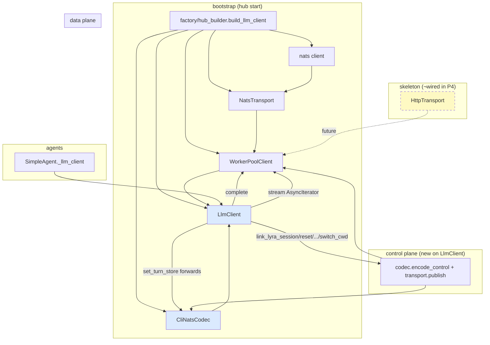
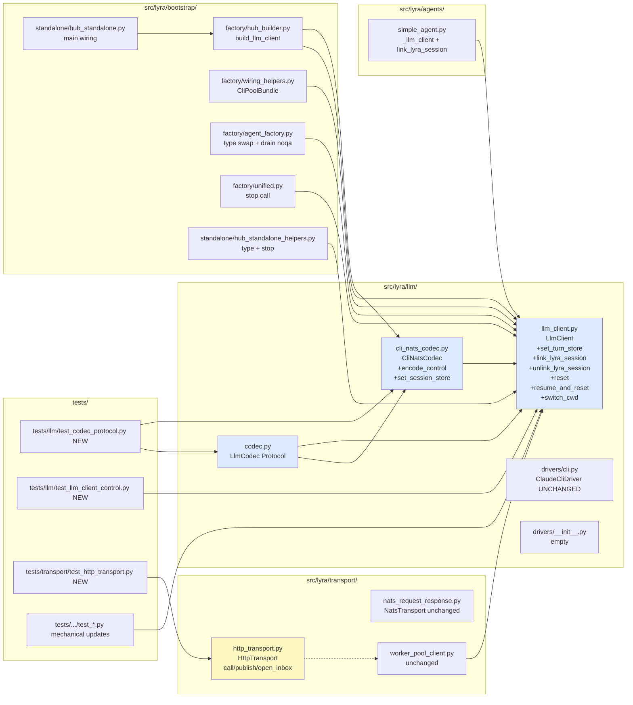

## Summary

Promote `LlmCodec` to a Protocol, rename concrete to `CliNatsCodec` + add `encode_control`/`set_session_store`, expand `LlmClient` with 6 control-plane methods re-homed from `CliNatsDriver`, add `HttpTransport` skeleton structurally satisfying `_TransportLike`, rewire 7 sites in `src/lyra/bootstrap/` + `src/lyra/agents/simple_agent.py`, delete `CliNatsDriver`, drain `DEBT:re-export-init` in `agent_factory.py`. Single PR. Subsumes #1201.

## Architecture

### Data flow (post-P4 LLM construction + call path)



### File × Function map



## Bootstrap Context

Reference patterns to mirror:
- **Protocol definition style**: `src/lyra/transport/worker_pool_client.py:28-44` (`_TransportLike` Protocol — `<<Protocol>>` shape with type-only methods).
- **Codec encode/decode body**: current `src/lyra/llm/llm_codec.py` (to be renamed `cli_nats_codec.py`) — preserve verbatim, add 2 new methods.
- **Control-payload encoding**: `src/lyra/llm/drivers/cli_nats.py:305` `_build_control_payload` (private helper) — extract verbatim into `CliNatsCodec.encode_control`.
- **`_CliSessionStore` Protocol**: `src/lyra/llm/drivers/cli_nats.py:33-37` — move to `cli_nats_codec.py` (or `codec.py` as part of public Protocol surface — **decision in T5: keep in `cli_nats_codec.py` as private since it's NATS-specific session bookkeeping**).
- **Existing thin client shape**: `src/lyra/llm/llm_client.py` — extend, don't rewrite.

## Agents

| Agent | Task count | Files (primary) |
|---|---|---|
| backend-dev-A | 18 | `src/lyra/llm/*`, `src/lyra/bootstrap/factory/*`, `src/lyra/agents/simple_agent.py` |
| backend-dev-B | 5 | `src/lyra/transport/http_transport.py`, `src/lyra/bootstrap/standalone/*` |
| tester-A | 6 | `tests/llm/*`, `tests/transport/*`, mechanical updates |
| (main context) | — | Validate gates, smoke run |

Why split backend-dev: the rewire phase (S4) has two relatively independent file groups — factory/* vs. standalone/* + simple_agent.py — they can run in parallel within Wave 3 if the rewire follows after S2 (LlmClient expansion) is committed.

## Wave Structure

4 waves, max 3 parallel agents. Estimated elapsed ~1.5 hours vs ~2.5 hours sequential.

| Wave | Trigger | Agents | Tasks |
|------|---------|--------|-------|
| 1 | start | 3 ∥ | backend-dev-A: T1→T2→T3→T4→T5→T6→GATE-S1 · backend-dev-B: T13→T14→T15→T16→GATE-S3 · tester-A: T25 (RED stub codec proto) → T27 (RED stub http) |
| 2 | Wave 1 done | 2 ∥ | backend-dev-A: T7→T8→T9→T10→T11→T12→GATE-S2 · tester-A: T26 (RED stub control methods) |
| 3 | Wave 2 done | 3 ∥ | backend-dev-A: T17→T18→T19→T20→T24 (factory + delete) · backend-dev-B: T21→T22→T23 (standalone + agent) · tester-A: T28 (mechanical test updates) → GATE-S4 |
| 4 | Wave 3 done | 2 ∥ | tester-A: T29 (pytest full) · backend-dev-A: T30 (smoke / PR notes) |

### Budget

| Task group | Items | Class | Est. ops | Split? |
|---|---|---|---|---|
| S1 (codec Protocol + rename) | 6 | bounded/judgmental | 17 | — |
| S2 (LlmClient 6 methods) | 6 | bounded/judgmental | 15 | — |
| S3 (HttpTransport skeleton) | 4 | bounded/trivial | 7 | — |
| S4 (rewire 7 sites + delete) | 8 | judgmental | 30 | — |
| S5 (tests + smoke) | 6 | judgmental/exploratory | 26 | — |
| RED-GATE sentinels | 4 | trivial | 4 | — |

**Total estimated ops: ~99.** No task exceeds 50 ops individually.

## Consistency Report

| SC | Covered by tasks | Status |
|---|---|---|
| SC1 (`codec.py` Protocol, 5 methods) | T3 | ✓ |
| SC2 (`cli_nats_codec.py` + 2 new methods, `git mv` history) | T1, T2, T4, T5 | ✓ |
| SC3 (`cli_nats.py` deleted, 0 grep hits) | T24, GATE-S4 | ✓ |
| SC4 (`http_transport.py`, structural `_TransportLike`) | T13, T14, T15, T16 | ✓ |
| SC5 (`LlmClient` + 6 control methods, ≤10 LOC each) | T7, T8, T9, T10, T11, T12 | ✓ |
| SC6 (7 W-sites rewired) | T17, T18, T19, T20, T21, T22, T23 | ✓ |
| SC7 (`noqa: F401 — DEBT:re-export-init` removed) | T19 | ✓ |
| SC8 (`ClaudeCliDriver` byte-identical) | implicit (no task touches `drivers/cli.py`); verified by T28 (no test changes to ClaudeCliDriver tests) + final `git diff` | ✓ |
| SC9 (LOC ceilings) | implicit; verified at GATE-S4 + validate stage | ✓ |
| SC10 (smoke test) | T26 (control encoding parity) + T29 (pytest) + T30 (manual or CI smoke) | ✓ |

**Coverage: 10/10 SCs traced.** No uncovered SCs. No untraced tasks.

## Micro-Tasks

### Slice S1 — Codec Protocol + concrete rename + 2 new methods

**T1 — `git mv` codec module**
- File: `src/lyra/llm/llm_codec.py` → `src/lyra/llm/cli_nats_codec.py`
- Command: `git mv src/lyra/llm/llm_codec.py src/lyra/llm/cli_nats_codec.py`
- Verify: `git status --short | grep 'R.*cli_nats_codec'`
- Expected: One renamed entry
- Time: 1 min · `[P]`: N (S1 sequential start) · Agent: backend-dev-A · Spec: SC2 · Slice: V1 · Phase: GREEN · Difficulty: 1

**T2 — Rename class symbol `LlmCodec` → `CliNatsCodec`**
- File: `src/lyra/llm/cli_nats_codec.py`
- Edit: `class LlmCodec:` → `class CliNatsCodec:` ; module docstring update (line 1) ; update self-references in docstrings.
- Verify: `grep -n 'class LlmCodec\|class CliNatsCodec' src/lyra/llm/cli_nats_codec.py`
- Expected: Exactly 1 line, `class CliNatsCodec:`
- Time: 2 min · `[P]`: N · Agent: backend-dev-A · Spec: SC2 · Slice: V1 · Phase: GREEN · Difficulty: 1

**T3 — Create `LlmCodec` Protocol in new `codec.py`**
- File: `src/lyra/llm/codec.py` (NEW)
- Skeleton:
  ```python
  """LlmCodec Protocol — encode/decode boundary for LLM domain.

  Concrete impls: CliNatsCodec (NATS path) ; future HTTP codecs.
  """

  from __future__ import annotations
  from typing import TYPE_CHECKING, Protocol, runtime_checkable

  if TYPE_CHECKING:
      from pathlib import Path
      from lyra.core.agent.agent_config import ModelConfig
      from lyra.core.messaging.events import LlmEvent
      from lyra.core.ports.llm import LlmResult
      from lyra.transport._result import Result, SanitizedError
      from roxabi_contracts.cli.models import CliControlCmd

  @runtime_checkable
  class LlmCodec(Protocol):
      def encode(self, text, model_cfg, system_prompt, messages, *, stream): ...
      def decode(self, result, trace_id): ...
      def decode_chunk(self, result): ...
      def encode_control(self, cmd: "CliControlCmd") -> bytes: ...
      def set_session_store(self, store) -> None: ...
  ```
- Verify: `uv run python -c "from lyra.llm.codec import LlmCodec; print(LlmCodec)"`
- Expected: Prints `<class 'lyra.llm.codec.LlmCodec'>`
- Time: 4 min · `[P]`: N · Agent: backend-dev-A · Spec: SC1 · Slice: V1 · Phase: GREEN · Difficulty: 2

**T4 — Add `encode_control(cmd) -> bytes` to `CliNatsCodec`**
- File: `src/lyra/llm/cli_nats_codec.py`
- Extract body of `_build_control_payload` from `src/lyra/llm/drivers/cli_nats.py:305-...` (read to learn the encoding contract). Make it a public `encode_control` method on `CliNatsCodec`. Add `from roxabi_contracts.cli.models import CliControlCmd` (or under TYPE_CHECKING then string annotation).
- Verify: `grep -nE 'def encode_control' src/lyra/llm/cli_nats_codec.py`
- Expected: Exactly 1 match
- Time: 6 min · `[P]`: N · Agent: backend-dev-A · Spec: SC2 · Slice: V1 · Phase: GREEN · Difficulty: 3

**T5 — Add `set_session_store(store)` + move `_CliSessionStore` Protocol**
- Files: `src/lyra/llm/cli_nats_codec.py` (add Protocol + method), `src/lyra/llm/drivers/cli_nats.py` (delete Protocol — already scheduled by T24 but for now keep until S4)
- Move the `_CliSessionStore` Protocol from `cli_nats.py:33-37` into `cli_nats_codec.py` (keep private — leading underscore). Add `_session_store: "_CliSessionStore | None" = None` instance state and `set_session_store(store)` method on `CliNatsCodec`. Wire envelope session-id lookup through it in `encode`.
- Verify: `grep -nE 'class _CliSessionStore|def set_session_store' src/lyra/llm/cli_nats_codec.py`
- Expected: 2 matches
- Time: 5 min · `[P]`: N · Agent: backend-dev-A · Spec: SC2 · Slice: V1 · Phase: GREEN · Difficulty: 3

**T6 — Update `llm_client.py` imports to point at new modules**
- File: `src/lyra/llm/llm_client.py`
- Edits: TYPE_CHECKING block — `from lyra.llm.llm_codec import LlmCodec` → `from lyra.llm.codec import LlmCodec` ; in constructor body, the codec param is now typed as the Protocol (no runtime change, type-only).
- Verify: `grep -n 'from lyra.llm.codec\|from lyra.llm.llm_codec' src/lyra/llm/llm_client.py`
- Expected: 1 match for `from lyra.llm.codec`, 0 for `llm_codec`
- Time: 2 min · `[P]`: N · Agent: backend-dev-A · Spec: SC1 · Slice: V1 · Phase: GREEN · Difficulty: 1

**RED-GATE-S1 — pyright + smoke import test**
- Verify: `uv run pyright src/lyra/llm/ src/lyra/transport/ 2>&1 | tail -5`
- Expected: `0 errors, 0 warnings`
- Additional: `uv run python -c "from lyra.llm.codec import LlmCodec; from lyra.llm.cli_nats_codec import CliNatsCodec; assert isinstance(CliNatsCodec(), LlmCodec)"` (runtime_checkable Protocol → isinstance works)
- Expected: exit 0, no output
- Time: 1 min · `[P]`: N · Agent: backend-dev-A · Spec: SC1, SC2 · Slice: V1 · Phase: RED-GATE · Difficulty: 1

### Slice S2 — LlmClient expansion (6 control-plane methods)

**T7 — Add `set_turn_store(store)` on `LlmClient`**
- File: `src/lyra/llm/llm_client.py`
- Skeleton:
  ```python
  def set_turn_store(self, store) -> None:
      """Wire the session store onto the codec for envelope session-id injection."""
      self._codec.set_session_store(store)
  ```
- Verify: `grep -nE 'def set_turn_store' src/lyra/llm/llm_client.py`
- Expected: 1 match
- Time: 2 min · `[P]`: N · Agent: backend-dev-A · Spec: SC5 · Slice: V2 · Phase: GREEN · Difficulty: 1

**T8 — Add `link_lyra_session(pool_id, lyra_session_id)` on `LlmClient`**
- File: `src/lyra/llm/llm_client.py`
- Skeleton:
  ```python
  def link_lyra_session(self, pool_id: str, lyra_session_id: str) -> None:
      del pool_id  # codec-encoded subject handles routing
      cmd = CliControlCmd.link(lyra_session_id=lyra_session_id)
      payload = self._codec.encode_control(cmd)
      # publish via transport — fire-and-forget control msg
      asyncio.create_task(
          self._pool.transport.publish(SUBJECTS.control_request, payload, reply_subject=...)
      )
  ```
  (Refine signature by reading `CliNatsDriver.link_lyra_session` body at `drivers/cli_nats.py:245-251`; preserve exact CliControlCmd shape + subject choice; the existing `_fire_set_cli_session` fire-and-forget helper at `:256` is the implementation pattern.)
- Verify: `grep -nE 'def link_lyra_session' src/lyra/llm/llm_client.py`
- Expected: 1 match
- Time: 6 min · `[P]`: N · Agent: backend-dev-A · Spec: SC5 · Slice: V2 · Phase: GREEN · Difficulty: 3

**T9 — Add `unlink_lyra_session(pool_id)` on `LlmClient`**
- File: `src/lyra/llm/llm_client.py`
- Mirror T8 with `CliControlCmd.unlink(...)`. Read `CliNatsDriver.unlink_lyra_session` at `drivers/cli_nats.py:252-...`.
- Verify: `grep -nE 'def unlink_lyra_session' src/lyra/llm/llm_client.py`
- Expected: 1 match
- Time: 3 min · `[P]`: N · Agent: backend-dev-A · Spec: SC5 · Slice: V2 · Phase: GREEN · Difficulty: 2

**T10 — Add `reset(pool_id)` on `LlmClient`**
- File: `src/lyra/llm/llm_client.py`
- Mirror T8 with `CliControlCmd.reset(...)`. Read `CliNatsDriver.reset` at `:211-215`. Note: this is `async` (uses `.call` not `.publish` if it waits for ack — verify against source).
- Verify: `grep -nE 'async def reset' src/lyra/llm/llm_client.py`
- Expected: 1 match
- Time: 3 min · `[P]`: N · Agent: backend-dev-A · Spec: SC5 · Slice: V2 · Phase: GREEN · Difficulty: 2

**T11 — Add `resume_and_reset(pool_id, session_id) -> bool` on `LlmClient`**
- File: `src/lyra/llm/llm_client.py`
- Async, returns bool. Read `CliNatsDriver.resume_and_reset` at `:216-239` — has return value (True/False on accepted/skipped). Use `transport.call(...)` + decode the reply.
- Verify: `grep -nE 'async def resume_and_reset' src/lyra/llm/llm_client.py`
- Expected: 1 match
- Time: 5 min · `[P]`: N · Agent: backend-dev-A · Spec: SC5 · Slice: V2 · Phase: GREEN · Difficulty: 3

**T12 — Add `switch_cwd(pool_id, cwd: Path)` on `LlmClient`**
- File: `src/lyra/llm/llm_client.py`
- Mirror T8 with `CliControlCmd.switch_cwd(...)`. Read `:240-244`.
- Verify: `grep -nE 'async def switch_cwd' src/lyra/llm/llm_client.py`
- Expected: 1 match
- Time: 3 min · `[P]`: N · Agent: backend-dev-A · Spec: SC5 · Slice: V2 · Phase: GREEN · Difficulty: 2

**RED-GATE-S2 — pyright + LOC check**
- Verify: `uv run pyright src/lyra/llm/llm_client.py 2>&1 | tail -5 && wc -l src/lyra/llm/llm_client.py`
- Expected: `0 errors` + LOC ≤ 200
- Time: 1 min · `[P]`: N · Agent: backend-dev-A · Spec: SC5, SC9 · Slice: V2 · Phase: RED-GATE · Difficulty: 1

### Slice S3 — HttpTransport skeleton

**T13 — Create `src/lyra/transport/http_transport.py` skeleton**
- File: `src/lyra/transport/http_transport.py` (NEW)
- Skeleton:
  ```python
  """HttpTransport — sibling transport for HTTP-based LLM providers.

  Skeleton: structurally satisfies _TransportLike (call + publish + open_inbox).
  P4 (#1281) ships shape only; no real HTTP I/O wired. Future HTTP drivers
  compose via LlmClient(pool=WorkerPoolClient(HttpTransport(...)), codec=...).

  Phase 1 consensus (§B1): publish + open_inbox raise NotImplementedError —
  HTTP streaming is codec-level (SSE), not transport-level.
  """

  from __future__ import annotations
  from contextlib import AbstractAsyncContextManager
  from lyra.transport._result import Err, Result, SanitizedError
  ```
- Verify: `ls src/lyra/transport/http_transport.py`
- Expected: file exists
- Time: 3 min · `[P]`: Y (independent of S1/S2) · Agent: backend-dev-B · Spec: SC4 · Slice: V3 · Phase: GREEN · Difficulty: 2

**T14 — Implement `HttpTransport.call` (placeholder Err)**
- File: `src/lyra/transport/http_transport.py`
- Add:
  ```python
  class HttpTransport:
      async def call(
          self, subject: str, payload: bytes, *, timeout: float | None = None
      ) -> Result[bytes, SanitizedError]:
          del subject, payload, timeout
          return Err(SanitizedError(code="NOT_WIRED", message="HttpTransport.call is a P4 skeleton — no HTTP backend wired."))
  ```
- Verify: `grep -nE 'async def call' src/lyra/transport/http_transport.py`
- Expected: 1 match
- Time: 2 min · `[P]`: Y · Agent: backend-dev-B · Spec: SC4 · Slice: V3 · Phase: GREEN · Difficulty: 1

**T15 — Implement `HttpTransport.publish` (NotImplementedError)**
- File: `src/lyra/transport/http_transport.py`
- Add:
  ```python
  async def publish(
      self, subject: str, payload: bytes, *, reply_subject: str
  ) -> None:
      del subject, payload, reply_subject
      raise NotImplementedError(
          "HTTP transport does not provide pub/sub publish; "
          "use codec-level request/response."
      )
  ```
- Verify: `grep -nE 'async def publish' src/lyra/transport/http_transport.py`
- Expected: 1 match
- Time: 1 min · `[P]`: Y · Agent: backend-dev-B · Spec: SC4 · Slice: V3 · Phase: GREEN · Difficulty: 1

**T16 — Implement `HttpTransport.open_inbox` (NotImplementedError with consensus message)**
- File: `src/lyra/transport/http_transport.py`
- Add:
  ```python
  def open_inbox(self) -> AbstractAsyncContextManager:
      raise NotImplementedError(
          "HTTP transport does not provide inbox-based streaming; "
          "use codec-level SSE."
      )
  ```
- Verify: `grep -F 'use codec-level SSE.' src/lyra/transport/http_transport.py`
- Expected: 1 match (exact consensus message)
- Time: 1 min · `[P]`: Y · Agent: backend-dev-B · Spec: SC4 · Slice: V3 · Phase: GREEN · Difficulty: 1

**RED-GATE-S3 — structural Protocol satisfaction**
- Verify: `uv run pyright src/lyra/transport/ 2>&1 | tail -5` + `uv run python -c "from lyra.transport.http_transport import HttpTransport; from lyra.transport.worker_pool_client import _TransportLike; t: _TransportLike = HttpTransport()"`
- Expected: pyright 0 errors ; python exits 0
- Time: 1 min · `[P]`: Y · Agent: backend-dev-B · Spec: SC4 · Slice: V3 · Phase: RED-GATE · Difficulty: 1

### Slice S4 — Bootstrap rewire + delete CliNatsDriver

**T17 — `factory/hub_builder.py` rewire**
- File: `src/lyra/bootstrap/factory/hub_builder.py`
- Edits (lines per spec; impl re-verifies):
  - `:42` — `from lyra.llm.drivers.cli_nats import CliNatsDriver` → `from lyra.llm.llm_client import LlmClient` + `from lyra.llm.cli_nats_codec import CliNatsCodec`
  - `:48-57` — function rename `build_cli_nats_driver` → `build_llm_client` ; return type `-> "CliNatsDriver"` → `-> LlmClient` ; body constructs `wpc = WorkerPoolClient(NatsTransport(nc), ...)` ; `codec = CliNatsCodec()` ; `driver = LlmClient(wpc, codec, timeout=...)` ; return.
  - `:163,177` — annotation `"CliNatsDriver | None"` → `"LlmClient | None"` ; kwarg name kept or renamed per W2 decision (default: keep `cli_nats_driver`).
- Verify: `grep -nE 'def build_(cli_nats_driver|llm_client)' src/lyra/bootstrap/factory/hub_builder.py`
- Expected: 1 match for `build_llm_client`, 0 for `build_cli_nats_driver`
- Time: 7 min · `[P]`: N (Wave 3) · Agent: backend-dev-A · Spec: SC6 · Slice: V4 · Phase: GREEN · Difficulty: 3

**T18 — `factory/wiring_helpers.py` CliPoolBundle field type swap**
- File: `src/lyra/bootstrap/factory/wiring_helpers.py`
- Edits:
  - `:49` — remove `from lyra.llm.drivers.cli_nats import CliNatsDriver` (TYPE_CHECKING block) ; add `from lyra.llm.llm_client import LlmClient`.
  - `:82` — `cli_nats_driver: "CliNatsDriver | None"` → `cli_nats_driver: "LlmClient | None"` (keep field name per W2 decision).
- Verify: `grep -nE 'CliNatsDriver\|LlmClient' src/lyra/bootstrap/factory/wiring_helpers.py`
- Expected: 0 hits for `CliNatsDriver`, ≥1 for `LlmClient`
- Time: 3 min · `[P]`: N · Agent: backend-dev-A · Spec: SC6 · Slice: V4 · Phase: GREEN · Difficulty: 2

**T19 — `factory/agent_factory.py` type swap + drain DEBT:re-export-init**
- File: `src/lyra/bootstrap/factory/agent_factory.py`
- Edits (≥8 sites):
  - `:25` — **remove** the entire `noqa: F401 — DEBT:re-export-init` TYPE_CHECKING re-export block (the comment + the import). Replace TYPE_CHECKING `CliNatsDriver` import with `LlmClient` if still needed for annotations, OR remove entirely if annotations switch to string-based.
  - `:52, :140, :207` — kwarg annotations `cli_nats_driver: "CliNatsDriver | None"` → `"LlmClient | None"`.
  - `:67, :69` — `if cli_nats_driver is not None:` (stays) ; `base: LlmProvider = cli_nats_driver` (stays — `LlmClient` implements `LlmProvider`).
  - `:126, :192, :230, :251` — pass-through call sites stay (kwarg name unchanged).
  - `:222` — docstring update if it explicitly names `CliNatsDriver`.
  - `:56, :60` — docstring update.
- Verify: `grep -nE 'CliNatsDriver|DEBT:re-export-init' src/lyra/bootstrap/factory/agent_factory.py`
- Expected: 0 hits for both
- Time: 8 min · `[P]`: N · Agent: backend-dev-A · Spec: SC6, SC7 · Slice: V4 · Phase: GREEN · Difficulty: 4

**T20 — `factory/unified.py:79-80` verify stop() call type-checks**
- File: `src/lyra/bootstrap/factory/unified.py`
- Verify type-only: `clipool.cli_nats_driver.stop()` — `cli_nats_driver` is now `LlmClient | None`, which has `async def stop()` (line 27 in current llm_client.py). No edit needed unless type-checker complains.
- Verify: `uv run pyright src/lyra/bootstrap/factory/unified.py 2>&1 | tail -3`
- Expected: `0 errors`
- Time: 1 min · `[P]`: N · Agent: backend-dev-A · Spec: SC6 · Slice: V4 · Phase: GREEN · Difficulty: 1

**T21 — `standalone/hub_standalone.py` rewire**
- File: `src/lyra/bootstrap/standalone/hub_standalone.py`
- Edits:
  - `:17` — `from lyra.bootstrap.factory.hub_builder import build_cli_nats_driver` → `import build_llm_client`.
  - `:169` — `cli_nats_driver = await build_cli_nats_driver(nc)` → `cli_nats_driver = await build_llm_client(nc)` (variable name kept for minimal-touch).
  - `:170` — `cli_nats_driver.set_turn_store(stores.turn)` — works because T7 added `set_turn_store` to `LlmClient`.
  - `:163, :176, :190, :276` — propagation; no symbol changes needed.
- Verify: `grep -nE 'build_cli_nats_driver|build_llm_client' src/lyra/bootstrap/standalone/hub_standalone.py`
- Expected: 0 for `build_cli_nats_driver`, ≥1 for `build_llm_client`
- Time: 5 min · `[P]`: Y (parallel with T17-T20 since different files) · Agent: backend-dev-B · Spec: SC6 · Slice: V4 · Phase: GREEN · Difficulty: 3

**T22 — `standalone/hub_standalone_helpers.py` type + stop()**
- File: `src/lyra/bootstrap/standalone/hub_standalone_helpers.py`
- Edits:
  - `:25` — TYPE_CHECKING `from lyra.llm.drivers.cli_nats import CliNatsDriver` → `from lyra.llm.llm_client import LlmClient`.
  - `:113` — `cli_nats_driver: "CliNatsDriver | None"` → `"LlmClient | None"`.
  - `:124-125` — `await cli_nats_driver.stop()` (works as-is on `LlmClient`).
- Verify: `grep -nE 'CliNatsDriver|LlmClient' src/lyra/bootstrap/standalone/hub_standalone_helpers.py`
- Expected: 0 for `CliNatsDriver`, ≥1 for `LlmClient`
- Time: 2 min · `[P]`: Y · Agent: backend-dev-B · Spec: SC6 · Slice: V4 · Phase: GREEN · Difficulty: 2

**T23 — `agents/simple_agent.py` rewire**
- File: `src/lyra/agents/simple_agent.py`
- Edits:
  - `:80` — kwarg annotation `cli_nats_driver: "CliNatsDriver | None"` → `"LlmClient | None"`. **Decision: keep kwarg + field name `cli_nats_driver` / `_cli_nats_driver` for minimal-touch** (rename to `llm_client` is a wider blast — defer).
  - `:93` — `self._cli_nats_driver = cli_nats_driver` (unchanged).
  - `:170-171, :191-192` — `elif self._cli_nats_driver is not None: _driver = self._cli_nats_driver` (unchanged; `_driver` typed as `LlmProvider`).
  - `:247-248` — `self._cli_nats_driver.link_lyra_session(pool.pool_id, pool.session_id)` — works because T8 added `link_lyra_session` to `LlmClient`.
  - Add TYPE_CHECKING import `from lyra.llm.llm_client import LlmClient` ; remove old `from lyra.llm.drivers.cli_nats import CliNatsDriver` if present.
- Verify: `grep -nE 'CliNatsDriver|LlmClient' src/lyra/agents/simple_agent.py`
- Expected: 0 for `CliNatsDriver`, ≥1 for `LlmClient`
- Time: 5 min · `[P]`: Y · Agent: backend-dev-B · Spec: SC6 · Slice: V4 · Phase: GREEN · Difficulty: 3

**T24 — Delete `drivers/cli_nats.py` + empty `drivers/__init__.py`**
- Files: `src/lyra/llm/drivers/cli_nats.py` (DELETE), `src/lyra/llm/drivers/__init__.py` (REWRITE empty)
- Commands:
  ```bash
  git rm src/lyra/llm/drivers/cli_nats.py
  echo "" > src/lyra/llm/drivers/__init__.py  # or remove the file entirely if Python tolerates package without __init__.py (it doesn't for explicit imports — keep empty)
  ```
- Actually: write `__init__.py` as a single blank line to keep the package marker but remove exports.
- Verify: `[ ! -f src/lyra/llm/drivers/cli_nats.py ] && wc -l src/lyra/llm/drivers/__init__.py`
- Expected: cli_nats.py absent ; __init__.py LOC ≤ 1
- Time: 2 min · `[P]`: N (must run AFTER all rewires complete) · Agent: backend-dev-A · Spec: SC3 · Slice: V4 · Phase: GREEN · Difficulty: 1

**RED-GATE-S4 — full rewire validation**
- Verify:
  ```bash
  grep -rn 'CliNatsDriver' src/ tests/ ; echo "---"; \
  grep -rn 'DEBT:re-export-init' src/ ; echo "---"; \
  uv run pyright 2>&1 | tail -10 ; echo "---"; \
  uv run pytest --collect-only -q 2>&1 | tail -10
  ```
- Expected:
  - `grep CliNatsDriver`: 0 hits (or only field name `cli_nats_driver` if W2 kept names)
  - `grep DEBT:re-export-init`: 0 hits
  - `pyright`: 0 errors
  - `pytest --collect-only`: no collection errors
- Time: 3 min · `[P]`: N · Agent: backend-dev-A · Spec: SC3, SC6, SC7 · Slice: V4 · Phase: RED-GATE · Difficulty: 2

### Slice S5 — Tests + smoke

**T25 — `tests/llm/test_codec_protocol.py` (NEW)**
- File: `tests/llm/test_codec_protocol.py`
- Skeleton:
  ```python
  from lyra.llm.codec import LlmCodec
  from lyra.llm.cli_nats_codec import CliNatsCodec

  def test_cli_nats_codec_satisfies_protocol() -> None:
      codec: LlmCodec = CliNatsCodec()  # type-check: structural conformance
      assert isinstance(codec, LlmCodec)  # runtime: runtime_checkable Protocol

  def test_protocol_surface() -> None:
      members = {"encode", "decode", "decode_chunk", "encode_control", "set_session_store"}
      for m in members:
          assert hasattr(LlmCodec, m), f"Protocol missing {m}"
  ```
- Verify: `uv run pytest tests/llm/test_codec_protocol.py -q`
- Expected: 2 passed
- Time: 4 min · `[P]`: Y (parallel with backend tasks in Wave 1) · Agent: tester-A · Spec: SC1, SC2 · Slice: V5 · Phase: RED→GREEN · Difficulty: 2

**T26 — `tests/llm/test_llm_client_control.py` (NEW)**
- File: `tests/llm/test_llm_client_control.py`
- Skeleton: a `FakeTransport` recording publish/call payloads; instantiate `LlmClient(WorkerPoolClient(FakeTransport()), CliNatsCodec())`; for each of the 6 control methods, assert that `transport.publish` (or `.call`) received bytes equal to legacy `CliNatsDriver._build_control_payload(cmd)` for the same input.
- Verify: `uv run pytest tests/llm/test_llm_client_control.py -q`
- Expected: 6 passed (one per control method)
- Time: 10 min · `[P]`: Y (parallel with backend Wave 2) · Agent: tester-A · Spec: SC5, SC10 · Slice: V5 · Phase: RED→GREEN · Difficulty: 4

**T27 — `tests/transport/test_http_transport.py` (NEW)**
- File: `tests/transport/test_http_transport.py`
- Skeleton:
  ```python
  import pytest
  from lyra.transport.http_transport import HttpTransport
  from lyra.transport._result import Err

  @pytest.mark.asyncio
  async def test_call_returns_err_placeholder():
      t = HttpTransport()
      r = await t.call("any.subject", b"")
      assert isinstance(r, Err)
      assert r.error.code == "NOT_WIRED"

  @pytest.mark.asyncio
  async def test_publish_raises():
      with pytest.raises(NotImplementedError, match="codec-level request/response"):
          await HttpTransport().publish("s", b"", reply_subject="r")

  def test_open_inbox_raises_with_consensus_message():
      with pytest.raises(NotImplementedError, match=r"use codec-level SSE\."):
          HttpTransport().open_inbox()
  ```
- Verify: `uv run pytest tests/transport/test_http_transport.py -q`
- Expected: 3 passed
- Time: 4 min · `[P]`: Y (parallel with backend Wave 1) · Agent: tester-A · Spec: SC4 · Slice: V5 · Phase: RED→GREEN · Difficulty: 2

**T28 — Mechanical updates to existing tests referencing `CliNatsDriver`**
- Scope: `grep -rln 'CliNatsDriver' tests/` enumerates files (exploratory; spec time unknown count).
- Strategy: each match site — if it constructs `CliNatsDriver(...)` for a test fixture, replace with `LlmClient(WorkerPoolClient(<fake transport>), CliNatsCodec())` per the new shape. If it imports for type-hint only, swap the import. Preserve test intent; do NOT rewrite assertions.
- Verify: `grep -rln 'CliNatsDriver' tests/` returns 0 hits ; `uv run pytest --collect-only -q tests/ 2>&1 | tail -5` shows no collection errors.
- Expected: 0 grep hits ; pytest collects cleanly.
- Time: 10 min · `[P]`: N (Wave 3, after rewire complete) · Agent: tester-A · Spec: SC3, SC8 · Slice: V5 · Phase: GREEN · Difficulty: 4

**T29 — Full pytest run**
- Verify: `uv run pytest 2>&1 | tail -20`
- Expected: All previously-passing tests pass ; no new failures attributable to P4.
- Time: 5 min (test execution time; depends on suite) · `[P]`: N (Wave 4) · Agent: tester-A · Spec: SC10 · Slice: V5 · Phase: REFACTOR (final GREEN check) · Difficulty: 1

**T30 — Smoke + PR description**
- Manual smoke (or document existing CI smoke job in PR description): launch hub locally, send a Telegram message that triggers an LLM turn via the clipool path, verify reply round-trip ; confirm `LlmResult` shape (`result` non-null, `error` None, `session_id` populated).
- Also: update PR description to include the smoke evidence + the commit-bundle note for `91f7bd7a` (frame commit includes 1282 frame side-effect).
- Verify: PR description content; manual check noted.
- Expected: Smoke documented in PR ; reviewer can reproduce.
- Time: 10 min · `[P]`: Y (parallel with T29) · Agent: backend-dev-A (PR writeup) · Spec: SC10 · Slice: V5 · Phase: REFACTOR · Difficulty: 2

## Task Seeding Blueprint

<!-- Format: T{n} | agent-instance | blockedBy | subject -->

### Wave 1 — no deps, 3 agents ∥

| Task | Agent instance | blockedBy | Subject |
|------|---------------|-----------|---------|
| T1 | backend-dev-A | — | git mv llm_codec.py → cli_nats_codec.py |
| T2 | backend-dev-A | T1 | Rename class LlmCodec → CliNatsCodec |
| T3 | backend-dev-A | T2 | Create codec.py with LlmCodec Protocol |
| T4 | backend-dev-A | T3 | Add encode_control to CliNatsCodec |
| T5 | backend-dev-A | T4 | Add set_session_store + move _CliSessionStore |
| T6 | backend-dev-A | T5 | Update llm_client.py imports for Protocol |
| RED-GATE-S1 | backend-dev-A | T6 | pyright + isinstance check |
| T13 | backend-dev-B | — | Create http_transport.py skeleton |
| T14 | backend-dev-B | T13 | Implement HttpTransport.call placeholder |
| T15 | backend-dev-B | T14 | Implement HttpTransport.publish NotImpl |
| T16 | backend-dev-B | T15 | Implement HttpTransport.open_inbox NotImpl |
| RED-GATE-S3 | backend-dev-B | T16 | Structural _TransportLike satisfaction |
| T25 | tester-A | T3 | Test codec Protocol substitutability |
| T27 | tester-A | T16 | Test HttpTransport raises + Err |

### Wave 2 — after Wave 1, 2 agents ∥

| Task | Agent instance | blockedBy | Subject |
|------|---------------|-----------|---------|
| T7 | backend-dev-A | RED-GATE-S1 | Add LlmClient.set_turn_store |
| T8 | backend-dev-A | T7 | Add LlmClient.link_lyra_session |
| T9 | backend-dev-A | T8 | Add LlmClient.unlink_lyra_session |
| T10 | backend-dev-A | T9 | Add LlmClient.reset |
| T11 | backend-dev-A | T10 | Add LlmClient.resume_and_reset |
| T12 | backend-dev-A | T11 | Add LlmClient.switch_cwd |
| RED-GATE-S2 | backend-dev-A | T12 | pyright + LOC check |
| T26 | tester-A | T12 | Test LlmClient 6 control methods parity |

### Wave 3 — after Wave 2, 3 agents ∥

| Task | Agent instance | blockedBy | Subject |
|------|---------------|-----------|---------|
| T17 | backend-dev-A | RED-GATE-S2 | factory/hub_builder.py build_llm_client |
| T18 | backend-dev-A | T17 | factory/wiring_helpers.py CliPoolBundle type swap |
| T19 | backend-dev-A | T18 | factory/agent_factory.py type swap + drain DEBT |
| T20 | backend-dev-A | T19 | factory/unified.py type-check verification |
| T21 | backend-dev-B | RED-GATE-S2 | standalone/hub_standalone.py rewire |
| T22 | backend-dev-B | T21 | standalone/hub_standalone_helpers.py rewire |
| T23 | backend-dev-B | T22 | agents/simple_agent.py rewire |
| T24 | backend-dev-A | T20, T23 | Delete cli_nats.py + empty drivers/__init__.py |
| RED-GATE-S4 | backend-dev-A | T24 | Full rewire validation (grep + pyright + pytest --collect) |
| T28 | tester-A | T23 | Mechanical test updates referencing CliNatsDriver |

### Wave 4 — after Wave 3, 2 agents ∥

| Task | Agent instance | blockedBy | Subject |
|------|---------------|-----------|---------|
| T29 | tester-A | RED-GATE-S4, T28 | Full pytest run |
| T30 | backend-dev-A | RED-GATE-S4 | Smoke + PR description writeup |

## Task IDs

<!-- Generated by /plan. Used by /implement to resume tasks on session restart. -->

| Blueprint | Task ID | Subject |
|---|---|---|
| T1 | 13 | git mv llm_codec.py → cli_nats_codec.py |
| T2 | 14 | Rename class LlmCodec → CliNatsCodec |
| T3 | 15 | Create codec.py with LlmCodec Protocol |
| T4 | 16 | Add encode_control(cmd) to CliNatsCodec |
| T5 | 17 | Add set_session_store + move _CliSessionStore |
| T6 | 18 | Update llm_client.py imports for Protocol |
| RED-GATE-S1 | 19 | pyright + isinstance check |
| T13 | 20 | Create http_transport.py skeleton |
| T14 | 21 | Implement HttpTransport.call (Err placeholder) |
| T15 | 22 | Implement HttpTransport.publish (NotImpl) |
| T16 | 23 | Implement HttpTransport.open_inbox (consensus msg) |
| RED-GATE-S3 | 24 | _TransportLike structural satisfaction |
| T25 | 25 | Test codec Protocol substitutability |
| T27 | 26 | Test HttpTransport raises + Err |
| T7 | 27 | Add LlmClient.set_turn_store |
| T8 | 28 | Add LlmClient.link_lyra_session |
| T9 | 29 | Add LlmClient.unlink_lyra_session |
| T10 | 30 | Add LlmClient.reset (async) |
| T11 | 31 | Add LlmClient.resume_and_reset (async, returns bool) |
| T12 | 32 | Add LlmClient.switch_cwd (async) |
| RED-GATE-S2 | 33 | pyright + LOC ≤ 200 |
| T26 | 34 | Test LlmClient 6 control methods parity |
| T17 | 35 | factory/hub_builder.py build_llm_client |
| T18 | 36 | factory/wiring_helpers.py CliPoolBundle type swap |
| T19 | 37 | factory/agent_factory.py type swap + drain DEBT |
| T20 | 38 | factory/unified.py stop() type-check |
| T21 | 39 | standalone/hub_standalone.py rewire |
| T22 | 40 | standalone/hub_standalone_helpers.py type + stop() |
| T23 | 41 | agents/simple_agent.py rewire |
| T24 | 42 | Delete cli_nats.py + empty drivers/__init__.py |
| RED-GATE-S4 | 43 | full rewire validation |
| T28 | 44 | Update existing tests referencing CliNatsDriver |
| T29 | 45 | Full pytest run |
| T30 | 46 | Smoke + PR description writeup |
