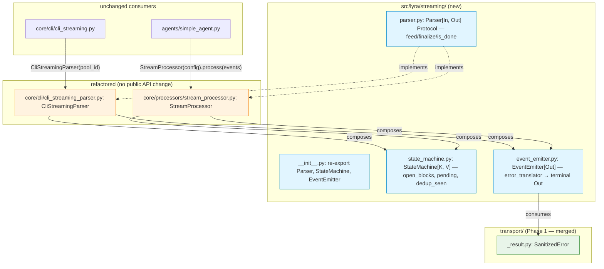
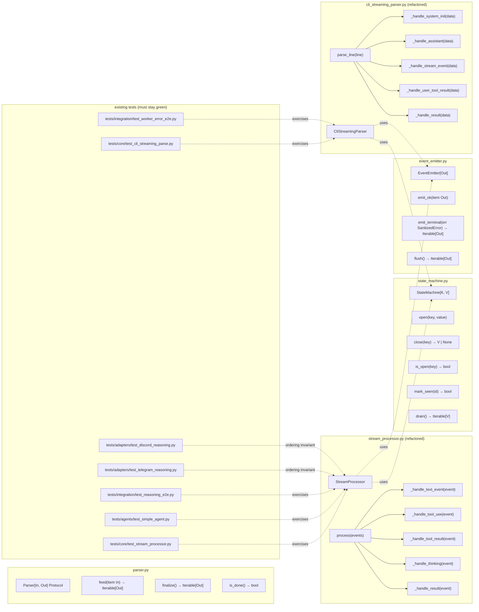

## Summary

Extract three primitives — `Parser[In, Out]` Protocol, `StateMachine[K, V]` generic, `EventEmitter[Out]` Result-aware terminal translator — into a net-new `src/lyra/streaming/` package, then refactor `CliStreamingParser` and `StreamProcessor` to compose them, drop existing C901/PLR0912/PLR0915 noqa annotations, and route both `RunErrorRenderEvent` emission paths through `EventEmitter`. Single PR, 4 slices, strictly sequential.

## Architecture

### Data flow



### File × Function map



## Bootstrap Context

- **Spec:** `artifacts/specs/1282-phase-5-streaming-spec.mdx` (38b6528e, approved 2026-05-22)
- **Frame:** `artifacts/frames/1282-phase-5-streaming-frame.mdx` (status: approved)
- **Parent epic:** #1277 — `artifacts/analyses/1277-stage-axis-refactor-strategy.mdx`
- **Phase 1 substrate (merged):** `src/lyra/transport/_result.py` exposes `SanitizedError`, `Result[T, E]`, `Err`, `Ok`. Imported at 12+ sites.
- **Existing noqa hotspots to drain:**
  - `src/lyra/core/cli/cli_streaming_parser.py:127` — `parse_line`: `noqa: C901, PLR0912, PLR0915 — DEBT:complexity-residual — protocol event dispatch`
  - `src/lyra/core/processors/stream_processor.py:201` — `process`: `noqa: C901, PLR0915 — DEBT:wiring-bootstrap-deps — event-type dispatch + terminal fallbacks`
- **Dual `RunErrorRenderEvent` emission paths in `process`:**
  - Line 380: inside `except Exception` (infrastructure exception)
  - Line 399: post-finally (soft error from `ResultLlmEvent.is_error=True`)
- **`assert_never(event)` default fallback:** stream_processor.py:338 — must remain.
- **Ordering invariant comment anchor:** `src/lyra/adapters/shared/_shared_streaming_state.py:150-155` (`is_error_pending` field).
- **CLI dedup state to extract into StateMachine:** `_emitted_tool_use_ids: set[str]`, `_open_tool_blocks: dict[int, str]`, `_open_thinking_index: int | None`.
- **Processor open-block state to extract into StateMachine:** `_open_text_block_id: str | None`, `_open_reasoning_block_id: str | None`, `_open_tool_call_ids: set[str]`.

## Agents

| Agent instance | Task count | Files |
|---|---|---|
| backend-dev-A | 11 | `src/lyra/streaming/{__init__,parser,state_machine,event_emitter}.py`, `core/cli/cli_streaming_parser.py`, `core/processors/stream_processor.py` |
| tester-A | 7 | `tests/streaming/test_{state_machine,event_emitter,parser_protocol}.py`, RED-GATE verifications |
| doc-writer-A | 2 | `src/lyra/streaming/CLAUDE.md`, root `CLAUDE.md` registration |

## Wave Structure

4 waves (one per slice), max 2 parallel agents (backend-dev-A + tester-A). Elapsed ~7-9 dev-days vs ~12-14 sequential. Slices are strictly sequential per spec; intra-slice TDD parallelism (tester writes unit tests while backend-dev refactors).

| Wave | Trigger | Agents | Tasks |
|------|---------|--------|-------|
| 1 | start | 2 ∥ | backend-dev-A: T1→T2→T3 · tester-A: T4 |
| 2 | Wave 1 RED-GATE green | 2 ∥ | backend-dev-A: T5→T6→T7→T8 · tester-A: T9 |
| 3 | Wave 2 RED-GATE green | 2 ∥ | backend-dev-A: T10→T11 · tester-A: T12 |
| 4 | Wave 3 RED-GATE green | 2 ∥ | backend-dev-A: T13→T14→T15→T16 · tester-A: T17 |
| 5 | Wave 4 RED-GATE green | 1 | doc-writer-A: T18→T19 |

### Budget

| Task | Items | Class | Est. ops | Split? |
|------|-------|-------|----------|--------|
| T1 — Write `parser.py` Protocol | 1 | bounded | 2 | — |
| T2 — Write `__init__.py` re-exports | 1 | trivial | 1 | — |
| T3 — Declare CSP + SP as Parser implementations (no-op duck typing) | 1 | trivial | 2 | — |
| T4 — Write `tests/streaming/test_parser_protocol.py` (Protocol conformance) | 1 | bounded | 3 | — |
| T5 — Write `state_machine.py` generic class | 1 | judgmental | 5 | — |
| T6 — Write `tests/streaming/test_state_machine.py` unit tests | 1 | bounded | 3 | — |
| T7 — Refactor `CliStreamingParser.parse_line` into per-msg-type sub-handlers; wire StateMachine | 1 | judgmental | 6 | — |
| T8 — Remove `parse_line` noqa annotation | 1 | trivial | 1 | — |
| T9 — RED-GATE Slice 2: `test_cli_streaming_parse.py` green + ruff McCabe ≤10 | 1 | bounded | 3 | — |
| T10 — Refactor `StreamProcessor.process` into per-LlmEvent-type sub-handlers; preserve assert_never + try/except/finally frame | 1 | judgmental | 6 | — |
| T11 — Remove `process` noqa annotation | 1 | trivial | 1 | — |
| T12 — RED-GATE Slice 3: `test_stream_processor.py + test_simple_agent.py + test_reasoning_e2e.py` green + ruff McCabe ≤10 + no xfail/skip added | 1 | bounded | 4 | — |
| T13 — Write `event_emitter.py` with `Result[T, SanitizedError]` → terminal Out | 1 | judgmental | 4 | — |
| T14 — Write `tests/streaming/test_event_emitter.py` unit tests | 1 | bounded | 3 | — |
| T15 — Route both `RunErrorRenderEvent` paths (except + post-finally) through EventEmitter | 1 | judgmental | 4 | — |
| T16 — Route `cli.parse` terminal envelope through EventEmitter | 1 | bounded | 3 | — |
| T17 — RED-GATE Slice 4: cascade-grep returns 0 + `test_worker_error_e2e.py + test_simple_agent.py` green | 1 | bounded | 3 | — |
| T18 — Write `src/lyra/streaming/CLAUDE.md` (subsystem invariants) | 1 | bounded | 2 | — |
| T19 — Register `src/lyra/streaming/CLAUDE.md` in root `CLAUDE.md` table | 1 | trivial | 1 | — |

**Total estimated ops: 57.** No task exceeds the 50-op force-split threshold.

## Consistency Report

| Spec section | Covered by tasks | Status |
|---|---|---|
| M1 `__init__.py` | T2 | ✓ |
| M2 `parser.py` Protocol | T1 | ✓ |
| M3 `state_machine.py` | T5 | ✓ |
| M4 `event_emitter.py` | T13 | ✓ |
| C1 CliStreamingParser refactor | T7, T16 | ✓ |
| C2 StreamProcessor refactor | T10, T15 | ✓ |
| C3 consumer imports unchanged | (negative — verified by T9, T12 green) | ✓ |
| Q1 parse_line McCabe ≤10 | T8 + T9 | ✓ |
| Q2 process McCabe ≤10 | T11 + T12 | ✓ |
| Q3 streaming/ cascade grep = 0 | T15 + T16 + T17 | ✓ |
| Q4 folder-size gate | T2 + RED-GATEs | ✓ |
| SC: tests stay green | T9, T12, T17 RED-GATEs | ✓ |
| SC: ordering invariant | T12 (test_*_reasoning.py + test_reasoning_e2e.py) | ✓ |
| SC: cli.parse envelope preserved | T16 + T17 | ✓ |
| SC: assert_never preserved | T10 explicit | ✓ |
| SC: orphan ToolCallEnd + reasoning-close guards preserved | T10 + T12 RED-GATE (no xfail/skip) | ✓ |
| New subdir → CLAUDE.md (project rule) | T18 + T19 | ✓ |

**Covered: 16/16. Uncovered: 0. Untraced tasks: 0. Exemptions: none required.**

## Micro-Tasks

### Slice 1 — Scaffold + Parser Protocol (Wave 1)

#### T1 — Write `parser.py` Protocol

- **File:** `src/lyra/streaming/parser.py`
- **Agent:** backend-dev-A
- **Spec trace:** M2, SC-line-2
- **Phase:** GREEN | **Difficulty:** 2 | **Time:** 5 min | **[P]:** N (predecessor of T2)
- **Code shape:**
  ```python
  from typing import Generic, Iterable, Protocol, TypeVar

  InT = TypeVar("InT")
  OutT = TypeVar("OutT")

  class Parser(Protocol, Generic[InT, OutT]):
      """Stream-axis parser: per-source impls consume InT, emit OutT.

      Composed (not inherited) by CliStreamingParser (str → LlmEvent) and
      StreamProcessor (LlmEvent → RenderEvent). See spec #1282 §Breadboard.
      """
      def feed(self, item: InT) -> Iterable[OutT]: ...
      def finalize(self) -> Iterable[OutT]: ...
      def is_done(self) -> bool: ...
  ```
- **Verify:** `uv run pyright src/lyra/streaming/parser.py`
- **Expected:** 0 errors.

#### T2 — Write `__init__.py` re-exports

- **File:** `src/lyra/streaming/__init__.py`
- **Agent:** backend-dev-A (T1 → T2)
- **Spec trace:** M1
- **Phase:** GREEN | **Difficulty:** 1 | **Time:** 2 min | **[P]:** N
- **Code shape:**
  ```python
  """Stage-axis streaming primitives (Phase 5 — #1282).

  Parser Protocol + StateMachine + EventEmitter composed by:
    - lyra.core.cli.cli_streaming_parser.CliStreamingParser  (str → LlmEvent)
    - lyra.core.processors.stream_processor.StreamProcessor  (LlmEvent → RenderEvent)
  """

  from .parser import Parser

  __all__ = ["Parser"]
  ```
- **Verify:** `uv run python -c "from lyra.streaming import Parser; print(Parser)"`
- **Expected:** prints Protocol class.

#### T3 — Declare CSP + SP as Parser implementations (duck-typed)

- **File:** `src/lyra/core/cli/cli_streaming_parser.py`, `src/lyra/core/processors/stream_processor.py`
- **Agent:** backend-dev-A (T2 → T3)
- **Spec trace:** SC-line-2
- **Phase:** GREEN | **Difficulty:** 1 | **Time:** 3 min | **[P]:** N
- **Code shape:** Add a docstring sentence in each class linking to `lyra.streaming.Parser`; do NOT change runtime behavior or signatures.
- **Verify:** `uv run ruff check src/lyra/core/cli/cli_streaming_parser.py src/lyra/core/processors/stream_processor.py && uv run pyright src/lyra/core/cli/cli_streaming_parser.py src/lyra/core/processors/stream_processor.py`
- **Expected:** 0 errors / no behavior change.

#### T4 — Write `tests/streaming/test_parser_protocol.py`

- **File:** `tests/streaming/test_parser_protocol.py`
- **Agent:** tester-A (parallel with T1-T3 — only needs Protocol shape from spec)
- **Spec trace:** M2
- **Phase:** RED-GATE | **Difficulty:** 2 | **Time:** 8 min | **[P]:** Y
- **Code shape:** Structural test that `CliStreamingParser` and `StreamProcessor` satisfy `Parser` Protocol (use `isinstance` against the runtime_checkable Protocol OR a static assert via `typing.get_type_hints`). Confirm `feed` / `finalize` / `is_done` method names exist on both. Skip strict isinstance if Protocol is not `@runtime_checkable` — fall back to attribute presence test.
- **Verify:** `uv run pytest tests/streaming/test_parser_protocol.py -v`
- **Expected:** all green.

#### RED-GATE Wave 1 — Slice 1 acceptance

- pyright green on `src/lyra/streaming/` and the two refactored files.
- `uv run pytest tests/streaming/ tests/core/test_cli_streaming_parse.py tests/core/test_stream_processor.py` — all green (no regression).
- `tools/check-folder-size` — `src/lyra/streaming/` ≤12 files, all files ≤300 LOC.
- `tools/check-file-length` — pass.
- pre-commit hooks pass.

### Slice 2 — StateMachine extraction + CLI parser rewire (Wave 2)

#### T5 — Write `state_machine.py` generic class

- **File:** `src/lyra/streaming/state_machine.py`
- **Agent:** backend-dev-A
- **Spec trace:** M3
- **Phase:** GREEN | **Difficulty:** 4 | **Time:** 25 min | **[P]:** N
- **Code shape:**
  ```python
  from collections import deque
  from typing import Generic, Hashable, Iterable, TypeVar

  K = TypeVar("K", bound=Hashable)
  V = TypeVar("V")

  class StateMachine(Generic[K, V]):
      """Per-consumer state-tracking primitives for stream parsers.

      Each parser instantiates its own StateMachine; no cross-consumer key
      sharing. Holds:
        - open_blocks: dict[K, V]  — open block ID → block metadata
        - pending: deque[V]        — accumulated emissions drained by caller
        - dedup_seen: set[K]       — IDs already emitted (anti-double-fire)
      """
      def __init__(self) -> None:
          self.open_blocks: dict[K, V] = {}
          self.pending: deque[V] = deque()
          self.dedup_seen: set[K] = set()

      def open(self, key: K, value: V) -> None: ...
      def close(self, key: K) -> V | None: ...
      def is_open(self, key: K) -> bool: ...
      def mark_seen(self, key: K) -> bool: ...  # returns True if newly seen
      def drain(self) -> Iterable[V]: ...        # yields + clears pending
  ```
- **Verify:** `uv run pyright src/lyra/streaming/state_machine.py`
- **Expected:** 0 errors.

#### T6 — Write `tests/streaming/test_state_machine.py`

- **File:** `tests/streaming/test_state_machine.py`
- **Agent:** tester-A
- **Spec trace:** M3
- **Phase:** RED-GATE | **Difficulty:** 2 | **Time:** 15 min | **[P]:** Y (parallel with T5 once T5's signature exists)
- **Code shape:** Cover `open/close/is_open`, `mark_seen` returns True only on first call per key, `drain()` yields pending then clears, type variance with `K=int / K=str`.
- **Verify:** `uv run pytest tests/streaming/test_state_machine.py -v`
- **Expected:** all green.

#### T7 — Refactor `CliStreamingParser.parse_line`

- **File:** `src/lyra/core/cli/cli_streaming_parser.py`
- **Agent:** backend-dev-A (T5 → T7)
- **Spec trace:** C1
- **Phase:** REFACTOR | **Difficulty:** 5 | **Time:** 45 min | **[P]:** N
- **Code shape:** Split `parse_line` into:
  - `_handle_system_init(data)` — sets `session_id`.
  - `_handle_assistant(data)` — iterates `message.content`, emits `ToolUseLlmEvent` (uses `state_machine.mark_seen(tool_id)` for the dedup guard).
  - `_handle_stream_event(data)` — dispatches `content_block_start` / `content_block_delta` / `content_block_stop`, uses `state_machine.open(idx, tool_id)` / `state_machine.close(idx)` for block lifecycle, `state_machine.mark_seen(tool_id)` for dedup.
  - `_handle_user_tool_result(data)` — emits `ToolResultLlmEvent`.
  - `_handle_result(data)` — terminal: sets `_done`, emits `ResultLlmEvent` (path-a via `_classify_cli_error` invocation preserved; downgrade logic `is_error=True + subtype=success + had_text_delta` preserved).
  - JSON decode error path: emits `cli.parse` `ResultLlmEvent` via `EventEmitter` (Slice 4 wires this — Slice 2 keeps the inline `WorkerError(...)` construction temporarily; Slice 4 moves it).
- Replace `_emitted_tool_use_ids` / `_open_tool_blocks` / `_open_thinking_index` with `self._sm: StateMachine[Hashable, Any]` (or multiple instances for type clarity). `parse_line` body delegates to one of the sub-handlers based on `msg_type`.
- Preserve `pool_id`, `session_id`, `error`, `parse_line(line) -> deque[LlmEvent]` signature exactly.
- **Verify:** `uv run pytest tests/core/test_cli_streaming_parse.py -v`
- **Expected:** all existing tests green.

#### T8 — Remove `parse_line` noqa annotation

- **File:** `src/lyra/core/cli/cli_streaming_parser.py`
- **Agent:** backend-dev-A (T7 → T8)
- **Spec trace:** Q1
- **Phase:** REFACTOR | **Difficulty:** 1 | **Time:** 2 min | **[P]:** N
- **Code shape:** Delete `# noqa: C901, PLR0912, PLR0915 — DEBT:complexity-residual — protocol event dispatch` from `parse_line` signature.
- **Verify:** `uv run ruff check src/lyra/core/cli/cli_streaming_parser.py`
- **Expected:** 0 violations (McCabe ≤10, PLR0912 ≤15, PLR0915 ≤50).

#### T9 — RED-GATE Slice 2

- **Agent:** tester-A
- **Spec trace:** SC-line-3, Q1
- **Phase:** RED-GATE | **Difficulty:** 2 | **Time:** 5 min | **[P]:** N (T8 → T9)
- **Verify:**
  - `uv run pytest tests/core/test_cli_streaming_parse.py tests/streaming/ -v`
  - `uv run ruff check src/lyra/core/cli/cli_streaming_parser.py src/lyra/streaming/`
  - `grep -c "noqa.*C901\|noqa.*PLR0912\|noqa.*PLR0915" src/lyra/core/cli/cli_streaming_parser.py` → 0
- **Expected:** all green, 0 noqa annotations on `parse_line`.

### Slice 3 — StreamProcessor rewire (Wave 3)

#### T10 — Refactor `StreamProcessor.process`

- **File:** `src/lyra/core/processors/stream_processor.py`
- **Agent:** backend-dev-A
- **Spec trace:** C2
- **Phase:** REFACTOR | **Difficulty:** 5 | **Time:** 60 min | **[P]:** N
- **Code shape:** Keep outer `async def process(events)` shell with `try / except / finally` frame intact (line 357 try → line 380 except RunError → line 391 finally → line 399 post-finally RunError). Split the `async for event in events` body into per-LlmEvent sub-handlers:
  - `_handle_text(event)` — emits TextStart/TextDelta, manages `_open_text_block_id` via `state_machine.open(text_block_id, "text")` / `state_machine.close(text_block_id)`.
  - `_handle_thinking(event)` — emits ReasoningStart/Delta, manages `_open_reasoning_block_id`.
  - `_handle_tool_use(event)` — registers `_open_tool_call_ids` via `state_machine.mark_seen` + `state_machine.open`, accumulates `_tool_id_to_name`.
  - `_handle_tool_use_delta(event)` / `_handle_tool_use_end(event)` — emit ToolCallArgs / ToolCallEnd.
  - `_handle_tool_result(event)` — sanitization via existing `_sanitize_tool_result_content`.
  - `_handle_result(event)` — sets `_result_received` + soft-error flags.
- The `assert_never(event)` default at line 338 stays in the outer dispatch (Slice 1 left it; this Slice keeps it).
- `_close_reasoning_if_open()` and `_synth_orphan_tool_ends()` stay — called from the inner dispatch where they are today.
- Replace `_open_text_block_id` / `_open_reasoning_block_id` / `_open_tool_call_ids` / `_tool_id_to_name` with `self._sm: StateMachine[str, str]` instances (one per concern OR a single instance with disjoint key spaces).
- Preserve `__init__(config, *, show_intermediate=True)` and `process(events) -> AsyncGenerator[RenderEvent, None]` signature exactly.
- **Verify:** `uv run pytest tests/core/test_stream_processor.py tests/agents/test_simple_agent.py tests/integration/test_reasoning_e2e.py -v`
- **Expected:** all green.

#### T11 — Remove `process` noqa annotation

- **File:** `src/lyra/core/processors/stream_processor.py`
- **Agent:** backend-dev-A (T10 → T11)
- **Spec trace:** Q2
- **Phase:** REFACTOR | **Difficulty:** 1 | **Time:** 2 min | **[P]:** N
- **Code shape:** Delete `# noqa: C901, PLR0915 — DEBT:wiring-bootstrap-deps — event-type dispatch + terminal fallbacks` from `process` signature.
- **Verify:** `uv run ruff check src/lyra/core/processors/stream_processor.py`
- **Expected:** 0 violations.

#### T12 — RED-GATE Slice 3

- **Agent:** tester-A
- **Spec trace:** SC-line-4, SC-line-7 (ordering), SC-line-9 (orphan + assert_never), Q2
- **Phase:** RED-GATE | **Difficulty:** 3 | **Time:** 10 min | **[P]:** N (T11 → T12)
- **Verify:**
  - `uv run pytest tests/core/test_stream_processor.py tests/agents/test_simple_agent.py tests/integration/test_reasoning_e2e.py tests/adapters/test_telegram_reasoning.py tests/adapters/test_discord_reasoning.py -v`
  - `uv run ruff check src/lyra/core/processors/stream_processor.py`
  - `grep -c "noqa.*C901\|noqa.*PLR0915" src/lyra/core/processors/stream_processor.py` → 0
  - `git diff staging -- tests/ | grep -E '^\+.*(@pytest\.mark\.skip|xfail|@pytest\.mark\.skipif)'` → empty (no new skip/xfail added)
  - `grep -n "assert_never" src/lyra/core/processors/stream_processor.py` → still present
- **Expected:** all checks pass.

### Slice 4 — EventEmitter + SanitizedError boundary (Wave 4)

#### T13 — Write `event_emitter.py`

- **File:** `src/lyra/streaming/event_emitter.py`
- **Agent:** backend-dev-A
- **Spec trace:** M4
- **Phase:** GREEN | **Difficulty:** 3 | **Time:** 20 min | **[P]:** N
- **Code shape:**
  ```python
  from typing import Callable, Generic, Iterable, TypeVar

  from lyra.transport._result import SanitizedError

  OutT = TypeVar("OutT")

  class EventEmitter(Generic[OutT]):
      """Result-aware terminal-event translator.

      Centralizes `SanitizedError → Out` conversion. Consumed by Parser impls
      to keep `str(exc)` / `f"...{exc}"` out of streaming bus-bound paths.

      `error_translator` is the per-consumer adapter that builds the terminal
      Out value (e.g. `RunErrorRenderEvent(message=err.message)` or
      `ResultLlmEvent(is_error=True, worker_error=WorkerError(...))`).
      """
      def __init__(
          self,
          error_translator: Callable[[SanitizedError], OutT],
      ) -> None:
          self._translate = error_translator
          self._pending: list[OutT] = []

      def emit_ok(self, item: OutT) -> None: ...
      def emit_terminal(self, err: SanitizedError) -> Iterable[OutT]: ...
      def flush(self) -> Iterable[OutT]: ...
  ```
- **Verify:** `uv run pyright src/lyra/streaming/event_emitter.py`
- **Expected:** 0 errors.

#### T14 — Write `tests/streaming/test_event_emitter.py`

- **File:** `tests/streaming/test_event_emitter.py`
- **Agent:** tester-A (parallel with T13 once signature exists)
- **Spec trace:** M4
- **Phase:** RED-GATE | **Difficulty:** 2 | **Time:** 12 min | **[P]:** Y
- **Code shape:** Test `emit_ok` accumulates, `emit_terminal` invokes translator with `SanitizedError`, `flush` yields + clears. Type-check translator signature with `OutT=RunErrorRenderEvent` and `OutT=ResultLlmEvent`.
- **Verify:** `uv run pytest tests/streaming/test_event_emitter.py -v`
- **Expected:** all green.

#### T15 — Route both RunErrorRenderEvent paths through EventEmitter

- **File:** `src/lyra/core/processors/stream_processor.py`
- **Agent:** backend-dev-A (T13 → T15)
- **Spec trace:** C2, Q3, SC-line-7 (ordering)
- **Phase:** REFACTOR | **Difficulty:** 4 | **Time:** 25 min | **[P]:** N
- **Code shape:** Instantiate `EventEmitter[RenderEvent](error_translator=lambda err: RunErrorRenderEvent(message=err.message))` in `__init__`. Replace the inline `RunErrorRenderEvent(...)` constructions at stream_processor.py:380 (except path) and stream_processor.py:399 (post-finally path) with `yield from self._emitter.emit_terminal(SanitizedError(code=..., message=type(exc).__name__, retryable=False, detail=None))`. Both paths must continue to yield AFTER any open TextEnd has been emitted (preserve current ordering). No new `str(exc)` / `f"...{exc}"` introduced.
- **Verify:**
  - `uv run pytest tests/core/test_stream_processor.py tests/agents/test_simple_agent.py tests/integration/test_reasoning_e2e.py tests/adapters/test_telegram_reasoning.py tests/adapters/test_discord_reasoning.py -v`
  - `grep -rE 'str\(exc?\)|f"[^"]*\{(exc|e|err)' src/lyra/core/processors/stream_processor.py` → 0 matches (after exempting any existing matches that are NOT bus-bound — typically none).
- **Expected:** all green, cascade-grep empty for stream_processor.py.

#### T16 — Route cli.parse terminal envelope through EventEmitter

- **File:** `src/lyra/core/cli/cli_streaming_parser.py`
- **Agent:** backend-dev-A (T15 → T16)
- **Spec trace:** C1, Q3, SC-line-8 (cli.parse envelope)
- **Phase:** REFACTOR | **Difficulty:** 3 | **Time:** 15 min | **[P]:** N
- **Code shape:** Instantiate `EventEmitter[LlmEvent](error_translator=...)` in `CliStreamingParser.__init__`. In the JSON decode error branch (currently at parser.py:148-163), replace the inline `WorkerError(code="cli.parse", message=f"CLI emitted malformed JSON: {type(exc).__name__}", ...)` construction with a route through `EventEmitter.emit_terminal(SanitizedError(code="cli.parse", message=f"CLI emitted malformed JSON: {type(exc).__name__}", retryable=KNOWN_CODES["cli.parse"].default_retryable, detail=None))`. The translator wraps the `SanitizedError` into a `ResultLlmEvent(is_error=True, worker_error=WorkerError(code="cli.parse", message=err.message, retryable=err.retryable))`. Preserve the exact message format `f"CLI emitted malformed JSON: {type(exc).__name__}"` for downstream test compatibility. `_scrub_cli_error_text` and `_classify_cli_error` function **bodies** untouched (only their invocation sites move).
- **Verify:**
  - `uv run pytest tests/core/test_cli_streaming_parse.py tests/integration/test_worker_error_e2e.py -v`
  - `grep -rE 'str\(exc?\)|f"[^"]*\{(exc|e|err)' src/lyra/core/cli/cli_streaming_parser.py` → 0 matches (after migration).
- **Expected:** all green, terminal envelope still emitted with the exact same message string.

#### T17 — RED-GATE Slice 4 (cascade drain final)

- **Agent:** tester-A
- **Spec trace:** SC-line-5, Q3, SC-line-8
- **Phase:** RED-GATE | **Difficulty:** 2 | **Time:** 8 min | **[P]:** N (T16 → T17)
- **Verify:**
  - `uv run pytest tests/ -v` (full suite — final regression sweep)
  - `grep -rE 'str\(exc?\)|f"[^"]*\{(exc|e|err)' src/lyra/streaming/` → 0 matches
  - `grep -rE 'str\(exc?\)|f"[^"]*\{(exc|e|err)' src/lyra/core/processors/stream_processor.py src/lyra/core/cli/cli_streaming_parser.py | grep -v '^\s*#'` → only matches inside comments (if any) — bus-bound paths empty
  - `uv run ruff check . && uv run pyright`
  - `tools/check-folder-size && tools/check-file-length`
- **Expected:** all checks pass.

### Wave 5 — Documentation (post-merge of all slices)

#### T18 — Write `src/lyra/streaming/CLAUDE.md`

- **File:** `src/lyra/streaming/CLAUDE.md`
- **Agent:** doc-writer-A
- **Spec trace:** Project rule — new subdir with non-obvious invariants
- **Phase:** REFACTOR | **Difficulty:** 2 | **Time:** 15 min | **[P]:** N
- **Code shape:** Subsystem CLAUDE.md per project hygiene pattern (see `src/lyra/transport/CLAUDE.md` for reference). Invariants to capture:
  - `Parser[In, Out]` Protocol — duck-typed, composed (not inherited)
  - `StateMachine[K, V]` — per-consumer instances, no cross-consumer key sharing
  - `EventEmitter[Out]` — `SanitizedError` boundary; `error_translator` injected per consumer; never construct `str(exc)` here
  - Composition order: parser → state_machine + event_emitter (parser owns its primitives)
  - Out-of-scope: event vocabulary (lives in `core/messaging/events.py` + `render_events.py`); ordering invariants (live in `_shared_streaming_state.py` `is_error_pending` comment ~lines 150-155)
- **Verify:** `ls src/lyra/streaming/CLAUDE.md`
- **Expected:** file exists, ≤200 lines.

#### T19 — Register `src/lyra/streaming/CLAUDE.md` in root `CLAUDE.md`

- **File:** `CLAUDE.md` (project root)
- **Agent:** doc-writer-A (T18 → T19)
- **Spec trace:** Project rule
- **Phase:** REFACTOR | **Difficulty:** 1 | **Time:** 3 min | **[P]:** N
- **Code shape:** Add row to the "## CLAUDE.md hygiene" table: `| `src/lyra/streaming/CLAUDE.md` | stage-axis streaming primitives (parser Protocol, state_machine, event_emitter) — composed by CliStreamingParser + StreamProcessor (#1282) |`
- **Verify:** `grep "src/lyra/streaming/CLAUDE.md" CLAUDE.md`
- **Expected:** 1 match.

## Task Seeding Blueprint

<!-- Used by /implement to seed TaskCreate calls on session start. -->

### Wave 1 — no deps, 2 agents ∥

| Task | Agent instance | blockedBy | Subject |
|------|---------------|-----------|---------|
| T1 | backend-dev-A | — | Write src/lyra/streaming/parser.py Protocol |
| T2 | backend-dev-A | T1 | Write src/lyra/streaming/__init__.py re-exports |
| T3 | backend-dev-A | T2 | Declare CSP + SP as Parser implementations (duck-typed docstring) |
| T4 | tester-A | — | Write tests/streaming/test_parser_protocol.py |

### Wave 2 — after Wave 1 RED-GATE green, 2 agents ∥

| Task | Agent instance | blockedBy | Subject |
|------|---------------|-----------|---------|
| T5 | backend-dev-A | T3 | Write src/lyra/streaming/state_machine.py generic class |
| T6 | tester-A | T4 | Write tests/streaming/test_state_machine.py |
| T7 | backend-dev-A | T5,T6 | Refactor CliStreamingParser.parse_line into sub-handlers; compose StateMachine |
| T8 | backend-dev-A | T7 | Remove parse_line noqa annotation |
| T9 | tester-A | T8 | RED-GATE Slice 2: test_cli_streaming_parse green + ruff McCabe ≤10 |

### Wave 3 — after Wave 2 RED-GATE green, 2 agents ∥

| Task | Agent instance | blockedBy | Subject |
|------|---------------|-----------|---------|
| T10 | backend-dev-A | T9 | Refactor StreamProcessor.process into per-LlmEvent sub-handlers; preserve assert_never + try/except/finally |
| T11 | backend-dev-A | T10 | Remove process noqa annotation |
| T12 | tester-A | T11 | RED-GATE Slice 3: test_stream_processor + test_simple_agent + test_reasoning_e2e green + ruff McCabe ≤10 + no xfail/skip added |

### Wave 4 — after Wave 3 RED-GATE green, 2 agents ∥

| Task | Agent instance | blockedBy | Subject |
|------|---------------|-----------|---------|
| T13 | backend-dev-A | T12 | Write src/lyra/streaming/event_emitter.py |
| T14 | tester-A | T13 | Write tests/streaming/test_event_emitter.py |
| T15 | backend-dev-A | T14 | Route both RunErrorRenderEvent paths through EventEmitter |
| T16 | backend-dev-A | T15 | Route cli.parse terminal envelope through EventEmitter |
| T17 | tester-A | T16 | RED-GATE Slice 4: cascade-grep returns 0 + integration tests green |

### Wave 5 — after Wave 4 RED-GATE green, 1 agent

| Task | Agent instance | blockedBy | Subject |
|------|---------------|-----------|---------|
| T18 | doc-writer-A | T17 | Write src/lyra/streaming/CLAUDE.md |
| T19 | doc-writer-A | T18 | Register src/lyra/streaming/CLAUDE.md in root CLAUDE.md |

## Task IDs

<!-- Generated by /plan. Used by /implement to resume tasks on session restart. -->
- T1: 11 — Write src/lyra/streaming/parser.py Protocol
- T2: 12 — Write src/lyra/streaming/__init__.py re-exports
- T3: 13 — Declare CSP + SP as Parser implementations (duck-typed)
- T4: 14 — Write tests/streaming/test_parser_protocol.py
- T5: 15 — Write src/lyra/streaming/state_machine.py generic class
- T6: 16 — Write tests/streaming/test_state_machine.py
- T7: 17 — Refactor CliStreamingParser.parse_line into sub-handlers + compose StateMachine
- T8: 18 — Remove parse_line noqa annotation
- T9: 19 — RED-GATE Slice 2: CLI parser green + McCabe ≤10
- T10: 20 — Refactor StreamProcessor.process into per-LlmEvent sub-handlers
- T11: 21 — Remove process noqa annotation
- T12: 22 — RED-GATE Slice 3: StreamProcessor green + invariants preserved
- T13: 23 — Write src/lyra/streaming/event_emitter.py
- T14: 24 — Write tests/streaming/test_event_emitter.py
- T15: 25 — Route both RunErrorRenderEvent paths through EventEmitter
- T16: 26 — Route cli.parse terminal envelope through EventEmitter
- T17: 27 — RED-GATE Slice 4: cascade drain final
- T18: 28 — Write src/lyra/streaming/CLAUDE.md
- T19: 29 — Register src/lyra/streaming/CLAUDE.md in root CLAUDE.md
