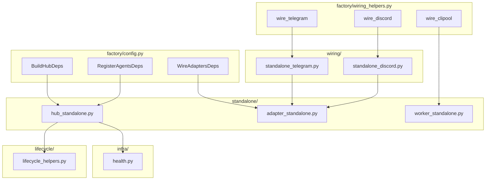
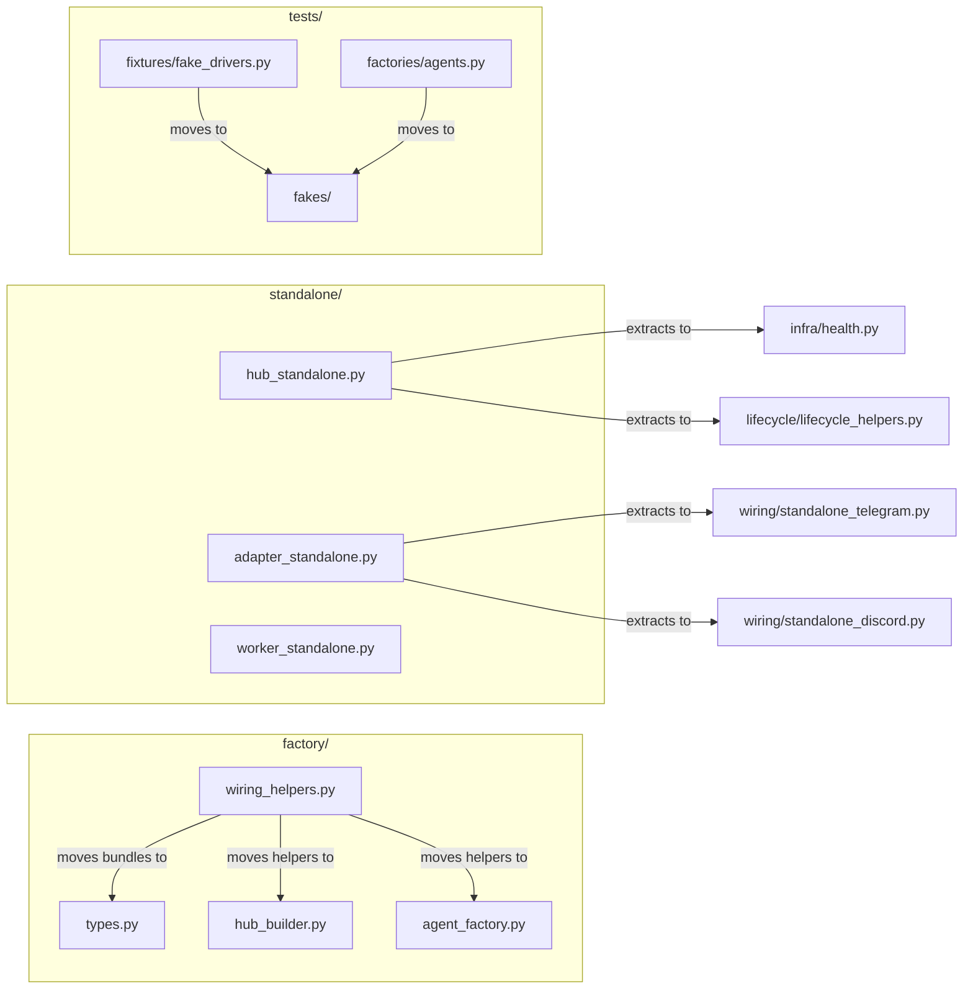

## Summary

Flatten the bootstrap standalone-vs-wired-vs-factory split by extracting platform-specific wiring, moving helper bundles, and consolidating test fakes. Two slices: S1 (bootstrap simplification) and S2 (test fakes isolation).

## Architecture

### Data Flow

### File × Function Map

## Bootstrap Context

Current bootstrap has ~1,424 lines across 31 files. `wiring_helpers.py` is 447 lines (largest). `adapter_standalone.py` is 351 lines with platform-specific Telegram (~160 lines) and Discord (~160 lines) branches interleaved. `hub_standalone.py` is 311 lines with health setup (~25 lines) and lifecycle closures (~15 lines) that belong elsewhere.

## Agents

| Agent | Task Count | Files | Subject |
|-------|------------|-------|---------|
| backend-dev-A | 4 | `bootstrap/factory/` | bootstrap, factory |
| backend-dev-B | 4 | `bootstrap/standalone/` | standalone, wiring |
| backend-dev-C | 4 | `bootstrap/wiring/` | wiring, extraction |
| devops-A | 3 | `tests/`, `.importlinter` | fakes, config |
| devops-B | 2 | `scripts/` | fakes, extraction |
| tester-A | 4 | `tests/` | tests, regressions |

## Wave Structure

2 waves, max 6 parallel agents. Elapsed ~3 days vs ~2.5 sequential.

| Wave | Trigger | Agents | Tasks |
|------|---------|--------|-------|
| 1 | start | 6 ∥ | backend-dev-A: T1–T4 · backend-dev-B: T5–T8 · backend-dev-C: T9–T12 · devops-A: T13–T15 · devops-B: T16–T17 · tester-A: T18–T21 |
| 2 | Wave 1 done | 6 ∥ | backend-dev-A: T22–T23 · backend-dev-B: T24 · backend-dev-C: T25 · devops-A: T26 · devops-B: T27 · tester-A: T28–T29 |

### Budget — per task

| Task | Items | Class | Est. ops | Split? |
|------|-------|-------|----------|--------|
| T1 Move bundles | 6 dataclasses | bounded | 3 | — |
| T2 Move _build_hub | 1 function | bounded | 3 | — |
| T3 Move _init_bot_auths | 1 function | bounded | 3 | — |
| T4 Move _init_clipool | 1 function | bounded | 3 | — |
| T5 Extract health setup | 1 block | bounded | 2 | — |
| T6 Extract lifecycle closures | 1 block | bounded | 2 | — |
| T7 Merge worker standalones | 2 files | bounded | 3 | — |
| T8 Flatten hub_standalone.py | 1 file | judgmental | 5 | — |
| T9 Extract Telegram standalone | 1 extraction | judgmental | 5 | — |
| T10 Extract Discord standalone | 1 extraction | judgmental | 5 | — |
| T11 Flatten adapter_standalone.py | 1 file | judgmental | 5 | — |
| T12 Remove bootstrap noqa | 5 sites | bounded | 3 | — |
| T13 Create FakeNatsClient | 1 class | bounded | 3 | — |
| T14 Create FakeStore | 1 class | bounded | 3 | — |
| T15 Move fake_drivers | 3 classes | bounded | 4 | — |
| T16 Move agents fakes | 3 classes | bounded | 4 | — |
| T17 Extract FakeNkeyProvider | 1 class | judgmental | 5 | — |
| T18 Update import-linter | 1 config | bounded | 3 | — |
| T19 Test baseline | 1 suite | exploratory | 10 | — |
| T20 Test fakes imports | 1 check | trivial | 1 | — |
| T21 Quick test run | 1 suite | exploratory | 8 | — |
| T22 Verify wiring_helpers.py lines | 1 check | trivial | 1 | — |
| T23 Verify standalone lines | 4 checks | trivial | 2 | — |
| T24 Verify adapter_standalone.py | 1 check | trivial | 1 | — |
| T25 Verify deps count | 1 grep | trivial | 1 | — |
| T26 Verify import-linter passes | 1 check | trivial | 1 | — |
| T27 Verify FakeNkeyProvider | 1 check | trivial | 1 | — |
| T28 Full test suite | 1 suite | exploratory | 10 | — |
| T29 Verify no new noqa | 1 grep | trivial | 1 | — |

**Total estimated ops: 109**

### Budget — per agent instance

| Instance | Tasks | Σ ops | Subjects | Split? |
|----------|-------|-------|----------|--------|
| backend-dev-A | T1–T4 | 12 | bootstrap | — |
| backend-dev-B | T5–T8 | 12 | standalone | — |
| backend-dev-C | T9–T12 | 18 | wiring | — |
| devops-A | T13–T15, T18 | 13 | fakes, config | — |
| devops-B | T16–T17 | 9 | fakes | — |
| tester-A | T19–T21 | 19 | tests | — |
| backend-dev-A (W2) | T22–T23 | 3 | bootstrap | — |
| backend-dev-B (W2) | T24 | 1 | standalone | — |
| backend-dev-C (W2) | T25 | 1 | wiring | — |
| devops-A (W2) | T26 | 1 | config | — |
| devops-B (W2) | T27 | 1 | fakes | — |
| tester-A (W2) | T28–T29 | 11 | tests | — |

## Consistency Report

| Spec Section | Covered By | Status |
|--------------|------------|--------|
| SC-1: standalone ≤4 files, ≤200 lines | T5–T8, T23–T24 | covered |
| SC-2: wiring_helpers.py ≤250 lines | T1–T4, T22 | covered |
| SC-3: wiring-bootstrap-deps ≤30 | T12, T25 | covered |
| SC-4: tests/fakes/ exists | T13–T18 | covered |
| SC-5: all tests pass | T19, T21, T28 | covered |
| SC-6: fakes importable | T20, T27 | covered |
| SC-7: zero new noqa | T29 | covered |

**Untraced:** None.

## Micro-Tasks

### Slice S1 — Flatten standalone + move wiring helpers

#### Phase RED — Establish baseline

**T1 — Move bundle dataclasses to `types.py`**
- **File:** `src/lyra/bootstrap/factory/wiring_helpers.py` → `src/lyra/bootstrap/types.py`
- **Description:** Move `VoiceBundle`, `BotAuthBundle`, `CliPoolBundle`, `BuildHubDeps`, `RegisterAgentsDeps`, `WireAdaptersDeps` from `wiring_helpers.py` to `types.py`. Update imports.
- **Verify:** `grep -n "class.*Bundle\|class.*Deps" src/lyra/bootstrap/types.py | wc -l`
- **Expected:** ≥6
- **Agent:** backend-dev-A
- **Subject:** bootstrap
- **Spec trace:** SC-2
- **Phase:** RED
- **Difficulty:** 2
- **[P]:** Y

**T2 — Move `_build_hub` to `hub_builder.py`**
- **File:** `src/lyra/bootstrap/factory/wiring_helpers.py` → `src/lyra/bootstrap/factory/hub_builder.py`
- **Description:** Move `_build_hub` function and its dependencies. Update imports.
- **Verify:** `grep -n "def _build_hub" src/lyra/bootstrap/factory/hub_builder.py`
- **Expected:** 1 match
- **Agent:** backend-dev-A
- **Subject:** bootstrap
- **Spec trace:** SC-2
- **Phase:** RED
- **Difficulty:** 2
- **[P]:** Y

**T3 — Move `_init_bot_auths_and_agents` to `agent_factory.py`**
- **File:** `src/lyra/bootstrap/factory/wiring_helpers.py` → `src/lyra/bootstrap/factory/agent_factory.py`
- **Description:** Move `_init_bot_auths_and_agents` function. Update imports.
- **Verify:** `grep -n "def _init_bot_auths_and_agents" src/lyra/bootstrap/factory/agent_factory.py`
- **Expected:** 1 match
- **Agent:** backend-dev-A
- **Subject:** bootstrap
- **Spec trace:** SC-2
- **Phase:** RED
- **Difficulty:** 2
- **[P]:** Y

**T4 — Move `_init_clipool` to `hub_builder.py`**
- **File:** `src/lyra/bootstrap/factory/wiring_helpers.py` → `src/lyra/bootstrap/factory/hub_builder.py`
- **Description:** Move `_init_clipool` function. Update imports.
- **Verify:** `grep -n "def _init_clipool" src/lyra/bootstrap/factory/hub_builder.py`
- **Expected:** 1 match
- **Agent:** backend-dev-A
- **Subject:** bootstrap
- **Spec trace:** SC-2
- **Phase:** RED
- **Difficulty:** 2
- **[P]:** Y

**T5 — Extract health setup from `hub_standalone.py` to `infra/health.py`**
- **File:** `src/lyra/bootstrap/standalone/hub_standalone.py` → `src/lyra/bootstrap/infra/health.py`
- **Description:** Move the health-server setup block (~25 lines) to `infra/health.py`. Update imports.
- **Verify:** `grep -n "health" src/lyra/bootstrap/infra/health.py | wc -l`
- **Expected:** ≥3
- **Agent:** backend-dev-B
- **Subject:** standalone
- **Spec trace:** SC-1
- **Phase:** RED
- **Difficulty:** 2
- **[P]:** Y

**T6 — Extract lifecycle closures from `hub_standalone.py` to `lifecycle/lifecycle_helpers.py`**
- **File:** `src/lyra/bootstrap/standalone/hub_standalone.py` → `src/lyra/bootstrap/lifecycle/lifecycle_helpers.py`
- **Description:** Move `_on_nats_reconnect` and `_freshness_drivers` closure patterns (~15 lines) to `lifecycle/lifecycle_helpers.py`.
- **Verify:** `grep -n "def _on_nats_reconnect\|def _freshness_drivers" src/lyra/bootstrap/lifecycle/lifecycle_helpers.py`
- **Expected:** 2 matches
- **Agent:** backend-dev-B
- **Subject:** standalone
- **Spec trace:** SC-1
- **Phase:** RED
- **Difficulty:** 2
- **[P]:** Y

**T7 — Merge `clipool_standalone.py` + `turn_writer_standalone.py` into `worker_standalone.py`**
- **File:** `src/lyra/bootstrap/standalone/clipool_standalone.py` + `src/lyra/bootstrap/standalone/turn_writer_standalone.py` → `src/lyra/bootstrap/standalone/worker_standalone.py`
- **Description:** Merge the two worker standalone files into one. Remove old files. Update imports.
- **Verify:** `ls src/lyra/bootstrap/standalone/ && wc -l src/lyra/bootstrap/standalone/worker_standalone.py`
- **Expected:** `worker_standalone.py` exists and ≤200 lines
- **Agent:** backend-dev-B
- **Subject:** standalone
- **Spec trace:** SC-1
- **Phase:** RED
- **Difficulty:** 2
- **[P]:** Y

**T8 — Flatten `hub_standalone.py` to ≤200 lines**
- **File:** `src/lyra/bootstrap/standalone/hub_standalone.py`
- **Description:** After T5–T6, refactor remaining code to reduce to ≤200 lines. Extract any remaining helpers.
- **Verify:** `wc -l src/lyra/bootstrap/standalone/hub_standalone.py`
- **Expected:** ≤200
- **Agent:** backend-dev-B
- **Subject:** standalone
- **Spec trace:** SC-1
- **Phase:** RED
- **Difficulty:** 3
- **[P]:** N

**T9 — Extract Telegram standalone logic to `wiring/standalone_telegram.py`**
- **File:** `src/lyra/bootstrap/standalone/adapter_standalone.py` → `src/lyra/bootstrap/wiring/standalone_telegram.py`
- **Description:** Extract the Telegram-specific bootstrap branch (~160 lines) into a new module. Keep imports clean.
- **Verify:** `wc -l src/lyra/bootstrap/wiring/standalone_telegram.py`
- **Expected:** ≤200
- **Agent:** backend-dev-C
- **Subject:** wiring
- **Spec trace:** SC-1
- **Phase:** RED
- **Difficulty:** 3
- **[P]:** Y

**T10 — Extract Discord standalone logic to `wiring/standalone_discord.py`**
- **File:** `src/lyra/bootstrap/standalone/adapter_standalone.py` → `src/lyra/bootstrap/wiring/standalone_discord.py`
- **Description:** Extract the Discord-specific bootstrap branch (~160 lines) into a new module. Keep imports clean.
- **Verify:** `wc -l src/lyra/bootstrap/wiring/standalone_discord.py`
- **Expected:** ≤200
- **Agent:** backend-dev-C
- **Subject:** wiring
- **Spec trace:** SC-1
- **Phase:** RED
- **Difficulty:** 3
- **[P]:** Y

**T11 — Flatten `adapter_standalone.py` to ≤200 lines**
- **File:** `src/lyra/bootstrap/standalone/adapter_standalone.py`
- **Description:** After T9–T10, refactor remaining code to reduce to ≤200 lines. Keep only shared orchestration.
- **Verify:** `wc -l src/lyra/bootstrap/standalone/adapter_standalone.py`
- **Expected:** ≤200
- **Agent:** backend-dev-C
- **Subject:** wiring
- **Spec trace:** SC-1
- **Phase:** RED
- **Difficulty:** 3
- **[P]:** N

**T12 — Remove `wiring-bootstrap-deps` noqa from bootstrap files**
- **File:** `src/lyra/bootstrap/**/*.py`
- **Description:** Remove `DEBT:wiring-bootstrap-deps` annotations from bootstrap files. If the function still needs noqa for other reasons, keep the noqa but remove the debt comment.
- **Verify:** `grep -r "wiring-bootstrap-deps" src/lyra/bootstrap/ --include="*.py" | wc -l`
- **Expected:** 0
- **Agent:** backend-dev-C
- **Subject:** wiring
- **Spec trace:** SC-3
- **Phase:** RED
- **Difficulty:** 1
- **[P]:** Y

### Slice S2 — Isolate test fakes

#### Phase RED — Establish baseline

**T13 — Create `FakeNatsClient` in `tests/fakes/`**
- **File:** `tests/fakes/nats_client.py`
- **Description:** Create a minimal fake NATS client for tests. Base it on common patterns from `tests/factories/agents.py` or `tests/fixtures/fake_drivers.py`.
- **Verify:** `python -c "from tests.fakes.nats_client import FakeNatsClient; print('ok')"`
- **Expected:** `ok`
- **Agent:** devops-A
- **Subject:** fakes
- **Spec trace:** SC-4
- **Phase:** RED
- **Difficulty:** 2
- **[P]:** Y

**T14 — Create `FakeStore` in `tests/fakes/`**
- **File:** `tests/fakes/store.py`
- **Description:** Create a minimal fake store for tests. Base it on common patterns.
- **Verify:** `python -c "from tests.fakes.store import FakeStore; print('ok')"`
- **Expected:** `ok`
- **Agent:** devops-A
- **Subject:** fakes
- **Spec trace:** SC-4
- **Phase:** RED
- **Difficulty:** 2
- **[P]:** Y

**T15 — Move fakes from `tests/fixtures/fake_drivers.py` to `tests/fakes/`**
- **File:** `tests/fixtures/fake_drivers.py` → `tests/fakes/`
- **Description:** Move `FakeTts`, `FakeStt`, `FakeClaudeCliDriver` to `tests/fakes/`. Update imports in test files.
- **Verify:** `python -c "from tests.fakes import FakeTts, FakeStt, FakeClaudeCliDriver; print('ok')"`
- **Expected:** `ok`
- **Agent:** devops-A
- **Subject:** fakes
- **Spec trace:** SC-4
- **Phase:** RED
- **Difficulty:** 3
- **[P]:** Y

**T16 — Move fakes from `tests/factories/agents.py` to `tests/fakes/`**
- **File:** `tests/factories/agents.py` → `tests/fakes/`
- **Description:** Move `MockAdapter`, `FakeTranscription`, `FakeSTT` to `tests/fakes/`. Update imports in test files.
- **Verify:** `python -c "from tests.fakes import MockAdapter, FakeTranscription, FakeSTT; print('ok')"`
- **Expected:** `ok`
- **Agent:** devops-B
- **Subject:** fakes
- **Spec trace:** SC-4
- **Phase:** RED
- **Difficulty:** 3
- **[P]:** Y

**T17 — Extract `FakeNkeyProvider` from `scripts/_nk.py` to `tests/fakes/`**
- **File:** `scripts/_nk.py` → `tests/fakes/nkey_provider.py`
- **Description:** Move `FakeNkeyProvider` class to `tests/fakes/`. Update `scripts/_modes.py` to conditionally import or use a test-only entry point.
- **Verify:** `python -c "from tests.fakes.nkey_provider import FakeNkeyProvider; print('ok')"`
- **Expected:** `ok`
- **Agent:** devops-B
- **Subject:** fakes
- **Spec trace:** SC-4
- **Phase:** RED
- **Difficulty:** 3
- **[P]:** Y

#### Phase GREEN — Make changes

**T18 — Update `.importlinter` with `tests.fakes` rule**
- **File:** `.importlinter`
- **Description:** Add a rule that `tests.fakes` may be imported by `tests.*` but not by `src.lyra.*` or production code. May require switching to `root_packages = lyra, tests`.
- **Verify:** `python -m importlinter --config .importlinter lint`
- **Expected:** passes (or shows expected violations that are resolved)
- **Agent:** devops-A
- **Subject:** config
- **Spec trace:** SC-4
- **Phase:** GREEN
- **Difficulty:** 3
- **[P]:** N

#### Phase RED-GATE — Verify metrics

**T19 — Run test suite baseline**
- **File:** `tests/`
- **Description:** Run full test suite before changes to establish baseline.
- **Verify:** `uv run pytest --tb=short -q`
- **Expected:** All tests pass
- **Agent:** tester-A
- **Subject:** tests
- **Spec trace:** SC-5
- **Phase:** RED-GATE
- **Difficulty:** 2
- **[P]:** N

**T20 — Verify `tests.fakes` imports work**
- **File:** `tests/fakes/`
- **Description:** Verify all new fakes are importable.
- **Verify:** `python -c "from tests.fakes import FakeNatsClient, FakeStore, FakeNkeyProvider; print('ok')"`
- **Expected:** `ok`
- **Agent:** tester-A
- **Subject:** tests
- **Spec trace:** SC-6
- **Phase:** RED-GATE
- **Difficulty:** 1
- **[P]:** Y

**T21 — Quick test run after Wave 1 changes**
- **File:** `tests/`
- **Description:** Run test suite after Wave 1 changes to catch regressions early.
- **Verify:** `uv run pytest --tb=short -q`
- **Expected:** All tests pass
- **Agent:** tester-A
- **Subject:** tests
- **Spec trace:** SC-5
- **Phase:** RED-GATE
- **Difficulty:** 2
- **[P]:** N

**T22 — Verify `wiring_helpers.py` ≤ 250 lines**
- **File:** `src/lyra/bootstrap/factory/wiring_helpers.py`
- **Verify:** `wc -l src/lyra/bootstrap/factory/wiring_helpers.py`
- **Expected:** ≤250
- **Agent:** backend-dev-A
- **Subject:** bootstrap
- **Spec trace:** SC-2
- **Phase:** RED-GATE
- **Difficulty:** 1
- **[P]:** Y

**T23 — Verify `standalone/` ≤ 4 files, each ≤ 200 lines**
- **File:** `src/lyra/bootstrap/standalone/*.py`
- **Verify:** `for f in src/lyra/bootstrap/standalone/*.py; do echo "$f: $(wc -l < $f)"; done`
- **Expected:** 4 files (excluding `__init__.py`), each ≤200
- **Agent:** backend-dev-A
- **Subject:** bootstrap
- **Spec trace:** SC-1
- **Phase:** RED-GATE
- **Difficulty:** 1
- **[P]:** Y

**T24 — Verify `adapter_standalone.py` ≤ 200 lines**
- **File:** `src/lyra/bootstrap/standalone/adapter_standalone.py`
- **Verify:** `wc -l src/lyra/bootstrap/standalone/adapter_standalone.py`
- **Expected:** ≤200
- **Agent:** backend-dev-B
- **Subject:** standalone
- **Spec trace:** SC-1
- **Phase:** RED-GATE
- **Difficulty:** 1
- **[P]:** Y

**T25 — Verify `wiring-bootstrap-deps` count ≤ 30**
- **File:** `src/lyra/`
- **Verify:** `grep -r "wiring-bootstrap-deps" src/lyra/ --include="*.py" | wc -l`
- **Expected:** ≤30
- **Agent:** backend-dev-C
- **Subject:** wiring
- **Spec trace:** SC-3
- **Phase:** RED-GATE
- **Difficulty:** 1
- **[P]:** Y

**T26 — Verify `.importlinter` passes**
- **File:** `.importlinter`
- **Verify:** `python -m importlinter --config .importlinter lint`
- **Expected:** passes
- **Agent:** devops-A
- **Subject:** config
- **Spec trace:** SC-4
- **Phase:** RED-GATE
- **Difficulty:** 1
- **[P]:** Y

**T27 — Verify `FakeNkeyProvider` extracted**
- **File:** `tests/fakes/nkey_provider.py`
- **Verify:** `python -c "from tests.fakes.nkey_provider import FakeNkeyProvider; print('ok')"`
- **Expected:** `ok`
- **Agent:** devops-B
- **Subject:** fakes
- **Spec trace:** SC-4
- **Phase:** RED-GATE
- **Difficulty:** 1
- **[P]:** Y

**T28 — Full test suite after all changes**
- **File:** `tests/`
- **Description:** Run full test suite after all changes.
- **Verify:** `uv run pytest --tb=short -q`
- **Expected:** All tests pass
- **Agent:** tester-A
- **Subject:** tests
- **Spec trace:** SC-5
- **Phase:** RED-GATE
- **Difficulty:** 2
- **[P]:** N

**T29 — Verify no new `# noqa: C901, PLR0915` in bootstrap**
- **File:** `src/lyra/bootstrap/`
- **Description:** Grep for new complexity noqa markers.
- **Verify:** `grep -r "noqa.*C901\|noqa.*PLR0915" src/lyra/bootstrap/ --include="*.py" | wc -l`
- **Expected:** 0
- **Agent:** tester-A
- **Subject:** tests
- **Spec trace:** SC-7
- **Phase:** RED-GATE
- **Difficulty:** 1
- **[P]:** Y

## Task Seeding Blueprint

### Wave 1 — no deps, 6 agents ∥

| Task | Agent instance | blockedBy | Subject |
|------|---------------|-----------|---------|
| T1 | backend-dev-A | — | bootstrap |
| T2 | backend-dev-A | — | bootstrap |
| T3 | backend-dev-A | — | bootstrap |
| T4 | backend-dev-A | — | bootstrap |
| T5 | backend-dev-B | — | standalone |
| T6 | backend-dev-B | — | standalone |
| T7 | backend-dev-B | — | standalone |
| T8 | backend-dev-B | — | standalone |
| T9 | backend-dev-C | — | wiring |
| T10 | backend-dev-C | — | wiring |
| T11 | backend-dev-C | — | wiring |
| T12 | backend-dev-C | — | wiring |
| T13 | devops-A | — | fakes |
| T14 | devops-A | — | fakes |
| T15 | devops-A | — | fakes |
| T16 | devops-B | — | fakes |
| T17 | devops-B | — | fakes |
| T18 | devops-A | — | config |
| T19 | tester-A | — | tests |
| T20 | tester-A | — | tests |
| T21 | tester-A | — | tests |

### Wave 2 — after Wave 1, 6 agents ∥

| Task | Agent instance | blockedBy | Subject |
|------|---------------|-----------|---------|
| T22 | backend-dev-A | T1–T4 | bootstrap |
| T23 | backend-dev-A | T1–T4 | bootstrap |
| T24 | backend-dev-B | T5–T8 | standalone |
| T25 | backend-dev-C | T9–T12 | wiring |
| T26 | devops-A | T13–T15, T18 | config |
| T27 | devops-B | T16–T17 | fakes |
| T28 | tester-A | T21, T26–T27 | tests |
| T29 | tester-A | T28 | tests |

## Task IDs

<!-- Generated by /plan. Used by /implement to resume tasks on session restart. -->
- T1: 13 — bootstrap
- T2: 14 — bootstrap
- T3: 15 — bootstrap
- T4: 16 — bootstrap
- T5: 17 — standalone
- T6: 18 — standalone
- T7: 19 — standalone
- T8: 20 — standalone
- T9: 21 — wiring
- T10: 22 — wiring
- T11: 23 — wiring
- T12: 24 — wiring
- T13: 25 — fakes
- T14: 26 — fakes
- T15: 27 — fakes
- T16: 28 — fakes
- T17: 29 — fakes
- T18: 30 — config
- T19: 31 — tests
- T20: 32 — tests
- T21: 33 — tests
- T22: 34 — bootstrap
- T23: 35 — bootstrap
- T24: 36 — standalone
- T25: 37 — wiring
- T26: 38 — config
- T27: 39 — fakes
- T28: 40 — tests
- T29: 41 — tests
