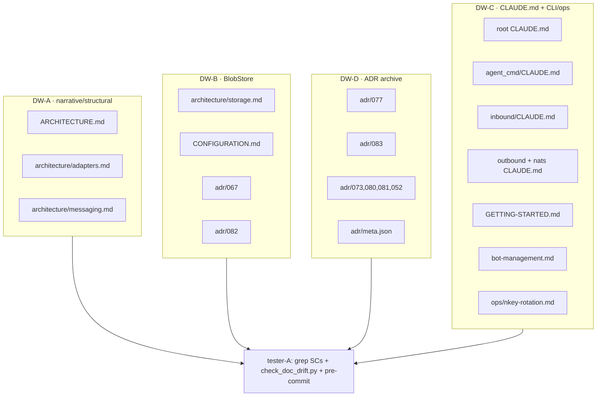
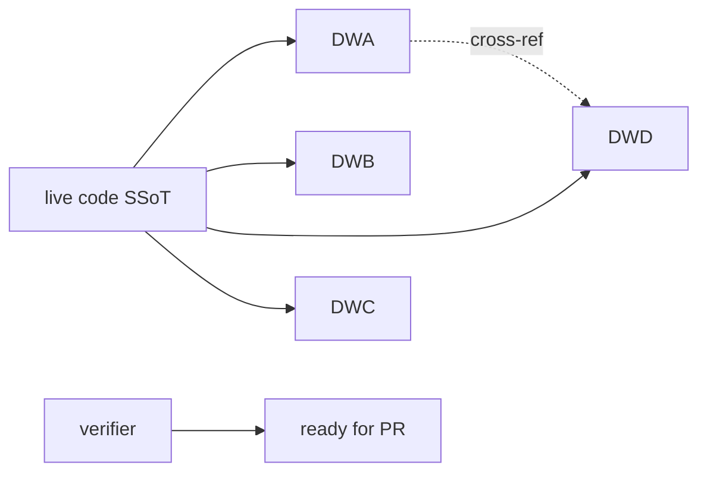

## Summary

Sync the narrative/inventory doc layer (domain pages, `ARCHITECTURE.md`, `CLAUDE.md`,
`meta.json`, CLI/ops docs) to the landed stage-axis refactor. 4 parallel doc-writer instances
**partitioned by file ownership** (not slice) so no two agents touch the same file, then a
verifier runs the grep-based success criteria + `check_doc_drift.py` + pre-commit.

## Architecture

## Agents

| Agent instance | Tasks | Files (exclusive ownership) | Subject |
|---|---|---|---|
| doc-writer · DW-A | T1–T3 | ARCHITECTURE.md, adapters.md, messaging.md | stage-narrative (coupled) |
| doc-writer · DW-B | T4–T6 | storage.md, CONFIGURATION.md, adr/067, adr/082 | blobstore |
| doc-writer · DW-D | T7–T10 | adr/077, adr/083, adr/073/080/081/052, meta.json | adr-archive |
| doc-writer · DW-C | T11–T13 | root+agent_cmd+inbound+outbound+nats CLAUDE.md, GETTING-STARTED, bot-management, nkey-rotation | claude+cli-ops |
| tester · tester-A | T14 | (read-only verify) | gate |

## Wave Structure

2 waves, max 4 parallel agents. Elapsed ~1 day vs ~3 days sequential.

| Wave | Trigger | Agents | Tasks |
|---|---|---|---|
| 1 | start | 4 ∥ | DW-A: T1→T2→T3 · DW-B: T4,T5,T6 · DW-D: T7,T8,T9,T10 · DW-C: T11,T12,T13 |
| 2 | Wave 1 done | 1 | tester-A: T14 (RED-GATE) |

### Budget — per task

| Task | Items | Class | Est. ops | Split? |
|---|---|---|---|---|
| T1 ARCHITECTURE.md narrative | 4 (D2,E1,E2,E3) | judgmental | 10 | — |
| T2 adapters.md stage+tempfile | 2 (E4,B6) | judgmental | 9 | — |
| T3 messaging.md transport+audio | 2 (E5,B5) | judgmental | 8 | — |
| T4 storage.md BlobStore | 1 (A1) | judgmental | 6 | — |
| T5 CONFIGURATION.md | 1 (A2) | bounded | 3 | — |
| T6 adr/067+082 | 3 (A3,A4,C1-082) | bounded | 6 | — |
| T7 adr/077 audio facts | 1 (B2) | bounded | 4 | — |
| T8 adr/083 status+banner | 1 (B1) | judgmental | 5 | — |
| T9 adr status 073/080/081 + 052 | 2 (C1,C2) | bounded | 5 | — |
| T10 meta.json index 4 | 1 (C3) | bounded | 4 | — |
| T11 root CLAUDE.md | 3 (D1,F1,F3) | judgmental | 7 | — |
| T12 subdir CLAUDE.md | 4 (F2,B4,B3×2) | bounded | 8 | — |
| T13 GETTING-STARTED+bot+nkey | 3 (F4,F5,F6) | bounded | 6 | — |
| T14 verify all SCs | 14 SCs | judgmental | 12 | — |
**Total estimated ops: ~93**

### Budget — per agent instance

| Instance | Tasks | Σ ops | Subjects | Split? |
|---|---|---|---|---|
| DW-A | T1,T2,T3 | 27 | stage-narrative¹ | — (¹coupled files, conflict-avoidance > subject cap) |
| DW-B | T4,T5,T6 | 15 | blobstore | — |
| DW-D | T7,T8,T9,T10 | 18 | adr-archive | — (one cognitive surface: the adr/ folder) |
| DW-C | T11,T12,T13 | 21 | claude+cli-ops | — |
| tester-A | T14 | 12 | gate | — |

All instances ≤4 tasks, ≤50 ops. DW-A/DW-D subject-cap exceptions justified (tightly-coupled
narrative; single folder surface).

## Consistency Report

- Affordances covered: 24/24 (A1-A4, B1-B6, C1-C3, D1-D2, E1-E5, F1-F6) → mapped across T1-T13.
- Success criteria: 14/14 verified by T14.
- Untraced tasks: 0. Exemptions: none.

## Micro-Tasks

**DW-A (ARCHITECTURE.md → adapters.md → messaging.md, sequential within instance to keep the
stage-axis story coherent):**
- **T1** `docs/ARCHITECTURE.md` — D2: replace deleted-module rows (`_shared_streaming_emitter.py`→`lyra.outbound.emitter.OutboundEmitter`; `nats_driver.py`/`cli_nats.py`→`LlmClient`+`WorkerPoolClient`; `clipool_standalone.py`→`worker_standalone.py`); E1: rewrite Adapter Streaming Pattern (`OutboundAdapterBase._make_emitter()` composes formatter/throttle/error_handler — drop `StreamingSession`/`PlatformCallbacks`); E2: add `lyra/outbound/`+`lyra/inbound/` module-layout rows + `telegram_formatter.py`/`discord_formatter.py`; E3: clarify dual inbound pipelines (adapter-side `InboundPipeline` pre-NATS vs hub-side middleware post-NATS). Verify: `grep -c 'PlatformCallbacks\|_shared_streaming_emitter\|nats_driver\|cli_nats\|clipool_standalone' docs/ARCHITECTURE.md` = 0. [Phase GREEN, diff 4, SC: D2/E1/E2/E3]
- **T2** `docs/architecture/adapters.md` — E4: add "Outbound stage composition" + "Inbound stage pipeline" sections (ref ADR-073, #1279/#1280), update Scope, remove stale `PlatformCallbacks`/`_make_streaming_callbacks`; B6: rewrite ADR-013 temp-file section (immediate read+unlink, `PendingAttachment` closure, no `STTService`), reply_message_id "status unclear"→implemented, line refs→symbol refs. Verify: `grep -c 'PlatformCallbacks\|_make_streaming_callbacks\|STTService' docs/architecture/adapters.md` = 0 ∧ `grep -q '_make_emitter\|InboundPipeline' docs/architecture/adapters.md`. [GREEN, diff 4, SC: E4/B6]
- **T3** `docs/architecture/messaging.md` — E5: add "Transport layer" section (3-layer `NatsTransport → WorkerPoolClient → DomainClient`, `HttpTransport` P4 skeleton, `Result[T]`/`SanitizedError`); B5: add `lyra.outbound.audio.<platform>.<bot_id>` subject row + audio-delivery plane row. Verify: `grep -q 'WorkerPoolClient' docs/architecture/messaging.md && grep -q 'NatsTransport' docs/architecture/messaging.md && grep -q 'lyra.outbound.audio' docs/architecture/messaging.md`. [GREEN, diff 3, SC: E5/B5 — issue deliverable #2]

**DW-B (BlobStore):**
- **T4** `docs/architecture/storage.md` — A1: `/health`→`/healthz`, delete `/blobs/{store_key}/exists` row, add ADR-082 to archive table, add `BlobStorePort`/`HttpBlobStoreAdapter`/`from_store_ref` paragraph. Verify: `! grep -qE '/health\b' docs/architecture/storage.md && ! grep -q '/exists' docs/architecture/storage.md && grep -q 'BlobStorePort' docs/architecture/storage.md`. [GREEN, diff 3, SC: A1]
- **T5** `docs/CONFIGURATION.md` — A2: `init_blobstore()` "hub process"→"each adapter process + unified". Verify: `grep -q 'adapter process' docs/CONFIGURATION.md`. [GREEN, diff 2, SC: A2]
- **T6** `docs/architecture/adr/067-*.mdx` + `082-*.mdx` — A3: remove `FsBlobStore.exists()` clause + `dedup: bool` from put() response; A4: note `PENDING_STORE_KEY` retired #1553→empty-key guard; C1(082): add `status: accepted` frontmatter. Verify: `grep -q '^status:' docs/architecture/adr/082-*.mdx`. [GREEN, diff 2, SC: A3/A4/C1]

**DW-D (ADR archive):**
- **T7** `docs/architecture/adr/077-*.mdx` — B2: `MaxAge 5m`→`24h`, KV TTL→`900s`, consumer `audio-delivery-v1`→`outbound-audio-{platform}-{bot_id}`. Verify: `! grep -q '5m\|audio-delivery-v1' docs/architecture/adr/077-*.mdx`. [GREEN, diff 2, SC: B2]
- **T8** `docs/architecture/adr/083-*.mdx` — B1: set frontmatter `status: accepted` + Update banner (S1-S2 landed #1551/#1552, S3-S7 remain), strike "already done" STT consequence. Verify: `grep -q '^status: accepted' docs/architecture/adr/083-*.mdx`. [GREEN, diff 3, SC: B1]
- **T9** `docs/architecture/adr/{073,080,081}-*.mdx` + `052-*.mdx` — C1: add `status: accepted` frontmatter (3 files); C2: adr/052 `accepted`→`amended` + note `_walk_registry` absorbed into `WorkerPoolClient` #1278. Verify: `! grep -L '^status:' docs/architecture/adr/073-*.mdx docs/architecture/adr/080-*.mdx docs/architecture/adr/081-*.mdx | grep . && grep -q '^status: amended' docs/architecture/adr/052-*.mdx`. [GREEN, diff 2, SC: C1/C2]
- **T10** `docs/architecture/adr/meta.json` — C3: add entries 072,075,078,083 to appropriate `---Label---` groups. Verify: `python3 -c "import json,glob,os; p=json.load(open('docs/architecture/adr/meta.json'))['pages']; mdx={os.path.basename(f)[:-4] for f in glob.glob('docs/architecture/adr/*.mdx')}; missing=mdx-set(p); assert not missing, missing"`. [GREEN, diff 3, SC: C3]

**DW-C (CLAUDE.md + CLI/ops):**
- **T11** root `CLAUDE.md` — D1: add hygiene rows `agent_cmd/bots/CLAUDE.md`+`packages/roxabi-blobs/CLAUDE.md`; F1: `auth.db`→`config.db` for agents (auth.db=grants only); F3: add `turn-writer` entry-point row, "Six containers"→"Eight" (+blobstore,+turn-writer). Verify: `grep -q 'config.db' CLAUDE.md && grep -q 'turn-writer' CLAUDE.md && grep -q 'Eight containers\|eight containers' CLAUDE.md`. [GREEN, diff 3, SC: D1/F1/F3]
- **T12** `agent_cmd/CLAUDE.md`+`inbound/CLAUDE.md`+`outbound/CLAUDE.md`+`nats/CLAUDE.md` — F2: AgentStore `auth.db`→`config.db` (2 sites); B4: add attachment-ingest stage to inbound pipeline diagram; B3: outbound+nats CLAUDE.md MaxAge `5m`→`24h`, consumer name fix, T7/T14→provisioned. Verify: `! grep -q '5m\|audio-delivery-v1' src/lyra/outbound/CLAUDE.md src/lyra/nats/CLAUDE.md && grep -q 'config.db' src/lyra/agent_cmd/CLAUDE.md && grep -qi 'ingest' src/lyra/inbound/CLAUDE.md`. [GREEN, diff 3, SC: F2/B4/B3]
- **T13** `docs/GETTING-STARTED.md`+`docs/bot-management.md`+`docs/ops/nkey-rotation.md` — F4: "five units"→eight (+blobstore,+turn-writer); F5: `lyra bot list`→`lyra agent telegram/discord list`; F6: `lyra ops verify` "planned"→implemented. Verify: `! grep -q 'lyra bot list' docs/bot-management.md`. [GREEN, diff 2, SC: F4/F5/F6]

**Verify (RED-GATE):**
- **T14** run all 14 success-criteria greps + `uv run python tools/check_doc_drift.py` + `uv run pre-commit run --all-files`. Report pass/fail per SC; on any fail, list the offending file:line for the owning DW instance to fix. Verify: all SCs green ∧ both gates pass. [RED-GATE, diff 3, blocked by T1-T13]

## Task Seeding Blueprint

<!-- Used by /implement to seed TaskCreate calls. T{n} | agent-instance | blockedBy | subject -->

### Wave 1 — no deps, 4 agents ∥

| Task | Agent instance | blockedBy | Subject |
|---|---|---|---|
| T1 | DW-A | — | stage-narrative |
| T2 | DW-A | T1 | adapters |
| T3 | DW-A | T2 | messaging |
| T4 | DW-B | — | blobstore |
| T5 | DW-B | — | blobstore |
| T6 | DW-B | — | blobstore |
| T7 | DW-D | — | audio-adr |
| T8 | DW-D | — | ingest-adr |
| T9 | DW-D | — | adr-status |
| T10 | DW-D | — | meta-json |
| T11 | DW-C | — | root-claude |
| T12 | DW-C | — | subdir-claude |
| T13 | DW-C | — | cli-ops |

### Wave 2 — after Wave 1, 1 agent

| Task | Agent instance | blockedBy | Subject |
|---|---|---|---|
| T14 | tester-A | T1,T2,T3,T4,T5,T6,T7,T8,T9,T10,T11,T12,T13 | gate |

## Task IDs

<!-- Generated by /plan. Used by /implement to resume tasks on session restart. -->
- T1: 13 — stage-narrative (DW-A)
- T2: 14 — adapters (DW-A, ←T1)
- T3: 15 — messaging (DW-A, ←T2)
- T4: 16 — blobstore (DW-B)
- T5: 17 — blobstore (DW-B)
- T6: 18 — blobstore (DW-B)
- T7: 19 — audio-adr (DW-D)
- T8: 20 — ingest-adr (DW-D)
- T9: 21 — adr-status (DW-D)
- T10: 22 — meta-json (DW-D)
- T11: 23 — root-claude (DW-C)
- T12: 24 — subdir-claude (DW-C)
- T13: 25 — cli-ops (DW-C)
- T14: 26 — gate (tester-A, ←T1..T13)
