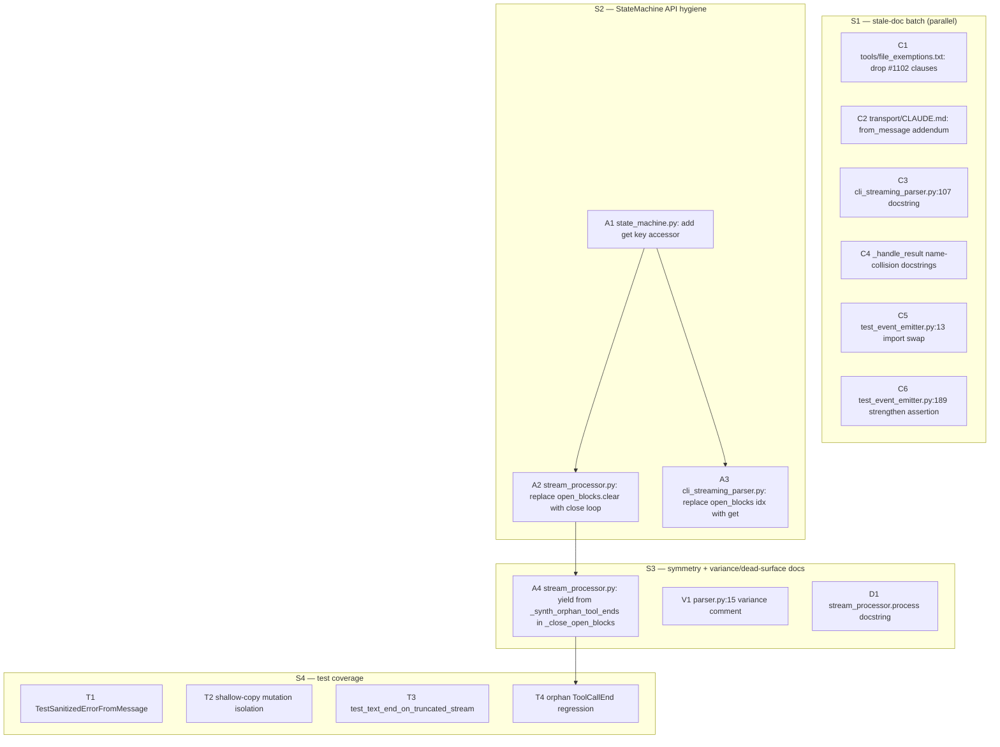
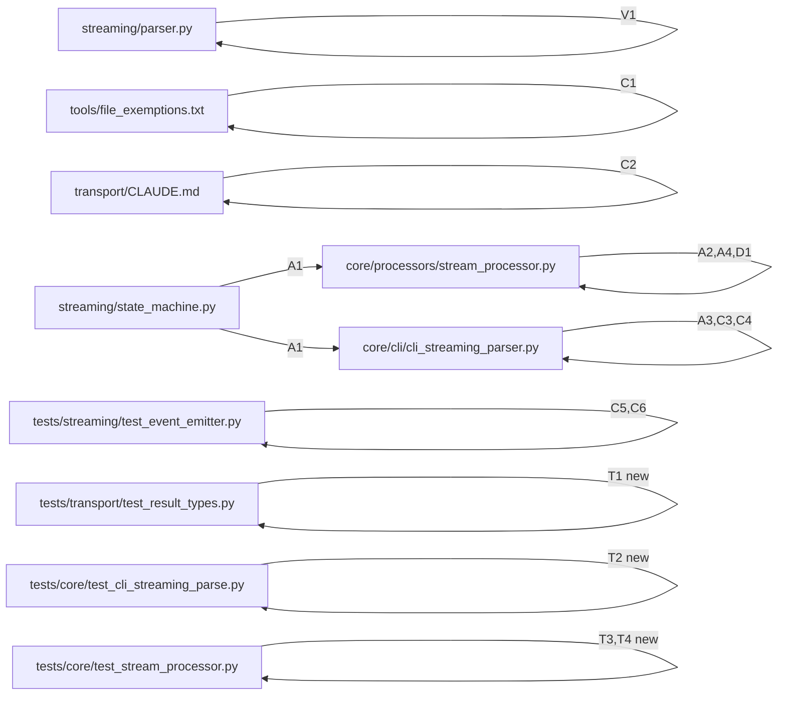

## Summary

Land the 14 iter-2 follow-ups in 4 slices: stale-doc cleanup → `StateMachine` API hygiene → truncation symmetry + variance/dead-surface docs → test coverage. Sequencing constraint: A4 (truncation symmetry) must land after A2 (sanctioned `StateMachine.close()` call replaces direct `open_blocks.clear()`); T4 (regression test) must land after A4.

## Architecture





## Bootstrap Context

- Spec: `artifacts/specs/1321-phase-5-iter-2-followups-spec.mdx` (locked decisions + 15 binary success criteria).
- Frame: `artifacts/frames/1321-phase-5-iter-2-followups-frame.mdx` (premise + scope, ratified ADR-073).
- ADR-073: `docs/architecture/adr/073-axial-stage-of-pipeline-decomposition.mdx` — primary axis is `stage`, anti-pattern `class.*Client.*Client`.
- Source PR: #1317 (merged `08824dee`, closed #1282). Review iter-2 comment: PR #1317 comment 4518914884.
- Subsystem docs: `src/lyra/streaming/CLAUDE.md` (Protocol-is-structural rule), `src/lyra/transport/CLAUDE.md` (SanitizedError boundary).

## Agents

| Agent | Instance | Tasks | Subject |
|-------|----------|-------|---------|
| backend-dev | backend-dev-A | A1, A2, A3, A4 | statemachine-symmetry |
| backend-dev | backend-dev-B | C3, C4, V1, D1 | doc-edit |
| tester | tester-A | T1, T3 | new-tests-existing-code |
| tester | tester-B | T2, T4 | isolation-and-regression |
| tester | tester-C | C5, C6 | event-emitter-test-edits |
| devops | devops-A | C1 | exemption-cleanup |
| doc-writer | doc-writer-A | C2 | transport-claude-md |

## Wave Structure

2 waves, max 7 parallel agents. Most work is wave-1 parallel; only the A4→T4 chain forces a wave-2 dependency.

| Wave | Trigger | Agents | Tasks |
|------|---------|--------|-------|
| 1 | start | 7 ∥ | backend-dev-A: T1→T2→T3 (S2: A1, A2, A3) then T4 (S3: A4) chained · backend-dev-B: T5, T6, T7, T8 (S1+S3: C3, C4, V1, D1) ∥ · tester-A: T9, T10 (S4: T1, T3) ∥ · tester-B: T11 (S4: T2) then waits for backend-dev-A · tester-C: T13, T14 (S1: C5, C6) ∥ · devops-A: T15 (S1: C1) · doc-writer-A: T16 (S1: C2) |
| 2 | backend-dev-A finished | 1 | tester-B: T12 (S4: T4 regression for A4) |

Elapsed estimate: ~2–3 hours wall-clock if executed in parallel vs ~6 hours sequential.

### Budget — per task

| Task | Items | Class | Est. ops | Split? |
|------|-------|-------|----------|--------|
| T1 (=A1) add `StateMachine.get(key)` | 1 | bounded | 2 | — |
| T2 (=A2) replace `open_blocks.clear()` with close loop | 1 | judgmental | 4 | — |
| T3 (=A3) replace `open_blocks[idx]` with `get(idx)` | 1 | bounded | 2 | — |
| T4 (=A4) add `yield from _synth_orphan_tool_ends` in `_close_open_blocks` | 1 | bounded | 2 | — |
| T5 (=C3) qualify `finalize/is_done` docstring claim | 1 | bounded | 2 | — |
| T6 (=C4) document `_handle_result` collision (both files) | 2 | bounded | 4 | — |
| T7 (=V1) add variance comment in `parser.py` | 1 | trivial | 1 | — |
| T8 (=D1) update `process()` docstring | 1 | bounded | 2 | — |
| T9 (=T1) `TestSanitizedErrorFromMessage` × 4 cases | 4 | judgmental | 5 | — |
| T10 (=T3) `test_text_end_on_truncated_stream` | 1 | bounded | 3 | — |
| T11 (=T2) shallow-copy mutation test | 1 | judgmental | 4 | — |
| T12 (=T4) orphan `ToolCallEnd` regression | 1 | judgmental | 4 | — |
| T13 (=C5) import swap | 1 | trivial | 1 | — |
| T14 (=C6) strengthen ordering test assertion | 1 | bounded | 2 | — |
| T15 (=C1) drop `#1102` clauses | 2 | trivial | 1 | — |
| T16 (=C2) `transport/CLAUDE.md` addendum | 1 | bounded | 2 | — |

**Total estimated ops: 41**

### Budget — per agent instance

| Instance | Tasks | Σ ops | Subjects | Split? |
|----------|-------|-------|----------|--------|
| backend-dev-A | T1, T2, T3, T4 | 10 | statemachine-symmetry | — |
| backend-dev-B | T5, T6, T7, T8 | 9 | doc-edit | — |
| tester-A | T9, T10 | 8 | new-tests-existing-code | — |
| tester-B | T11, T12 | 8 | isolation-and-regression | — |
| tester-C | T13, T14 | 3 | event-emitter-test-edits | — |
| devops-A | T15 | 1 | exemption-cleanup | — |
| doc-writer-A | T16 | 2 | transport-claude-md | — |

All within caps (|tasks| ≤4, Σ ops ≤50, subjects ≤2).

## Consistency Report

- Spec criteria: 15. Covered by tasks: 15/15.
- No uncovered criteria. No untraced tasks.
- Exemptions: none.

## Micro-Tasks

### Slice S1 — Stale-doc batch (no deps; parallel)

#### T13 [P] (=C5) Swap `SanitizedError` import to public re-export
- **File:** `tests/streaming/test_event_emitter.py:13`
- **Snippet:** `from lyra.transport import SanitizedError`  (was: `from lyra.transport._result import SanitizedError`)
- **Verify:** `grep -n "from lyra.transport._result import SanitizedError" tests/streaming/test_event_emitter.py`
- **Expected:** 0 matches
- **Time:** 2 min · **Agent:** tester · **Instance:** tester-C · **Subject:** event-emitter-test-edits
- **Spec trace:** SC-7 · **Slice:** V1 · **Phase:** REFACTOR · **Difficulty:** 1

#### T14 [P] (=C6) Strengthen `test_terminal_before_flush_breaks_ordering` assertion
- **File:** `tests/streaming/test_event_emitter.py:189`
- **Snippet:** assert the full `result` list shape, not just `result[0]`; verify `_pending.append` is exercised by the sister test `test_flush_then_terminal_preserves_ordering` (rename or strengthen as documented in spec).
- **Verify:** `uv run pytest tests/streaming/test_event_emitter.py::test_terminal_before_flush_breaks_ordering -v`
- **Expected:** pass; mutation-killing — deleting `emit_ok`'s `_pending.append` must break the test
- **Time:** 5 min · **Agent:** tester · **Instance:** tester-C · **Subject:** event-emitter-test-edits
- **Spec trace:** SC-8 · **Slice:** V1 · **Phase:** REFACTOR · **Difficulty:** 2

#### T15 [P] (=C1) Drop stale `#1102` clauses
- **File:** `tools/file_exemptions.txt:10,13`
- **Snippet:** remove ` + F5 Site B sanitization via SanitizedError.from_message (cleanup in Slice 5 / #1102)` and ` + #1282 1b1: F7 shallow-copy on compat properties (cleanup in Slice 5 / #1102)`. Update line-count for `stream_processor.py` if A4 changes it (+1).
- **Verify:** `grep -n "#1102" tools/file_exemptions.txt`
- **Expected:** 0 matches
- **Time:** 2 min · **Agent:** devops · **Instance:** devops-A · **Subject:** exemption-cleanup
- **Spec trace:** SC-1 · **Slice:** V1 · **Phase:** REFACTOR · **Difficulty:** 1

#### T16 [P] (=C2) Add `from_message` Phase 5 addendum to transport/CLAUDE.md
- **File:** `src/lyra/transport/CLAUDE.md`
- **Snippet:** new section (or paragraph in `## SanitizedError`): "`from_message` was added in Phase 5 (#1282) as a Phase 1 addendum for sanitizing soft-error wire text (empty fallback, ctrl-char strip, 200-char truncate). Security boundary semantics unchanged: callers do not embed raw exception text in `SanitizedError`."
- **Verify:** `grep -n "from_message" src/lyra/transport/CLAUDE.md`
- **Expected:** ≥1 match
- **Time:** 5 min · **Agent:** doc-writer · **Instance:** doc-writer-A · **Subject:** transport-claude-md
- **Spec trace:** SC-2 · **Slice:** V1 · **Phase:** REFACTOR · **Difficulty:** 2

### Slice S2 — StateMachine API hygiene

#### T1 (=A1) Add `StateMachine.get(key)` accessor
- **File:** `src/lyra/streaming/state_machine.py`
- **Snippet:**
  ```python
  def get(self, key: K) -> V | None:
      """Return the open block value for *key*, or None if not open."""
      return self.open_blocks.get(key)
  ```
- **Verify:** `grep -n "def get" src/lyra/streaming/state_machine.py`
- **Expected:** new method present; unit tests in `tests/streaming/test_state_machine.py` still pass
- **Time:** 3 min · **Agent:** backend-dev · **Instance:** backend-dev-A · **Subject:** statemachine-symmetry
- **Spec trace:** SC-3 · **Slice:** V2 · **Phase:** GREEN · **Difficulty:** 1

#### T2 (=A2) Replace `_sm_tool.open_blocks.clear()` with sanctioned close loop
- **File:** `src/lyra/core/processors/stream_processor.py:~538`
- **Snippet:**
  ```python
  for tid in sorted(list(self._sm_tool.open_blocks.keys())):
      yield ToolCallEndRenderEvent(tid)
      self._sm_tool.close(tid)
  ```
- **Verify:** `grep -n "_sm_tool.open_blocks.clear\|_sm_tool\\.open_blocks\\[" src/lyra/core/processors/stream_processor.py`
- **Expected:** 0 matches
- **Time:** 8 min · **Agent:** backend-dev · **Instance:** backend-dev-A · **Subject:** statemachine-symmetry
- **Spec trace:** SC-5 · **Slice:** V2 · **Phase:** GREEN · **Difficulty:** 2
- **Depends on:** T1

#### T3 (=A3) Replace direct `open_blocks[idx]` read in `_handle_content_block_delta`
- **File:** `src/lyra/core/cli/cli_streaming_parser.py:~328`
- **Snippet:** swap `self._sm_tool_blocks.open_blocks[idx]` for `self._sm_tool_blocks.get(idx)` (the preceding `is_open(idx)` guard means `None` is impossible at the callsite — assertable).
- **Verify:** `grep -n "open_blocks\\[" src/lyra/core/cli/cli_streaming_parser.py`
- **Expected:** 0 matches
- **Time:** 3 min · **Agent:** backend-dev · **Instance:** backend-dev-A · **Subject:** statemachine-symmetry
- **Spec trace:** SC-4 · **Slice:** V2 · **Phase:** GREEN · **Difficulty:** 1
- **Depends on:** T1

#### RED-GATE S2 — quality gates green after V2
- **Verify:** `uv run pytest tests/core/test_stream_processor.py tests/core/test_cli_streaming_parse.py tests/streaming/ && uv run ruff check . && uv run pyright`
- **Expected:** all green; no new file-length violations
- **Phase:** RED-GATE

### Slice S3 — Symmetry + variance/dead-surface docs

#### T4 (=A4) Add `yield from _synth_orphan_tool_ends()` in `_close_open_blocks`
- **File:** `src/lyra/core/processors/stream_processor.py:~492-520`
- **Snippet:** at end of `_close_open_blocks` (truncation/exception paths): `yield from self._synth_orphan_tool_ends()`
- **Verify:** `grep -n "yield from self._synth_orphan_tool_ends" src/lyra/core/processors/stream_processor.py | wc -l`
- **Expected:** ≥2 matches (the existing `_handle_result` call AND the new `_close_open_blocks` call)
- **Time:** 5 min · **Agent:** backend-dev · **Instance:** backend-dev-A · **Subject:** statemachine-symmetry
- **Spec trace:** SC-5 (impl side) · **Slice:** V3 · **Phase:** GREEN · **Difficulty:** 2
- **Depends on:** T2 (must be sequenced after A2)

#### T7 [P] (=V1) Add variance-vs-runtime comment in `parser.py:15`
- **File:** `src/lyra/streaming/parser.py:15`
- **Snippet:**
  ```python
  # Variance enforced by static analysis (mypy/pyright). @runtime_checkable is
  # shape-only — isinstance(x, Parser) does not see variance. See streaming/CLAUDE.md
  # §Protocol is structural.
  InT = TypeVar("InT", contravariant=True)
  OutT = TypeVar("OutT", covariant=True)
  ```
- **Verify:** `grep -n "Variance enforced by static analysis" src/lyra/streaming/parser.py`
- **Expected:** 1 match
- **Time:** 2 min · **Agent:** backend-dev · **Instance:** backend-dev-B · **Subject:** doc-edit
- **Spec trace:** SC-6 · **Slice:** V3 · **Phase:** REFACTOR · **Difficulty:** 1

#### T8 [P] (=D1) Document `EventEmitter` unused surface in `StreamProcessor.process()`
- **File:** `src/lyra/core/processors/stream_processor.py` (the `process()` method's docstring)
- **Snippet:** add line in docstring: "Uses the local `EventEmitter` only for `emit_terminal`; `flush`/`emit_ok` are intentionally unused — events are yielded directly. See streaming/CLAUDE.md §Ordering rule for the deferred narrowing rationale."
- **Verify:** `grep -n "emit_terminal\\b.*intentionally unused\\|intentionally unused" src/lyra/core/processors/stream_processor.py`
- **Expected:** ≥1 match
- **Time:** 3 min · **Agent:** backend-dev · **Instance:** backend-dev-B · **Subject:** doc-edit
- **Spec trace:** SC-12 · **Slice:** V3 · **Phase:** REFACTOR · **Difficulty:** 1

#### T5 [P] (=C3) Qualify `finalize`/`is_done` claim in CSP docstring
- **File:** `src/lyra/core/cli/cli_streaming_parser.py:107`
- **Snippet:** docstring now says: "Only `parse_line` is implemented today. The `Parser` Protocol's `feed`/`finalize`/`is_done` shape is the target for future stream sources — see streaming/CLAUDE.md §Protocol is structural."
- **Verify:** `grep -n "Only.*parse_line.*is implemented today\\|Protocol is structural" src/lyra/core/cli/cli_streaming_parser.py`
- **Expected:** ≥1 match
- **Time:** 3 min · **Agent:** backend-dev · **Instance:** backend-dev-B · **Subject:** doc-edit
- **Spec trace:** SC-14 · **Slice:** V3 · **Phase:** REFACTOR · **Difficulty:** 1

#### T6 [P] (=C4) Document `_handle_result` name collision in both files
- **Files:** `src/lyra/core/cli/cli_streaming_parser.py:~376`, `src/lyra/core/processors/stream_processor.py:~447`
- **Snippet:** docstring on each method: "Name collision: CSP takes `dict`, SP takes `ResultLlmEvent` — intentional shadowing by class context, NOT shared behavior. Cross-ref: the other `_handle_result`."
- **Verify:** `grep -c "Name collision: CSP takes" src/lyra/core/cli/cli_streaming_parser.py src/lyra/core/processors/stream_processor.py`
- **Expected:** ≥1 in each file
- **Time:** 5 min · **Agent:** backend-dev · **Instance:** backend-dev-B · **Subject:** doc-edit
- **Spec trace:** SC-13 · **Slice:** V3 · **Phase:** REFACTOR · **Difficulty:** 1

#### RED-GATE S3 — gates green after V3
- **Verify:** `uv run ruff check . && uv run pyright && uv run pytest tests/streaming/ tests/core/`
- **Phase:** RED-GATE

### Slice S4 — Test coverage

#### T9 [P] (=T1) `TestSanitizedErrorFromMessage` × 4 cases
- **File:** `tests/transport/test_result_types.py` (new test class in existing file, or new file if absent)
- **Snippet:** test cases — (a) empty input → fallback message; (b) input with ctrl chars → stripped; (c) input >200 chars → truncated; (d) clean input → preserved.
- **Verify:** `uv run pytest tests/transport/test_result_types.py::TestSanitizedErrorFromMessage -v`
- **Expected:** 4 cases pass
- **Time:** 10 min · **Agent:** tester · **Instance:** tester-A · **Subject:** new-tests-existing-code
- **Spec trace:** SC-9 · **Slice:** V4 · **Phase:** RED→GREEN · **Difficulty:** 2

#### T10 [P] (=T3) `test_text_end_on_truncated_stream`
- **File:** `tests/core/test_stream_processor.py` (in `TestTextTriplet`, mirror of existing reasoning test)
- **Snippet:** feed a truncated text stream and assert `TextEnd` is emitted on close path; mirror the structure of the existing `test_reasoning_end_on_truncated_stream` (or whichever is the existing reasoning truncation test — locate via grep).
- **Verify:** `uv run pytest tests/core/test_stream_processor.py::TestTextTriplet::test_text_end_on_truncated_stream -v`
- **Expected:** pass
- **Time:** 8 min · **Agent:** tester · **Instance:** tester-A · **Subject:** new-tests-existing-code
- **Spec trace:** SC-11 · **Slice:** V4 · **Phase:** RED→GREEN · **Difficulty:** 3

#### T11 [P] (=T2) Shallow-copy mutation isolation test (F7)
- **File:** `tests/core/test_cli_streaming_parse.py`
- **Snippet:** open a tool block in CSP; capture the value returned by `_open_tool_blocks`/equivalent compat property; mutate the captured dict externally; assert subsequent `parse_line` calls do NOT see the external mutation (proves the shallow-copy isolation).
- **Verify:** `uv run pytest tests/core/test_cli_streaming_parse.py -k "shallow_copy or mutation_isolation" -v`
- **Expected:** pass; removing the `dict(...)` wrapper in CSP causes this test to fail
- **Time:** 10 min · **Agent:** tester · **Instance:** tester-B · **Subject:** isolation-and-regression
- **Spec trace:** SC-10 · **Slice:** V4 · **Phase:** RED→GREEN · **Difficulty:** 3

#### T12 (=T4) Orphan `ToolCallEnd` regression test
- **File:** `tests/core/test_stream_processor.py`
- **Snippet:** feed a stream that opens a tool block, then trigger truncation/exception path; assert `ToolCallEndRenderEvent(tid)` is yielded for the open tool block; mirror for exception path. Reverting T4 (=A4) must make this test fail.
- **Verify:** `uv run pytest tests/core/test_stream_processor.py -k "orphan_tool" -v`
- **Expected:** pass; regression guard for T4 (=A4) and T2 (=A2)
- **Time:** 12 min · **Agent:** tester · **Instance:** tester-B · **Subject:** isolation-and-regression
- **Spec trace:** SC-11 (impl side) · **Slice:** V4 · **Phase:** RED→GREEN · **Difficulty:** 3
- **Depends on:** T4

#### RED-GATE S4 — final gates green
- **Verify:** `uv run ruff check . && uv run pyright && uv run pytest && tools/check_file_length.sh && uv run lint-imports`
- **Expected:** all green per SC-15
- **Phase:** RED-GATE

## Task Seeding Blueprint

<!-- Used by /implement to seed TaskCreate calls. -->

### Wave 1 — start (7 ∥)

| Task | Agent instance | blockedBy | Subject |
|------|---------------|-----------|---------|
| T1 | backend-dev-A | — | statemachine-symmetry |
| T2 | backend-dev-A | T1 | statemachine-symmetry |
| T3 | backend-dev-A | T1 | statemachine-symmetry |
| T4 | backend-dev-A | T2 | statemachine-symmetry |
| T5 | backend-dev-B | — | doc-edit |
| T6 | backend-dev-B | — | doc-edit |
| T7 | backend-dev-B | — | doc-edit |
| T8 | backend-dev-B | — | doc-edit |
| T9 | tester-A | — | new-tests-existing-code |
| T10 | tester-A | — | new-tests-existing-code |
| T11 | tester-B | — | isolation-and-regression |
| T13 | tester-C | — | event-emitter-test-edits |
| T14 | tester-C | — | event-emitter-test-edits |
| T15 | devops-A | — | exemption-cleanup |
| T16 | doc-writer-A | — | transport-claude-md |

### Wave 2 — after T4 lands

| Task | Agent instance | blockedBy | Subject |
|------|---------------|-----------|---------|
| T12 | tester-B | T4 | isolation-and-regression |

## Task IDs

<!-- Generated by /plan. Used by /implement to resume tasks on session restart. -->
- T1: 14 — statemachine-symmetry (backend-dev-A)
- T2: 15 — statemachine-symmetry (backend-dev-A) — blockedBy T1
- T3: 16 — statemachine-symmetry (backend-dev-A) — blockedBy T1
- T4: 17 — statemachine-symmetry (backend-dev-A) — blockedBy T2
- T5: 18 — doc-edit (backend-dev-B)
- T6: 19 — doc-edit (backend-dev-B)
- T7: 20 — doc-edit (backend-dev-B)
- T8: 21 — doc-edit (backend-dev-B)
- T9: 22 — new-tests-existing-code (tester-A)
- T10: 23 — new-tests-existing-code (tester-A)
- T11: 24 — isolation-and-regression (tester-B)
- T12: 25 — isolation-and-regression (tester-B) — blockedBy T4
- T13: 26 — event-emitter-test-edits (tester-C)
- T14: 27 — event-emitter-test-edits (tester-C)
- T15: 28 — exemption-cleanup (devops-A)
- T16: 29 — transport-claude-md (doc-writer-A)
