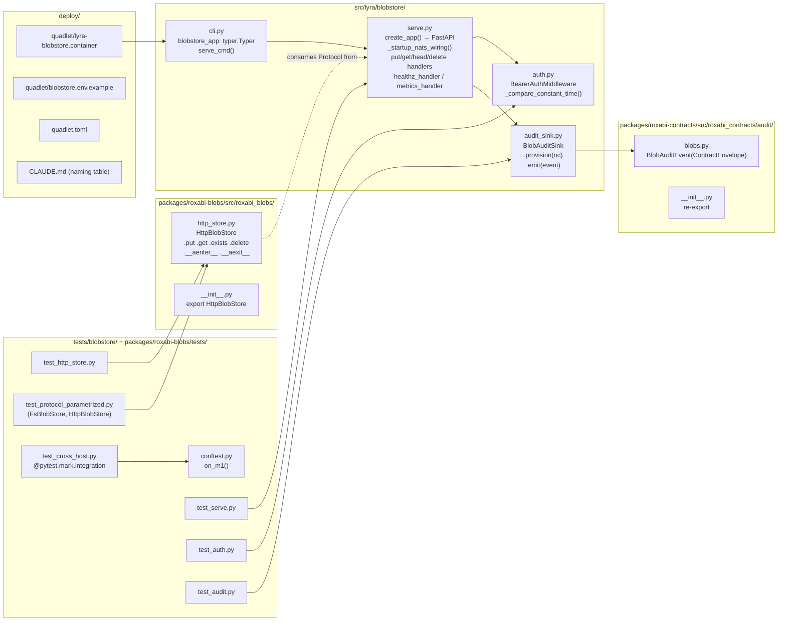

## Summary

Land Slice V8 of epic #1061 as 5 sequential sub-slices on branch `1330-blobstore-http`: service skeleton → HTTP API + client → audit + readiness → Quadlet deploy + cross-host test → docs/runbooks. 24 micro-tasks, 8 named agent instances, 13 waves (max 3 parallel). Estimated 3–5 days.

## Architecture

### Data flow (boot + a put())

```mermaid
flowchart TD
    subgraph Boot ["lyra blobstore serve — startup"]
        cli["lyra.blobstore.cli\nlyra blobstore serve"]
        serve["lyra.blobstore.serve\ncreate_app()"]
        readtok["read /run/secrets/lyra_blobstore_token\n(once, mem-cached)"]
        natsc["nats.connect(NATS_URL)"]
        sinkprov["BlobAuditSink.provision(nc)"]
        kvann["kv.put('blobstore.ready', b'true')"]
        uvi["uvicorn.run(:8449)"]

        cli --> serve --> readtok --> natsc --> sinkprov --> kvann --> uvi
    end

    subgraph Request ["PUT /blobs — request path"]
        req["httpx client\nAuthorization: Bearer X\nContent-Type: mime"]
        auth["BearerAuthMiddleware\nhmac.compare_digest"]
        handler["put_handler(body, headers)"]
        fsput["FsBlobStore.put(...)"]
        ref["BlobRef"]
        emit["BlobAuditSink.emit(BlobAuditEvent)"]
        resp["200 BlobRef JSON"]

        req --> auth --> handler --> fsput --> ref --> emit --> resp
    end

    classDef redpath stroke:#d33,stroke-width:2px;
    class auth,fsput,emit redpath
```



### File × function map



## Bootstrap Context

- **Branch:** `1330-blobstore-http` (worktree at `.claude/worktrees/1330-blobstore-http`).
- **Pre-resolved decisions (do not re-litigate):** Shape A · Framing B placement (`src/lyra/blobstore/` peer-of-adapters, not under `infrastructure/`) · Image `:staging-svc` · `BlobAuditEvent` is parallel to `SecurityEvent`, NOT extending · D5 (`.importlinter`) lands in S2 (not S4) · ADR-067 receives a HEAD-row amendment in S5.
- **NATS connect:** the blobstore process needs `NATS_URL=nats://lyra-nats:4222`; audit sink degrades to logger if unreachable (does NOT abort startup).
- **Cross-host port:** Tailscale IPv4 binding (resolved at provision via `tailscale ip -4`); `0.0.0.0:8449` fallback documented as accepted residual risk.
- **Tests:** `tests/blobstore/conftest.py` defines `on_m1()`; `pyproject.toml` registers the `integration` marker; `test_cross_host.py` skips silently when not on M₁.

## Agents

| Agent instance | Subjects (≤2) | Domain | Owns slices |
|----------------|---------------|--------|-------------|
| `backend-dev-A` | http, auth | server | V1, V2 server impl, V3 wiring into serve.py |
| `backend-dev-B` | client, audit | client + contracts | V2 client, V3 contract + audit sink |
| `tester-A` | http, auth | server tests | V1, V2 server-side tests |
| `tester-B` | client, audit | client + audit tests | V2 client tests, V3 audit/readiness tests |
| `tester-C` | ci, infra | CI plumbing | V4 conftest, marker registration, cross-host scaffolding |
| `devops-A` | lint, quadlet | deploy + import-layer | V2 importlinter + CLAUDE.md hygiene, V4 Quadlet/secret/manifest |
| `doc-writer-A` | docs | all docs | V5 docs + runbooks + ADR-067 amendment + CLAUDE.md updates |
| `security-auditor-A` | security | review only | V4 auth + secret end-to-end review (gate, ¬code change) |

## Wave Structure

13 waves, max 3 parallel. Estimated ~3–4 days actual elapsed (5–6 days if run fully sequentially).

| Wave | Trigger | Agents | Tasks |
|------|---------|--------|-------|
| 1  | start                   | 1 | `tester-A`: T1 |
| 2  | Wave 1 done             | 1 | `backend-dev-A`: T2→T3 |
| 3  | Wave 2 done             | 1 | `tester-A`: T4 (RED-GATE V1) |
| 4  | Wave 3 done             | 2 ∥ | `tester-A`: T5 · `tester-B`: T6 |
| 5  | Wave 4 done             | 3 ∥ | `backend-dev-A`: T7 · `backend-dev-B`: T8 · `devops-A`: T9 |
| 6  | Wave 5 done             | 1 | `tester-A`: T10 (RED-GATE V2) |
| 7  | Wave 6 done             | 2 ∥ | `tester-B`: T11 · `backend-dev-B`: T12 |
| 8  | Wave 7 done             | 1 | `backend-dev-B`: T13 |
| 9  | Wave 8 done             | 1 | `tester-B`: T14 (RED-GATE V3) |
| 10 | Wave 9 done             | 2 ∥ | `tester-C`: T15 · `devops-A`: T16→T17 |
| 11 | Wave 10 done            | 1 | `security-auditor-A`: T18 |
| 12 | Wave 11 done            | 1 | `tester-C`: T19 (RED-GATE V4 — integration + M₂ smoke) |
| 13 | Wave 12 done            | 2 ∥ | `doc-writer-A`: T20→T21→T22→T23→T24 · operator: T25 (manual backup drill, output committed) |

### Budget — per task

| Task | Items | Class | Est. ops | Split? |
|------|-------|-------|----------|--------|
| T1 RED serve+auth tests | 1 test file | bounded | 4 | — |
| T2 svc skeleton (cli+serve+auth) | 4 files | judgmental | 6 | — |
| T3 wire cli into lyra.cli | 1 file | bounded | 2 | — |
| T4 V1 RED-GATE | pytest+ruff+pyright | bounded | 3 | — |
| T5 V2 server tests | 1 test file | bounded | 4 | — |
| T6 V2 client tests + Protocol-param tests | 2 test files | bounded | 5 | — |
| T7 V2 server handlers (N1–N4) | serve.py edit | judgmental | 6 | — |
| T8 V2 HttpBlobStore client + exports | 2 files | judgmental | 5 | — |
| T9 .importlinter + root CLAUDE.md hygiene | 2 files | bounded | 3 | — |
| T10 V2 RED-GATE | pytest + lint-imports | bounded | 3 | — |
| T11 V3 audit + readiness tests | 1 test file | bounded | 4 | — |
| T12 BlobAuditEvent contract | 2 files | bounded | 3 | — |
| T13 BlobAuditSink + serve.py startup wiring | 2 files | judgmental | 6 | — |
| T14 V3 RED-GATE | pytest + nats sub smoke | bounded | 3 | — |
| T15 conftest on_m1 + integration marker + cross-host test scaffold | 2 files + pyproject | bounded | 4 | — |
| T16 lyra-blobstore.container + env example | 2 files | judgmental | 5 | — |
| T17 quadlet.toml + deploy/CLAUDE.md + secret provisioning | 3 files | judgmental | 5 | — |
| T18 security review of auth + secret | read-only | bounded | 4 | — |
| T19 V4 RED-GATE (integration on M₁ + M₂ smoke) | live test | judgmental | 5 | — |
| T20 src/lyra/blobstore/CLAUDE.md + root CLAUDE.md hygiene row | 2 files | bounded | 3 | — |
| T21 docs/QUADLET-DEPLOYMENT.md (secret table + rotation + backup runbook) | 1 file | judgmental | 5 | — |
| T22 docs/CONFIGURATION.md + docs/architecture/storage.md | 2 files | bounded | 4 | — |
| T23 ADR-067 HEAD-row amendment + Consequences note | 1 file | bounded | 3 | — |
| T24 packages/roxabi-blobs/CLAUDE.md retry-policy paragraph | 1 file | bounded | 2 | — |
| T25 manual backup drill → artifacts/ops/blobstore-backup-drill-2026-MM-DD.txt | live ops | bounded | 3 | — |

**Total estimated ops: 103.** All tasks ≤ 50 ops. No task split required.

### Budget — per agent instance

| Instance | Tasks | Σ ops | Subjects | Split? |
|----------|-------|-------|----------|--------|
| `backend-dev-A` | T2, T3, T7 | 14 | http, auth | — |
| `backend-dev-B` | T8, T12, T13 | 14 | client, audit | — |
| `tester-A` | T1, T4, T5, T10 | 14 | http, auth | — |
| `tester-B` | T6, T11, T14 | 12 | client, audit | — |
| `tester-C` | T15, T19 | 9 | ci, infra | — |
| `devops-A` | T9, T16, T17 | 13 | lint, quadlet | — |
| `doc-writer-A` | T20, T21, T22, T23, T24 | 17 | docs | — (1 subject; |tasks|=5 > 4 but rule is `> 4 OR > 2 subjects`; 5 tasks barely over cap on one axis only — accept since all are simple bounded doc edits in adjacent files) |
| `security-auditor-A` | T18 | 4 | security | — |
| `operator` (Mickael) | T25 | 3 | drill | — |

`doc-writer-A` has 5 tasks but only 1 distinct subject and each task is `bounded` (2–5 ops). Subject-diversity cap (2) is satisfied; the |tasks| cap (4) is exceeded by 1 but the workload is genuinely cohesive (5 short markdown edits in a single sitting). Flagging it here so reviewer sees the explicit accept rather than a silent overage.

## Consistency Report

| Affordance (from spec breadboard) | Trace |
|-----------------------------------|-------|
| U1 `lyra blobstore serve` | T2, T3, T4 |
| N1 PUT /blobs | T5, T7, T10 |
| N2 GET /blobs/{store_key} | T5, T7, T10 |
| N3 HEAD /blobs/{store_key} | T5, T7, T10 |
| N4 DELETE /blobs/{store_key} | T5, T7, T10 |
| N5 GET /healthz | T1, T2, T4 |
| N6 GET /metrics | T1, T2, T4 |
| C1 HttpBlobStore | T6, T8, T10, T24 |
| S1 BearerAuthMiddleware | T1, T2, T4, T18 |
| S2 BlobAuditSink | T11, T13, T14 |
| S3 readiness announcer | T11, T13, T14 |
| S4 bootstrap order | T13 |
| D1 lyra-blobstore.container | T15, T16, T19 |
| D2 blobstore.env.example | T16 |
| D3 quadlet.toml entry | T17 |
| D4 Podman secret | T17, T18 |
| D5 .importlinter | T9, T10 |
| K1 BlobAuditEvent | T11, T12, T14 |
| Backup runbook (drill) | T21, T25 |
| Rotation runbook | T18, T21 |
| ADR-067 amendment | T23 |
| `src/lyra/blobstore/CLAUDE.md` | T20 |

Coverage: 22/22 affordances traced. No uncovered, no untraced. Spec success-criteria items map 1:1 to RED-GATE assertions in waves 3, 6, 9, 12.

## Micro-Tasks

### Slice V1 — Service skeleton

#### T1 [RED] `tester-A` · subject: http

- **File:** `tests/blobstore/test_serve.py` (new)
- **Description:** Write failing tests for the service skeleton: `GET /healthz` returns 200 with `{status, disk_used_pct, blob_count}`; `GET /metrics` returns Prometheus body containing `disk_used_pct`; PUT/GET/HEAD/DELETE return 401 without `Authorization: Bearer …`.
- **Code shape:**
  ```python
  import pytest
  from httpx import ASGITransport, AsyncClient
  from lyra.blobstore.serve import create_app

  @pytest.mark.asyncio
  async def test_healthz_returns_ok(tmp_path): ...
  async def test_metrics_returns_prometheus_body(tmp_path): ...
  async def test_put_without_bearer_returns_401(tmp_path): ...
  ```
- **Verify:** `uv run pytest tests/blobstore/test_serve.py -x` → 3 failing tests with `ImportError: lyra.blobstore.serve` (RED).
- **Spec trace:** SC-Code-3 (6 endpoints), SC-Code-4 (hmac), N5, N6.
- **Difficulty:** 2

#### T2 [GREEN] `backend-dev-A` · subject: http

- **Files:** `src/lyra/blobstore/__init__.py` (new), `src/lyra/blobstore/cli.py` (new), `src/lyra/blobstore/serve.py` (new), `src/lyra/blobstore/auth.py` (new), `src/lyra/blobstore/CLAUDE.md` (new, ≤80 lines covering port, host topology, NATS-degraded mode, auth Phase 1/2 boundary, max_bytes decision placeholder)
- **Description:** Build the FastAPI app factory `create_app(*, blob_root, token_path, max_bytes=None, nc=None)`. Bearer middleware reads token once from `token_path` (or `/run/secrets/lyra_blobstore_token` by default), compares with `hmac.compare_digest`. Implement only `/healthz` + `/metrics` + 401 gate in this task (handlers N1–N4 land in T7). Document the `max_bytes` decision (pre-413 vs post-500) inline in `CLAUDE.md`.
- **Verify:** `uv run pytest tests/blobstore/test_serve.py -x` → 3 passing (GREEN). `uv run ruff check src/lyra/blobstore/`. `uv run pyright src/lyra/blobstore/`.
- **Spec trace:** N5, N6, S1, U1, SC-Code-1, SC-Code-4, SC-Code-5.
- **Difficulty:** 3

#### T3 [GREEN] `backend-dev-A` · subject: http

- **File:** `src/lyra/cli/__init__.py` (modified — register typer subapp)
- **Description:** Mount `blobstore_app` into the root typer app so `lyra blobstore serve` becomes a real subcommand. Pattern: copy how `lyra adapter` subapp is mounted.
- **Verify:** `uv run lyra --help | grep blobstore` shows the subcommand; `uv run lyra blobstore --help` lists `serve`.
- **Ref pattern:** `src/lyra/cli/__init__.py` (existing adapter subapp wiring).
- **Spec trace:** U1, SC-Code-2.
- **Difficulty:** 2

#### T4 [RED-GATE] `tester-A` · subject: http

- **Verify:** `uv run pytest tests/blobstore/test_serve.py` green; `uv run ruff check . && uv run pyright` green; `uv run lyra blobstore --help` lists `serve`.
- **Expected:** All checks pass. No new files.
- **Spec trace:** Tier-S of SC-Tests-5/6/7.
- **Difficulty:** 1

### Slice V2 — HTTP API + client + import-layer

#### T5 [RED] `tester-A` · subject: http

- **File:** `tests/blobstore/test_serve.py` (extend)
- **Description:** Extend with PUT (200 + BlobRef JSON), GET (streams body), HEAD (200/404), DELETE (204), 404 on `BlobNotFoundError`, 500 on `BlobWriteError`, path-traversal returns 404 with no oracle leak. Bearer stale-token two-direction assertion (per spec SC-Code-5).
- **Verify:** `uv run pytest tests/blobstore/test_serve.py -x` → new tests fail (RED, handlers not implemented).
- **Spec trace:** N1, N2, N3, N4, SC-Code-5, SC-Tests-2.
- **Difficulty:** 3

#### T6 [RED] [P] `tester-B` · subject: client

- **Files:** `tests/blobstore/test_http_store.py` (new), `packages/roxabi-blobs/tests/test_protocol_parametrized.py` (new)
- **Description:** ASGI-in-process tests for `HttpBlobStore` (round-trip put/get/exists/delete). Parametrized fixture yields both `FsBlobStore` and `HttpBlobStore`; same test body asserts identical observable behaviour for `put` (returns valid `BlobRef`), `get` (returns identical bytes), `exists` (returns `BlobRef` then `None` after delete), `delete` (`BlobNotFoundError` on subsequent get).
- **Verify:** Both files RED (no `HttpBlobStore` yet).
- **Spec trace:** C1, SC-Tests-1, SC-Tests-3.
- **Difficulty:** 3

#### T7 [GREEN] [P] `backend-dev-A` · subject: http

- **File:** `src/lyra/blobstore/serve.py` (extend)
- **Description:** Implement N1–N4 handlers. N1 reads body + headers (`Content-Type` → mime; `X-Blob-Source`/`X-Blob-Platform-Ref`/`X-Blob-Platform-Message-Id`/`X-Blob-Filename`) → `FsBlobStore.put(...)` → returns `BlobRef` JSON. N2 streams the bytes from `FsBlobStore.get(store_key)`. N3 resolves `content_hash` via `SELECT content_hash FROM blobs WHERE store_path = ?` then calls `FsBlobStore.exists(content_hash)`. N4 resolves `blob_ref_id` from `store_key` (latest row matching content_hash) then `FsBlobStore.delete(blob_ref_id)`. Map exceptions: `BlobNotFoundError` → 404, `BlobWriteError`/`BlobConsistencyError` → 500 with `error_code` + static message.
- **Verify:** `uv run pytest tests/blobstore/test_serve.py -x` green.
- **Spec trace:** N1, N2, N3, N4, SC-Code-3.
- **Difficulty:** 4

#### T8 [GREEN] [P] `backend-dev-B` · subject: client

- **Files:** `packages/roxabi-blobs/src/roxabi_blobs/http_store.py` (new), `packages/roxabi-blobs/src/roxabi_blobs/__init__.py` (modified — add `HttpBlobStore` to `__all__`)
- **Description:** `class HttpBlobStore` with `__aenter__`/`__aexit__` (manage `httpx.AsyncClient`); `put`/`get`/`exists`/`delete` implementing the `BlobStore` Protocol. `__init__(base_url, token, *, connect_retry_max_s=10.0)`. Initial-connect retry: exponential backoff (first 0.5 s, cap 5 s/attempt, total budget = `connect_retry_max_s`). Per-request timeouts = `httpx` defaults. **Zero `lyra.*` imports** (grep-verified).
- **Verify:** `uv run pytest tests/blobstore/test_http_store.py packages/roxabi-blobs/tests/test_protocol_parametrized.py -x` green. `grep -rn 'from lyra' packages/roxabi-blobs/src/roxabi_blobs/http_store.py` → no matches.
- **Spec trace:** C1, SC-Code-6, SC-Code-7.
- **Difficulty:** 4

#### T9 [GREEN] [P] `devops-A` · subject: lint

- **Files:** `.importlinter` (modified), `CLAUDE.md` (root — modified, add `src/lyra/blobstore/CLAUDE.md` row)
- **Description:** Add `lyra.blobstore` as peer of `lyra.adapters` in the layers contract (peer syntax: replace `lyra.adapters` line with `lyra.adapters | lyra.blobstore`). Add the hygiene-table row to root `CLAUDE.md`.
- **Verify:** `uv run lint-imports` green; `grep 'src/lyra/blobstore/CLAUDE.md' CLAUDE.md` returns 1 hit.
- **Spec trace:** D5, SC-Wire-1, SC-Wire-2.
- **Difficulty:** 2

#### T10 [RED-GATE] `tester-A` · subject: http

- **Verify:** Full V1+V2 test suite green: `uv run pytest tests/blobstore/ packages/roxabi-blobs/tests/`; `uv run ruff check . && uv run pyright && uv run lint-imports` all green.
- **Spec trace:** SC-Tests-5/6/7, SC-Wire-1.
- **Difficulty:** 1

### Slice V3 — Audit + readiness wiring

#### T11 [RED] `tester-B` · subject: audit

- **File:** `tests/blobstore/test_audit.py` (new — covers both audit + readiness)
- **Description:** Verify `BlobAuditEvent` JSON shape; verify `BlobAuditSink.emit()` publishes to `lyra.audit.blobs.{op}` against a fake NATS client; verify `_degraded=True` falls back to `lyra.security` logger when `nc=None`; verify startup wiring publishes `blobstore.ready=true` to `lyra-state` KV after `provision()`.
- **Verify:** RED (sink module not created yet).
- **Spec trace:** S2, S3, K1, SC-Code-8, SC-Code-9, SC-Obs-3, SC-Obs-4.
- **Difficulty:** 3

#### T12 [GREEN] [P] `backend-dev-B` · subject: audit

- **Files:** `packages/roxabi-contracts/src/roxabi_contracts/audit/blobs.py` (new), `packages/roxabi-contracts/src/roxabi_contracts/audit/__init__.py` (modified — re-export `BlobAuditEvent`)
- **Description:** Define `BlobAuditEvent(ContractEnvelope)` with fields per spec §Audit shape: `kind`, `subject`, `op` (Literal: put/get/exists/delete/head), `store_key?`, `content_hash?`, `size?`, `result` (Literal: ok/not_found/unauthorized/error), `error_code?`.
- **Verify:** `uv run pytest packages/roxabi-contracts/tests/ -x`; `uv run pyright packages/roxabi-contracts/`.
- **Spec trace:** K1.
- **Difficulty:** 2

#### T13 [GREEN] `backend-dev-B` · subject: audit

- **Files:** `src/lyra/blobstore/audit_sink.py` (new), `src/lyra/blobstore/serve.py` (modified — wire startup sequence)
- **Description:** `class BlobAuditSink` mirrors `JetStreamAuditSink` shape: `provision(nc)` opens JetStreamContext + ensures `LYRA_AUDIT` stream exists (idempotent); `emit(event)` publishes to `lyra.audit.blobs.{op}`; degraded fallback to `lyra.security` logger. `serve.py` startup: NATS connect → `sink.provision(nc)` → `kv.put('blobstore.ready', b'true')` → uvicorn start. Failure of NATS connect = degraded mode, NOT a startup abort.
- **Verify:** `uv run pytest tests/blobstore/test_audit.py -x` green; `nats sub 'lyra.audit.blobs.>'` against a local NATS shows events on smoke `curl` (manual).
- **Ref pattern:** `src/lyra/infrastructure/audit/jetstream_sink.py` (degrade-fallback shape).
- **Spec trace:** S2, S3, S4, SC-Code-9, SC-Obs-3.
- **Difficulty:** 4

#### T14 [RED-GATE] `tester-B` · subject: audit

- **Verify:** V3 tests green; smoke `nats sub 'lyra.audit.blobs.>'` shows events; `nats kv get lyra-state blobstore.ready` returns `true` when run against a live local stack.
- **Spec trace:** SC-Obs-3, SC-Obs-4.
- **Difficulty:** 1

### Slice V4 — Quadlet unit + secret + Tailnet + integration test

#### T15 [P] `tester-C` · subject: ci

- **Files:** `tests/blobstore/conftest.py` (new), `tests/blobstore/test_cross_host.py` (new), `pyproject.toml` (modified — register `integration` marker)
- **Description:** `on_m1()` checks `socket.gethostname() == "roxabituwer"` OR `os.environ.get("LYRA_HOST") == "m1"`. Cross-host test: PUT a small blob via Tailnet base URL → GET it back → assert content equality. Mark `@pytest.mark.integration` + `@pytest.mark.skipif(not on_m1(), reason="…")`. Register marker in `pyproject.toml [tool.pytest.ini_options].markers`.
- **Verify:** `uv run pytest --collect-only tests/blobstore/test_cross_host.py` collects but skips when off M₁; `uv run pytest --strict-markers tests/blobstore/` does not warn.
- **Spec trace:** SC-Tests-4, SC-Tests-6.
- **Difficulty:** 2

#### T16 [P] `devops-A` · subject: quadlet

- **Files:** `deploy/quadlet/lyra-blobstore.container` (new), `deploy/quadlet/blobstore.env.example` (new)
- **Description:** Clone from `deploy/quadlet/lyra-hub.container`. Settings per analysis §Quadlet template clone table (now 14 rows incl. `Description`, `ContainerName`, `Network`, `Environment=NATS_URL`). `PublishPort` binds the Tailscale IPv4 (resolved at install time via `tailscale ip -4`, or fallback `0.0.0.0` with comment).
- **Verify:** `podman-system-quadlet --user --dry-run` (or local equivalent) parses the unit; visual diff against `lyra-hub.container` shows only intended deltas.
- **Spec trace:** D1, D2, SC-Deploy-1, SC-Deploy-2.
- **Difficulty:** 3

#### T17 `devops-A` · subject: quadlet

- **Files:** `deploy/quadlet.toml` (modified — add `lyra-blobstore` under role `lyra-hub`), `deploy/CLAUDE.md` (modified — add row to naming-convention table), `deploy/install.sh` (modified if needed — add `lyra_blobstore_token` to secret bootstrap loop)
- **Description:** Manifest + naming-table + secret bootstrap. Secret source = `~/.lyra/blobstore.tok`; create the file with `printf '%s' "$(uuidgen)" > ~/.lyra/blobstore.tok && chmod 0400` if it does not exist (idempotent).
- **Verify:** `make quadlet-secrets-install` shows `lyra_blobstore_token` line; `grep lyra-blobstore deploy/quadlet.toml` returns 1 line under `lyra-hub` role.
- **Spec trace:** D3, D4, SC-Deploy-3, SC-Deploy-4, SC-Deploy-5.
- **Difficulty:** 2

#### T18 `security-auditor-A` · subject: security

- **Scope:** Read-only review of `src/lyra/blobstore/auth.py`, `deploy/quadlet/lyra-blobstore.container` (secret declaration), `deploy/install.sh` (secret bootstrap), `docs/QUADLET-DEPLOYMENT.md` (rotation runbook, after T21).
- **Description:** Verify: (a) bearer never appears in logs/audit events on success path, (b) `hmac.compare_digest` is used (not `==`), (c) `type=mount` is correct (not `type=env`), (d) rotation runbook does not write the new token to a world-readable path, (e) the `result:"unauthorized"` audit emit does not echo the rejected token in any field.
- **Verify:** Review comment posted as a sub-issue comment or report appended to the plan. Sign-off: "approved / 1+ concern".
- **Spec trace:** S1, SC-Code-4, SC-Code-5, SC-Ops-2.
- **Difficulty:** 3

#### T19 [RED-GATE] `tester-C` · subject: infra

- **Verify:** `systemctl --user daemon-reload && systemctl --user start lyra-blobstore.service` boots clean (verify with `journalctl --user -u lyra-blobstore.service`); `uv run pytest -m integration tests/blobstore/test_cross_host.py` green on M₁; manual smoke from M₂ dev session (`curl -H "Authorization: Bearer $TOK" --data-binary @some.bin http://roxabituwer.goose-logarithm.ts.net:8449/blobs` returns `BlobRef` JSON) succeeds.
- **Spec trace:** SC-Tests-4, SC-Deploy-1, SC-Deploy-2.
- **Difficulty:** 3

### Slice V5 — Docs + runbooks

#### T20 [P] `doc-writer-A` · subject: docs

- **Files:** `src/lyra/blobstore/CLAUDE.md` (already created in T2, may need polish to reflect final state)
- **Description:** Finalise `src/lyra/blobstore/CLAUDE.md`: invariants (port, host topology, NATS-degraded behaviour, auth Phase 1/2 boundary, `max_bytes` decision recorded as taken in T7). Verify root `CLAUDE.md` hygiene table has the row (T9 added it; T20 confirms).
- **Verify:** `grep '0/run/secrets/lyra_blobstore_token' src/lyra/blobstore/CLAUDE.md` shows the secret-mount note; `grep 'blobstore' CLAUDE.md` shows the row.
- **Spec trace:** SC-Wire-2.
- **Difficulty:** 1

#### T21 [P] `doc-writer-A` · subject: docs

- **File:** `docs/QUADLET-DEPLOYMENT.md` (modified)
- **Description:** Add `lyra_blobstore_token` row to the secret-layout table; add the 5-step rotation runbook from analysis §Auth Phase 1; add the 3-step backup runbook (`.backup` first → `tar` shards → Restic) + restore invariant (discard content-addressed orphans).
- **Verify:** `grep -c 'lyra_blobstore_token' docs/QUADLET-DEPLOYMENT.md` ≥ 2; rotation runbook has 5 numbered steps; backup runbook has 3 numbered steps + restore-invariant paragraph.
- **Spec trace:** SC-Ops-1, SC-Ops-2, SC-Ops-3.
- **Difficulty:** 2

#### T22 [P] `doc-writer-A` · subject: docs

- **Files:** `docs/CONFIGURATION.md` (modified), `docs/architecture/storage.md` (modified)
- **Description:** Add `blobstore.env` row to the env-files table. Update `docs/architecture/storage.md` HTTP service section + cross-host access pattern + restore-invariant paragraph (mirror of QUADLET-DEPLOYMENT.md).
- **Verify:** `grep 'blobstore.env' docs/CONFIGURATION.md`; `grep -A 5 'HTTP service' docs/architecture/storage.md` shows the new section.
- **Spec trace:** SC-Ops-5, SC-Ops-6.
- **Difficulty:** 2

#### T23 [P] `doc-writer-A` · subject: docs

- **File:** `docs/architecture/adr/067-blobstore-abstraction-flat-fs-content-addressed.mdx` (modified)
- **Description:** Add `HEAD /blobs/<store_key>` row to the §HTTP API Protocol-mapping table (matching the spec's N3 description). Add a "V8 shipped 2026-MM-DD" note in §Consequences pointing back to `artifacts/specs/1330-v8-http-fronted-blobstore-spec.mdx`. Status remains `accepted` — do not flip.
- **Verify:** `grep 'HEAD /blobs' docs/architecture/adr/067-*.mdx`; `grep 'V8 shipped' docs/architecture/adr/067-*.mdx`.
- **Spec trace:** SC-Ops-7.
- **Difficulty:** 1

#### T24 [P] `doc-writer-A` · subject: docs

- **File:** `packages/roxabi-blobs/CLAUDE.md` (modified)
- **Description:** Add the `HttpBlobStore` retry-policy paragraph to the invariants section (echoing the decision documented inline in `http_store.py`).
- **Verify:** `grep 'HttpBlobStore' packages/roxabi-blobs/CLAUDE.md`.
- **Spec trace:** C1 (consumer-doc completeness).
- **Difficulty:** 1

#### T25 [operator manual] `operator` · subject: drill

- **File:** `artifacts/ops/blobstore-backup-drill-2026-MM-DD.txt` (new)
- **Description:** Run the backup runbook end-to-end against a populated live blob store. Commit the file containing: (a) `sha256sum` walk of `~/.lyra/blobs`, (b) `sha256sum` walk of the restored scratch dir after Restic restore, (c) `diff` of the two walks (must be empty).
- **Verify:** File exists; final line of `diff` output is empty.
- **Spec trace:** SC-Ops-4.
- **Difficulty:** 2

#### T26 [RED-GATE] `tester-C` · subject: ci

- **Verify:** All success criteria gates from the spec hold green: full pytest, ruff, pyright, lint-imports; every new file is registered in either root `CLAUDE.md` or a deploy/docs table; the drill artifact is present and shows zero diff.
- **Difficulty:** 1

## Task Seeding Blueprint

<!-- Used by /implement to seed TaskCreate calls. Wave order; within a wave all rows are parallel (∥). -->

### Wave 1 — start

| Task | Agent instance | blockedBy | Subject |
|------|---------------|-----------|---------|
| T1 | tester-A | — | http |

### Wave 2 — after T1

| Task | Agent instance | blockedBy | Subject |
|------|---------------|-----------|---------|
| T2 | backend-dev-A | T1 | http |
| T3 | backend-dev-A | T2 | http |

### Wave 3 — after T3

| Task | Agent instance | blockedBy | Subject |
|------|---------------|-----------|---------|
| T4 | tester-A | T3 | http |

### Wave 4 — after T4 (2∥)

| Task | Agent instance | blockedBy | Subject |
|------|---------------|-----------|---------|
| T5 | tester-A | T4 | http |
| T6 | tester-B | T4 | client |

### Wave 5 — after T5+T6 (3∥)

| Task | Agent instance | blockedBy | Subject |
|------|---------------|-----------|---------|
| T7 | backend-dev-A | T5 | http |
| T8 | backend-dev-B | T6 | client |
| T9 | devops-A | T4 | lint |

### Wave 6 — after T7+T8+T9

| Task | Agent instance | blockedBy | Subject |
|------|---------------|-----------|---------|
| T10 | tester-A | T7, T8, T9 | http |

### Wave 7 — after T10 (2∥)

| Task | Agent instance | blockedBy | Subject |
|------|---------------|-----------|---------|
| T11 | tester-B | T10 | audit |
| T12 | backend-dev-B | T10 | audit |

### Wave 8 — after T11+T12

| Task | Agent instance | blockedBy | Subject |
|------|---------------|-----------|---------|
| T13 | backend-dev-B | T11, T12 | audit |

### Wave 9 — after T13

| Task | Agent instance | blockedBy | Subject |
|------|---------------|-----------|---------|
| T14 | tester-B | T13 | audit |

### Wave 10 — after T14 (2∥)

| Task | Agent instance | blockedBy | Subject |
|------|---------------|-----------|---------|
| T15 | tester-C | T14 | ci |
| T16 | devops-A | T14 | quadlet |
| T17 | devops-A | T16 | quadlet |

### Wave 11 — after T17

| Task | Agent instance | blockedBy | Subject |
|------|---------------|-----------|---------|
| T18 | security-auditor-A | T17 | security |

### Wave 12 — after T18

| Task | Agent instance | blockedBy | Subject |
|------|---------------|-----------|---------|
| T19 | tester-C | T15, T16, T17, T18 | infra |

### Wave 13 — after T19 (2∥)

| Task | Agent instance | blockedBy | Subject |
|------|---------------|-----------|---------|
| T20 | doc-writer-A | T19 | docs |
| T21 | doc-writer-A | T19 | docs |
| T22 | doc-writer-A | T19 | docs |
| T23 | doc-writer-A | T19 | docs |
| T24 | doc-writer-A | T19 | docs |
| T25 | operator | T19 | drill |
| T26 | tester-C | T20, T21, T22, T23, T24, T25 | ci |

## Task IDs

<!-- Generated by /plan. Used by /implement to resume tasks on session restart. -->
- T1: 14 — http (tester-A RED V1)
- T2: 15 — http (backend-dev-A V1 skeleton)
- T3: 16 — http (backend-dev-A wire CLI)
- T4: 17 — http (tester-A V1 RED-GATE)
- T5: 18 — http (tester-A RED V2 server)
- T6: 19 — client (tester-B RED V2 client + param)
- T7: 20 — http (backend-dev-A V2 server handlers)
- T8: 21 — client (backend-dev-B HttpBlobStore)
- T9: 22 — lint (devops-A importlinter + hygiene)
- T10: 23 — http (tester-A V2 RED-GATE)
- T11: 24 — audit (tester-B RED V3)
- T12: 25 — audit (backend-dev-B BlobAuditEvent contract)
- T13: 26 — audit (backend-dev-B BlobAuditSink + startup wiring)
- T14: 27 — audit (tester-B V3 RED-GATE)
- T15: 28 — ci (tester-C conftest + marker + cross-host scaffold)
- T16: 29 — quadlet (devops-A Quadlet unit)
- T17: 30 — quadlet (devops-A manifest + secret bootstrap)
- T18: 31 — security (security-auditor-A review)
- T19: 32 — infra (tester-C V4 RED-GATE)
- T20: 33 — docs (doc-writer-A blobstore CLAUDE.md)
- T21: 34 — docs (doc-writer-A QUADLET-DEPLOYMENT.md)
- T22: 35 — docs (doc-writer-A CONFIGURATION + storage)
- T23: 36 — docs (doc-writer-A ADR-067 amendment)
- T24: 37 — docs (doc-writer-A roxabi-blobs CLAUDE.md)
- T25: 38 — drill (operator backup drill)
- T26: 39 — ci (tester-C final RED-GATE)

## Dispatch note (read before /implement)

Per [[lyra-dedicated-agents-fresh-context]]: the `agent_instance` names above are a **minimum** fan-out target. When `/implement` dispatches each task it should default to a fresh Agent call (new context) for every non-trivial task — instance names are coordination hints, NOT a cap. Reuse only for tightly chained micro-edits on the same files (e.g. T2→T3) or lightweight RED-GATE verifications.
