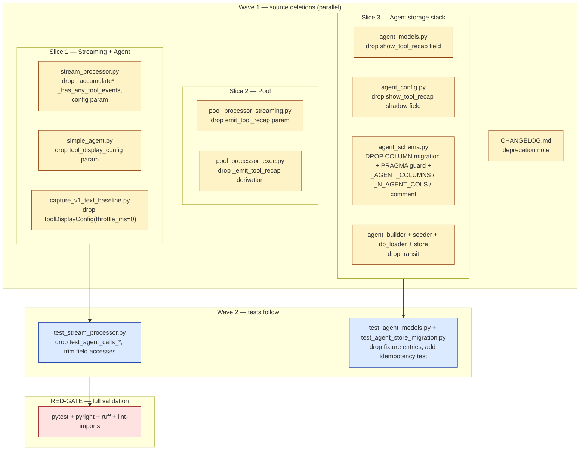
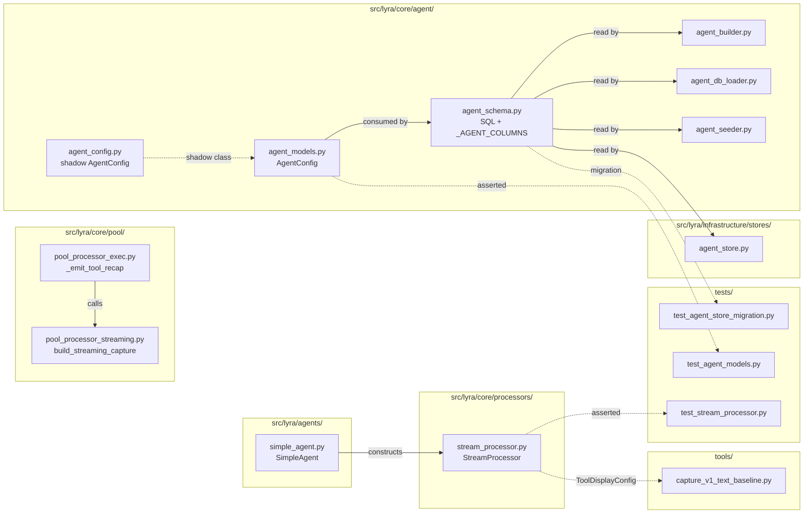

## Summary

Atomic deletion of 4 dead surfaces (`StreamProcessor` accumulator, `emit_tool_recap` plumbing, `show_tool_recap` agent column + shadow field in `agent_config.py`, `SimpleAgent.tool_display_config`). One PR. 13 micro-tasks across 5 agent instances, 3 waves + 1 RED-GATE.

## Architecture

### Data flow — what flows out (dead) vs what stays (live)



### File × Function map — what gets touched



## Bootstrap Context

(omitted — F-lite, no analysis artifact)

## Agents

| Agent instance | Type | Tasks | Files | Subject |
|---|---|---|---|---|
| backend-dev-A | backend-dev | T1, T2, T4 | `src/lyra/core/processors/stream_processor.py`, `src/lyra/agents/simple_agent.py`, `tools/capture_v1_text_baseline.py` | streaming-and-agent-cleanup |
| backend-dev-B | backend-dev | T5, T6 | `src/lyra/core/pool/pool_processor_streaming.py`, `src/lyra/core/pool/pool_processor_exec.py` | pool-cleanup |
| backend-dev-C | backend-dev | T7, T8, T9, T10 | `src/lyra/core/agent/{agent_models,agent_config,agent_schema,agent_builder,agent_seeder,agent_db_loader}.py`, `src/lyra/infrastructure/stores/agent_store.py` | agent-domain-cleanup |
| doc-writer-A | doc-writer | T12 | `CHANGELOG.md` | release-notes |
| tester-A | tester | T3, T11 | `tests/core/test_stream_processor.py`, `tests/core/test_agent_models.py`, `tests/infrastructure/test_agent_store_migration.py` | test-cleanup-and-migration |
| tester-B | tester | T13 | (full repo quality gates) | validation |

## Wave Structure

3 waves + 1 RED-GATE, max 4 parallel agents in Wave 1. Estimated elapsed ~25 min vs ~60 min sequential.

| Wave | Trigger | Agents | Tasks |
|------|---------|--------|-------|
| 1 | start | 4 ∥ | backend-dev-A: T1→T2→T4 · backend-dev-B: T5→T6 · backend-dev-C: T7→T8→T9→T10 · doc-writer-A: T12 |
| 2 | Wave 1 done | 1 | tester-A: T3 (Slice 1 tests) — depends on T1+T2 |
| 3 | Wave 2 done | 1 | tester-A: T11 (Slice 3 tests + idempotency test) — depends on T7-T10 (same instance, sequential continuation) |
| RED-GATE | Wave 3 done | 1 | tester-B: T13 (full pytest + pyright + ruff + lint-imports) |

### Budget — per task

| Task | Items | Class | Est. ops | Split? |
|------|-------|-------|----------|--------|
| T1 — StreamProcessor accumulator + config | 1 file, ~8 deletions | judgmental | 5 | — |
| T2 — SimpleAgent tool_display_config | 1 file, ~3 deletions | bounded | 3 | — |
| T3 — test_stream_processor.py trim | 1 file, drop 2 full tests + many assertions | judgmental | 8 | — |
| T4 — capture_v1_text_baseline.py | 1 file, 1 deletion | trivial | 2 | — |
| T5 — build_streaming_capture signature | 1 file, 1 param | trivial | 1 | — |
| T6 — _emit_tool_recap derivation | 1 file, 2 lines | bounded | 2 | — |
| T7 — agent_models field | 1 file, ~3 references | bounded | 2 | — |
| T8 — agent_config shadow field | 1 file, 1 line | bounded | 2 | — |
| T9 — agent_schema + migration + _AGENT_COLUMNS | 1 file, multi-edit | judgmental | 6 | — |
| T10 — agent_builder/seeder/db_loader/store | 4 files | bounded | 6 | — |
| T11 — test_agent_models + test_agent_store_migration + idempotency | 2 files, fixture + new test | judgmental | 6 | — |
| T12 — CHANGELOG entry | 1 file, 1 line | trivial | 1 | — |
| T13 — full quality gates | repo | bounded | 4 | — |

**Total estimated ops: ~48** (well below 50/instance cap).

### Budget — per agent instance

| Instance | Tasks | Σ ops | Distinct subjects | Split? |
|----------|-------|-------|----------|--------|
| backend-dev-A | T1, T2, T4 | 10 | streaming-and-agent-cleanup | — |
| backend-dev-B | T5, T6 | 3 | pool-cleanup | — |
| backend-dev-C | T7, T8, T9, T10 | 16 | agent-domain-cleanup | — |
| doc-writer-A | T12 | 1 | release-notes | — |
| tester-A | T3, T11 | 14 | test-cleanup-and-migration | — |
| tester-B | T13 | 4 | validation | — |

All instances under ops cap (50) AND tasks cap (4) AND subject cap (2).

## Consistency Report

| Spec criterion | Covered by | Status |
|---|---|---|
| `grep -rn "_accumulate\|_has_any_tool_events" src/lyra/core/processors/` = 0 | T1 verify | covered |
| `grep -rn "emit_tool_recap" src/lyra/core/pool/` = 0 | T5+T6 verify | covered |
| `grep -rn "show_tool_recap" src/ tests/` = 0 | T7+T8+T9+T10+T11 verify | covered |
| `grep -rn "tool_display_config" src/lyra/agents/ src/lyra/core/processors/` = 0 | T2 verify | covered |
| `ToolDisplayConfig` still exported (regression guard) | T13 (full pytest) | covered |
| `_load_tool_display_config` still defined (Phase B guard) | T13 | covered |
| `tests/test_tool_display_config.py` passes unchanged | T13 | covered |
| `uv run pytest` passes | T13 | covered |
| `uv run pyright` passes | T13 | covered |
| `uv run ruff check .` passes | T13 | covered |
| `uv run lint-imports` passes | T13 | covered |
| Migration happy path on populated DB | T11 (new fixture) | covered |
| Migration idempotency on already-migrated DB | T11 (new idempotency test) | covered |
| CHANGELOG entry | T12 | covered |
| Manual smoke test (Telegram + Discord) | **manual, post-implementation** | gate — not seeded as automated task |

**14/14 ACs traced** (15th is manual user step, tracked in PR description).

## Micro-Tasks

### Slice 1 — Detach SimpleAgent + StreamProcessor

#### T1 — Delete StreamProcessor accumulator + config param  [P]

- **File:** `src/lyra/core/processors/stream_processor.py`
- **Agent:** backend-dev / instance: backend-dev-A
- **Subject:** streaming-and-agent-cleanup
- **Spec trace:** D1 / SC-1
- **Phase:** RED+GREEN (single edit)
- **Difficulty:** 3
- **Snippet:**
  ```python
  # Remove constructor param config: ToolDisplayConfig and self._config storage
  # Remove import ToolDisplayConfig
  # Delete methods: _accumulate, _accumulate_file_edit, _accumulate_web, _has_any_tool_events
  # Delete fields: _files, _bash, _web_fetches, _agent_calls, _silent_reads, _silent_greps, _silent_globs
  # Delete the self._accumulate(event) call in _handle_tool_use (around line 425)
  ```
- **Verify:** `grep -rn "_accumulate\|_has_any_tool_events\|self._config\|ToolDisplayConfig" src/lyra/core/processors/stream_processor.py`
- **Expected:** 0 hits
- **Estimate:** 8 min

#### T2 — Delete SimpleAgent.tool_display_config  [P]

- **File:** `src/lyra/agents/simple_agent.py`
- **Agent:** backend-dev / instance: backend-dev-A
- **Subject:** streaming-and-agent-cleanup
- **Spec trace:** D4 / SC-4
- **Phase:** GREEN
- **Difficulty:** 2
- **Snippet:**
  ```python
  # Remove constructor param tool_display_config: ToolDisplayConfig | None = None
  # Remove self._tool_display_config = tool_display_config storage
  # Remove ToolDisplayConfig import (line 24)
  # Drop config=self._tool_display_config kwarg in StreamProcessor(...) call (line 267)
  #   — StreamProcessor no longer takes config (T1 done)
  ```
- **Verify:** `grep -n "tool_display_config\|ToolDisplayConfig" src/lyra/agents/simple_agent.py`
- **Expected:** 0 hits
- **Estimate:** 5 min
- **Depends:** T1 (within backend-dev-A)

#### T3 — Trim test_stream_processor.py

- **File:** `tests/core/test_stream_processor.py`
- **Agent:** tester / instance: tester-A
- **Subject:** test-cleanup-and-migration
- **Spec trace:** T1(a)(b)(c)(d) / SC-1, SC-4
- **Phase:** GREEN (tests must remain green)
- **Difficulty:** 4
- **Snippet:**
  ```python
  # Drop in full:
  #   - test_agent_calls_accumulation (~lines 177-211, asserts _agent_calls + _has_any_tool_events)
  #   - test_agent_calls_skipped_when_show_agent_false (~lines 216-238)
  # In test_silent_read_grep_glob: drop assertions on processor._silent_reads/_silent_greps/_silent_globs/_files/_bash/_web_fetches/_agent_calls; keep ToolCallStart/End lifecycle assertions
  # In test_web_fetch_visible / test_web_search_visible / test_web_fetch_hidden_when_show_false / similar: drop processor._web_fetches assertions; keep emission-side assertions
  # Final sweep: grep "processor\._\(silent\|files\|bash\|web_fetches\|agent_calls\)" tests/core/test_stream_processor.py → 0 hits
  ```
- **Verify:** `uv run pytest tests/core/test_stream_processor.py -x`
- **Expected:** all remaining tests pass
- **Estimate:** 12 min
- **Depends:** T1, T2 (cross-wave: Wave 1 → Wave 2)

#### T4 — Drop ToolDisplayConfig from capture_v1_text_baseline.py  [P]

- **File:** `tools/capture_v1_text_baseline.py`
- **Agent:** backend-dev / instance: backend-dev-A
- **Subject:** streaming-and-agent-cleanup
- **Spec trace:** T1(f) / SC-1
- **Phase:** GREEN
- **Difficulty:** 1
- **Snippet:** drop `ToolDisplayConfig(throttle_ms=0)` construction at line 176 + the `config=` kwarg
- **Verify:** `grep "ToolDisplayConfig" tools/capture_v1_text_baseline.py`
- **Expected:** 0 hits
- **Estimate:** 3 min

### Slice 2 — Cut emit_tool_recap plumbing

#### T5 — Drop emit_tool_recap from build_streaming_capture signature

- **File:** `src/lyra/core/pool/pool_processor_streaming.py`
- **Agent:** backend-dev / instance: backend-dev-B
- **Subject:** pool-cleanup
- **Spec trace:** D2 / SC-2
- **Phase:** RED+GREEN
- **Difficulty:** 1
- **Snippet:** remove `emit_tool_recap: bool,` param at line 29
- **Verify:** `grep "emit_tool_recap" src/lyra/core/pool/pool_processor_streaming.py`
- **Expected:** 0 hits
- **Estimate:** 2 min

#### T6 — Drop _emit_tool_recap derivation from pool_processor_exec.py

- **File:** `src/lyra/core/pool/pool_processor_exec.py`
- **Agent:** backend-dev / instance: backend-dev-B
- **Subject:** pool-cleanup
- **Spec trace:** D3 / SC-2
- **Phase:** GREEN
- **Difficulty:** 2
- **Snippet:**
  ```python
  # Remove _emit_tool_recap = _cfg.show_tool_recap if _cfg is not None else True (line 188)
  # Remove the _emit_tool_recap arg in build_streaming_capture(...) call (line 197)
  ```
- **Verify:** `grep "emit_tool_recap" src/lyra/core/pool/pool_processor_exec.py`
- **Expected:** 0 hits
- **Estimate:** 3 min
- **Depends:** T5 (within backend-dev-B)

### Slice 3 — Drop show_tool_recap column + agent surface

#### T7 — Remove show_tool_recap from agent_models.py

- **File:** `src/lyra/core/agent/agent_models.py`
- **Agent:** backend-dev / instance: backend-dev-C
- **Subject:** agent-domain-cleanup
- **Spec trace:** D5 / SC-3
- **Phase:** RED+GREEN
- **Difficulty:** 2
- **Snippet:** remove `show_tool_recap: bool = True` field (line 44) + references at lines 84, 103-104
- **Verify:** `grep "show_tool_recap" src/lyra/core/agent/agent_models.py`
- **Expected:** 0 hits
- **Estimate:** 4 min

#### T8 — Remove show_tool_recap from agent_config.py (shadow class)

- **File:** `src/lyra/core/agent/agent_config.py`
- **Agent:** backend-dev / instance: backend-dev-C
- **Subject:** agent-domain-cleanup
- **Spec trace:** D11 / SC-3
- **Phase:** GREEN
- **Difficulty:** 1
- **Snippet:** remove `show_tool_recap: bool = True  # show 🔧-prefixed tool summary card after tool use` at line 214
- **Verify:** `grep "show_tool_recap" src/lyra/core/agent/agent_config.py`
- **Expected:** 0 hits
- **Estimate:** 2 min
- **Depends:** T7 (within backend-dev-C)

#### T9 — Drop column from agent_schema.py + add migration with PRAGMA guard

- **File:** `src/lyra/core/agent/agent_schema.py`
- **Agent:** backend-dev / instance: backend-dev-C
- **Subject:** agent-domain-cleanup
- **Spec trace:** D6 / SC-3, SC-12, SC-13
- **Phase:** RED+GREEN
- **Difficulty:** 4
- **Snippet:**
  ```python
  # 1. Update the "25 columns" comment (line 87) → "24 columns"
  # 2. Remove show_tool_recap from _AGENT_COLUMNS literal (line 88-95)
  #    _N_AGENT_COLS auto-recalculates from the new literal
  # 3. Remove show_tool_recap INTEGER NOT NULL DEFAULT 1 from CREATE TABLE DDL (line 39)
  # 4. Remove the ALTER TABLE ADD COLUMN show_tool_recap addition migration (line 60)
  # 5. Add a new migration step that drops show_tool_recap with idempotency guard:
  #    cur = await conn.execute("PRAGMA table_info(agents)")
  #    cols = {row[1] for row in await cur.fetchall()}
  #    if "show_tool_recap" in cols:
  #        await conn.execute("ALTER TABLE agents DROP COLUMN show_tool_recap")
  # 6. Remove "show_tool_recap, effort" from INSERT (line 94 area)
  # 7. Remove "show_tool_recap=excluded.show_tool_recap" from UPSERT (line 124 area)
  ```
- **Verify:** `grep "show_tool_recap" src/lyra/core/agent/agent_schema.py` AND `grep -c "^" <(awk '/^_AGENT_COLUMNS/,/^\)/' src/lyra/core/agent/agent_schema.py | tr ',' '\n')`
- **Expected:** 0 hits ; column count = 24
- **Estimate:** 10 min
- **Depends:** T7, T8 (within backend-dev-C)

#### T10 — Drop show_tool_recap from agent_builder, seeder, db_loader, store

- **Files:** `src/lyra/core/agent/agent_builder.py`, `src/lyra/core/agent/agent_seeder.py`, `src/lyra/core/agent/agent_db_loader.py`, `src/lyra/infrastructure/stores/agent_store.py`
- **Agent:** backend-dev / instance: backend-dev-C
- **Subject:** agent-domain-cleanup
- **Spec trace:** D7, D8, D9, D10 / SC-3
- **Phase:** GREEN
- **Difficulty:** 3
- **Snippet:**
  ```python
  # agent_builder.py: remove show_tool_recap param (line 193) + pass-through (line 211)
  # agent_seeder.py: remove show_tool_recap parsing (line 85) + pass-through (line 145)
  #   IMPORTANT: parser must silently accept the legacy key for backward TOML compatibility
  #   — drop the assignment but don't raise on unknown field
  # agent_db_loader.py: remove show_tool_recap=row.show_tool_recap, (line 177)
  # agent_store.py: remove 1 if row.show_tool_recap else 0, (line 176) + show_tool_recap=row.show_tool_recap, (line 199)
  ```
- **Verify:** `grep -rn "show_tool_recap" src/lyra/core/agent/agent_builder.py src/lyra/core/agent/agent_seeder.py src/lyra/core/agent/agent_db_loader.py src/lyra/infrastructure/stores/agent_store.py`
- **Expected:** 0 hits
- **Estimate:** 8 min
- **Depends:** T9 (within backend-dev-C)

#### T11 — Update agent test fixtures + add migration idempotency test

- **Files:** `tests/core/test_agent_models.py`, `tests/infrastructure/test_agent_store_migration.py`
- **Agent:** tester / instance: tester-A
- **Subject:** test-cleanup-and-migration
- **Spec trace:** T1(g)(h) / SC-3, SC-12, SC-13
- **Phase:** GREEN + new RED
- **Difficulty:** 4
- **Snippet:**
  ```python
  # test_agent_models.py:48 — remove "1,  # show_tool_recap" positional tuple entry
  # test_agent_store_migration.py:91 — remove "show_tool_recap INTEGER NOT NULL DEFAULT 1"
  #   from _DDL_LEGACY fixture; rewrite the migration scenario:
  #   - seed a DB using legacy DDL (with column present)
  #   - run AgentStore.connect()
  #   - assert PRAGMA table_info(agents) does NOT contain show_tool_recap
  #   - assert other agent rows are preserved unchanged
  # Add new test test_drop_show_tool_recap_idempotent:
  #   - run AgentStore.connect() twice on the same DB
  #   - second run must not raise OperationalError
  ```
- **Verify:** `uv run pytest tests/core/test_agent_models.py tests/infrastructure/test_agent_store_migration.py -v`
- **Expected:** all tests pass, including the new idempotency test
- **Estimate:** 12 min
- **Depends:** T7, T8, T9, T10 (cross-wave: Wave 1 → Wave 3)

#### T12 — CHANGELOG entry  [P]

- **File:** `CHANGELOG.md`
- **Agent:** doc-writer / instance: doc-writer-A
- **Subject:** release-notes
- **Spec trace:** SC-14
- **Phase:** GREEN
- **Difficulty:** 1
- **Snippet:**
  ```markdown
  ### Removed
  - `show_tool_recap` key in agent TOML schema (deprecated, no replacement until Phase B —
    see issue #1335). Operators with `show_tool_recap = true|false` in
    `~/.lyra/agents/*.toml` will see the key silently ignored after upgrade.
  ```
- **Verify:** `grep "show_tool_recap" CHANGELOG.md`
- **Expected:** ≥1 hit referencing #1335
- **Estimate:** 3 min

### RED-GATE — Final validation

#### T13 — Full quality gate run

- **Files:** repo
- **Agent:** tester / instance: tester-B
- **Subject:** validation
- **Spec trace:** SC-5, SC-6, SC-7, SC-8, SC-9, SC-10, SC-11
- **Phase:** RED-GATE
- **Difficulty:** 2
- **Snippet:**
  ```bash
  uv run pytest && \
    uv run pyright && \
    uv run ruff check . && \
    uv run lint-imports && \
    grep -rn "show_tool_recap\|emit_tool_recap\|_has_any_tool_events" src/ tests/ \
      | (grep -v "test_tool_display_config\|CHANGELOG" || true) \
      | (! grep .)  # invert: succeed if no hits
  ```
- **Verify:** exit code 0
- **Expected:** all gates green; final grep returns no unexpected hits
- **Estimate:** 8 min
- **Depends:** all prior tasks

## Task Seeding Blueprint

<!-- Used by /implement to seed TaskCreate calls on session start.
     Format: T{n} | agent-instance | blockedBy | subject
     blockedBy refs T-numbers within this list.
     Agent instances are named so parallel tasks map to distinct agents.
     Within a wave, all rows are parallel unless chained on same instance. -->

### Wave 1 — start (4 agents ∥)

| Task | Agent instance | blockedBy | Subject |
|------|---------------|-----------|---------|
| T1 | backend-dev-A | — | streaming-and-agent-cleanup |
| T2 | backend-dev-A | T1 | streaming-and-agent-cleanup |
| T4 | backend-dev-A | T2 | streaming-and-agent-cleanup |
| T5 | backend-dev-B | — | pool-cleanup |
| T6 | backend-dev-B | T5 | pool-cleanup |
| T7 | backend-dev-C | — | agent-domain-cleanup |
| T8 | backend-dev-C | T7 | agent-domain-cleanup |
| T9 | backend-dev-C | T8 | agent-domain-cleanup |
| T10 | backend-dev-C | T9 | agent-domain-cleanup |
| T12 | doc-writer-A | — | release-notes |

### Wave 2 — after Wave 1 (1 agent)

| Task | Agent instance | blockedBy | Subject |
|------|---------------|-----------|---------|
| T3 | tester-A | T1, T2 | test-cleanup-and-migration |

### Wave 3 — after Wave 2 (same instance continues)

| Task | Agent instance | blockedBy | Subject |
|------|---------------|-----------|---------|
| T11 | tester-A | T3, T7, T8, T9, T10 | test-cleanup-and-migration |

### RED-GATE — after Wave 3 (1 agent)

| Task | Agent instance | blockedBy | Subject |
|------|---------------|-----------|---------|
| T13 | tester-B | T1, T2, T3, T4, T5, T6, T7, T8, T9, T10, T11, T12 | validation |

## Post-implementation manual gate

T14 (out of automated scope, tracked in PR description):
- Smoke test on staging Telegram + Discord bots — trigger ≥1 tool call on each; capture tool-recap card screenshots before/after; post side-by-side to PR. Required before merge per spec SC-15.
- File Phase B follow-up issue referencing this PR (pre-merge checklist).

## Task IDs

<!-- Generated by /plan. Used by /implement to resume tasks on session restart. -->
- T1: 13 — streaming-and-agent-cleanup (StreamProcessor accumulator + config)
- T2: 14 — streaming-and-agent-cleanup (SimpleAgent.tool_display_config)
- T3: 15 — test-cleanup-and-migration (test_stream_processor.py trim)
- T4: 16 — streaming-and-agent-cleanup (capture_v1_text_baseline.py)
- T5: 17 — pool-cleanup (build_streaming_capture signature)
- T6: 18 — pool-cleanup (pool_processor_exec _emit_tool_recap)
- T7: 19 — agent-domain-cleanup (agent_models.py field)
- T8: 20 — agent-domain-cleanup (agent_config.py shadow field)
- T9: 21 — agent-domain-cleanup (agent_schema.py + migration + guard)
- T10: 22 — agent-domain-cleanup (agent_builder/seeder/db_loader/store)
- T11: 23 — test-cleanup-and-migration (test_agent_models + test_agent_store_migration + idempotency)
- T12: 24 — release-notes (CHANGELOG)
- T13: 25 — validation (RED-GATE full quality run)
