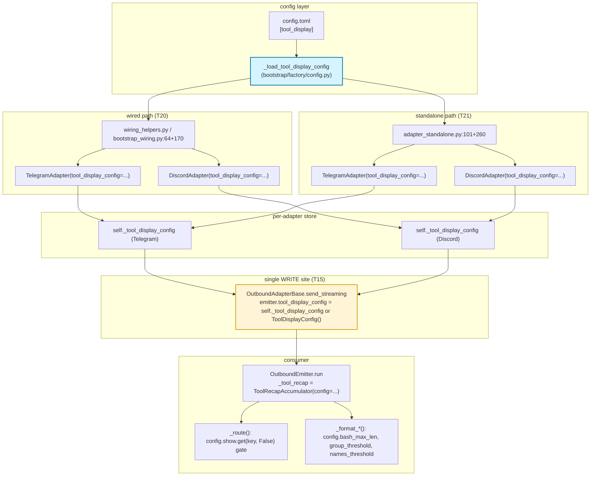
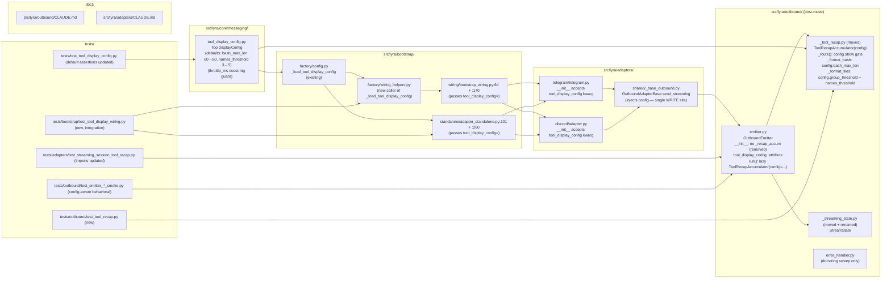

## Summary

Phase B refactor — relocates `_tool_recap.py` + `_shared_streaming_state.py` from `adapters/shared/` to `outbound/`, dissolves the 3-line deferred-import block in `emitter.py`, wires `ToolDisplayConfig` through a single WRITE site (`OutboundAdapterBase.send_streaming`), and plumbs all 4 bootstrap callsites (wired + standalone). 25 micro-tasks across 7 waves, 13 agent instances.

## Architecture

### Data flow



### File × function map



## Bootstrap Context

From analysis (`artifacts/analyses/1336-wire-tool-display-config-phase-b-analysis.mdx`):

- **Recommended shape:** Shape 1 (Relocate to outbound layer) — `_tool_recap.py` and `_shared_streaming_state.py` move to `outbound/` to kill all 3 deferred imports + align semantically.
- **Threading pattern:** settable attribute on `OutboundEmitter`, set exclusively by `OutboundAdapterBase.send_streaming` (single WRITE site). `_make_emitter` abstract signature unchanged.
- **Default-value parity:** update `ToolDisplayConfig.bash_max_len: 60→80` and `names_threshold: 3→5` to match live constants (sub-decision (a) from spec).
- **4 bootstrap callsites:** `bootstrap_wiring.py:64 + 170`, `adapter_standalone.py:101 + 260`. Loader pattern follows `_load_pairing_config` (called from `wiring_helpers.py:207` and `hub_standalone_helpers.py:85`).
- **`group_threshold` conflation accepted** for Phase B; P3 follow-up filed during this plan.

## Agents

| Agent | Tasks | Files |
|-------|-------|-------|
| `backend-dev-A` | T2, T3, T8 | file moves + dissolve cycle (`outbound/emitter.py`) |
| `backend-dev-B` | T4 | `tool_display_config.py` defaults parity |
| `backend-dev-C` | T5, T6, T7 | `outbound/_tool_recap.py` config wiring |
| `backend-dev-D` | T13, T14, T15 | emitter attribute + lazy accum + base injection |
| `backend-dev-E` | T16, T17 | `TelegramAdapter` + `DiscordAdapter` `__init__` kwargs |
| `backend-dev-F` | T20 | wired bootstrap (`wiring_helpers.py` + `bootstrap_wiring.py`) |
| `backend-dev-G` | T21 | standalone bootstrap (`adapter_standalone.py`) |
| `tester-A` | T1 | new `tests/outbound/test_tool_recap.py` |
| `tester-B` | T9, T10 | import-path sweep + `test_tool_display_config.py` defaults |
| `tester-C` | T12 | Slice 2 end-to-end behavioral tests |
| `tester-D` | T19 | Slice 3 integration test (wired + standalone) |
| `doc-writer-A` | T22, T23, T24 | `outbound/CLAUDE.md` + `adapters/CLAUDE.md` + file P3 follow-up issue |
| `verifier-A` | T11, T18, T25 | RED-GATE checkpoints (Slice 1, Slice 2, final) |

## Wave Structure

7 waves, max 5 parallel agents in Wave 1. Elapsed ~3–4 days vs ~7 sequential.

| Wave | Trigger | Agents | Tasks |
|------|---------|--------|-------|
| 1 | start | 3 ∥ | backend-dev-A: T2→T3 · backend-dev-B: T4 · tester-A: T1 |
| 2 | Wave 1 done | 3 ∥ | backend-dev-A: T8 · backend-dev-C: T5→T6→T7 · tester-B: T9→T10 |
| 3 | Wave 2 done | 2 ∥ | verifier-A: T11 (RED-GATE Slice 1) · tester-C: T12 |
| 4 | Wave 3 done | 2 ∥ | backend-dev-D: T13→T14→T15 · backend-dev-E: T16→T17 |
| 5 | Wave 4 done | 2 ∥ | verifier-A: T18 (RED-GATE Slice 2) · tester-D: T19 |
| 6 | Wave 5 done | 3 ∥ | backend-dev-F: T20 · backend-dev-G: T21 · doc-writer-A: T22→T23 |
| 7 | Wave 6 done | 2 ∥ | doc-writer-A: T24 · verifier-A: T25 (final RED-GATE) |

### Budget — per task

| Task | Items | Class | Est. ops | Split? |
|------|-------|-------|----------|--------|
| T1 (RED unit tests) | 12 test cases | exploratory | 10 | — |
| T2 (move _tool_recap) | 1 file | bounded | 2 | — |
| T3 (move + rename _streaming_state) | 1 file | bounded | 2 | — |
| T4 (defaults + docstring) | 2 line edits + docstring | bounded | 3 | — |
| T5 (config field) | 1 field add | bounded | 3 | — |
| T6 (constants → config reads) | 4 constants | judgmental | 5 | — |
| T7 (show.get gate in _route) | 1 method refactor | judgmental | 4 | — |
| T8 (dissolve deferred + remove eager) | 1 block + 1 line | judgmental | 4 | — |
| T9 (import-path sweep) | 4-6 sites | judgmental | 5 | — |
| T10 (default assertion update) | ~6 assertions | bounded | 3 | — |
| T11 (RED-GATE Slice 1) | 4 checks | judgmental | 4 | — |
| T12 (Slice 2 e2e tests) | 6 test cases (Tg+Dc, w/+w/o config) | exploratory | 10 | — |
| T13 (emitter attribute + docstring) | 1 attr | bounded | 2 | — |
| T14 (lazy accum in run) | 1 method refactor | judgmental | 4 | — |
| T15 (base.send_streaming injection) | 1 line | bounded | 3 | — |
| T16 (TelegramAdapter __init__) | 1 kwarg | bounded | 3 | — |
| T17 (DiscordAdapter __init__) | 1 kwarg | bounded | 3 | — |
| T18 (RED-GATE Slice 2) | 3 checks + 2 greps | judgmental | 4 | — |
| T19 (Slice 3 integration tests) | 4 paths × 2 platforms | exploratory | 12 | — |
| T20 (wired bootstrap — 2 callsites) | 2 kwarg threads + 1 loader call | judgmental | 5 | — |
| T21 (standalone bootstrap — 2 callsites) | 2 kwarg threads + 1 loader call (+ raw_config plumbing) | judgmental | 6 | — |
| T22 (outbound/CLAUDE.md) | §State+recap helpers rewrite | judgmental | 4 | — |
| T23 (adapters/CLAUDE.md) | path references | bounded | 2 | — |
| T24 (file P3 follow-up issue) | 1 `gh issue create` | bounded | 2 | — |
| T25 (final RED-GATE) | 8 acc criteria + 4 quality gates | exploratory | 12 | — |

**Total estimated ops: 117**

### Budget — per agent instance

| Instance | Tasks | Σ ops | Subjects | Split? |
|----------|-------|-------|----------|--------|
| backend-dev-A | T2, T3, T8 | 8 | file-move, emitter-cycle (2) | — |
| backend-dev-B | T4 | 3 | defaults (1) | — |
| backend-dev-C | T5, T6, T7 | 12 | accumulator-config (1) | — |
| backend-dev-D | T13, T14, T15 | 9 | emitter-threading (1) | — |
| backend-dev-E | T16, T17 | 6 | adapter-init (1) | — |
| backend-dev-F | T20 | 5 | bootstrap-wired (1) | — |
| backend-dev-G | T21 | 6 | bootstrap-standalone (1) | — |
| tester-A | T1 | 10 | outbound-recap-test (1) | — |
| tester-B | T9, T10 | 8 | test-sweep (1) | — |
| tester-C | T12 | 10 | adapter-integration-test (1) | — |
| tester-D | T19 | 12 | bootstrap-integration-test (1) | — |
| doc-writer-A | T22, T23, T24 | 8 | docs, housekeeping (2) | — |
| verifier-A | T11, T18, T25 | 20 | verification (1) | — |

All within caps (≤50 ops, ≤4 tasks, ≤2 subjects per instance).

## Consistency Report

- Acceptance criteria covered: 8 / 8.
- All 10 breadboard affordances (C1-C10) wired to tasks.
- Slice 1 (foundation) covered by T1-T11.
- Slice 2 (threading) covered by T12-T18.
- Slice 3 (bootstrap + docs) covered by T19-T25.
- Uncovered: none.
- Untraced criteria: none.
- Exemptions: T24 (file follow-up issue) is housekeeping, not tied to a spec criterion.

| Spec criterion | Covered by |
|---|---|
| SC-1 `bash_max_len=200` truncation on both platforms | T6 (read) + T12 (Tg+Dc e2e) + T19 (integration) |
| SC-2 `show.<key>=false` suppression | T7 (route gate) + T12 (e2e) + T19 (integration) |
| SC-3 no `# Deferred imports` block; 3 imports top-of-file; no `# noqa: E402` | T2 + T3 (moves) + T8 (dissolve) + T11 (RED-GATE) |
| SC-4 single WRITE site (2 greps + stage-contract docstring + `_make_emitter` unchanged) | T13 (docstring) + T15 (injection) + T18 (RED-GATE greps) |
| SC-5 byte-identical when absent (unit + integration) | T1 (unit defaults) + T19 (integration absent-path) + T25 (final) |
| SC-6 all 4 bootstrap callsites pass `tool_display_config=` | T20 (wired ×2) + T21 (standalone ×2) + T19 (integration) |
| SC-7 `ToolDisplayConfig` defaults `bash_max_len=80`, `names_threshold=5` | T4 + T10 (assertion) |
| SC-8 quality gates pass | T25 (final RED-GATE) |

## Micro-Tasks

### Slice 1 — Foundation (move + dissolve cycle + config-aware accumulator)

#### T1 — Write `tests/outbound/test_tool_recap.py` (RED)

- Agent: `tester-A` · Phase: RED · Difficulty: 3 · `[P]`
- Spec trace: SC-1, SC-2, SC-7, C7-C10
- Files: `tests/outbound/test_tool_recap.py` (new)
- Skeleton:
  ```python
  from lyra.outbound._tool_recap import ToolRecapAccumulator, format_recap_lines
  from lyra.core.messaging.tool_display_config import ToolDisplayConfig
  # 12 test cases: defaults parity (post-Slice-1 defaults bash=80, names=5),
  # config-driven bash truncation, group threshold, names threshold,
  # show.<key>=false suppression (web_fetch, web_search, agent, bash, edit,
  # write, read, grep, glob), default show map honored.
  ```
- Verify: `uv run pytest tests/outbound/test_tool_recap.py -v` → all 12 RED (target file doesn't exist yet)
- Expected: ImportError or `module not found` for `lyra.outbound._tool_recap`

#### T2 — Move `_tool_recap.py` to `outbound/`

- Agent: `backend-dev-A` · Phase: GREEN · Difficulty: 1 · `[P]`
- Spec trace: SC-3, C7
- Files: rename `src/lyra/adapters/shared/_tool_recap.py` → `src/lyra/outbound/_tool_recap.py`
- Command: `git mv src/lyra/adapters/shared/_tool_recap.py src/lyra/outbound/_tool_recap.py`
- Verify: `ls src/lyra/outbound/_tool_recap.py && ! ls src/lyra/adapters/shared/_tool_recap.py 2>/dev/null`
- Expected: file at new location only

#### T3 — Move + rename `_shared_streaming_state.py` → `_streaming_state.py`

- Agent: `backend-dev-A` · Phase: GREEN · Difficulty: 1 · `[P]`
- Spec trace: SC-3
- Files: rename `src/lyra/adapters/shared/_shared_streaming_state.py` → `src/lyra/outbound/_streaming_state.py`
- Command: `git mv src/lyra/adapters/shared/_shared_streaming_state.py src/lyra/outbound/_streaming_state.py`
- Verify: `ls src/lyra/outbound/_streaming_state.py && ! ls src/lyra/adapters/shared/_shared_streaming_state.py 2>/dev/null`

#### T4 — Update `ToolDisplayConfig` defaults + `throttle_ms` docstring guard

- Agent: `backend-dev-B` · Phase: GREEN · Difficulty: 2 · `[P]`
- Spec trace: SC-7, C5 (throttle_ms guard)
- Files: `src/lyra/core/messaging/tool_display_config.py`
- Edits:
  - `bash_max_len: int = 60` → `bash_max_len: int = 80`
  - `names_threshold: int = 3` → `names_threshold: int = 5`
  - `throttle_ms` field gets a docstring note: `"""... Future consumers must wire through lyra.outbound.throttle.ThrottleCapability (not per-adapter logic) per ADR-073 — single stage primitive, not per-platform variants."""`
- Verify: `grep -n "bash_max_len: int = 80\|names_threshold: int = 5" src/lyra/core/messaging/tool_display_config.py`
- Expected: 2 hits (one each)

#### T5 — Add `config: ToolDisplayConfig` field to `ToolRecapAccumulator`

- Agent: `backend-dev-C` · Phase: GREEN · Difficulty: 2 · Depends on: T2
- Spec trace: C7
- Files: `src/lyra/outbound/_tool_recap.py`
- Edits:
  ```python
  from lyra.core.messaging.tool_display_config import ToolDisplayConfig

  @dataclass
  class ToolRecapAccumulator:
      config: ToolDisplayConfig = field(default_factory=ToolDisplayConfig)
      # ... existing fields after
  ```
- Verify: `grep -n "config: ToolDisplayConfig" src/lyra/outbound/_tool_recap.py`
- Expected: ≥1 hit

#### T6 — Replace hardcoded constants with config reads

- Agent: `backend-dev-C` · Phase: GREEN · Difficulty: 3 · Depends on: T5
- Spec trace: SC-1, C9, C10
- Files: `src/lyra/outbound/_tool_recap.py`
- Edits:
  - `_format_bash`: `_BASH_DISPLAY_MAX` → `accum.config.bash_max_len`; `_BASH_GROUP_THRESHOLD` → `accum.config.group_threshold`
  - `_format_files`: `_FILES_GROUP_THRESHOLD` → `accum.config.group_threshold`; `_NAMES_THRESHOLD` → `accum.config.names_threshold`
  - Module-level `_BASH_DISPLAY_MAX`, `_BASH_GROUP_THRESHOLD`, `_FILES_GROUP_THRESHOLD`, `_NAMES_THRESHOLD` constants: DELETE (or keep `_AGENT_DISPLAY_MAX = 48` since it's not in `ToolDisplayConfig`)
- Verify: `grep -nE "_BASH_DISPLAY_MAX|_BASH_GROUP_THRESHOLD|_FILES_GROUP_THRESHOLD|_NAMES_THRESHOLD" src/lyra/outbound/_tool_recap.py`
- Expected: 0 hits

#### T7 — `_route()` consults `config.show` gate

- Agent: `backend-dev-C` · Phase: GREEN · Difficulty: 3 · Depends on: T6
- Spec trace: SC-2, C8
- Files: `src/lyra/outbound/_tool_recap.py`
- Edits:
  ```python
  def _route(self, tool_call_id, key, tool_name, args):
      if not self.config.show.get(key, False):
          # Tool hidden by config — track silent counters for read/grep/glob
          if key == "read":
              self._silent_reads += 1
          elif key == "grep":
              self._silent_greps += 1
          elif key == "glob":
              self._silent_globs += 1
          return
      # ... rest of routing logic (without the `read/grep/glob` silent branches,
      # since gate above now owns silent counters)
  ```
  Note: preserves silent-counter accounting for read/grep/glob (default-hidden tools); other suppressed tools (when operator sets show.bash=false) simply drop.
- Verify: `grep -n "self.config.show.get" src/lyra/outbound/_tool_recap.py`
- Expected: ≥1 hit

#### T8 — Dissolve deferred-import block + remove eager `_recap_accum`

- Agent: `backend-dev-A` · Phase: GREEN · Difficulty: 3 · Depends on: T2, T3
- Spec trace: SC-3
- Files: `src/lyra/outbound/emitter.py`
- Edits:
  - Promote the 3 deferred imports (at bottom of file: `_streaming_state.StreamState`, `_tool_recap.{ToolRecapAccumulator, format_recap_lines}`, `throttle.STREAMING_EDIT_INTERVAL`) to top-of-file imports.
  - Delete the `# Deferred imports — see the explanatory comment at the top of the file.` comment block.
  - Update top-of-file `# IMPORTANT: state + tool-recap imports are deferred...` comment block: REMOVE it entirely (no longer relevant).
  - Remove `if TYPE_CHECKING:` block for `StreamState`, `ToolRecapAccumulator`, `format_recap_lines` — they're now real top-level imports.
  - Remove all `# noqa: E402` markers on the now-promoted imports.
  - Remove eager `self._recap_accum = ToolRecapAccumulator()` from `OutboundEmitter.__init__` (~line 167).
  - Update import paths: `from lyra.adapters.shared._tool_recap` → `from lyra.outbound._tool_recap`; `from lyra.adapters.shared._shared_streaming_state` → `from lyra.outbound._streaming_state`.
- Verify:
  ```bash
  ! grep -F "# Deferred imports" src/lyra/outbound/emitter.py
  ! grep -F "# noqa: E402" src/lyra/outbound/emitter.py
  ! grep -F "self._recap_accum = ToolRecapAccumulator()" src/lyra/outbound/emitter.py
  ```
- Expected: all 3 greps return 0 hits

#### T9 — Sweep import paths in consumers

- Agent: `tester-B` · Phase: GREEN · Difficulty: 3 · Depends on: T2, T3
- Spec trace: SC-3 (downstream consumers)
- Files (likely sites — discover via grep):
  - `tests/adapters/test_streaming_session_tool_recap.py`
  - `tests/adapters/test_shared.py`
  - `src/lyra/adapters/shared/__init__.py` (if it re-exports — verify and update)
  - `src/lyra/outbound/error_handler.py` (docstring only, no code)
- Discovery command:
  ```bash
  grep -rnF "from lyra.adapters.shared._tool_recap\|from lyra.adapters.shared._shared_streaming_state" src/ tests/
  grep -rnF "lyra.adapters.shared._tool_recap\|lyra.adapters.shared._shared_streaming_state" src/ tests/
  ```
- Edits: replace `lyra.adapters.shared._tool_recap` → `lyra.outbound._tool_recap`; `lyra.adapters.shared._shared_streaming_state` → `lyra.outbound._streaming_state` in all discovered sites.
- Verify: re-run discovery greps — both return 0 hits

#### T10 — Update `tests/test_tool_display_config.py` default assertions

- Agent: `tester-B` · Phase: GREEN · Difficulty: 2 · Depends on: T4 · `[P]`
- Spec trace: SC-7
- Files: `tests/test_tool_display_config.py`
- Edits: any test asserting `cfg.bash_max_len == 60` → `cfg.bash_max_len == 80`; any asserting `cfg.names_threshold == 3` → `cfg.names_threshold == 5`.
- Discovery: `grep -nE "bash_max_len.*(==|\\b)60|names_threshold.*(==|\\b)3" tests/test_tool_display_config.py`
- Verify: `uv run pytest tests/test_tool_display_config.py -v` → all green

#### T11 — RED-GATE Slice 1

- Agent: `verifier-A` · Phase: RED-GATE · Difficulty: 2 · Depends on: T1, T2, T3, T4, T5, T6, T7, T8, T9, T10
- Checks:
  1. `uv run pytest tests/outbound/test_tool_recap.py` → all 12 tests green
  2. `uv run pytest tests/test_tool_display_config.py` → all green
  3. `uv run pyright src/lyra/outbound/ src/lyra/core/messaging/tool_display_config.py` → no new errors
  4. `! grep -F "# Deferred imports" src/lyra/outbound/emitter.py`
  5. `! grep -F "# noqa: E402" src/lyra/outbound/emitter.py`
  6. `! ls src/lyra/adapters/shared/_tool_recap.py 2>/dev/null` (file moved)
  7. `! ls src/lyra/adapters/shared/_shared_streaming_state.py 2>/dev/null` (file moved + renamed)
- On fail: report which check failed, return to relevant task for fix.

### Slice 2 — Threading (emitter + base + concrete adapters)

#### T12 — Write Slice 2 end-to-end behavioral tests (RED)

- Agent: `tester-C` · Phase: RED · Difficulty: 4 · Depends on: T11
- Spec trace: SC-1, SC-2, SC-4
- Files: `tests/outbound/test_emitter_telegram_smoke.py` (extend) + `tests/outbound/test_emitter_discord_smoke.py` (extend) — OR new `tests/outbound/test_emitter_config_threading.py`
- 6 test cases:
  1. Tg with `tool_display_config=ToolDisplayConfig(bash_max_len=200)` + bash event → recap line ≤ 200 chars
  2. Dc same
  3. Tg with `tool_display_config=ToolDisplayConfig(show={"web_fetch": False})` + web_fetch event → no web_fetch line in recap
  4. Dc same
  5. Tg without `tool_display_config` kwarg → defaults apply (recap uses bash_max_len=80)
  6. Dc same
- Verify: `uv run pytest tests/outbound/test_emitter_*_smoke.py -v -k "tool_display"` → all 6 RED (emitter doesn't accept config yet)

#### T13 — Add `tool_display_config` attribute to `OutboundEmitter`

- Agent: `backend-dev-D` · Phase: GREEN · Difficulty: 2 · Depends on: T8
- Spec trace: SC-4, C5
- Files: `src/lyra/outbound/emitter.py`
- Edit (in `OutboundEmitter` class body, after the docstring):
  ```python
  # Stage contract (ADR-073):
  #   Set EXCLUSIVELY by OutboundAdapterBase.send_streaming after _make_emitter
  #   returns; read by run() to construct the ToolRecapAccumulator. Concrete
  #   _make_emitter overrides MUST NOT assign this attribute — that would
  #   re-introduce per-platform wiring and re-create the target-axis-trap
  #   Phase B was designed to remove.
  tool_display_config: ToolDisplayConfig | None = None
  ```
- Verify: `grep -nE "tool_display_config: ToolDisplayConfig \\| None" src/lyra/outbound/emitter.py`
- Expected: ≥1 hit

#### T14 — Lazy `ToolRecapAccumulator` instantiation in `run()`

- Agent: `backend-dev-D` · Phase: GREEN · Difficulty: 3 · Depends on: T13
- Spec trace: C7, Q6 resolution
- Files: `src/lyra/outbound/emitter.py`
- Edit (at the start of `OutboundEmitter.run()`):
  ```python
  async def run(self, events):
      config = self.tool_display_config or ToolDisplayConfig()
      self._tool_recap = ToolRecapAccumulator(config=config)
      # ... existing run loop continues
  ```
- Verify: `grep -n "ToolRecapAccumulator(config=" src/lyra/outbound/emitter.py`
- Expected: ≥1 hit; no other instantiation of `ToolRecapAccumulator` in `emitter.py`

#### T15 — `OutboundAdapterBase.send_streaming` injection

- Agent: `backend-dev-D` · Phase: GREEN · Difficulty: 2 · Depends on: T13
- Spec trace: SC-4, C6 (single WRITE site)
- Files: `src/lyra/adapters/shared/_base_outbound.py`
- Edit:
  ```python
  from lyra.core.messaging.tool_display_config import ToolDisplayConfig

  async def send_streaming(self, original_msg, events, outbound=None):
      emitter = self._make_emitter(original_msg, outbound)
      # Single WRITE site for tool_display_config — see ADR-073.
      emitter.tool_display_config = (
          getattr(self, "_tool_display_config", None) or ToolDisplayConfig()
      )
      await emitter.run(events)
  ```
- Verify: `grep -n "emitter.tool_display_config" src/lyra/adapters/shared/_base_outbound.py`
- Expected: exactly 1 hit

#### T16 — `TelegramAdapter.__init__` accepts `tool_display_config`

- Agent: `backend-dev-E` · Phase: GREEN · Difficulty: 2 · `[P]` w/ T17 · Depends on: T15
- Spec trace: SC-4, C3
- Files: `src/lyra/adapters/telegram/telegram.py`
- Edit (in `TelegramAdapter.__init__` signature):
  ```python
  def __init__(
      self,
      # ... existing kwargs
      tool_display_config: ToolDisplayConfig | None = None,
  ):
      # ... existing body
      self._tool_display_config = tool_display_config
  ```
  Add `from lyra.core.messaging.tool_display_config import ToolDisplayConfig` to top imports.
- Verify: `grep -n "tool_display_config" src/lyra/adapters/telegram/telegram.py`
- Expected: ≥2 hits (1 in signature, 1 in body)

#### T17 — `DiscordAdapter.__init__` accepts `tool_display_config`

- Agent: `backend-dev-E` · Phase: GREEN · Difficulty: 2 · `[P]` w/ T16 · Depends on: T15
- Spec trace: SC-4, C4
- Files: `src/lyra/adapters/discord/adapter.py`
- Edit: same shape as T16 for `DiscordAdapter.__init__`.
- Verify: `grep -n "tool_display_config" src/lyra/adapters/discord/adapter.py`
- Expected: ≥2 hits

#### T18 — RED-GATE Slice 2

- Agent: `verifier-A` · Phase: RED-GATE · Difficulty: 3 · Depends on: T12-T17
- Checks:
  1. `uv run pytest tests/outbound/test_emitter_*_smoke.py -k "tool_display"` → all 6 tests green
  2. `grep -rn "emitter.tool_display_config" src/lyra/` → exactly 1 production-code hit (in `_base_outbound.py`)
  3. `grep -rnE "\.tool_display_config\s*=" src/lyra/` → exactly 1 production-code hit (same site)
  4. `grep -n "def _make_emitter" src/lyra/adapters/telegram/telegram.py src/lyra/adapters/discord/adapter.py` → confirm signatures unchanged (no `tool_display_config` parameter)
  5. `uv run pyright src/lyra/outbound/ src/lyra/adapters/` → no new errors
- On fail: report which check failed.

### Slice 3 — Bootstrap wiring + docs + follow-up

#### T19 — Write Slice 3 integration test (RED)

- Agent: `tester-D` · Phase: RED · Difficulty: 4 · Depends on: T18
- Spec trace: SC-5 (integration level), SC-6
- Files: `tests/bootstrap/test_tool_display_wiring.py` (new) — OR extend `tests/bootstrap/test_wiring_helpers.py` if exists
- Test cases (4):
  1. Feed `raw_config = {"tool_display": {"bash_max_len": 200, "show": {"web_fetch": False}}}` through wired path; assert constructed `TelegramAdapter._tool_display_config.bash_max_len == 200` and `.show["web_fetch"] is False`
  2. Same through wired path for Discord
  3. Feed empty `raw_config = {}` (no `[tool_display]` section) through wired path; assert `TelegramAdapter._tool_display_config.bash_max_len == 80` (default)
  4. Repeat (1) through standalone path (`adapter_standalone.py`)
- Verify: `uv run pytest tests/bootstrap/test_tool_display_wiring.py -v` → all 4 RED (wiring not done yet)

#### T20 — Wire `tool_display_config` to wired bootstrap (2 callsites)

- Agent: `backend-dev-F` · Phase: GREEN · Difficulty: 3 · Depends on: T16, T17, T19
- Spec trace: SC-6, C1, C2, C3, C4
- Files:
  - `src/lyra/bootstrap/factory/wiring_helpers.py` — add a call site `tool_display_config = _load_tool_display_config(raw_config)` near where other `_load_*_config` are called (around L207 or in the adapter-construction helper); thread `tool_display_config` through to `bootstrap_wiring.py`.
  - `src/lyra/bootstrap/wiring/bootstrap_wiring.py:64` (TelegramAdapter) — add `tool_display_config=tool_display_config,` kwarg.
  - `src/lyra/bootstrap/wiring/bootstrap_wiring.py:170` (DiscordAdapter) — add `tool_display_config=tool_display_config,` kwarg.
- Note: discoverer pattern — find how `pairing_config` is threaded from `_init_pairing` to its consumer, mirror for `tool_display_config`.
- Verify:
  ```bash
  grep -nE "tool_display_config=" src/lyra/bootstrap/wiring/bootstrap_wiring.py
  # expect 2 hits
  grep -nF "_load_tool_display_config" src/lyra/bootstrap/factory/wiring_helpers.py
  # expect ≥1 hit
  ```

#### T21 — Wire `tool_display_config` to standalone bootstrap (2 callsites)

- Agent: `backend-dev-G` · Phase: GREEN · Difficulty: 3 · `[P]` w/ T20 · Depends on: T16, T17, T19
- Spec trace: SC-5, SC-6, C3, C4
- Files: `src/lyra/bootstrap/standalone/adapter_standalone.py`
- Edits:
  - Load `tool_display_config = _load_tool_display_config(raw_config)` once (near where other config loaders or raw_config is processed).
  - Pass `tool_display_config=tool_display_config,` to `TelegramAdapter(...)` @ L101.
  - Pass `tool_display_config=tool_display_config,` to `DiscordAdapter(...)` @ L260.
- Note: discoverer pattern — `clipool_standalone.py:28` uses `cli_pool_cfg = _load_cli_pool_config(raw_config)`; mirror that pattern.
- Verify:
  ```bash
  grep -nF "tool_display_config=" src/lyra/bootstrap/standalone/adapter_standalone.py
  # expect 2 hits
  grep -nF "_load_tool_display_config" src/lyra/bootstrap/standalone/adapter_standalone.py
  # expect ≥1 hit
  ```

#### T22 — Update `outbound/CLAUDE.md`

- Agent: `doc-writer-A` · Phase: GREEN · Difficulty: 2 · `[P]` · Depends on: T11 (slice 1 complete)
- Files: `src/lyra/outbound/CLAUDE.md`
- Edits:
  - §State + recap helpers: REWRITE. Remove the "live in `lyra.adapters.shared/` (per Open Q 2 resolution in spec — moving them here would create a circular import…)" prose. Replace with: state + recap modules now live in `outbound/` (`_streaming_state.py`, `_tool_recap.py`); circular import dissolved by relocation; deferred-import block at module bottom no longer exists.
  - Add a paragraph: `ToolDisplayConfig` is wired through `OutboundAdapterBase.send_streaming` (single WRITE site, ADR-073). Thresholds (`bash_max_len`, `group_threshold`, `names_threshold`) are config-driven; `_route()` consults `config.show` for visibility gating.
- Verify: `grep -F "live in" src/lyra/outbound/CLAUDE.md` → 0 hits (old claim removed); `grep -nE "single WRITE site|ADR-073" src/lyra/outbound/CLAUDE.md` → ≥1 hit each

#### T23 — Update `adapters/CLAUDE.md`

- Agent: `doc-writer-A` · Phase: GREEN · Difficulty: 1 · `[P]` · Depends on: T2
- Files: `src/lyra/adapters/CLAUDE.md`
- Edits: any reference to `_tool_recap.py` location or `lyra.adapters.shared._tool_recap` → update to `lyra.outbound._tool_recap`. If the file doesn't reference it, no edit needed (skip).
- Verify: `grep -nF "adapters.shared._tool_recap\|adapters/shared/_tool_recap" src/lyra/adapters/CLAUDE.md` → 0 hits

#### T24 — File P3 follow-up issue: split `group_threshold`

- Agent: `doc-writer-A` · Phase: REFACTOR · Difficulty: 1 · `[P]` · Depends on: T25 (filed at end)
- Action: `gh issue create` with body:
  - **Title:** `refactor(config): split ToolDisplayConfig.group_threshold into bash_group_threshold + files_group_threshold`
  - **Labels:** `size:S`, `P3-low`, `technical-debt`, `architecture`
  - **Body:** Background from axial review of #1336 spec; current `group_threshold` conflates `_BASH_GROUP_THRESHOLD` and `_FILES_GROUP_THRESHOLD` (both `3` today); future bucket types (e.g. web-search count) would either need new field or share a misleading name. Splitting is cheaper before the config schema is broadly used.
- Verify: `gh issue list --search "split ToolDisplayConfig.group_threshold" --json number,title` → 1 hit
- Note: This step is NOT a code change; it's project housekeeping. Could be delayed to post-merge, but spec said "file during spec phase" — pulling it into plan execution is acceptable.

#### T25 — Final RED-GATE (all 8 acceptance criteria + quality gates)

- Agent: `verifier-A` · Phase: RED-GATE · Difficulty: 4 · Depends on: T1-T24
- Checks (8 acceptance + 4 quality):
  1. SC-1: `uv run pytest tests/outbound/test_emitter_*_smoke.py -k "bash_max_len_200"` → green (both Tg + Dc)
  2. SC-2: `uv run pytest tests/outbound/test_emitter_*_smoke.py -k "show_web_fetch_false"` + all-other-keys → green
  3. SC-3: `! grep -F "# Deferred imports" src/lyra/outbound/emitter.py` AND `! grep -F "# noqa: E402" src/lyra/outbound/emitter.py`
  4. SC-4: `grep -rn "emitter.tool_display_config" src/lyra/` → 1 hit; `grep -rnE "\.tool_display_config\s*=" src/lyra/` → 1 hit; `_make_emitter` signatures unchanged
  5. SC-5: `uv run pytest tests/bootstrap/test_tool_display_wiring.py::test_absent_section_byte_identical` → green
  6. SC-6: `grep -nF "tool_display_config=" src/lyra/bootstrap/wiring/bootstrap_wiring.py` → 2 hits; same for `adapter_standalone.py` → 2 hits
  7. SC-7: `uv run pytest tests/test_tool_display_config.py -k "default_bash_max_len_is_80 or default_names_threshold_is_5"` → green
  8. SC-8: `uv run pyright` (no new errors); `uv run pytest` (all green); `uv run ruff check .` (clean); `uv run lint-imports` (clean)
- On any fail: report exact check + suggest task for re-work.

## Task Seeding Blueprint

<!-- Used by /implement to seed TaskCreate calls on session start.
     Format: T{n} | agent-instance | blockedBy | subject
     blockedBy refs T-numbers within this list (not session task IDs).
     Agent instances are named (tester-A/B/C/D, backend-dev-A..G, doc-writer-A,
     verifier-A) so parallel tasks map to distinct spawned agents.
     Seed in wave order; within a wave all rows are parallel (∥). -->

### Wave 1 — no deps, 3 agents ∥

| Task | Agent instance | blockedBy | Subject |
|------|---------------|-----------|---------|
| T1 | tester-A | — | outbound-recap-test |
| T2 | backend-dev-A | — | file-move |
| T3 | backend-dev-A | T2 | file-move |
| T4 | backend-dev-B | — | defaults |

### Wave 2 — after Wave 1 (T2 + T3 done), 3 agents ∥

| Task | Agent instance | blockedBy | Subject |
|------|---------------|-----------|---------|
| T5 | backend-dev-C | T2 | accumulator-config |
| T6 | backend-dev-C | T5 | accumulator-config |
| T7 | backend-dev-C | T6 | accumulator-config |
| T8 | backend-dev-A | T2, T3 | emitter-cycle |
| T9 | tester-B | T2, T3 | test-sweep |
| T10 | tester-B | T4 | test-sweep |

### Wave 3 — after Wave 2 (Slice 1 done), 2 agents ∥

| Task | Agent instance | blockedBy | Subject |
|------|---------------|-----------|---------|
| T11 | verifier-A | T1, T2, T3, T4, T5, T6, T7, T8, T9, T10 | verification |
| T12 | tester-C | T11 | adapter-integration-test |

### Wave 4 — after Wave 3, 2 agents ∥

| Task | Agent instance | blockedBy | Subject |
|------|---------------|-----------|---------|
| T13 | backend-dev-D | T8 | emitter-threading |
| T14 | backend-dev-D | T13 | emitter-threading |
| T15 | backend-dev-D | T13 | emitter-threading |
| T16 | backend-dev-E | T15 | adapter-init |
| T17 | backend-dev-E | T15 | adapter-init |

### Wave 5 — after Wave 4, 2 agents ∥

| Task | Agent instance | blockedBy | Subject |
|------|---------------|-----------|---------|
| T18 | verifier-A | T12, T13, T14, T15, T16, T17 | verification |
| T19 | tester-D | T18 | bootstrap-integration-test |

### Wave 6 — after Wave 5, 3 agents ∥

| Task | Agent instance | blockedBy | Subject |
|------|---------------|-----------|---------|
| T20 | backend-dev-F | T16, T17, T19 | bootstrap-wired |
| T21 | backend-dev-G | T16, T17, T19 | bootstrap-standalone |
| T22 | doc-writer-A | T11 | docs |
| T23 | doc-writer-A | T22 | docs |

### Wave 7 — after Wave 6, 2 agents ∥

| Task | Agent instance | blockedBy | Subject |
|------|---------------|-----------|---------|
| T25 | verifier-A | T19, T20, T21, T22, T23 | verification |
| T24 | doc-writer-A | T25 | housekeeping |

## Task IDs

<!-- Generated by /plan. Used by /implement to resume tasks on session restart. -->
- T1: 13 — outbound-recap-test (tester-A, Wave 1)
- T2: 14 — file-move (backend-dev-A, Wave 1)
- T3: 15 — file-move (backend-dev-A, Wave 1)
- T4: 16 — defaults (backend-dev-B, Wave 1)
- T5: 17 — accumulator-config (backend-dev-C, Wave 2)
- T6: 18 — accumulator-config (backend-dev-C, Wave 2)
- T7: 19 — accumulator-config (backend-dev-C, Wave 2)
- T8: 20 — emitter-cycle (backend-dev-A, Wave 2)
- T9: 21 — test-sweep (tester-B, Wave 2)
- T10: 22 — test-sweep (tester-B, Wave 2)
- T11: 23 — verification (verifier-A, Wave 3, RED-GATE Slice 1)
- T12: 24 — adapter-integration-test (tester-C, Wave 3)
- T13: 25 — emitter-threading (backend-dev-D, Wave 4)
- T14: 26 — emitter-threading (backend-dev-D, Wave 4)
- T15: 27 — emitter-threading (backend-dev-D, Wave 4)
- T16: 28 — adapter-init (backend-dev-E, Wave 4)
- T17: 29 — adapter-init (backend-dev-E, Wave 4)
- T18: 30 — verification (verifier-A, Wave 5, RED-GATE Slice 2)
- T19: 31 — bootstrap-integration-test (tester-D, Wave 5)
- T20: 32 — bootstrap-wired (backend-dev-F, Wave 6)
- T21: 33 — bootstrap-standalone (backend-dev-G, Wave 6)
- T22: 34 — docs (doc-writer-A, Wave 6)
- T23: 35 — docs (doc-writer-A, Wave 6)
- T24: 36 — housekeeping (doc-writer-A, Wave 7)
- T25: 37 — verification (verifier-A, Wave 7, final RED-GATE)
