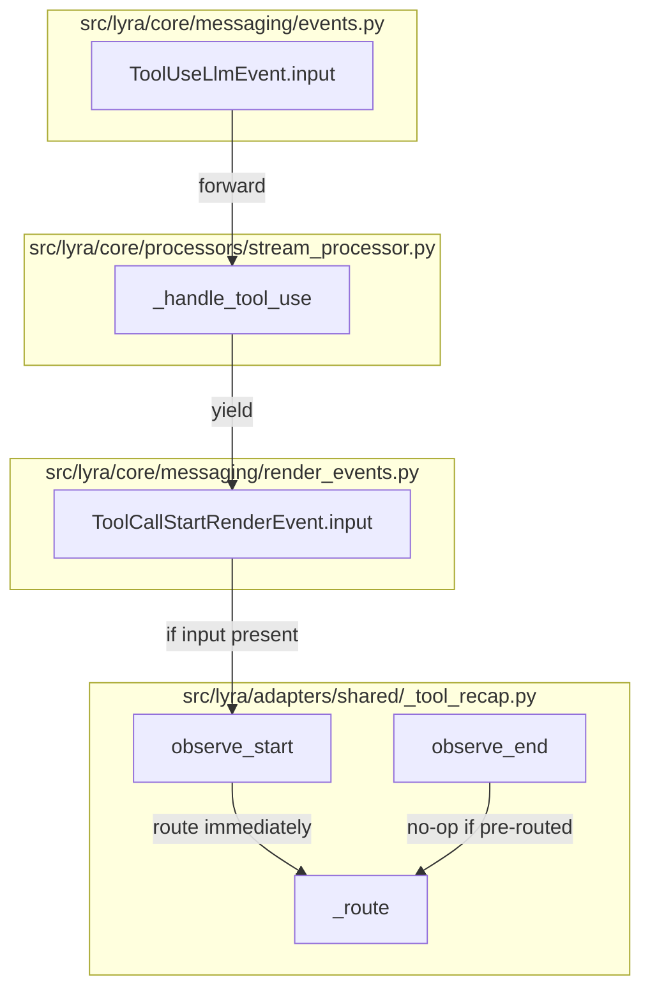
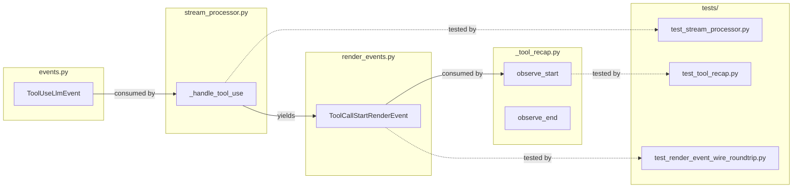

## Summary

Add an optional `input` field to `ToolCallStartRenderEvent`, forward it from `ToolUseLlmEvent` in `StreamProcessor`, and route immediately in `ToolRecapAccumulator.observe_start` when present. Zero regression on the existing SDK delta path.

## Architecture

### Data Flow

### File x Function Map

## Agents

| Agent | Task count | Files |
|-------|-----------|-------|
| backend-dev-A | 3 | render_events.py, events.py, stream_processor.py |
| backend-dev-B | 1 | _tool_recap.py |
| tester-A | 2 | test_stream_processor.py, test_tool_recap.py |
| tester-B | 1 | test_render_event_wire_roundtrip.py |
| devops-A | 1 | CHANGELOG.md |

## Wave Structure

3 waves, max 2 parallel agents. Elapsed ~1 day vs ~3 days sequential.

| Wave | Trigger | Agents | Tasks |
|------|---------|--------|-------|
| 1 | start | 2 ∥ | backend-dev-A: T1·T2·T3 · backend-dev-B: T4 |
| 2 | Wave 1 done | 2 ∥ | tester-A: T5·T6 · tester-B: T7 |
| 3 | Wave 2 done | 1 | devops-A: T8 |

### Budget — per task

| Task | Items | Class | Est. ops | Split? |
|------|-------|-------|----------|--------|
| T1 Add input field | 1 | trivial | 1 | — |
| T2 Update docstring | 1 | trivial | 1 | — |
| T3 Forward input | 1 | bounded | 2 | — |
| T4 Route in accumulator | 1 | bounded | 2 | — |
| T5 Stream processor test | 1 | bounded | 2 | — |
| T6 Tool recap test | 1 | bounded | 2 | — |
| T7 Codec round-trip test | 1 | bounded | 2 | — |
| T8 CHANGELOG | 1 | trivial | 1 | — |

**Total estimated ops: 13**

### Budget — per agent instance

| Instance | Tasks | Σ ops | Subjects | Split? |
|----------|-------|-------|----------|--------|
| backend-dev-A | T1, T2, T3 | 4 | messaging, processor | — |
| backend-dev-B | T4 | 2 | recap | — |
| tester-A | T5, T6 | 4 | processor, recap | — |
| tester-B | T7 | 2 | codec | — |
| devops-A | T8 | 1 | changelog | — |

## Consistency Report

- Criteria covered: 10/10
- Uncovered criteria: none
- Tasks without spec backing: none
- Gold plating exemptions applied: 0

## Micro-Tasks

### Slice V1: Additive field + forwarding

#### Task 1: Add `input` field to `ToolCallStartRenderEvent` [P] → backend-dev-A
- **File:** `src/lyra/core/messaging/render_events.py`
- **Snippet:** `input: dict[str, Any] | None = None`
- **Verify:** `grep -n "input" src/lyra/core/messaging/render_events.py | head -3`
- **Expected:** `input: dict[str, Any] | None = None` appears
- **Time:** 2 min
- **Difficulty:** 1
- **Traces:** SC-1
- **Phase:** RED

#### Task 2: Update `ToolUseLlmEvent` docstring → backend-dev-A
- **File:** `src/lyra/core/messaging/events.py`
- **Snippet:** Remove "V1 only tracks tool name/id" limitation text
- **Verify:** `grep -n "V1 only" src/lyra/core/messaging/events.py`
- **Expected:** no match (line removed)
- **Time:** 2 min
- **Difficulty:** 1
- **Traces:** SC-3
- **Phase:** RED

#### Task 3: Forward `ToolUseLlmEvent.input` in `_handle_tool_use` → backend-dev-A
- **File:** `src/lyra/core/processors/stream_processor.py`
- **Snippet:** `input=event.input if event.input else None` (maps empty dict `{}` → `None`)
- **Verify:** `grep -A2 "yield ToolCallStartRenderEvent" src/lyra/core/processors/stream_processor.py | grep input`
- **Expected:** `input=` appears in constructor call
- **Time:** 3 min
- **Difficulty:** 2
- **Traces:** SC-2, SC-3
- **Phase:** RED

#### RED-GATE: RED complete V1
- **Verify:** T1, T2, T3 marked complete
- **Phase:** RED-GATE

### Slice V2: Accumulator routing

#### Task 4: Route immediately in `observe_start`, skip `_in_flight` → backend-dev-B
- **File:** `src/lyra/adapters/shared/_tool_recap.py`
- **Snippet:** `if ev.input: self._route(...); return` (do not add to `_in_flight`)
- **Verify:** `grep -A5 "def observe_start" src/lyra/adapters/shared/_tool_recap.py | grep input`
- **Expected:** `input` check present
- **Time:** 3 min
- **Difficulty:** 2
- **Traces:** SC-4, SC-5
- **Phase:** RED

#### RED-GATE: RED complete V2
- **Verify:** T4 marked complete
- **Phase:** RED-GATE

### Slice V3: Test + codec verification

#### Task 5: Add clipool-style input forwarding test → tester-A
- **File:** `tests/core/test_stream_processor.py`
- **Snippet:** `ToolUseLlmEvent(tool_name="Bash", tool_id="tc-1", input={"command": "ls"})` → assert `ToolCallStartRenderEvent.input == {"command": "ls"}`
- **Verify:** `uv run pytest tests/core/test_stream_processor.py -k "clipool" -v`
- **Expected:** 1 passed
- **Time:** 5 min
- **Difficulty:** 2
- **Traces:** SC-2, SC-8
- **Phase:** GREEN

#### Task 6: Add pre-routed `observe_start` + no-op `observe_end` test → tester-A
- **File:** `tests/adapters/test_tool_recap.py`
- **Snippet:** `observe_start(ToolCallStartRenderEvent(..., input={"command": "ls"}))` → assert `bash_commands == ["ls"]`; then `observe_end` → assert unchanged
- **Verify:** `uv run pytest tests/adapters/test_tool_recap.py -k "pre_routed" -v`
- **Expected:** 1 passed
- **Time:** 5 min
- **Difficulty:** 2
- **Traces:** SC-4, SC-5, SC-8
- **Phase:** GREEN

#### Task 7: Assert codec round-trip preserves `input` field → tester-B
- **File:** `tests/nats/test_render_event_wire_roundtrip.py` or `tests/nats/test_render_event_codec.py`
- **Snippet:** `event = ToolCallStartRenderEvent(tool_call_id="tc-1", tool_name="Bash", input={"command": "ls"}); assert codec.decode(...) == event`
- **Verify:** `uv run pytest tests/nats/test_render_event_codec.py -k "roundtrip" -v`
- **Expected:** 1 passed
- **Time:** 5 min
- **Difficulty:** 2
- **Traces:** SC-6, SC-7
- **Phase:** GREEN

#### Task 8: CHANGELOG entry → devops-A
- **File:** `CHANGELOG.md`
- **Snippet:** `- Fixed: propagate clipool tool input to live recap accumulator (#1348)`
- **Verify:** `grep "#1348" CHANGELOG.md`
- **Expected:** line present under `[Unreleased]`
- **Time:** 2 min
- **Difficulty:** 1
- **Traces:** SC-10
- **Phase:** GREEN

## Task IDs

<!-- Generated by /plan. Used by /implement to resume tasks on session restart. -->
- T1: 7 — messaging
- T2: 8 — messaging
- T3: 9 — processor
- T4: 10 — recap
- T5: 11 — processor
- T6: 12 — recap
- T7: 13 — codec
- T8: 14 — changelog

## Task Seeding Blueprint

### Wave 1 — no deps, 2 agents ∥

| Task | Agent instance | blockedBy | Subject |
|------|---------------|-----------|---------|
| T1 | backend-dev-A | — | messaging |
| T2 | backend-dev-A | — | messaging |
| T3 | backend-dev-A | — | processor |
| T4 | backend-dev-B | — | recap |

### Wave 2 — after Wave 1, 2 agents ∥

| Task | Agent instance | blockedBy | Subject |
|------|---------------|-----------|---------|
| T5 | tester-A | T3 | processor |
| T6 | tester-A | T4 | recap |
| T7 | tester-B | T1 | codec |

### Wave 3 — after Wave 2, 1 agent

| Task | Agent instance | blockedBy | Subject |
|------|---------------|-----------|---------|
| T8 | devops-A | T5,T6,T7 | changelog |
