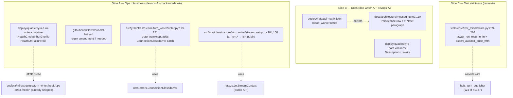
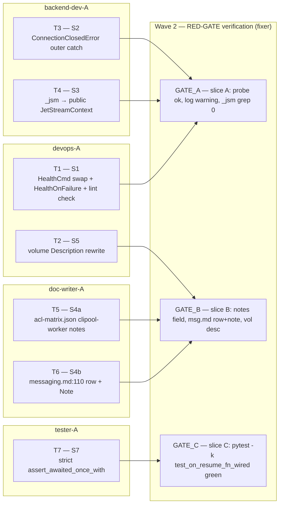

## Summary

Bundle 6 deferred review fixes from PR #1347 into one PR — 3 ops-robustness (S1 Quadlet HTTP health probe + `HealthOnFailure=kill`, S2 NATS `ConnectionClosedError` handling in outer consume-loop try/except, S3 `_jsm` private-API → public `JetStreamContext`), 2 doc updates (S4a + S4b clipool-worker exclusion across ACL matrix + messaging.md, S5 volume `Description` re-attributes `turns.db` writer), and 1 test strictness restoration (S7 strict assertion on `_on_resume_fn` wiring). 4 agent instances, 1 wave parallel for edits + 1 wave sequential for gates.

## Architecture





## Bootstrap Context

No `analyze` artifact (F-lite). Reference frame: `artifacts/frames/1349-turnwriter-cleanups-frame.mdx`. Reference spec: `artifacts/specs/1349-turnwriter-cleanups-spec.mdx`. Drift reconciliation table in spec context block remains authoritative for path / wording corrections (S1 pgrep→grep, S4 .json+.md not .mdx, S7 core/middleware.py not integration/).

## Agents

| Agent instance | Tasks | Files |
|---|---|---|
| devops-A | T1, T2 | `deploy/quadlet/lyra-turn-writer.container`, `.github/workflows/quadlet-lint.yml` (conditional), `deploy/quadlet/lyra-data.volume` |
| backend-dev-A | T3, T4 | `src/lyra/infrastructure/turn_writer/writer.py`, `src/lyra/infrastructure/turn_writer/stream_setup.py` |
| doc-writer-A | T5, T6 | `deploy/nats/acl-matrix.json`, `docs/architecture/messaging.md` |
| tester-A | T7 | `tests/core/test_middleware.py` |
| fixer (gate) | GATE_A, GATE_B, GATE_C | run verify commands; no edits |

## Reference patterns

| Surface | Reference file | What to mimic |
|---|---|---|
| `HealthCmd=` format & lint compatibility | `deploy/quadlet/lyra-hub.container` (HealthCmd line) + `.github/workflows/quadlet-lint.yml` `_check_dq` step (#1370) | Current grep-form precedent; lint allows `'` (single quotes), rejects `"` |
| `notes` field on ACL identity | `deploy/nats/acl-matrix.json` `turn-writer` entry (line ~280) — multi-sentence rationale with #-references | Tone, structure, ADR/issue citations |
| `assert_awaited_once_with(...)` for `_on_resume_fn` | `tests/core/test_middleware.py::test_on_resume_fn_calls_publisher` (line 78-126) | kwargs shape, mock setup, expected target_count etc. |
| `> Note:` paragraph beneath a table row in `messaging.md` | search `messaging.md` for existing `> Note:` blocks — if none, follow Fumadocs MDX convention used elsewhere in `docs/architecture/` | Inline note placement |

## Wave Structure

2 waves, max 4 parallel agents. Elapsed ~45 min vs ~2 h sequential.

| Wave | Trigger | Agents | Tasks |
|------|---------|--------|-------|
| 1 | start | 4 ∥ | devops-A: T1→T2 · backend-dev-A: T3→T4 · doc-writer-A: T5→T6 · tester-A: T7 |
| 2 | Wave 1 done | 1 | fixer: GATE_A · GATE_B · GATE_C (sequential, fast) |

### Budget — per task

| Task | Items | Class | Est. ops | Split? |
|------|-------|-------|----------|--------|
| T1 (S1 Quadlet + lint) | 3 (HealthCmd, HealthOnFailure, lint check) | judgmental | 5 | — |
| T2 (S5 volume desc) | 1 (Description= line) | trivial | 2 | — |
| T3 (S2 outer catch) | 1 (writer.py:113-121 outer try) | bounded | 3 | — |
| T4 (S3 _jsm→public) | 2 (stream_setup.py:104, 108) | bounded | 3 | — |
| T5 (S4a acl notes) | 1 (clipool-worker.notes) | bounded | 3 | — |
| T6 (S4b messaging row+note) | 2 (row edit + note paragraph) | bounded | 4 | — |
| T7 (S7 strict assert) | 1 (test rewrite) | judgmental | 5 | — |
| GATE_A | 3 (probe+log+grep checks) | bounded | 3 | — |
| GATE_B | 3 (jq+grep+head checks) | bounded | 3 | — |
| GATE_C | 1 (`pytest -k test_on_resume_fn_wired`) | trivial | 2 | — |

**Total estimated ops: ~33** — well below the 50-cap per-task and per-instance.

### Budget — per agent instance

| Instance | Tasks | Σ ops | Subjects | Split? |
|----------|-------|-------|----------|--------|
| devops-A | T1, T2 | 7 | quadlet-health, volume-desc | — (2 subjects = at limit, OK) |
| backend-dev-A | T3, T4 | 6 | error-handling, jetstream-api | — |
| doc-writer-A | T5, T6 | 7 | turns-acl-doc | — (1 subject) |
| tester-A | T7 | 5 | test-strictness | — |
| fixer (gate) | GATE_A, GATE_B, GATE_C | 8 | gate-verification | — |

## Consistency Report

- **Acceptance criteria covered:** 11/11 (S1×3 + S2 + S3 + S4a + S4b + S5 + S7 + quality-gates + PR-body).
- **Uncovered:** 0.
- **Untraced tasks:** 0 — every T_n traces back to either an SC or a structural gate.
- **Exemptions:** none.
- **Bi-directional check (spec ↔ tasks):**
  - SC1 (S1 HealthCmd python3 urllib) → T1
  - SC2 (S1 HealthOnFailure=kill) → T1
  - SC3 (S1 Quadlet lint passes) → T1 (lint regex amendment + GATE_A re-run)
  - SC4 (S2 ConnectionClosedError outer catch) → T3
  - SC5 (S3 grep _jsm = 0) → T4
  - SC6 (S4a clipool-worker.notes) → T5
  - SC7 (S4b messaging.md:110 row + Note) → T6
  - SC8 (S5 lyra-data.volume Description=) → T2
  - SC9 (S7 strict assertion) → T7
  - SC10 (quality gates green) → GATE_A + GATE_B + GATE_C + final validate pass
  - SC11 (PR body links #1349 + #1347) → handled at `/pr` step (out of plan scope)

## Micro-Tasks

### Slice A — Ops Robustness

#### T1 — S1: Quadlet HealthCmd + HealthOnFailure + lint  [P] devops-A · subject: quadlet-health · spec: SC1+SC2+SC3 · phase: GREEN · diff: 3

**File:** `deploy/quadlet/lyra-turn-writer.container`

**Edits (3):**

1. Line 37: replace `HealthCmd=grep -q turn-writer /proc/1/cmdline` with a Python urllib probe against `http://127.0.0.1:8083/health`. Preferred form:
   ```
   HealthCmd=python3 -c 'import urllib.request,sys; r=urllib.request.urlopen("http://127.0.0.1:8083/health",timeout=3); sys.exit(0 if r.status==200 else 1)'
   ```
2. Add new line in `[Container]` section: `HealthOnFailure=kill` (not currently present).
3. Run `.github/workflows/quadlet-lint.yml` locally (or via `act` if installed). If the `_check_dq` step rejects the new `HealthCmd=` line because of the inner `"` characters: **amend the lint regex narrowly** — exempt `HealthCmd=` lines that start with `python3 -c` from the double-quote check (motivation: the original #1370 bug was a generator-introduced *trailing* `"` corruption in `pgrep -f "lyra X"`, not a general ban on `"`; the urllib form's `"` lives inside Python source, not shell). The amendment must be a single workflow file edit; commit message MUST cite #1349 + this rationale.

**Verify:**
```bash
grep -n "HealthCmd\|HealthOnFailure" deploy/quadlet/lyra-turn-writer.container
# Expect: HealthCmd=python3 -c 'import urllib.request,...'
# Expect: HealthOnFailure=kill
podman quadlet validate deploy/quadlet/lyra-turn-writer.container 2>&1 || true
# Quadlet lint workflow:
gh workflow view quadlet-lint.yml >/dev/null && echo "workflow OK"
```

**Expected:** Both grep matches present. `podman quadlet validate` returns no errors (warnings about no destination dir for `Network=lyra.network` are pre-existing — ignore). Quadlet lint workflow file references the new exemption (if amended).

#### T2 — S5: lyra-data.volume Description=  [P] devops-A · subject: volume-desc · spec: SC8 · phase: GREEN · diff: 1

**File:** `deploy/quadlet/lyra-data.volume`

**Edit (1):** Replace line 2 (`Description=Lyra data bind-mount — Hub only (auth.db, config.db, keyring.key, message_index.db, turns.db)`) with:
```
Description=Lyra data bind-mount — Hub (RW: auth.db, config.db, keyring.key, message_index.db) + TurnWriter sole writer turns.db (ADR-075). Hub mounts turns.db ro.
```

**Verify:**
```bash
head -3 deploy/quadlet/lyra-data.volume
```

**Expected:** New Description= text present. No other lines changed.

#### T3 — S2: ConnectionClosedError outer catch  [P] backend-dev-A · subject: error-handling · spec: SC4 · phase: GREEN · diff: 1

**File:** `src/lyra/infrastructure/turn_writer/writer.py:113-121`

**Edit (1):** Inside the **outer** `try/except` wrapping `await self._sub.fetch(...)` (lines 113-121, *not* the inner per-message try at lines 128-140), add a new clause **after** the existing `except asyncio.CancelledError: return` (so the order is `TimeoutError` → `CancelledError` → `ConnectionClosedError`):
```python
except nats.errors.ConnectionClosedError as err:
    log.warning(
        "TurnWriter: NATS connection lost, will exit and let Quadlet restart: %s",
        err,
    )
    raise
```

`nats.errors` is already imported at line 17 (verified). `log` is the module logger (already in scope).

**Verify:**
```bash
sed -n '110,135p' src/lyra/infrastructure/turn_writer/writer.py
grep -nA2 "ConnectionClosedError" src/lyra/infrastructure/turn_writer/writer.py
uv run pytest tests/integration/test_turn_writer*.py -q
```

**Expected:** New `except ConnectionClosedError` clause present in `_consume_loop` outer try. Inner per-message try at lines 128-140 unchanged. Existing integration tests still green.

#### T4 — S3: js._jsm → public JetStreamContext  [P] backend-dev-A · subject: jetstream-api · spec: SC5 · phase: GREEN · diff: 2

**File:** `src/lyra/infrastructure/turn_writer/stream_setup.py:104,108`

**Edits (2):**

- Line 104: replace `await js._jsm.consumer_info(STREAM_NAME, CONSUMER_NAME)  # noqa: SLF001` with `await js.consumer_info(STREAM_NAME, CONSUMER_NAME)` (drop the `# noqa: SLF001`).
- Line 108: replace `await js._jsm.add_consumer(STREAM_NAME, config=cfg)  # noqa: SLF001` with `await js.add_consumer(STREAM_NAME, config=cfg)` (drop the `# noqa: SLF001`).

Architect verified (in spec review): both `JetStreamContext.consumer_info(stream, consumer)` and `add_consumer(stream, config)` exist as public methods on nats-py 2.14.0 with identical return shapes and identical raised exception types (`NotFoundError` on 404). `from nats_module import` lines unchanged.

**Verify:**
```bash
grep -rn "_jsm" src/lyra/infrastructure/turn_writer/
# Expect: 0 hits
grep -rn "noqa: SLF001" src/lyra/infrastructure/turn_writer/stream_setup.py
# Expect: 0 hits
uv run pyright src/lyra/infrastructure/turn_writer/stream_setup.py
uv run pytest tests/integration/test_turn_writer_stream_setup*.py -q 2>/dev/null || \
  uv run pytest tests/ -k stream_setup -q
```

**Expected:** `_jsm` grep returns no matches. `SLF001` `noqa` directives removed. Pyright clean on the file. Relevant integration tests still green.

### Slice B — Docs

#### T5 — S4a: acl-matrix.json clipool-worker.notes  [P] doc-writer-A · subject: turns-acl-doc · spec: SC6 · phase: GREEN · diff: 1

**File:** `deploy/nats/acl-matrix.json`

**Edit (1):** Inside the `clipool-worker` identity entry (search for `"clipool-worker": {`), add a new `notes` field immediately after `description`. Convention: every other active identity (e.g. `turn-writer`, `telegram-adapter`, `discord-adapter`, `hub`) already has one. Suggested content:
```json
"notes": "clipool-worker is intentionally excluded from publishing lyra.turns.write. Rationale: clipool is a downstream command worker (executes lyra.clipool.cmd dispatches), not a user-message source — the upstream adapter has already recorded the turn via lyra.turns.write before the dispatch reaches clipool. Active publishers of lyra.turns.write: hub, telegram-adapter, discord-adapter (all per #1331 T27). See ADR-075 and #1349.",
```

**Verify:**
```bash
jq -r '.identities."clipool-worker".notes' deploy/nats/acl-matrix.json
jq -e '.identities."clipool-worker" | has("notes")' deploy/nats/acl-matrix.json
jq -e '.identities."clipool-worker".publish | index("lyra.turns.write") == null' deploy/nats/acl-matrix.json
```

**Expected:** `notes` field present with the rationale; `clipool-worker.publish` still does NOT contain `lyra.turns.write` (verifying the exclusion is real); JSON remains valid.

#### T6 — S4b: messaging.md Persistence row + Note  [P] doc-writer-A · subject: turns-acl-doc · spec: SC7 · phase: GREEN · diff: 2

**File:** `docs/architecture/messaging.md:110`

**Edits (2):**

1. Update the Persistence-plane row: publisher cell from `hub` to `hub, telegram-adapter, discord-adapter`.
   Current: `| Persistence | \`lyra.turns.>\` | JetStream durable (stream \`LYRA_TURNS\`, \`MaxAge=24h\`, WorkQueue) | durable | hub | turn-writer | append-only state changes requiring at-least-once delivery |`
   Target: `| Persistence | \`lyra.turns.>\` | JetStream durable (stream \`LYRA_TURNS\`, \`MaxAge=24h\`, WorkQueue) | durable | hub, telegram-adapter, discord-adapter | turn-writer | append-only state changes requiring at-least-once delivery |`
2. Insert a blank line then a `> Note:` paragraph immediately beneath the table (after the closing of the rows, before the next prose section):
   ```
   > **Note:** `clipool-worker` is intentionally excluded from publishing `lyra.turns.write` despite being granted `$JS.API.>` — it is a downstream command worker, not a user-message source. The upstream adapter has already recorded the turn before dispatch reaches clipool. See `deploy/nats/acl-matrix.json` and ADR-075 (#1349).
   ```

**Verify:**
```bash
sed -n '108,116p' docs/architecture/messaging.md
grep -F "hub, telegram-adapter, discord-adapter" docs/architecture/messaging.md
grep -A1 "clipool-worker.*intentionally excluded" docs/architecture/messaging.md
```

**Expected:** Updated row shows the 3-publisher cell. `> Note:` block present beneath the table. No other rows in the table modified.

### Slice C — Test strictness

#### T7 — S7: strict assert_awaited_once_with  tester-A · subject: test-strictness · spec: SC9 · phase: GREEN · diff: 1

**File:** `tests/core/test_middleware.py:209-226`

**Edit (1):** Replace the body of `test_on_resume_fn_wired_when_turn_publisher_present` so that:

- The weak `assert ctx.pool._on_resume_fn is not None` line is **removed**.
- The closure is actually invoked: `await ctx.pool._on_resume_fn("test-session-id")`.
- The publisher mock is asserted: `publisher.publish_increment_resume_count.assert_awaited_once_with(pool_id="telegram:main:chat:42", session_id="test-session-id", platform=..., user_id=..., target_count=1, trace_id=...)`.

The exact kwarg shape MUST match the kwargs asserted in `test_on_resume_fn_calls_publisher` (line 78-126) — copy that pattern. The hub fixture (`_make_hub`) already wires the agent registry and produces a usable `Binding`; reuse the existing mock setup at lines 213-220.

**Verify:**
```bash
uv run pytest tests/core/test_middleware.py::TestMessagePrepMiddleware::test_on_resume_fn_wired_when_turn_publisher_present -v
# After remove publisher wire (sanity check):
# (Manually) set hub._turn_publisher = None inside the test fixture, observe the test FAILS — proves the assertion is strict.
grep -F "ctx.pool._on_resume_fn is not None" tests/core/test_middleware.py
# Expect: 0 hits (the weak assertion is gone)
grep -F "assert_awaited_once_with" tests/core/test_middleware.py | grep -c "publish_increment_resume_count"
# Expect: >= 2 (existing test_on_resume_fn_calls_publisher + new S7 strict)
```

**Expected:** The strict test passes. The weak assertion is removed. The new strict pattern matches `test_on_resume_fn_calls_publisher`.

### RED-GATE — Slice verifications (Wave 2)

#### GATE_A — Slice A green  fixer · subject: gate-verification · spec: SC1+SC2+SC3+SC4+SC5

**Files:** none (read-only verification)

**Verify:**
```bash
# S1 — Quadlet
grep -E "HealthCmd=python3 -c|HealthOnFailure=kill" deploy/quadlet/lyra-turn-writer.container
# Expect both lines

# S2 — error handling
grep -F "ConnectionClosedError" src/lyra/infrastructure/turn_writer/writer.py

# S3 — public API only
grep -rn "_jsm\|noqa: SLF001" src/lyra/infrastructure/turn_writer/
# Expect: 0 hits

# Quadlet lint workflow regex (if amended)
gh workflow view quadlet-lint.yml | grep -E "_check_dq|python3 -c" || true
```

**Expected:** All 3 checks pass; `_jsm` and `SLF001` greps return zero.

#### GATE_B — Slice B green  fixer · subject: gate-verification · spec: SC6+SC7+SC8

**Verify:**
```bash
jq -e '.identities."clipool-worker" | has("notes")' deploy/nats/acl-matrix.json
jq -r '.identities."clipool-worker".notes' deploy/nats/acl-matrix.json | grep -c "lyra.turns.write"
# Expect: >= 1
grep -F "hub, telegram-adapter, discord-adapter" docs/architecture/messaging.md
grep -F "intentionally excluded" docs/architecture/messaging.md
grep -F "TurnWriter sole writer turns.db" deploy/quadlet/lyra-data.volume
```

**Expected:** All 5 checks return matches.

#### GATE_C — Slice C green  fixer · subject: gate-verification · spec: SC9

**Verify:**
```bash
uv run pytest tests/core/test_middleware.py -k test_on_resume_fn -v
grep -cF "ctx.pool._on_resume_fn is not None" tests/core/test_middleware.py
# Expect: 0
```

**Expected:** All `test_on_resume_fn*` tests green. Weak assertion gone.

## Task Seeding Blueprint

<!-- Used by /implement to seed TaskCreate calls on session start.
     Format: T{n} | agent-instance | blockedBy | subject
     blockedBy refs T-numbers within this list (not session task IDs). -->

### Wave 1 — no deps, 4 agents ∥

| Task | Agent instance | blockedBy | Subject |
|------|---------------|-----------|---------|
| T1 | devops-A | — | quadlet-health |
| T2 | devops-A | T1 | volume-desc |
| T3 | backend-dev-A | — | error-handling |
| T4 | backend-dev-A | T3 | jetstream-api |
| T5 | doc-writer-A | — | turns-acl-doc |
| T6 | doc-writer-A | T5 | turns-acl-doc |
| T7 | tester-A | — | test-strictness |

### Wave 2 — after Wave 1, 1 agent sequential

| Task | Agent instance | blockedBy | Subject |
|------|---------------|-----------|---------|
| GATE_A | fixer | T1, T3, T4 | gate-verification |
| GATE_B | fixer | T2, T5, T6 | gate-verification |
| GATE_C | fixer | T7 | gate-verification |

## Task IDs

<!-- Generated by /plan. Used by /implement to resume tasks on session restart. -->
- T1: 13 — quadlet-health (devops-A)
- T2: 14 — volume-desc (devops-A, blockedBy T1)
- T3: 15 — error-handling (backend-dev-A)
- T4: 16 — jetstream-api (backend-dev-A, blockedBy T3)
- T5: 17 — turns-acl-doc (doc-writer-A)
- T6: 18 — turns-acl-doc (doc-writer-A, blockedBy T5)
- T7: 19 — test-strictness (tester-A)
- GATE_A: 20 — gate-verification (fixer, blockedBy T1, T3, T4)
- GATE_B: 21 — gate-verification (fixer, blockedBy T2, T5, T6)
- GATE_C: 22 — gate-verification (fixer, blockedBy T7)
