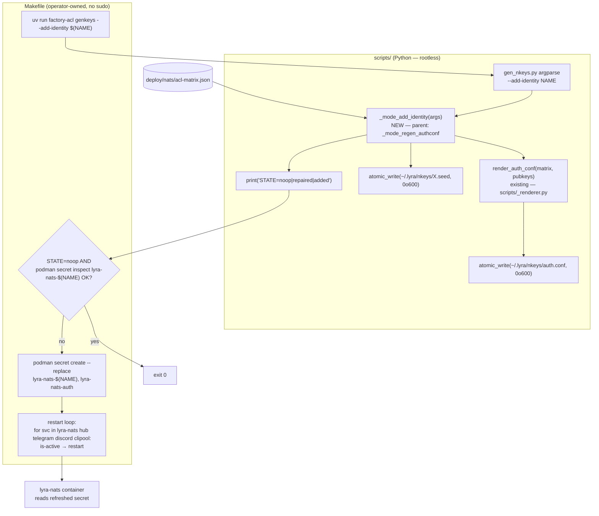
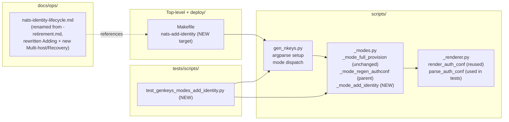

## Summary

Implement rootless `factory-acl genkeys --add-identity NAME` (3-state STATE machine), rootless `make nats-add-identity NAME=<x>` target with Phase-2 gate (`STATE × podman secret inspect`), and rename `docs/ops/nats-identity-retirement.md` → `nats-identity-lifecycle.md` with rewritten "Adding" + new "Multi-host" + "Recovery" sections. Six files, three slices, no schema or interface breaks.

## Architecture

### Data flow



### File × Function map



## Bootstrap Context

Existing parent pattern lives at `scripts/_modes.py:102-128` (`_mode_regen_authconf`). The new mode follows this shape (read matrix, read existing seeds for pubkey derivation, render auth.conf, atomic_write to user mirror) plus a single-seed-gen branch for the `added` state and an early-return branch for the `noop` state.

Test convention: `tests/scripts/test_genkeys_modes.py` — RED-first, subprocess invocation of `scripts/gen_nkeys.py` with `NKEY_PROVIDER=fake` + `LYRA_TEST_MODE=1`. New tests follow this template; use `AUTH_DIR` env var (`_modes.py:78`) to redirect the system-path mtime check into a tmpdir fixture.

Existing rootless Makefile targets to mirror: `nats-regen-authconf` (line 315) and `quadlet-secrets-install` (line 179). Both pass `LYRA_NKEYS_DIR` to `podman secret create --replace`.

## Agents

| Agent instance | Subject | Files | Task count |
|---|---|---|---|
| tester-A | acl-mode-tests | tests/scripts/test_genkeys_modes_add_identity.py | 5 (T1-T4 RED + T7 RED-GATE) |
| backend-dev-A | acl-mode | scripts/_modes.py, scripts/gen_nkeys.py | 2 (T5-T6 GREEN) |
| devops-A | makefile | Makefile | 3 (T8-T10) |
| doc-writer-A | runbook | docs/ops/nats-identity-lifecycle.md, in-repo link refs | 4 (T11-T14) |

No `architect` (extending existing pattern). No `security-auditor` (rootless verb *removes* a privilege surface — net security improvement, no new attack surface). No `frontend-dev`.

## Wave Structure

4 waves, max 2 parallel agents in Wave 1. Elapsed ~1.5 days vs ~2.5 days sequential.

| Wave | Trigger | Agents | Tasks |
|------|---------|--------|-------|
| 1 | start | 2 ∥ | tester-A: T1→T2→T3→T4 · doc-writer-A: T11→T12→T13→T14 |
| 2 | Wave 1 done (RED tests in place + runbook ready) | 1 | backend-dev-A: T5→T6 |
| 3 | Wave 2 done (impl green) | 1 | tester-A: T7 (RED-GATE V1) |
| 4 | Wave 3 done (V1 green) | 1 | devops-A: T8→T9→T10 (RED-GATE V2) |

### Budget — per task

| Task | Items | Class | Est. ops | Split? |
|------|-------|-------|----------|--------|
| T1 RED STATE=added test | 1 | judgmental | 4 | — |
| T2 RED STATE=noop + STATE=repaired tests | 2 | judgmental | 5 | — |
| T3 RED validation-error tests (not-in-matrix, retired, missing-other-seed) | 3 | judgmental | 6 | — |
| T4 RED rootless + system-path-untouched tests | 2 | bounded | 3 | — |
| T5 GREEN _mode_add_identity impl | 1 | judgmental | 6 | — |
| T6 GREEN argparse + dispatch wiring | 1 | bounded | 2 | — |
| T7 RED-GATE V1 pytest run | 1 | trivial | 1 | — |
| T8 GREEN Makefile target body | 1 | judgmental | 5 | — |
| T9 GREEN update .PHONY line | 1 | trivial | 1 | — |
| T10 RED-GATE V2 manual dev-box smoke | 1 | bounded | 2 | — |
| T11 GREEN git mv lifecycle.md | 1 | trivial | 1 | — |
| T12 GREEN rewrite "Adding" section + reorder | 1 | judgmental | 5 | — |
| T13 GREEN add Multi-host subsection | 1 | judgmental | 4 | — |
| T14 GREEN add Recovery subsection + rg link-update + RED-GATE V3 | 1 | judgmental | 4 | — |

**Total estimated ops: 49**

### Budget — per agent instance

| Instance | Tasks | Σ ops | Subjects | Split? |
|----------|-------|-------|----------|--------|
| tester-A | T1, T2, T3, T4, T7 | 19 | acl-mode-tests | — |
| backend-dev-A | T5, T6 | 8 | acl-mode | — |
| devops-A | T8, T9, T10 | 8 | makefile | — |
| doc-writer-A | T11, T12, T13, T14 | 14 | runbook | — |

All instances ≤ 4-task-or-2-subject caps. No split required.

## Consistency Report

Spec acceptance criteria (15 binary items) → micro-tasks coverage:

| AC | Covered by |
|---|---|
| Writes exactly one new seed file (SHA-256 zero-diff on others) | T1, T7 |
| STATE=noop with full-consistency: 0 mtime changes | T2, T7 |
| STATE=repaired: auth.conf rewritten, seed untouched | T2, T7 |
| --add-identity not-in-matrix → non-zero, no seed | T3, T7 |
| --add-identity retired → non-zero, no seed | T3, T7 |
| Other-seed missing → non-zero before write | T3, T7 |
| auth.conf existing blocks byte-identical | T1, T7 |
| System path `/etc/nats/nkeys/auth.conf` mtime unchanged | T4, T7 |
| Runs as non-root | T4, T7 |
| Makefile end-to-end produces seed + secret + restart | T8, T10 |
| Makefile no-op when STATE=noop AND secret present | T8, T10 |
| Makefile runs Phase 2 when STATE=noop BUT secret missing (receiving host) | T8, T10 |
| Makefile target has no `sudo` token | T8 (grep verify) |
| Restart loop is `is-active`-gated, nats first | T8, T10 |
| `nats-identity-lifecycle.md` exists; `-retirement.md` does not; rename in git log | T11 |
| `rg 'nats-identity-retirement' .` returns 0 matches | T14 |
| Runbook sections "Adding" (with new verb), "Retiring" (preserved), "Multi-host", "Recovery" | T12, T13, T14 |
| All existing modes' tests still pass | T7 (full test-suite run) |
| `scripts/check-acl-authconf-drift.sh` still passes | T7 (pre-commit invocation) |

Coverage: 19/19. Uncovered: 0. Untraced tasks: 0.

## Micro-Tasks

### Slice V1 — `--add-identity` CLI verb + tests

**T1 [RED, P]** — Write failing test for STATE=added (new identity full flow)
- File: `tests/scripts/test_genkeys_modes_add_identity.py`
- Snippet:
  ```python
  def test_add_identity_writes_only_new_seed(tmp_path):
      # Setup: matrix with hub + telegram-adapter (active), turn-writer (active)
      # Pre-write: hub.seed + telegram-adapter.seed already exist (random bytes)
      # Act: subprocess run factory-acl genkeys --add-identity turn-writer
      # Assert: STATE=added on stdout, exit 0,
      #         turn-writer.seed created, hub.seed + telegram-adapter.seed SHA-256 unchanged,
      #         auth.conf contains all three pubkey blocks
  ```
- Verify: `uv run pytest tests/scripts/test_genkeys_modes_add_identity.py::test_add_identity_writes_only_new_seed -x`
- Expected: FAILED — `_mode_add_identity` does not exist yet
- Time: 8 min · Difficulty: 3 · Spec trace: SC-1, SC-7 · Agent: tester · Instance: tester-A · Subject: acl-mode-tests

**T2 [RED, P]** — Write failing tests for STATE=noop + STATE=repaired
- File: same
- Snippet:
  ```python
  def test_add_identity_noop_when_full_consistency(tmp_path): ...
  def test_add_identity_repairs_when_seed_present_but_block_missing(tmp_path): ...
  ```
- Verify: `uv run pytest tests/scripts/test_genkeys_modes_add_identity.py -k 'noop or repair' -x`
- Expected: 2 FAILED
- Time: 6 min · Difficulty: 2 · Spec trace: SC-2, SC-3 · Agent: tester · Instance: tester-A · Subject: acl-mode-tests

**T3 [RED, P]** — Write failing validation-error tests
- File: same
- Snippet:
  ```python
  def test_add_identity_unknown_name_in_matrix_fails(tmp_path): ...
  def test_add_identity_retired_identity_fails(tmp_path): ...
  def test_add_identity_missing_other_seed_fails_no_orphan(tmp_path): ...
  ```
- Verify: `uv run pytest tests/scripts/test_genkeys_modes_add_identity.py -k 'unknown or retired or missing_other' -x`
- Expected: 3 FAILED
- Time: 6 min · Difficulty: 2 · Spec trace: SC-4, SC-5, SC-6 · Agent: tester · Instance: tester-A · Subject: acl-mode-tests

**T4 [RED, P]** — Write failing rootless + system-path-untouched tests
- File: same
- Snippet:
  ```python
  def test_add_identity_runs_as_non_root(tmp_path):
      # Assert subprocess runs without sudo, exits 0
  def test_add_identity_does_not_touch_system_path(tmp_path):
      # Set AUTH_DIR=tmp_path/etc-nats; capture mtime; run; assert mtime unchanged
  ```
- Verify: `uv run pytest tests/scripts/test_genkeys_modes_add_identity.py -k 'non_root or system_path' -x`
- Expected: 2 FAILED
- Time: 5 min · Difficulty: 2 · Spec trace: SC-8, SC-9 · Agent: tester · Instance: tester-A · Subject: acl-mode-tests

**T5 [GREEN]** — Implement `_mode_add_identity` in `scripts/_modes.py`
- File: `scripts/_modes.py`
- Snippet (skeleton):
  ```python
  def _mode_add_identity(args: argparse.Namespace) -> None:
      """--add-identity NAME: rootless single-identity provisioning + auth.conf re-render.
      Parent pattern: _mode_regen_authconf. Writes only ~/.lyra/nkeys/."""
      seeds_dir = _seeds_dir()
      matrix = load_matrix(args.matrix)
      name = args.add_identity
      # validate name ∈ matrix ∧ status=active (else exit non-zero)
      # 3-state inspection: read existing seeds; check seed file + auth.conf block presence
      # STATE=noop: print marker, return
      # STATE=repaired: render auth.conf only, atomic_write, print marker
      # STATE=added: gen new seed via provider, atomic_write seed, render + write auth.conf, print marker
      # validation error for missing other-seed BEFORE any write (no orphan)
      print(f"STATE={state}")
  ```
- Verify: `uv run pytest tests/scripts/test_genkeys_modes_add_identity.py -x` (all T1-T4 tests)
- Expected: most green; argparse wiring may still fail until T6
- Time: 25 min · Difficulty: 4 · Spec trace: F1 · Agent: backend-dev · Instance: backend-dev-A · Subject: acl-mode

**T6 [GREEN]** — Wire `--add-identity NAME` argparse + dispatch
- File: `scripts/gen_nkeys.py`
- Snippet:
  ```python
  parser.add_argument("--add-identity", metavar="NAME",
                       help="Add a single identity without rotating others (rootless)")
  # in dispatch:
  if args.add_identity:
      _mode_add_identity(args)
      return
  ```
- Verify: `uv run pytest tests/scripts/test_genkeys_modes_add_identity.py`
- Expected: all 7 tests PASS
- Time: 8 min · Difficulty: 2 · Spec trace: F2 · Agent: backend-dev · Instance: backend-dev-A · Subject: acl-mode

**T7 [RED-GATE V1]** — V1 green: all S1 tests pass + existing test suite untouched
- File: (no edit)
- Verify:
  ```bash
  uv run pytest tests/scripts/test_genkeys_modes_add_identity.py -v && \
  uv run pytest tests/scripts/ -v && \
  bash scripts/check-acl-authconf-drift.sh
  ```
- Expected: all green; no regression in `test_genkeys_modes.py`, `test_acl_canonical_llm.py`, `check-acl-authconf-drift.sh`
- Time: 3 min · Difficulty: 1 · Spec trace: SC-18, SC-19 · Agent: tester · Instance: tester-A · Subject: acl-mode-tests

### Slice V2 — Makefile target

**T8 [GREEN]** — Add `nats-add-identity` Makefile target with Phase-2 gate
- File: `Makefile`
- Snippet:
  ```makefile
  nats-add-identity:  ## add a single NATS identity rootless; restart consumers
  	@test -n "$(NAME)" || (echo "usage: make nats-add-identity NAME=<x>"; exit 2)
  	@state=$$(uv run --project . factory-acl genkeys --add-identity "$(NAME)" \
  	          | tee /dev/stderr | grep -oE 'STATE=(noop|repaired|added)' || echo STATE=unknown); \
  	if [ "$$state" = "STATE=noop" ] && podman secret inspect "lyra-nats-$(NAME)" >/dev/null 2>&1; then \
  	  echo "no-op: $(NAME) already provisioned + secret present locally"; \
  	  exit 0; \
  	fi; \
  	podman secret create --replace "lyra-nats-$(NAME)" "$(LYRA_NKEYS_DIR)/$(NAME).seed"; \
  	podman secret create --replace lyra-nats-auth "$(LYRA_NKEYS_DIR)/auth.conf"; \
  	for svc in lyra-nats lyra-hub lyra-telegram lyra-discord lyra-clipool; do \
  	  systemctl --user is-active --quiet $$svc && systemctl --user restart $$svc; \
  	done
  ```
- Verify: `grep -E 'sudo' Makefile | grep -E 'nats-add-identity|^nats-add-identity'` returns empty
- Expected: no `sudo` in target body
- Time: 15 min · Difficulty: 3 · Spec trace: F3, SC-13, SC-14 · Agent: devops · Instance: devops-A · Subject: makefile

**T9 [GREEN]** — Update `.PHONY` line
- File: `Makefile` line 42
- Snippet: append `nats-add-identity` to the existing `.PHONY:` list
- Verify: `grep '^\.PHONY:.*nats-add-identity' Makefile`
- Expected: 1 match
- Time: 1 min · Difficulty: 1 · Spec trace: F3 · Agent: devops · Instance: devops-A · Subject: makefile

**T10 [RED-GATE V2]** — Manual smoke on dev-box (operator-driven)
- File: (no edit)
- Verify:
  ```bash
  # On dev box (operator runs, not CI):
  # 1. Add a test identity to acl-matrix.json (status: active)
  # 2. make nats-add-identity NAME=test-id-1361
  # 3. podman secret ls | grep lyra-nats-test-id-1361   # should show new secret
  # 4. make nats-add-identity NAME=test-id-1361          # second run: no-op
  # 5. systemctl --user status lyra-nats                 # active (running)
  # 6. Clean up: remove from matrix + delete seed + delete secret
  ```
- Expected: all 6 steps as described; no sudo prompted
- Time: 10 min · Difficulty: 2 · Spec trace: SC-10, SC-11, SC-13 · Agent: devops · Instance: devops-A · Subject: makefile

### Slice V3 — Runbook rename + content

**T11 [GREEN]** — `git mv` retirement.md → lifecycle.md
- File: `docs/ops/nats-identity-retirement.md` → `docs/ops/nats-identity-lifecycle.md`
- Verify: `git log --follow docs/ops/nats-identity-lifecycle.md | head -5` shows the rename
- Expected: rename detected
- Time: 1 min · Difficulty: 1 · Spec trace: SC-15 · Agent: doc-writer · Instance: doc-writer-A · Subject: runbook

**T12 [GREEN]** — Rewrite "Adding an identity" section step 2 + move above "Retiring"
- File: `docs/ops/nats-identity-lifecycle.md`
- Snippet (new step 2): replace the existing `--regen-authconf` instructions with `make nats-add-identity NAME=<x>` as the canonical path. Preserve step 1 (acl-matrix.json edit). Drop steps that talked about `--regen-authconf` follow-up.
- Verify: `grep -nE 'make nats-add-identity|--regen-authconf' docs/ops/nats-identity-lifecycle.md`
- Expected: "Adding" section references `make nats-add-identity` only; `--regen-authconf` may still appear in the "Retiring" section if it's part of that flow (verify by reading context)
- Time: 15 min · Difficulty: 3 · Spec trace: SC-17 · Agent: doc-writer · Instance: doc-writer-A · Subject: runbook

**T13 [GREEN]** — Add "Multi-host: running on M₂ / Mₙ" subsection
- File: same
- Snippet: ~15-line subsection explaining: same verb on every consuming host; factory-acl STATE × local Podman secret gate; Syncthing handles seed/auth.conf propagation; restart loop is `is-active`-gated so it's safe everywhere.
- Verify: `grep -n 'Multi-host\|Mₙ\|Syncthing' docs/ops/nats-identity-lifecycle.md`
- Expected: ≥1 match for each term
- Time: 12 min · Difficulty: 2 · Spec trace: SC-17 · Agent: doc-writer · Instance: doc-writer-A · Subject: runbook

**T14 [GREEN + RED-GATE V3]** — Add "Recovery — Phase 2 fails" subsection + grep-update all in-repo links + verify
- File: same + any tracked file referencing `nats-identity-retirement`
- Snippet (recovery): "re-run `make nats-add-identity NAME=<x>` — factory-acl is idempotent on filesystem; `--replace` makes Podman side safe; restart loop is idempotent."
- Sub-step (links): `rg -l 'nats-identity-retirement' .` → edit each to `nats-identity-lifecycle`. Likely candidates: `docs/ops/*.md`, `artifacts/postmortems/*.md`, `CONTRIBUTING.md`.
- Verify:
  ```bash
  grep -n 'Recovery' docs/ops/nats-identity-lifecycle.md && \
  rg 'nats-identity-retirement' . --type-not git
  ```
- Expected: Recovery section present; rg returns 0 matches
- Time: 12 min · Difficulty: 2 · Spec trace: SC-16, SC-17 · Agent: doc-writer · Instance: doc-writer-A · Subject: runbook

## Task Seeding Blueprint

<!-- Used by /implement to seed TaskCreate calls on session start.
     Format: T{n} | agent-instance | blockedBy | subject
     Wave order; within a wave all rows are parallel (∥). -->

### Wave 1 — no deps, 2 agents ∥

| Task | Agent instance | blockedBy | Subject |
|------|---------------|-----------|---------|
| T1 | tester-A | — | acl-mode-tests |
| T2 | tester-A | T1 | acl-mode-tests |
| T3 | tester-A | T2 | acl-mode-tests |
| T4 | tester-A | T3 | acl-mode-tests |
| T11 | doc-writer-A | — | runbook |
| T12 | doc-writer-A | T11 | runbook |
| T13 | doc-writer-A | T12 | runbook |
| T14 | doc-writer-A | T13 | runbook |

### Wave 2 — after Wave 1 RED tests + runbook done, 1 agent

| Task | Agent instance | blockedBy | Subject |
|------|---------------|-----------|---------|
| T5 | backend-dev-A | T4 | acl-mode |
| T6 | backend-dev-A | T5 | acl-mode |

### Wave 3 — after Wave 2 impl green, 1 agent

| Task | Agent instance | blockedBy | Subject |
|------|---------------|-----------|---------|
| T7 | tester-A | T6 | acl-mode-tests |

### Wave 4 — after Wave 3 V1 green, 1 agent

| Task | Agent instance | blockedBy | Subject |
|------|---------------|-----------|---------|
| T8 | devops-A | T7 | makefile |
| T9 | devops-A | T8 | makefile |
| T10 | devops-A | T9 | makefile |

## Task IDs

<!-- Generated by /plan. Used by /implement to resume tasks on session restart. -->
- T1: 13 — acl-mode-tests
- T2: 14 — acl-mode-tests
- T3: 15 — acl-mode-tests
- T4: 16 — acl-mode-tests
- T5: 17 — acl-mode
- T6: 18 — acl-mode
- T7: 19 — acl-mode-tests
- T8: 20 — makefile
- T9: 21 — makefile
- T10: 22 — makefile
- T11: 23 — runbook
- T12: 24 — runbook
- T13: 25 — runbook
- T14: 26 — runbook
