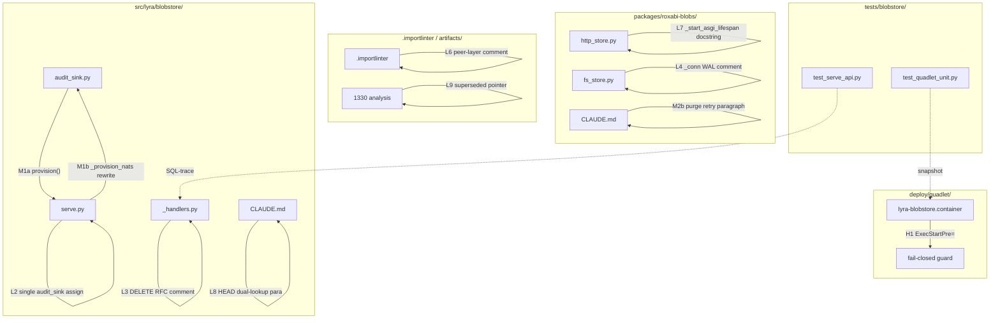
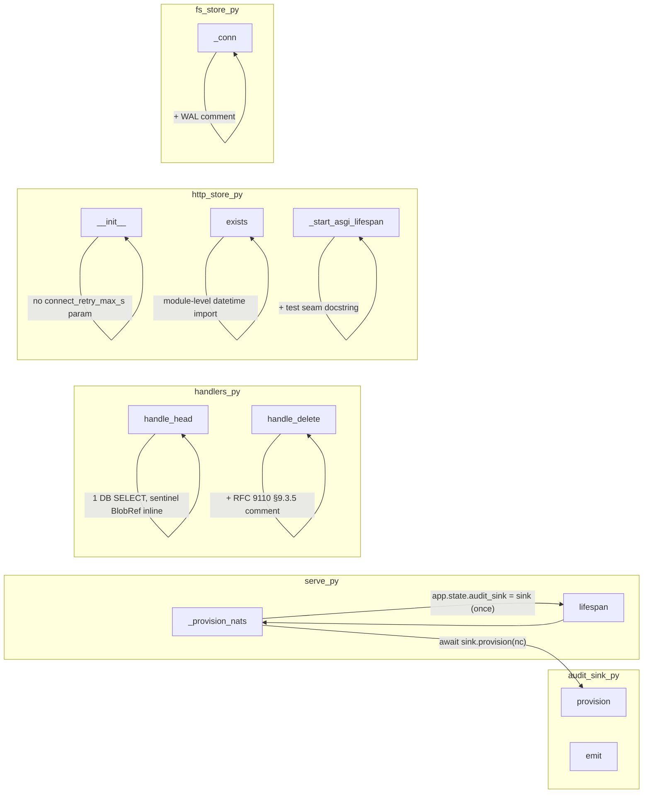

## Summary

Drain PR #1358's parking-lot — 12 items across `src/lyra/blobstore/`, `packages/roxabi-blobs/`, `deploy/quadlet/`, `.importlinter`, and 2 docs. 16 micro-tasks across 6 agent instances; 2 working waves + 1 verify gate; all merged in 1 PR.

## Architecture





## Agents

| Agent instance | Files | Task count | Subjects |
|---|---|---|---|
| backend-dev-A | src/lyra/blobstore/{audit_sink.py, serve.py, _handlers.py} | 4 (T1–T4) | audit-sink, handlers |
| backend-dev-B | packages/roxabi-blobs/src/roxabi_blobs/{http_store.py, fs_store.py} | 4 (T5–T8) | http-store, fs-store |
| backend-dev-C | packages/roxabi-blobs/CLAUDE.md, src/lyra/blobstore/CLAUDE.md | 2 (T9–T10) | docs |
| devops-A | deploy/quadlet/lyra-blobstore.container, .importlinter | 2 (T11–T12) | deploy, contracts |
| doc-writer-A | artifacts/analyses/1330-v8-http-fronted-blobstore-analysis.mdx | 1 (T13) | analyses |
| tester-A | tests/blobstore/{test_quadlet_unit.py, test_serve_api.py} + verify | 3 (T14–T16) | test-deploy, test-handlers, verify |

## Wave Structure

3 waves, max 5 parallel agents. Elapsed ~1 working session vs ~2× sequential.

| Wave | Trigger | Agents | Tasks |
|------|---------|--------|-------|
| 1 | start | 5 ∥ | backend-dev-A: T1→T2→T3→T4 · backend-dev-B: T5→T6→T7→T8 · backend-dev-C: T9→T10 · devops-A: T11→T12 · doc-writer-A: T13 |
| 2 | T3 + T11 done | 1 | tester-A: T14 (after T11) · T15 (after T3) |
| 3 | Wave 2 done | 1 | tester-A: T16 (RED-GATE — verify 8 spec criteria) |

### Budget — per task

| Task | Items | Class | Est. ops | Split? |
|---|---|---|---|---|
| T1 BlobAuditSink.provision() | 1 | judgmental | 5 | — |
| T2 serve.py _provision_nats rewrite | 1 | judgmental | 4 | — |
| T3 L1 HEAD 3→1 lookup | 1 | judgmental | 5 | — |
| T4 L3 DELETE RFC comment | 1 | trivial | 2 | — |
| T5 M2a remove connect_retry_max_s | 1 | bounded | 3 | — |
| T6 L5 hoist datetime import | 1 | trivial | 2 | — |
| T7 L7 docstring | 1 | trivial | 2 | — |
| T8 L4 _conn WAL comment | 1 | trivial | 2 | — |
| T9 M2b purge retry paragraph | 1 | bounded | 2 | — |
| T10 L8 HEAD dual-lookup para | 1 | judgmental | 3 | — |
| T11 H1 ExecStartPre guard | 1 | judgmental | 3 | — |
| T12 L6 importlinter comment | 1 | judgmental | 4 | — |
| T13 L9 analysis superseded pointer | 1 | trivial | 2 | — |
| T14 H1 quadlet snapshot test | 1 | judgmental | 5 | — |
| T15 L1 SQL-trace assertion | 1 | judgmental | 5 | — |
| T16 RED-GATE verify 8 criteria | 8 | bounded | 12 | — |

**Total estimated ops: 61**

### Budget — per agent instance

| Instance | Tasks | Σ ops | Subjects | Split? |
|---|---|---|---|---|
| backend-dev-A | T1, T2, T3, T4 | 16 | audit-sink, handlers | — |
| backend-dev-B | T5, T6, T7, T8 | 9 | http-store, fs-store | — |
| backend-dev-C | T9, T10 | 5 | docs | — |
| devops-A | T11, T12 | 7 | deploy, contracts | — |
| doc-writer-A | T13 | 2 | analyses | — |
| tester-A | T14, T15, T16 | 22 | test-deploy, test-handlers, verify | — |

All instances under caps (≤4 tasks, ≤2 subjects, ≤50 ops). No split required.

## Consistency Report

| Spec criterion | Covered by tasks | Status |
|---|---|---|
| H1 Tailscale guard | T11, T14 | covered |
| M1 BlobAuditSink lifecycle | T1, T2 | covered |
| M2 connect_retry_max_s removal | T5, T9 | covered |
| L1/L2/L5 code correctness | T3, T2 (L2 verified inside M1b), T6 | covered |
| L3/L4/L7 comments + docstring | T4, T8, T7 | covered |
| L6 importlinter contract | T12 | covered |
| L8/L9 docs reconciliation | T10, T13 | covered |
| All gates green | T16 | covered |

8 / 8 covered. 0 uncovered. 0 untraced. 0 exemptions.

## Micro-Tasks

### Wave 1 — backend-dev-A (audit-sink + handlers)

#### T1 [P] — Add `BlobAuditSink.provision()` method

- **File:** `src/lyra/blobstore/audit_sink.py`
- **Agent:** backend-dev / backend-dev-A
- **Subject:** audit-sink
- **Spec trace:** M1
- **Slice:** V1
- **Phase:** GREEN
- **Difficulty:** 3
- **Time:** 5 min
- **Snippet skeleton:**
  ```python
  async def provision(self, nc: NatsClient) -> None:
      """Attach to JetStream; mark degraded on failure. Stream LYRA_AUDIT is
      shared and managed by JetStreamAuditSink — this sink only takes a
      jetstream handle and falls back to the lyra.security logger on error."""
      try:
          self._js = nc.jetstream()
      except nats.errors.Error as exc:
          log.warning("BLOB-AUDIT: JetStream not available — emitting to lyra.security logger: %s", exc)
          self._degraded = True
  ```
- **Reference pattern:** `src/lyra/infrastructure/audit/jetstream_sink.py:39` (minus stream-config block)
- **Verify:** `grep -nE 'async def provision\(self, nc' src/lyra/blobstore/audit_sink.py`
- **Expected:** one line, signature returns `None`.

#### T2 — Rewrite `serve.py._provision_nats()` to use `sink.provision(nc)`

- **File:** `src/lyra/blobstore/serve.py`
- **Agent:** backend-dev / backend-dev-A
- **Subject:** audit-sink
- **Spec trace:** M1, L2
- **Slice:** V1
- **Phase:** REFACTOR
- **Difficulty:** 3
- **Time:** 5 min
- **blockedBy:** T1
- **Change:**
  - Delete lines (per current shape): `sink._js = js  # noqa: SLF001`, plus the local `sink = BlobAuditSink()` if it can be folded with `app.state.audit_sink`.
  - Replace with: `sink = BlobAuditSink(); await sink.provision(nc); app.state.audit_sink = sink`.
  - Drop the `try: js = nc.jetstream()` block (now lives inside `provision()`).
  - Ensure `_provision_nats()` body contains exactly **one** `app.state.audit_sink = …` assignment in the success path (L2). The degraded branches at file lines ~119 and ~158 (outside `_provision_nats`) are out-of-scope.
- **Verify:**
  ```bash
  grep -n 'sink._js' src/lyra/blobstore/serve.py | wc -l    # expect 0
  grep -nA2 'def _provision_nats' src/lyra/blobstore/serve.py | grep -c 'sink.provision'  # expect 1
  grep -nE 'app\.state\.audit_sink\s*=' src/lyra/blobstore/serve.py  # report and inspect: 1 line inside _provision_nats body
  ```

#### T3 [P] — L1 HEAD handler: 3 lookups → 1

- **File:** `src/lyra/blobstore/_handlers.py`
- **Agent:** backend-dev / backend-dev-A
- **Subject:** handlers
- **Spec trace:** L1
- **Slice:** V2
- **Phase:** REFACTOR
- **Difficulty:** 3
- **Time:** 6 min
- **Change:** After fetching `content_hash` from the first/fallback SELECT, do NOT call `store.exists(content_hash)`. Construct sentinel `BlobRef` directly from the retrieved hash (mirror `HttpBlobStore.exists` sentinel: `BlobRef(blob_ref_id=…, content_hash=content_hash, size=0, …)` — match the existing model fields).
- **Verify:** `grep -nE 'store\.exists\(' src/lyra/blobstore/_handlers.py` returns NO hit inside `handle_head` (other handlers unchanged).

#### T4 [P] — L3 DELETE handler RFC 9110 §9.3.5 comment

- **File:** `src/lyra/blobstore/_handlers.py`
- **Agent:** backend-dev / backend-dev-A
- **Subject:** handlers
- **Spec trace:** L3
- **Slice:** V3
- **Phase:** REFACTOR
- **Difficulty:** 1
- **Time:** 2 min
- **Change:** Add a one-line comment immediately above the 204/404 return branch in `handle_delete`, e.g.:
  ```python
  # TOCTOU 204↔404 window is safe per RFC 9110 §9.3.5 (DELETE is idempotent).
  ```
- **Verify:** `grep -nA1 'RFC 9110' src/lyra/blobstore/_handlers.py` returns 1 line inside the DELETE handler block.

### Wave 1 — backend-dev-B (http-store + fs-store)

#### T5 [P] — M2a remove `connect_retry_max_s` from `HttpBlobStore`

- **File:** `packages/roxabi-blobs/src/roxabi_blobs/http_store.py`
- **Agent:** backend-dev / backend-dev-B
- **Subject:** http-store
- **Spec trace:** M2
- **Slice:** V1
- **Phase:** REFACTOR
- **Difficulty:** 2
- **Time:** 3 min
- **Change:** Delete `connect_retry_max_s: float = 10.0` from `__init__` signature (line 26), delete `self._connect_retry_max_s = connect_retry_max_s` (line 31). Update the class docstring "Retry policy (T24): not yet implemented." → drop the line entirely.
- **Verify:** `grep -rn 'connect_retry_max_s' packages/roxabi-blobs/src/` returns 0.

#### T6 [P] — L5 hoist `from datetime import …` to module level

- **File:** `packages/roxabi-blobs/src/roxabi_blobs/http_store.py`
- **Agent:** backend-dev / backend-dev-B
- **Subject:** http-store
- **Spec trace:** L5
- **Slice:** V2
- **Phase:** REFACTOR
- **Difficulty:** 1
- **Time:** 2 min
- **Change:** Add `from datetime import UTC, datetime` to module imports; delete the in-function import inside `HttpBlobStore.exists`.
- **Verify:** `grep -nE '^from datetime' packages/roxabi-blobs/src/roxabi_blobs/http_store.py` ≥ 1; `grep -n 'from datetime' packages/roxabi-blobs/src/roxabi_blobs/http_store.py | wc -l` = 1.

#### T7 [P] — L7 `_start_asgi_lifespan` docstring

- **File:** `packages/roxabi-blobs/src/roxabi_blobs/http_store.py`
- **Agent:** backend-dev / backend-dev-B
- **Subject:** http-store
- **Spec trace:** L7
- **Slice:** V3
- **Phase:** REFACTOR
- **Difficulty:** 1
- **Time:** 2 min
- **Change:** Add a docstring (1–3 sentences) explaining the in-process ASGI lifespan seam. Must contain the phrase `test seam`.
- **Verify:** `python -c "from roxabi_blobs.http_store import HttpBlobStore; assert 'test seam' in (HttpBlobStore._start_asgi_lifespan.__doc__ or '')"` exits 0.

#### T8 [P] — L4 `_conn()` WAL comment

- **File:** `packages/roxabi-blobs/src/roxabi_blobs/fs_store.py`
- **Agent:** backend-dev / backend-dev-B
- **Subject:** fs-store
- **Spec trace:** L4
- **Slice:** V3
- **Phase:** REFACTOR
- **Difficulty:** 1
- **Time:** 2 min
- **Change:** Add a 1–2 line comment within 5 lines of `def _conn(` explaining the lock skip via WAL read-isolation, e.g.:
  ```python
  # WAL read-isolation makes lock-skip safe: readers see a consistent snapshot
  # without blocking writers; the write-lock is the writer's concern, not ours.
  ```
- **Verify:** `grep -nB2 -A5 'def _conn' packages/roxabi-blobs/src/roxabi_blobs/fs_store.py | grep -q 'WAL'`.

### Wave 1 — backend-dev-C (docs)

#### T9 [P] — M2b purge Retry-policy paragraph from roxabi-blobs CLAUDE.md

- **File:** `packages/roxabi-blobs/CLAUDE.md`
- **Agent:** backend-dev / backend-dev-C
- **Subject:** docs
- **Spec trace:** M2
- **Slice:** V1
- **Phase:** REFACTOR
- **Difficulty:** 1
- **Time:** 2 min
- **Change:** Delete the paragraph documenting `connect_retry_max_s` (around lines 85–95 per the original review). Replace with a one-liner: "Retry-on-connect-error is not implemented; callers operating over Tailnet should wrap `HttpBlobStore` with their own retry policy."
- **Verify:** `grep -in 'connect_retry_max_s\|connect.retry' packages/roxabi-blobs/CLAUDE.md` returns 0.

#### T10 [P] — L8 HEAD dual-lookup paragraph in blobstore CLAUDE.md

- **File:** `src/lyra/blobstore/CLAUDE.md`
- **Agent:** backend-dev / backend-dev-C
- **Subject:** docs
- **Spec trace:** L8
- **Slice:** V3
- **Phase:** REFACTOR
- **Difficulty:** 2
- **Time:** 3 min
- **Change:** Add a `## HEAD handler` (or similar) section explaining the dual DB-lookup path: `store_path` fallback for `store_key` callers, `content_hash` fallback for `HttpBlobStore.exists` callers. Cite the `roxabi-blobs CLAUDE.md §HttpBlobStore.exists` reference already named in `src/lyra/blobstore/_handlers.py:181-182`.
- **Verify:**
  ```bash
  grep -A20 'HEAD' src/lyra/blobstore/CLAUDE.md | grep -E 'content_hash' >/dev/null && \
  grep -A20 'HEAD' src/lyra/blobstore/CLAUDE.md | grep -E 'store_key' >/dev/null
  ```

### Wave 1 — devops-A (deploy + contracts)

#### T11 [P] — H1 Tailscale fail-closed `ExecStartPre=` guard

- **File:** `deploy/quadlet/lyra-blobstore.container`
- **Agent:** devops / devops-A
- **Subject:** deploy
- **Spec trace:** H1
- **Slice:** V1
- **Phase:** GREEN
- **Difficulty:** 2
- **Time:** 3 min
- **Change:** In `[Service]` section, add:
  ```ini
  # Fail-closed guard: refuse to start when TAILSCALE_IPV4 is empty. The
  # PublishPort= line below would otherwise resolve to 0.0.0.0:8449 (LAN-exposed)
  # — this guard prevents the process from ever serving traffic in that state.
  ExecStartPre=/bin/sh -c '[ -n "${TAILSCALE_IPV4}" ] || exit 1'
  ```
  Also update the existing `# RESIDUAL RISK` block above `PublishPort=` to note the guard is now in place.
- **Verify:** `grep -nE '^ExecStartPre=' deploy/quadlet/lyra-blobstore.container | grep -q 'TAILSCALE_IPV4'`.

#### T12 [P] — L6 `.importlinter` peer-layer comment

- **File:** `.importlinter`
- **Agent:** devops / devops-A
- **Subject:** contracts
- **Spec trace:** L6
- **Slice:** V3
- **Phase:** REFACTOR
- **Difficulty:** 2
- **Time:** 4 min
- **Change:** Add a one-line comment immediately above `[importlinter:contract:shared-modules-upper-boundary]` (line 112):
  ```ini
  # NOTE: lyra.blobstore is intentionally absent from source_modules — it is a
  # peer-layer service (own systemd unit + NATS attach), not a shared floating
  # module (ADR-073 + src/lyra/blobstore/CLAUDE.md peer-of-adapters placement).
  ```
  Do NOT add `lyra.blobstore` to the contract list.
- **Verify:** `awk '/\[importlinter:contract:shared-modules-upper-boundary\]/{print prev} {prev=$0}' .importlinter | grep -q 'peer-layer'`.

### Wave 1 — doc-writer-A (analyses)

#### T13 [P] — L9 supersede stale Volume-paths table

- **File:** `artifacts/analyses/1330-v8-http-fronted-blobstore-analysis.mdx`
- **Agent:** doc-writer / doc-writer-A
- **Subject:** analyses
- **Spec trace:** L9
- **Slice:** V3
- **Phase:** REFACTOR
- **Difficulty:** 1
- **Time:** 2 min
- **Change:** Replace the entire Volume-paths table block with exactly:
  ```
  | _(superseded — see docs/QUADLET-DEPLOYMENT.md)_ |
  ```
  Or, if preserving table structure, replace only the data rows with the pointer row.
- **Verify:** `grep -n 'superseded — see docs/QUADLET-DEPLOYMENT.md' artifacts/analyses/1330-v8-http-fronted-blobstore-analysis.mdx` returns 1.

### Wave 2 — tester-A (snapshot + SQL-trace)

#### T14 — H1 quadlet snapshot test

- **File:** `tests/blobstore/test_quadlet_unit.py` (new file)
- **Agent:** tester / tester-A
- **Subject:** test-deploy
- **Spec trace:** H1
- **Slice:** V1
- **Phase:** RED → GREEN
- **Difficulty:** 3
- **Time:** 6 min
- **blockedBy:** T11
- **Change:** Add a test that reads `deploy/quadlet/lyra-blobstore.container` and asserts the `ExecStartPre=` line is present AND contains `TAILSCALE_IPV4`. Pattern: open the file via `pathlib.Path(__file__).parents[2] / "deploy/quadlet/lyra-blobstore.container"`.
- **Verify:** `uv run pytest tests/blobstore/test_quadlet_unit.py -v` passes.

#### T15 — L1 SQL-trace assertion for HEAD single-lookup

- **File:** `tests/blobstore/test_serve_api.py` (extend existing)
- **Agent:** tester / tester-A
- **Subject:** test-handlers
- **Spec trace:** L1
- **Slice:** V2
- **Phase:** RED → GREEN
- **Difficulty:** 3
- **Time:** 6 min
- **blockedBy:** T3
- **Change:** Add a test (or extend `test_head_*`) that asserts HEAD `/blobs/<key>` issues exactly 1 SQL SELECT. Approach: register a `sqlite3` execute-tracer or hook into `aiosqlite.Connection.execute` via monkeypatch; count SELECT calls; assert == 1.
- **Verify:** `uv run pytest tests/blobstore/test_serve_api.py -k head_single_lookup -v` passes.

### Wave 3 — tester-A (RED-GATE)

#### T16 — RED-GATE: verify 8 spec criteria

- **Agent:** tester / tester-A
- **Subject:** verify
- **Spec trace:** all 8 success criteria
- **Slice:** all
- **Phase:** RED-GATE
- **Difficulty:** 2
- **Time:** 10 min
- **blockedBy:** T1, T2, T3, T4, T5, T6, T7, T8, T9, T10, T11, T12, T13, T14, T15
- **Verify:**
  ```bash
  # 8 spec criteria — each must pass.
  cd /home/mickael/projects/lyra

  # 1. H1
  grep -nE '^ExecStartPre=' deploy/quadlet/lyra-blobstore.container | grep -q 'TAILSCALE_IPV4'

  # 2. M1
  grep -nE 'async def provision\(self, nc' src/lyra/blobstore/audit_sink.py
  [ "$(grep -c 'sink._js' src/lyra/blobstore/serve.py)" = "0" ]
  grep -nA2 'def _provision_nats' src/lyra/blobstore/serve.py | grep -q 'sink.provision'

  # 3. M2
  [ "$(grep -rn 'connect_retry_max_s' packages/roxabi-blobs/ | wc -l)" = "0" ]

  # 4. L1 / L2 / L5
  uv run pytest tests/blobstore/test_serve_api.py -k 'head' -v
  [ "$(grep -cE 'app\.state\.audit_sink\s*=' src/lyra/blobstore/serve.py)" -ge 1 ]   # ≥1 (rest are degraded-path)
  grep -nE '^from datetime' packages/roxabi-blobs/src/roxabi_blobs/http_store.py

  # 5. L3 / L4 / L7
  grep -nA1 'RFC 9110' src/lyra/blobstore/_handlers.py
  grep -nB2 -A5 'def _conn' packages/roxabi-blobs/src/roxabi_blobs/fs_store.py | grep -q 'WAL'
  python -c "from roxabi_blobs.http_store import HttpBlobStore; assert 'test seam' in (HttpBlobStore._start_asgi_lifespan.__doc__ or '')"

  # 6. L6
  awk '/\[importlinter:contract:shared-modules-upper-boundary\]/{print prev} {prev=$0}' .importlinter | grep -q 'peer-layer'

  # 7. L8 / L9
  grep -A20 'HEAD' src/lyra/blobstore/CLAUDE.md | grep -E 'content_hash' >/dev/null
  grep -A20 'HEAD' src/lyra/blobstore/CLAUDE.md | grep -E 'store_key' >/dev/null
  grep -q 'superseded — see docs/QUADLET-DEPLOYMENT.md' artifacts/analyses/1330-v8-http-fronted-blobstore-analysis.mdx

  # 8. All gates green
  uv run pyright
  uv run ruff check .
  uv run lint-imports
  uv run pytest tests/blobstore/ packages/roxabi-blobs/tests/
  ```
- **Expected:** all sub-checks exit 0; pytest reports no new failures.

## Task Seeding Blueprint

<!-- Used by /implement to seed TaskCreate calls on session start.
     Format: T{n} | agent-instance | blockedBy | subject
     blockedBy refs T-numbers within this list (not session task IDs).
     Agent instances named so parallel tasks map to distinct spawned agents.
     Seed in wave order; within a wave all rows are parallel (∥). -->

### Wave 1 — no deps, 5 agents ∥

| Task | Agent instance | blockedBy | Subject |
|---|---|---|---|
| T1 | backend-dev-A | — | audit-sink |
| T2 | backend-dev-A | T1 | audit-sink |
| T3 | backend-dev-A | — | handlers |
| T4 | backend-dev-A | — | handlers |
| T5 | backend-dev-B | — | http-store |
| T6 | backend-dev-B | — | http-store |
| T7 | backend-dev-B | — | http-store |
| T8 | backend-dev-B | — | fs-store |
| T9 | backend-dev-C | — | docs |
| T10 | backend-dev-C | — | docs |
| T11 | devops-A | — | deploy |
| T12 | devops-A | — | contracts |
| T13 | doc-writer-A | — | analyses |

### Wave 2 — after T3 + T11

| Task | Agent instance | blockedBy | Subject |
|---|---|---|---|
| T14 | tester-A | T11 | test-deploy |
| T15 | tester-A | T3 | test-handlers |

### Wave 3 — after Wave 2

| Task | Agent instance | blockedBy | Subject |
|---|---|---|---|
| T16 | tester-A | T1,T2,T3,T4,T5,T6,T7,T8,T9,T10,T11,T12,T13,T14,T15 | verify |

## Task IDs

<!-- Generated by /plan. Used by /implement to resume tasks on session restart. -->
- T1: 13 — audit-sink (backend-dev-A)
- T2: 14 — audit-sink (backend-dev-A, blockedBy T1)
- T3: 15 — handlers (backend-dev-A)
- T4: 16 — handlers (backend-dev-A)
- T5: 17 — http-store (backend-dev-B)
- T6: 18 — http-store (backend-dev-B)
- T7: 19 — http-store (backend-dev-B)
- T8: 20 — fs-store (backend-dev-B)
- T9: 21 — docs (backend-dev-C)
- T10: 22 — docs (backend-dev-C)
- T11: 23 — deploy (devops-A)
- T12: 24 — contracts (devops-A)
- T13: 25 — analyses (doc-writer-A)
- T14: 26 — test-deploy (tester-A, blockedBy T11)
- T15: 27 — test-handlers (tester-A, blockedBy T3)
- T16: 28 — verify (tester-A, blockedBy T1-T15)
