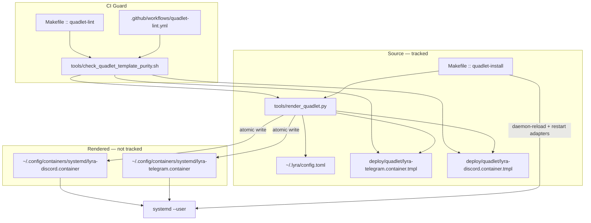
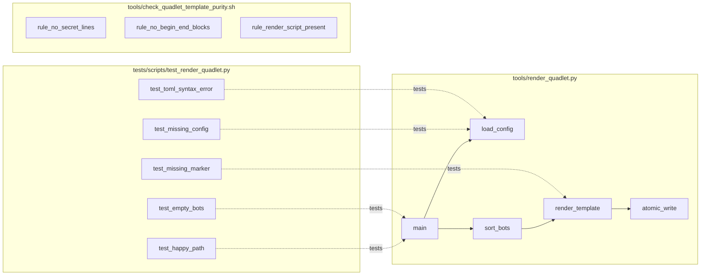

## Summary

Eliminate the splice-wipe cascade by renaming tracked Quadlet `.container` files to `.container.tmpl`, rendering them at `make quadlet-install` time from `~/.lyra/config.toml`'s `[[auth.{telegram,discord}_bots]]` enumeration, and gating future template corruption with a CI lint. Same render-from-template idiom as the existing `quadlet-authconf-merged` Makefile target.

## Architecture

### Data flow



### File × function map



## Bootstrap Context

Pattern references (read before implementation):
- `Makefile` L172 `quadlet-authconf-merged` — existing render-from-template idiom (rendering `~/.lyra/nkeys/auth.conf` from per-identity seeds). Mirror its structure for `quadlet-install`'s new render step.
- `Makefile` L203 `quadlet-bot-secrets-render` — current (broken) flow; reference for shell-side enumeration logic that the Python script replaces.
- `Makefile` L147 `quadlet-install` — target to extend with render step + explicit `systemctl --user restart`.
- `.github/workflows/quadlet-lint.yml` L9-11 `paths:` filter — already scopes to `deploy/quadlet/**`. Extend the inline-comment check glob (around L94-98 per devops review) to include `*.container.tmpl`.
- `~/projects/lyra/deploy/quadlet/.bot-secrets.{telegram,discord}.fragment` on M₁ — canonical Secret= lines for the M₁ deployment; used as ground truth for A1 verification.
- `~/.config/containers/systemd/lyra-{telegram,discord}.container.bak.20260526-002141` on M₁ — hotfix backup, useful for A9 sha256sum-diff baseline.

## Agents

| Agent instance | Role | Task count | Files |
|---|---|---|---|
| `tester-A` | render test suite + RED-GATE sentinels | 3 | tests/scripts/test_render_quadlet.py |
| `devops-A` | render script + Makefile integration | 3 | tools/render_quadlet.py, Makefile |
| `devops-B` | template renames + fragment deletion | 3 | deploy/quadlet/lyra-{telegram,discord}.container.tmpl, fragments |
| `devops-C` | CI guard | 2 | tools/check_quadlet_template_purity.sh, .github/workflows/quadlet-lint.yml |
| `doc-writer-A` | doc update | 1 | docs/QUADLET-DEPLOYMENT.md |

## Wave Structure

5 waves, max 3 parallel agents. Elapsed ~3 h vs ~6 h sequential.

| Wave | Trigger | Agents ∥ | Tasks |
|---|---|---|---|
| 1 | start | 2 ∥ | tester-A: T1 · devops-B: T4, T5 |
| 2 | Wave 1 done | 2 ∥ | tester-A: T2 (RED-GATE S1) · devops-C: T8 |
| 3 | Wave 2 done | 3 ∥ | devops-A: T3 · devops-C: T10 · doc-writer-A: T11 |
| 4 | Wave 3 done | 3 ∥ | devops-A: T6 · devops-A: T9 (chained T6→T9) · tester-A: T12 (RED-GATE S2) |
| 5 | Wave 4 done | 1 | devops-B: T7 |

### Budget — per task

| Task | Items | Class | Est. ops | Split? |
|---|---|---|---|---|
| T1 | write 5 test cases | judgmental | 6 | — |
| T2 | RED-GATE S1: confirm pytest fails | trivial | 1 | — |
| T3 | render script (load + sort + render + atomic write) | judgmental | 6 | — |
| T4 | rename telegram .container → .tmpl + add `{{bot_secrets}}` marker | bounded | 3 | — |
| T5 | rename discord .container → .tmpl + add `{{bot_secrets}}` marker | bounded | 3 | — |
| T6 | Makefile quadlet-install integration | judgmental | 4 | — |
| T7 | delete `.bot-secrets.*.fragment` files | trivial | 1 | — |
| T8 | CI purity shell script (3 rules) | bounded | 3 | — |
| T9 | Makefile quadlet-lint target | bounded | 2 | — |
| T10 | quadlet-lint.yml extend glob + add purity step | bounded | 3 | — |
| T11 | docs/QUADLET-DEPLOYMENT.md A7(a-d) | judgmental | 5 | — |
| T12 | RED-GATE S2: run `make quadlet-lint` against corrupted .tmpl | trivial | 1 | — |

**Total estimated ops: 38**

### Budget — per agent instance

| Instance | Tasks | Σ ops | Subjects | Split? |
|---|---|---|---|---|
| tester-A | T1, T2, T12 | 8 | render-tests, gate | — |
| devops-A | T3, T6, T9 | 12 | render-impl, makefile | — |
| devops-B | T4, T5, T7 | 7 | template, cleanup | — |
| devops-C | T8, T10 | 6 | ci-lint, workflow | — |
| doc-writer-A | T11 | 5 | doc | — |

All instances under 50-ops cap, ≤2 subjects, ≤3 tasks. No splits required.

## Consistency Report

| Spec criterion | Tasks |
|---|---|
| A1 (render produces M₁-equivalent Secret=) | T3, T4, T5, T6 |
| A2 (idempotent: sha256sum stable across runs) | T3 (sort_bots ensures determinism) |
| A3 (3rd bot onboarding without editing tracked) | T3, T6 |
| A4 (`quadlet-bot-secrets-render` gone, fragments gone) | T6 (drop target), T7 (delete fragments) |
| A5 (CI purity script: 3 rules) | T8, T9, T10, T12 |
| A6 (render unit tests: 5 cases incl. TOML error) | T1, T3, T2 (RED-GATE) |
| A7 (doc 4 subsections a-d) | T11 |
| A8 (3 deploys w/o crash-loop — post-merge user-observable) | Verified at /verify step post-merge, not coded |
| A9 (sha256sum migration safety) | Verified at deploy time, runbook in T11 doc |

Covered: 9/9 spec criteria. Untraced: 0. Exemptions: A8 + A9 are post-deploy verification, not codebase changes.

## Micro-Tasks

### Slice 1 — Render at install (S1)

#### T1 — Write render test suite (RED)
- **File:** `tests/scripts/test_render_quadlet.py` (new)
- **Agent:** tester-A · Subject: `render-tests` · Phase: RED · `[P]` parallel-safe with T4/T5 · Difficulty: 3
- **Spec trace:** A6(a-e)
- **Code skeleton:**
  ```python
  # 5 test cases: happy_path (2 bots, sort verified, byte-stable),
  # empty_bots (marker replaced empty), missing_marker (non-zero exit),
  # missing_config (non-zero exit), toml_syntax_error (non-zero exit + parser msg)
  # Tests invoke `python -m render_quadlet` or import main() with monkeypatched paths.
  ```
- **Verify:** `uv run pytest tests/scripts/test_render_quadlet.py -v`
- **Expected:** All 5 tests fail with ImportError / ModuleNotFoundError (script doesn't exist yet) — confirms RED state.
- **Time:** 8 min

#### T2 — RED-GATE S1
- **Agent:** tester-A · Subject: `gate` · Phase: RED-GATE · ¬parallel · Difficulty: 1
- **Spec trace:** RED state for S1
- **Verify:** `uv run pytest tests/scripts/test_render_quadlet.py 2>&1 | grep -E "5 failed|5 errors"`
- **Expected:** Pytest reports 5 failures/errors (no implementation yet).
- **Time:** 1 min
- **Blocks:** T3 cannot start until this passes.

#### T3 — Implement `tools/render_quadlet.py` (GREEN)
- **File:** `tools/render_quadlet.py` (new)
- **Agent:** devops-A · Subject: `render-impl` · Phase: GREEN · ¬parallel · Difficulty: 4
- **Spec trace:** A1, A2, A3, A6
- **Code skeleton:**
  ```python
  #!/usr/bin/env python3
  """Render Quadlet .container files from .tmpl + ~/.lyra/config.toml."""
  import os, sys, tomllib, tempfile
  from pathlib import Path

  MARKER = "{{bot_secrets}}"

  def load_config(path: Path) -> dict: ...        # tomllib.load, propagate TOMLDecodeError
  def sort_bots(bots: list[dict]) -> list[dict]: # sorted(bots, key=lambda b: b["bot_id"])
      return sorted(bots, key=lambda b: b["bot_id"])
  def render_template(tmpl_text: str, platform: str, bots: list[dict]) -> str:
      # build Secret= lines, replace MARKER; raise if MARKER not in tmpl_text
      ...
  def atomic_write(dest: Path, content: str) -> None:
      with tempfile.NamedTemporaryFile(
          mode="w", dir=dest.parent, prefix=f".{dest.name}.", delete=False
      ) as tmp: tmp.write(content); tmp_path = Path(tmp.name)
      os.replace(tmp_path, dest)
  def main() -> int: ...                          # CLI: --config, --tmpl, --dest; CLI args optional w/ env fallbacks
  ```
- **Verify:** `uv run pytest tests/scripts/test_render_quadlet.py -v`
- **Expected:** All 5 tests pass.
- **Time:** 12 min

#### T4 — Rename + marker telegram template
- **File:** `deploy/quadlet/lyra-telegram.container.tmpl` (renamed from `.container`)
- **Agent:** devops-B · Subject: `template` · Phase: GREEN · `[P]` parallel-safe with T1/T5 · Difficulty: 2
- **Spec trace:** A1, A5(i,ii)
- **Edit:** `git mv deploy/quadlet/lyra-telegram.container deploy/quadlet/lyra-telegram.container.tmpl`. Then replace the entire `# --- BEGIN bot secrets ---` … `# --- END bot secrets ---` block (including the demo placeholder line) with a single `{{bot_secrets}}` marker line.
- **Verify:** `grep -c "{{bot_secrets}}" deploy/quadlet/lyra-telegram.container.tmpl && grep -L "BEGIN bot secrets" deploy/quadlet/lyra-telegram.container.tmpl`
- **Expected:** First grep returns 1, second returns the filename (BEGIN block absent).
- **Time:** 3 min

#### T5 — Rename + marker discord template
- **File:** `deploy/quadlet/lyra-discord.container.tmpl` (renamed from `.container`)
- **Agent:** devops-B · Subject: `template` · Phase: GREEN · `[P]` parallel-safe with T1/T4 · Difficulty: 2
- **Spec trace:** A1, A5(i,ii)
- **Edit:** Same shape as T4.
- **Verify:** `grep -c "{{bot_secrets}}" deploy/quadlet/lyra-discord.container.tmpl && grep -L "BEGIN bot secrets" deploy/quadlet/lyra-discord.container.tmpl`
- **Expected:** First grep returns 1, second returns the filename.
- **Time:** 3 min

#### T6 — Makefile: integrate render + explicit restart into `quadlet-install`; drop `quadlet-bot-secrets-render`
- **File:** `Makefile` (modify L147 + L203 region)
- **Agent:** devops-A · Subject: `makefile` · Phase: GREEN · ¬parallel · Difficulty: 3
- **Spec trace:** A1, A3, A4
- **Edit:**
  1. In `quadlet-install` target, before the existing `install -C` copy steps, add a render step: `uv run python tools/render_quadlet.py --platform telegram` and same for discord. Render writes directly to `~/.config/containers/systemd/`, so the existing `install -C` for telegram/discord `.container` files is REMOVED (rendering replaces copying for these two units; other units like `lyra-nats.container`, `lyra-hub.container`, etc. continue to be `install -C`-copied as today).
  2. After `systemctl --user daemon-reload`, add `systemctl --user restart lyra-telegram lyra-discord` (gated by `NO_RESTART=1` env to allow CI/dry-runs to skip — match existing `NO_RESTART=1` semantics on the target).
  3. Delete the entire `quadlet-bot-secrets-render:` target block (L202-228) and its `.PHONY:` line.
- **Verify:** `make help 2>&1 | grep -c quadlet-bot-secrets-render` returns 0; `make -n quadlet-install` shows `render_quadlet.py` and `systemctl --user restart` invocations.
- **Expected:** 0 + dry-run output contains render + restart lines.
- **Time:** 10 min

#### T7 — Delete fragment files
- **Files removed:** `deploy/quadlet/.bot-secrets.telegram.fragment`, `deploy/quadlet/.bot-secrets.discord.fragment`
- **Agent:** devops-B · Subject: `cleanup` · Phase: GREEN · `[P]` parallel-safe with W5 (lone task) · Difficulty: 1
- **Spec trace:** A4
- **Edit:** `git rm deploy/quadlet/.bot-secrets.telegram.fragment deploy/quadlet/.bot-secrets.discord.fragment`
- **Verify:** `ls deploy/quadlet/.bot-secrets.*.fragment 2>&1 | grep -c "No such"`
- **Expected:** ≥1 (files absent).
- **Time:** 1 min

### Slice 2 — CI guard + doc (S2)

#### T8 — Write `tools/check_quadlet_template_purity.sh`
- **File:** `tools/check_quadlet_template_purity.sh` (new, executable)
- **Agent:** devops-C · Subject: `ci-lint` · Phase: GREEN · `[P]` parallel-safe with T10 · Difficulty: 2
- **Spec trace:** A5(i,ii,iii)
- **Code skeleton:**
  ```bash
  #!/usr/bin/env bash
  set -euo pipefail
  fail=0
  if grep -rE "Secret=lyra-bot-" deploy/quadlet/*.container.tmpl 2>/dev/null; then
    echo "FAIL: 'Secret=lyra-bot-' found in tracked .tmpl — must be rendered at install time"; fail=1; fi
  if grep -rE "^# --- BEGIN .* ---" deploy/quadlet/*.container.tmpl 2>/dev/null; then
    echo "FAIL: BEGIN/END splice block found in tracked .tmpl — operator-local splicing pattern forbidden"; fail=1; fi
  if [ ! -f tools/render_quadlet.py ]; then
    echo "FAIL: tools/render_quadlet.py missing — render script is required"; fail=1; fi
  exit $fail
  ```
- **Verify:** `bash tools/check_quadlet_template_purity.sh; echo "exit=$?"`
- **Expected:** `exit=0` on clean tree.
- **Time:** 5 min

#### T9 — Makefile: add `quadlet-lint` target
- **File:** `Makefile` (modify)
- **Agent:** devops-A · Subject: `makefile` · Phase: GREEN · ¬parallel with T6 (same file, T6 → T9 chained on devops-A) · Difficulty: 1
- **Spec trace:** A5
- **Edit:** Add target near `quadlet-install`:
  ```makefile
  .PHONY: quadlet-lint
  quadlet-lint:  ## verify deploy/quadlet/*.container.tmpl + render script invariants
  	@bash tools/check_quadlet_template_purity.sh
  ```
- **Verify:** `make quadlet-lint; echo $?`
- **Expected:** `0`.
- **Time:** 2 min

#### T10 — `.github/workflows/quadlet-lint.yml`: extend glob + add purity step
- **File:** `.github/workflows/quadlet-lint.yml` (modify)
- **Agent:** devops-C · Subject: `workflow` · Phase: GREEN · `[P]` parallel-safe with T9 · Difficulty: 2
- **Spec trace:** A5
- **Edit:**
  1. Find the inline-comment / glob check (around L94-98 per devops review) and extend it to include `*.container.tmpl` alongside `*.container`, `*.volume`, `*.network`.
  2. Add a new step after the dryrun step: `- name: Template purity / run: bash tools/check_quadlet_template_purity.sh`.
- **Verify:** `grep -c "container.tmpl" .github/workflows/quadlet-lint.yml && grep -c "check_quadlet_template_purity" .github/workflows/quadlet-lint.yml`
- **Expected:** ≥1 + ≥1.
- **Time:** 4 min

#### T11 — Doc: `docs/QUADLET-DEPLOYMENT.md` Bot credentials section (A7 a-d)
- **File:** `docs/QUADLET-DEPLOYMENT.md` (modify)
- **Agent:** doc-writer-A · Subject: `doc` · Phase: GREEN · `[P]` parallel-safe with T9/T10 · Difficulty: 3
- **Spec trace:** A7(a,b,c,d)
- **Edit:** Replace the existing "Bot credentials" section with 4 subsections:
  - **(a) No manual splicing** — tracked templates are pure; render at install time.
  - **(b) Bot onboarding** — `lyra bot secret install <platform> <bot_id>` → edit `~/.lyra/config.toml` `[[auth.<platform>_bots]]` → `make quadlet-install` → adapters auto-restart.
  - **(c) CI guard** — reference `tools/check_quadlet_template_purity.sh` + `make quadlet-lint` + the GitHub Actions job.
  - **(d) Multi-host caveat** — Syncthing-synced `config.toml` enumerates all bots on all hosts; each host must have matching Podman secrets installed before the adapter unit is enabled, or `systemctl restart` fails with `secret not found`.
- **Verify:** `grep -cE "^### " docs/QUADLET-DEPLOYMENT.md | head -1` (or specific header greps for the 4 subsection titles).
- **Expected:** 4 new subsection headers present.
- **Time:** 8 min

#### T12 — RED-GATE S2: corrupt-tmpl rejection
- **Agent:** tester-A · Subject: `gate` · Phase: RED-GATE · ¬parallel · Difficulty: 2
- **Spec trace:** A5 verification
- **Verify:** Inject a deliberate corruption locally (in a stash or test branch): add `Secret=lyra-bot-TEST` line to `deploy/quadlet/lyra-telegram.container.tmpl`. Run `make quadlet-lint; echo "exit=$?"`. Then `git checkout` the tmpl to restore. Repeat for `# --- BEGIN bot secrets ---`.
- **Expected:** Both corruption tests exit non-zero with the specific FAIL message; clean run exits 0.
- **Time:** 4 min

## Task Seeding Blueprint

<!-- Used by /implement to seed TaskCreate calls on session start.
     Format: T{n} | agent-instance | blockedBy | subject
     blockedBy refs T-numbers within this list (not session task IDs).
     Seed in wave order; within a wave all rows are parallel (∥). -->

### Wave 1 — no deps, 2 agents ∥

| Task | Agent instance | blockedBy | Subject |
|---|---|---|---|
| T1 | tester-A | — | render-tests |
| T4 | devops-B | — | template |
| T5 | devops-B | — | template |

### Wave 2 — after Wave 1, 2 agents ∥

| Task | Agent instance | blockedBy | Subject |
|---|---|---|---|
| T2 | tester-A | T1 | gate |
| T8 | devops-C | T4, T5 | ci-lint |

### Wave 3 — after Wave 2, 3 agents ∥

| Task | Agent instance | blockedBy | Subject |
|---|---|---|---|
| T3 | devops-A | T2 | render-impl |
| T10 | devops-C | T8 | workflow |
| T11 | doc-writer-A | T2 | doc |

### Wave 4 — after Wave 3, 2 agents ∥ (T6→T9 chained on devops-A)

| Task | Agent instance | blockedBy | Subject |
|---|---|---|---|
| T6 | devops-A | T3, T4, T5 | makefile |
| T9 | devops-A | T6, T8 | makefile |
| T12 | tester-A | T8, T9 | gate |

### Wave 5 — after Wave 4, 1 agent

| Task | Agent instance | blockedBy | Subject |
|---|---|---|---|
| T7 | devops-B | T6 | cleanup |

## Task IDs

<!-- Generated by /plan. Used by /implement to resume tasks on session restart. -->
- T1: 13 — render-tests (tester-A)
- T2: 14 — gate / RED-GATE S1 (tester-A)
- T3: 15 — render-impl (devops-A)
- T4: 16 — template telegram (devops-B)
- T5: 17 — template discord (devops-B)
- T6: 18 — makefile quadlet-install (devops-A)
- T7: 19 — cleanup fragments (devops-B)
- T8: 20 — ci-lint purity script (devops-C)
- T9: 21 — makefile quadlet-lint (devops-A)
- T10: 22 — workflow yml (devops-C)
- T11: 23 — doc (doc-writer-A)
- T12: 24 — gate / RED-GATE S2 (tester-A)
