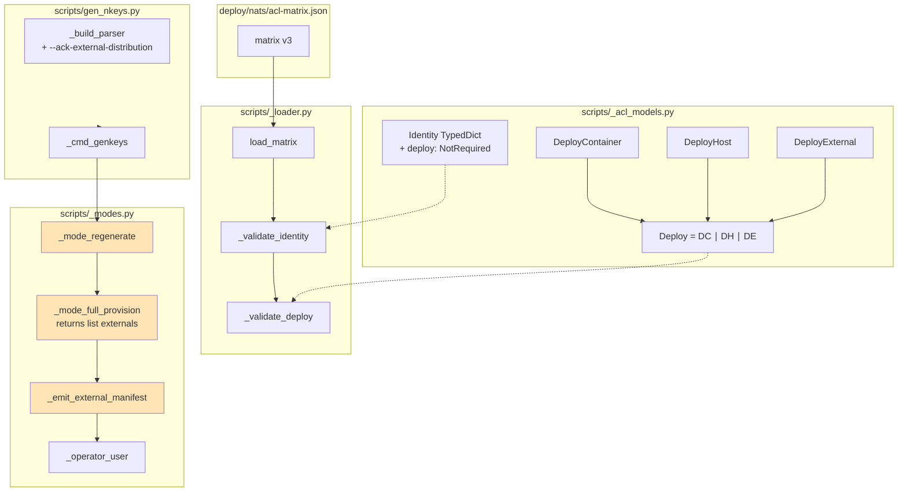
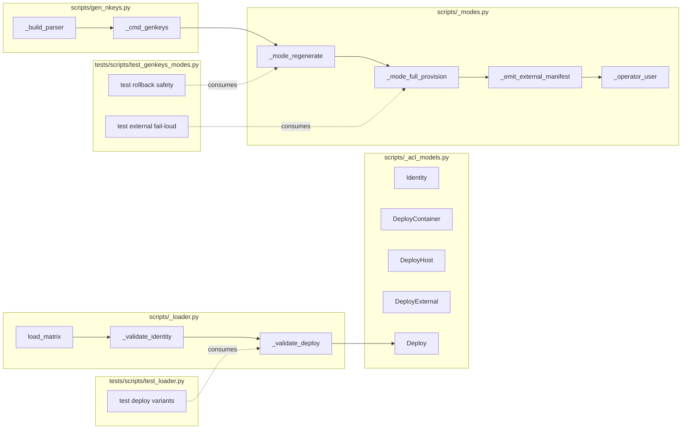

## Summary

Add a `deploy` field to the `acl-matrix.json` schema with 3 typed variants (container/host/external), then make `factory-acl genkeys --regenerate` exit 2 + emit a copyable scp manifest when external identities exist and `--ack-external-distribution` is not given. Bump matrix version v2 → v3 with tighter validation.

## Architecture

### Data flow



### File × Function map



## Agents

| Agent | Instance | Tasks | Files |
|---|---|---|---|
| tester | tester-A | T1, T5, T6, T11, T16 | tests/scripts/test_loader.py, tests/scripts/test_genkeys_modes.py |
| backend-dev | backend-dev-A | T2, T3, T13 | scripts/_acl_models.py, scripts/_loader.py |
| backend-dev | backend-dev-B | T7, T8, T9, T10 | scripts/_modes.py, scripts/gen_nkeys.py |
| devops | devops-A | T4, T12, T15 | deploy/nats/acl-matrix.json, scripts/_loader.py (version set), commit message |
| doc-writer | doc-writer-A | T14 | docs/ops/nats-authconf-update.md |

**Subject-surface audit:**
- tester-A: subjects={testing} → 1 distinct → OK
- backend-dev-A: subjects={schema, validation} → 2 → OK
- backend-dev-B: subjects={control-flow, cli} → 2 → OK
- devops-A: subjects={matrix-data, version-bump, audit-doc} → 3 → **borderline**, but each task is trivial/bounded (mechanical edit) → keep on one instance with annotation
- doc-writer-A: subjects={runbook} → 1 → OK

## Bootstrap Context

¬analysis artifact (F-lite skipped). Bootstrap reads:
- `artifacts/specs/1379-gen-nkeys-fail-loud-external-seeds-spec.mdx` — authoritative
- `artifacts/frames/1379-gen-nkeys-fail-loud-external-seeds-frame.mdx` — premise + scope
- `scripts/_acl_models.py`, `scripts/_loader.py`, `scripts/_modes.py`, `scripts/gen_nkeys.py` — current state
- `tests/scripts/test_loader.py`, `tests/scripts/test_genkeys_modes.py` — test conventions
- `deploy/nats/acl-matrix.json` — full identity table
- `docs/ops/nats-authconf-update.md` — runbook structure
- `deploy/quadlet/lyra-*.container` — confirm container `secret` names (for D5 backfill)

## Wave Structure

7 waves, max 4 parallel agents. Elapsed ~1.5 days (estimate) vs ~3 days sequential.

| Wave | Trigger | Agents | Tasks |
|---|---|---|---|
| 1 | start | 4 ∥ | tester-A: T1 · backend-dev-B: T10 · devops-A: T4 · doc-writer-A: T14 |
| 2 | Wave 1 done | 2 ∥ | tester-A: T6 · backend-dev-A: T2 (after T1) |
| 3 | T2 done, T6 done | 2 ∥ | backend-dev-A: T3 (after T2) · backend-dev-B: T7 (after T6) |
| 4 | T3 done, T7 done | 1 | backend-dev-B: T8 → T9 (chained, after T7) |
| 5 | T3,T4,T9,T10 done | 1 | tester-A: T5, T11 (verify gates) |
| 6 | T5, T11 done | 2 ∥ | devops-A: T12 → T15 · backend-dev-A: T13 (after T12) |
| 7 | T13 done | 1 | tester-A: T16 (final RED-GATE) |

### Budget — per task

| Task | Items | Class | Est. ops | Split? |
|---|---|---|---|---|
| T1 (test_loader deploy cases) | 5 cases | bounded | 5 | — |
| T2 (Deploy variants + Identity update) | 5 type defs | bounded | 3 | — |
| T3 (`_validate_deploy` + hook) | 1 func + 1 call | bounded | 3 | — |
| T4 (backfill acl-matrix, classify 11 identities) | 11 idents | judgmental | 12 | — |
| T5 (RED-GATE V1) | 1 pytest run | trivial | 2 | — |
| T6 (test_genkeys_modes cases) | 5 cases | bounded | 6 | — |
| T7 (refactor `_mode_full_provision` return) | 1 func | judgmental | 5 | — |
| T8 (helpers `_emit_external_manifest`, `_operator_user`) | 2 funcs | bounded | 4 | — |
| T9 (wire externals→exit-2 in caller) | 2 call-sites | judgmental | 5 | — |
| T10 (`--ack-external-distribution` flag) | 1 argparse add | trivial | 2 | — |
| T11 (RED-GATE V2) | 1 pytest run | trivial | 2 | — |
| T12 (bump v3 + `_VALID_VERSIONS`) | 2 edits | trivial | 2 | — |
| T13 (v3 enforcement in `_validate_identity`) | 1 conditional | bounded | 3 | — |
| T14 (docs ops section) | 1 insert | judgmental | 4 | — |
| T15 (audit call-sites doc note) | 1 commit message | trivial | 1 | — |
| T16 (final RED-GATE) | full suite | trivial | 2 | — |

**Total estimated ops: 61** (well within budget, distributed)

### Budget — per agent instance

| Instance | Tasks | Σ ops | Subjects | Split? |
|---|---|---|---|---|
| tester-A | T1, T5, T6, T11, T16 | 17 | testing | — |
| backend-dev-A | T2, T3, T13 | 9 | schema, validation | — |
| backend-dev-B | T7, T8, T9, T10 | 16 | control-flow, cli | — |
| devops-A | T4, T12, T15 | 15 | matrix-data, version-bump, audit-doc | — (mechanical work) |
| doc-writer-A | T14 | 4 | runbook | — |

All within `Σ ops ≤ 50` and `|tasks| ≤ 4` (tester-A=5 is OK with all bounded/trivial).

## Consistency Report

- **Covered:** 17/17 success criteria mapped to tasks
- **Uncovered:** 0
- **Untraced tasks:** 0
- **Exemptions:** none

## Micro-Tasks

### Slice V1 — Schema + validation (¬behavior change)

#### T1 [RED] [P] tester-A — Write test_loader cases for `deploy`
- **File:** `tests/scripts/test_loader.py`
- **Snippet:**
  ```python
  def test_load_matrix_v2_without_deploy_ok(tmp_path): ...
  def test_load_matrix_v2_with_deploy_ok(tmp_path): ...
  def test_load_matrix_v3_active_missing_deploy_dies(tmp_path, capsys): ...
  def test_load_matrix_external_missing_target_path_dies(tmp_path, capsys): ...
  def test_load_matrix_container_missing_secret_dies(tmp_path, capsys): ...
  ```
- **Verify:** `uv run pytest tests/scripts/test_loader.py -k deploy -v`
- **Expected:** 5 tests fail (RED — symbols don't exist yet)
- **Estimate:** 5 min
- **Subject:** testing | **Spec trace:** SC-12, SC-13 | **Slice:** V1 | **Phase:** RED | **Difficulty:** 2

#### T2 [GREEN] backend-dev-A — Add Deploy variants + Identity update
- **File:** `scripts/_acl_models.py`
- **Snippet:**
  ```python
  from typing import Literal
  class DeployContainer(TypedDict):
      type: Literal["container"]
      secret: str
  class DeployHost(TypedDict):
      type: Literal["host"]
      path: str
  class DeployExternal(TypedDict):
      type: Literal["external"]
      host: str
      target_path: str
  Deploy = DeployContainer | DeployHost | DeployExternal
  class Identity(TypedDict):
      ...
      deploy: NotRequired[Deploy]
  ```
- **Verify:** `uv run pyright scripts/_acl_models.py`
- **Expected:** No type errors
- **Estimate:** 5 min
- **Subject:** schema | **Spec trace:** SC-3 | **Slice:** V1 | **Phase:** GREEN | **Difficulty:** 2 | **blockedBy:** T1

#### T3 [GREEN] backend-dev-A — Add `_validate_deploy` + hook into `_validate_identity`
- **File:** `scripts/_loader.py`
- **Snippet:**
  ```python
  def _validate_deploy(name: str, data: dict) -> None:
      dtype = data.get("type")
      if dtype == "container":
          if "secret" not in data:
              _die(f"identity '{name}': deploy.container missing 'secret'")
      elif dtype == "host":
          if "path" not in data:
              _die(f"identity '{name}': deploy.host missing 'path'")
      elif dtype == "external":
          if "host" not in data or "target_path" not in data:
              _die(f"identity '{name}': deploy.external missing 'host' or 'target_path'")
      else:
          _die(f"identity '{name}': deploy.type invalid: {dtype}")

  # In _validate_identity, after existing checks:
  if "deploy" in data:
      _validate_deploy(name, data["deploy"])
  ```
- **Verify:** `uv run pytest tests/scripts/test_loader.py -k deploy -v`
- **Expected:** 4 of 5 tests pass (v3-enforcement test T13-dependent still RED)
- **Estimate:** 8 min
- **Subject:** validation | **Spec trace:** SC-4 | **Slice:** V1 | **Phase:** GREEN | **Difficulty:** 3 | **blockedBy:** T2

#### T4 [GREEN] [P] devops-A — Backfill `deploy` field in acl-matrix
- **File:** `deploy/nats/acl-matrix.json` (matrix stays at `version: "2"` until Slice V3)
- **Action:** For each active identity, classify per spec D5 and add `deploy` field:
  - Cross-check `secret` name against `deploy/quadlet/lyra-*.container` for container variants
  - Cross-check voicecli/llmcli/imagecli quadlets in their respective repos for host/external variants
  - Resolve any ambiguous identity (e.g. `monitor`) by reading its consumer code OR demoting to `status=retired`
- **Snippet (example for hub):**
  ```json
  "hub": {
    "status": "active",
    ...,
    "deploy": { "type": "container", "secret": "lyra-nats-hub" }
  }
  ```
- **Verify:** `uv run python -c "from pathlib import Path; from scripts._loader import load_matrix; load_matrix(Path('deploy/nats/acl-matrix.json'))"`
- **Expected:** No errors; matrix loads cleanly
- **Document:** Final mapping in T15 commit message
- **Estimate:** 25 min (audit + classify + write)
- **Subject:** matrix-data | **Spec trace:** SC-1, SC-2 | **Slice:** V1 | **Phase:** GREEN | **Difficulty:** 3 | **Parallel:** Y

#### T5 [RED-GATE] tester-A — Verify V1 complete
- **Verify:** `uv run pytest tests/scripts/test_loader.py -v && uv run python -c "from pathlib import Path; from scripts._loader import load_matrix; m = load_matrix(Path('deploy/nats/acl-matrix.json')); print(sum(1 for i in m['identities'].values() if 'deploy' in i), 'identities have deploy')"`
- **Expected:** All test_loader cases pass; matrix loads; count matches active identities
- **Estimate:** 3 min
- **Subject:** testing | **Spec trace:** SC-1..4 | **Slice:** V1 | **Phase:** RED-GATE | **Difficulty:** 1 | **blockedBy:** T2, T3, T4

### Slice V2 — Fail-loud logic + CLI flag

#### T6 [RED] [P] tester-A — Write test_genkeys_modes cases for external fail-loud
- **File:** `tests/scripts/test_genkeys_modes.py`
- **Snippet:**
  ```python
  def test_full_provision_no_externals_exits_0(tmp_env): ...
  def test_full_provision_externals_no_ack_exits_2(tmp_env, capsys): ...
  def test_full_provision_externals_with_ack_exits_0(tmp_env, capsys): ...
  def test_external_manifest_uses_sudo_user(tmp_env, monkeypatch, capsys): ...
  def test_regenerate_rollback_not_triggered_on_exit_2(tmp_env): ...  # critical
  ```
- **Verify:** `uv run pytest tests/scripts/test_genkeys_modes.py -k "external or rollback" -v`
- **Expected:** 5 tests fail (RED)
- **Estimate:** 12 min
- **Subject:** testing | **Spec trace:** SC-9..14 | **Slice:** V2 | **Phase:** RED | **Difficulty:** 3

#### T7 [GREEN] backend-dev-B — Refactor `_mode_full_provision` to return externals
- **File:** `scripts/_modes.py` (function at line 394)
- **Snippet:**
  ```python
  def _mode_full_provision(args: argparse.Namespace) -> list[tuple[str, "DeployExternal"]]:
      """Default mode: generate all nkeys + dual-write auth.conf (root required).
      Returns list of (name, deploy) for external identities found in active set.
      Caller is responsible for fan-out manifest + exit code.
      """
      ...
      externals: list[tuple[str, DeployExternal]] = []
      for name, identity in active.items():
          deploy = identity.get("deploy")
          if deploy and deploy.get("type") == "external":
              externals.append((name, deploy))
      return externals
  ```
- **Verify:** `uv run pyright scripts/_modes.py && uv run ruff check scripts/_modes.py`
- **Expected:** No errors
- **Estimate:** 8 min
- **Subject:** control-flow | **Spec trace:** SC-7 | **Slice:** V2 | **Phase:** GREEN | **Difficulty:** 3 | **blockedBy:** T6

#### T8 [GREEN] backend-dev-B — Add `_emit_external_manifest` + `_operator_user` helpers
- **File:** `scripts/_modes.py`
- **Snippet:**
  ```python
  import getpass

  def _operator_user() -> str:
      """Return invoking operator login (preserves SUDO_USER under sudo)."""
      return os.environ.get("SUDO_USER") or getpass.getuser()

  def _emit_external_manifest(
      externals: list[tuple[str, "DeployExternal"]],
      seeds_dir: Path,
  ) -> None:
      """Print scp commands to stderr — one per external identity."""
      print("⚠ External seeds require manual fan-out (seeds + auth.conf already committed):", file=sys.stderr)
      user = _operator_user()
      for name, deploy in externals:
          src = seeds_dir / f"{name}.seed"
          print(f"  scp {src} {user}@{deploy['host']}:{deploy['target_path']}", file=sys.stderr)
  ```
- **Verify:** `uv run pyright scripts/_modes.py`
- **Expected:** No errors
- **Estimate:** 6 min
- **Subject:** control-flow | **Spec trace:** SC-11 | **Slice:** V2 | **Phase:** GREEN | **Difficulty:** 2 | **blockedBy:** T7

#### T9 [GREEN] backend-dev-B — Wire externals→manifest→exit-2 in caller
- **File:** `scripts/_modes.py` (`_mode_regenerate`) AND `scripts/gen_nkeys.py` (`_cmd_genkeys` default path)
- **Snippet (in `_mode_regenerate` after `_mode_full_provision(args)` returns):**
  ```python
  externals = _mode_full_provision(args)
  # NOTE: must run OUTSIDE the try/except BaseException block in _mode_regenerate,
  #       otherwise SystemExit(2) triggers the seed rollback.
  if externals:
      _emit_external_manifest(externals, _seeds_dir())
      if not getattr(args, "ack_external_distribution", False):
          sys.exit(2)
  ```
- **Also:** apply identical guard in `_cmd_genkeys` default branch (`gen_nkeys.py:81`) so non-regenerate full-provision flow has same semantics.
- **Verify:** `uv run pytest tests/scripts/test_genkeys_modes.py -k "external or rollback" -v`
- **Expected:** All 5 external/rollback tests pass
- **Estimate:** 10 min
- **Subject:** control-flow | **Spec trace:** SC-8, SC-9, SC-10 | **Slice:** V2 | **Phase:** GREEN | **Difficulty:** 4 | **blockedBy:** T7, T8

#### T10 [GREEN] [P] backend-dev-B — Add `--ack-external-distribution` flag
- **File:** `scripts/gen_nkeys.py` (function `_build_parser`, on `gk` subparser around line 230)
- **Snippet:**
  ```python
  gk.add_argument(
      "--ack-external-distribution",
      action="store_true",
      help="Acknowledge external seeds will be manually fan-outed post-regen. "
           "Without this flag, genkeys exits 2 when external identities are present.",
  )
  ```
- **Verify:** `uv run python -m scripts.gen_nkeys genkeys --help | grep -F "ack-external-distribution"`
- **Expected:** Flag listed in help output
- **Estimate:** 3 min
- **Subject:** cli | **Spec trace:** SC-6 | **Slice:** V2 | **Phase:** GREEN | **Difficulty:** 1 | **Parallel:** Y

#### T11 [RED-GATE] tester-A — Verify V2 complete
- **Verify:** `uv run pytest tests/scripts/test_genkeys_modes.py -v`
- **Expected:** All tests in test_genkeys_modes.py pass (including pre-existing)
- **Estimate:** 2 min
- **Subject:** testing | **Spec trace:** SC-6..14 | **Slice:** V2 | **Phase:** RED-GATE | **Difficulty:** 1 | **blockedBy:** T7, T8, T9, T10

### Slice V3 — Migration v2 → v3 + docs

#### T12 [GREEN] devops-A — Bump matrix to v3 + extend `_VALID_VERSIONS`
- **Files:**
  - `deploy/nats/acl-matrix.json` — change `"version": "2"` → `"version": "3"`
  - `scripts/_loader.py` — change `_VALID_VERSIONS = {"1", "2"}` → `{"1", "2", "3"}`
- **Verify:** `uv run python -c "from pathlib import Path; from scripts._loader import load_matrix; load_matrix(Path('deploy/nats/acl-matrix.json'))"`
- **Expected:** Matrix loads cleanly at v3
- **Estimate:** 2 min
- **Subject:** version-bump | **Spec trace:** SC-15 | **Slice:** V3 | **Phase:** GREEN | **Difficulty:** 1 | **blockedBy:** T5, T11

#### T13 [GREEN] backend-dev-A — Add v3-conditional enforcement in `_validate_identity`
- **File:** `scripts/_loader.py`
- **Snippet (inside `load_matrix` after version check, pass version to `_validate_identity`):**
  ```python
  # In _validate_identity (signature change to accept version):
  def _validate_identity(name: str, data: dict, version: str) -> Identity:
      ...
      if "deploy" in data:
          _validate_deploy(name, data["deploy"])
      elif version == "3" and data.get("status") == "active":
          _die(f"identity '{name}': v3 requires 'deploy' for active identities")
      return data
  ```
- **Verify:** `uv run pytest tests/scripts/test_loader.py -k v3 -v`
- **Expected:** v3-enforcement test (case c from T1) now passes
- **Estimate:** 6 min
- **Subject:** validation | **Spec trace:** SC-5 | **Slice:** V3 | **Phase:** GREEN | **Difficulty:** 2 | **blockedBy:** T12

#### T14 [GREEN] [P] doc-writer-A — Write "External seed distribution" section
- **File:** `docs/ops/nats-authconf-update.md`
- **Action:** Insert new H2 section "**External seed distribution**" AFTER `## Step 5 — Verify` and BEFORE `## Rollback`. Contents:
  - When it runs (post-regen, before `--ack-external-distribution`)
  - Current external identities list (read from `acl-matrix.json` at write time)
  - scp template `scp <src> $USER@<host>:<target_path>` (placeholder syntax)
  - "What if I forget" referencing the 2026-05-25/26 post-mortem
  - Cross-ref to `factory-acl genkeys --ack-external-distribution` flag
- **Verify:** `grep -c "External seed distribution" docs/ops/nats-authconf-update.md`
- **Expected:** Output `1` (section header present)
- **Estimate:** 12 min
- **Subject:** runbook | **Spec trace:** SC-14 | **Slice:** V3 | **Phase:** GREEN | **Difficulty:** 2 | **Parallel:** Y

#### T15 [GREEN] [P] devops-A — Document call-sites audit in commit message
- **Action:** When committing Slice V3, include in commit message body:
  ```
  Audit of `--regenerate` call-sites (no source changes):

  | Location | Flag used | Risk under exit-2 |
  |---|---|---|
  | deploy/nats/setup.sh:140 | (none — no --regenerate) | none |
  | Makefile:257,299 | --regen-authconf | none |
  | scripts/check-acl-authconf-drift.sh:53 | --template-only | none |
  | tests/nats/test_gen_nkeys_acls.sh:30 | --template-only | none |

  Zero call-sites in this repo invoke --regenerate. Exit-2 is safe.
  ```
- **Verify:** `git log -1 --format=%B | grep -F "Zero call-sites in this repo invoke --regenerate"`
- **Expected:** Audit text present in commit
- **Estimate:** 3 min
- **Subject:** audit-doc | **Spec trace:** SC-17 | **Slice:** V3 | **Phase:** GREEN | **Difficulty:** 1 | **Parallel:** Y

#### T16 [RED-GATE] tester-A — Final verification gate
- **Verify:**
  ```bash
  uv run pytest tests/scripts/ -v
  uv run factory-acl check retired
  uv run factory-acl check flows
  uv run python -c "from pathlib import Path; from scripts._loader import load_matrix; m = load_matrix(Path('deploy/nats/acl-matrix.json')); assert m['version'] == '3'; print('v3 OK')"
  ```
- **Expected:** All commands succeed; v3 matrix passes all consistency checks
- **Estimate:** 3 min
- **Subject:** testing | **Spec trace:** all | **Slice:** V3 | **Phase:** RED-GATE | **Difficulty:** 1 | **blockedBy:** T13

## Task Seeding Blueprint

<!-- Used by /implement to seed TaskCreate calls on session start.
     Format: T{n} | agent-instance | blockedBy | subject
     blockedBy refs T-numbers within this list (not session task IDs). -->

### Wave 1 — no deps, 4 agents ∥

| Task | Agent instance | blockedBy | Subject |
|---|---|---|---|
| T1 | tester-A | — | testing |
| T10 | backend-dev-B | — | cli |
| T4 | devops-A | — | matrix-data |
| T14 | doc-writer-A | — | runbook |

### Wave 2 — after T1, 2 agents ∥

| Task | Agent instance | blockedBy | Subject |
|---|---|---|---|
| T2 | backend-dev-A | T1 | schema |
| T6 | tester-A | — | testing |

### Wave 3 — after T2 (and T6), 2 agents ∥

| Task | Agent instance | blockedBy | Subject |
|---|---|---|---|
| T3 | backend-dev-A | T2 | validation |
| T7 | backend-dev-B | T6 | control-flow |

### Wave 4 — after T7, sequential chain on backend-dev-B

| Task | Agent instance | blockedBy | Subject |
|---|---|---|---|
| T8 | backend-dev-B | T7 | control-flow |
| T9 | backend-dev-B | T7, T8 | control-flow |

### Wave 5 — verification gates after V1/V2 work done

| Task | Agent instance | blockedBy | Subject |
|---|---|---|---|
| T5 | tester-A | T2, T3, T4 | testing |
| T11 | tester-A | T7, T8, T9, T10 | testing |

### Wave 6 — V3 migration, after both gates pass

| Task | Agent instance | blockedBy | Subject |
|---|---|---|---|
| T12 | devops-A | T5, T11 | version-bump |
| T13 | backend-dev-A | T12 | validation |
| T15 | devops-A | T12 | audit-doc |

### Wave 7 — final gate

| Task | Agent instance | blockedBy | Subject |
|---|---|---|---|
| T16 | tester-A | T13 | testing |

## Task IDs

<!-- Generated by /plan. Used by /implement to resume tasks on session restart. -->
- T1: 13 — testing (test_loader deploy cases)
- T2: 14 — schema (Deploy variants + Identity update)
- T3: 15 — validation (_validate_deploy + hook)
- T4: 16 — matrix-data (backfill acl-matrix)
- T5: 17 — testing (RED-GATE V1)
- T6: 18 — testing (test_genkeys_modes external cases)
- T7: 19 — control-flow (refactor _mode_full_provision return)
- T8: 20 — control-flow (helpers _emit_external_manifest + _operator_user)
- T9: 21 — control-flow (wire externals→exit-2 at caller)
- T10: 22 — cli (--ack-external-distribution flag)
- T11: 23 — testing (RED-GATE V2)
- T12: 24 — version-bump (bump matrix v3)
- T13: 25 — validation (v3 enforcement)
- T14: 26 — runbook (docs section)
- T15: 27 — audit-doc (call-sites audit in commit msg)
- T16: 28 — testing (final RED-GATE)
