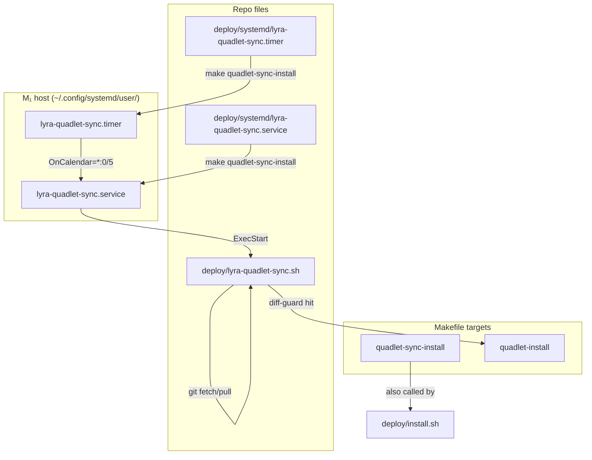
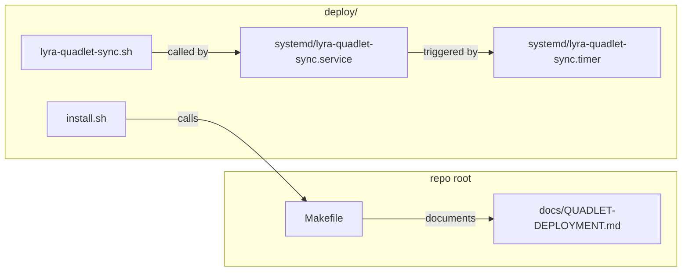

## Summary

Add a systemd timer+service pair (`lyra-quadlet-sync`) that pulls `origin/staging` every 5 min and conditionally runs `make quadlet-install` when the diff touches Quadlet-relevant files. Include a `make quadlet-sync-install` target, update `deploy/install.sh` for first-time setup, and document the auto vs manual paths.

## Architecture





## Bootstrap Context

- `deploy/quadlet/` holds Quadlet units (`.container`, `.network`, `.volume`, `.pod`).
- `make quadlet-install` copies these to `~/.config/containers/systemd/` + renders `.tmpl` files + daemon-reload + restarts services.
- `deploy/install.sh` is idempotent first-time setup (secrets, env, dirs, unit copy). It does NOT restart services.
- `deploy/quadlet-install-verify.sh` is called by `make quadlet-install` to verify all units reach `active`.
- Existing systemd user units are all Quadlet-generated (live in `~/.config/containers/systemd/`). The new sync units are native systemd units (live in `~/.config/systemd/user/`).
- `%h` in systemd units expands to the user's home directory.

## Agents

| Agent | Tasks | Files |
|---|---|---|
| devops-A | T1–T5 | `deploy/lyra-quadlet-sync.sh`, `deploy/systemd/*`, `Makefile`, `deploy/install.sh` |
| doc-writer-A | T6 | `docs/QUADLET-DEPLOYMENT.md` |

## Wave Structure

1 wave, 2 agents ∥ (devops-A + doc-writer-A). Doc task is parallel-safe because it only touches docs.

| Wave | Trigger | Agents | Tasks |
|---|---|---|---|
| 1 | start | devops-A ∥ doc-writer-A | devops-A: T1→T2→T3→T4→T5 · doc-writer-A: T6 |

### Budget — per task

| Task | Items | Class | Est. ops | Split? |
|---|---|---|---|---|
| T1: sync script | 1 | bounded | 3 | — |
| T2: service unit | 1 | bounded | 2 | — |
| T3: timer unit | 1 | bounded | 2 | — |
| T4: Makefile target | 1 | bounded | 3 | — |
| T5: install.sh hook | 1 | bounded | 2 | — |
| T6: docs update | 1 | bounded | 2 | — |

**Total estimated ops: 14**

### Budget — per agent instance

| Instance | Tasks | Σ ops | Subjects | Split? |
|---|---|---|---|---|
| devops-A | T1–T5 | 12 | deploy, systemd, make | — |
| doc-writer-A | T6 | 2 | docs | — |

## Consistency Report

| Spec section | Covered by | Status |
|---|---|---|
| SC-1: timer + service exist as tracked files | T2, T3 | covered |
| SC-2: sync script implements git-loop + diff-guard | T1 | covered |
| SC-3: timer fires at 5-min interval | T3 | covered |
| SC-4: service no-ops when HEAD = origin/staging | T1 | covered |
| SC-5: service runs make quadlet-install only on relevant diffs | T1 | covered |
| SC-6: failure surfaces in journalctl | T2 | covered |
| SC-7: make quadlet-sync-install target exists | T4 | covered |
| SC-8: docs document both paths | T6 | covered |
| SC-9: install.sh installs units on first run | T5 | covered |

- Covered: 9/9
- Uncovered: 0
- Untraced: 0
- Exemptions: 0

## Micro-Tasks

### Slice 1 — Sync script + systemd units (V1)

#### T1 — Write `deploy/lyra-quadlet-sync.sh`
**Agent:** devops-A | **Subject:** deploy | **Phase:** GREEN | **Difficulty:** 2 | **[P]** N (foundation for T2/T3)

```bash
#!/usr/bin/env bash
set -euo pipefail
cd ~/projects/lyra || exit 1

git fetch origin staging || exit 1

if [ "$(git rev-parse HEAD)" = "$(git rev-parse origin/staging)" ]; then
    echo "Already at origin/staging — nothing to do."
    exit 0
fi

PRE_SHA=$(git rev-parse HEAD)
git pull --ff-only origin staging || exit 1

if git diff --name-only "$PRE_SHA" HEAD | grep -qE '^(deploy/quadlet/|Makefile|tools/render_quadlet\.py)'; then
    echo "Quadlet-relevant files changed — running make quadlet-install ..."
    export PATH="$HOME/.local/bin:$PATH"
    make quadlet-install
else
    echo "No Quadlet-relevant changes — skipping make quadlet-install."
fi
```

**Verify:** `bash -n deploy/lyra-quadlet-sync.sh` → exit 0
**Expected:** `deploy/lyra-quadlet-sync.sh: line X: syntax error` must NOT appear

---

#### T2 — Write `deploy/systemd/lyra-quadlet-sync.service`
**Agent:** devops-A | **Subject:** systemd | **Phase:** GREEN | **Difficulty:** 1 | **[P]** N (chained T1→T2)

```ini
[Unit]
Description=Lyra Quadlet sync — pull staging and conditional install
After=network-online.target
Wants=network-online.target

[Service]
Type=oneshot
ExecStart=%h/projects/lyra/deploy/lyra-quadlet-sync.sh
WorkingDirectory=%h/projects/lyra
Environment="PATH=%h/.local/bin:/usr/local/bin:/usr/bin:/bin"
StandardOutput=journal
StandardError=journal
```

**Verify:** `systemd-analyze verify deploy/systemd/lyra-quadlet-sync.service 2>&1 | head -5` → no "Failed" lines
**Expected:** clean verification (may warn about non-absolute paths in ExecStart, but `%h` is systemd-native)

---

#### T3 — Write `deploy/systemd/lyra-quadlet-sync.timer`
**Agent:** devops-A | **Subject:** systemd | **Phase:** GREEN | **Difficulty:** 1 | **[P]** N (chained T2→T3)

```ini
[Unit]
Description=Lyra Quadlet sync timer — every 5 minutes

[Timer]
OnCalendar=*:0/5
Persistent=true

[Install]
WantedBy=timers.target
```

**Verify:** `systemd-analyze verify deploy/systemd/lyra-quadlet-sync.timer 2>&1 | head -5` → no "Failed" lines
**Expected:** clean verification

---

### Slice 2 — Install target (V2)

#### T4 — Add `quadlet-sync-install` to Makefile
**Agent:** devops-A | **Subject:** make | **Phase:** GREEN | **Difficulty:** 2 | **[P]** N (chained T3→T4)

Add target after `quadlet-install`:
```make
.PHONY: ... quadlet-sync-install ...

QUADLET_SYNC_SRC := deploy/systemd
QUADLET_SYNC_DST := $(HOME)/.config/systemd/user

quadlet-sync-install:  ## install lyra-quadlet-sync timer + service → daemon-reload + enable
	@mkdir -p "$(QUADLET_SYNC_DST)"
	@cp "$(QUADLET_SYNC_SRC)/lyra-quadlet-sync.service" "$(QUADLET_SYNC_DST)/"
	@cp "$(QUADLET_SYNC_SRC)/lyra-quadlet-sync.timer"   "$(QUADLET_SYNC_DST)/"
	@echo "Sync units copied to $(QUADLET_SYNC_DST)"
	@systemctl --user daemon-reload
	@systemctl --user enable lyra-quadlet-sync.timer
	@echo "[ok] lyra-quadlet-sync.timer enabled."
```

**Verify:** `make -n quadlet-sync-install` → shows cp + daemon-reload + enable commands
**Expected:** dry-run output includes `cp`, `daemon-reload`, `enable`

---

#### T5 — Update `deploy/install.sh` to call `make quadlet-sync-install`
**Agent:** devops-A | **Subject:** deploy | **Phase:** GREEN | **Difficulty:** 1 | **[P]** N (chained T4→T5)

Append at end of `deploy/install.sh` (after existing "Done" log):
```bash
# ── 6. Install sync timer + service (idempotent) ───────────────────────────────

log "Installing lyra-quadlet-sync timer + service ..."
run make quadlet-sync-install
```

**Verify:** `grep -n "quadlet-sync-install" deploy/install.sh` → shows the new line
**Expected:** match found at the end of the file

---

### Slice 3 — Documentation (V3)

#### T6 — Update `docs/QUADLET-DEPLOYMENT.md`
**Agent:** doc-writer-A | **Subject:** docs | **Phase:** GREEN | **Difficulty:** 1 | **[P]** Y (parallel with V1/V2)

Add section after "Re-deploy after code change" (or near the end, before Secret layout):

```markdown
## Auto-sync for Quadlet file changes

Tracked Quadlet files (`deploy/quadlet/**`, `Makefile`, `tools/render_quadlet.py`) are
auto-converged on M₁ by `lyra-quadlet-sync.timer`:

| Path | Cadence | What it does |
|---|---|---|
| **Auto** (`lyra-quadlet-sync.timer`) | Every 5 min | `git fetch` → `ff-only pull` → diff-guard → conditional `make quadlet-install` |
| **Manual** (`make quadlet-install`) | Operator-driven | Immediate — use when you need a change NOW or the timer is disabled |

### First-time enable

Run once (idempotent):
```bash
cd ~/projects/lyra
make quadlet-sync-install
```

### Checking sync status

```bash
# Last run output
journalctl --user -u lyra-quadlet-sync -n 20

# Timer next trigger
systemctl --user list-timers lyra-quadlet-sync.timer
```

### When to use manual `make quadlet-install`

- You need a Quadlet change applied **immediately** (timer max latency = 5 min).
- You are debugging a unit and want to iterate fast.
- The auto-sync service is temporarily stopped for maintenance.
- The change is a hot-fix and you cannot wait for the next timer firing.
```

**Verify:** `grep -c "lyra-quadlet-sync" docs/QUADLET-DEPLOYMENT.md` → ≥ 3
**Expected:** count ≥ 3

## Task Seeding Blueprint

### Wave 1 — no deps, 2 agents ∥

| Task | Agent instance | blockedBy | Subject |
|---|---|---|---|
| T1 | devops-A | — | deploy |
| T2 | devops-A | T1 | systemd |
| T3 | devops-A | T2 | systemd |
| T4 | devops-A | T3 | make |
| T5 | devops-A | T4 | deploy |
| T6 | doc-writer-A | — | docs |

## Task IDs

<!-- Generated by /plan. Used by /implement to resume tasks on session restart. -->
- T1: (to be seeded)
- T2: (to be seeded)
- T3: (to be seeded)
- T4: (to be seeded)
- T5: (to be seeded)
- T6: (to be seeded)
