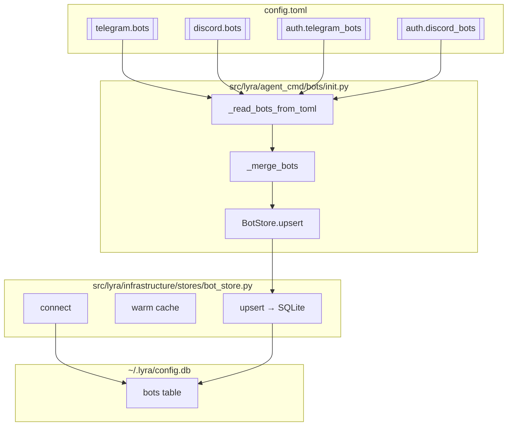
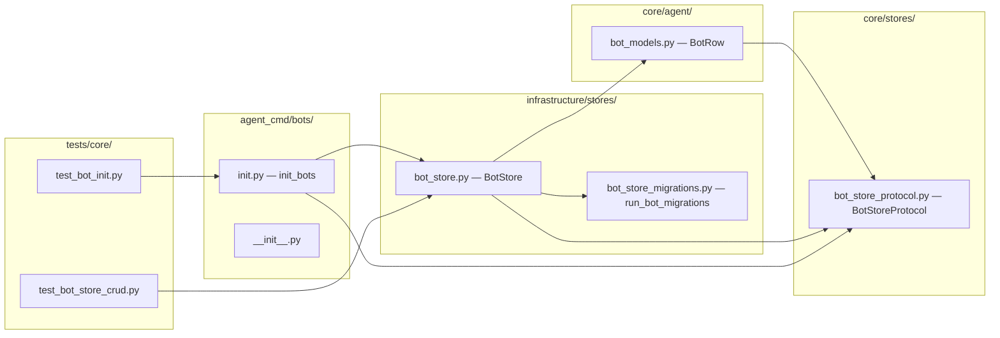

## Summary

Implement BotStore (Protocol + SQLite + migration) and `lyra bot init` CLI command in 2 waves. Wave 1 delivers store foundation and CLI wiring; Wave 2 delivers tests, import-linter config, and documentation. Mirrors AgentStore pattern (ADR-048).

## Architecture

### Data flow

### File × Function map

## Agents

| Agent | Tasks | Files | Subject |
|---|---|---|---|
| backend-dev-A | T1–T5 | store protocol, impl, migration, exports | store |
| backend-dev-B | T6–T7 | CLI init command, registration | cli |
| tester-A | T8–T9 | CRUD tests, end-to-end tests | tests |
| devops-A | T10 | import-linter config | config |
| doc-writer-A | T11 | CLAUDE.md files | docs |

## Wave Structure

2 waves, max 3 parallel agents. Elapsed ~1 session vs ~2 sequential.

| Wave | Trigger | Agents | Tasks |
|---|---|---|---|
| 1 | start | 2 ∥ | backend-dev-A: T1→T2→T3→T4→T5 · backend-dev-B: T6→T7 |
| 2 | Wave 1 done | 3 ∥ | tester-A: T8→T9 · devops-A: T10 · doc-writer-A: T11 |

### Budget — per task

| Task | Items | Class | Est. ops | Split? |
|---|---|---|---|---|
| T1 BotRow dataclass | 1 | bounded | 2 | — |
| T2 BotStoreProtocol | 1 | bounded | 2 | — |
| T3 BotStore SQLite impl | 1 | judgmental | 5 | — |
| T4 BotStore migrations | 1 | bounded | 2 | — |
| T5 Export updates | 2 | trivial | 2 | — |
| T6 lyra bot init command | 1 | judgmental | 5 | — |
| T7 cli_bot.py registration | 1 | trivial | 1 | — |
| T8 CRUD tests | 1 | bounded | 3 | — |
| T9 End-to-end tests | 1 | judgmental | 5 | — |
| T10 import-linter config | 1 | trivial | 1 | — |
| T11 CLAUDE.md files | 2 | trivial | 2 | — |

**Total estimated ops: 30**

### Budget — per agent instance

| Instance | Tasks | Σ ops | Subjects | Split? |
|---|---|---|---|---|
| backend-dev-A | T1–T5 | 13 | store | — |
| backend-dev-B | T6–T7 | 6 | cli | — |
| tester-A | T8–T9 | 8 | tests | — |
| devops-A | T10 | 1 | config | — |
| doc-writer-A | T11 | 2 | docs | — |

## Micro-Tasks

### S1 — BotStore foundation

| # | Task | File | Phase | Agent | Subject | Spec trace | Parallel |
|---|---|---|---|---|---|---|---|
| T1 | Add `BotRow` dataclass with schema fields | `src/lyra/core/agent/bot_models.py` or `src/lyra/core/stores/bot_models.py` | RED | backend-dev-A | store | N1 | N |
| T2 | Add `BotStoreProtocol` with connect/close/get/get_all/upsert/delete | `src/lyra/core/stores/bot_store_protocol.py` | RED | backend-dev-A | store | N1 | N |
| T3 | Add `BotStore` SQLite impl with write-through cache | `src/lyra/infrastructure/stores/bot_store.py` | GREEN | backend-dev-A | store | N2 | N |
| T4 | Add `bot_store_migrations.py` with `bots` table DDL | `src/lyra/infrastructure/stores/bot_store_migrations.py` | GREEN | backend-dev-A | store | N3 | P |
| T5 | Update `core/stores/__init__.py` and `infrastructure/stores/__init__.py` exports | `src/lyra/core/stores/__init__.py`, `src/lyra/infrastructure/stores/__init__.py` | REFACTOR | backend-dev-A | store | N1,N2 | P |

### S2 — lyra bot init + tests + config + docs

| # | Task | File | Phase | Agent | Subject | Spec trace | Parallel |
|---|---|---|---|---|---|---|---|
| T6 | Implement `lyra bot init` command: read TOML, merge, upsert, recap | `src/lyra/agent_cmd/bots/init.py` | RED | backend-dev-B | cli | U2→U3→U4→U5 | N |
| T7 | Register `agent_cmd.bots` in `cli_bot.py` | `src/lyra/cli_bot.py` | GREEN | backend-dev-B | cli | U2 | P |
| T8 | Write CRUD tests for BotStore | `tests/core/test_bot_store_crud.py` | RED-GATE | tester-A | tests | SC-6 | N |
| T9 | Write end-to-end tests for `lyra bot init` with fixture TOML | `tests/core/test_bot_init.py` | RED-GATE | tester-A | tests | SC-7 | N |
| T10 | Add import-linter deny rule for adapter → bot_store | `.importlinter` | GREEN | devops-A | config | SC-9 | P |
| T11 | Add `agent_cmd/bots/CLAUDE.md` and register in parent | `src/lyra/agent_cmd/bots/CLAUDE.md`, `src/lyra/agent_cmd/CLAUDE.md` | GREEN | doc-writer-A | docs | N7 | P |

## Consistency Report

| Check | Result |
|---|---|
| Spec criteria covered | 9/9 |
| Breadboard IDs traced | 12/12 |
| Untraced tasks | 0 |
| Exemptions | T5 (exports) — mechanical, no breadboard ID |

## Task Seeding Blueprint

### Wave 1 — no deps, 2 agents ∥

| Task | Agent instance | blockedBy | Subject |
|---|---|---|---|
| T1 | backend-dev-A | — | store |
| T2 | backend-dev-A | T1 | store |
| T3 | backend-dev-A | T2 | store |
| T4 | backend-dev-A | T2 | store |
| T5 | backend-dev-A | T3,T4 | store |
| T6 | backend-dev-B | — | cli |
| T7 | backend-dev-B | T6 | cli |

### Wave 2 — after Wave 1, 3 agents ∥

| Task | Agent instance | blockedBy | Subject |
|---|---|---|---|
| T8 | tester-A | T3 | tests |
| T9 | tester-A | T6,T7 | tests |
| T10 | devops-A | T3,T6 | config |
| T11 | doc-writer-A | — | docs |

## Task IDs

<!-- Generated by /plan. Used by /implement to resume tasks on session restart. -->
- T1: 9 — store
- T2: 10 — store
- T3: 11 — store
- T4: 12 — store
- T5: 13 — store
- T6: 14 — cli
- T7: 15 — cli
- T8: 16 — tests
- T9: 17 — tests
- T10: 18 — config
- T11: 19 — docs
