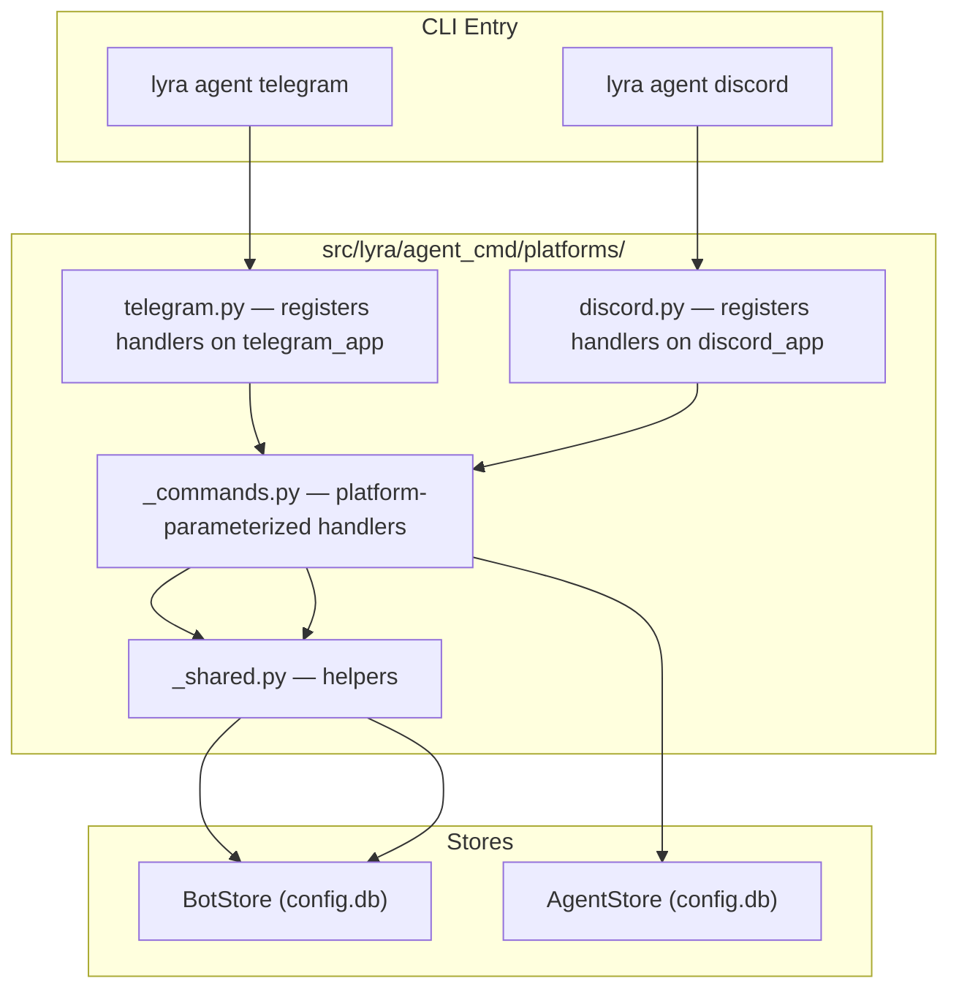
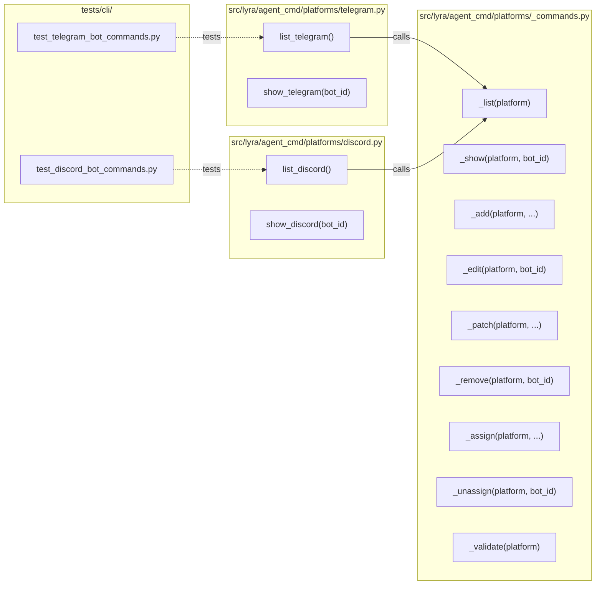

## Summary

Implement 9 bot CLI verbs per platform (telegram, discord) under `lyra agent <platform>`.
Shared command handlers in `_commands.py` (platform-parameterized), registered per-platform
in `telegram.py`/`discord.py`. Integration tests follow `test_agent_cli_commands.py` patterns.

## Architecture

### Data Flow

### File × Function Map

## Agents

| Agent | Task count | Files |
|-------|-----------|-------|
| backend-dev | 6 | `platforms/*`, `cli.py` |
| tester | 2 | `tests/cli/test_telegram_bot_commands.py`, `tests/cli/test_discord_bot_commands.py` |

## Wave Structure

2 waves, max 2 parallel agents. Elapsed ~1 day vs ~2 days sequential.

| Wave | Trigger | Agents | Tasks |
|------|---------|--------|-------|
| 1 | start | 1 ∥ | backend-dev: T1→T2→T3→T4→T5→T6 |
| 2 | Wave 1 done | 2 ∥ | tester-A: T7 · tester-B: T8 |

### Budget — per task

| Task | Items | Class | Est. ops | Split? |
|------|-------|-------|----------|--------|
| T1 Package init | 1 | trivial | 1 | — |
| T2 Shared helpers | 2 | bounded | 3 | — |
| T3 Command handlers | 9 | judgmental | 6 | — |
| T4 Telegram app | 1 | bounded | 2 | — |
| T5 Discord app | 1 | bounded | 2 | — |
| T6 CLI wiring | 1 | bounded | 2 | — |
| T7 Tests telegram | 9 | exploratory | 10 | — |
| T8 Tests discord | 9 | bounded | 3 | — |

**Total estimated ops: 29**

### Budget — per agent instance

| Instance | Tasks | Σ ops | Subjects | Split? |
|----------|-------|-------|----------|--------|
| backend-dev-A | T1-T6 | 16 | cli | — |
| tester-A | T7 | 10 | testing | — |
| tester-B | T8 | 3 | testing | — |

## Consistency Report

- Criteria covered: 14/14
- Uncovered criteria: none
- Tasks without spec backing: none
- Gold plating exemptions applied: 0

## Micro-Tasks

### Slice V1: Read operations (list, show)

#### T1: Create `platforms/` package
- **File:** `src/lyra/agent_cmd/platforms/__init__.py`
- **Snippet:** `importlib.import_module("lyra.agent_cmd.platforms.telegram")`
- **Verify:** `python -c "import lyra.agent_cmd.platforms; print('ok')"`
- **Expected:** `ok`
- **Time:** 2 min
- **Difficulty:** 1
- **Traces:** U1, U2
- **Phase:** GREEN

#### T2: Create shared helpers
- **File:** `src/lyra/agent_cmd/platforms/_shared.py`
- **Snippet:** `def _connect_bot_store(): ...` + `_validate_bot_id()` + `_format_table()`
- **Verify:** `python -m py_compile src/lyra/agent_cmd/platforms/_shared.py`
- **Expected:** no error
- **Time:** 5 min
- **Difficulty:** 2
- **Traces:** U1-U9
- **Phase:** GREEN
- **blockedBy:** T1

#### T3: Create command handlers
- **File:** `src/lyra/agent_cmd/platforms/_commands.py`
- **Snippet:** `def _list(platform: str): ...` + `_show`, `_add`, `_edit`, `_patch`, `_remove`, `_assign`, `_unassign`, `_validate`
- **Verify:** `python -m py_compile src/lyra/agent_cmd/platforms/_commands.py`
- **Expected:** no error
- **Time:** 15 min
- **Difficulty:** 3
- **Traces:** U1-U9
- **Phase:** GREEN
- **blockedBy:** T2

#### T4: Create telegram sub-typer
- **File:** `src/lyra/agent_cmd/platforms/telegram.py`
- **Snippet:** `telegram_app = typer.Typer(name="telegram")` + `@telegram_app.command(name="list")` + `agent_app.add_typer(telegram_app, name="telegram")`
- **Verify:** `python -m py_compile src/lyra/agent_cmd/platforms/telegram.py`
- **Expected:** no error
- **Time:** 5 min
- **Difficulty:** 2
- **Traces:** U1-U9
- **Phase:** GREEN
- **blockedBy:** T3

#### T5: Create discord sub-typer
- **File:** `src/lyra/agent_cmd/platforms/discord.py`
- **Snippet:** mirror of T4 with `discord_app` and `"discord"`
- **Verify:** `python -m py_compile src/lyra/agent_cmd/platforms/discord.py`
- **Expected:** no error
- **Time:** 3 min
- **Difficulty:** 1
- **Traces:** U10
- **Phase:** GREEN
- **blockedBy:** T3

#### T6: Wire platform sub-typers in cli.py
- **File:** `src/lyra/cli.py`
- **Snippet:** `importlib.import_module("lyra.agent_cmd.platforms")` after existing imports
- **Verify:** `python -c "from lyra.cli import agent_app; print('telegram' in [c.name for c in agent_app.registered_groups])"`
- **Expected:** `True`
- **Time:** 5 min
- **Difficulty:** 2
- **Traces:** U1-U10
- **Phase:** GREEN
- **blockedBy:** T4, T5

#### RED-GATE: V1 implementation complete
- **Verify:** T1-T6 complete
- **Phase:** RED-GATE

### Slice V2: CRUD (add, edit, patch, remove)

All covered in T3 (command handlers). RED-GATE: V1→T3 complete.

### Slice V3: Assignment + validation (assign, unassign, validate)

All covered in T3 (command handlers). RED-GATE: V1→T3 complete.

### Tests

#### T7: Tests for telegram commands
- **File:** `tests/cli/test_telegram_bot_commands.py`
- **Snippet:** `runner.invoke(agent_app, ["telegram", "list"])` with `monkeypatch` for `LYRA_VAULT_DIR`
- **Verify:** `uv run pytest tests/cli/test_telegram_bot_commands.py -v`
- **Expected:** all pass
- **Time:** 15 min
- **Difficulty:** 3
- **Traces:** SC-1 to SC-13
- **Phase:** RED
- **blockedBy:** T6

#### T8: Tests for discord commands
- **File:** `tests/cli/test_discord_bot_commands.py`
- **Snippet:** mirror of T7 with `discord` instead of `telegram`
- **Verify:** `uv run pytest tests/cli/test_discord_bot_commands.py -v`
- **Expected:** all pass
- **Time:** 10 min
- **Difficulty:** 2
- **Traces:** SC-11
- **Phase:** RED
- **blockedBy:** T6

#### RED-GATE: All tests pass
- **Verify:** T7, T8 complete and green
- **Phase:** RED-GATE

## Task Seeding Blueprint

### Wave 1 — no deps, 1 agent

| Task | Agent instance | blockedBy | Subject |
|------|---------------|-----------|---------|
| T1 | backend-dev-A | — | cli |
| T2 | backend-dev-A | T1 | cli |
| T3 | backend-dev-A | T2 | cli |
| T4 | backend-dev-A | T3 | cli |
| T5 | backend-dev-A | T3 | cli |
| T6 | backend-dev-A | T4, T5 | cli |

### Wave 2 — after Wave 1, 2 agents ∥

| Task | Agent instance | blockedBy | Subject |
|------|---------------|-----------|---------|
| T7 | tester-A | T6 | testing |
| T8 | tester-B | T6 | testing |

## Task IDs

<!-- Generated by /plan. Used by /implement to resume tasks on session restart. -->
- T1: task-14 — cli
- T2: task-15 — cli
- T3: task-16 — cli
- T4: task-17 — cli
- T5: task-18 — cli
- T6: task-19 — cli
- T7: task-20 — testing
- T8: task-21 — testing
