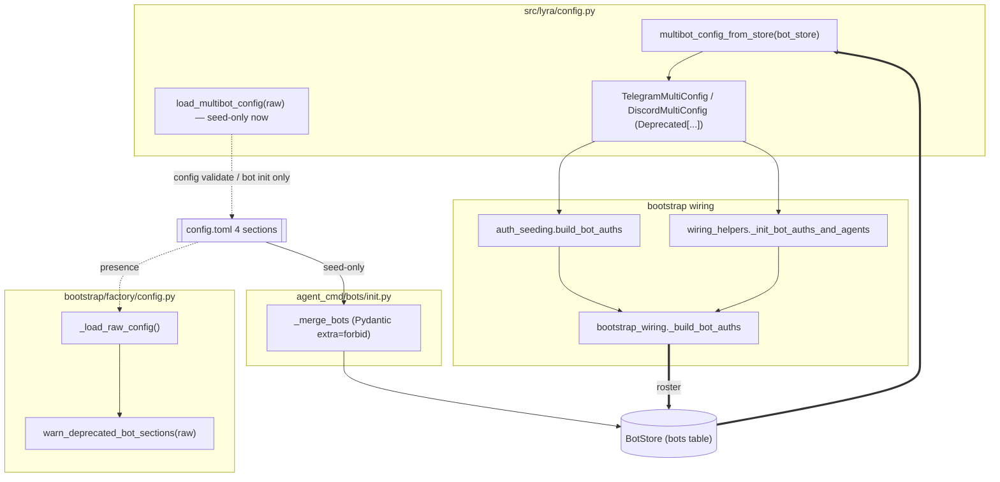
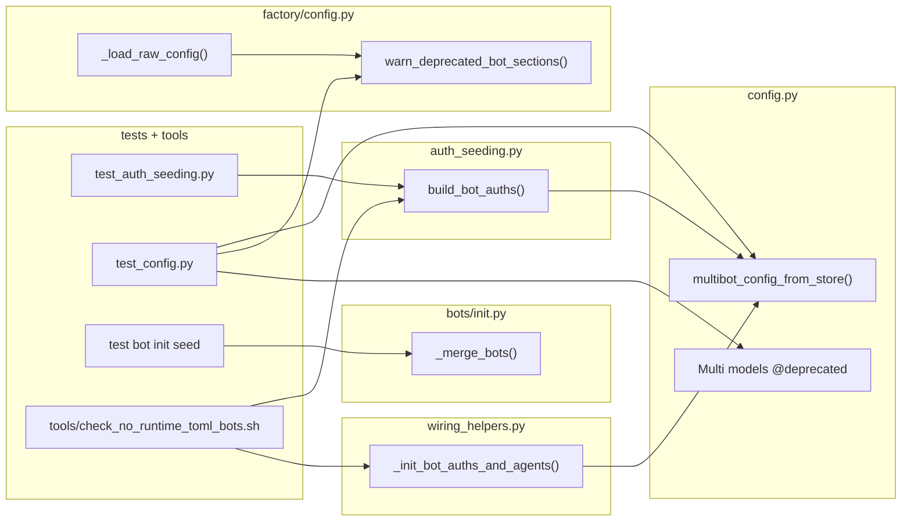

## Summary

Migrate the runtime bot roster from TOML (`load_multibot_config(raw_config)`) to
`bot_store.get_all()` in both boot paths, then ship a truthful one-time `DeprecationWarning`,
`Deprecated[...]` markers, a `lyra bot init` seed validator (G18), docs, CHANGELOG, and a
tightened guardrail. After this, the four TOML bot sections are read only by `lyra bot init`.

## Architecture

### Data flow

### File × Function map

## Agents

| Agent instance | Tasks | Files |
|---|---|---|
| backend-dev-A | T2, T3, T4 | `config.py`, `auth_seeding.py`, `wiring_helpers.py`, `bootstrap_wiring.py` |
| backend-dev-B | T7, T10, T11 | `factory/config.py`, `bots/init.py`, `config.py` (markers) |
| tester-A | T1, T5 | `tests/bootstrap/test_auth_seeding.py` |
| tester-B | T6, T8, T9, T12 | `tests/bootstrap/`, `tests/cli/` |
| devops-A | T13 | `tools/check_no_runtime_toml_bots.sh`, `.claude/stack.yml` |
| doc-writer-A | T14, T15 | `docs/bot-management.md`, `CHANGELOG.md`, issue #1420 |

## Wave Structure

3 waves, max 6 parallel agents. Elapsed ~1 day vs ~2.5 days sequential.

| Wave | Trigger | Agents | Tasks |
|---|---|---|---|
| 1 | start | 5 ∥ | tester-A: T1 · backend-dev-A: T2 · backend-dev-B: T7→T10→T11 · tester-B: T6→T9 · doc-writer-A: T14→T15 |
| 2 | T2 done | 1 | backend-dev-A: T3→T4 |
| 3 | T3,T4 done | 3 ∥ | devops-A: T13 · tester-A: T5 · tester-B: T8, T12 |

### Budget — per task

| Task | Items | Class | Est. ops | Split? |
|---|---|---|---|---|
| T1 RED roster test | 1 | judgmental | 5 | — |
| T2 multibot_config_from_store | 1 | judgmental | 5 | — |
| T3 auth_seeding swap + error text | 1 | bounded | 3 | — |
| T4 wiring_helpers swap + error text | 1 | bounded | 3 | — |
| T5 RED-GATE roster verify | 1 | bounded | 2 | — |
| T6 RED warning test | 1 | bounded | 3 | — |
| T7 warn_deprecated_bot_sections | 1 | judgmental | 5 | — |
| T8 RED-GATE warning verify | 1 | trivial | 2 | — |
| T9 RED seed-validator test | 1 | bounded | 3 | — |
| T10 _merge_bots extra=forbid | 1 | judgmental | 5 | — |
| T11 Deprecated[...] markers | 1 | bounded | 3 | — |
| T12 RED-GATE seed verify | 1 | trivial | 2 | — |
| T13 guardrail script + stack wire | 1 | judgmental | 5 | — |
| T14 docs Deprecation Timeline | 1 | bounded | 3 | — |
| T15 CHANGELOG + issue update | 1 | bounded | 3 | — |

**Total estimated ops: 52**

### Budget — per agent instance

| Instance | Tasks | Σ ops | Subjects | Split? |
|---|---|---|---|---|
| backend-dev-A | T2, T3, T4 | 11 | roster | — |
| backend-dev-B | T7, T10, T11 | 13 | deprecation, seed-validation | — |
| tester-A | T1, T5 | 7 | roster | — |
| tester-B | T6, T8, T9, T12 | 10 | deprecation, seed-validation | — |
| devops-A | T13 | 5 | guardrail | — |
| doc-writer-A | T14, T15 | 6 | docs | — |

No instance exceeds caps (≤4 tasks, ≤2 subjects, Σ ops ≤50).

## Consistency Report

Covered: 12/12 success criteria. Untraced tasks: 0. Exemptions: none.

| SC | Tasks |
|---|---|
| roster from BotStore (no load_multibot_config) | T2, T3, T4 |
| integration: empty TOML + seeded store → bot wired | T1, T5 |
| empty-roster error text retargeted | T3, T4, T5 |
| DeprecationWarning once | T6, T7, T8 |
| no warning on clean config | T6, T8 |
| bot init still seeds | T9, T10 (regression-guarded) |
| webhook_enabled typo raises (G18) | T9, T10, T12 |
| Multi models Deprecated[...] | T11 |
| original 2 guardrail greps = 0 | T13 |
| new load_multibot_config guardrail = 0 | T4, T13 |
| docs Deprecation Timeline (next major/v1.0.0/4 names) | T14 |
| CHANGELOG entry | T15 |

## Micro-Tasks

### Slice 1 — Roster from BotStore

**T1 [RED] tester-A · roster** — failing integration test.
- File: `tests/bootstrap/test_auth_seeding.py`
- Build a BotStore with one telegram bot row; pass `raw_config` with **no** `[[telegram.bots]]`. Assert `build_bot_auths` returns non-empty `tg_bot_auths` whose `bot_cfg.bot_id == seeded.bot_id`.
- Verify: `uv run pytest tests/bootstrap/test_auth_seeding.py -k roster_from_store` → fails (RED).
- Spec trace: SC#2 · Difficulty 3

**T2 [GREEN] backend-dev-A · roster** — store-sourced builder.
- File: `src/lyra/config.py`
- Add `multibot_config_from_store(bot_store) -> tuple[TelegramMultiConfig, DiscordMultiConfig]`: iterate `bot_store.get_all()`, partition by `platform`, build `TelegramBotConfig(bot_id, agent)` / `DiscordBotConfig(bot_id, auto_thread, agent, thread_hot_hours)`.
- Import `BotStoreProtocol`/`BotRow` from `lyra.core` (importlinter-clean per spec note).
- Verify: `uv run pytest tests/test_config.py -k from_store` (T-paired) + `uv run pyright src/lyra/config.py`.
- Spec trace: N2 / SC#1 · Difficulty 3

**T3 [GREEN] backend-dev-A · roster** — swap hub path + error text. blockedBy T2.
- File: `src/lyra/bootstrap/auth_seeding.py`
- Replace `load_multibot_config(raw_config)` (line 59) with `multibot_config_from_store(bot_store)`. Retarget the empty-roster `ValueError` (line ~74) to instruct `lyra bot init` / seed BotStore (drop `[[telegram.bots]]` wording). Drop now-unused `load_multibot_config` import if unused.
- Verify: `grep -c 'load_multibot_config' src/lyra/bootstrap/auth_seeding.py` → 0.
- Spec trace: N3 / SC#1, SC#3(err) · Difficulty 2

**T4 [GREEN] backend-dev-A · roster** — swap unified path + error text. blockedBy T2.
- File: `src/lyra/bootstrap/factory/wiring_helpers.py`
- Replace `load_multibot_config(raw_config)` (line 171) with `multibot_config_from_store(stores.bot)`. Retarget the empty-roster `SystemExit` (line ~193). Note: `_init_bot_auths_and_agents` already has `stores.bot`.
- Verify: `grep -c 'load_multibot_config' src/lyra/bootstrap/factory/wiring_helpers.py` → 0.
- Spec trace: N4 / SC#1, SC#3(err) · Difficulty 2

**T5 [RED-GATE] tester-A · roster** — verify slice green. blockedBy T3, T4.
- Run T1 test (now GREEN) + add empty-store assertion: empty BotStore + no TOML → error message contains `lyra bot init`.
- Verify: `uv run pytest tests/bootstrap/test_auth_seeding.py tests/bootstrap/test_wiring_helpers.py` → all pass.
- Spec trace: SC#2, SC#3(err) · Difficulty 2

### Slice 2 — Truthful deprecation warning

**T6 [RED] tester-B · deprecation** — failing warning test.
- File: `tests/bootstrap/test_config_deprecation.py` (new, unique basename)
- caplog: `_load_raw_config` on a config with `[[telegram.bots]]` → exactly one `DeprecationWarning`-level record; clean config → zero.
- Verify: `uv run pytest tests/bootstrap/test_config_deprecation.py` → fails (RED).
- Spec trace: SC#3, SC#4 · Difficulty 2

**T7 [GREEN] backend-dev-B · deprecation** — emit warning.
- File: `src/lyra/bootstrap/factory/config.py`
- Add `warn_deprecated_bot_sections(raw)` checking the 4 keys (`telegram.bots`, `discord.bots`, `auth.telegram_bots`, `auth.discord_bots`); module-level dedup flag → log once via `log.warning` with the issue's message text. Call from `_load_raw_config` after `tomllib.load` (line ~166).
- Verify: `uv run pytest tests/bootstrap/test_config_deprecation.py` → pass.
- Spec trace: N1 / SC#3, SC#4 · Difficulty 3

**T8 [RED-GATE] tester-B · deprecation** — verify. blockedBy T7.
- Run T6 + assert dedup across two `_load_raw_config` calls = still one record (reset flag fixture).
- Verify: `uv run pytest tests/bootstrap/test_config_deprecation.py -v` → pass.
- Spec trace: SC#3 · Difficulty 1

### Slice 3 — Seed safety + discoverability

**T9 [RED] tester-B · seed-validation** — failing typo test.
- File: `tests/cli/test_bot_init_seed_validation.py` (new)
- TOML with a `[[telegram.bots]]` entry containing `webhook_enabled = true` typo (unknown key for the seed model) → `lyra bot init` / `_merge_bots` raises a validation error naming the bad key.
- Verify: `uv run pytest tests/cli/test_bot_init_seed_validation.py` → fails (RED).
- Spec trace: SC#6 · Difficulty 2

**T10 [GREEN] backend-dev-B · seed-validation** — extra=forbid seed model.
- File: `src/lyra/agent_cmd/bots/init.py`
- In `_merge_bots`, validate each bot entry through a Pydantic model with `model_config = ConfigDict(extra="forbid")` mapping the legal seed keys (bot_id, agent, webhook_enabled, default_trust, owner_users, trusted_users, trusted_roles, auto_thread, thread_hot_hours). Surface unknown keys as a clear init error (added to existing `errors` list / typer.echo).
- Verify: `uv run pytest tests/cli/test_bot_init_seed_validation.py` → pass; `lyra bot init` happy-path regression still seeds.
- Spec trace: N6 / SC#5, SC#6 · Difficulty 3

**T11 [GREEN] backend-dev-B · deprecation** — Deprecated markers.
- File: `src/lyra/config.py`
- Mark `TelegramMultiConfig` and `DiscordMultiConfig` (and/or `.bots` field) with `typing_extensions.deprecated("...seed-only; see docs/bot-management.md")`.
- Verify: `uv run pyright src/lyra/config.py` clean; `grep -c 'deprecated' src/lyra/config.py` ≥ 1.
- Spec trace: N5 / SC#7 · Difficulty 2

**T12 [RED-GATE] tester-B · seed-validation** — verify. blockedBy T10.
- Run T9 green + assert a valid entry still seeds (no false positive on legal keys).
- Verify: `uv run pytest tests/cli/test_bot_init_seed_validation.py -v` → pass.
- Spec trace: SC#5, SC#6 · Difficulty 1

### Slice 4 — Docs + guardrails

**T13 [GREEN] devops-A · guardrail** — guardrail script. blockedBy T3, T4.
- Files: `tools/check_no_runtime_toml_bots.sh` (model on `tools/check_single_write_tool_display_config.sh`), `.claude/stack.yml`
- Script runs the original 2 issue greps **+** `grep -n 'load_multibot_config(' src/lyra/bootstrap/auth_seeding.py src/lyra/bootstrap/factory/wiring_helpers.py`; exit 1 on any match. Wire into `quality_gates` in `.claude/stack.yml`.
- Verify: `bash tools/check_no_runtime_toml_bots.sh; echo $?` → 0.
- Spec trace: N7 / SC#8, SC#9 · Difficulty 3

**T14 [GREEN] doc-writer-A · docs** — Deprecation Timeline section.
- File: `docs/bot-management.md`
- Add `## Deprecation Timeline` (between `## Bot Configuration` and `## CLI Commands`): literal phrase `next major`, target `v1.0.0` (current `0.2.1`), name all 4 sections, point to `lyra bot init`.
- Verify: `grep -q 'next major' docs/bot-management.md && grep -q 'v1.0.0' docs/bot-management.md && grep -q 'auth.telegram_bots' docs/bot-management.md`.
- Spec trace: SC#10 · Difficulty 2

**T15 [GREEN] doc-writer-A · docs** — CHANGELOG + issue hygiene.
- Files: `CHANGELOG.md`, issue #1420 (gh)
- Add CHANGELOG entry (Deprecated: TOML bot sections runtime-read; seed-only). Update issue body AC to record corrected premise (roster migration) and bump `<!-- complexity: 2 -->` → `5`.
- Verify: `grep -qi 'seed-only\|deprecat' CHANGELOG.md`.
- Spec trace: SC#11 · Difficulty 2

## Task Seeding Blueprint

<!-- Used by /implement to seed TaskCreate calls. T-numbers ref this list. -->

### Wave 1 — no deps, 5 agents ∥

| Task | Agent instance | blockedBy | Subject |
|---|---|---|---|
| T1 | tester-A | — | roster |
| T2 | backend-dev-A | — | roster |
| T6 | tester-B | — | deprecation |
| T7 | backend-dev-B | — | deprecation |
| T9 | tester-B | T6 | seed-validation |
| T10 | backend-dev-B | T7 | seed-validation |
| T11 | backend-dev-B | T10 | deprecation |
| T14 | doc-writer-A | — | docs |
| T15 | doc-writer-A | T14 | docs |

### Wave 2 — after T2, 1 agent

| Task | Agent instance | blockedBy | Subject |
|---|---|---|---|
| T3 | backend-dev-A | T2 | roster |
| T4 | backend-dev-A | T3 | roster |

### Wave 3 — after T3,T4, 3 agents ∥

| Task | Agent instance | blockedBy | Subject |
|---|---|---|---|
| T5 | tester-A | T3, T4 | roster |
| T8 | tester-B | T7 | deprecation |
| T12 | tester-B | T10 | seed-validation |
| T13 | devops-A | T3, T4 | guardrail |

## Task IDs

<!-- Generated by /plan. Used by /implement to resume tasks on session restart. -->
- T1: 12 — roster (RED test)
- T2: 13 — roster (builder)
- T3: 14 — roster (auth_seeding swap)
- T4: 15 — roster (wiring_helpers swap)
- T5: 16 — roster (RED-GATE)
- T6: 17 — deprecation (RED test)
- T7: 18 — deprecation (warn fn)
- T8: 19 — deprecation (RED-GATE)
- T9: 20 — seed-validation (RED test)
- T10: 21 — seed-validation (extra=forbid)
- T11: 22 — deprecation (Deprecated markers)
- T12: 23 — seed-validation (RED-GATE)
- T13: 24 — guardrail (check script)
- T14: 25 — docs (timeline)
- T15: 26 — docs (CHANGELOG + issue)
