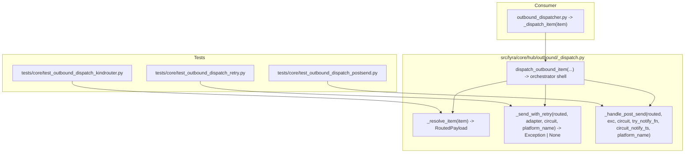
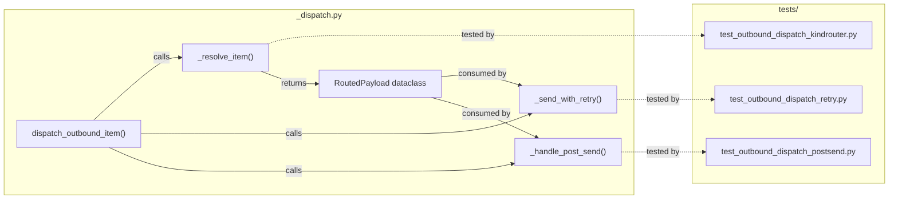

## Summary

Extract three responsibilities (kind-router, retry sender, post-send handler) from `dispatch_outbound_item` into top-level functions in `_dispatch.py`, add dedicated unit tests for each extracted unit, and verify zero behavioral regression via existing integration tests.

## Architecture

### Data Flow

### File x Function Map

## Agents

| Agent | Task count | Files |
|-------|-----------|-------|
| backend-dev-A | 3 | `src/lyra/core/hub/outbound/_dispatch.py` |
| tester-A | 2 | `tests/core/test_outbound_dispatch_kindrouter.py`, integration test suite |
| tester-B | 1 | `tests/core/test_outbound_dispatch_retry.py` |
| tester-C | 1 | `tests/core/test_outbound_dispatch_postsend.py` |

## Wave Structure

3 waves, max 3 parallel agents. Elapsed ~1 day sequential vs ~2 hours with parallelism.

| Wave | Trigger | Agents | Tasks |
|------|---------|--------|-------|
| 1 | start | 3 ∥ | tester-A: T1 · tester-B: T2 · tester-C: T3 |
| 2 | Wave 1 done | 1 | backend-dev-A: T4→T5→T6 |
| 3 | Wave 2 done | 3 ∥ | tester-A: T7a · tester-B: T7b · tester-C: T7c |
| 4 | Wave 3 done | 1 | tester-A: T8 |

### Budget — per task

| Task | Items | Class | Est. ops | Split? |
|------|-------|-------|----------|--------|
| T1 Write KindRouter tests | 6 test cases | bounded | 3 | — |
| T2 Write RetrySender tests | 5 test cases | bounded | 3 | — |
| T3 Write PostSendHandler tests | 4 test cases | bounded | 3 | — |
| T4 Extract KindRouter | 1 function + dataclass | bounded | 4 | — |
| T5 Extract RetrySender | 1 function | judgmental | 6 | — |
| T6 Extract PostSendHandler + wire host | 1 function + orchestration | bounded | 5 | — |
| T7 Run new unit tests | 3 test files | trivial | 1 | — |
| T8 Run integration tests | 1 command | trivial | 1 | — |

**Total estimated ops: 26**

### Budget — per agent instance

| Instance | Tasks | Σ ops | Subjects | Split? |
|----------|-------|-------|----------|--------|
| backend-dev-A | T4, T5, T6 | 15 | dispatch | — |
| tester-A | T1, T8 | 4 | dispatch-tests | — |
| tester-B | T2, T7b | 4 | retry-tests | — |
| tester-C | T3, T7c | 4 | postsend-tests | — |

## Consistency Report

- Criteria covered: 7/7
- Uncovered criteria: none
- Tasks without spec backing: none
- Gold plating exemptions applied: 0

## Micro-Tasks

### Slice V1: KindRouter

#### T1: Write KindRouter unit tests [P] → tester-A
- **File:** `tests/core/test_outbound_dispatch_kindrouter.py`
- **Snippet:** `def test_resolve_item_send(): ...` + `def test_resolve_item_streaming(): ...` + `def test_resolve_item_voice_stream_synthesizes_routing(): ...` + routing edge cases
- **Verify:** `grep -q 'def test_resolve_item' tests/core/test_outbound_dispatch_kindrouter.py` (ready)
- **Expected:** Test file contains ≥6 test functions covering all 6 kind branches + routing edge cases
- **Time:** 5 min | **Difficulty:** 2
- **Traces:** SC-3 | **Phase:** RED

#### RED-GATE: RED complete V1
- **Verify:** T1 marked complete
- **Phase:** RED-GATE

#### T4: Extract `_resolve_item` with `RoutedPayload` dataclass → backend-dev-A
- **File:** `src/lyra/core/hub/outbound/_dispatch.py`
- **Snippet:** `@dataclass class RoutedPayload: kind, msg, payload, outbound, routing, callback_target` + `def _resolve_item(item: _ITEM) -> RoutedPayload: ...`
- **Verify:** `grep -q 'class RoutedPayload' src/lyra/core/hub/outbound/_dispatch.py && grep -q 'def _resolve_item' src/lyra/core/hub/outbound/_dispatch.py` (ready)
- **Deferred:** `uv run pytest tests/core/test_outbound_dispatch_kindrouter.py -v`
- **Expected:** All T1 tests pass
- **Time:** 5 min | **Difficulty:** 3
- **Traces:** SC-1, U1 | **Phase:** GREEN

### Slice V2: RetrySender

#### T2: Write RetrySender unit tests [P] → tester-B
- **File:** `tests/core/test_outbound_dispatch_retry.py`
- **Snippet:** `def test_send_success_first_attempt(): ...` + `def test_retry_count_equals_four(): ...` + `def test_backoff_delays_match(): ...` + `def test_transient_error_retries(): ...` + `def test_base_exception_re_raise(): ...`
- **Verify:** `grep -q 'def test_send' tests/core/test_outbound_dispatch_retry.py` (ready)
- **Expected:** Test file contains ≥5 test functions
- **Time:** 5 min | **Difficulty:** 2
- **Traces:** SC-4 | **Phase:** RED

#### RED-GATE: RED complete V2
- **Verify:** T2 marked complete
- **Phase:** RED-GATE

#### T5: Extract `_send_with_retry` → backend-dev-A
- **File:** `src/lyra/core/hub/outbound/_dispatch.py`
- **Snippet:** `async def _send_with_retry(routed: RoutedPayload, adapter, circuit, platform_name) -> Exception | None: ...` with `_BACKOFF_DELAYS` and `_MAX_ATTEMPTS` module constants
- **Verify:** `grep -q 'def _send_with_retry' src/lyra/core/hub/outbound/_dispatch.py` (ready)
- **Deferred:** `uv run pytest tests/core/test_outbound_dispatch_retry.py -v`
- **Expected:** All T2 tests pass
- **Time:** 8 min | **Difficulty:** 4
- **Traces:** SC-1, U2 | **Phase:** GREEN

### Slice V3: PostSendHandler

#### T3: Write PostSendHandler unit tests [P] → tester-C
- **File:** `tests/core/test_outbound_dispatch_postsend.py`
- **Snippet:** `def test_callback_invoked_with_correct_target(): ...` + `def test_circuit_failure_recorded(): ...` + `def test_iterator_drained_on_error(): ...` + `def test_user_notification_sent_on_failure(): ...`
- **Verify:** `grep -q 'def test_handle' tests/core/test_outbound_dispatch_postsend.py` (ready)
- **Expected:** Test file contains ≥4 test functions
- **Time:** 4 min | **Difficulty:** 2
- **Traces:** SC-5 | **Phase:** RED

#### RED-GATE: RED complete V3
- **Verify:** T3 marked complete
- **Phase:** RED-GATE

#### T6: Extract `_handle_post_send` + wire host function → backend-dev-A
- **File:** `src/lyra/core/hub/outbound/_dispatch.py`
- **Snippet:** `async def _handle_post_send(routed: RoutedPayload, exc, circuit, try_notify_fn, circuit_notify_ts, platform_name) -> None: ...` + `async def dispatch_outbound_item(...): ...` (orchestrator ≤60 LOC, zero noqa)
- **Verify:** `grep -q 'def _handle_post_send' src/lyra/core/hub/outbound/_dispatch.py && grep -q 'def dispatch_outbound_item' src/lyra/core/hub/outbound/_dispatch.py` (ready)
- **Deferred:** `uv run pytest tests/core/test_outbound_dispatch_postsend.py -v`
- **Expected:** All T3 tests pass; `wc -l` on function body ≤60; `noqa` count = 0
- **Time:** 8 min | **Difficulty:** 4
- **Traces:** SC-1, SC-2, U3 | **Phase:** GREEN

### Wave 4 — Integration verification

#### T8: Run existing integration tests to verify no regression → tester-A
- **Verify:** `uv run pytest tests/core/test_outbound_dispatcher_*.py tests/outbound/ -x` (deferred)
- **Expected:** All existing tests pass without modification
- **Time:** 5 min | **Difficulty:** 1
- **Traces:** SC-6 | **Phase:** RED-GATE

## Task IDs

<!-- Generated by /plan. Used by /implement to resume tasks on session restart. -->
- T1: 10 — dispatch-tests
- T2: 11 — retry-tests
- T3: 12 — postsend-tests
- T4: 13 — dispatch
- T5: 14 — dispatch
- T6: 15 — dispatch
- T7a: 16 — dispatch-tests
- T7b: 17 — retry-tests
- T7c: 18 — postsend-tests
- T8: 19 — dispatch-tests

## Task Seeding Blueprint

### Wave 1 — no deps, 3 agents ∥

| Task | Agent instance | blockedBy | Subject |
|------|---------------|-----------|---------|
| T1 | tester-A | — | dispatch-tests |
| T2 | tester-B | — | retry-tests |
| T3 | tester-C | — | postsend-tests |

### Wave 2 — after Wave 1, 1 agent

| Task | Agent instance | blockedBy | Subject |
|------|---------------|-----------|---------|
| T4 | backend-dev-A | T1, T2, T3 | dispatch |
| T5 | backend-dev-A | T4 | dispatch |
| T6 | backend-dev-A | T5 | dispatch |

### Wave 3 — after Wave 2, 3 agents ∥

| Task | Agent instance | blockedBy | Subject |
|------|---------------|-----------|---------|
| T7a | tester-A | T4 | dispatch-tests |
| T7b | tester-B | T5 | retry-tests |
| T7c | tester-C | T6 | postsend-tests |

### Wave 4 — after Wave 3, 1 agent

| Task | Agent instance | blockedBy | Subject |
|------|---------------|-----------|---------|
| T8 | tester-A | T7a, T7b, T7c | dispatch-tests |
