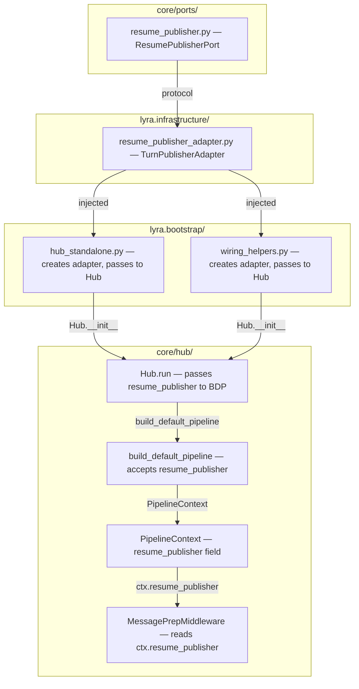

## Summary

Define `ResumePublisherPort` in `core/ports/`, create `TurnPublisherAdapter` in `lyra.infrastructure`, inject the port into `PipelineContext` via `build_default_pipeline`, and update `MessagePrepMiddleware` to stop drilling into `ctx.hub`. Bootstrap wiring sites pass the adapter. Add architectural guard in `src/lyra/core/CLAUDE.md`.

## Architecture

### Data flow



### File × Function map

```mermaid
flowchart LR
    subgraph S1["Slice S1 — core/ports/ (backend-dev-A)"]
        RP1[resume_publisher.py — ResumePublisherPort]
        INIT1[__init__.py — re-export]
    end
    subgraph S2["Slice S2 — infrastructure/ (backend-dev-B)"]
        RPA1[resume_publisher_adapter.py — TurnPublisherAdapter]
    end
    subgraph S3["Slice S3 — core/hub/middleware/ (backend-dev-A)"]
        MW1[middleware.py — PipelineContext + build_default_pipeline]
        MW2[middleware_pool.py — MessagePrepMiddleware]
    end
    subgraph S4["Slice S4 — core/hub/ + bootstrap"]
        HUB1[hub.py — Hub.run passes resume_publisher (backend-dev-A)]
        HS1[hub_standalone.py — adapter creation + Hub wiring (backend-dev-B)]
        WH1[wiring_helpers.py — adapter creation + Hub wiring (backend-dev-B)]
    end
    subgraph S5["Slice S5 — docs + tests"]
        CLAUDE[src/lyra/core/CLAUDE.md (doc-writer)]
        TM1[tests/core/test_middleware.py (tester-A)]
    end

    RP1 -->|implements| RPA1
    RPA1 -->|wraps| TP1[TurnPublisher]
    RPA1 -->|wraps| TS1[TurnStore]
    MW2 -->|reads| MW1
    HUB1 -->|calls| MW1
    HS1 -->|creates| RPA1
    WH1 -->|creates| RPA1
```

## Bootstrap Context

The `Hub` constructor already accepts driven ports (`stt`, `tts`, `prefs_store`). Adding `resume_publisher: ResumePublisherPort | None` follows the same pattern. The `Hub.run()` method builds the pipeline dynamically — it will pass `resume_publisher` to `build_default_pipeline()`.

Existing concrete setters (`set_turn_store`, `set_turn_publisher`, etc.) remain untouched per out-of-scope rule.

## Agents

| Agent | Tasks | Files | Subjects |
|-------|-------|-------|----------|
| backend-dev-A | T1, T3, T4 | `core/ports/`, `core/hub/middleware/`, `core/hub/hub.py` | ports, middleware, hub |
| backend-dev-B | T2, T5 | `lyra.infrastructure/`, `bootstrap/` | infrastructure, bootstrap |
| tester-A | T6 | `tests/core/test_middleware.py` | tests |
| doc-writer | T7 | `src/lyra/core/CLAUDE.md` | docs |

## Wave Structure

4 waves, max 3 parallel agents. Elapsed ~1 sequential vs ~4 parallel (T2∥T3 in Wave 2).

| Wave | Trigger | Agents | Tasks |
|------|---------|--------|-------|
| 1 | start | 2 ∥ | backend-dev-A: T1 · doc-writer: T7 |
| 2 | T1 done | 2 ∥ | backend-dev-A: T3 · backend-dev-B: T2 |
| 3 | T3 done | 1 | backend-dev-A: T4 |
| 4 | T2, T4 done | 2 ∥ | backend-dev-B: T5 · tester-A: T6 |

### Budget — per task

| Task | Items | Class | Est. ops | Split? |
|------|-------|-------|----------|--------|
| T1 | 2 files | bounded | 3 | — |
| T2 | 1 file | bounded | 3 | — |
| T3 | 2 files | bounded | 4 | — |
| T4 | 2 files | bounded | 3 | — |
| T5 | 2 files | judgmental | 5 | — |
| T6 | 1 file | judgmental | 5 | — |
| T7 | 1 file | bounded | 2 | — |

**Total estimated ops: 25**

### Budget — per agent instance

| Instance | Tasks | Σ ops | Subjects | Split? |
|----------|-------|-------|----------|--------|
| backend-dev-A | T1, T3, T4 | 10 | ports, middleware, hub | — |
| backend-dev-B | T2, T5 | 8 | infrastructure, bootstrap | — |
| tester-A | T6 | 5 | tests | — |
| doc-writer | T7 | 2 | docs | — |

## Micro-Tasks

### Wave 1 — no deps, 2 agents ∥

#### T1 — Define ResumePublisherPort in core/ports/
- **Description:** Create `ResumePublisherPort` protocol with `publish_increment_resume_count` and `get_resume_count` methods; update `core/ports/__init__.py`
- **Files:** `src/lyra/core/ports/resume_publisher.py` (new), `src/lyra/core/ports/__init__.py`
- **Code snippet:**
  ```python
  from typing import Protocol

  class ResumePublisherPort(Protocol):
      async def publish_increment_resume_count(
          self, *, pool_id: str, session_id: str, platform: str,
          user_id: str, target_count: int, trace_id: str,
      ) -> None: ...

      async def get_resume_count(self, session_id: str) -> int: ...
  ```
- **Verify command:** `python -c "from lyra.core.ports import ResumePublisherPort; print('ok')"`
- **Expected output:** `ok`
- **Time estimate:** 3 min
- **Agent:** backend-dev-A
- **Subject:** ports
- **Spec trace:** SC-1
- **Slice:** S1
- **Phase:** GREEN
- **Difficulty:** 2

#### T7 — Document architectural guard in CLAUDE.md
- **Description:** Add ADR-048 guard line to `src/lyra/core/CLAUDE.md` under "What NOT to do"
- **Files:** `src/lyra/core/CLAUDE.md`
- **Code snippet:**
  ```markdown
  - ¬add new concrete setters to Hub without a `core/ports/` protocol
  ```
- **Verify command:** `grep -q "concrete setters" src/lyra/core/CLAUDE.md && echo ok`
- **Expected output:** `ok`
- **Time estimate:** 2 min
- **Agent:** doc-writer
- **Subject:** docs
- **Spec trace:** SC-9
- **Slice:** S5
- **Phase:** GREEN
- **Difficulty:** 1

### Wave 2 — after T1, 1 agent

#### T2 — Create TurnPublisherAdapter in lyra.infrastructure
- **Description:** Create adapter that wraps `TurnPublisher` + `TurnStore` and implements `ResumePublisherPort`
- **Files:** `src/lyra/infrastructure/resume_publisher_adapter.py` (new)
- **Code snippet:**
  ```python
  from lyra.core.ports.resume_publisher import ResumePublisherPort
  from lyra.transport.turn_publisher import TurnPublisher
  from lyra.infrastructure.stores.turn_store import TurnStore

  class TurnPublisherAdapter:
      def __init__(self, publisher: TurnPublisher, store: TurnStore) -> None:
          self._publisher = publisher
          self._store = store

      async def publish_increment_resume_count(self, **kwargs) -> None:
          await self._publisher.publish_increment_resume_count(**kwargs)

      async def get_resume_count(self, session_id: str) -> int:
          return await self._store.get_resume_count(session_id)
  ```
- **Verify command:** `python -c "from lyra.infrastructure.resume_publisher_adapter import TurnPublisherAdapter; print('ok')"`
- **Expected output:** `ok`
- **Time estimate:** 3 min
- **Agent:** backend-dev-B
- **Subject:** infrastructure
- **Spec trace:** SC-2
- **Slice:** S2
- **Phase:** GREEN
- **Difficulty:** 2
- **[P]** true
- **blockedBy:** T1

#### T3 — Update PipelineContext + MessagePrepMiddleware
- **Description:** Add `resume_publisher` to `PipelineContext`; update `MessagePrepMiddleware` to use `ctx.resume_publisher` instead of `ctx.hub._turn_publisher` / `ctx.hub._turn_store`
- **Files:** `src/lyra/core/hub/middleware/middleware.py`, `src/lyra/core/hub/middleware/middleware_pool.py`
- **Code snippet (middleware.py):**
  ```python
  @dataclass
  class PipelineContext:
      hub: Hub
      resume_publisher: ResumePublisherPort | None = None
      ...
  ```
- **Code snippet (middleware_pool.py):**
  ```python
  if pool._on_resume_fn is None and ctx.resume_publisher is not None:
      _pub = ctx.resume_publisher
      _store = ctx.resume_publisher  # has get_resume_count too
      ...
  ```
- **Verify command:** `grep -q "resume_publisher" src/lyra/core/hub/middleware/middleware.py && grep -q "resume_publisher" src/lyra/core/hub/middleware/middleware_pool.py && echo ok`
- **Expected output:** `ok`
- **Time estimate:** 5 min
- **Agent:** backend-dev-A
- **Subject:** middleware
- **Spec trace:** SC-3, SC-4
- **Slice:** S3
- **Phase:** GREEN
- **Difficulty:** 3
- **[P]** true
- **blockedBy:** T1

### Wave 3 — after T3, 1 agent

#### T4 — Update build_default_pipeline + Hub.run()
- **Description:** Add `resume_publisher` parameter to `build_default_pipeline` and `Hub.run()`; pass it to `PipelineContext`
- **Files:** `src/lyra/core/hub/middleware/middleware.py`, `src/lyra/core/hub/hub.py`
- **Code snippet:**
  ```python
  def build_default_pipeline(
      hub: Hub,
      *,
      resume_publisher: ResumePublisherPort | None = None,
      ...
  ) -> MiddlewarePipeline:
      ...
      ctx = PipelineContext(hub=self, resume_publisher=self._resume_publisher, ...)
  ```
- **Verify command:** `grep -q "resume_publisher" src/lyra/core/hub/hub.py && echo ok`
- **Expected output:** `ok`
- **Time estimate:** 3 min
- **Agent:** backend-dev-A
- **Subject:** hub
- **Spec trace:** SC-5
- **Slice:** S4
- **Phase:** GREEN
- **Difficulty:** 2
- **[P]** false
- **blockedBy:** T3

### Wave 4 — after T4, 2 agents ∥

#### T5 — Update bootstrap wiring
- **Description:** Create `TurnPublisherAdapter` in bootstrap sites and pass it to `Hub` constructor
- **Files:** `src/lyra/bootstrap/standalone/hub_standalone.py`, `src/lyra/bootstrap/factory/wiring_helpers.py`
- **Code snippet:**
  ```python
  from lyra.infrastructure.resume_publisher_adapter import TurnPublisherAdapter
  from lyra.core.ports.resume_publisher import ResumePublisherPort

  adapter = TurnPublisherAdapter(TurnPublisher(js), stores.turn)
  hub = Hub(..., resume_publisher=adapter)
  ```
- **Verify command:** `grep -q "TurnPublisherAdapter" src/lyra/bootstrap/standalone/hub_standalone.py && grep -q "TurnPublisherAdapter" src/lyra/bootstrap/factory/wiring_helpers.py && echo ok`
- **Expected output:** `ok`
- **Time estimate:** 5 min
- **Agent:** backend-dev-B
- **Subject:** bootstrap
- **Spec trace:** SC-6
- **Slice:** S4
- **Phase:** GREEN
- **Difficulty:** 3
- **[P]** false
- **blockedBy:** T2, T4

#### T6 — Update tests
- **Description:** Update `tests/core/test_middleware.py` to pass `resume_publisher` to `PipelineContext` and `build_default_pipeline`
- **Files:** `tests/core/test_middleware.py`
- **Verify command:** `uv run pytest tests/core/test_middleware.py -v --tb=short`
- **Expected output:** `passed`
- **Time estimate:** 5 min
- **Agent:** tester-A
- **Subject:** tests
- **Spec trace:** SC-7
- **Slice:** S4
- **Phase:** RED-GATE
- **Difficulty:** 3
- **[P]** true
- **blockedBy:** T3, T4

## Task Seeding Blueprint

### Wave 1 — no deps, 2 agents ∥

| Task | Agent instance | blockedBy | Subject |
|------|---------------|-----------|---------|
| T1 | backend-dev-A | — | ports |
| T7 | doc-writer | — | docs |

### Wave 2 — after T1, 2 agents ∥

| Task | Agent instance | blockedBy | Subject |
|------|---------------|-----------|---------|
| T2 | backend-dev-B | T1 | infrastructure |
| T3 | backend-dev-A | T1 | middleware |

### Wave 3 — after T3, 1 agent

| Task | Agent instance | blockedBy | Subject |
|------|---------------|-----------|---------|
| T4 | backend-dev-A | T3 | hub |

### Wave 4 — after T2, T4, 2 agents ∥

| Task | Agent instance | blockedBy | Subject |
|------|---------------|-----------|---------|
| T5 | backend-dev-B | T2, T4 | bootstrap |
| T6 | tester-A | T3, T4 | tests |

## Consistency Report

- **Covered criteria:** 9/9 (all success criteria have ≥1 task)
- **Uncovered:** None
- **Untraced tasks:** None
- **Exemptions:** None

## Task IDs

<!-- Generated by /plan. Used by /implement to resume tasks on session restart. -->
- T1: 11 — ports
- T2: 12 — infrastructure
- T3: 13 — middleware
- T4: 14 — hub
- T5: 15 — bootstrap
- T6: 16 — tests
- T7: 17 — docs
