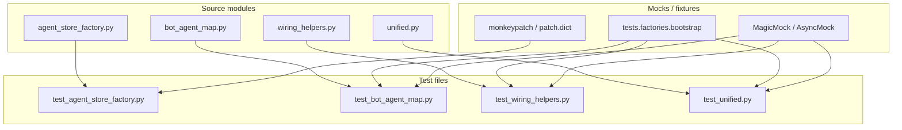
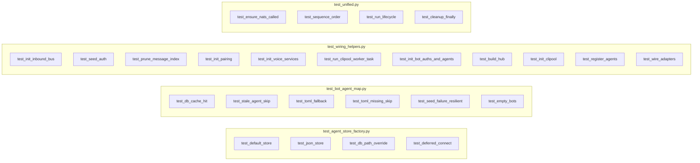

## Summary

Create 4 test files covering 4 bootstrap wiring modules with mocked collaborators. All tests run in <1 s per suite, reuse existing fixtures, and require no full hub or NATS lifecycle.

## Architecture

## Wave Structure

1 wave, 3 agents parallel. Elapsed ~1 day vs ~3 days sequential.

| Wave | Trigger | Agents | Tasks |
|------|---------|--------|-------|
| 1 | start | 3 parallel | tester-A: T1, T2 · tester-B: T3, T4, T5 · tester-C: T6 |

### Budget — per task

| Task | Items | Class | Est. ops | Split? |
|------|-------|-------|----------|--------|
| T1 | 4 | bounded | 8 | — |
| T2 | 6 | bounded | 10 | — |
| T3 | 6 | bounded | 12 | — |
| T4 | 3 | judgmental | 10 | — |
| T5 | 2 | judgmental | 8 | — |
| T6 | 4 | judgmental | 10 | — |

**Total estimated ops: 58**

### Budget — per agent instance

| Instance | Tasks | ops | Subjects | Split? |
|----------|-------|-----|----------|--------|
| tester-A | T1, T2 | 18 | bootstrap-testing | — |
| tester-B | T3, T4, T5 | 30 | bootstrap-testing | — |
| tester-C | T6 | 10 | bootstrap-testing | — |

## Task Seeding Blueprint

### Wave 1 — no deps, 3 agents parallel

| Task | Agent instance | blockedBy | Subject |
|------|---------------|-----------|---------|
| T1 | tester-A | — | bootstrap-testing |
| T2 | tester-A | — | bootstrap-testing |
| T3 | tester-B | — | bootstrap-testing |
| T4 | tester-B | — | bootstrap-testing |
| T5 | tester-B | — | bootstrap-testing |
| T6 | tester-C | — | bootstrap-testing |

## Micro-Tasks

### Slice 1 — agent_store_factory

**T1** — Create `tests/bootstrap/test_agent_store_factory.py`
- Description: Write unit tests for `make_agent_store` covering all env-var branches
- File: `tests/bootstrap/test_agent_store_factory.py`
- Code snippet: `pytest` functions with `monkeypatch` / `patch.dict`
- Verify: `pytest tests/bootstrap/test_agent_store_factory.py --cov=lyra.bootstrap.factory.agent_store_factory`
- Expected: ≥80 % coverage, <1 s
- Time: 5 min
- `[P]`
- Agent: tester-A
- Subject: bootstrap-testing
- Spec trace: SC-1
- Phase: GREEN
- Difficulty: 2

### Slice 2 — bot_agent_map

**T2** — Create `tests/bootstrap/test_bot_agent_map.py`
- Description: Write unit tests for `resolve_bot_agent_map` covering DB cache, TOML fallback, skip, seed failure
- File: `tests/bootstrap/test_bot_agent_map.py`
- Code snippet: `pytest` functions with `AsyncMock` for `agent_store.set_bot_agent`
- Verify: `pytest tests/bootstrap/test_bot_agent_map.py --cov=lyra.bootstrap.factory.bot_agent_map`
- Expected: ≥80 % coverage, <1 s
- Time: 8 min
- `[P]`
- Agent: tester-A
- Subject: bootstrap-testing
- Spec trace: SC-2
- Phase: GREEN
- Difficulty: 3

### Slice 3a — wiring_helpers (simple)

**T3** — Write wiring_helpers simple-phase tests
- Description: Test `_init_inbound_bus`, `_seed_auth`, `_prune_message_index`, `_init_pairing`, `_init_voice_services`, `_run_clipool_worker_task`
- File: `tests/bootstrap/test_wiring_helpers.py`
- Code snippet: `pytest` functions patching `wiring_helpers` boundary
- Verify: `pytest tests/bootstrap/test_wiring_helpers.py -k "init_inbound or seed_auth or prune or init_pairing or init_voice or run_clipool" --cov=lyra.bootstrap.factory.wiring_helpers`
- Expected: partial coverage bump for listed helpers
- Time: 10 min
- `[P]`
- Agent: tester-B
- Subject: bootstrap-testing
- Spec trace: SC-4
- Phase: GREEN
- Difficulty: 3

### Slice 3b — wiring_helpers (construction)

**T4** — Write wiring_helpers construction tests
- Description: Test `_init_bot_auths_and_agents`, `_build_hub`, `_init_clipool`
- File: `tests/bootstrap/test_wiring_helpers.py`
- Code snippet: `pytest` functions with `SystemExit` assertions and Hub construction
- Verify: same file, `-k "init_bot_auths or build_hub or init_clipool"`
- Expected: coverage for construction helpers
- Time: 8 min
- `[P]`
- Agent: tester-B
- Subject: bootstrap-testing
- Spec trace: SC-4
- Phase: GREEN
- Difficulty: 4

### Slice 3c — wiring_helpers (wiring)

**T5** — Write wiring_helpers wiring tests
- Description: Test `_register_agents`, `_wire_adapters`
- File: `tests/bootstrap/test_wiring_helpers.py`
- Code snippet: `pytest` functions patching `wire_telegram_adapters` / `wire_discord_adapters`
- Verify: same file, `-k "register_agents or wire_adapters"`
- Expected: coverage for wiring helpers
- Time: 6 min
- `[P]`
- Agent: tester-B
- Subject: bootstrap-testing
- Spec trace: SC-4
- Phase: GREEN
- Difficulty: 3

### Slice 4 — unified

**T6** — Create `tests/bootstrap/test_unified.py`
- Description: Test `_bootstrap_unified` orchestration sequence, exception path, cleanup
- File: `tests/bootstrap/test_unified.py`
- Code snippet: `pytest` functions mocking `ensure_nats`, `run_lifecycle`, all helpers
- Verify: `pytest tests/bootstrap/test_unified.py --cov=lyra.bootstrap.factory.unified`
- Expected: ≥80 % coverage, <1 s
- Time: 8 min
- `[P]`
- Agent: tester-C
- Subject: bootstrap-testing
- Spec trace: SC-3
- Phase: GREEN
- Difficulty: 4

## Consistency Report

| Criterion | Covered | Traced |
|-----------|---------|--------|
| agent_store_factory ≥80 % | T1 | SC-1 |
| bot_agent_map ≥80 % | T2 | SC-2 |
| unified ≥80 % | T6 | SC-3 |
| wiring_helpers ≥80 % | T3, T4, T5 | SC-4 |
| <1 s per suite | T1–T6 | SC-5 |
| No full Hub/NATS | T1–T6 | SC-6 |
| Reuse fixtures | T1–T6 | SC-7 |
| No new deps | T1–T6 | SC-8 |

**Uncovered:** None
**Untraced:** None

## Task IDs

<!-- Generated by /plan. Used by /implement to resume tasks on session restart. -->
- T1: 9 — bootstrap-testing
- T2: 10 — bootstrap-testing
- T3: 11 — bootstrap-testing
- T4: 12 — bootstrap-testing
- T5: 13 — bootstrap-testing
- T6: 14 — bootstrap-testing
