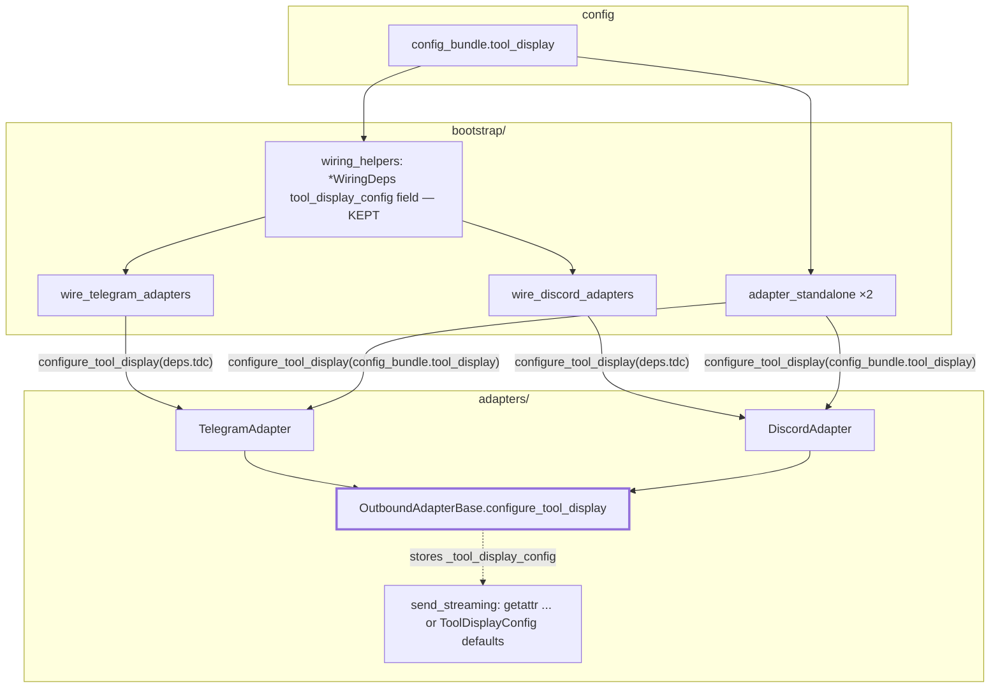
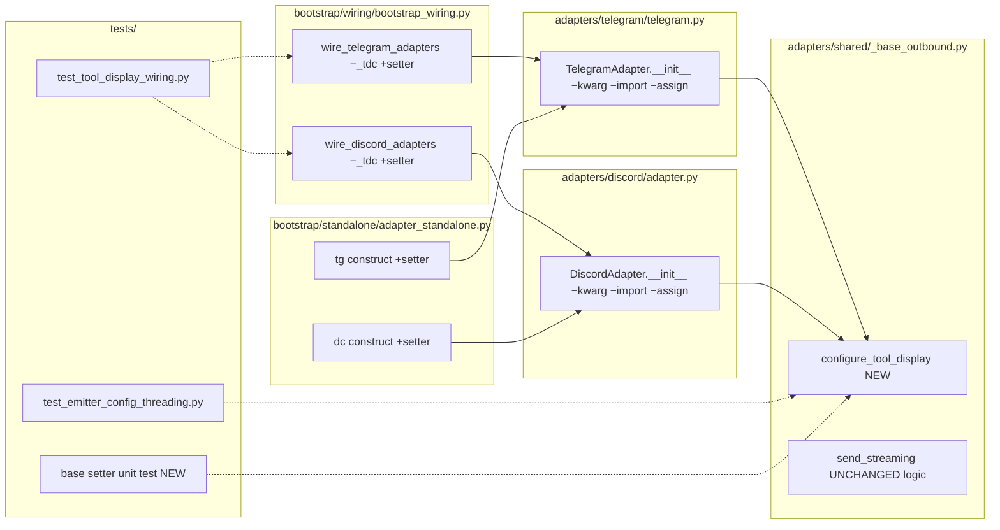

## Summary

Lift per-instance `tool_display_config` storage from copy-pasted adapter constructors into a single `configure_tool_display(cfg)` setter on `OutboundAdapterBase`; strip the kwarg/import/assignment from both adapters; route the 4 construction sites through the setter and drop the now-dead `_tdc` normalization; update the tests that locked in the old kwarg API.

## Architecture

### Data flow



### File × Function map



## Agents

| Agent | Task count | Files |
|-------|-----------|-------|
| backend-dev-A | 4 | `_base_outbound.py`, `telegram.py`, `discord/adapter.py`, `bootstrap_wiring.py`, `adapter_standalone.py`, `adapters/CLAUDE.md` |
| tester-A | 1 | `test_emitter_config_threading.py`, `test_tool_display_wiring.py`, new base setter test |

Single subject surface (`tool-display-storage`) across all impl tasks → no instance split required.

## Micro-Tasks

### Slice 1 — base setter

**T1** — Add `configure_tool_display` setter to `OutboundAdapterBase`
- File: `src/lyra/adapters/shared/_base_outbound.py`
- Snippet:
  ```python
  def configure_tool_display(self, config: ToolDisplayConfig | None) -> None:
      """Store the per-instance tool-display config (post-construction setter).

      OutboundAdapterBase has no __init__ (Discord MRO); this is the single
      permitted per-instance write point. Stores None as-is — defaulting to
      ToolDisplayConfig() happens only in send_streaming's read path.
      """
      self._tool_display_config = config
  ```
  Also reword the `:69` comment: `# Single site propagating tool_display_config to the emitter — see ADR-073.`
- Verify: `grep -n "def configure_tool_display" src/lyra/adapters/shared/_base_outbound.py`
- Expected: 1 match
- Agent: backend-dev-A · Subject: tool-display-storage · Spec trace: SC-1, SC-6(comment) · Slice V1 · Phase GREEN · Difficulty 1

### Slice 2 — refactor adapters + call sites + docs + tests

**T2** — Strip kwarg/import/assignment from both adapters
- Files: `src/lyra/adapters/telegram/telegram.py` (drop `:53` import, `:95` kwarg, `:98` assignment; keep `:97` `super().__init__()`), `src/lyra/adapters/discord/adapter.py` (drop `:57` import, `:99` kwarg, `:105` assignment)
- Verify: `grep -rn "self._tool_display_config" src/lyra/adapters/ | grep -v _base_outbound`
- Expected: no output
- Agent: backend-dev-A · Subject: tool-display-storage · Spec trace: SC-2, SC-3 · Slice V2 · Phase GREEN · Difficulty 2 · blockedBy T1

**T3** — Route 4 construction sites through setter; drop `_tdc` normalization
- Files: `src/lyra/bootstrap/wiring/bootstrap_wiring.py` (`wire_telegram_adapters`: drop `:90-93` `_tdc`, drop `tool_display_config=` kwarg at `:119`, add `adapter.configure_tool_display(deps.tool_display_config)` after construct; `wire_discord_adapters`: same at `:169-172`/`:232`), `src/lyra/bootstrap/standalone/adapter_standalone.py` (`:103-109` tg, `:261-269` dc: drop kwarg, add setter call after construct)
- Verify: `grep -rn "_tdc" src/lyra/bootstrap/wiring/bootstrap_wiring.py; grep -rn "configure_tool_display" src/lyra/bootstrap/`
- Expected: no `_tdc` matches; 4 `configure_tool_display` call sites
- Agent: backend-dev-A · Subject: tool-display-storage · Spec trace: SC-4, SC-5 · Slice V2 · Phase GREEN · Difficulty 3 · blockedBy T2

**T4** — Update `adapters/CLAUDE.md`
- File: `src/lyra/adapters/CLAUDE.md`
- Update the `OutboundAdapterBase` section: name `configure_tool_display` as the single per-instance write point; note it is a **post-construction setter, NOT `__init__`** (so the "do NOT add `__init__`" constraint is not conflated); mirror the `make_typing_factory` "define once" framing.
- Verify: `grep -n "configure_tool_display" src/lyra/adapters/CLAUDE.md`
- Expected: ≥1 match
- Agent: backend-dev-A · Subject: tool-display-storage · Spec trace: SC-8 · Slice V2 · Phase REFACTOR · Difficulty 1 · blockedBy T1

**T5** — Update + add tests for setter API
- Files: `tests/outbound/test_emitter_config_threading.py` (update `_make_tg_adapter`/`_make_dc_adapter` helpers to construct then `configure_tool_display(...)`; revise the SC-2 "accepts kwarg" assertion to "setter stores config"), `tests/bootstrap/test_tool_display_wiring.py` (flip assertions: 4 callsites call `configure_tool_display` instead of passing the kwarg), new unit test asserting `configure_tool_display` sets `_tool_display_config` and `None` stays `None` while `send_streaming` defaults.
- Verify: `uv run pytest tests/outbound/test_emitter_config_threading.py tests/bootstrap/test_tool_display_wiring.py tests/bootstrap/test_wiring_helpers.py tests/test_tool_display_config.py -q`
- Expected: all green
- Agent: tester-A · Subject: tool-display-storage · Spec trace: SC-1..SC-7 · Slice V2 · Phase RED-GATE · Difficulty 3 · blockedBy T3

## Wave Structure

4 waves, mostly sequential (single cohesive refactor, 1 impl instance + 1 tester). Elapsed ~same as sequential — parallelism limited by the atomic API change.

| Wave | Trigger | Agents | Tasks |
|------|---------|--------|-------|
| 1 | start | 1 | backend-dev-A: T1 |
| 2 | T1 done | 1 | backend-dev-A: T2→T4 (T4 ∥-safe after T1) |
| 3 | T2 done | 1 | backend-dev-A: T3 |
| 4 | T3 done | 1 | tester-A: T5 |

### Budget — per task

| Task | Items | Class | Est. ops | Split? |
|------|-------|-------|----------|--------|
| T1 setter | 1 | bounded | 3 | — |
| T2 strip adapters | 2 files | judgmental | 6 | — |
| T3 call sites | 4 sites | judgmental | 8 | — |
| T4 CLAUDE.md | 1 | bounded | 3 | — |
| T5 tests | 3 files | judgmental | 10 | — |

**Total estimated ops: ~30**

### Budget — per agent instance

| Instance | Tasks | Σ ops | Subjects | Split? |
|----------|-------|-------|----------|--------|
| backend-dev-A | T1, T2, T3, T4 | 20 | tool-display-storage | — (4 tasks ≤ 4; 1 subject) |
| tester-A | T5 | 10 | tool-display-storage | — |

## Task Seeding Blueprint

<!-- Used by /implement to seed TaskCreate calls. Format: T{n} | agent-instance | blockedBy | subject -->

### Wave 1 — no deps, 1 agent

| Task | Agent instance | blockedBy | Subject |
|------|---------------|-----------|---------|
| T1 | backend-dev-A | — | tool-display-storage |

### Wave 2 — after T1, 1 agent

| Task | Agent instance | blockedBy | Subject |
|------|---------------|-----------|---------|
| T2 | backend-dev-A | T1 | tool-display-storage |
| T4 | backend-dev-A | T1 | tool-display-storage |

### Wave 3 — after T2, 1 agent

| Task | Agent instance | blockedBy | Subject |
|------|---------------|-----------|---------|
| T3 | backend-dev-A | T2 | tool-display-storage |

### Wave 4 — after T3, 1 agent

| Task | Agent instance | blockedBy | Subject |
|------|---------------|-----------|---------|
| T5 | tester-A | T3 | tool-display-storage |

## Task IDs

<!-- Generated by /plan. Used by /implement to resume tasks on session restart. -->
- T1: 11 — tool-display-storage (setter)
- T2: 12 — tool-display-storage (strip adapters)
- T3: 13 — tool-display-storage (call sites + dead-norm)
- T4: 14 — tool-display-storage (CLAUDE.md)
- T5: 15 — tool-display-storage (tests)

## Consistency Report

- Success criteria covered: 8/8 (SC-1→T1, SC-2/3→T2, SC-4/5→T3, SC-6 grep→T2, SC-7 toolchain→T5+validate, SC-8→T4).
- Uncovered: none.
- Untraced tasks: none.
- Exemptions: `*WiringDeps.tool_display_config` fields kept by design (spec scope note).
