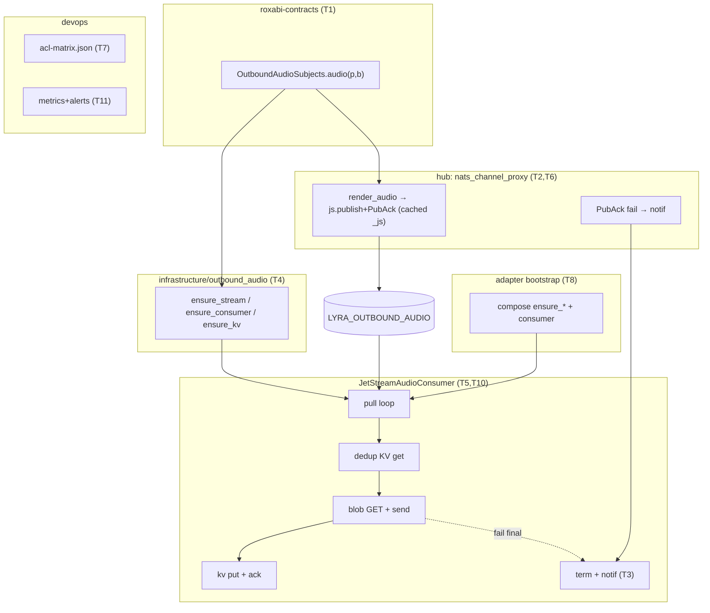
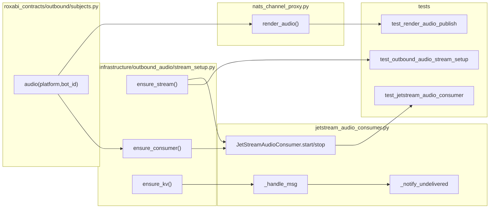

## Summary

Add JetStream delivery guarantee for outbound audio via a new `JetStreamAudioConsumer` stage
class + `infrastructure/outbound_audio/stream_setup.py`, hub `js.publish`+PubAck, persistent
KV dedup, and a unified "voice undelivered" notif. Two slices: V1 guaranteed delivery + notif;
V2 cross-restart KV dedup + monitoring.

## Architecture

## Bootstrap Context

Reference pattern (TurnPublisher α-pattern, ADR-075):
- `src/lyra/transport/turn_publisher.py` — `js.publish` + await PubAck shape (mirror for N2).
- `src/lyra/infrastructure/turn_writer/stream_setup.py` — `ensure_stream`/`ensure_consumer`
  idempotent pattern (mirror for N3).
- `src/lyra/bootstrap/standalone/turn_writer_standalone.py:73` — bootstrap composition order
  (ensure before start; mirror for T8).
- Existing notif precedent: `src/lyra/core/tts_dispatch.py:261-299` (`_route_outbound` on
  TTS-failure) — N6 reuses this shape, adapter-side.
- Dedup TTL precedent: `_terminated_streams` OrderedDict in `nats_outbound_listener.py`
  (in-memory; V1 only — V2 replaces with persistent KV).

## Agents

| Agent | Instance | Tasks | Files |
|-------|----------|-------|-------|
| backend-dev | backend-dev-A | T1, T2, T6 | contracts subjects, nats_channel_proxy |
| backend-dev | backend-dev-B | T4, T5, T10 | infrastructure/outbound_audio, jetstream_audio_consumer |
| backend-dev | backend-dev-C | T3, T8 | notif helper, adapter bootstrap |
| devops | devops-A | T7, T11 | acl-matrix.json, monitoring |
| doc-writer | doc-A | T13, T14 | ADR, outbound CLAUDE.md, deploy runbook |
| tester | tester-A | T9 | slice-1 tests |
| tester | tester-B | T12 | slice-2 tests |

architect consultation folded into `/code-review` (new stage module + infra module).

## Wave Structure

4 waves, max 4 parallel agents. Elapsed ~1 week vs ~2 weeks sequential.

| Wave | Trigger | Agents | Tasks |
|------|---------|--------|-------|
| 1 | start | 4 ∥ | backend-dev-A: T1 · backend-dev-C: T3 · devops-A: T7 · doc-A: T13 |
| 2 | Wave 1 done | 2 ∥ | backend-dev-A: T2→T6 · backend-dev-B: T4 |
| 3 | Wave 2 done | 1 | backend-dev-B: T5 ; then backend-dev-C: T8 |
| 4 | Wave 3 done | 4 ∥ | tester-A: T9 · backend-dev-B: T10 · devops-A: T11 · doc-A: T14 ; then tester-B: T12 |

### Budget — per task

| Task | Items | Class | Est. ops | Split? |
|------|-------|-------|----------|--------|
| T1 contracts subject helper | 2 | bounded | 4 | — |
| T2 render_audio js.publish | 1 | judgmental | 6 | — |
| T3 notif helper + i18n | 2 | bounded | 5 | — |
| T4 stream_setup (stream+consumer+kv) | 3 | judgmental | 10 | — |
| T5 JetStreamAudioConsumer | 1 | exploratory | 14 | — |
| T6 publish-fail notif wiring | 1 | bounded | 4 | — |
| T7 ACL grants + regen | 2 | judgmental | 8 | — |
| T8 bootstrap compose | 1 | judgmental | 8 | — |
| T9 slice-1 tests | 5 | judgmental | 18 | — |
| T10 KV dedup swap | 1 | judgmental | 6 | — |
| T11 monitoring metrics+alerts | 3 | judgmental | 10 | — |
| T12 slice-2 tests | 2 | judgmental | 10 | — |
| T13 ADR + CLAUDE.md | 2 | bounded | 6 | — |
| T14 deploy runbook | 1 | bounded | 4 | — |

**Total estimated ops: ~113**

### Budget — per agent instance

| Instance | Tasks | Σ ops | Subjects | Split? |
|----------|-------|-------|----------|--------|
| backend-dev-A | T1, T2, T6 | 14 | contracts, publish | — |
| backend-dev-B | T4, T5, T10 | 30 | jetstream-infra, consumer | — |
| backend-dev-C | T3, T8 | 13 | notif, bootstrap | — |
| devops-A | T7, T11 | 18 | acl, monitoring | — |
| doc-A | T13, T14 | 10 | adr, runbook | — |
| tester-A | T9 | 18 | tests | — |
| tester-B | T12 | 10 | tests | — |

All instances within caps (≤4 tasks, ≤2 subjects, ≤50 ops).

## Consistency Report

Spec criteria → tasks (10 SC + 1 χ covered):
- SC publish PubAck / cached ctx → T2 · SC publish-fail notif → T6 · SC redelivery exactly-once → T5,T9
- SC offline-restart + 24h bound → T5,T9,T11 · SC in-proc dedup → T5,T9 · SC cross-restart KV dedup → T10,T12
- SC terminal term+notif → T3,T5,T9 · SC stage placement (no NatsOutboundListener change) → T5,T8
- SC ACL grants + runbook → T7,T14 · SC monitoring metrics → T11 · SC test outcomes → T9,T12
- χ#1 ADR + CLAUDE.md → T13
Untraced tasks: none. Uncovered criteria: none.

## Micro-Tasks

### Slice V1 — Guaranteed delivery + user-visible failure

**T1** [P] `OutboundAudioSubjects.audio(platform, bot_id)` helper + package export
- File: `packages/roxabi-contracts/src/roxabi_contracts/outbound/subjects.py` (new), `__init__.py`
- Snippet: `def audio(platform: str, bot_id: str) -> str: return f"lyra.outbound.audio.{platform}.{bot_id}"` (+ `STREAM_AUDIO = "LYRA_OUTBOUND_AUDIO"`)
- Verify: `uv run python -c "from roxabi_contracts.outbound import OutboundAudioSubjects as S; assert S.audio('telegram','x')=='lyra.outbound.audio.telegram.x'"`
- Agent: backend-dev-A · Subject: contracts · Trace: N1 · Slice V1 · Phase GREEN · Diff 1

**T3** [P] `voice_undelivered` localized message + shared `notify_undelivered` helper
- File: notif helper (co-locate near `tts_dispatch` notif or a small `outbound_audio` notif util) + i18n strings
- Verify: `uv run pytest -k voice_undelivered_msg -q`
- Agent: backend-dev-C · Subject: notif · Trace: N6 · Slice V1 · Phase GREEN · Diff 2

**T7** [P] ACL grants in `acl-matrix.json` + regenerate `auth.conf`
- File: `deploy/nats/acl-matrix.json`, regenerated `deploy/nats/auth.conf`
- Detail: hub publish `lyra.outbound.audio.>`; telegram/discord subscribe `lyra.outbound.audio.>`; adapter `$JS.API.STREAM.{CREATE,INFO,UPDATE}.LYRA_OUTBOUND_AUDIO`, `$JS.API.CONSUMER.{CREATE,INFO}.LYRA_OUTBOUND_AUDIO.*`, `$JS.API.CONSUMER.MSG.NEXT.LYRA_OUTBOUND_AUDIO.*`, `$KV.lyra_outbound_audio_sent.>`
- Verify: `uv run python deploy/nats/regen_auth.py --check` (or repo's regen tool) ; grep new subjects present
- Agent: devops-A · Subject: acl · Trace: N7 · Slice V1 · Phase GREEN · Diff 3

**T2** `render_audio` → `self._js.publish(subj, payload, headers={"Nats-Msg-Id": stream_id})` await PubAck; cache `self._js = nc.jetstream()` at init
- File: `src/lyra/nats/nats_channel_proxy.py`
- Verify: `uv run pytest -k render_audio_publish -q` (asserts js.publish called w/ Nats-Msg-Id, PubAck awaited)
- Agent: backend-dev-A · Subject: publish · Trace: N2 · Slice V1 · Phase GREEN · Diff 3 · blockedBy T1

**T4** `infrastructure/outbound_audio/stream_setup.py`: `ensure_stream` (Limits, `lyra.outbound.audio.>`, 32 MiB, 24h, dup 60s), `ensure_consumer` (AckExplicit, AckWait 90s, MaxDeliver 5, filter), `ensure_kv` (`lyra_outbound_audio_sent`, TTL ≥ AckWait×MaxDeliver+margin) + CLAUDE.md
- File: `src/lyra/infrastructure/outbound_audio/stream_setup.py` (new), `src/lyra/infrastructure/outbound_audio/CLAUDE.md`
- Verify: `uv run pytest -k outbound_audio_stream_setup -q` (idempotent ensure)
- Agent: backend-dev-B · Subject: jetstream-infra · Trace: N3,N5 · Slice V1 · Phase GREEN · Diff 4 · blockedBy T1

**T5** `JetStreamAudioConsumer` stage class: durable pull loop, in-memory dedup (V1), blob GET → send → ack on success, `term()`+notif on final fail, `start()`/`stop()` (loop task cancelled)
- File: `src/lyra/adapters/nats/jetstream_audio_consumer.py` (new)
- Verify: `uv run pytest -k jetstream_audio_consumer -q`
- Agent: backend-dev-B · Subject: consumer · Trace: N4,N5,N6 · Slice V1 · Phase GREEN · Diff 5 · blockedBy T4,T3

**T6** publish-fail handling in proxy: PubAck-fail/raise → log + fire notify_undelivered (no swallow)
- File: `src/lyra/nats/nats_channel_proxy.py`
- Verify: `uv run pytest -k render_audio_puback_fail -q`
- Agent: backend-dev-A · Subject: publish · Trace: N2b · Slice V1 · Phase GREEN · Diff 3 · blockedBy T2,T3

**T8** adapter bootstrap: call `ensure_stream/ensure_consumer/ensure_kv` then construct + start `JetStreamAudioConsumer` (mirror turn_writer_standalone order)
- File: `src/lyra/bootstrap/...` (adapter standalone wiring)
- Verify: `uv run pytest -k bootstrap_audio_consumer -q` ; `uv run lyra adapter telegram --dry-run` boots without error
- Agent: backend-dev-C · Subject: bootstrap · Trace: N3→N4 · Slice V1 · Phase GREEN · Diff 4 · blockedBy T4,T5,T2

**T9** slice-1 tests (outcome assertions): redelivery-after-glitch exactly-once · offline-then-restart delivers · terminal → exactly one notif · publish-fail → notif · in-proc lost-ack → no double-send
- File: `tests/.../test_outbound_audio_delivery.py` (new)
- Verify: `uv run pytest -k outbound_audio_delivery -q`
- Agent: tester-A · Subject: tests · Trace: SC1-5,7 · Slice V1 · Phase RED→GREEN · Diff 4 · blockedBy T8

**RG-V1** RED-GATE V1 — all slice-1 success criteria green
- Verify: `uv run pytest -k "outbound_audio" -q && uv run ruff check . && uv run pyright`
- Agent: tester-A · Subject: tests · Slice V1 · Phase RED-GATE · blockedBy T9

### Slice V2 — Cross-restart dedup + observability

**T10** replace in-memory dedup with persistent JetStream KV: `kv.get(stream_id)` before send, `kv.put(stream_id)` before ack
- File: `src/lyra/adapters/nats/jetstream_audio_consumer.py`
- Verify: `uv run pytest -k audio_kv_dedup -q`
- Agent: backend-dev-B · Subject: consumer · Trace: N5 · Slice V2 · Phase GREEN · Diff 4 · blockedBy T5

**T11** [P] monitoring: `term()` count, redelivery rate, consumer-lag metrics + alerts (term>0, lag→24h, stream>80%)
- File: monitoring config + emit sites in consumer
- Verify: `uv run pytest -k audio_metrics -q` ; alert rules present
- Agent: devops-A · Subject: monitoring · Trace: N8 · Slice V2 · Phase GREEN · Diff 3 · blockedBy T5

**T12** slice-2 tests: cross-restart lost-ack → KV suppresses second send (zero double-send) · `term()` metric increments
- File: `tests/.../test_outbound_audio_dedup.py` (new)
- Verify: `uv run pytest -k outbound_audio_dedup -q`
- Agent: tester-B · Subject: tests · Trace: SC6,9 · Slice V2 · Phase RED→GREEN · Diff 4 · blockedBy T10,T11

**RG-V2** RED-GATE V2 — all slice-2 criteria green
- Verify: `uv run pytest -k "outbound_audio" -q`
- Agent: tester-B · Subject: tests · Slice V2 · Phase RED-GATE · blockedBy T12

### Cross-cutting

**T13** [P] ADR for `lyra.outbound.audio.*` subject naming (ADR-035 axis) + outbound CLAUDE.md subject table
- File: `docs/architecture/adr/0XX-outbound-audio-subject.mdx`, `src/lyra/outbound/CLAUDE.md` (+ `src/lyra/nats/CLAUDE.md` table)
- Verify: `ls docs/architecture/adr/*outbound-audio*` ; grep subject in CLAUDE.md
- Agent: doc-A · Subject: adr · Trace: χ#1 · Phase GREEN · Diff 2

**T14** deploy runbook: order ACL→stream→hub→adapter + rollback, in QUADLET-DEPLOYMENT.md
- File: `docs/QUADLET-DEPLOYMENT.md`
- Verify: grep "outbound.audio" + rollback section
- Agent: doc-A · Subject: runbook · Trace: N7 · Phase GREEN · Diff 2 · blockedBy T7,T8

## Task Seeding Blueprint

<!-- Used by /implement to seed TaskCreate calls. T{n} | agent-instance | blockedBy | subject -->

### Wave 1 — no deps, 4 agents ∥

| Task | Agent instance | blockedBy | Subject |
|------|---------------|-----------|---------|
| T1 | backend-dev-A | — | contracts |
| T3 | backend-dev-C | — | notif |
| T7 | devops-A | — | acl |
| T13 | doc-A | — | adr |

### Wave 2 — after Wave 1, 2 agents ∥

| Task | Agent instance | blockedBy | Subject |
|------|---------------|-----------|---------|
| T2 | backend-dev-A | T1 | publish |
| T4 | backend-dev-B | T1 | jetstream-infra |

### Wave 3 — after Wave 2

| Task | Agent instance | blockedBy | Subject |
|------|---------------|-----------|---------|
| T5 | backend-dev-B | T4,T3 | consumer |
| T6 | backend-dev-A | T2,T3 | publish |
| T8 | backend-dev-C | T4,T5,T2 | bootstrap |

### Wave 4 — after Wave 3, 4 agents ∥

| Task | Agent instance | blockedBy | Subject |
|------|---------------|-----------|---------|
| T9 | tester-A | T8 | tests |
| RG-V1 | tester-A | T9 | tests |
| T10 | backend-dev-B | T5 | consumer |
| T11 | devops-A | T5 | monitoring |
| T14 | doc-A | T7,T8 | runbook |
| T12 | tester-B | T10,T11 | tests |
| RG-V2 | tester-B | T12 | tests |

## Task IDs

<!-- Generated by /plan. Used by /implement to resume tasks on session restart. -->
- T1: 10 — contracts
- T3: 11 — notif
- T7: 12 — acl
- T13: 13 — adr
- T2: 14 — publish
- T4: 15 — jetstream-infra
- T5: 16 — consumer
- T6: 17 — publish
- T8: 18 — bootstrap
- T9: 19 — tests (V1)
- RG-V1: 20 — tests (V1 gate)
- T10: 21 — consumer (KV)
- T11: 22 — monitoring
- T12: 23 — tests (V2)
- RG-V2: 24 — tests (V2 gate)
- T14: 25 — runbook
