## Summary

Collapse **18 genuine `PLR0913` sites** — all **12 helper functions** + **5 small/medium
constructors** + **1 Category-D free site** — into colocated `frozen` deps dataclasses, dropping
`DEBT:wiring-bootstrap-deps` from **47 → 29** (≤30 hard target, 1-unit margin). Behaviour-preserving;
the existing suite is the oracle. The **5 high-fan-out constructors** (`Hub`, `Agent`, `Pool`,
`DiscordAdapter`, `TelegramAdapter`), all `C901`/Port-Protocol sites, and the contract-locked
`llm/decorators` are **deferred/excluded** — see scope finding below.

## Scope finding (changes the spec's assumption — flag at gate)

The frame's first fan-out read (`Constructor( → N test files`) **over-counted via substring match**
and assumed a central test builder absorbs constructor churn. Verified ground truth:

- **`tests/helpers/builders.py` does not exist.** No central `make_hub`/`make_agent`. Tests
  construct `Hub(...)`, `Agent(...)`, adapters **directly and inline** → collapsing those
  `__init__` signatures fans out across dozens of test lines with no shim.
- **`llm/decorators.py ×4`** (`RetryingLlmProvider`, `CircuitBreakerLlmProvider`) mirror the
  `LlmProvider` Protocol's `complete`/`stream` — collapsing them breaks the port contract. They are
  **Category-C**, not the "genuine PLR0913 reserve" the spec assumed.

Verified call-site churn (instantiation lines, src+tests, def/annotation/import excluded):

| Class | Cat-A markers | churn (call-sites) | scope |
|---|---|---|---|
| OutboundRouter | 1 | **2** | ✅ collapse |
| NatsOutboundListener | 1 | **9** | ✅ collapse |
| CommandRouter | 1 | **12** | ✅ collapse |
| CliPool | 1 | **15** | ✅ collapse |
| Authenticator (`__init__`) | 1 | **18** | ✅ collapse |
| Pool (`__init__`, ×2 markers) | 2 | **42** | ❌ defer |
| TelegramAdapter | 1 | **43** | ❌ defer |
| Agent | 1 | **44** | ❌ defer |
| DiscordAdapter | 1 | **56** | ❌ defer |
| Hub | 1 | **93** | ❌ defer |

12 helper functions (churn 2–11 each, Σ≈59) collapse cheaply. Deferring the 5 mega-constructors
(Σ≈278 call-sites) keeps this F-lite. **Math:** 12 helpers + 5 small ctors = 17 → **30** (zero
margin); + 1 free Category-D site (`build_generate_kwargs`, 1 caller) = 18 → **29** (1 margin).
Reaching ≤28 would require a mega-constructor (≥42 edits) or a contract-locked site — not F-lite.

## Architecture

### Refactor pattern (per site)

```mermaid
flowchart LR
    B["fn(a, b, c, d, e, f)<br/># noqa: PLR0913 — DEBT:wiring-bootstrap-deps"]
    D["@dataclass(frozen=True)<br/>class XxxDeps: a; b; c; d; e; f<br/>(colocated, inline in same module)"]
    F["fn(deps: XxxDeps)<br/>noqa + marker removed; ruff green"]
    C["all call-sites:<br/>construct XxxDeps(...) and pass"]
    B -->|collapse| D --> F --> C
    style B fill:#3a2020
    style D fill:#203a20
    style F fill:#203a20
```

### Site → deps map (18 collapses)

```mermaid
flowchart LR
    subgraph adapters["adapters/ — 6 sites"]
        DN["discord_normalize::normalize"] --> a1[NormalizeDeps]
        DT["discord_threads::persist_thread_session"] --> a2[ThreadPersistDeps]
        DI["discord_inbound::_try_auto_create_thread ⚠300"] --> a3[AutoThreadDeps]
        TN["telegram_normalize::_build_routing"] --> a4[RoutingDeps]
        SH["shared/_shared::push_to_hub_guarded"] --> a5[PushGuardDeps]
        NL["nats/nats_outbound_listener::__init__"] --> a6[ListenerDeps]
    end
    subgraph core["core/ — 11 sites"]
        MP["middleware_pool::_dispatch_command"] --> c1[DispatchDeps]
        PO["pool_observer::log_turn_async"] --> c2[TurnLogDeps]
        PS["pool_processor_streaming::build_streaming_turn_logger"] --> c3[StreamLogDeps]
        FB["authenticator::from_bot_store"] --> c4[FromBotStoreDeps]
        AU["authenticator::__init__"] --> c5[AuthenticatorDeps]
        AB["agent_builder::_assemble_agent"] --> c6[AssembleDeps]
        HC["builtin_commands::help_command"] --> c7[CommandContext]
        CC["builtin_commands::config_command"] --> c7
        OR["hub/outbound/outbound_router::__init__"] --> c8[OutboundRouterDeps]
        CR["commands/command_router::__init__"] --> c9[CommandRouterDeps]
        CP["cli/cli_pool::__init__"] --> c10[CliPoolDeps]
    end
    subgraph other["nats/ — 1 site (Category-D, free)"]
        TE["tts_engine_selector::build_generate_kwargs"] --> o1[GenerateKwargsDeps]
    end
    style adapters fill:#1f2a3a
    style core fill:#1f2a3a
    style other fill:#2a2a1f
```

## Bootstrap Context — layer & gate constraints (AC7)

- `core/` and `adapters/` must **not** import `lyra.bootstrap` (import-linter cycle). The Phase-6
  containers (`BuildHubDeps`, …) are therefore **unreachable** — every deps object is a **colocated
  inline `frozen` dataclass**. "Reuse a Phase-6 container" is vacuous here; colocate is the only
  layer-legal path. AC7 ("no new parallel *wiring* container") is satisfied: these are
  domain-local value objects, not bootstrap wiring.
- **No new files** → folder ≤12 gate untouched (relevant since `core/cli`=14 and `core/agent`=14
  are at-exemption). Dataclasses go **inline** in the constructor's own module.
- **300-line gate:** only one at-risk file is touched — `adapters/discord/discord_inbound.py`
  (currently **300**, *not* exempt). Adding `AutoThreadDeps` inline → ~305. Resolution: add a
  `tools/file_exemptions.txt` entry with `#1494` rationale (debt-paydown DI object). `command_router.py`
  (310) and `cli_pool.py` (345) are **already exempt**; `adapter.py`/`telegram.py` are **not touched**
  (mega-constructors deferred).

## Agents

7 backend-dev instances + tester. Each ≤4 tasks, ≤2 subjects. Each owns disjoint source files.

| Instance | Tasks | Files | Subjects |
|---|---|---|---|
| backend-dev-A | T1–T3 | `adapters/discord/{discord_normalize,discord_threads,discord_inbound}.py` | discord |
| backend-dev-B | T4–T6 | `adapters/telegram/telegram_normalize.py`, `adapters/shared/_shared.py`, `adapters/nats/nats_outbound_listener.py` | telegram, adapters-io |
| backend-dev-C | T7–T9 | `core/commands/{command_router,builtin_commands}.py` | commands |
| backend-dev-D | T10–T11 | `core/auth/authenticator.py` (×2 markers) | auth |
| backend-dev-E | T12–T13 | `core/hub/outbound/outbound_router.py`, `core/hub/middleware/middleware_pool.py` | hub |
| backend-dev-F | T14–T16 | `core/pool/{pool_observer,pool_processor_streaming}.py`, `core/cli/cli_pool.py` | pool-aux |
| backend-dev-G | T17–T18 | `core/agent/agent_builder.py`, `nats/tts_engine_selector.py` | agent, nats-tts |
| tester-A | T19–T20 | full suite + gates + grep assertions | validation |

## Wave Structure

3 waves, max 7 parallel (runtime caps concurrency). All 18 collapses are independent (disjoint
files/functions, no inter-dependency) → one fan-out wave, then gate, then validate.

| Wave | Trigger | Agents | Tasks |
|---|---|---|---|
| 1 | start | 7 ∥ | A:T1→T2→T3 · B:T4→T5→T6 · C:T7→T8→T9 · D:T10→T11 · E:T12→T13 · F:T14→T15→T16 · G:T17→T18 |
| 2 | Wave 1 done | 1 | RED-GATE T19: full `ruff+pyright+pytest+lint-imports` green |
| 3 | T19 green | 1 | tester-A T20: count = 29 (≤30); B/C markers intact; frozen+colocated audit |

### Budget — per task

| Task group | Items | Class | Est. ops | Split? |
|---|---|---|---|---|
| T1–T6 adapters | 6 | bounded–judgmental | 24 | — |
| T7–T9 commands | 3 | judgmental | 14 | — |
| T10–T11 auth | 2 | judgmental | 12 | — |
| T12–T13 hub | 2 | judgmental | 9 | — |
| T14–T16 pool-aux | 3 | judgmental | 15 | — |
| T17–T18 agent/nats-tts | 2 | bounded–judgmental | 8 | — |
| T19 RED-GATE | 1 | bounded | 3 | — |
| T20 validate | 1 | judgmental | 6 | — |

**Total estimated ops: ~91** (no task > 50).

### Budget — per agent instance

| Instance | Tasks | Σ ops | Subjects | Split? |
|---|---|---|---|---|
| backend-dev-A | T1,T2,T3 | 12 | discord (1) | — |
| backend-dev-B | T4,T5,T6 | 14 | telegram, adapters-io (2) | — |
| backend-dev-C | T7,T8,T9 | 14 | commands (1) | — |
| backend-dev-D | T10,T11 | 12 | auth (1) | — |
| backend-dev-E | T12,T13 | 9 | hub (1) | — |
| backend-dev-F | T14,T15,T16 | 15 | pool-aux (1) | — |
| backend-dev-G | T17,T18 | 8 | agent, nats-tts (2) | — |
| tester-A | T19,T20 | 9 | validation (1) | — |

All instances ≤ 50 ops, ≤ 4 tasks, ≤ 2 subjects. No split required.

## Consistency Report

Spec Success Criteria → tasks (7/7 covered):

| Spec SC | Covered by |
|---|---|
| SC1 `grep` count ≤ 30 | T1–T18 collapse + T20 assertion (lands 29) |
| SC2 noqa removed ∧ ruff green | every collapse removes the marker; T19 ruff gate |
| SC3 5 Cat-B (C901) + 5 Cat-C (Port) untouched | excluded from scope; T20 asserts both marker-sets still present (5 C901: pool_processor, tts_dispatch, discord_audio, telegram_normalize::normalize, outbound/emitter) |
| SC4 `pytest` green | T19 RED-GATE + per-task local runs |
| SC5 `pyright` + `lint-imports` | T19 |
| SC6 `ruff format --check` + file ≤300 / folder ≤12 | T19 + T20 (discord_inbound exemption noted) |
| SC7 deps objects frozen + colocated, no new wiring container | every collapse; T20 greps new `*Deps` for `frozen=True` + asserts no `lyra.bootstrap` import added in core/adapters |

Uncovered: none. Untraced tasks: none.

**Deviations from spec (require gate acknowledgement):**
1. Spec S2 listed **Pool** (+ Hub/Agent) and S1 the adapters among collapses → **deferred** (mega-constructor churn, no test builder). Recommend a follow-up issue "collapse high-fan-out constructors (Hub/Agent/Pool/DiscordAdapter/TelegramAdapter) once a shared test builder exists."
2. Lands at **29**, not the spec-risk-row's ≤28 — reaching 28 needs a mega-constructor or contract-locked site, both out of F-lite appetite.
3. Spec S3 reserve `llm/decorators ×4` are **Port-mirrors** (contract-locked), not usable; only `nats/tts_engine_selector::build_generate_kwargs` (1 caller) is a free Category-D win, and it is used.
4. Single PR (~16 source files + call-sites). Homogeneous; split S1/S2 offered if preferred.

## Micro-Tasks

**Per-site recipe (all 18, REFACTOR phase, behaviour-preserving):**
1. Add `@dataclass(frozen=True) class <Name>Deps:` **inline** in the same module (above the fn).
2. `fn(a, b, …) → fn(deps: <Name>Deps)`; rewrite body refs to `deps.<field>`. Preserve
   optional/default semantics (constructors with all-optional kwargs → `deps: <Name>Deps | None = None`
   then `d = deps or <Name>Deps()`, so bare `Cls()` call-sites stay unchanged).
3. **Delete** the entire `# noqa: PLR0913 — DEBT:wiring-bootstrap-deps` comment.
4. Update **all** call-sites (prod + tests) to construct `<Name>Deps(...)`.
5. Verify: `uv run ruff check <file>` green (no re-added PLR0913) ∧ local `pytest -k <area>` green.

### Wave 1 — collapses (all ∥, chained per instance)

| T | Site (`file::fn`) | Deps | churn | Verify |
|---|---|---|---|---|
| T1 | `adapters/discord/discord_normalize.py::normalize` | NormalizeDeps | 11 | ruff + `pytest -k discord_normalize` |
| T2 | `adapters/discord/discord_threads.py::persist_thread_session` | ThreadPersistDeps | 3 | ruff + `pytest -k thread` |
| T3 | `adapters/discord/discord_inbound.py::_try_auto_create_thread` ⚠300 | AutoThreadDeps | 2 | ruff + `wc -l` (add #1494 exemption if >300) |
| T4 | `adapters/telegram/telegram_normalize.py::_build_routing` | RoutingDeps | 3 | ruff + `pytest -k normalize` |
| T5 | `adapters/shared/_shared.py::push_to_hub_guarded` | PushGuardDeps | 5 | ruff + `pytest -k push_to_hub` |
| T6 | `adapters/nats/nats_outbound_listener.py::__init__` | ListenerDeps | 9 | ruff + `pytest -k outbound_listener` |
| T7 | `core/commands/command_router.py::__init__` (exempt 310) | CommandRouterDeps | 12 | ruff + `pytest -k command_router` |
| T8 | `core/commands/builtin_commands.py::help_command` | CommandContext | 6 | ruff + `pytest -k builtin` |
| T9 | `core/commands/builtin_commands.py::config_command` | CommandContext (reuse T8) | 6 | ruff + `pytest -k builtin` |
| T10 | `core/auth/authenticator.py::__init__` | AuthenticatorDeps | 18 | ruff + `pytest -k auth` |
| T11 | `core/auth/authenticator.py::from_bot_store` | FromBotStoreDeps | 8 | ruff + `pytest -k from_bot_store` |
| T12 | `core/hub/outbound/outbound_router.py::__init__` | OutboundRouterDeps | 2 | ruff (1 prod call-site) |
| T13 | `core/hub/middleware/middleware_pool.py::_dispatch_command` | DispatchDeps | 5 | ruff + `pytest -k middleware` |
| T14 | `core/pool/pool_observer.py::log_turn_async` | TurnLogDeps | 8 | ruff + `pytest -k observer` |
| T15 | `core/pool/pool_processor_streaming.py::build_streaming_turn_logger` | StreamLogDeps | 2 | ruff + `pytest -k streaming` |
| T16 | `core/cli/cli_pool.py::__init__` (exempt 345) | CliPoolDeps | 15 | ruff + `pytest -k cli_pool` |
| T17 | `core/agent/agent_builder.py::_assemble_agent` | AssembleDeps | 2 | ruff + `pytest -k agent_builder` |
| T18 | `nats/tts_engine_selector.py::build_generate_kwargs` | GenerateKwargsDeps | 1 | ruff + `pytest -k tts_engine` |

### Wave 2–3 — gate + validate

| T | Phase | Description | Verify |
|---|---|---|---|
| T19 | RED-GATE | full repo green after all 18 collapses | `uv run ruff format --check . && uv run ruff check src/lyra/ && uv run pyright && uv run lint-imports && uv run pytest` |
| T20 | validate | acceptance assertions | `grep -rho "DEBT:wiring-bootstrap-deps" src/lyra/ \| wc -l` = **29** (≤30); 5 C901 markers (4 core+adapters + `outbound/emitter.py`) + 5 Port markers still present; every new `*Deps` has `frozen=True`; no `import lyra.bootstrap` added under `core/`/`adapters/`; file ≤300 / folder ≤12 gates pass |

## Task Seeding Blueprint

<!-- Used by /implement. blockedBy refs T-numbers (not session IDs). Seed in wave order.
     Same agent_instance = same agent session; chained tasks (T1→T2) keep separate rows. -->

### Wave 1 — no deps, 7 agents ∥

| Task | Agent instance | blockedBy | Subject |
|------|---------------|-----------|---------|
| T1 | backend-dev-A | — | discord |
| T2 | backend-dev-A | T1 | discord |
| T3 | backend-dev-A | T2 | discord |
| T4 | backend-dev-B | — | telegram |
| T5 | backend-dev-B | T4 | adapters-io |
| T6 | backend-dev-B | T5 | adapters-io |
| T7 | backend-dev-C | — | commands |
| T8 | backend-dev-C | T7 | commands |
| T9 | backend-dev-C | T8 | commands |
| T10 | backend-dev-D | — | auth |
| T11 | backend-dev-D | T10 | auth |
| T12 | backend-dev-E | — | hub |
| T13 | backend-dev-E | T12 | hub |
| T14 | backend-dev-F | — | pool-aux |
| T15 | backend-dev-F | T14 | pool-aux |
| T16 | backend-dev-F | T15 | pool-aux |
| T17 | backend-dev-G | — | agent |
| T18 | backend-dev-G | T17 | nats-tts |

### Wave 2 — after all collapses

| Task | Agent instance | blockedBy | Subject |
|------|---------------|-----------|---------|
| T19 | backend-dev-A | T3,T6,T9,T11,T13,T16,T18 | red-gate |

### Wave 3 — after RED-GATE

| Task | Agent instance | blockedBy | Subject |
|------|---------------|-----------|---------|
| T20 | tester-A | T19 | validation |

## Risks

| Risk | Mitigation |
|---|---|
| `discord_inbound.py` (300) tips over the file gate | add honest `#1494` `file_exemptions.txt` entry (DI object for debt paydown) — never a new file (folder gate) |
| All-optional constructors (`Authenticator`, `CliPool`) — bare `Cls()` must keep working | `deps: <X>Deps \| None = None` → `deps or <X>Deps()`; only kwarg-passing call-sites change |
| A collapse turns out infeasible → lands at 30 (still passes) or 31 | T20 re-greps; fallback lever = `nats/nats_bus.py::__init__` (~28 mechanical edits) or a deferred mega-constructor; documented, not silent |
| Marker stripped without real collapse (#1162 trap) | T19 ruff-green *without* noqa proves collapse; T20 asserts 4 C901 + 5 Port markers untouched |
| Cross-agent test-file overlap (e.g. tests/nats) | each instance edits only its own site's call-sites; disjoint test modules per site |

## Task IDs

<!-- Generated by /plan (Step 6a/6b). Used by /implement to resume after session restart. -->
- T1: 21 — discord (discord_normalize::normalize → NormalizeDeps)
- T2: 22 — discord (discord_threads::persist_thread_session → ThreadPersistDeps)
- T3: 23 — discord (discord_inbound::_try_auto_create_thread → AutoThreadDeps)
- T4: 24 — telegram (telegram_normalize::_build_routing → RoutingDeps)
- T5: 25 — adapters-io (shared/_shared::push_to_hub_guarded → PushGuardDeps)
- T6: 26 — adapters-io (nats_outbound_listener::__init__ → ListenerDeps)
- T7: 27 — commands (command_router::__init__ → CommandRouterDeps)
- T8: 28 — commands (builtin_commands::help_command → CommandContext)
- T9: 29 — commands (builtin_commands::config_command → CommandContext reuse)
- T10: 30 — auth (authenticator::__init__ → AuthenticatorDeps)
- T11: 31 — auth (authenticator::from_bot_store → FromBotStoreDeps)
- T12: 32 — hub (outbound_router::__init__ → OutboundRouterDeps)
- T13: 33 — hub (middleware_pool::_dispatch_command → DispatchDeps)
- T14: 34 — pool-aux (pool_observer::log_turn_async → TurnLogDeps)
- T15: 35 — pool-aux (pool_processor_streaming::build_streaming_turn_logger → StreamLogDeps)
- T16: 36 — pool-aux (cli_pool::__init__ → CliPoolDeps)
- T17: 37 — agent (agent_builder::_assemble_agent → AssembleDeps)
- T18: 38 — nats-tts (tts_engine_selector::build_generate_kwargs → GenerateKwargsDeps)
- T19: 39 — red-gate (full repo green)
- T20: 40 — validation (acceptance assertions, count=29)
