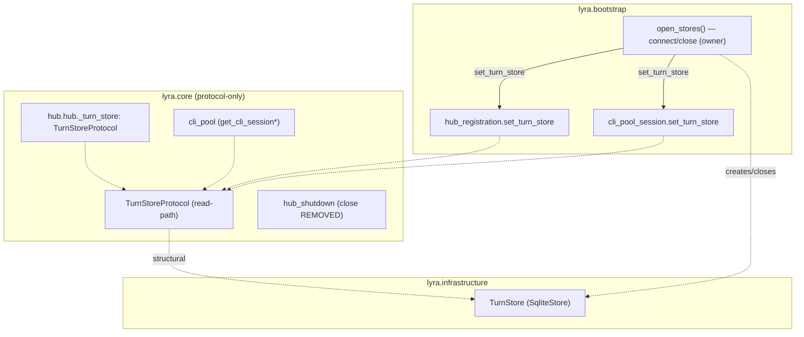

## Summary

Retype the 4 `lyra.core` read-path consumers of `TurnStore` to `TurnStoreProtocol`, delete
the redundant `hub_shutdown` close (bootstrap owns lifecycle), remove all 5 `.importlinter`
turn_store exemptions, and discharge ADR-078.

## Architecture

**Coupling constraint:** `hub.py` / `hub_registration.py` / `hub_shutdown.py` all reference
the single `Hub._turn_store` field. Retyping it to `TurnStoreProtocol` (no `close()`) while
`hub_shutdown` still calls `.close()` breaks pyright. → the hub trio (T1+T2+T3) is **one
atomic edit group**. The cli pair (T4) is independent (separate `_turn_store` field).

## Agents

| Agent instance | Tasks | Files |
|---|---|---|
| backend-dev-A | T1–T6 | hub.py, hub_registration.py, hub_shutdown.py, cli_pool.py, cli_pool_session.py, .importlinter |
| tester-A | T7 | tests for bootstrap→shutdown close-once |
| doc-writer-A | T8 | docs/architecture/adr/078-turn-store-protocol.mdx |

## Micro-Tasks

### Slice S1 + S2 — hub trio (atomic) · backend-dev-A

- **T1** — `hub.py`: change `self._turn_store: TurnStore | None` → `TurnStoreProtocol | None`;
  swap TYPE_CHECKING import `...stores.turn_store import TurnStore` → `core.stores.turn_store_protocol import TurnStoreProtocol`.
  Verify: `grep -n TurnStoreProtocol src/lyra/core/hub/hub.py`. Difficulty 2. Subject: turn-store-typing.
- **T2** — `hub_registration.py`: `set_turn_store(store: TurnStoreProtocol)` + field annotation
  `_turn_store: TurnStoreProtocol | None`; swap import. (forwards to `register_turn_store`, already protocol).
  Verify: `grep -n "def set_turn_store" src/lyra/core/hub/hub_registration.py`. Difficulty 2. Subject: turn-store-typing.
- **T3** — `hub_shutdown.py`: **delete** `if self._turn_store is not None: await self._turn_store.close()`;
  drop the `_turn_store` TYPE_CHECKING import + field annotation (if now unused). Leave `_message_index`/`_memory` closes untouched (out of scope).
  Verify: `! grep -n "_turn_store.close" src/lyra/core/hub/hub_shutdown.py`. Difficulty 2. Subject: lifecycle.

### Slice S1 — cli pair (independent) · backend-dev-A

- **T4** — `cli_pool.py` + `cli_pool_session.py`: retype `_turn_store` field + `set_turn_store`
  param → `TurnStoreProtocol`; swap imports. Read calls (`get_cli_session`, `get_cli_session_by_pool`) already protocol.
  Verify: `grep -rn TurnStoreProtocol src/lyra/core/cli/`. Difficulty 2. Subject: turn-store-typing.

### Slice S1 + S2 — exemption removal · backend-dev-A

- **T5** — `.importlinter`: remove all 5 turn_store `ignore_imports` (hub, hub_registration, hub_shutdown, cli_pool, cli_pool_session). blockedBy T1–T4.
  Verify: `! grep -E 'turn_store' .importlinter` (in ignore block). Difficulty 1. Subject: import-linter.
- **T6** — Run gates: `uv run lint-imports && uv run pyright`. blockedBy T5.
  Verify: both exit 0. Difficulty 1. Subject: import-linter.

### Slice S2 — regression test · tester-A

- **T7** — Add test asserting the turn store is closed **exactly once** across a full
  `open_stores`→hub-shutdown cycle (spy/mock `TurnStore.close`; assert call_count == 1; hub no longer double-closes).
  Place near existing bootstrap/shutdown tests. blockedBy T3.
  Verify: `uv run pytest -k "turn_store and (close or shutdown)"`. Difficulty 3. Subject: lifecycle.

### Slice S3 — ADR · doc-writer-A

- **T8** — `078-turn-store-protocol.mdx`: in Consequences, flip "5 hub/cli TYPE_CHECKING
  exemptions remain… tracked separately" → eliminated (#1506); add a sentence: lifecycle
  (connect/close) owned by `bootstrap.open_stores`, core consumers depend on read-path protocol only.
  Verify: `! grep -n "exemptions remain" docs/architecture/adr/078-turn-store-protocol.mdx`. Difficulty 2. Subject: docs.

## Wave Structure

2 waves, max 2 parallel agents. Elapsed ~0.5 day vs ~1 day sequential.

| Wave | Trigger | Agents | Tasks |
|------|---------|--------|-------|
| 1 | start | 2 ∥ | backend-dev-A: T1→T2→T3→T4→T5→T6 · doc-writer-A: T8 |
| 2 | T3 done | 1 | tester-A: T7 |

### Budget — per task

| Task | Items | Class | Est. ops | Split? |
|------|-------|-------|----------|--------|
| T1 | 1 | bounded | 3 | — |
| T2 | 1 | bounded | 3 | — |
| T3 | 1 | judgmental | 5 | — |
| T4 | 2 | bounded | 4 | — |
| T5 | 1 | trivial | 2 | — |
| T6 | 1 | bounded | 3 | — |
| T7 | 1 | judgmental | 6 | — |
| T8 | 1 | bounded | 3 | — |

**Total estimated ops: 29**

### Budget — per agent instance

| Instance | Tasks | Σ ops | Subjects | Split? |
|----------|-------|-------|----------|--------|
| backend-dev-A | T1–T6 | 20 | turn-store-typing, lifecycle, import-linter | — (3 subjects but tightly-coupled single concern; ops≪50, tasks=6 mechanical) |
| tester-A | T7 | 6 | lifecycle | — |
| doc-writer-A | T8 | 3 | docs | — |

## Task Seeding Blueprint

<!-- Used by /implement to seed TaskCreate calls. blockedBy refs T-numbers. -->

### Wave 1 — no deps, 2 agents ∥

| Task | Agent instance | blockedBy | Subject |
|------|---------------|-----------|---------|
| T1 | backend-dev-A | — | turn-store-typing |
| T2 | backend-dev-A | T1 | turn-store-typing |
| T3 | backend-dev-A | T2 | lifecycle |
| T4 | backend-dev-A | — | turn-store-typing |
| T5 | backend-dev-A | T1,T2,T3,T4 | import-linter |
| T6 | backend-dev-A | T5 | import-linter |
| T8 | doc-writer-A | — | docs |

### Wave 2 — after T3, 1 agent

| Task | Agent instance | blockedBy | Subject |
|------|---------------|-----------|---------|
| T7 | tester-A | T3 | lifecycle |

## Consistency Report

- Success criteria covered: 8/8 (SC-exemptions→T5,T6 · SC-lint/pyright→T6 · SC-no-core-import→T1-T4 · SC-close-once→T3,T7 · SC-protocol-unchanged→(none touch protocol) · SC-ADR→T8 · SC-pytest→T7)
- Uncovered: none
- Untraced tasks: none
- Exemptions: out-of-scope memory/message_index closes (documented in spec) → sibling follow-up issue at ship time

## Task IDs

<!-- Generated by /plan. Used by /implement to resume tasks on session restart. -->
- T1: 12 — turn-store-typing (hub.py)
- T2: 13 — turn-store-typing (hub_registration)
- T3: 14 — lifecycle (hub_shutdown close delete)
- T4: 15 — turn-store-typing (cli pair)
- T5: 16 — import-linter (remove 5 exemptions)
- T6: 17 — import-linter (lint-imports + pyright)
- T7: 18 — lifecycle (close-once test)
- T8: 19 — docs (ADR-078)
