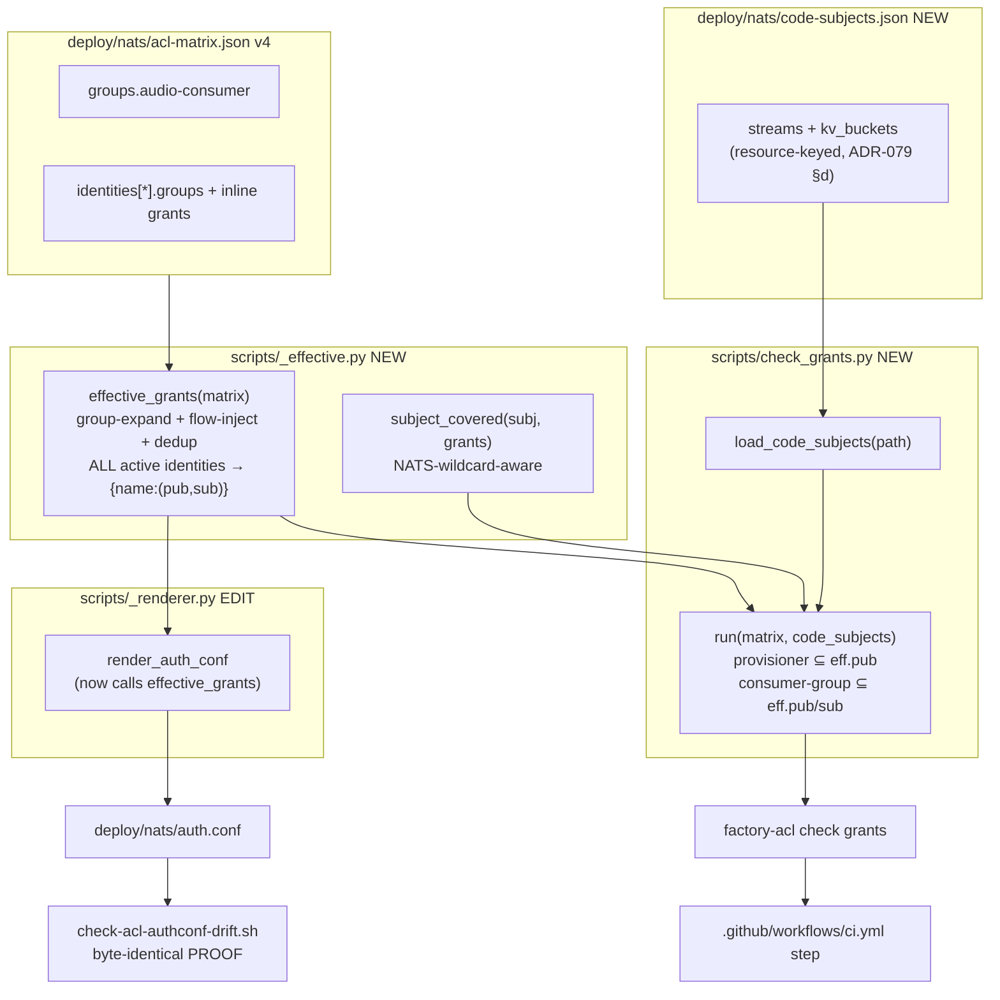
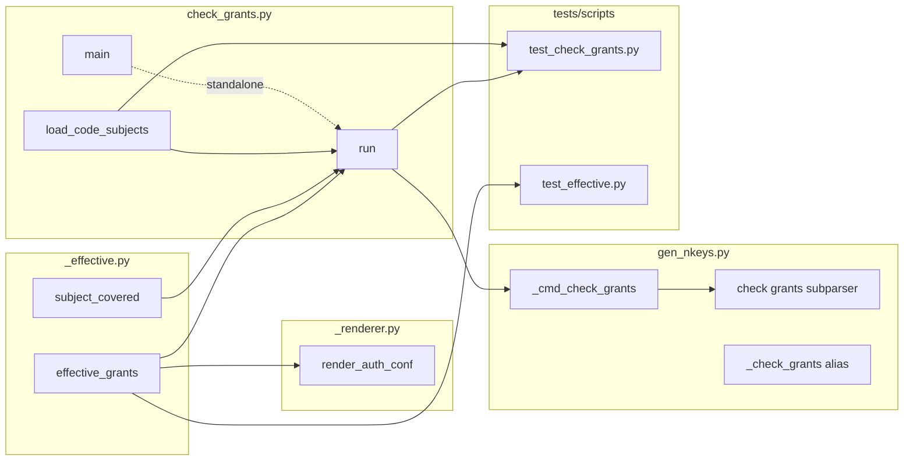

## Summary

Extract the matrix→effective-grants expansion into a shared `scripts/_effective.py`
(called by both `render_auth_conf` and the new gate, so they cannot diverge), then add
`factory-acl check grants` — a CI falsification gate that asserts the NATS subjects the code
requires per stream/KV (manifest `deploy/nats/code-subjects.json`, transcribed verbatim
from ADR-079 §d) are ⊆ each provisioner/consumer identity's effective ACL grants.

## Architecture

### Data flow



### File × Function map



## Bootstrap Context

- **Reuse boundary (the crux, spec constraint #2).** `render_auth_conf` (`_renderer.py:54-98`)
  currently builds effective grants INLINE (L63-73 group-expand, L75-81 flow-inbox inject,
  dedup via `dict.fromkeys`). T1 lifts L59-81 into `effective_grants(matrix) -> dict[str,
  tuple[list[str],list[str]]]` returning **all active identities** (retired skipped, mirroring
  L64). T2 makes the renderer call it. Both the renderer and the gate then share ONE expansion
  path → the 2026-05-29 drift class is structurally impossible.
- **effective_grants includes flow-inbox injection** — behaviour-preserving for the renderer
  (test_renderer.py `TestInboxGrantFromFlow` proves it). Irrelevant to the gate: no manifest
  subject is `_inbox.*` (all are `$JS.API.*`/`$KV.*`/`$JS.ACK.*`), so the injection cannot
  change the gate's verdict. Verified.
- **subject_covered** = the canonical NATS-wildcard matcher (exact / `>` / `.>`). Identical
  semantics to `check_request_reply_flows._subject_covered:27` and `gen_nkeys._subject_covered:129`
  (those two legacy copies stay — out of scope, documented divergence). The ADR §d manifest
  expresses every required subject either as an exact literal or as a `.>`-covered subject, so
  no single-token `.*`-matching is needed (verified against the §d JSON).
- **Manifest SSoT = ADR-079 §d, L291-352, verbatim.** T3 transcribes it; do not re-derive.
  Provisioners: audio stream + KV → `hub`; `LYRA_TURNS` → `turn-writer`. Consumer-group
  `audio-consumer` (audio stream + KV only). `LYRA_TURNS` has no consumer_group (sole consumer).
- **Honest gate strength** (spec §Expected Behavior): hub holds broad `$JS.API.>`, so the audio
  *provisioner* assertion passes trivially. The gate's real bite for audio is the *consumer-group*
  branch (telegram/discord literal grants — where the 6 outage bugs lived); the *provisioner*
  branch bites for `LYRA_TURNS` (turn-writer literal grants). Both correct: gate catches
  *under*-granting, broad grant ≠ under-grant.
- **Exit-code contract** (`tools/CLAUDE.md`): this is a falsification GATE not a reporter →
  0=covered, 1=drift, 2+=script-broke. Consistent with `check flows` (`gen_nkeys.py:175`
  `sys.exit(1)` on drift).
- **Ref patterns:** `scripts/check_request_reply_flows.py` (standalone gate shape: `_REPO_ROOT`
  sys.path shim, argparse, errors→stderr, `sys.exit(1)`); `gen_nkeys.py:286-293` (`ck_flows`
  subparser) + `:312-313` (`_check_flows` alias) + `pyproject.toml:41` (`lyra-check-flows`);
  `tests/scripts/test_check_request_reply_flows.py` (test shape); `tests/scripts/test_renderer.py`
  (`_fake_pubkeys`, `prod_matrix`/`with_retired_matrix` fixtures, `conftest.py`).

## Agents

| Agent instance | Tasks | Files | Subject |
|---|---|---|---|
| backend-dev-A | T1, T2 | `scripts/_effective.py`, `scripts/_renderer.py` | acl-codegen |
| backend-dev-B | T3, T4, T5 | `deploy/nats/code-subjects.json`, `scripts/check_grants.py`, `scripts/gen_nkeys.py`, `pyproject.toml`, `.github/workflows/ci.yml` | acl-gate |
| tester-A | T6, T7 | `tests/scripts/test_check_grants.py`, `tests/scripts/test_effective.py` | acl-tests |

> File-length/folder-size gates glob `src/**` only — `scripts/` and `tests/scripts/` are
> unconstrained. `duplicate_test_basenames` applies: `test_check_grants.py` + `test_effective.py`
> are unique basenames. ✓

## Wave Structure

3 waves, max 3 parallel agents. Elapsed ~1.5 sessions vs ~3 sequential.

| Wave | Trigger | Agents | Tasks |
|------|---------|--------|-------|
| 1 | start | 2 ∥ | backend-dev-A: T1 · backend-dev-B: T3 |
| 2 | W1 done | 3 ∥ | backend-dev-A: T2 · backend-dev-B: T4 · tester-A: T7 |
| 3 | W2 done (T4) | 2 ∥ | backend-dev-B: T5 · tester-A: T6 |

### Budget — per task

| Task | Items | Class | Est. ops | Split? |
|------|-------|-------|----------|--------|
| T1 _effective extract | 2 fns | judgmental | 8 | — |
| T2 renderer refactor | 1 call-site swap | judgmental | 6 | — |
| T3 manifest transcribe | 1 file (ADR verbatim) | bounded | 4 | — |
| T4 check_grants logic | 1 module, 4 guards | judgmental | 12 | — |
| T5 CLI+pyproject+ci wiring | 3 files, mirror flows | bounded | 8 | — |
| T6 gate tests | 6 cases | judgmental | 12 | — |
| T7 effective tests | 3 cases | bounded | 6 | — |

**Total estimated ops: ~56**

### Budget — per agent instance

| Instance | Tasks | Σ ops | Subjects | Split? |
|----------|-------|-------|----------|--------|
| backend-dev-A | T1, T2 | 14 | acl-codegen | — |
| backend-dev-B | T3, T4, T5 | 24 | acl-gate | — (\|tasks\|=3 ≤4, 1 subject) |
| tester-A | T6, T7 | 18 | acl-tests | — |

## Consistency Report

Covered: 15/15 success criteria. Untraced tasks: 0. Exemptions: none.

| SC (spec §Success Criteria) | Task |
|---|---|
| `_effective.py` exports `effective_grants` + `subject_covered` | T1 |
| `render_auth_conf` calls `effective_grants`; test_renderer green | T2 |
| `check-acl-authconf-drift.sh` passes (byte-identical) | T2 (RED-GATE) |
| `code-subjects.json` exists, resource-keyed, 3 entries | T3 |
| `factory-acl check grants` exit 0 on committed matrix+manifest, OK line | T4, T5 |
| `lyra-check-grants` alias resolves | T5 |
| CI step after "Check request-reply flows" | T5 |
| `test_check_grants_passes_on_valid_matrix` | T6 |
| `..._fails_missing_provisioner_subject` (LYRA_TURNS) | T6 |
| `..._fails_missing_consumer_subject` | T6 |
| `..._passes_identity_not_in_group` | T6 |
| `..._fails_missing_provisioner_identity` | T6 |
| `..._fails_dead_consumer_group` | T6 |
| exit-code contract (0/1/2+) honoured | T4, T6 |
| `effective_grants` returns all active identities; test_renderer + drift green | T1, T2, T7 |

## Micro-Tasks

### Slice 1 — Shared effective_grants extraction (backend-dev-A · subject: acl-codegen)

**T1 [GREEN] · diff 3 · no dep · Wave 1** — `scripts/_effective.py` (NEW)
Extract from `_renderer.py:59-81` into a new module:
```python
from scripts._acl_models import LoadedMatrix

def effective_grants(
    matrix: LoadedMatrix,
) -> dict[str, tuple[list[str], list[str]]]:
    """Return {identity_name: (publish, subscribe)} for every ACTIVE identity,
    post group-expansion + flow-inbox injection + dedup. Retired skipped."""
    # group-expand (L63-73) + flow-inject (L75-81) + dict.fromkeys dedup
def subject_covered(subject: str, grants: list[str]) -> bool:
    """NATS-wildcard-aware: exact / '>' / '.>' suffix. Mirrors
    check_request_reply_flows._subject_covered."""
```
Must return an entry for EVERY active identity (incl. group-less + flow-less, e.g. `turn-writer`).
Verify: `uv run pyright scripts/_effective.py` → 0 errors.

**T2 [REFACTOR] · diff 3 · dep T1 · Wave 2** — `scripts/_renderer.py`
Replace the inline expansion (L59-81) with:
```python
from scripts._effective import effective_grants  # top of file
...
grants = effective_grants(matrix)
# emit loop: pub_allow, sub_allow = grants[name]
```
Drop the now-dead inline group/flow loops. Behaviour-preserving — rendered `auth.conf`
byte-identical.
Verify: `uv run pytest tests/scripts/test_renderer.py -q` green **AND**
`bash scripts/check-acl-authconf-drift.sh` → exit 0.

### Slice 2 — Gate + manifest + wiring (backend-dev-B · subject: acl-gate)

**T3 [GREEN] · diff 1 · no dep · Wave 1** — `deploy/nats/code-subjects.json` (NEW)
Transcribe ADR-079 §d JSON **verbatim** (ADR L291-352): `version "1"`, `streams`
(`LYRA_OUTBOUND_AUDIO` provisioner=hub + consumer_group=audio-consumer; `LYRA_TURNS`
provisioner=turn-writer, no consumer_group), `kv_buckets` (`lyra_outbound_audio_sent`
provisioner=hub + consumer_group=audio-consumer). Add a `_comment` field on the
`$KV.lyra_outbound_audio_sent.>` entry noting it is intentionally shared (hub readiness +
consumer dedup), not accidental duplication.
Verify: `uv run python -c "import json; d=json.load(open('deploy/nats/code-subjects.json')); print(sorted(d['streams']), sorted(d['kv_buckets']))"`
→ `['LYRA_OUTBOUND_AUDIO', 'LYRA_TURNS'] ['lyra_outbound_audio_sent']`.

**T4 [GREEN] · diff 3 · dep T1, T3 · Wave 2** — `scripts/check_grants.py` (NEW)
Mirror `check_request_reply_flows.py` shape (`_REPO_ROOT` sys.path shim, argparse `--matrix`
+ `--code-subjects`). Functions:
- `load_code_subjects(path) -> dict` — read+json.load; minimal shape validation (each resource
  has `provisioner` + `provisioner_subjects.publish`); malformed → raise (caller maps to exit 2).
- `run(matrix, code_subjects) -> list[str]` — `grants = effective_grants(matrix)`; for each
  resource in `streams`+`kv_buckets`:
  - provisioner: if `prov not in grants` → FAIL (missing/retired); else assert each
    `provisioner_subjects.publish` ⊆ `grants[prov][0]` via `subject_covered`.
  - if `consumer_group` set: members = `[n for n,i in matrix["identities"].items() if i["status"]=="active" and cg in i.get("groups",[])]`; **empty members → FAIL** (dead group);
    else ∀ member assert `consumer_subjects.publish` ⊆ eff.pub and `consumer_subjects.subscribe`
    (default `[]`) ⊆ eff.sub.
  - FAIL line format: `FAIL: identity 'X' publish[] does not cover required subject 'Y' (stream/kv R, provisioner|consumer-group G)`.
- `main()` — load both, `errors = run(...)`; errors → print to stderr + `sys.exit(1)`; else
  print `check-grants: OK (N resources)`.
Verify: `cd <worktree> && uv run python scripts/check_grants.py --matrix deploy/nats/acl-matrix.json --code-subjects deploy/nats/code-subjects.json; echo $?` → OK line + `0`.

**T5 [GREEN] · diff 3 · dep T4 · Wave 3** — `scripts/gen_nkeys.py` + `pyproject.toml` + `.github/workflows/ci.yml`
- `gen_nkeys.py:272`: `ck_sub = ck.add_subparsers(... metavar="{retired,flows,grants}")`.
- Add `ck_grants` subparser (mirror `ck_flows` L286-293) with `--matrix` (default
  `_DEFAULT_MATRIX`) + `--code-subjects` (default `Path("deploy/nats/code-subjects.json")`);
  `ck_grants.set_defaults(func=_cmd_check_grants)`.
- `_cmd_check_grants(args)`: `from scripts.check_grants import load_code_subjects, run` +
  `load_matrix`; build errors; stderr + `sys.exit(1)` on drift, else OK line. (Thin wrapper —
  reuses `check_grants.run`, no logic copy.)
- `_check_grants()` alias (mirror `_check_flows` L312-313): `main(["check","grants"]+sys.argv[1:])`.
- `pyproject.toml` after L41: `lyra-check-grants = "scripts.gen_nkeys:_check_grants"`.
- `.github/workflows/ci.yml` after the "Check request-reply flows" step (`uv run lyra-check-flows`):
  ```yaml
  - name: Check ACL code coverage (ADR-079)
    run: uv run factory-acl check grants --matrix deploy/nats/acl-matrix.json --code-subjects deploy/nats/code-subjects.json
  ```
Verify: `uv run factory-acl check grants` → exit 0 OK line; `uv run lyra-check-grants` → same;
`uv run factory-acl check --help` lists `grants`.

### Slice 3 — Tests (tester-A · subject: acl-tests)

**T6 [GREEN] · diff 3 · dep T4, T3 · Wave 3** — `tests/scripts/test_check_grants.py` (NEW)
Use `check_grants.run` directly (return `errors` list) + a matrix-mutation helper (deep-copy
the loaded prod matrix / `code_subjects` dict per case). Cases:
- `test_check_grants_passes_on_valid_matrix` — real matrix+manifest → `run()` returns `[]`.
- `test_check_grants_fails_missing_provisioner_subject` — drop `$JS.API.STREAM.CREATE.LYRA_TURNS`
  from `turn-writer` publish → non-empty errors naming it. *(LYRA_TURNS, not audio: hub's broad
  `$JS.API.>` would mask an audio provisioner drop.)*
- `test_check_grants_fails_missing_consumer_subject` — drop a subject from `audio-consumer`
  group publish → errors name the affected member identity.
- `test_check_grants_passes_identity_not_in_group` — an active identity without `audio-consumer`
  is not checked for consumer subjects.
- `test_check_grants_fails_missing_provisioner_identity` — manifest provisioner not in matrix
  (or retired) → errors.
- `test_check_grants_fails_dead_consumer_group` — `consumer_group` exists in matrix `groups`
  but no active identity references it → errors (guards the silent-pass hole).
Verify: `uv run pytest tests/scripts/test_check_grants.py -q` green.

**T7 [GREEN] · diff 2 · dep T1 · Wave 2** — `tests/scripts/test_effective.py` (NEW)
- `test_effective_grants_includes_groupless_identity` — `turn-writer` (no `groups`, no flow)
  present in output with its inline grants.
- `test_effective_grants_expands_groups` — `telegram-adapter` effective publish contains an
  `audio-consumer` group subject not in its inline publish.
- `test_effective_grants_excludes_retired` — retired identity absent (reuse `with_retired_matrix`).
Verify: `uv run pytest tests/scripts/test_effective.py -q` green.

## RED-GATE

- After Slice 1 (T2): `uv run pytest tests/scripts/test_renderer.py -q` green **AND**
  `bash scripts/check-acl-authconf-drift.sh` exit 0 (refactor is byte-identical — the
  prod-safety proof). ← hard gate before Slice 2 builds on the shared fn.
- After Slice 2 (T5): `uv run factory-acl check grants` exit 0 on real matrix+manifest.
- After Slice 3 (T6,T7): `uv run pytest tests/scripts/ -q` green; `uv run ruff check scripts/ tests/scripts/`; `uv run pyright scripts/`.

## Task Seeding Blueprint

<!-- Used by /implement. T-numbers ref this list; instances map to spawned agents. -->

### Wave 1 — no deps, 2 agents ∥

| Task | Agent instance | blockedBy | Subject |
|------|---------------|-----------|---------|
| T1 | backend-dev-A | — | acl-codegen |
| T3 | backend-dev-B | — | acl-gate |

### Wave 2 — after T1 (+T3 for T4), 3 agents ∥

| Task | Agent instance | blockedBy | Subject |
|------|---------------|-----------|---------|
| T2 | backend-dev-A | T1 | acl-codegen |
| T4 | backend-dev-B | T1, T3 | acl-gate |
| T7 | tester-A | T1 | acl-tests |

### Wave 3 — after T4, 2 agents ∥

| Task | Agent instance | blockedBy | Subject |
|------|---------------|-----------|---------|
| T5 | backend-dev-B | T4 | acl-gate |
| T6 | tester-A | T4, T3 | acl-tests |

## Task IDs

<!-- Generated by /plan. Used by /implement to resume tasks on session restart. -->
- T1: 12 — acl-codegen (backend-dev-A)
- T2: 13 — acl-codegen (backend-dev-A)
- T3: 14 — acl-gate (backend-dev-B)
- T4: 15 — acl-gate (backend-dev-B)
- T5: 16 — acl-gate (backend-dev-B)
- T6: 17 — acl-tests (tester-A)
- T7: 18 — acl-tests (tester-A)
