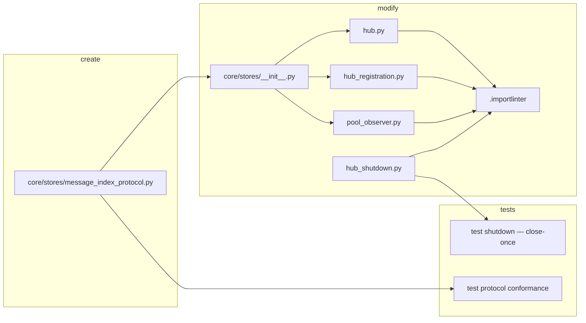

## Summary

Finish ADR-048/078 ownership for the `message_index` store: remove `hub_shutdown`'s redundant
`.close()`, extract a `MessageIndexProtocol` (`resolve` + `upsert`) in `core/stores/`, retype the
3 core consumers, free all 4 `.importlinter` `adr048-transition` exemptions, and document
`memory`'s correct hub-ownership (premise correction — no relocation).

## Architecture

### Data flow

```mermaid
flowchart TD
    subgraph core_stores [core/stores]
        P[MessageIndexProtocol\nresolve + upsert]
        INIT[__init__.py export]
    end
    subgraph core_consumers [core consumers — typed as protocol]
        H[hub.py annotation]
        HR[hub_registration.py set_message_index]
        PO[pool_observer.py register + upsert]
        PV[path_validation.py resolve — via hub attr]
        PM[pool_manager.py passes — via hub attr]
    end
    subgraph infra [infrastructure/stores]
        MI[MessageIndex concrete]
    end
    subgraph bootstrap [bootstrap]
        OS[open_stores finally\nclose once]
    end
    P --> INIT
    INIT --> H & HR & PO
    H -.-> PV & PM
    MI -. implements structural .-> P
    OS -->|owns connect/close| MI
    HS[hub_shutdown.py\nclose REMOVED] -.x.-> MI
    style P fill:#d4edda
    style HS fill:#f8d7da
```

### File × change map



## Agents

| Agent | Instance | Tasks | Files |
|-------|----------|-------|-------|
| backend-dev | backend-dev-A | T1, T3, T4, T5 | hub_shutdown.py, core/stores/*, hub.py, hub_registration.py, pool_observer.py, .importlinter |
| tester | tester-A | T2, T6 | tests/ (shutdown, protocol conformance) |

architect/devops/doc-writer not assigned: protocol mirrors existing `TurnStoreProtocol` pattern
(architect already reviewed spec); `.importlinter` edits are coupled to code (owned by backend-dev-A);
no docs/API surface change.

## Wave Structure

4 waves, max 2 parallel agents. Elapsed ~½ day vs ~1 day sequential.

| Wave | Trigger | Agents | Tasks |
|------|---------|--------|-------|
| 1 | start | 1 (backend-dev-A serial) | backend-dev-A: T1 → T3 |
| 2 | Wave 1 done | 2 ∥ | backend-dev-A: T4 · tester-A: T2 |
| 3 | T4 done | 1 | backend-dev-A: T5 |
| 4 | T5 done | 1 | tester-A: T6 |

### Budget — per task

| Task | Items | Class | Est. ops | Split? |
|------|-------|-------|----------|--------|
| T1 hub_shutdown decouple + exemption 38 + memory comment | 1 | judgmental | 5 | — |
| T2 shutdown close-once test | 1 | judgmental | 5 | — |
| T3 create protocol + export | 2 | bounded | 3 | — |
| T4 retype 3 consumers | 3 | judgmental | 6 | — |
| T5 remove exemptions 34/37/39 | 1 | trivial | 2 | — |
| T6 conformance test + gates | 1 | judgmental | 6 | — |

**Total estimated ops: ~27**

### Budget — per agent instance

| Instance | Tasks | Σ ops | Subjects | Split? |
|----------|-------|-------|----------|--------|
| backend-dev-A | T1, T3, T4, T5 | 16 | message-index | — |
| tester-A | T2, T6 | 11 | message-index | — |

All caps clear (≤4 tasks, ≤50 ops, 1 subject per instance).

## Consistency Report

8/8 spec success-criteria traced. 0 uncovered, 0 untraced.

| SC | Criterion | Task(s) |
|----|-----------|---------|
| SC1 | hub_shutdown no close/import; memory comment | T1 |
| SC2 | MessageIndexProtocol exists + exported, exact sigs | T3 |
| SC3 | concrete MessageIndex satisfies protocol | T3, T6 |
| SC4 | 3 consumers typed to protocol; transitive sites OK | T4 |
| SC5 | 4 exemptions removed; import-layers green | T1 (38), T5 (34/37/39) |
| SC6 | message_index closed exactly once | T1, T2 |
| SC7 | ruff + pyright + pytest green | T6 |
| SC8 | memory unchanged + premise recorded | T1 |

## Micro-Tasks

### V1 — hub_shutdown cleanup

**T1 — Decouple hub_shutdown from message_index** · backend-dev-A · subject: message-index · SC1/SC5/SC6/SC8 · diff 2 · `[P:N]`
- File: `src/lyra/core/hub/hub_shutdown.py`, `.importlinter`
- Do: remove `await self._message_index.close()` (:111) + its `if self._message_index is not None` guard; remove TYPE_CHECKING `MessageIndex` import (:13) + `_message_index` annotation (:35). Retain `_memory.close()` (:105-106); add a comment mirroring the `_turn_store` comment (:107-109): `MemoryManager` is hub-owned (core class, never a bootstrap store) — close belongs here when `_memory` is populated. Remove `.importlinter` line 38 (`hub_shutdown -> message_index`).
- Verify: `grep -n "_message_index" src/lyra/core/hub/hub_shutdown.py` → empty; `uv run lint-imports` (import-layers) → passes.

**T2 — Shutdown close-once test** · tester-A · subject: message-index · SC6/SC7 · diff 3 · `[P:Y w/T3]` · dep: T1 · **RED-GATE V1**
- File: `tests/` (extend existing hub_shutdown/shutdown test, or add)
- Do: assert hub shutdown does NOT call `message_index.close()` (bootstrap owns it) and `open_stores` closes it once; assert `_memory.close()` still invoked when `_memory` set (guard intact).
- Verify: `uv run pytest -k "shutdown" -q` → green.

### V2 — MessageIndexProtocol

**T3 — Create + export MessageIndexProtocol** · backend-dev-A · subject: message-index · SC2/SC3 · diff 2 · `[P:Y]`
- File: `src/lyra/core/stores/message_index_protocol.py` (new), `src/lyra/core/stores/__init__.py`
- Shape:
  ```python
  from typing import Literal, Protocol, runtime_checkable

  @runtime_checkable
  class MessageIndexProtocol(Protocol):
      async def resolve(self, pool_id: str, platform_msg_id: str) -> str | None: ...
      async def upsert(
          self, pool_id: str, platform_msg_id: str | None,
          session_id: str, role: Literal["user", "assistant"],
      ) -> None: ...
  ```
  Mirror `turn_store_protocol.py`. Export `MessageIndexProtocol` from `core/stores/__init__.py`.
- Verify: `uv run python -c "from lyra.core.stores import MessageIndexProtocol"` → no error.

**T4 — Retype 3 core consumers** · backend-dev-A · subject: message-index · SC4 · diff 3 · `[P:N]` · dep: T3
- Files: `src/lyra/core/hub/hub.py` (:36 import, :102 annotation), `src/lyra/core/hub/hub_registration.py` (:17 import, :87 param), `src/lyra/core/pool/pool_observer.py` (:8 import, :57 param, annotation)
- Do: replace concrete `MessageIndex` import/annotation with `MessageIndexProtocol`. `path_validation.py` + `pool_manager.py` need NO change (reach via `hub._message_index`).
- Verify: `grep -rn "infrastructure.stores.message_index" src/lyra/core/` → empty; `uv run pyright src/lyra/core` → 0 new errors.

**T5 — Remove remaining exemptions** · backend-dev-A · subject: message-index · SC5 · diff 1 · `[P:N]` · dep: T4
- File: `.importlinter`
- Do: remove the 3 `message_index` exemption lines (hub, hub_registration, pool_observer — orig 34/37/39).
- Verify: `grep -c "message_index" .importlinter` → 0; `uv run lint-imports` → passes.

**T6 — Conformance test + full gates** · tester-A · subject: message-index · SC3/SC7 · diff 3 · `[P:N]` · dep: T4,T5 · **RED-GATE V2**
- File: `tests/`
- Do: test that concrete `MessageIndex` satisfies `MessageIndexProtocol` (`isinstance(MessageIndex(...), MessageIndexProtocol)` via `@runtime_checkable`, or a pyright-asserted assignment). Run full gates.
- Verify: `uv run pytest -q && uv run pyright && uv run ruff check . && uv run lint-imports` → all green.

## Task Seeding Blueprint

<!-- Used by /implement to seed TaskCreate calls. T-numbers ref this list, not session IDs. -->

### Wave 1 — no deps

| Task | Agent instance | blockedBy | Subject |
|------|---------------|-----------|---------|
| T1 | backend-dev-A | — | message-index |
| T3 | backend-dev-A | — | message-index |

### Wave 2 — after Wave 1

| Task | Agent instance | blockedBy | Subject |
|------|---------------|-----------|---------|
| T2 | tester-A | T1 | message-index |
| T4 | backend-dev-A | T3 | message-index |

### Wave 3 — after T4

| Task | Agent instance | blockedBy | Subject |
|------|---------------|-----------|---------|
| T5 | backend-dev-A | T4 | message-index |

### Wave 4 — after T5

| Task | Agent instance | blockedBy | Subject |
|------|---------------|-----------|---------|
| T6 | tester-A | T4, T5 | message-index |

## Task IDs

<!-- Generated by /plan. Used by /implement to resume tasks on session restart. -->
- T1: 13 — message-index (hub_shutdown decouple)
- T2: 14 — message-index (shutdown close-once test)
- T3: 15 — message-index (create MessageIndexProtocol)
- T4: 16 — message-index (retype consumers)
- T5: 17 — message-index (remove exemptions)
- T6: 18 — message-index (conformance test + gates)
