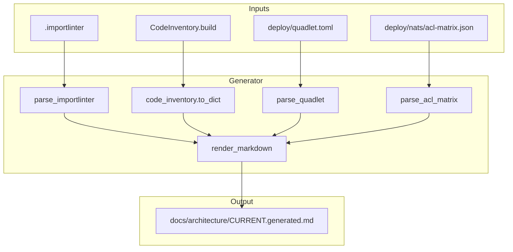

## Summary

Build `tools/generate_architecture_snapshot.py` that consumes `CodeInventory` + `.importlinter` + `quadlet.toml` + `acl-matrix.json` and emits `docs/architecture/CURRENT.generated.md`. Update `check_doc_drift.py` to skip the generated file. Wire a CI step in `.github/workflows/ci.yml` that fails when the doc is stale.

## Architecture

### Data flow



### File × Function map

```mermaid
flowchart LR
    G[tools/generate_architecture_snapshot.py]
    G --> parse_importlinter
    G --> parse_quadlet
    G --> parse_acl_matrix
    G --> render_markdown
    G --> main
    CI[.github/workflows/ci.yml]
    CI --> architecture-snapshot step
    D[tools/check_doc_drift.py]
    D --> _collect_scan_files
    T[tests/tools/test_generate_architecture_snapshot.py]
    T --> test_end_to_end
    T --> test_determinism
    T --> test_error_handling
```

## Agents

| Agent | Tasks | Files | Subjects |
|-------|-------|-------|----------|
| backend-dev-A | T1–T3 | `tools/generate_architecture_snapshot.py` | parser |
| backend-dev-B | T4 | `tools/generate_architecture_snapshot.py` | markdown |
| backend-dev-C | T5 | `tools/check_doc_drift.py` | drift |
| tester-A | T6 | `tests/tools/test_generate_architecture_snapshot.py` | test |
| tester-B | T8–T9 | `tests/tools/test_generate_architecture_snapshot.py` | test, ci |
| devops-A | T7 | `.github/workflows/ci.yml` | ci |

## Wave Structure

2 waves, max 4 parallel agents. Elapsed ~1 day vs ~2 days sequential.

| Wave | Trigger | Agents | Tasks |
|------|---------|--------|-------|
| 1 | start | backend-dev-A, backend-dev-C, tester-A | T1–T3, T5, T6 |
| 2 | Wave 1 done | backend-dev-B, devops-A, tester-B | T4, T7, T8–T9 |

### Budget — per task

| Task | Items | Class | Est. ops | Split? |
|------|-------|-------|----------|--------|
| T1 | 1 | bounded | 3 | — |
| T2 | 1 | bounded | 3 | — |
| T3 | 2 | bounded | 4 | — |
| T4 | 1 | bounded | 3 | — |
| T5 | 1 | trivial | 2 | — |
| T6 | 3 | judgmental | 6 | — |
| T7 | 1 | bounded | 3 | — |
| T8 | 1 | trivial | 2 | — |
| T9 | 1 | bounded | 3 | — |

**Total estimated ops: 29**

### Budget — per agent instance

| Instance | Tasks | Σ ops | Subjects | Split? |
|----------|-------|--------|----------|--------|
| backend-dev-A | T1–T3 | 10 | parser | — |
| backend-dev-B | T4 | 3 | markdown | — |
| backend-dev-C | T5 | 2 | drift | — |
| tester-A | T6 | 6 | test | — |
| tester-B | T8–T9 | 5 | test, ci | — |
| devops-A | T7 | 3 | ci | — |

## Micro-Tasks

### Slice S1 — Generator + gate exclusion

#### T1: CodeInventory pass

- **Description:** Add `CodeInventory.build(root)` call and serialize `to_dict()` output into the generator.
- **File:** `tools/generate_architecture_snapshot.py`
- **Code snippet:**
  ```python
  from tools.code_inventory import CodeInventory

  def build_inventory(root: Path) -> dict[str, object]:
      inventory = CodeInventory.build(root)
      if inventory.syntax_errors:
          print("ERROR: syntax errors in scanned source", file=sys.stderr)
          for path, msg in inventory.syntax_errors:
              print(f"  {path}: {msg}", file=sys.stderr)
          sys.exit(2)
      return inventory.to_dict()
  ```
- **Verify:** `python -c "from tools.generate_architecture_snapshot import build_inventory; print(build_inventory(Path('.'))['modules'][:3])"`
- **Expected:** List of module names
- **Time:** 3 min
- **[P]:** Y
- **Agent:** backend-dev-A
- **Subject:** parser
- **Spec trace:** SC-1, SC-12
- **Slice:** S1
- **Phase:** RED
- **Difficulty:** 2

#### T2: Import-linter pass

- **Description:** Parse `.importlinter` with `configparser` and extract all contracts into a structured dict.
- **File:** `tools/generate_architecture_snapshot.py`
- **Code snippet:**
  ```python
  import configparser

  def parse_importlinter(root: Path) -> list[dict]:
      config = configparser.ConfigParser()
      config.read(root / ".importlinter")
      contracts = []
      for section in config.sections():
          if section.startswith("importlinter:contract:"):
              contracts.append({
                  "name": config.get(section, "name", fallback=""),
                  "type": config.get(section, "type", fallback=""),
                  "layers": _parse_list(config.get(section, "layers", fallback="")),
                  "source_modules": _parse_list(config.get(section, "source_modules", fallback="")),
                  "forbidden_modules": _parse_list(config.get(section, "forbidden_modules", fallback="")),
                  "ignore_imports": _parse_list(config.get(section, "ignore_imports", fallback="")),
                  "allow_indirect_imports": config.getboolean(section, "allow_indirect_imports", fallback=False),
              })
      return sorted(contracts, key=lambda c: c["name"])
  ```
- **Verify:** `python -c "from tools.generate_architecture_snapshot import parse_importlinter; print(len(parse_importlinter(Path('.'))))"`
- **Expected:** `> 0`
- **Time:** 3 min
- **[P]:** Y
- **Agent:** backend-dev-A
- **Subject:** parser
- **Spec trace:** SC-3
- **Slice:** S1
- **Phase:** RED
- **Difficulty:** 2

#### T3: Topology pass

- **Description:** Read `deploy/quadlet.toml` and `deploy/nats/acl-matrix.json` into structured dicts.
- **File:** `tools/generate_architecture_snapshot.py`
- **Code snippet:**
  ```python
  import json
  import tomllib

  def parse_quadlet(root: Path) -> dict:
      with open(root / "deploy" / "quadlet.toml", "rb") as f:
          return tomllib.load(f)

  def parse_acl_matrix(root: Path) -> dict:
      with open(root / "deploy" / "nats" / "acl-matrix.json") as f:
          return json.load(f)
  ```
- **Verify:** `python -c "from tools.generate_architecture_snapshot import parse_quadlet; print(list(parse_quadlet(Path('.'))['component'].keys())[:3])"`
- **Expected:** Component names
- **Time:** 4 min
- **[P]:** Y
- **Agent:** backend-dev-A
- **Subject:** parser
- **Spec trace:** SC-5, SC-6
- **Slice:** S1
- **Phase:** RED
- **Difficulty:** 2

#### T4: Markdown rendering

- **Description:** Compose all inputs into the final markdown document with deterministic sorting.
- **File:** `tools/generate_architecture_snapshot.py`
- **Code snippet:**
  ```python
  def render_markdown(inventory: dict, contracts: list[dict], topology: dict, acl: dict) -> str:
      lines = ["<!-- AUTOGENERATED — DO NOT EDIT BY HAND ... -->", "", "# Architecture Snapshot", ""]
      # Layer Map
      lines.append("## Layer Map")
      for c in contracts:
          lines.append(f"\n### {c['name']}\n- Type: {c['type']}")
      # ... inventory, NATS, topology sections
      lines.append("---")
      lines.append("*Generated by tools/generate_architecture_snapshot.py — DO NOT EDIT BY HAND*")
      return "\n".join(lines)
  ```
- **Verify:** `python tools/generate_architecture_snapshot.py . && head -20 docs/architecture/CURRENT.generated.md`
- **Expected:** Autogenerated header + Architecture Snapshot heading
- **Time:** 3 min
- **[P]:** N (depends on T1–T3)
- **Agent:** backend-dev-A
- **Subject:** markdown
- **Spec trace:** SC-1, SC-2
- **Slice:** S1
- **Phase:** RED
- **Difficulty:** 2

#### RED-GATE S1

- **Verify:** `python tools/generate_architecture_snapshot.py . && test -f docs/architecture/CURRENT.generated.md`
- **Expected:** File exists, exit 0

#### T5: Gate exclusion in check_doc_drift.py

- **Description:** Add skip for `docs/architecture/CURRENT.generated.md` in `_collect_scan_files`.
- **File:** `tools/check_doc_drift.py`
- **Code snippet:**
  ```python
  # After adr_dir skip
  if f.name == "CURRENT.generated.md":
      continue
  ```
- **Verify:** `grep -n "CURRENT.generated.md" tools/check_doc_drift.py`
- **Expected:** Match found
- **Time:** 2 min
- **[P]:** Y
- **Agent:** backend-dev-A
- **Subject:** drift
- **Spec trace:** SC-10
- **Slice:** S1
- **Phase:** RED
- **Difficulty:** 1

#### T6: Test generator end-to-end

- **Description:** Write tests for determinism, error handling, and output structure.
- **File:** `tests/tools/test_generate_architecture_snapshot.py`
- **Code snippet:**
  ```python
  def test_generator_produces_file(tmp_path):
      # Run generator on a temp copy
      # Assert file exists and contains expected sections
  ```
- **Verify:** `uv run pytest tests/tools/test_generate_architecture_snapshot.py -v`
- **Expected:** All pass
- **Time:** 6 min
- **[P]:** N (depends on T4)
- **Agent:** tester-A
- **Subject:** test
- **Spec trace:** SC-1–SC-6
- **Slice:** S1
- **Phase:** GREEN
- **Difficulty:** 3

### Slice S2 — CI integration

#### T7: CI step

- **Description:** Add `architecture-snapshot` step to `.github/workflows/ci.yml` after doc-drift check.
- **File:** `.github/workflows/ci.yml`
- **Code snippet:**
  ```yaml
  - name: Check architecture snapshot freshness
    run: |
      uv run python tools/generate_architecture_snapshot.py .
      git diff --exit-code docs/architecture/CURRENT.generated.md || {
        echo "::error::CURRENT.generated.md is stale. Run the generator and commit."
        exit 1
      }
  ```
- **Verify:** `grep -A5 "architecture snapshot" .github/workflows/ci.yml`
- **Expected:** Step found
- **Time:** 3 min
- **[P]:** N (depends on S1)
- **Agent:** devops-A
- **Subject:** ci
- **Spec trace:** SC-8
- **Slice:** S2
- **Phase:** RED
- **Difficulty:** 2

#### T8: Initial commit of generated doc

- **Description:** Run generator on the worktree and commit `docs/architecture/CURRENT.generated.md`.
- **File:** `docs/architecture/CURRENT.generated.md`
- **Verify:** `git ls-files docs/architecture/CURRENT.generated.md`
- **Expected:** Tracked by git
- **Time:** 2 min
- **[P]:** N (depends on T4)
- **Agent:** tester-A
- **Subject:** test
- **Spec trace:** SC-7
- **Slice:** S2
- **Phase:** GREEN
- **Difficulty:** 1

#### T9: Verify CI integration

- **Description:** Run generator + git diff check locally to simulate CI behavior.
- **Verify:** `python tools/generate_architecture_snapshot.py . && git diff --exit-code docs/architecture/CURRENT.generated.md || echo "Would fail CI"`
- **Expected:** Exit 0 (no diff since we just regenerated)
- **Time:** 3 min
- **[P]:** N (depends on T7, T8)
- **Agent:** tester-A
- **Subject:** ci
- **Spec trace:** SC-8, SC-9
- **Slice:** S2
- **Phase:** GREEN
- **Difficulty:** 2

## Consistency Report

| Spec item | Covered | By task |
|-----------|---------|---------|
| SC-1: script exists and runs | ✓ | T1, T4, T6 |
| SC-2: deterministic output | ✓ | T4, T6 |
| SC-3: Layer Map | ✓ | T2 |
| SC-4: Module/Symbol Inventory | ✓ | T1 |
| SC-5: NATS Subjects & Identities | ✓ | T3 |
| SC-6: Process Topology | ✓ | T3 |
| SC-7: committed to git | ✓ | T8 |
| SC-8: CI job runs | ✓ | T7, T9 |
| SC-9: continue-on-error | ✓ | T7 |
| SC-10: gate exclusion | ✓ | T5 |
| SC-11: header text | ✓ | T4 |
| SC-12: syntax_errors exit 2 | ✓ | T1, T6 |

**Coverage:** 12/12 — full.

## Task Seeding Blueprint

### Wave 1 — no deps, 3 agents ∑

| Task | Agent instance | blockedBy | Subject |
|------|---------------|-----------|---------|
| T1 | backend-dev-A | — | parser |
| T2 | backend-dev-A | — | parser |
| T3 | backend-dev-A | — | parser |
| T5 | backend-dev-C | — | drift |
| T6 | tester-A | — | test |

### Wave 2 — after Wave 1, 3 agents ∑

| Task | Agent instance | blockedBy | Subject |
|------|---------------|-----------|---------|
| T4 | backend-dev-B | T1, T2, T3 | markdown |
| T7 | devops-A | T5 | ci |
| T8 | tester-B | T4 | test |
| T9 | tester-B | T7, T8 | ci |

## Task IDs

<!-- Generated by /plan. Used by /implement to resume tasks on session restart. -->
- T1: 13 — parser
- T2: 22 — parser
- T3: 23 — parser
- T4: 16 — markdown
- T5: 17 — drift
- T6: 18 — test
- T7: 19 — ci
- T8: 20 — test
- T9: 21 — ci
